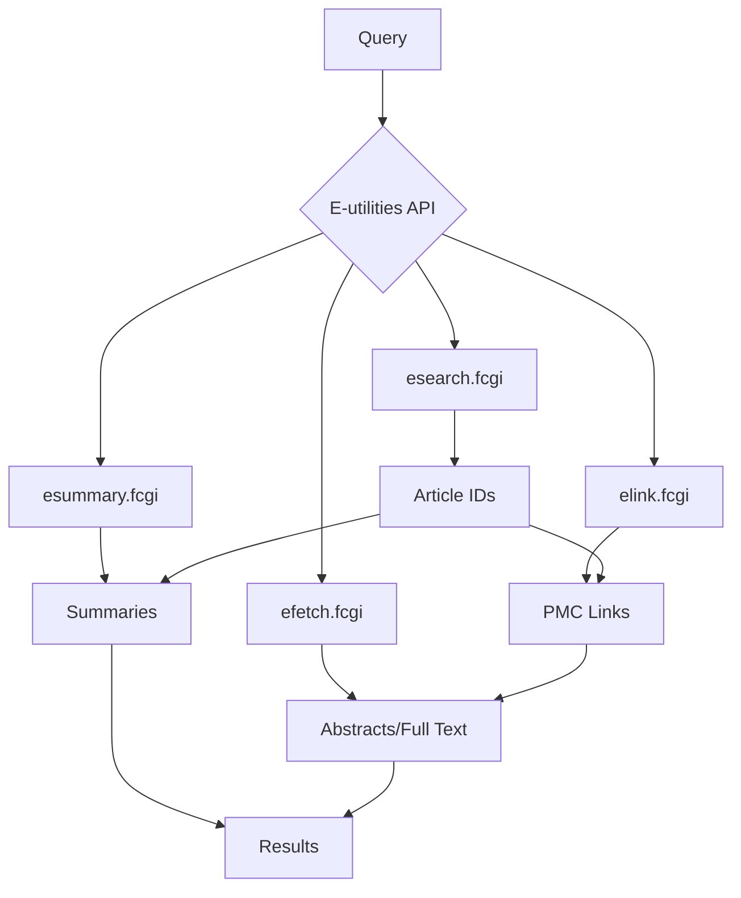
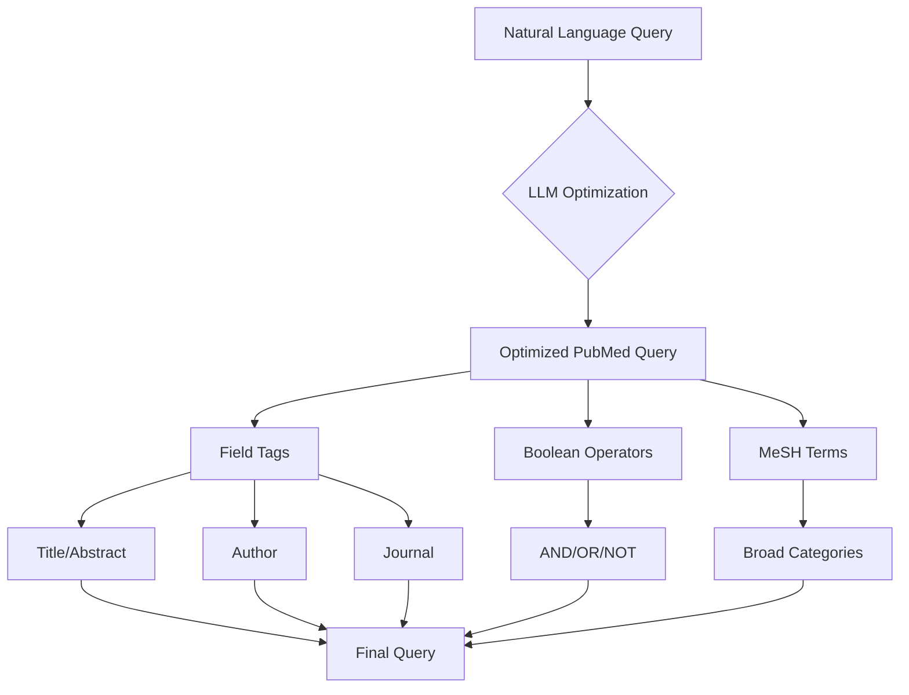
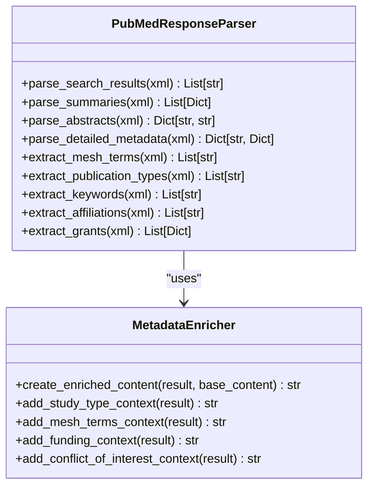
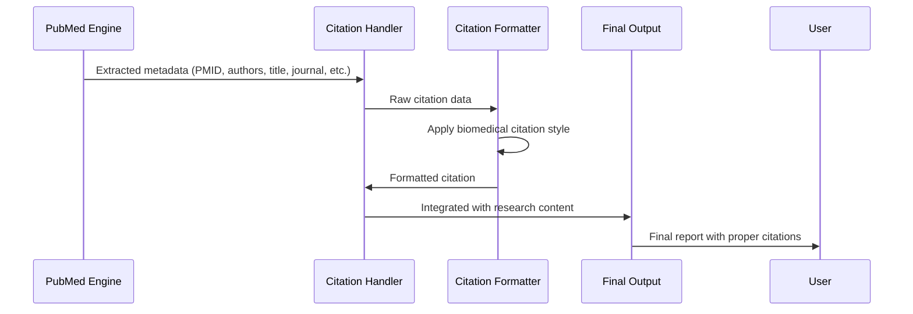
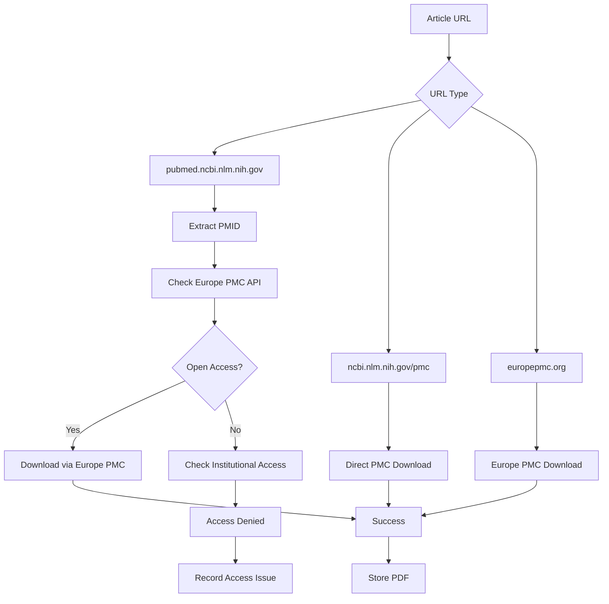
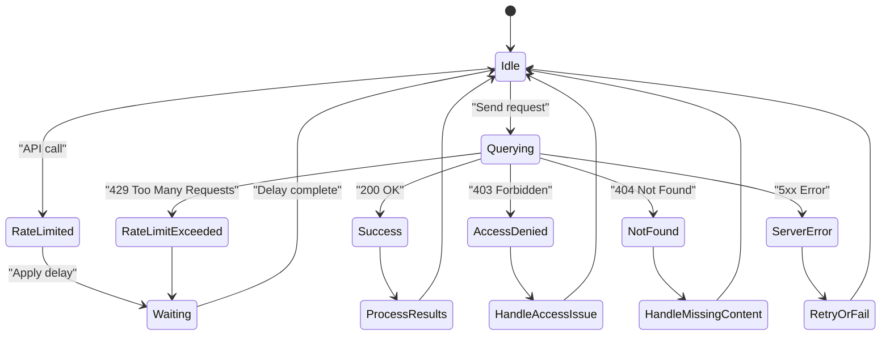

# PubMed Integration

<cite>
**Referenced Files in This Document**   
- [search_engine_pubmed.py](file://src/local_deep_research/web_search_engines/engines/search_engine_pubmed.py)
- [pubmed.py](file://src/local_deep_research/research_library/downloaders/pubmed.py)
- [default_settings.json](file://src/local_deep_research/defaults/default_settings.json)
- [base_citation_handler.py](file://src/local_deep_research/citation_handlers/base_citation_handler.py)
</cite>

## Table of Contents
1. [Introduction](#introduction)
2. [E-utilities API Integration](#e-utilities-api-integration)
3. [Query Construction and Optimization](#query-construction-and-optimization)
4. [Response Parsing and Metadata Extraction](#response-parsing-and-metadata-extraction)
5. [Citation Handler Integration](#citation-handler-integration)
6. [PDF Downloader Implementation](#pdf-downloader-implementation)
7. [Configuration Parameters](#configuration-parameters)
8. [Rate Limiting and Access Challenges](#rate-limiting-and-access-challenges)
9. [Conclusion](#conclusion)

## Introduction
The PubMed search engine integration provides access to biomedical literature from MEDLINE and other life sciences databases through the Entrez Programming Utilities (E-utilities) API. This integration enables researchers to query, retrieve, and analyze scientific publications with comprehensive metadata extraction and full-text access capabilities. The system is designed to handle complex biomedical queries while managing API constraints and access limitations.

## E-utilities API Integration
The integration with PubMed's E-utilities API follows a structured approach using multiple endpoints to retrieve different types of information. The system implements a two-phase search process that first identifies relevant articles and then retrieves detailed metadata and content.

**Diagram sources**
- [search_engine_pubmed.py](file://src/local_deep_research/web_search_engines/engines/search_engine_pubmed.py#L97-L105)

**Section sources**
- [search_engine_pubmed.py](file://src/local_deep_research/web_search_engines/engines/search_engine_pubmed.py#L97-L105)

## Query Construction and Optimization
The system employs sophisticated query construction techniques to transform natural language queries into optimized PubMed search syntax. This process leverages a language model to convert questions into effective keyword-based queries using Boolean operators, MeSH terms, and field-specific searches.

The query optimization process follows strict rules to ensure compatibility with PubMed's search syntax:
- Uses parentheses around OR statements: (term1[Field] OR term2[Field])
- Applies basic MeSH terms with broad categories
- Focuses on Title/Abstract searches for reliability
- Employs wildcards for variations: vaccin*[Title/Abstract]
- Avoids date restrictions in the initial query formulation

**Diagram sources**
- [search_engine_pubmed.py](file://src/local_deep_research/web_search_engines/engines/search_engine_pubmed.py#L215-L383)

**Section sources**
- [search_engine_pubmed.py](file://src/local_deep_research/web_search_engines/engines/search_engine_pubmed.py#L215-L383)

## Response Parsing and Metadata Extraction
The system parses XML responses from the E-utilities API to extract structured metadata from biomedical articles. This process involves multiple stages of data retrieval and enrichment to provide comprehensive information for each publication.

The metadata extraction process captures comprehensive information including:
- Article titles and publication dates
- Author lists and institutional affiliations
- Journal names and publication types
- Medical Subject Headings (MeSH) terms
- Keywords and grant information
- Conflict of interest statements
- Digital Object Identifiers (DOI)
- PubMed IDs (PMID) and PMC IDs (PMCID)

**Diagram sources**
- [search_engine_pubmed.py](file://src/local_deep_research/web_search_engines/engines/search_engine_pubmed.py#L647-L998)

**Section sources**
- [search_engine_pubmed.py](file://src/local_deep_research/web_search_engines/engines/search_engine_pubmed.py#L647-L998)

## Citation Handler Integration
The PubMed integration seamlessly connects with the citation handler system to ensure accurate biomedical referencing. This integration processes extracted metadata to generate properly formatted citations that maintain academic integrity and enable proper attribution.

The citation handling process includes:
- Validation of all extracted metadata fields
- Standardization of author names and journal abbreviations
- Proper formatting according to biomedical citation standards
- Integration of citation markers within the research content
- Generation of complete reference lists

**Diagram sources**
- [base_citation_handler.py](file://src/local_deep_research/citation_handlers/base_citation_handler.py)
- [search_engine_pubmed.py](file://src/local_deep_research/web_search_engines/engines/search_engine_pubmed.py)

**Section sources**
- [base_citation_handler.py](file://src/local_deep_research/citation_handlers/base_citation_handler.py)

## PDF Downloader Implementation
The PDF downloader component enables retrieval of full-text articles when available through PubMed Central (PMC). This implementation handles various access scenarios and provides detailed feedback on download outcomes.

The downloader implements multiple strategies to maximize successful retrieval:
- Primary attempt through Europe PMC's reliable API
- Fallback to NCBI PMC with appropriate headers
- Rate limiting to comply with API policies
- Detailed error classification for access issues
- Support for both PDF and full-text XML extraction

**Diagram sources**
- [pubmed.py](file://src/local_deep_research/research_library/downloaders/pubmed.py)

**Section sources**
- [pubmed.py](file://src/local_deep_research/research_library/downloaders/pubmed.py)

## Configuration Parameters
The PubMed integration offers extensive configuration options to customize search behavior and results presentation. These parameters can be adjusted to meet specific research requirements and constraints.

### Configuration Options
| Parameter | Default Value | Description |
|---------|-------------|-------------|
| max_results | 25 | Maximum number of search results (minimum 25) |
| api_key | "" | NCBI API key for higher rate limits |
| days_limit | None | Limit results to N days |
| get_abstracts | true | Fetch abstracts for all results |
| get_full_text | false | Retrieve full text content when available |
| full_text_limit | 3 | Maximum number of full-text articles to retrieve |
| optimize_queries | true | Transform natural language queries for PubMed |
| include_publication_type_in_context | true | Show publication type in results |
| include_journal_in_context | true | Include journal name in results |
| include_year_in_context | true | Show publication year |
| include_authors_in_context | false | Include author list |
| include_mesh_terms_in_context | true | Display MeSH terms |
| include_keywords_in_context | true | Show article keywords |
| max_mesh_terms | 3 | Maximum MeSH terms to display (0 for all) |
| max_keywords | 3 | Maximum keywords to display (0 for all) |

These configuration parameters are defined in the system settings and can be modified through the application interface or configuration files.

**Section sources**
- [default_settings.json](file://src/local_deep_research/defaults/default_settings.json#L2988-L3126)

## Rate Limiting and Access Challenges
The PubMed integration addresses API rate limiting and access challenges through a comprehensive strategy that balances efficient querying with compliance requirements.

### Rate Limiting Strategy
The system implements a 3 requests/second rate limit as required by NCBI's API policies. This is managed through:
- Built-in rate limiting with configurable delays
- Adaptive search strategies that minimize API calls
- Error handling for rate limit exceeded responses
- API key support for higher rate limits (up to 10 requests/second)

### Access Challenges
The integration handles various access challenges including:
- **Non-English abstracts**: The system identifies and flags non-English content for user awareness
- **Paywalled content**: Detailed classification of access issues with specific reasons
- **Institutional subscriptions**: Support for proxy access and authentication
- **Embargoed articles**: Detection and notification of temporary access restrictions

The system provides detailed feedback on access issues, including specific reasons such as:
- "Article requires subscription to [journal name]"
- "No PDF version available for this article"
- "PMC article not accessible - may be retracted or embargoed"
- "Article not found (404) - may have been removed or URL is incorrect"

**Diagram sources**
- [search_engine_pubmed.py](file://src/local_deep_research/web_search_engines/engines/search_engine_pubmed.py#L130-L132)
- [pubmed.py](file://src/local_deep_research/research_library/downloaders/pubmed.py#L119-L125)

**Section sources**
- [search_engine_pubmed.py](file://src/local_deep_research/web_search_engines/engines/search_engine_pubmed.py#L130-L132)
- [pubmed.py](file://src/local_deep_research/research_library/downloaders/pubmed.py#L119-L125)

## Conclusion
The PubMed integration provides a robust solution for accessing biomedical literature through the E-utilities API. By combining sophisticated query optimization, comprehensive metadata extraction, and intelligent access management, the system enables researchers to efficiently discover and analyze scientific publications. The integration with citation handling and PDF downloading capabilities ensures a complete workflow from discovery to full-text access, while respecting API limitations and access constraints. This implementation supports evidence-based research by providing reliable access to the latest biomedical knowledge.