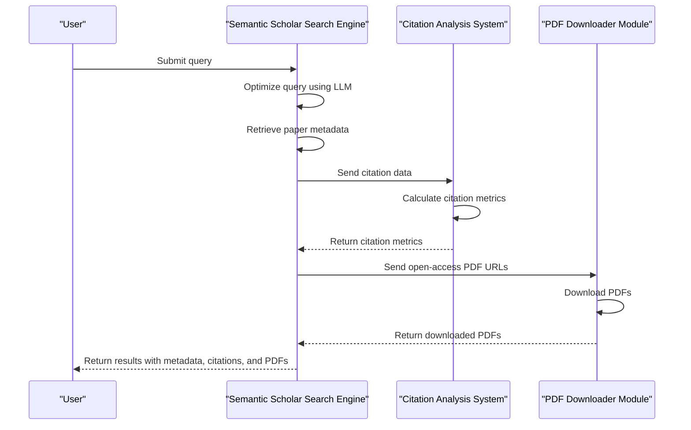

# Semantic Scholar Integration

<cite>
**Referenced Files in This Document**   
- [settings_semantic_scholar.json](file://src/local_deep_research/defaults/settings_semantic_scholar.json)
- [search_engine_semantic_scholar.py](file://src/local_deep_research/web_search_engines/engines/search_engine_semantic_scholar.py)
- [semantic_scholar.py](file://src/local_deep_research/research_library/downloaders/semantic_scholar.py)
- [search_engine_base.py](file://src/local_deep_research/web_search_engines/search_engine_base.py)
- [search_config.py](file://src/local_deep_research/config/search_config.py)
</cite>

## Table of Contents
1. [Introduction](#introduction)
2. [Configuration Options](#configuration-options)
3. [Query Capabilities](#query-capabilities)
4. [Data Extraction](#data-extraction)
5. [Integration with Citation Analysis and PDF Downloader](#integration-with-citation-analysis-and-pdf-downloader)
6. [Limitations and Considerations](#limitations-and-considerations)

## Introduction
The Semantic Scholar search engine integration provides access to a vast repository of academic papers across scientific fields. This integration leverages the Semantic Scholar API to retrieve enriched metadata, including citation counts, influential citations, and machine-learned relevance scores. The system is designed to support comprehensive research workflows by combining advanced query capabilities with structured data extraction and integration with citation analysis and PDF downloading modules.

**Section sources**
- [settings_semantic_scholar.json](file://src/local_deep_research/defaults/settings_semantic_scholar.json#L1-L276)
- [search_engine_semantic_scholar.py](file://src/local_deep_research/web_search_engines/engines/search_engine_semantic_scholar.py#L1-L648)

## Configuration Options
The Semantic Scholar integration offers several configuration options to tailor the search experience. These include result ranking strategies, minimum citation thresholds, and domain-specific filters. The configuration is managed through a JSON file that defines parameters such as the maximum number of results, whether to fetch abstracts, citations, and references, and the use of LLM to optimize queries.

Key configuration parameters include:
- **Max Results**: Maximum number of results to retrieve.
- **Get TLDR Summaries**: Fetch AI-generated TLDR summaries for papers.
- **Get Abstracts**: Fetch full abstracts for papers.
- **Get Citations**: Fetch citation information for papers.
- **Get References**: Fetch reference information for papers.
- **Citation Limit**: Maximum number of citations to fetch per paper.
- **Reference Limit**: Maximum number of references to fetch per paper.
- **Optimize Queries**: Use LLM to optimize natural language queries for better search results.

**Section sources**
- [settings_semantic_scholar.json](file://src/local_deep_research/defaults/settings_semantic_scholar.json#L121-L232)

## Query Capabilities
The Semantic Scholar integration supports a range of query capabilities, including keyword search, author disambiguation, and field-of-study filtering. The system uses an adaptive search approach that adjusts based on result volume, leveraging LLM to generate better fallback queries when necessary.

### Keyword Search
The integration supports natural language queries that are optimized for academic search. The system extracts key academic concepts, technical terms, and proper nouns, removing generic words and filler terms to create a more focused search query.

### Author Disambiguation
The system can disambiguate authors by leveraging the Semantic Scholar API's ability to distinguish between authors with similar names based on their affiliations and publication history.

### Field-of-Study Filtering
Users can filter results by specific fields of study, such as computer science, biology, or physics. This is particularly useful for narrowing down results in interdisciplinary research.

**Section sources**
- [search_engine_semantic_scholar.py](file://src/local_deep_research/web_search_engines/engines/search_engine_semantic_scholar.py#L323-L438)

## Data Extraction
The Semantic Scholar integration extracts structured data from academic papers, including the paper title, authors with affiliations, abstract, year, venue, citation velocity, and open-access PDF URLs. This data is retrieved through the Semantic Scholar API and formatted for use in the research workflow.

### Paper Metadata
The system retrieves comprehensive metadata for each paper, including:
- **Title**: The title of the paper.
- **Authors**: A list of authors with their affiliations.
- **Abstract**: The full abstract of the paper.
- **Year**: The year of publication.
- **Venue**: The conference or journal where the paper was published.
- **Citation Count**: The number of times the paper has been cited.
- **Open Access PDF URL**: The URL to the open-access PDF of the paper.

### Citation and Reference Information
The integration can fetch citation and reference information for papers, allowing users to explore the citation graph and understand the context of a paper within the academic literature.

**Section sources**
- [search_engine_semantic_scholar.py](file://src/local_deep_research/web_search_engines/engines/search_engine_semantic_scholar.py#L266-L304)
- [search_engine_semantic_scholar.py](file://src/local_deep_research/web_search_engines/engines/search_engine_semantic_scholar.py#L450-L484)

## Integration with Citation Analysis and PDF Downloader
The Semantic Scholar integration is tightly coupled with the citation analysis system and PDF downloader module, enabling a seamless research workflow. The citation analysis system uses the extracted citation data to provide insights into the influence and relevance of papers, while the PDF downloader module retrieves the full text of open-access papers for in-depth analysis.

### Citation Analysis
The citation analysis system leverages the citation data retrieved from Semantic Scholar to calculate metrics such as citation velocity and influential citations. These metrics help users identify seminal papers and track the impact of research over time.

### PDF Downloader
The PDF downloader module uses the open-access PDF URLs provided by Semantic Scholar to download the full text of papers. The downloader is designed to handle rate limiting and retries, ensuring reliable access to academic literature.

**Diagram sources**
- [search_engine_semantic_scholar.py](file://src/local_deep_research/web_search_engines/engines/search_engine_semantic_scholar.py#L1-L648)
- [semantic_scholar.py](file://src/local_deep_research/research_library/downloaders/semantic_scholar.py#L1-L176)

**Section sources**
- [search_engine_semantic_scholar.py](file://src/local_deep_research/web_search_engines/engines/search_engine_semantic_scholar.py#L1-L648)
- [semantic_scholar.py](file://src/local_deep_research/research_library/downloaders/semantic_scholar.py#L1-L176)

## Limitations and Considerations
While the Semantic Scholar integration provides powerful capabilities for academic research, there are several limitations and considerations to keep in mind.

### API Rate Limits
The Semantic Scholar API enforces rate limits, which can be mitigated by using an API key. Without an API key, the rate limits are lower, potentially affecting the speed and volume of data retrieval.

### Incomplete Coverage in Non-Technical Fields
The coverage of papers in non-technical fields such as humanities and social sciences may be incomplete compared to technical fields like computer science and biology.

### Handling of Duplicate Entries
The system may encounter duplicate entries across different sources. The integration includes mechanisms to identify and handle duplicates, but users should be aware of the potential for redundancy in the results.

**Section sources**
- [settings_semantic_scholar.json](file://src/local_deep_research/defaults/settings_semantic_scholar.json#L267-L272)
- [search_engine_semantic_scholar.py](file://src/local_deep_research/web_search_engines/engines/search_engine_semantic_scholar.py#L190-L192)