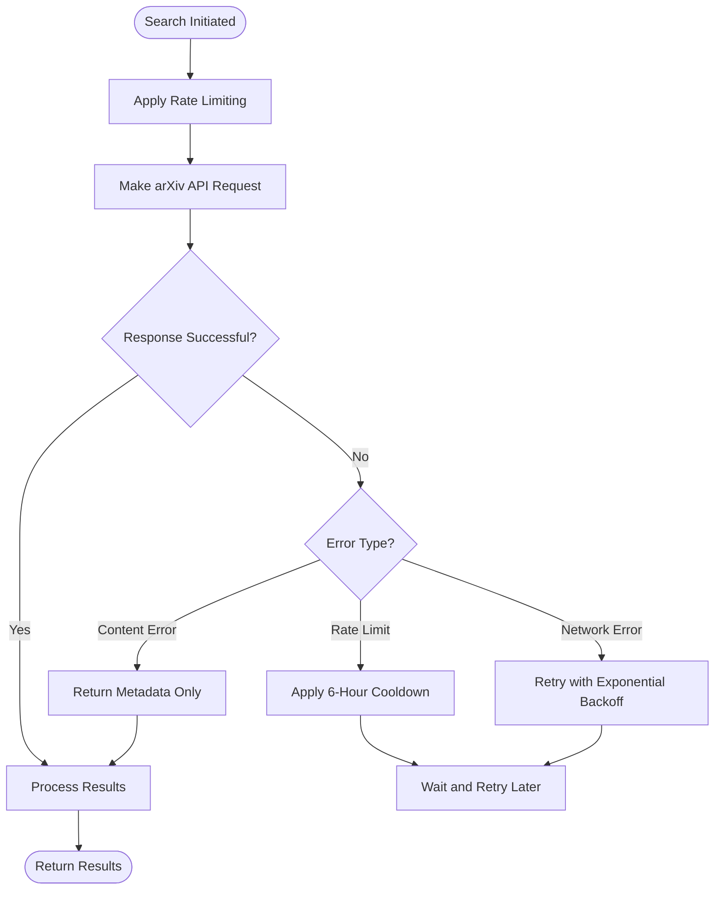

# arXiv Integration

<cite>
**Referenced Files in This Document**   
- [search_engine_arxiv.py](file://src/local_deep_research/web_search_engines/engines/search_engine_arxiv.py)
- [search_config.py](file://src/local_deep_research/config/search_config.py)
- [default_settings.json](file://src/local_deep_research/defaults/default_settings.json)
- [failure_classifier.py](file://src/local_deep_research/library/download_management/failure_classifier.py)
- [test_search_engine_arxiv.py](file://tests/search_engines/test_search_engine_arxiv.py)
</cite>

## Table of Contents
1. [Introduction](#introduction)
2. [arXiv API Utilization](#arxiv-api-utilization)
3. [Metadata Extraction and Normalization](#metadata-extraction-and-normalization)
4. [Configuration Options](#configuration-options)
5. [PDF Downloader Integration](#pdf-downloader-integration)
6. [Rate Limiting and Error Handling](#rate-limiting-and-error-handling)
7. [Query Optimization Best Practices](#query-optimization-best-practices)

## Introduction
The arXiv integration provides a specialized search engine for retrieving pre-print scientific papers across various domains including physics, mathematics, computer science, and related fields. Built on the arXiv API, this integration enables researchers to access cutting-edge research before formal publication. The system implements a two-phase retrieval approach that first identifies relevant papers through metadata analysis, then optionally retrieves full-text content through PDF downloads. This documentation details the implementation, configuration, and best practices for effectively utilizing the arXiv search capabilities within the research workflow.

## arXiv API Utilization
The arXiv search engine leverages the official arXiv API through the `arxiv` Python package to retrieve pre-print papers. The integration follows a two-phase retrieval approach that optimizes both relevance and efficiency. In the first phase, the system queries the arXiv API to retrieve metadata for papers matching the search query. This metadata includes titles, abstracts, authors, categories, and other relevant information that allows for preliminary relevance assessment.

Query construction supports both simple keyword searches and advanced syntax using arXiv categories and operators. The search engine maps user queries to the arXiv API's search syntax, allowing for sophisticated queries that can target specific domains of research. For example, users can search within specific arXiv categories such as "cs.AI" for computer science and artificial intelligence, "physics.optics" for physics and optics, or "math.NT" for mathematics and number theory.

The integration supports multiple sorting options to organize results based on relevance, submission date, or last update date. Results can be sorted in ascending or descending order, allowing researchers to find either the most recent papers or the most established work in a field. The search client is configured with appropriate page sizes and result limits to balance comprehensive coverage with performance considerations.

**Section sources**
- [search_engine_arxiv.py](file://src/local_deep_research/web_search_engines/engines/search_engine_arxiv.py#L1-L145)
- [test_search_engine_arxiv.py](file://tests/search_engines/test_search_engine_arxiv.py#L1-L274)

## Metadata Extraction and Normalization
The arXiv integration extracts and normalizes several key metadata fields from retrieved papers to ensure consistent processing within the system. The primary metadata fields include:

- **Title**: The full title of the paper, preserved exactly as provided by arXiv
- **Authors**: A list of author names, with full author lists available in the complete metadata
- **Abstract**: The paper's abstract, which is used as the primary content when full-text retrieval is not enabled
- **Categories**: The arXiv categories assigned to the paper, which indicate its primary research domain
- **DOI**: The Digital Object Identifier when available, providing a persistent link to the paper
- **PDF URL**: The direct URL to download the paper's PDF version

The system normalizes this metadata by standardizing date formats, ensuring consistent encoding, and structuring the data into a uniform format regardless of the source. The abstract is processed to remove excessive whitespace and ensure proper paragraph breaks. Author names are preserved in their original format as provided by arXiv, maintaining consistency with academic citation standards.

For papers with multiple versions, the system captures the version information and ensures that the most recent version is prioritized in results. The metadata extraction process also preserves the distinction between the primary category and additional categories, allowing for more nuanced filtering and analysis of research domains.

**Section sources**
- [search_engine_arxiv.py](file://src/local_deep_research/web_search_engines/engines/search_engine_arxiv.py#L127-L173)
- [search_engine_arxiv.py](file://src/local_deep_research/web_search_engines/engines/search_engine_arxiv.py#L190-L349)

## Configuration Options
The arXiv search engine provides several configurable options to tailor the search behavior to specific research needs. These options can be set globally through the system configuration or specified programmatically for individual searches.

The **result limits** configuration controls the maximum number of papers retrieved in a single search. By default, the system enforces a minimum of 25 results to ensure comprehensive coverage, but this can be increased to retrieve more papers. The `max_results` parameter sets the upper limit for the initial search phase.

**Date range filtering** is implemented through the search query construction, allowing researchers to focus on recent developments or historical research. While the arXiv API does not provide direct date range parameters, the system can construct queries that include date-based constraints using the API's search syntax.

**Category-specific searches** are supported through the `search_by_category` method, which allows targeting specific arXiv categories. This is particularly useful for researchers focusing on specialized domains within broader scientific fields. The system also supports author-based searches through the `search_by_author` method, enabling literature reviews focused on specific researchers' work.

Additional configuration options include:
- `include_full_text`: Whether to download and process PDFs for full-text content
- `download_dir`: Directory for storing downloaded PDFs
- `max_full_text`: Maximum number of PDFs to download and process in a single search
- `sort_by`: Criteria for sorting results (relevance, lastUpdatedDate, submittedDate)
- `sort_order`: Sort direction (ascending or descending)

**Section sources**
- [search_engine_arxiv.py](file://src/local_deep_research/web_search_engines/engines/search_engine_arxiv.py#L25-L75)
- [default_settings.json](file://src/local_deep_research/defaults/default_settings.json#L1281-L1411)

## PDF Downloader Integration
The arXiv integration includes direct integration with the PDF downloader module to provide access to full-text papers. When the `include_full_text` option is enabled, the system automatically downloads the PDF versions of relevant papers and extracts their text content for analysis.

The PDF download process is rate-limited and managed through the system's adaptive rate limiting framework to prevent overwhelming the arXiv servers. Downloads are performed sequentially to respect the 1000 requests per hour limit, with appropriate delays between requests. The `max_full_text` parameter limits the number of PDFs processed in a single search, preventing excessive resource usage and ensuring timely results.

Text extraction from PDFs is performed using multiple libraries for reliability. The system first attempts to extract text using PyPDF2, and if that fails or returns insufficient content, it falls back to pdfplumber. This dual-library approach increases the success rate of text extraction across different PDF formats and quality levels.

Downloaded PDFs are stored in the specified `download_dir`, and their paths are included in the result metadata. The extracted text is normalized by removing page numbers, headers, and footers, and is structured to preserve the original document's paragraph breaks and section organization. This processed text is then available for full-text analysis, citation extraction, and integration into research summaries.

**Section sources**
- [search_engine_arxiv.py](file://src/local_deep_research/web_search_engines/engines/search_engine_arxiv.py#L190-L349)
- [failure_classifier.py](file://src/local_deep_research/library/download_management/failure_classifier.py#L80-L184)

## Rate Limiting and Error Handling
The arXiv integration implements comprehensive rate limiting and error handling to ensure reliable operation within the API's constraints. The system respects the arXiv API's limit of 1000 requests per hour through an adaptive rate limiting framework that learns optimal wait times based on historical success rates.

When a rate limit is encountered, the system raises a `RateLimitError` with detailed information about the domain and suggested cooldown period. For arXiv specifically, the system applies a 6-hour cooldown period when rate-limited, as defined in the `RateLimitFailure` class. This prevents aggressive retry attempts that could lead to extended blocking.

The integration handles several common issues that can arise during arXiv searches:

**Incomplete metadata** is addressed by implementing fallback mechanisms and graceful degradation. When certain fields are missing from the API response, the system handles these cases without failing the entire search. For example, if publication dates are missing, the system can still include the paper in results with null date values.

**Versioned submissions** are handled by retrieving the most recent version of a paper by default. The system preserves version information in the metadata, allowing researchers to track the evolution of a paper through multiple submissions. When multiple versions exist, the system prioritizes the latest version while maintaining access to previous versions through the arXiv ID.

Network errors and API failures are caught and handled gracefully, with appropriate logging and fallback behaviors. The system distinguishes between temporary failures (which can be retried) and permanent failures (which should not be retried). For example, a 503 Service Unavailable error is treated as a temporary failure with a 1-hour cooldown, while an HTML response when expecting a PDF is treated as a permanent failure.

**Diagram sources**
- [search_engine_arxiv.py](file://src/local_deep_research/web_search_engines/engines/search_engine_arxiv.py#L117-L124)
- [failure_classifier.py](file://src/local_deep_research/library/download_management/failure_classifier.py#L80-L116)

**Section sources**
- [search_engine_arxiv.py](file://src/local_deep_research/web_search_engines/engines/search_engine_arxiv.py#L174-L188)
- [failure_classifier.py](file://src/local_deep_research/library/download_management/failure_classifier.py#L80-L184)

## Query Optimization Best Practices
To maximize the effectiveness of arXiv searches and reduce noise in results, researchers should follow several best practices for query construction and search configuration.

For **physics research**, use specific arXiv categories to target subfields precisely. For example, instead of searching broadly for "quantum computing," use the category "quant-ph" to focus on quantum physics papers. Combine category searches with specific terminology to further refine results. When researching experimental physics, include terms like "experimental," "measurement," or "apparatus" to distinguish theoretical papers from experimental work.

In **mathematics research**, leverage the hierarchical nature of arXiv categories to find papers at the appropriate level of specialization. Start with broader categories like "math" and then narrow to specific subfields like "math.NT" for number theory or "math.GT" for geometric topology. Use precise mathematical terminology in queries, as arXiv papers typically use standard nomenclature that matches search terms closely.

For **computer science research**, particularly in artificial intelligence and machine learning, combine category searches with methodological terms. For example, search within "cs.LG" (machine learning) for papers that also mention specific architectures like "transformer" or "diffusion model." When researching applied AI, include application domain terms alongside technical terms to find papers that bridge theory and practice.

General best practices include:
- Use category-specific searches rather than broad keyword searches when possible
- Limit full-text PDF downloads to the most relevant papers to conserve resources
- Sort by "lastUpdatedDate" when tracking recent developments in fast-moving fields
- Use the two-phase search approach to first identify relevant papers through metadata before downloading full texts
- Set appropriate result limits based on the comprehensiveness needed for the research task
- Combine arXiv searches with other search engines to ensure comprehensive literature coverage

By following these practices, researchers can optimize their queries to improve relevance, reduce noise, and efficiently navigate the vast corpus of pre-print research available through arXiv.

**Section sources**
- [search_engine_arxiv.py](file://src/local_deep_research/web_search_engines/engines/search_engine_arxiv.py#L489-L493)
- [search_engine_arxiv.py](file://src/local_deep_research/web_search_engines/engines/search_engine_arxiv.py#L496-L519)