# Lightweight Alternatives

<cite>
**Referenced Files in This Document**   
- [search_engine_ddg.py](file://src/local_deep_research/web_search_engines/engines/search_engine_ddg.py)
- [search_engine_brave.py](file://src/local_deep_research/web_search_engines/engines/search_engine_brave.py)
- [search_engine_base.py](file://src/local_deep_research/web_search_engines/search_engine_base.py)
- [search_engines_config.py](file://src/local_deep_research/web_search_engines/search_engines_config.py)
- [search_config.py](file://src/local_deep_research/config/search_config.py)
- [tracker.py](file://src/local_deep_research/web_search_engines/rate_limiting/tracker.py)
- [test_search_engine_ddg.py](file://tests/search_engines/test_search_engine_ddg.py)
- [test_search_engine_brave.py](file://tests/search_engines/test_search_engine_brave.py)
</cite>

## Table of Contents
1. [Introduction](#introduction)
2. [Privacy-Preserving Architecture](#privacy-preserving-architecture)
3. [API Usage and Configuration](#api-usage-and-configuration)
4. [Query Limitations and Result Formatting](#query-limitations-and-result-formatting)
5. [Response Handling and Snippet Extraction](#response-handling-and-snippet-extraction)
6. [Rate Limit Management](#rate-limit-management)
7. [Integration Configuration](#integration-configuration)
8. [Common Issues and Troubleshooting](#common-issues-and-troubleshooting)
9. [Performance Optimization](#performance-optimization)
10. [Conclusion](#conclusion)

## Introduction

This document provides comprehensive documentation for lightweight search alternatives DuckDuckGo and Brave Search within the local-deep-research system. Both services offer privacy-preserving search capabilities suitable for rapid, low-cost queries in research workflows. The document covers their architectural implementation, API usage patterns, configuration options, and integration strategies for use as fallback options or during preliminary research phases.

DuckDuckGo and Brave Search are implemented as public, generic search engines within the system, designed to provide web search capabilities without requiring API keys (DuckDuckGo) or with optional API key authentication (Brave Search). Both engines follow a two-phase retrieval approach that first obtains preview information and then retrieves full content for relevant results, optimizing both speed and relevance.

**Section sources**
- [search_engine_ddg.py](file://src/local_deep_research/web_search_engines/engines/search_engine_ddg.py#L1-L20)
- [search_engine_brave.py](file://src/local_deep_research/web_search_engines/engines/search_engine_brave.py#L1-L20)

## Privacy-Preserving Architecture

The privacy-preserving architecture of DuckDuckGo and Brave Search is implemented through several key design principles that minimize data collection and protect user privacy.

### DuckDuckGo Architecture

DuckDuckGo's implementation follows a privacy-first approach by not requiring any API key for basic functionality. The engine uses the `ddgs` package to interface with DuckDuckGo's search API without storing or transmitting personal information. The search engine class is initialized with minimal parameters:

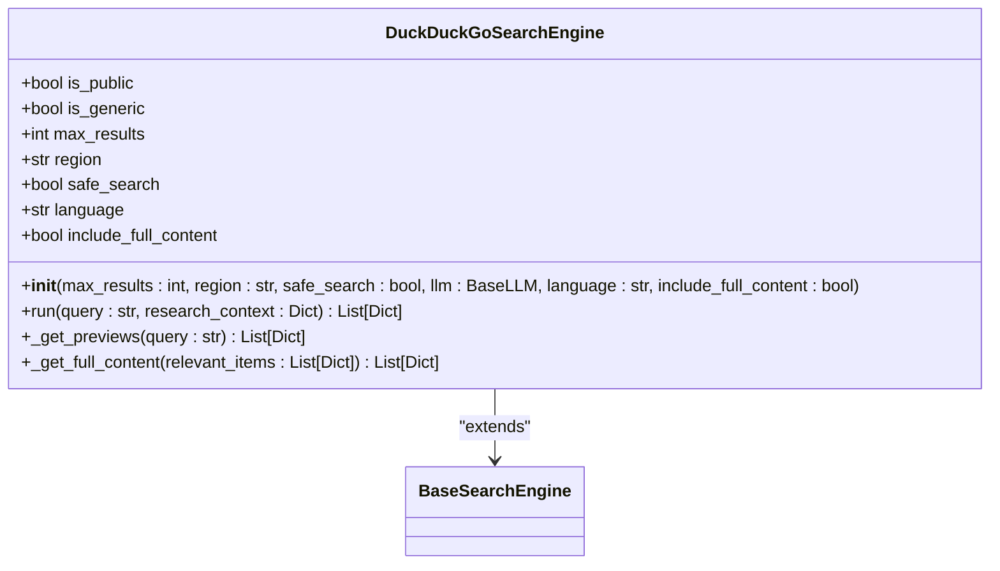

**Diagram sources**
- [search_engine_ddg.py](file://src/local_deep_research/web_search_engines/engines/search_engine_ddg.py#L12-L19)

The architecture ensures privacy by:
- Not requiring authentication or API keys
- Using region-based search without personal identifiers
- Implementing safe search by default
- Limiting data collection to only what's necessary for search functionality

### Brave Search Architecture

Brave Search provides enhanced privacy features through its implementation, requiring an API key but offering additional privacy controls. The engine uses Brave's search API with configurable privacy settings:

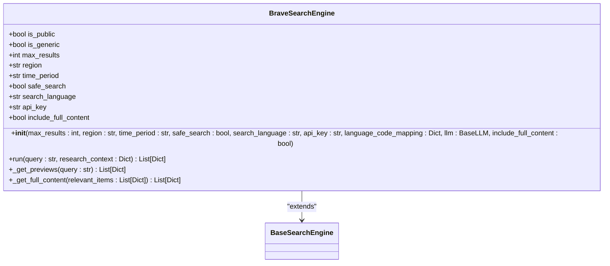

**Diagram sources**
- [search_engine_brave.py](file://src/local_deep_research/web_search_engines/engines/search_engine_brave.py#L12-L19)

Key privacy features include:
- API key authentication that can be configured through environment variables or UI settings
- Language-specific search with configurable language code mapping
- Time period filtering to limit search results to specific timeframes
- Safe search options that can be enabled or disabled
- Region-specific search results without user tracking

Both engines inherit from the `BaseSearchEngine` class, which implements a two-phase retrieval approach that first retrieves preview information (titles, snippets) and then only fetches full content for relevant results, minimizing data transfer and processing.

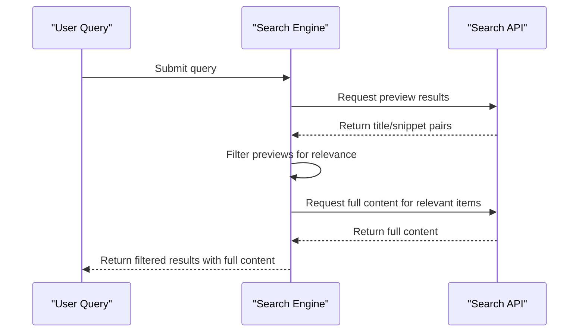

**Diagram sources**
- [search_engine_base.py](file://src/local_deep_research/web_search_engines/search_engine_base.py#L259-L394)
- [search_engine_ddg.py](file://src/local_deep_research/web_search_engines/engines/search_engine_ddg.py#L71-L91)
- [search_engine_brave.py](file://src/local_deep_research/web_search_engines/engines/search_engine_brave.py#L271-L294)

**Section sources**
- [search_engine_ddg.py](file://src/local_deep_research/web_search_engines/engines/search_engine_ddg.py#L12-L111)
- [search_engine_brave.py](file://src/local_deep_research/web_search_engines/engines/search_engine_brave.py#L12-L133)
- [search_engine_base.py](file://src/local_deep_research/web_search_engines/search_engine_base.py#L35-L657)

## API Usage and Configuration

The API usage and configuration for DuckDuckGo and Brave Search engines follow a consistent pattern while accommodating their specific requirements and capabilities.

### DuckDuckGo API Usage

DuckDuckGo can be used without API key authentication, making it suitable for fallback scenarios and preliminary research. The engine can be initialized with various parameters to customize search behavior:

```python
# Example initialization (conceptual, not actual code)
engine = DuckDuckGoSearchEngine(
    max_results=10,
    region="us",
    safe_search=True,
    language="English",
    include_full_content=False
)
```

Configuration parameters for DuckDuckGo include:
- **max_results**: Maximum number of search results (default: 10)
- **region**: Region code for localized results (default: "us")
- **safe_search**: Whether to enable safe search filtering (default: True)
- **language**: Language for content processing (default: "English")
- **include_full_content**: Whether to retrieve full webpage content (default: False)

### Brave Search API Usage

Brave Search requires API key authentication, which can be provided through multiple methods:

```python
# Example initialization (conceptual, not actual code)
engine = BraveSearchEngine(
    api_key="your_api_key",
    max_results=10,
    region="US",
    time_period="y",
    safe_search=True,
    search_language="English",
    include_full_content=True
)
```

Configuration parameters for Brave Search include:
- **api_key**: Brave Search API key (required, can be set via environment variable BRAVE_API_KEY)
- **max_results**: Maximum number of search results (default: 10)
- **region**: Region code for localized results (default: "US")
- **time_period**: Time period for search results (default: "y" for year)
- **safe_search**: Whether to enable safe search filtering (default: True)
- **search_language**: Language for search results (default: "English")
- **include_full_content**: Whether to include full webpage content (default: True)

### Configuration Methods

Both engines support multiple configuration methods:

1. **Direct parameter passing**: API key and other parameters can be passed directly to the constructor
2. **Environment variables**: BRAVE_API_KEY environment variable for Brave Search
3. **UI settings**: Configuration through the application's settings interface
4. **Settings snapshot**: Thread context-based configuration

The system attempts to retrieve the Brave API key in the following order:
1. Direct parameter to constructor
2. Environment variable (BRAVE_API_KEY)
3. UI settings configuration

If no API key is found through these methods, initialization will raise a ValueError indicating that the Brave API key is not found.

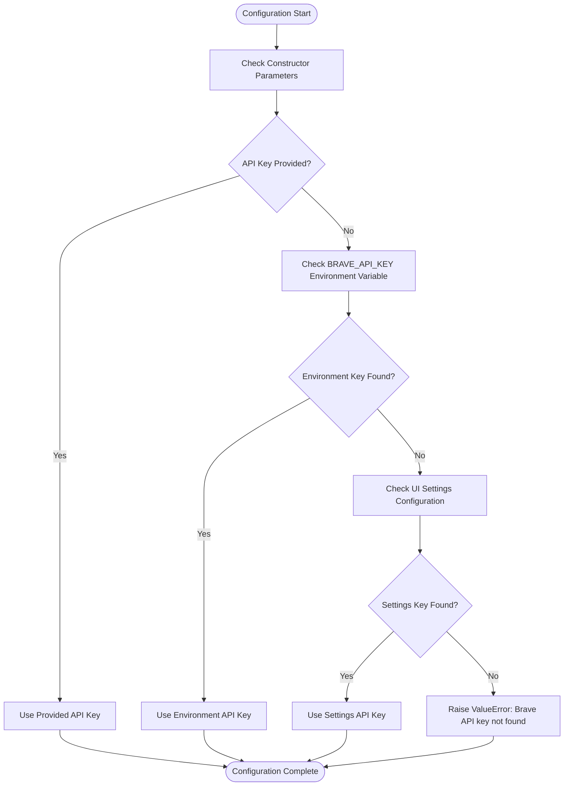

**Diagram sources**
- [search_engine_brave.py](file://src/local_deep_research/web_search_engines/engines/search_engine_brave.py#L74-L87)
- [search_engine_ddg.py](file://src/local_deep_research/web_search_engines/engines/search_engine_ddg.py#L20-L49)

**Section sources**
- [search_engine_ddg.py](file://src/local_deep_research/web_search_engines/engines/search_engine_ddg.py#L20-L50)
- [search_engine_brave.py](file://src/local_deep_research/web_search_engines/engines/search_engine_brave.py#L20-L50)
- [test_search_engine_brave.py](file://tests/search_engines/test_search_engine_brave.py#L68-L82)

## Query Limitations and Result Formatting

Both DuckDuckGo and Brave Search engines have specific query limitations and result formatting characteristics that affect their usage in research workflows.

### Query Limitations

#### DuckDuckGo Limitations
- **Query length**: Limited to 400 characters in the implementation
- **Result count**: Maximum of 10 results by default, configurable up to 25
- **Region codes**: Supports various region codes (e.g., "us-en", "de-de")
- **Safe search**: Configurable with "moderate" or "off" settings

#### Brave Search Limitations
- **Query length**: Limited to 400 characters in the implementation
- **Result count**: Maximum of 20 results per request (capped at 20 regardless of max_results parameter)
- **Region codes**: Uses country codes in uppercase (e.g., "US", "DE")
- **Time period**: Supports various time periods with prefix "p" (e.g., "p24h", "pw", "pm", "py")
- **Safe search**: Configurable with "moderate" or "off" settings
- **Language support**: Limited to specific language codes (en, es, zh, hi, fr, ar, bn, pt, ru)

### Result Formatting Differences

#### DuckDuckGo Result Format
DuckDuckGo returns results with the following structure:
- **id**: URL of the result (used as identifier)
- **title**: Title of the webpage
- **snippet**: Summary or excerpt from the page
- **link**: URL of the result
- **_full_result**: Complete result object from the API

The implementation processes DuckDuckGo API responses to extract these fields consistently.

#### Brave Search Result Format
Brave Search returns results with a similar but distinct structure:
- **id**: Index position of the result (0-based)
- **title**: Title of the webpage
- **snippet**: Summary or excerpt from the page
- **link**: URL of the result
- **displayed_link**: URL shown in search results
- **position**: Position in search results
- **_full_result**: Complete result object from the API

### Response Processing

Both engines implement robust response processing to handle various response formats:

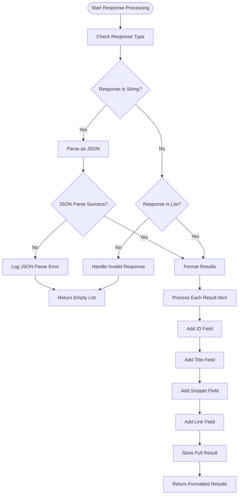

**Diagram sources**
- [search_engine_ddg.py](file://src/local_deep_research/web_search_engines/engines/search_engine_ddg.py#L102-L144)
- [search_engine_brave.py](file://src/local_deep_research/web_search_engines/engines/search_engine_brave.py#L145-L180)

The response processing includes error handling for:
- Invalid JSON responses
- Network timeouts
- Rate limit errors
- Empty or malformed responses

Both engines convert their respective API responses to a consistent internal format, allowing the rest of the system to work with search results uniformly regardless of the underlying search engine.

**Section sources**
- [search_engine_ddg.py](file://src/local_deep_research/web_search_engines/engines/search_engine_ddg.py#L102-L144)
- [search_engine_brave.py](file://src/local_deep_research/web_search_engines/engines/search_engine_brave.py#L145-L180)

## Response Handling and Snippet Extraction

The response handling and snippet extraction process for both DuckDuckGo and Brave Search engines follows a standardized two-phase approach that ensures efficient processing and relevance filtering.

### Two-Phase Retrieval Approach

Both engines implement a two-phase retrieval approach inherited from the `BaseSearchEngine` class:

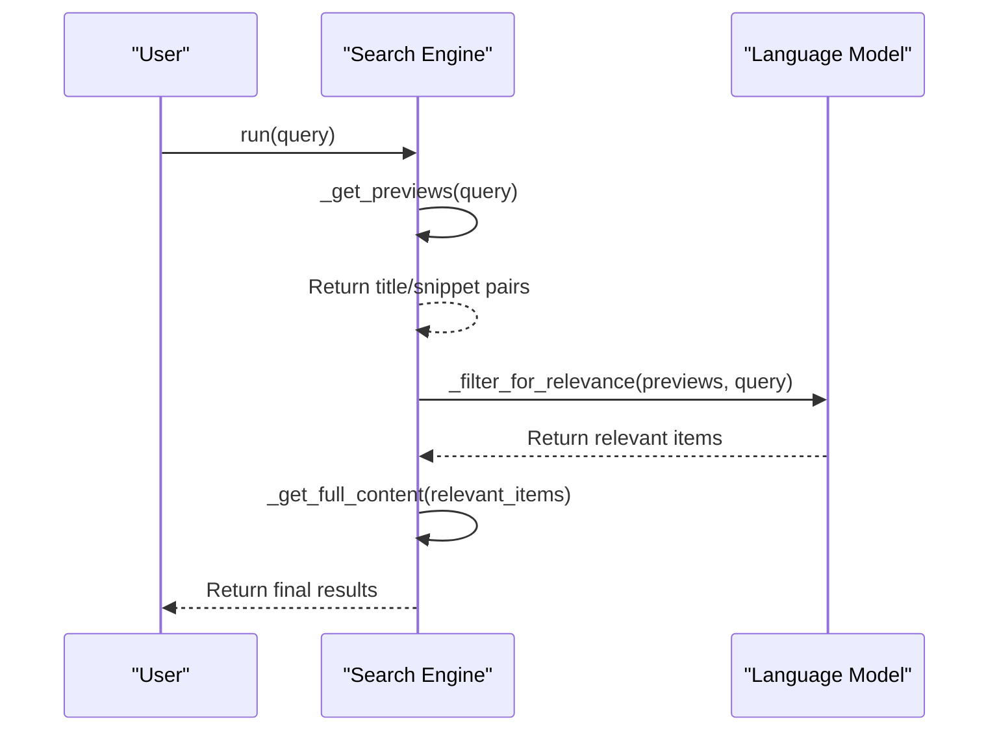

**Diagram sources**
- [search_engine_base.py](file://src/local_deep_research/web_search_engines/search_engine_base.py#L259-L394)

### Preview Retrieval

The `_get_previews` method retrieves initial search results containing only essential information:

#### DuckDuckGo Preview Retrieval
```python
def _get_previews(self, query: str) -> List[Dict[str, Any]]:
    try:
        results = self.engine.results(query, max_results=self.max_results)
        if not isinstance(results, list):
            return []
            
        previews = []
        for i, result in enumerate(results):
            preview = {
                "id": result.get("link"),
                "title": result.get("title", ""),
                "snippet": result.get("snippet", ""),
                "link": result.get("link", ""),
            }
            previews.append(preview)
        return previews
    except Exception as e:
        # Handle rate limit and other errors
        return []
```

#### Brave Search Preview Retrieval
```python
def _get_previews(self, query: str) -> List[Dict[str, Any]]:
    try:
        raw_results = self.engine.run(query[:400])
        if isinstance(raw_results, str):
            raw_results = json.loads(raw_results)
            
        previews = []
        for i, result in enumerate(raw_results):
            preview = {
                "id": i,
                "title": result.get("title", ""),
                "link": result.get("link", ""),
                "snippet": result.get("snippet", ""),
                "displayed_link": result.get("link", ""),
                "position": i,
            }
            preview["_full_result"] = result
            previews.append(preview)
        return previews
    except Exception as e:
        # Handle rate limit and other errors
        return []
```

### Relevance Filtering

The relevance filtering process uses a language model to identify the most relevant results from the initial previews:

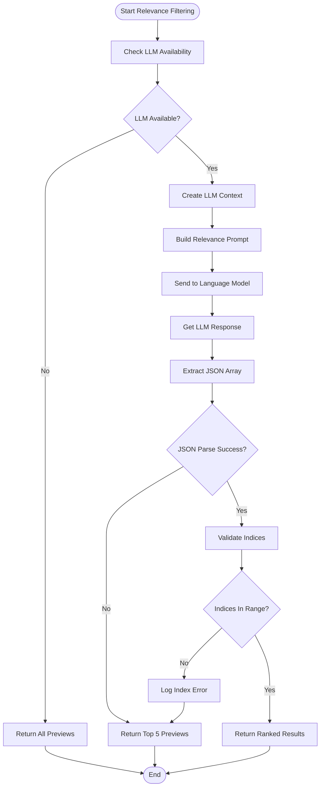

**Diagram sources**
- [search_engine_base.py](file://src/local_deep_research/web_search_engines/search_engine_base.py#L450-L629)

The LLM prompt includes criteria for selection:
1. Direct relevance to the specific query topic
2. Quality from reputable sources with substantive information
3. Recency when relevant to the query

### Full Content Retrieval

The `_get_full_content` method retrieves complete information for relevant results:

#### DuckDuckGo Full Content
```python
def _get_full_content(self, relevant_items: List[Dict[str, Any]]) -> List[Dict[str, Any]]:
    if hasattr(self, "full_search"):
        return self.full_search._get_full_content(relevant_items)
    return relevant_items
```

#### Brave Search Full Content
```python
def _get_full_content(self, relevant_items: List[Dict[str, Any]]) -> List[Dict[str, Any]]:
    if hasattr(search_config, "SEARCH_SNIPPETS_ONLY") and search_config.SEARCH_SNIPPETS_ONLY:
        # Return snippet-only results
        results = []
        for item in relevant_items:
            if "_full_result" in item:
                result = item["_full_result"].copy()
                if "_full_result" in result:
                    del result["_full_result"]
            else:
                result = item.copy()
            results.append(result)
        return results
        
    if self.include_full_content and hasattr(self, "full_search"):
        try:
            return self.full_search._get_full_content(relevant_items)
        except Exception:
            logger.exception("Error retrieving full content")
            
    # Fallback to returning items with full Brave information
    results = []
    for item in relevant_items:
        if "_full_result" in item:
            result = item["_full_result"].copy()
            if "_full_result" in result:
                del result["_full_result"]
        else:
            result = item.copy()
        results.append(result)
    return results
```

The full content retrieval respects the `SEARCH_SNIPPETS_ONLY` configuration parameter, allowing the system to operate in snippet-only mode when needed.

**Section sources**
- [search_engine_ddg.py](file://src/local_deep_research/web_search_engines/engines/search_engine_ddg.py#L145-L163)
- [search_engine_brave.py](file://src/local_deep_research/web_search_engines/engines/search_engine_brave.py#L200-L270)
- [search_engine_base.py](file://src/local_deep_research/web_search_engines/search_engine_base.py#L450-L629)

## Rate Limit Management

The rate limit management system for DuckDuckGo and Brave Search engines implements adaptive rate limiting to prevent API overuse while maintaining optimal performance.

### Rate Limit Detection

Both engines detect rate limiting through specific error patterns in API responses:

#### DuckDuckGo Rate Limit Detection
```python
def _get_previews(self, query: str) -> List[Dict[str, Any]]:
    try:
        # ... search execution ...
    except Exception as e:
        error_msg = str(e)
        if "202 Ratelimit" in error_msg or "ratelimit" in error_msg.lower():
            raise RateLimitError(f"DuckDuckGo rate limit hit: {error_msg}")
        elif "403" in error_msg or "forbidden" in error_msg.lower():
            raise RateLimitError(f"DuckDuckGo access forbidden: {error_msg}")
        elif "timeout" in error_msg.lower() or "timed out" in error_msg.lower():
            raise RateLimitError(f"DuckDuckGo timeout: {error_msg}")
        return []
```

#### Brave Search Rate Limit Detection
```python
def _get_previews(self, query: str) -> List[Dict[str, Any]]:
    try:
        # ... search execution ...
    except Exception as e:
        error_msg = str(e)
        if ("429" in error_msg or "too many requests" in error_msg.lower() 
            or "rate limit" in error_msg.lower() or "quota" in error_msg.lower()):
            raise RateLimitError(f"Brave Search rate limit hit: {error_msg}")
        return []
```

### Adaptive Rate Limiting

The system uses an `AdaptiveRateLimitTracker` to learn optimal retry wait times for each search engine:

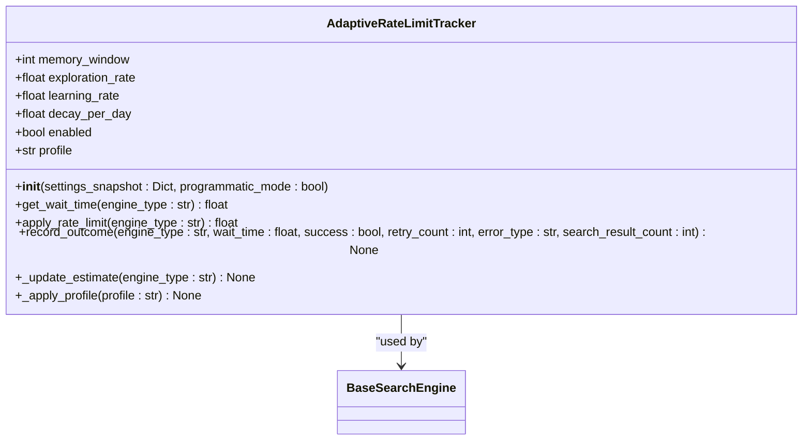

**Diagram sources**
- [tracker.py](file://src/local_deep_research/web_search_engines/rate_limiting/tracker.py#L43-L762)

The tracker implements several key features:
- **Memory window**: Stores recent attempts (default: 100)
- **Exploration rate**: Probability of trying faster rates (default: 0.1)
- **Learning rate**: How quickly to adapt to new information (default: 0.3)
- **Decay per day**: How quickly old estimates lose confidence (default: 0.95)
- **Profiles**: Configurable profiles (conservative, balanced, aggressive)

### Rate Limiting Workflow

The rate limiting workflow follows this sequence:

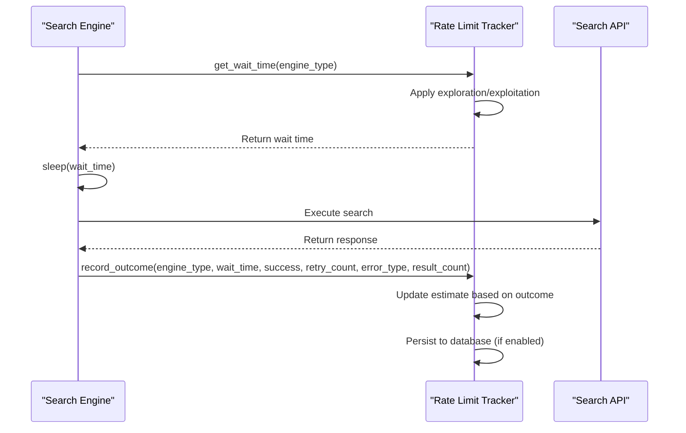

**Diagram sources**
- [tracker.py](file://src/local_deep_research/web_search_engines/rate_limiting/tracker.py#L226-L322)

The system implements retry logic with the following parameters:
- Maximum of 3 retry attempts
- Adaptive wait times based on historical success
- Recording of outcomes to improve future wait time estimates
- Support for different rate limiting profiles

### Configuration Options

Rate limiting can be configured through several settings:
- **rate_limiting.enabled**: Whether rate limiting is enabled (default: True)
- **rate_limiting.memory_window**: Number of recent attempts to remember (default: 100)
- **rate_limiting.exploration_rate**: Probability of exploring faster rates (default: 0.1)
- **rate_limiting.learning_rate**: Speed of adaptation to new information (default: 0.3)
- **rate_limiting.decay_per_day**: Rate of confidence decay for old estimates (default: 0.95)
- **rate_limiting.profile**: Rate limiting profile (conservative, balanced, aggressive)

These settings can be adjusted based on the specific requirements of the research workflow, allowing for more aggressive searching when needed or more conservative behavior to avoid rate limits.

**Section sources**
- [search_engine_ddg.py](file://src/local_deep_research/web_search_engines/engines/search_engine_ddg.py#L127-L143)
- [search_engine_brave.py](file://src/local_deep_research/web_search_engines/engines/search_engine_brave.py#L187-L197)
- [tracker.py](file://src/local_deep_research/web_search_engines/rate_limiting/tracker.py#L43-L762)
- [search_engine_base.py](file://src/local_deep_research/web_search_engines/search_engine_base.py#L300-L308)

## Integration Configuration

The integration of DuckDuckGo and Brave Search engines can be configured through multiple methods to suit different deployment scenarios and research requirements.

### Configuration via Environment Variables

Both engines support configuration through environment variables, with Brave Search specifically requiring the BRAVE_API_KEY variable:

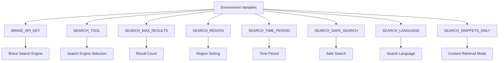

**Diagram sources**
- [search_engine_brave.py](file://src/local_deep_research/web_search_engines/engines/search_engine_brave.py#L74-L87)
- [search_config.py](file://src/local_deep_research/config/search_config.py#L87-L128)

### UI Settings Configuration

The engines can be configured through the application's UI settings interface, which provides a user-friendly way to set parameters:

- **Search tool selection**: Choose between different search engines
- **Maximum results**: Set the number of results to retrieve
- **Region**: Select the geographic region for search results
- **Time period**: Filter results by recency
- **Safe search**: Enable or disable safe search filtering
- **Search language**: Set the language for search queries
- **Snippets only**: Configure whether to retrieve full content or only snippets

### Programmatic Configuration

For programmatic access, the engines can be configured directly in code:

```python
# Example configuration (conceptual, not actual code)
from local_deep_research.web_search_engines.engines.search_engine_ddg import DuckDuckGoSearchEngine
from local_deep_research.web_search_engines.engines.search_engine_brave import BraveSearchEngine

# DuckDuckGo configuration
ddg_engine = DuckDuckGoSearchEngine(
    max_results=15,
    region="uk",
    safe_search=True,
    language="English",
    include_full_content=True
)

# Brave Search configuration
brave_engine = BraveSearchEngine(
    api_key="your_api_key_here",
    max_results=10,
    region="GB",
    time_period="m",
    safe_search=False,
    search_language="English",
    include_full_content=False
)
```

### Fallback Configuration

The system supports using DuckDuckGo as a fallback option when Brave Search is unavailable:

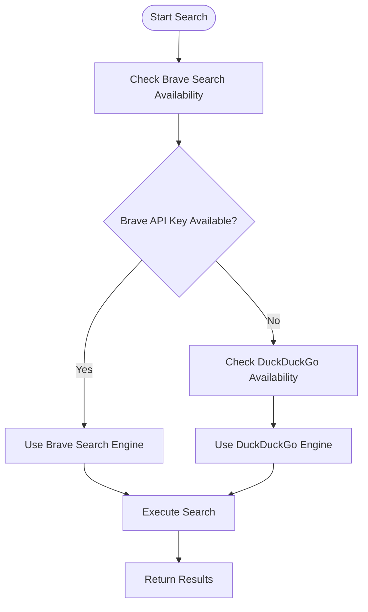

**Diagram sources**
- [search_engine_brave.py](file://src/local_deep_research/web_search_engines/engines/search_engine_brave.py#L74-L87)
- [search_engine_ddg.py](file://src/local_deep_research/web_search_engines/engines/search_engine_ddg.py#L20-L50)

This fallback configuration is particularly useful for preliminary research phases where API key availability may be uncertain or when rapid, low-cost queries are needed without authentication requirements.

The configuration system also supports different profiles for various research scenarios:
- **Preliminary research**: Use DuckDuckGo with snippet-only mode for rapid exploration
- **In-depth research**: Use Brave Search with full content retrieval for comprehensive analysis
- **High-throughput scenarios**: Configure rate limiting profiles to balance speed and reliability

**Section sources**
- [search_engine_brave.py](file://src/local_deep_research/web_search_engines/engines/search_engine_brave.py#L20-L50)
- [search_engine_ddg.py](file://src/local_deep_research/web_search_engines/engines/search_engine_ddg.py#L20-L50)
- [search_config.py](file://src/local_deep_research/config/search_config.py#L53-L58)
- [search_engines_config.py](file://src/local_deep_research/web_search_engines/search_engines_config.py#L111-L127)

## Common Issues and Troubleshooting

This section addresses common issues encountered when using DuckDuckGo and Brave Search engines, along with troubleshooting guidance and solutions.

### API Key Issues

#### Brave Search API Key Not Found
**Symptom**: `ValueError: Brave API key not found`
**Causes**:
- API key not provided in constructor
- BRAVE_API_KEY environment variable not set
- API key not configured in UI settings

**Solutions**:
1. Provide API key directly in constructor:
```python
engine = BraveSearchEngine(api_key="your_actual_api_key")
```
2. Set the environment variable:
```bash
export BRAVE_API_KEY=your_actual_api_key
```
3. Configure the API key in the application's UI settings

#### Invalid API Key
**Symptom**: Authentication errors or access forbidden messages
**Solutions**:
- Verify the API key is correct and active
- Regenerate the API key if necessary
- Check for typos or extra whitespace in the key

### Rate Limiting Issues

#### Frequent Rate Limit Errors
**Symptoms**:
- `RateLimitError` exceptions
- 429 Too Many Requests responses
- Slow search performance

**Solutions**:
1. Adjust rate limiting configuration:
```python
# More conservative rate limiting
tracker = AdaptiveRateLimitTracker()
tracker.exploration_rate = 0.05  # Reduce exploration
tracker.learning_rate = 0.2      # Slower learning
```

2. Use the conservative rate limiting profile:
```python
# Set rate_limiting.profile to "conservative"
```

3. Implement longer wait times between searches in high-throughput scenarios

### Result Quality Issues

#### Limited or Empty Results
**Symptoms**:
- Fewer results than expected
- Empty result lists
- Low-quality or irrelevant results

**Solutions**:
1. Adjust search parameters:
- Increase `max_results` parameter
- Modify region or language settings
- Adjust time period for Brave Search

2. Check query formulation:
- Ensure queries are clear and specific
- Avoid overly complex or ambiguous queries
- Use appropriate keywords

3. Verify engine configuration:
- Confirm `include_full_content` is set appropriately
- Check that safe search settings are not too restrictive

### Configuration Issues

#### Environment Variable Not Recognized
**Symptom**: Configuration settings not applied from environment variables
**Solutions**:
1. Verify variable names:
- Use correct case (e.g., BRAVE_API_KEY, not brave_api_key)
- Ensure no typos in variable names

2. Check variable scope:
- Ensure variables are exported to the correct shell session
- Restart the application after setting variables

3. Verify variable loading:
- Check that the application has access to environment variables
- Test variable availability in the application context

### Connection and Network Issues

#### Timeout Errors
**Symptoms**:
- Network timeout exceptions
- Slow response times
- Intermittent connectivity issues

**Solutions**:
1. Check network connectivity:
- Verify internet connection is stable
- Test connectivity to search engine endpoints

2. Adjust timeout settings:
- Increase timeout thresholds if supported
- Implement retry logic with exponential backoff

3. Consider alternative search engines:
- Switch to DuckDuckGo if Brave Search is consistently slow
- Use local search engines for preliminary research

### Implementation-Specific Issues

#### DuckDuckGo Package Not Installed
**Symptom**: `ImportError` or tests skipped due to missing 'ddgs' package
**Solution**:
```bash
pip install ddgs
```

#### JSON Parsing Errors
**Symptom**: "Unable to parse response as JSON" errors
**Solutions**:
1. Verify API response format:
- Check that responses are valid JSON
- Handle both string and list response formats

2. Implement robust error handling:
- Add try-catch blocks for JSON parsing
- Provide fallback behavior for invalid responses

```python
try:
    if isinstance(raw_results, str):
        raw_results = json.loads(raw_results)
except json.JSONDecodeError:
    logger.exception("Unable to parse response as JSON")
    return []
```

### Troubleshooting Checklist

When encountering issues with search engines, follow this checklist:

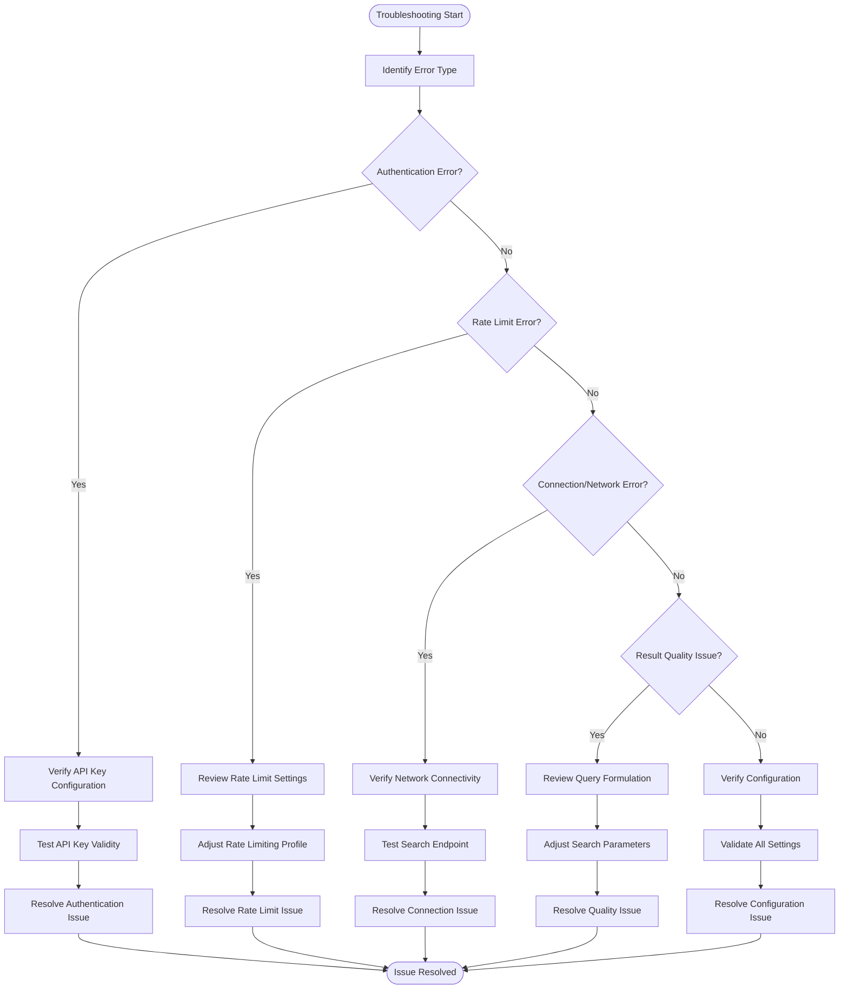

**Diagram sources**
- [search_engine_brave.py](file://src/local_deep_research/web_search_engines/engines/search_engine_brave.py#L187-L197)
- [search_engine_ddg.py](file://src/local_deep_research/web_search_engines/engines/search_engine_ddg.py#L127-L143)
- [tracker.py](file://src/local_deep_research/web_search_engines/rate_limiting/tracker.py#L226-L322)

**Section sources**
- [search_engine_brave.py](file://src/local_deep_research/web_search_engines/engines/search_engine_brave.py#L74-L87)
- [search_engine_ddg.py](file://src/local_deep_research/web_search_engines/engines/search_engine_ddg.py#L20-L50)
- [test_search_engine_brave.py](file://tests/search_engines/test_search_engine_brave.py#L68-L82)
- [test_search_engine_ddg.py](file://tests/search_engines/test_search_engine_ddg.py#L20-L39)

## Performance Optimization

This section covers performance optimization techniques for high-throughput scenarios when using DuckDuckGo and Brave Search engines.

### Rate Limiting Optimization

The adaptive rate limiting system can be optimized for different performance requirements:

#### Conservative Profile
For stable, reliable performance with minimal risk of rate limits:
- **exploration_rate**: 0.05 (5% exploration)
- **learning_rate**: 0.2 (slower adaptation)
- **memory_window**: 100 (larger history)
- Suitable for production environments where reliability is critical

#### Aggressive Profile
For maximum throughput when rate limits are less of a concern:
- **exploration_rate**: 0.2 (20% exploration)
- **learning_rate**: 0.5 (faster adaptation)
- **memory_window**: 50 (smaller history)
- Suitable for preliminary research phases or when API quotas are high

#### Balanced Profile
Default settings that balance speed and reliability:
- **exploration_rate**: 0.1 (10% exploration)
- **learning_rate**: 0.3 (moderate adaptation)
- **memory_window**: 100 (standard history)
- Suitable for most research scenarios

### Query Optimization

Optimize search queries to improve performance and relevance:

#### Query Length Management
- Keep queries under 400 characters (implementation limit)
- Use concise, specific keywords
- Avoid unnecessary words or phrases

#### Result Count Optimization
- Request only the number of results actually needed
- Use lower `max_results` for preliminary searches
- Increase `max_results` only when necessary for comprehensive analysis

### Caching Strategies

Implement caching to reduce redundant searches:

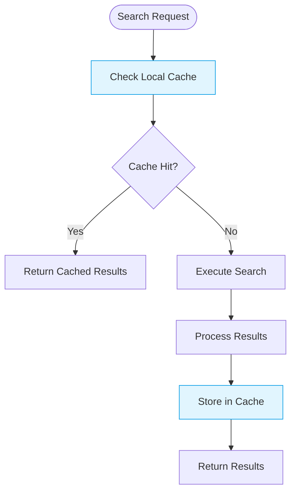

**Diagram sources**
- [search_engine_base.py](file://src/local_deep_research/web_search_engines/search_engine_base.py#L259-L394)

The system automatically caches search results and rate limiting estimates, reducing redundant API calls and improving response times.

### Parallel Search Optimization

For high-throughput scenarios, optimize parallel search operations:

#### Connection Pooling
- Reuse HTTP connections when possible
- Limit concurrent connections to avoid overwhelming the system
- Implement connection timeouts to prevent hanging requests

#### Batch Processing
- Group related queries together
- Process searches in batches to optimize resource usage
- Implement queue-based processing for large numbers of searches

### Memory and Resource Management

Optimize memory usage and resource allocation:

#### Memory Window Configuration
- Adjust `memory_window` based on available memory
- Larger windows provide better rate limit predictions but use more memory
- Smaller windows use less memory but may be less accurate

#### Programmatic Mode Optimization
When using programmatic mode:
- Disable database operations for faster performance
- Use memory-only tracking
- Bypass unnecessary persistence operations

### Performance Monitoring

Monitor search performance using the built-in tracking system:

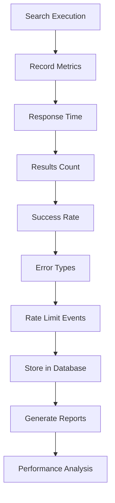

**Diagram sources**
- [search_engine_base.py](file://src/local_deep_research/web_search_engines/search_engine_base.py#L434-L445)

Key performance metrics to monitor:
- **Response time**: Time to complete search requests
- **Results count**: Number of results returned
- **Success rate**: Percentage of successful searches
- **Rate limit events**: Frequency of rate limit encounters
- **Error types**: Distribution of different error types

### Configuration for High-Throughput Scenarios

For high-throughput research scenarios, use the following configuration:

```python
# High-throughput configuration (conceptual)
config = {
    "rate_limiting": {
        "profile": "aggressive",
        "memory_window": 50,
        "exploration_rate": 0.2,
        "learning_rate": 0.5
    },
    "search": {
        "max_results": 10,
        "snippets_only": True,
        "max_filtered_results": 3
    },
    "performance": {
        "parallel_searches": 5,
        "batch_size": 10,
        "cache_ttl": 3600
    }
}
```

This configuration prioritizes speed and throughput while maintaining acceptable reliability.

**Section sources**
- [tracker.py](file://src/local_deep_research/web_search_engines/rate_limiting/tracker.py#L66-L83)
- [search_engine_base.py](file://src/local_deep_research/web_search_engines/search_engine_base.py#L148-L151)
- [search_engine_base.py](file://src/local_deep_research/web_search_engines/search_engine_base.py#L434-L445)

## Conclusion

DuckDuckGo and Brave Search provide effective lightweight alternatives for web search within the local-deep-research system, each with distinct advantages for different research scenarios.

DuckDuckGo stands out as an ideal choice for preliminary research phases and fallback scenarios due to its lack of API key requirements and privacy-preserving architecture. Its implementation allows for rapid, low-cost queries without authentication barriers, making it accessible for exploratory research and situations where API key management is challenging.

Brave Search offers enhanced capabilities through its API-based model, providing more configuration options and potentially higher quality results. The requirement for an API key enables more sophisticated features and better rate limit management, making it suitable for in-depth research where comprehensive results are needed.

Both engines share a common architecture based on the two-phase retrieval approach, which optimizes performance by first retrieving preview information and then only fetching full content for relevant results. This design minimizes data transfer and processing overhead while maintaining high relevance in search results.

The adaptive rate limiting system ensures sustainable usage patterns by learning optimal wait times and adjusting to API constraints. This intelligent rate limiting, combined with configurable profiles, allows researchers to balance search speed with reliability based on their specific needs.

For integration, both engines support multiple configuration methods including direct parameters, environment variables, and UI settings, providing flexibility for different deployment scenarios. The system's fallback capabilities ensure continuous operation even when primary search engines are unavailable.

In high-throughput scenarios, performance can be optimized through careful configuration of rate limiting parameters, query optimization, and caching strategies. The comprehensive monitoring and troubleshooting guidance provided in this document enables researchers to effectively manage common issues and maintain optimal search performance.

By understanding the strengths, limitations, and configuration options of these lightweight search alternatives, researchers can effectively leverage them in their workflows, whether for rapid preliminary exploration or more comprehensive in-depth analysis.

**Section sources**
- [search_engine_ddg.py](file://src/local_deep_research/web_search_engines/engines/search_engine_ddg.py#L1-L163)
- [search_engine_brave.py](file://src/local_deep_research/web_search_engines/engines/search_engine_brave.py#L1-L294)
- [search_engine_base.py](file://src/local_deep_research/web_search_engines/search_engine_base.py#L1-L657)
- [tracker.py](file://src/local_deep_research/web_search_engines/rate_limiting/tracker.py#L1-L762)