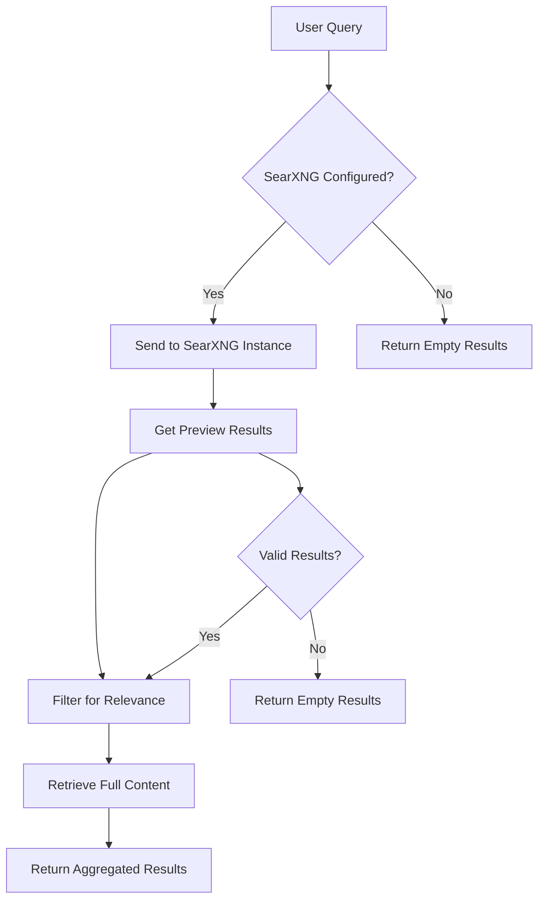
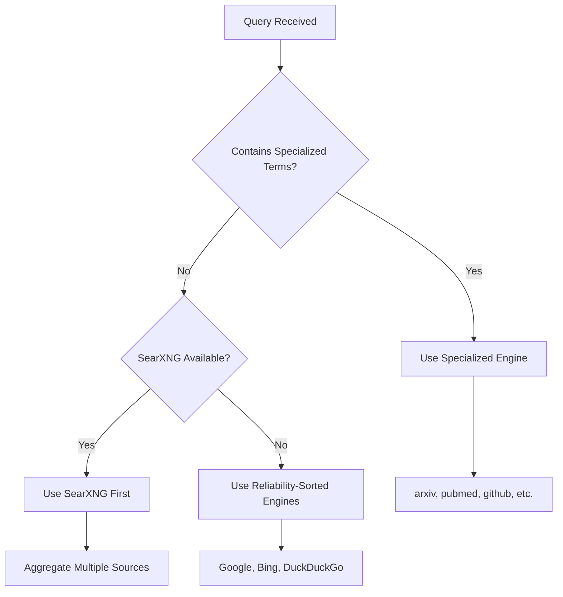
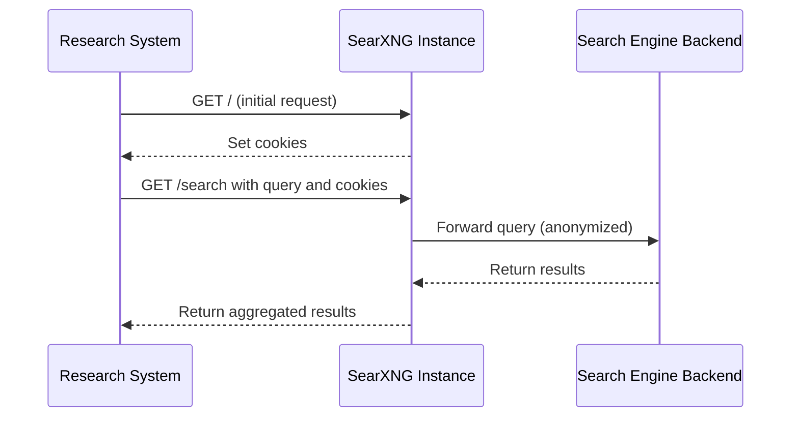
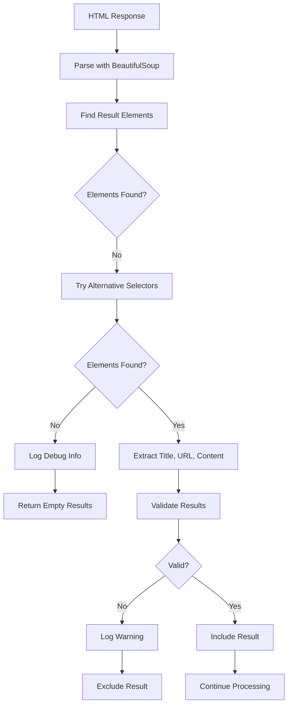
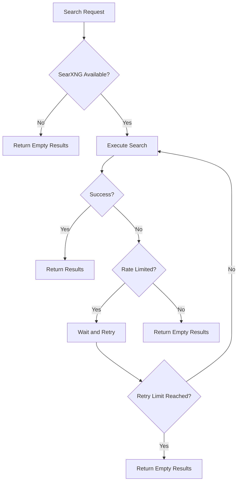

# Privacy-Focused Engines

<cite>
**Referenced Files in This Document**   
- [SearXNG-Setup.md](file://docs/SearXNG-Setup.md)
- [search_engine_searxng.py](file://src/local_deep_research/web_search_engines/engines/search_engine_searxng.py)
- [searxng_example.py](file://examples/api_usage/programmatic/searxng_example.py)
- [test_search_engine_searxng.py](file://tests/search_engines/test_search_engine_searxng.py)
- [safe_requests.py](file://src/local_deep_research/security/safe_requests.py)
- [meta_search_engine.py](file://src/local_deep_research/web_search_engines/engines/meta_search_engine.py)
- [default_settings.json](file://src/local_deep_research/defaults/default_settings.json)
</cite>

## Table of Contents
1. [Introduction](#introduction)
2. [SearXNG Implementation Overview](#searxng-implementation-overview)
3. [Instance Configuration and Selection](#instance-configuration-and-selection)
4. [Request Anonymization and Privacy Protection](#request-anonymization-and-privacy-protection)
5. [API Endpoint Configuration](#api-endpoint-configuration)
6. [Response Parsing and Result Processing](#response-parsing-and-result-processing)
7. [Fallback Mechanisms and Error Handling](#fallback-mechanisms-and-error-handling)
8. [Performance Optimization](#performance-optimization)
9. [Troubleshooting Common Issues](#troubleshooting-common-issues)
10. [Configuration Examples](#configuration-examples)

## Introduction

Privacy-focused search engines are essential tools for conducting research without compromising user data. This document focuses on SearXNG, a privacy-respecting metasearch engine that aggregates results from multiple sources while protecting user privacy. SearXNG operates by forwarding queries to various search engines and returning aggregated results without tracking user activity or storing personal information. The implementation discussed here integrates SearXNG into a research system that prioritizes ethical usage patterns, with self-hosting as the recommended approach to ensure maximum privacy and control over search operations.

**Section sources**
- [SearXNG-Setup.md](file://docs/SearXNG-Setup.md#L1-L130)

## SearXNG Implementation Overview

SearXNG functions as a metasearch engine that aggregates results from multiple search providers while maintaining user privacy. The implementation follows a two-phase retrieval approach: first obtaining preview information from search results, then retrieving full content only for relevant items. This design minimizes bandwidth usage and respects rate limits of backend search engines. The system is designed with privacy as a core principle, ensuring that user queries are not logged or tracked. By default, SearXNG is disabled until explicitly configured with an instance URL, preventing accidental use of public instances without proper authorization.

The implementation includes comprehensive error handling and fallback mechanisms to maintain reliability when instances are unavailable. It supports various configuration options for categories, search engines, language preferences, and safe search settings. The system prioritizes self-hosted instances to ensure ethical usage and prevent overloading public services. When properly configured, SearXNG provides a robust privacy-preserving search capability that can be integrated into automated research workflows.



**Diagram sources**
- [search_engine_searxng.py](file://src/local_deep_research/web_search_engines/engines/search_engine_searxng.py#L26-L588)
- [SearXNG-Setup.md](file://docs/SearXNG-Setup.md#L1-L130)

**Section sources**
- [search_engine_searxng.py](file://src/local_deep_research/web_search_engines/engines/search_engine_searxng.py#L26-L588)

## Instance Configuration and Selection

### Self-Hosted vs Public Instances

The system strongly recommends self-hosting SearXNG instances for ethical usage. Self-hosting provides complete control over the search infrastructure and ensures compliance with rate limits of backend search engines. For self-hosted instances, Docker provides the easiest deployment method, with both direct container execution and Docker Compose configurations available. The Docker Compose approach is recommended for production environments as it allows for persistent configuration and easier updates.

When using public instances, strict ethical guidelines must be followed: obtaining permission from administrators, respecting resource limitations with longer delays between requests (minimum 4-5 seconds), and limiting research volume. Public instances should only be used when self-hosting is not feasible, as they represent shared resources that can be impacted by excessive usage.

### Instance Selection Strategy

The system implements a sophisticated engine selection strategy that prioritizes SearXNG for general queries while maintaining specialized engines for domain-specific searches. When SearXNG is available, it is prioritized for general web searches, followed by reliability-ordered engines. However, specialized queries containing terms like "arxiv" or "pubmed" trigger prioritization of their respective specialized engines. This hybrid approach ensures optimal result quality while maintaining privacy protections.

The selection process evaluates query content to determine the most appropriate search engines. For queries containing specific technical terms or domain indicators, specialized engines are prioritized. For general informational queries, SearXNG is preferred due to its ability to aggregate results from multiple sources, providing broader coverage and reducing bias from any single search provider.



**Diagram sources**
- [meta_search_engine.py](file://src/local_deep_research/web_search_engines/engines/meta_search_engine.py#L214-L240)
- [search_engine_searxng.py](file://src/local_deep_research/web_search_engines/engines/search_engine_searxng.py#L60-L163)

**Section sources**
- [SearXNG-Setup.md](file://docs/SearXNG-Setup.md#L31-L69)
- [meta_search_engine.py](file://src/local_deep_research/web_search_engines/engines/meta_search_engine.py#L180-L296)

## Request Anonymization and Privacy Protection

### Network Security Measures

The implementation incorporates multiple layers of security to protect user privacy and prevent SSRF (Server-Side Request Forgery) attacks. The `safe_requests.py` module wraps HTTP requests with comprehensive validation, including URL validation that blocks access to sensitive internal endpoints like the AWS metadata service (169.254.169.254). For self-hosted SearXNG instances, the system allows connections to private IP ranges (10.x, 172.16-31.x, 192.168.x) and localhost, recognizing these as trusted internal networks.

The security framework enforces strict timeout limits (30 seconds by default) to prevent hanging requests and limits response sizes to 10MB to prevent memory exhaustion attacks. Redirects are disabled by default to prevent SSRF bypass through redirect chains, though callers can explicitly enable them when trust in redirect targets is established. These measures ensure that the search system operates securely while maintaining the ability to connect to self-hosted instances on local networks.

### Request Anonymization Techniques

SearXNG requests are anonymized through several mechanisms. The system uses browser-like headers that mimic common browser configurations, making requests appear as regular user traffic rather than automated queries. These headers include realistic User-Agent strings, Accept headers, and connection parameters that replicate typical browser behavior. The implementation also manages cookies appropriately, first retrieving initial cookies from the SearXNG instance before making search requests, which helps maintain session consistency without tracking user behavior.

The system respects rate limits through configurable delays between requests, preventing overloading of both the SearXNG instance and its backend search engines. This rate limiting is implemented as a self-imposed delay rather than relying solely on external rate limiting mechanisms, ensuring ethical usage patterns. The delay can be configured via environment variables or configuration parameters, with longer delays recommended for public instances to minimize impact on shared resources.



**Diagram sources**
- [safe_requests.py](file://src/local_deep_research/security/safe_requests.py#L21-L228)
- [search_engine_searxng.py](file://src/local_deep_research/web_search_engines/engines/search_engine_searxng.py#L207-L263)

**Section sources**
- [safe_requests.py](file://src/local_deep_research/security/safe_requests.py#L21-L228)
- [search_engine_searxng.py](file://src/local_deep_research/web_search_engines/engines/search_engine_searxng.py#L176-L187)

## API Endpoint Configuration

### Configuration Methods

SearXNG can be configured through two primary methods: environment variables and configuration parameters. The environment variable approach is recommended for most use cases, using `SEARXNG_INSTANCE` to specify the instance URL and `SEARXNG_DELAY` to set the delay between requests. Alternatively, configuration parameters can be added to a `config.py` file using the `SEARXNG_CONFIG` dictionary with `instance_url` and `delay_between_requests` keys.

The system also supports configuration through settings snapshots, allowing programmatic configuration of various parameters including categories, search engines, language, time range, and safe search settings. This flexibility enables integration into automated workflows and testing environments where configuration needs to be dynamically adjusted.

### Configuration Parameters

The implementation supports extensive configuration options for fine-tuning SearXNG behavior:

| Parameter | Environment Variable | Default Value | Description |
|---------|-------------------|-------------|-----------|
| instance_url | SEARXNG_INSTANCE | http://localhost:8080 | URL of the SearXNG instance |
| delay_between_requests | SEARXNG_DELAY | 0.0 | Seconds to wait between requests |
| categories | N/A | ["general"] | Categories to search in |
| engines | N/A | None | Specific engines to use |
| language | N/A | "en" | Language code for results |
| safe_search | N/A | 0 (OFF) | Safe search level |
| time_range | N/A | None | Time range for results |
| max_results | N/A | 15 | Maximum number of results |

These parameters can be set individually or through a comprehensive settings object, providing flexibility for different deployment scenarios. The system validates all parameters during initialization and provides appropriate logging to aid in troubleshooting configuration issues.

**Section sources**
- [SearXNG-Setup.md](file://docs/SearXNG-Setup.md#L13-L29)
- [searxng_example.py](file://examples/api_usage/programmatic/searxng_example.py#L41-L54)
- [default_settings.json](file://src/local_deep_research/defaults/default_settings.json#L3469-L3550)

## Response Parsing and Result Processing

### HTML Parsing Strategy

The implementation uses BeautifulSoup to parse HTML responses from SearXNG, extracting search results through a multi-layered selector approach. The system attempts to identify result elements using various CSS selectors (.result-item, .result, article, div[id^="result"]) to accommodate different SearXNG themes and configurations. For each result element, the system extracts title, URL, and content/snippet information using a hierarchy of selectors (.result-title, .title, h3, a[href] for titles; .result-url, .url, a[href] for URLs; .result-content, .content, .snippet, p for content).

The parsing process includes validation to filter out invalid results, such as relative URLs or URLs pointing back to the SearXNG instance itself (which would indicate error pages or internal statistics). This validation ensures that only legitimate search results are returned to the user, maintaining result quality and preventing confusion from system-generated pages.

### Result Validation and Filtering

The system implements a comprehensive validation process for search results. Each extracted URL is checked to ensure it uses an absolute HTTP/HTTPS scheme and does not point back to the SearXNG instance. Results failing these checks are logged as warnings and excluded from the final results. This prevents error pages or internal SearXNG pages from being presented as valid search results.

After initial parsing, results undergo additional filtering based on relevance. When an LLM is available, the system applies relevance filtering to prioritize results most likely to answer the original query. This two-phase approach (preview filtering followed by full content retrieval) optimizes resource usage by only retrieving full content for results deemed relevant. The system also supports snippet-only mode, which can be enabled to further reduce bandwidth usage and improve performance in latency-sensitive scenarios.



**Diagram sources**
- [search_engine_searxng.py](file://src/local_deep_research/web_search_engines/engines/search_engine_searxng.py#L267-L359)

**Section sources**
- [search_engine_searxng.py](file://src/local_deep_research/web_search_engines/engines/search_engine_searxng.py#L267-L383)

## Fallback Mechanisms and Error Handling

### Error Detection and Recovery

The implementation includes comprehensive error handling at multiple levels. During initialization, the system verifies connectivity to the SearXNG instance and sets the `is_available` flag accordingly. If the instance is unreachable or returns non-200 status codes, the engine is marked as unavailable, preventing subsequent search attempts. Network errors, timeouts, and request exceptions are caught and logged appropriately, with the system returning empty results rather than propagating errors to higher levels.

For search execution, the system implements retry logic with adaptive wait times when rate limiting is enabled. The base search engine class provides a retry mechanism that handles `RateLimitError` exceptions, automatically waiting and retrying up to three times. This ensures resilience against temporary issues while respecting rate limits. When all retries are exhausted, the system returns empty results with appropriate logging.

### Fallback Strategies

The system employs several fallback strategies to maintain functionality when SearXNG is unavailable. In the primary implementation, if SearXNG cannot be initialized or fails to return results, the system falls back to a mock search engine that returns placeholder results. This allows demonstration and testing to continue even without a working SearXNG instance.

At the architectural level, the meta-search engine can fall back to alternative search engines when SearXNG is unavailable. The engine selection process prioritizes SearXNG but includes reliability-ordered fallback engines that can be used if SearXNG is not available. This hybrid approach ensures that research can continue with alternative sources while maintaining the preference for privacy-focused search when possible.

The system also includes a test mode that allows developers to verify SearXNG connectivity before executing full research workflows. This proactive checking helps prevent failed research attempts and provides clear feedback when configuration issues exist.



**Diagram sources**
- [search_engine_searxng.py](file://src/local_deep_research/web_search_engines/engines/search_engine_searxng.py#L564-L588)
- [test_search_engine_searxng.py](file://tests/search_engines/test_search_engine_searxng.py#L273-L283)

**Section sources**
- [search_engine_searxng.py](file://src/local_deep_research/web_search_engines/engines/search_engine_searxng.py#L564-L588)
- [searxng_example.py](file://examples/api_usage/programmatic/searxng_example.py#L58-L74)

## Performance Optimization

### Rate Limiting and Request Management

The implementation includes sophisticated rate limiting to ensure ethical usage of SearXNG instances. A self-imposed delay between requests is implemented through the `delay_between_requests` parameter, which defaults to 0.0 seconds but can be configured to longer values (2.0-5.0 seconds recommended). This delay is applied before each request using the `_respect_rate_limit` method, which calculates the time since the last request and sleeps if necessary to maintain the configured interval.

For production deployments, the system integrates with an adaptive rate limit tracker that monitors response times and success rates, dynamically adjusting wait times to maintain optimal performance without triggering rate limits. This adaptive approach balances responsiveness with responsible usage, particularly important when sharing public instances.

### Caching and Efficiency Measures

The system implements several efficiency measures to optimize performance. The two-phase retrieval approach minimizes bandwidth by only retrieving full content for results that pass relevance filtering. When snippet-only mode is enabled, full content retrieval is skipped entirely, significantly reducing latency and resource usage.

The implementation also caches initial cookies from the SearXNG instance, reducing the number of round trips required for each search. This cookie management ensures session consistency while minimizing network overhead. Additionally, the system uses connection keep-alive and appropriate HTTP headers to optimize connection reuse and reduce latency.

For high-latency scenarios, the system can be configured with longer timeouts and retry mechanisms to handle intermittent connectivity issues. The modular design allows for easy integration of caching layers at different levels, from HTTP response caching to result-level caching, providing flexibility for different performance requirements.

**Section sources**
- [search_engine_searxng.py](file://src/local_deep_research/web_search_engines/engines/search_engine_searxng.py#L176-L187)
- [web_search_engines/search_engine_base.py](file://src/local_deep_research/web_search_engines/search_engine_base.py#L235-L243)

## Troubleshooting Common Issues

### Instance Connectivity Problems

Common issues with SearXNG integration typically involve connectivity and configuration problems. When encountering errors, the first step is to verify that the SearXNG instance is running and accessible from the client machine. This can be confirmed by accessing the instance URL in a web browser. If the instance is not accessible, check firewall settings, network connectivity, and Docker container status.

Configuration issues often stem from incorrect instance URLs or network restrictions. Ensure that the `SEARXNG_INSTANCE` environment variable or configuration parameter uses the correct URL format (including protocol and port). For Docker deployments, verify that port mappings are correctly configured (typically 8080:8080). The system logs detailed information about initialization attempts, including connectivity checks and parameter values, which can aid in diagnosing configuration issues.

### Response Inconsistencies

Response inconsistencies may occur due to backend search engine failures, rate limiting, or parsing issues. The system logs warnings when SearXNG returns no valid results, which may indicate problems with backend engines or rate limiting. In such cases, checking the SearXNG instance's statistics page can provide insights into which backend engines are functioning properly.

Parsing issues can arise from changes in SearXNG's HTML structure or themes. The implementation uses multiple CSS selectors to accommodate different configurations, but custom themes may require additional selector patterns. When encountering parsing issues, enabling debug logging can help identify which selectors are matching (or failing to match) the HTML structure.

For high-latency scenarios, consider increasing timeout values and implementing retry logic. The system's adaptive rate limiting can help manage intermittent connectivity issues, while snippet-only mode can reduce latency by eliminating full content retrieval.

**Section sources**
- [SearXNG-Setup.md](file://docs/SearXNG-Setup.md#L116-L124)
- [search_engine_searxng.py](file://src/local_deep_research/web_search_engines/engines/search_engine_searxng.py#L365-L368)

## Configuration Examples

### Self-Hosted Instance Configuration

For self-hosted SearXNG instances, the recommended configuration uses Docker Compose for production deployments:

```yaml
version: '3'
services:
  searxng:
    container_name: searxng
    image: searxng/searxng
    ports:
      - "8080:8080"
    volumes:
      - ./searxng:/etc/searxng
    environment:
      - SEARXNG_BASE_URL=http://localhost:8080/
    restart: unless-stopped
```

Environment variables for the research system:
```bash
SEARXNG_INSTANCE=http://localhost:8080
SEARXNG_DELAY=2.0
```

### Programmatic Configuration

For programmatic use, configure SearXNG through settings:
```python
settings = {
    "search_engines.searxng.base_url": "http://localhost:8080",
    "search_engines.searxng.timeout": 30,
    "search_engines.searxng.categories": ["general", "science"],
    "search_engines.searxng.engines": ["google", "duckduckgo", "bing"],
    "search_engines.searxng.language": "en",
    "search_engines.searxng.time_range": "",
    "search_engines.searxng.safesearch": 0,
}
```

### Public Instance Configuration

When using public instances (with administrator permission):
```bash
SEARXNG_INSTANCE=https://instance.example.com
SEARXNG_DELAY=5.0
```

This configuration ensures ethical usage with longer delays between requests to minimize impact on shared resources.

**Section sources**
- [SearXNG-Setup.md](file://docs/SearXNG-Setup.md#L13-L82)
- [searxng_example.py](file://examples/api_usage/programmatic/searxng_example.py#L41-L54)