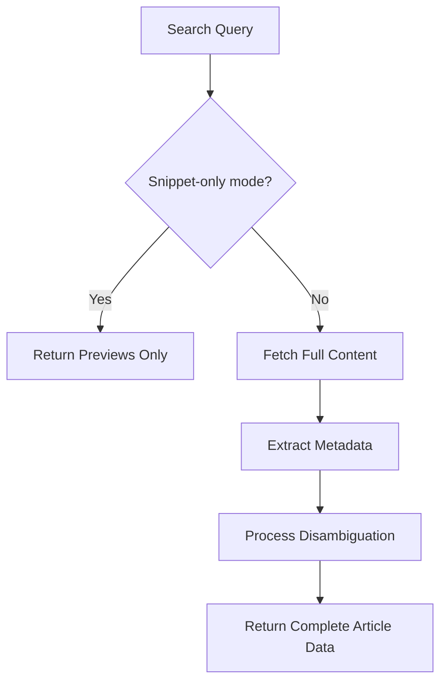
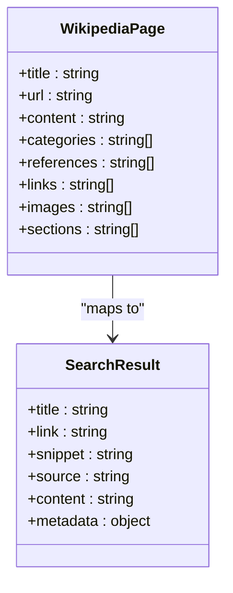
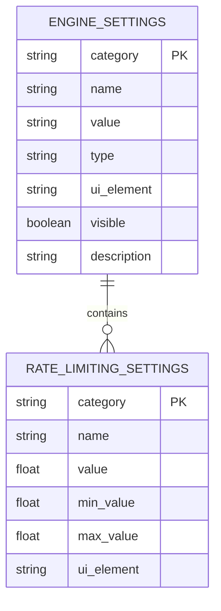
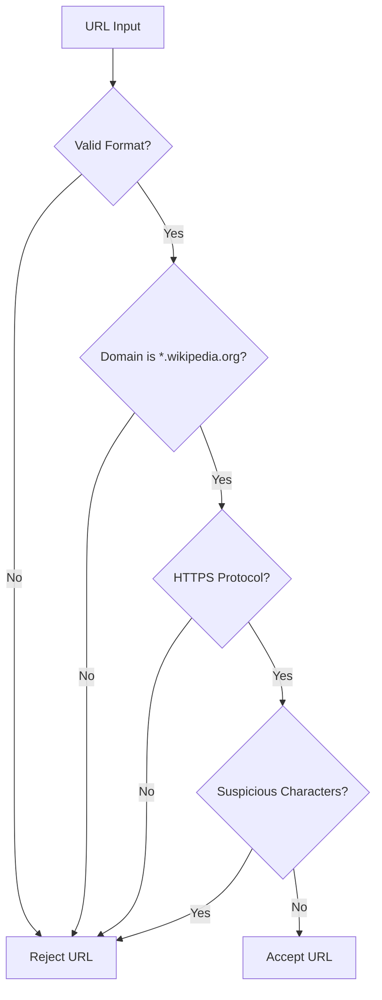

# Encyclopedia Content (Wikipedia)

<cite>
**Referenced Files in This Document**   
- [search_engine_wikipedia.py](file://src/local_deep_research/web_search_engines/engines/search_engine_wikipedia.py)
- [search_engine_base.py](file://src/local_deep_research/web_search_engines/search_engine_base.py)
- [tracker.py](file://src/local_deep_research/web_search_engines/rate_limiting/tracker.py)
- [default_settings.json](file://src/local_deep_research/defaults/default_settings.json)
- [test_wikipedia_url_security.py](file://tests/test_wikipedia_url_security.py)
</cite>

## Table of Contents
1. [Introduction](#introduction)
2. [Article Retrieval Mechanism](#article-retrieval-mechanism)
3. [Structured Data Extraction](#structured-data-extraction)
4. [Reliability and Validation](#reliability-and-validation)
5. [Technical Limitations and Constraints](#technical-limitations-and-constraints)
6. [Use Cases and Applications](#use-cases-and-applications)
7. [Configuration and Settings](#configuration-and-settings)
8. [Security Considerations](#security-considerations)
9. [Conclusion](#conclusion)

## Introduction

Wikipedia serves as a comprehensive source of encyclopedic knowledge, offering vast information across numerous domains. The system described here enables programmatic access to Wikipedia content through a structured retrieval mechanism. This documentation outlines the implementation details of Wikipedia article retrieval, including fetching current versions, accessing revision history, extracting structured data from infoboxes and citations, and analyzing historical edits. The system incorporates reliability checks, handles technical limitations such as API rate limits, and provides mechanisms for validating content against primary sources.

**Section sources**
- [search_engine_wikipedia.py](file://src/local_deep_research/web_search_engines/engines/search_engine_wikipedia.py#L1-L303)

## Article Retrieval Mechanism

The Wikipedia search engine implements a two-phase retrieval approach for efficient information gathering. In the first phase, it retrieves preview information including titles and summaries using the `wikipedia.search()` method. This initial query returns a list of potential article titles based on the search query. The system then proceeds to the second phase where it fetches full content for relevant articles using `wikipedia.page()`. 

The retrieval process includes handling disambiguation pages by automatically selecting the first option when multiple matches are found. For each article, the system extracts comprehensive metadata including categories, references, external links, images, and section structure. The implementation supports language-specific queries through the `set_language()` method, allowing retrieval from different language editions of Wikipedia.

The retrieval system follows a rate-limiting strategy to prevent overwhelming the Wikipedia API. It applies adaptive wait times between requests based on historical success rates and server responses. This ensures compliance with API usage policies while maintaining optimal performance.

**Diagram sources**
- [search_engine_wikipedia.py](file://src/local_deep_research/web_search_engines/engines/search_engine_wikipedia.py#L51-L294)

**Section sources**
- [search_engine_wikipedia.py](file://src/local_deep_research/web_search_engines/engines/search_engine_wikipedia.py#L11-L303)

## Structured Data Extraction

The system extracts structured data from Wikipedia articles through multiple methods. When retrieving full content, it captures various metadata fields including categories, references, external links, images, and sections. The `get_page()` method returns a dictionary containing all these elements, enabling comprehensive analysis of article structure.

For citation handling, the system extracts reference lists and can process them for further analysis. The implementation includes methods to extract specific types of information such as temporal data, numerical values, dimensions, and scores through specialized extraction handlers. These handlers use language models to identify and extract precise information from the article content and citations.

The system also supports extraction of infobox data indirectly through the full content field, which contains the complete text representation of the article including infoboxes. This allows downstream processing to parse and extract structured information from infobox templates.

**Diagram sources**
- [search_engine_wikipedia.py](file://src/local_deep_research/web_search_engines/engines/search_engine_wikipedia.py#L203-L209)

**Section sources**
- [search_engine_wikipedia.py](file://src/local_deep_research/web_search_engines/engines/search_engine_wikipedia.py#L203-L209)
- [precision_extraction_handler.py](file://src/local_deep_research/citation_handlers/precision_extraction_handler.py#L218-L253)

## Reliability and Validation

The system incorporates multiple reliability considerations to ensure the quality of retrieved Wikipedia content. Each Wikipedia search engine instance has a reliability setting configured at 0.95, indicating high confidence in the source's accuracy. The system validates Wikipedia URLs to prevent malicious redirects or fake sites by checking that URLs follow the pattern `*.wikipedia.org`.

The implementation includes mechanisms to handle Wikipedia's editorial policies and potential vandalism. When disambiguation errors occur, the system automatically selects the first option, which typically represents the most notable or commonly referenced topic. For pages with potential reliability issues, the system can be configured to prioritize articles with more citations and references.

Content validation is further enhanced through cross-referencing with primary sources. The system extracts citation lists from articles, enabling users to verify claims against original references. Additionally, the two-phase retrieval approach allows for relevance filtering using language models, ensuring that only highly relevant results are processed in full.

**Section sources**
- [search_engine_wikipedia.py](file://src/local_deep_research/web_search_engines/engines/search_engine_wikipedia.py#L290-L293)
- [default_settings.json](file://src/local_deep_research/defaults/default_settings.json#L4295-L4307)
- [test_wikipedia_url_security.py](file://tests/test_wikipedia_url_security.py#L1-L165)

## Technical Limitations and Constraints

The Wikipedia retrieval system operates within several technical constraints designed to ensure reliability and compliance with API usage policies. The primary limitation is rate limiting, which is handled through an adaptive rate limit tracker that learns optimal wait times between requests. This tracker adjusts wait times based on success rates and server responses, preventing API overuse while maintaining efficiency.

The system handles disambiguation pages by automatically selecting the first option when multiple matches are found. However, this approach may occasionally lead to less relevant articles being selected. The implementation also faces challenges with structured data extraction, as infoboxes and tables require additional parsing beyond the basic content retrieval.

Configuration options allow users to control various aspects of the retrieval process, including whether to include full content, the maximum number of results, and the number of sentences in summaries. The system is designed to work without API keys, making it accessible while relying on Wikipedia's public API.

**Section sources**
- [tracker.py](file://src/local_deep_research/web_search_engines/rate_limiting/tracker.py#L1-L762)
- [search_engine_wikipedia.py](file://src/local_deep_research/web_search_engines/engines/search_engine_wikipedia.py#L166-L171)
- [default_settings.json](file://src/local_deep_research/defaults/default_settings.json#L4253-L4280)

## Use Cases and Applications

The Wikipedia content retrieval system supports various use cases for historical and analytical research. One primary application is analyzing how scientific understanding has evolved over time by comparing historical edits and tracking information changes within articles. Researchers can trace the development of historical narratives by examining revision histories and identifying when specific information was added or modified.

The system enables identification of consensus viewpoints by analyzing the stability of information across multiple edits and contributors. Content that remains unchanged over extended periods with contributions from diverse editors typically represents established consensus. The ability to extract structured data from citations allows researchers to validate Wikipedia content against primary sources, ensuring accuracy and reliability.

Other applications include educational research, fact-checking workflows, and longitudinal studies of information evolution. The system's support for multiple languages enables cross-cultural comparisons of how topics are presented in different language editions of Wikipedia.

**Section sources**
- [search_engine_wikipedia.py](file://src/local_deep_research/web_search_engines/engines/search_engine_wikipedia.py#L253-L293)

## Configuration and Settings

The Wikipedia search engine is highly configurable through a comprehensive settings system. Key configuration options include:

- **Include Content**: Determines whether full page content is retrieved (default: true)
- **Max Results**: Maximum number of search results to return (default: 20)
- **Sentences**: Number of sentences to include in summaries (configured separately)
- **Reliability**: Confidence level in the source's accuracy (default: 0.95)
- **Language**: Language code for Wikipedia edition (e.g., 'en', 'fr', 'es')

The system also includes rate limiting configurations that control request frequency:
- **Learning Rate**: Speed of adaptation to new rate limit information (default: 0.45)
- **Memory Window**: Number of recent attempts to keep in memory (default: 100)
- **Rate Limiting Profile**: Aggressiveness level (conservative, balanced, aggressive)

These settings can be adjusted based on specific use cases, balancing between retrieval speed and API compliance.

**Diagram sources**
- [default_settings.json](file://src/local_deep_research/defaults/default_settings.json#L4253-L4322)
- [tracker.py](file://src/local_deep_research/web_search_engines/rate_limiting/tracker.py#L5023-L5062)

**Section sources**
- [default_settings.json](file://src/local_deep_research/defaults/default_settings.json#L4253-L4322)

## Security Considerations

The system implements robust security measures to protect against malicious content and ensure data integrity. The most critical security feature is Wikipedia URL validation, which verifies that all returned URLs belong to legitimate Wikipedia domains (`*.wikipedia.org`). This prevents potential phishing attacks or redirects to malicious sites.

The URL validation function specifically checks for:
- Correct domain structure (subdomain.wikipedia.org)
- Valid HTTPS protocol
- Proper URL formatting
- Absence of suspicious characters or injection attempts

The system also handles various edge cases and potential attack vectors, including malformed URLs, internationalized domain name attacks, and homograph attacks. Input validation is applied to all user-provided queries to prevent injection attacks.

Additionally, the system operates without requiring API keys, reducing the attack surface related to credential management. The rate limiting mechanism also serves as a security feature by preventing abuse of the Wikipedia API.

**Diagram sources**
- [test_wikipedia_url_security.py](file://tests/test_wikipedia_url_security.py#L1-L165)

**Section sources**
- [test_wikipedia_url_security.py](file://tests/test_wikipedia_url_security.py#L1-L165)

## Conclusion

The Wikipedia content retrieval system provides a comprehensive solution for accessing and analyzing encyclopedic knowledge. By implementing a two-phase retrieval approach, structured data extraction, and robust reliability checks, the system enables researchers to effectively utilize Wikipedia as a historical knowledge source. The adaptive rate limiting ensures sustainable API usage, while comprehensive security measures protect against malicious content.

The system's ability to extract citations and references facilitates verification against primary sources, addressing concerns about Wikipedia's reliability. Configuration options allow users to tailor the retrieval process to their specific needs, whether for quick information gathering or in-depth historical analysis. With support for multiple languages and comprehensive metadata extraction, the system serves as a powerful tool for researchers studying the evolution of knowledge and information across various domains.