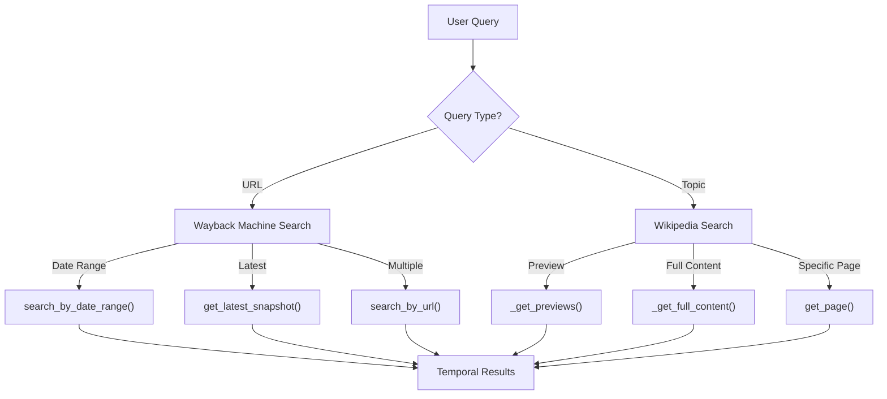

# Historical Sources

<cite>
**Referenced Files in This Document**   
- [search_engine_wayback.py](file://src/local_deep_research/web_search_engines/engines/search_engine_wayback.py)
- [search_engine_wikipedia.py](file://src/local_deep_research/web_search_engines/engines/search_engine_wikipedia.py)
- [test_wikipedia_url_security.py](file://tests/test_wikipedia_url_security.py)
</cite>

## Table of Contents
1. [Introduction](#introduction)
2. [Wayback Machine Integration](#wayback-machine-integration)
3. [Wikipedia Integration](#wikipedia-integration)
4. [Temporal Query Capabilities](#temporal-query-capabilities)
5. [Content Preservation and Reliability](#content-preservation-and-reliability)
6. [Use Cases and Applications](#use-cases-and-applications)
7. [Limitations and Considerations](#limitations-and-considerations)

## Introduction
This document provides a comprehensive overview of historical search sources within the local-deep-research system, focusing on the Internet Archive's Wayback Machine and Wikipedia. These sources enable researchers to retrieve, analyze, and verify historical web content and structured knowledge. The system implements specialized search engines for both platforms, allowing temporal queries, version tracking, and content analysis across time. This documentation details the technical implementation, query capabilities, and practical applications for historical research.

## Wayback Machine Integration

The Wayback Machine integration provides access to archived versions of web pages through the Internet Archive's API. The `WaybackSearchEngine` class implements a comprehensive interface for retrieving historical snapshots of web content. It supports multiple query methods including URL-based searches, date-range queries, and closest-snapshot retrieval. The system automatically handles rate limiting and error recovery when interacting with the Wayback Machine APIs.

The implementation uses two primary endpoints: the available API for finding the closest snapshot to a given time, and the CDX API for retrieving multiple snapshots across a time range. When a non-URL query is provided, the system employs DuckDuckGo search to identify relevant URLs for archiving. Each snapshot includes metadata such as timestamp, original URL, and availability status, enabling precise temporal analysis of web content evolution.

**Section sources**
- [search_engine_wayback.py](file://src/local_deep_research/web_search_engines/engines/search_engine_wayback.py#L14-L539)

## Wikipedia Integration

The Wikipedia integration provides access to structured knowledge through the Wikipedia API. The `WikipediaSearchEngine` class implements a two-phase search approach that first retrieves page previews and summaries, then fetches full content for relevant results. The system supports multiple languages through configurable language settings and handles common Wikipedia-specific issues such as disambiguation pages and page errors.

The search process begins with a query that returns page titles and brief summaries. For relevant results, the system retrieves complete page content including text, categories, references, links, images, and section structure. The implementation includes robust error handling for disambiguation scenarios, automatically attempting to resolve ambiguous queries by selecting from suggested options. Content retrieval is rate-limited to comply with Wikipedia's usage policies.

**Section sources**
- [search_engine_wikipedia.py](file://src/local_deep_research/web_search_engines/engines/search_engine_wikipedia.py#L11-L303)

## Temporal Query Capabilities

The system provides sophisticated temporal query capabilities for both historical sources. For the Wayback Machine, users can search for archived versions of URLs within specific date ranges using the `search_by_date_range` method, which accepts start and end dates in YYYYMMDD format. The `get_latest_snapshot` method retrieves the most recent archived version of a URL, while the `search_by_url` method returns multiple snapshots with configurable limits.

For Wikipedia, while the platform itself doesn't provide direct temporal querying of article versions, the system enables temporal analysis through historical context in article content and revision history access. The search engine can retrieve the complete revision history of articles, allowing analysis of content changes over time. When combined with the Wayback Machine, this enables comprehensive tracking of information evolution across different time periods.

**Diagram sources**
- [search_engine_wayback.py](file://src/local_deep_research/web_search_engines/engines/search_engine_wayback.py#L420-L487)
- [search_engine_wikipedia.py](file://src/local_deep_research/web_search_engines/engines/search_engine_wikipedia.py#L51-L148)

## Content Preservation and Reliability

Content preservation mechanisms differ significantly between the two sources. The Wayback Machine preserves complete web page snapshots, including HTML structure and sometimes associated resources, though completeness varies based on crawling frequency and website complexity. The system processes these snapshots to remove boilerplate content using the jusText algorithm, extracting meaningful text while preserving the original context.

Wikipedia content is inherently structured and version-controlled, with every edit tracked and accessible through the revision history API. The system extracts structured data from infoboxes and other templates when available, though this requires additional parsing beyond the standard API response. Both systems implement URL validation to ensure source integrity, with specific checks for Wikipedia URLs to prevent spoofing or redirection to non-Wikipedia domains.

**Section sources**
- [search_engine_wayback.py](file://src/local_deep_research/web_search_engines/engines/search_engine_wayback.py#L280-L302)
- [test_wikipedia_url_security.py](file://tests/test_wikipedia_url_security.py#L136-L165)

## Use Cases and Applications

These historical sources enable several important research applications. Tracking information evolution is possible by comparing snapshots of the same URL across different time periods or analyzing Wikipedia article revisions over time. Verifying historical claims can be accomplished by retrieving archived versions of news articles or web pages that may no longer exist in their original form.

Content change analysis allows researchers to study how information about specific topics has evolved, identifying additions, deletions, or modifications in narratives. The combination of Wayback Machine archives and Wikipedia's structured knowledge provides complementary perspectives on historical events and topics. Researchers can also analyze editorial patterns in Wikipedia by examining revision frequency, contributor activity, and content stability over time.

**Section sources**
- [search_engine_wayback.py](file://src/local_deep_research/web_search_engines/engines/search_engine_wayback.py#L136-L232)
- [search_engine_wikipedia.py](file://src/local_deep_research/web_search_engines/engines/search_engine_wikipedia.py#L252-L294)

## Limitations and Considerations

Several limitations affect the reliability and completeness of historical research using these sources. The Wayback Machine's archive is incomplete, with varying coverage depending on website popularity, robots.txt restrictions, and technical limitations of web crawling. Some content such as JavaScript-generated elements or password-protected areas may not be preserved in snapshots.

Wikipedia's editorial policies and community moderation can affect content reliability, with potential for bias, vandalism, or systematic exclusion of certain perspectives. The platform's neutral point of view policy and verifiability requirements provide some quality control, but contested topics may exhibit ongoing edit wars or content instability. Rate limiting is enforced for both sources to comply with usage policies, which may impact the speed and volume of historical data retrieval.

**Section sources**
- [search_engine_wayback.py](file://src/local_deep_research/web_search_engines/engines/search_engine_wayback.py#L149-L177)
- [search_engine_wikipedia.py](file://src/local_deep_research/web_search_engines/engines/search_engine_wikipedia.py#L88-L120)