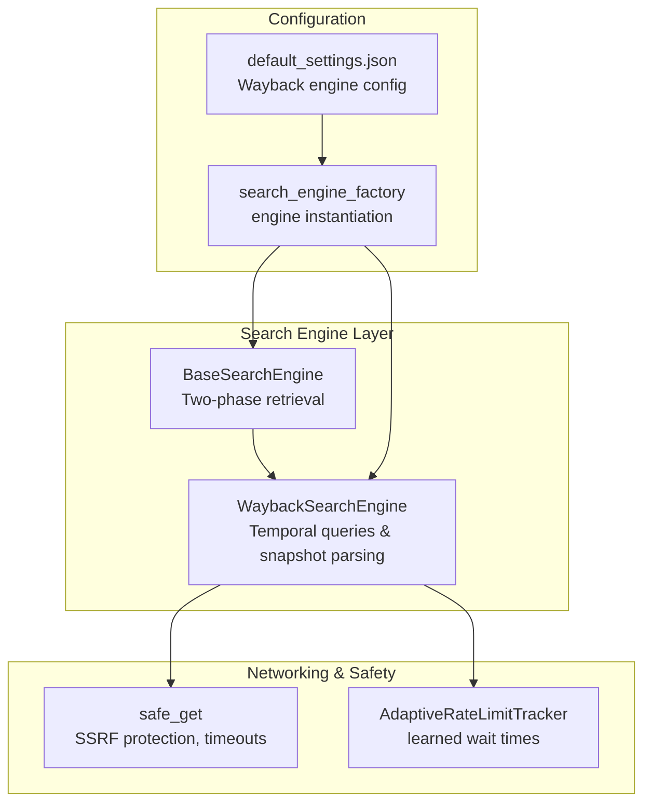
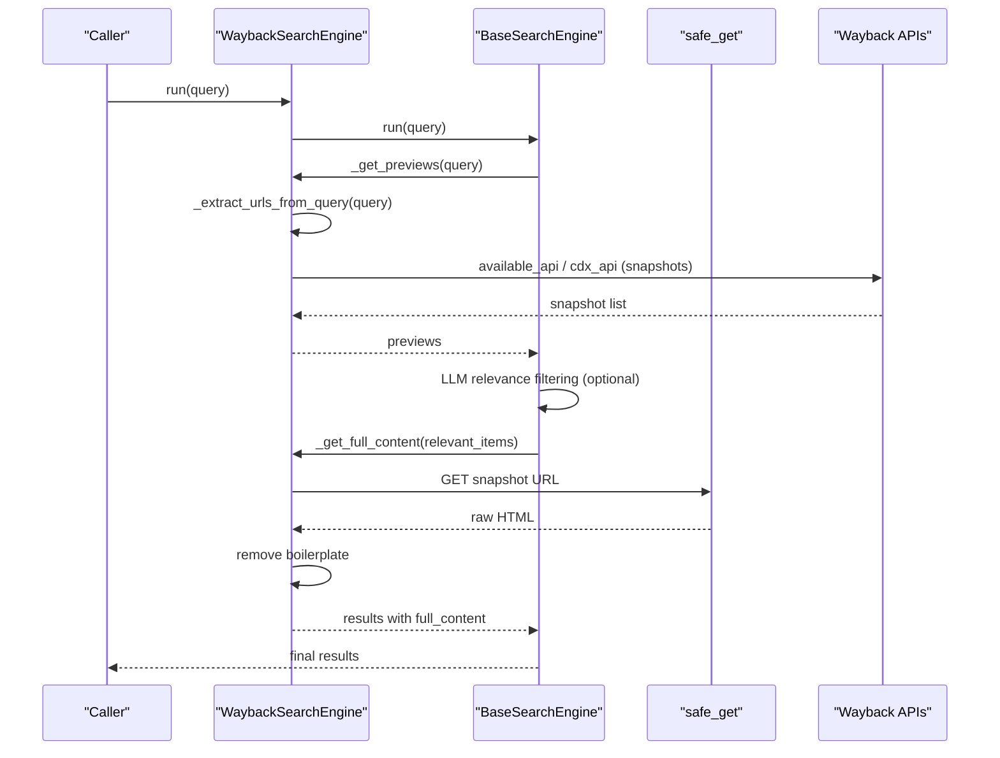
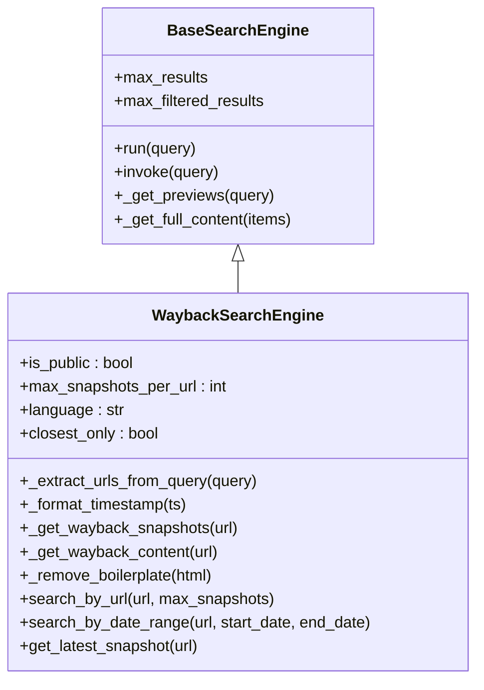
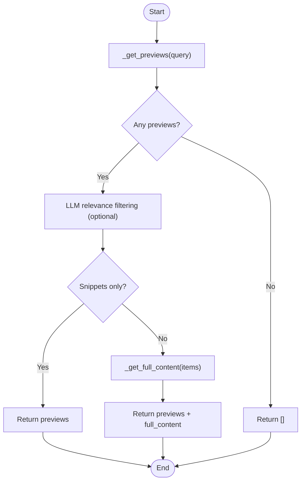
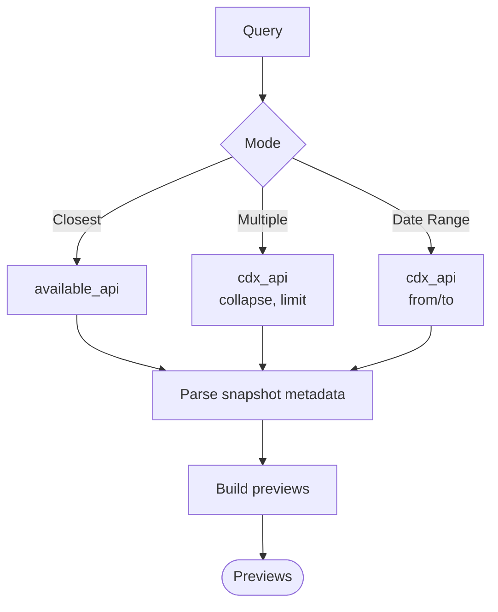
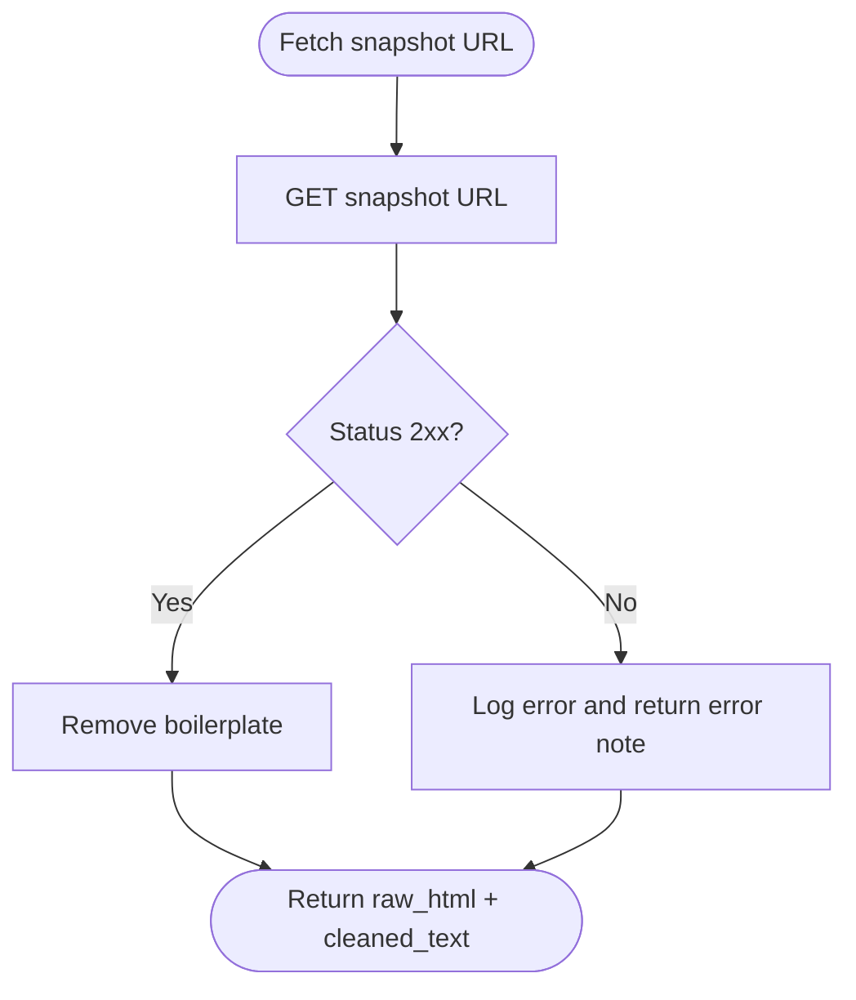
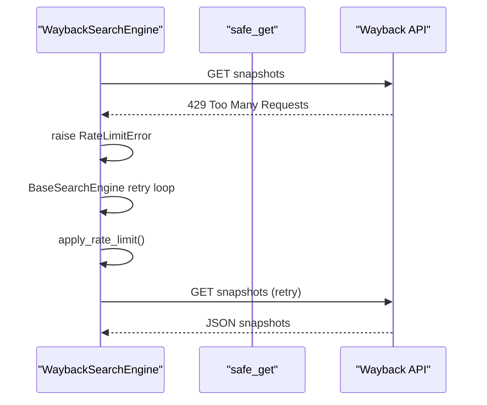
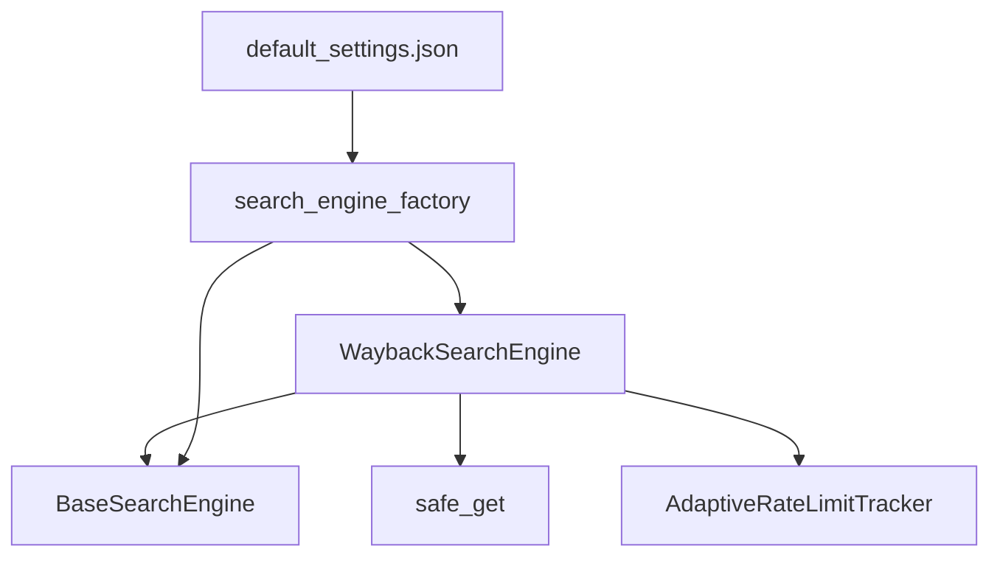

# Web Archiving (Wayback Machine)

<cite>
**Referenced Files in This Document**
- [search_engine_wayback.py](file://src/local_deep_research/web_search_engines/engines/search_engine_wayback.py)
- [search_engine_base.py](file://src/local_deep_research/web_search_engines/search_engine_base.py)
- [safe_requests.py](file://src/local_deep_research/security/safe_requests.py)
- [tracker.py](file://src/local_deep_research/web_search_engines/rate_limiting/tracker.py)
- [search_engine_factory.py](file://src/local_deep_research/web_search_engines/search_engine_factory.py)
- [search_config.py](file://src/local_deep_research/config/search_config.py)
- [default_settings.json](file://src/defaults/default_settings.json)
- [test_search_engine_wayback.py](file://tests/search_engines/test_search_engine_wayback.py)
</cite>

## Table of Contents
1. [Introduction](#introduction)
2. [Project Structure](#project-structure)
3. [Core Components](#core-components)
4. [Architecture Overview](#architecture-overview)
5. [Detailed Component Analysis](#detailed-component-analysis)
6. [Dependency Analysis](#dependency-analysis)
7. [Performance Considerations](#performance-considerations)
8. [Troubleshooting Guide](#troubleshooting-guide)
9. [Conclusion](#conclusion)
10. [Appendices](#appendices)

## Introduction
This document explains the Wayback Machine integration as a historical search source within the system. It covers how the Internet Archive’s snapshot system enables temporal web content retrieval, including querying for specific dates, handling missing snapshots, and navigating version timelines. It documents the implementation of temporal queries in the search engine adapter, error handling for unavailable archives, and strategies for verifying content integrity across snapshots. Practical examples demonstrate tracking website evolution, recovering deleted content, and verifying historical claims. Limitations such as incomplete crawling coverage, JavaScript-heavy sites that may not archive properly, and legal considerations around archived content are addressed, along with guidance on interpreting capture timestamps and assessing archive reliability.

## Project Structure
The Wayback Machine integration is implemented as a dedicated search engine class that inherits from the shared BaseSearchEngine. It uses safe HTTP requests, adaptive rate limiting, and supports multiple temporal query modes:
- Closest snapshot retrieval
- Multiple snapshots per URL
- Date-range filtering
- Latest snapshot retrieval

**Diagram sources**
- [search_engine_wayback.py](file://src/local_deep_research/web_search_engines/engines/search_engine_wayback.py#L1-L120)
- [search_engine_base.py](file://src/local_deep_research/web_search_engines/search_engine_base.py#L1-L120)
- [safe_requests.py](file://src/local_deep_research/security/safe_requests.py#L1-L117)
- [tracker.py](file://src/local_deep_research/web_search_engines/rate_limiting/tracker.py#L226-L313)
- [search_engine_factory.py](file://src/local_deep_research/web_search_engines/search_engine_factory.py#L195-L256)
- [default_settings.json](file://src/defaults/default_settings.json#L4072-L4157)

**Section sources**
- [search_engine_wayback.py](file://src/local_deep_research/web_search_engines/engines/search_engine_wayback.py#L1-L120)
- [search_engine_base.py](file://src/local_deep_research/web_search_engines/search_engine_base.py#L1-L120)
- [safe_requests.py](file://src/local_deep_research/security/safe_requests.py#L1-L117)
- [tracker.py](file://src/local_deep_research/web_search_engines/rate_limiting/tracker.py#L226-L313)
- [search_engine_factory.py](file://src/local_deep_research/web_search_engines/search_engine_factory.py#L195-L256)
- [default_settings.json](file://src/defaults/default_settings.json#L4072-L4157)

## Core Components
- WaybackSearchEngine: Implements temporal queries, snapshot discovery, and content retrieval.
- BaseSearchEngine: Provides the two-phase retrieval pipeline (previews → relevance filtering → full content).
- safe_get: Secure HTTP client with SSRF protections and timeouts.
- AdaptiveRateLimitTracker: Learns wait times per engine and applies rate limiting.
- search_engine_factory: Loads engine configuration and instantiates the Wayback engine.
- default_settings.json: Declares Wayback engine metadata and defaults.

Key capabilities:
- Extract URLs from queries or domains
- Retrieve closest snapshot, multiple snapshots, or snapshots within a date range
- Fetch full content and remove boilerplate for readability
- Respect snippet-only mode and apply rate limiting between requests

**Section sources**
- [search_engine_wayback.py](file://src/local_deep_research/web_search_engines/engines/search_engine_wayback.py#L1-L120)
- [search_engine_base.py](file://src/local_deep_research/web_search_engines/search_engine_base.py#L235-L445)
- [safe_requests.py](file://src/local_deep_research/security/safe_requests.py#L21-L96)
- [tracker.py](file://src/local_deep_research/web_search_engines/rate_limiting/tracker.py#L226-L313)
- [search_engine_factory.py](file://src/local_deep_research/web_search_engines/search_engine_factory.py#L195-L256)
- [default_settings.json](file://src/defaults/default_settings.json#L4072-L4157)

## Architecture Overview
The Wayback integration follows the BaseSearchEngine pattern:
1. Previews: Extract URLs from the query and collect snapshot metadata from the Wayback Machine.
2. Relevance filtering: Optionally filter previews using an LLM.
3. Full content: Optionally retrieve and clean full HTML content for selected snapshots.

**Diagram sources**
- [search_engine_wayback.py](file://src/local_deep_research/web_search_engines/engines/search_engine_wayback.py#L234-L379)
- [search_engine_base.py](file://src/local_deep_research/web_search_engines/search_engine_base.py#L258-L445)
- [safe_requests.py](file://src/local_deep_research/security/safe_requests.py#L21-L96)

## Detailed Component Analysis

### WaybackSearchEngine: Temporal Queries and Snapshot Retrieval
- URL extraction: Supports full URLs, domains, and partial paths; falls back to DuckDuckGo when needed.
- Snapshot discovery:
  - Closest-only mode uses the “available” endpoint to return the nearest snapshot.
  - Multiple snapshots use the CDX endpoint with collapse and limit controls.
  - Date-range queries filter snapshots by start and end dates.
- Content retrieval:
  - Fetches raw HTML and removes boilerplate using a text extraction library.
  - Respects snippet-only mode to avoid downloading full content.
- Utilities:
  - Timestamp formatting for human-readable dates.
  - Rate-limit-aware requests and error propagation.

**Diagram sources**
- [search_engine_base.py](file://src/local_deep_research/web_search_engines/search_engine_base.py#L35-L120)
- [search_engine_wayback.py](file://src/local_deep_research/web_search_engines/engines/search_engine_wayback.py#L14-L120)

**Section sources**
- [search_engine_wayback.py](file://src/local_deep_research/web_search_engines/engines/search_engine_wayback.py#L57-L120)
- [search_engine_wayback.py](file://src/local_deep_research/web_search_engines/engines/search_engine_wayback.py#L136-L232)
- [search_engine_wayback.py](file://src/local_deep_research/web_search_engines/engines/search_engine_wayback.py#L234-L379)
- [search_engine_wayback.py](file://src/local_deep_research/web_search_engines/engines/search_engine_wayback.py#L381-L539)

### Two-Phase Retrieval Pipeline
- Preview phase: Collect snapshot metadata and links.
- Filtering phase: Optionally apply LLM-based relevance filtering.
- Full-content phase: Download and clean HTML for selected snapshots.

**Diagram sources**
- [search_engine_base.py](file://src/local_deep_research/web_search_engines/search_engine_base.py#L258-L445)

**Section sources**
- [search_engine_base.py](file://src/local_deep_research/web_search_engines/search_engine_base.py#L258-L445)

### Temporal Query Modes
- Closest snapshot: Uses the “available” endpoint to return the nearest archived snapshot.
- Multiple snapshots: Uses the CDX endpoint with collapse and limit to retrieve several snapshots per URL.
- Date-range search: Filters snapshots by a start and end date.
- Latest snapshot: Convenience method that returns the most recent snapshot.

**Diagram sources**
- [search_engine_wayback.py](file://src/local_deep_research/web_search_engines/engines/search_engine_wayback.py#L136-L232)
- [search_engine_wayback.py](file://src/local_deep_research/web_search_engines/engines/search_engine_wayback.py#L420-L488)

**Section sources**
- [search_engine_wayback.py](file://src/local_deep_research/web_search_engines/engines/search_engine_wayback.py#L136-L232)
- [search_engine_wayback.py](file://src/local_deep_research/web_search_engines/engines/search_engine_wayback.py#L420-L488)

### Content Integrity and Cleaning
- Full HTML retrieval with a controlled User-Agent header.
- Boilerplate removal to extract main content for readability.
- Graceful error handling when content cannot be fetched.

**Diagram sources**
- [search_engine_wayback.py](file://src/local_deep_research/web_search_engines/engines/search_engine_wayback.py#L304-L347)
- [search_engine_wayback.py](file://src/local_deep_research/web_search_engines/engines/search_engine_wayback.py#L280-L303)

**Section sources**
- [search_engine_wayback.py](file://src/local_deep_research/web_search_engines/engines/search_engine_wayback.py#L280-L347)

### Error Handling and Rate Limiting
- 429 responses from Wayback Machine trigger a rate limit error, which is propagated to the base class retry mechanism.
- The engine applies rate limiting between requests to avoid hitting API quotas.
- Safe HTTP requests enforce timeouts and SSRF protections.

**Diagram sources**
- [search_engine_wayback.py](file://src/local_deep_research/web_search_engines/engines/search_engine_wayback.py#L148-L195)
- [search_engine_base.py](file://src/local_deep_research/web_search_engines/search_engine_base.py#L300-L428)
- [tracker.py](file://src/local_deep_research/web_search_engines/rate_limiting/tracker.py#L291-L313)
- [safe_requests.py](file://src/local_deep_research/security/safe_requests.py#L21-L96)

**Section sources**
- [search_engine_wayback.py](file://src/local_deep_research/web_search_engines/engines/search_engine_wayback.py#L148-L195)
- [search_engine_base.py](file://src/local_deep_research/web_search_engines/search_engine_base.py#L300-L428)
- [tracker.py](file://src/local_deep_research/web_search_engines/rate_limiting/tracker.py#L291-L313)
- [safe_requests.py](file://src/local_deep_research/security/safe_requests.py#L21-L96)

## Dependency Analysis
- WaybackSearchEngine depends on:
  - BaseSearchEngine for the two-phase retrieval pipeline
  - safe_get for secure HTTP requests
  - AdaptiveRateLimitTracker for wait-time learning and enforcement
  - search_engine_factory for configuration-driven instantiation
  - default_settings.json for engine metadata and defaults

**Diagram sources**
- [search_engine_wayback.py](file://src/local_deep_research/web_search_engines/engines/search_engine_wayback.py#L1-L120)
- [search_engine_base.py](file://src/local_deep_research/web_search_engines/search_engine_base.py#L1-L120)
- [safe_requests.py](file://src/local_deep_research/security/safe_requests.py#L1-L117)
- [tracker.py](file://src/local_deep_research/web_search_engines/rate_limiting/tracker.py#L226-L313)
- [search_engine_factory.py](file://src/local_deep_research/web_search_engines/search_engine_factory.py#L195-L256)
- [default_settings.json](file://src/defaults/default_settings.json#L4072-L4157)

**Section sources**
- [search_engine_wayback.py](file://src/local_deep_research/web_search_engines/engines/search_engine_wayback.py#L1-L120)
- [search_engine_base.py](file://src/local_deep_research/web_search_engines/search_engine_base.py#L1-L120)
- [safe_requests.py](file://src/local_deep_research/security/safe_requests.py#L1-L117)
- [tracker.py](file://src/local_deep_research/web_search_engines/rate_limiting/tracker.py#L226-L313)
- [search_engine_factory.py](file://src/local_deep_research/web_search_engines/search_engine_factory.py#L195-L256)
- [default_settings.json](file://src/defaults/default_settings.json#L4072-L4157)

## Performance Considerations
- Rate limiting: The engine uses learned wait times to balance throughput and reliability. Between requests, it applies rate limiting to avoid API throttling.
- Concurrency: The base class retry loop with adaptive wait helps recover from transient failures.
- Content fetching: Full content retrieval is optional and controlled by snippet-only mode to reduce bandwidth and latency.
- Memory and timeouts: HTTP requests enforce timeouts and response size caps to prevent resource exhaustion.

[No sources needed since this section provides general guidance]

## Troubleshooting Guide
Common issues and resolutions:
- No URLs found in query: The engine attempts DuckDuckGo fallback; if that fails, previews are empty.
- Missing snapshots: The “available” endpoint may not return a closest snapshot; the engine returns an empty list.
- Rate limit errors: 429 responses trigger retries with increasing wait times; adjust profiles if necessary.
- Content retrieval errors: Network failures or malformed HTML lead to error notes; the engine continues with previews.

Validation via tests:
- Initialization and API endpoints
- URL extraction from various query forms
- Snapshot retrieval modes and error handling
- Date-range search and latest snapshot retrieval
- Full content retrieval and snippet-only mode

**Section sources**
- [test_search_engine_wayback.py](file://tests/search_engines/test_search_engine_wayback.py#L1-L120)
- [test_search_engine_wayback.py](file://tests/search_engines/test_search_engine_wayback.py#L175-L300)
- [test_search_engine_wayback.py](file://tests/search_engines/test_search_engine_wayback.py#L302-L416)
- [test_search_engine_wayback.py](file://tests/search_engines/test_search_engine_wayback.py#L417-L524)
- [test_search_engine_wayback.py](file://tests/search_engines/test_search_engine_wayback.py#L525-L669)

## Conclusion
The Wayback Machine integration provides robust temporal web content retrieval with support for closest snapshots, multiple snapshots, and date-range queries. It integrates safely with the broader search framework, respects snippet-only preferences, and applies adaptive rate limiting to maintain reliability. While the system offers powerful capabilities for tracking website evolution and verifying historical claims, users should be aware of limitations such as incomplete crawling coverage and JavaScript-heavy sites that may not archive reliably. Legal and ethical considerations around archived content remain the responsibility of the user.

[No sources needed since this section summarizes without analyzing specific files]

## Appendices

### Practical Use Cases
- Tracking website evolution: Use multiple snapshots per URL to observe changes over time.
- Recovering deleted content: Retrieve the latest snapshot or snapshots within a date range.
- Verifying historical claims: Compare archived content with current versions to assess accuracy.

[No sources needed since this section provides general guidance]

### Limitations and Best Practices
- Incomplete crawling coverage: Not all pages are archived; rely on multiple snapshots and corroborate with other sources.
- JavaScript-heavy sites: Snapshots may not reflect dynamic content; prefer server-rendered or static pages when possible.
- Legal considerations: Respect copyright and terms of service; use archived content for research and verification only.

[No sources needed since this section provides general guidance]

### Interpreting Capture Timestamps and Reliability
- Timestamps: The engine formats timestamps into human-readable dates; use these to assess recency and plan follow-up searches.
- Reliability: Configure engine reliability and strengths in settings; use multiple sources for critical research.

**Section sources**
- [search_engine_wayback.py](file://src/local_deep_research/web_search_engines/engines/search_engine_wayback.py#L120-L135)
- [default_settings.json](file://src/defaults/default_settings.json#L4072-L4157)