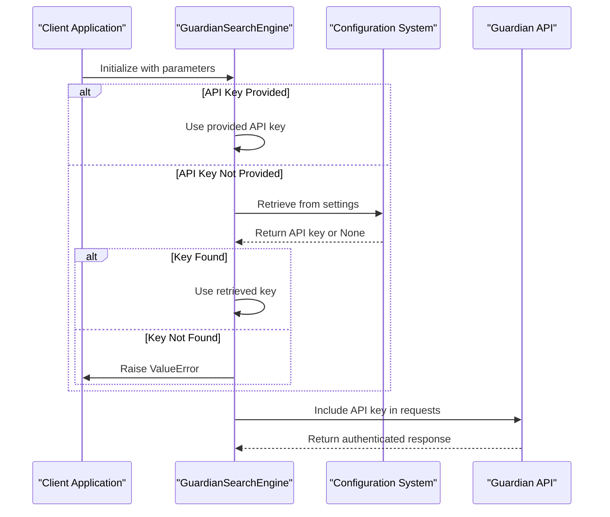
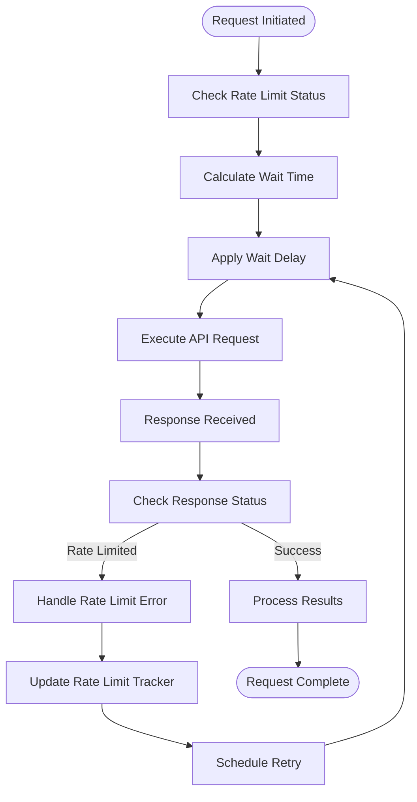
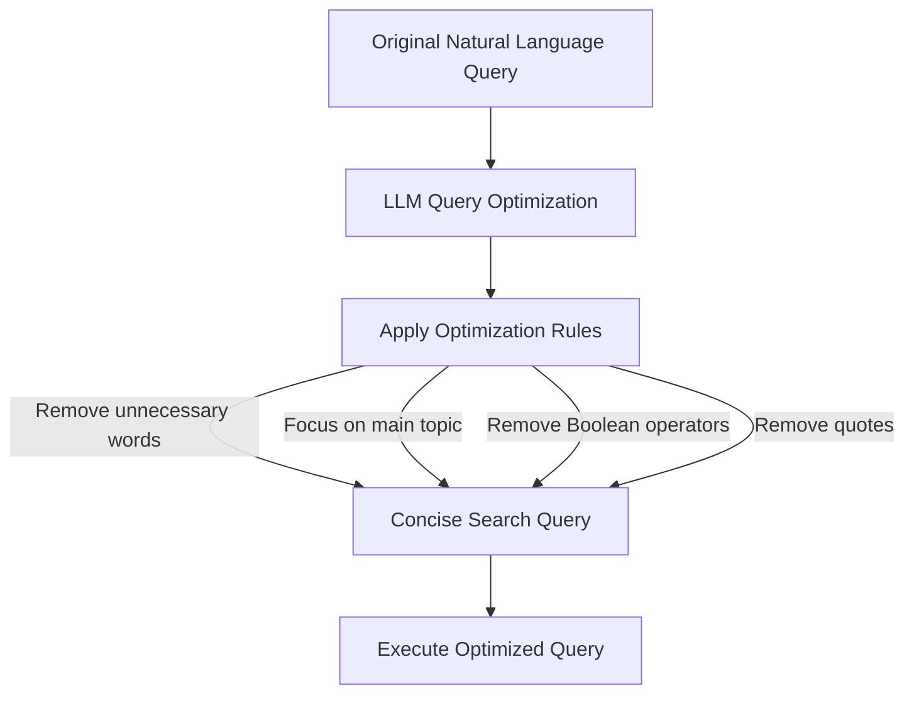
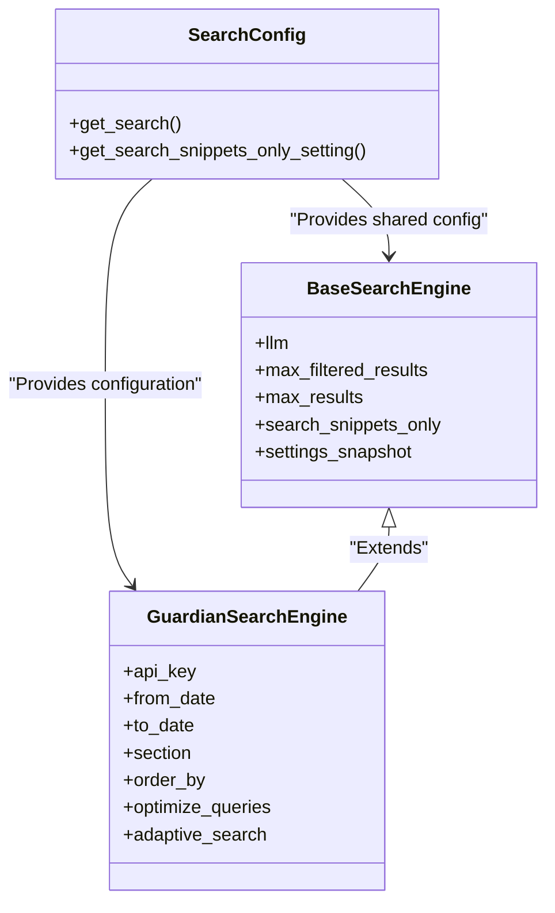

# Commercial News Sources

<cite>
**Referenced Files in This Document**   
- [search_engine_guardian.py](file://src/local_deep_research/web_search_engines/engines/search_engine_guardian.py)
- [search_config.py](file://src/local_deep_research/config/search_config.py)
- [api.py](file://src/local_deep_research/news/api.py)
- [search_engine_base.py](file://src/local_deep_research/web_search_engines/search_engine_base.py)
- [rate_limiter.py](file://src/local_deep_research/security/rate_limiter.py)
- [news.js](file://src/local_deep_research/web/static/js/pages/news.js)
</cite>

## Table of Contents
1. [Introduction](#introduction)
2. [API Authentication Mechanism](#api-authentication-mechanism)
3. [Request Rate Limits](#request-rate-limits)
4. [Commercial Usage Restrictions](#commercial-usage-restrictions)
5. [Query Parameters for Filtering](#query-parameters-for-filtering)
6. [Metadata Extraction](#metadata-extraction)
7. [Handling Paywalled Content](#handling-paywalled-content)
8. [Configuration Settings](#configuration-settings)
9. [Troubleshooting Guidance](#troubleshooting-guidance)

## Introduction
This document provides comprehensive documentation for integrating with commercial news sources, using The Guardian as the primary example. It covers the technical implementation details for API authentication, rate limiting, query filtering, metadata extraction, and handling of commercial restrictions. The system is designed to provide robust news retrieval capabilities while respecting API limitations and commercial terms of service.

The implementation leverages a modular search engine architecture that supports multiple commercial news providers, with The Guardian API serving as a representative example of the patterns used across different providers. The system includes sophisticated features for query optimization, adaptive search strategies, and relevance filtering to ensure high-quality results.

**Section sources**
- [search_engine_guardian.py](file://src/local_deep_research/web_search_engines/engines/search_engine_guardian.py#L1-L677)

## API Authentication Mechanism
The Guardian API authentication mechanism uses API keys for secure access to the news content. The system implements a multi-layered approach to API key management that supports both configuration-based and runtime-based key provisioning.

API keys can be provided through multiple channels:
- Direct parameter passing during engine initialization
- Environment variables (GUARDIAN_API_KEY)
- UI settings configuration stored in the database
- Settings snapshot mechanism for thread-safe access

The authentication process validates the API key during initialization of the `GuardianSearchEngine` class. If no key is provided through parameters, the system attempts to retrieve it from the settings using the `get_setting_from_snapshot` function with the path "search.engine.web.guardian.api_key". The system raises a `ValueError` if no valid API key is found, ensuring that requests are not made without proper authentication.



**Diagram sources**
- [search_engine_guardian.py](file://src/local_deep_research/web_search_engines/engines/search_engine_guardian.py#L56-L69)

## Request Rate Limits
The system implements comprehensive rate limiting to comply with API usage restrictions and prevent service disruption. Rate limiting is handled through a combination of client-side throttling and server-side error handling.

The `GuardianSearchEngine` applies rate limiting before each API request using the `rate_tracker.apply_rate_limit` method. This ensures that requests are spaced appropriately according to the API's rate limit policy. The rate limiting system tracks request history and calculates appropriate wait times between requests to avoid exceeding limits.

For The Guardian API specifically, the system implements the following rate limiting strategy:
- Adaptive wait times based on recent request patterns
- Retry mechanism with exponential backoff for rate-limited requests
- Tracking of success/failure rates to adjust future request timing
- Integration with the global rate limiting framework

The base search engine class provides the foundation for rate limiting through the `rate_tracker` attribute, which is initialized either from a global tracker (in normal mode) or a programmatic mode tracker. This allows for consistent rate limiting behavior across different execution contexts.



**Diagram sources**
- [search_engine_guardian.py](file://src/local_deep_research/web_search_engines/engines/search_engine_guardian.py#L367-L370)
- [search_engine_base.py](file://src/local_deep_research/web_search_engines/search_engine_base.py#L194-L204)

## Commercial Usage Restrictions
The system respects commercial usage restrictions through several mechanisms that control how news content is accessed and presented. These restrictions are implemented to comply with the terms of service of commercial news providers like The Guardian.

Key commercial usage restrictions include:
- **Snippets-only mode**: Configurable setting that limits results to metadata and snippets without full content
- **Query optimization**: Transformation of natural language queries into concise search terms to minimize API usage
- **Adaptive search strategies**: Intelligent adjustment of search parameters to reduce unnecessary requests
- **Caching mechanisms**: Storage of recent results to avoid redundant API calls

The `SEARCH_SNIPPETS_ONLY` configuration setting controls whether full content is retrieved from news sources. When enabled, the system returns only metadata and snippets, respecting the commercial nature of the content. This setting can be configured globally or on a per-user basis through the settings system.

The system also implements commercial usage restrictions through its query optimization capabilities. The `_optimize_query_for_guardian` method uses an LLM to transform natural language queries into highly focused search terms, reducing the scope of searches and minimizing API usage. This optimization follows strict rules to keep queries brief and focused, which helps reduce the load on commercial APIs.

**Section sources**
- [search_engine_guardian.py](file://src/local_deep_research/web_search_engines/engines/search_engine_guardian.py#L494-L497)
- [search_config.py](file://src/local_deep_research/config/search_config.py#L17-L31)

## Query Parameters for Filtering
The Guardian search engine supports comprehensive filtering capabilities through various query parameters that allow precise control over news retrieval. These parameters enable filtering by section, author, publication date, and other metadata attributes.

### Section Filtering
News can be filtered by section using the `section` parameter, which accepts section names such as "politics", "technology", or "sport". The system provides a dedicated `search_by_section` method that temporarily sets the section parameter and executes a search, then restores the original settings.

```python
def search_by_section(self, section: str, max_results: Optional[int] = None)
```

### Date Range Filtering
The system supports date-based filtering through `from_date` and `to_date` parameters, which accept dates in YYYY-MM-DD format. Default values are automatically set if not provided:
- `from_date`: Defaults to one month ago
- `to_date`: Defaults to today

The system also implements adaptive date range adjustment based on query type detection. Short queries are assumed to be about current events and use a 60-day lookback, while historical queries extend the range to 10 years.

### Sorting Options
Results can be ordered using the `order_by` parameter with the following options:
- "relevance" - Results sorted by relevance to the query
- "newest" - Results sorted by publication date (newest first)
- "oldest" - Results sorted by publication date (oldest first)

### Query Optimization
The system enhances query effectiveness through LLM-powered optimization. The `_optimize_query_for_guardian` method transforms natural language questions into concise search queries following these rules:
- Maximum 3-4 words total
- Focus on main topic, person, or event
- Remove unnecessary words and Boolean operators
- No quotes or special characters



**Diagram sources**
- [search_engine_guardian.py](file://src/local_deep_research/web_search_engines/engines/search_engine_guardian.py#L95-L171)

## Metadata Extraction
The system extracts comprehensive metadata from news articles to support rich content presentation and analysis. Metadata extraction is performed during the result formatting phase, where raw API responses are transformed into structured data objects.

### Extracted Metadata Fields
The following metadata fields are extracted from Guardian API responses:

| Field | Description | Source |
|------|-------------|--------|
| id | Unique article identifier | API response id field |
| title | Article headline | headline field in fields object |
| link | Article URL | webUrl field |
| snippet | Article summary/trail text | trailText field in fields object |
| publication_date | ISO 8601 formatted date | webPublicationDate field |
| section | Content section/category | sectionName field |
| author | Byline/author information | byline field in fields object |
| content | Full article body | body field in fields object |
| keywords | Article tags/keywords | tags array with type "keyword" |

### Metadata Processing
The metadata extraction process includes several normalization steps:
- Fallback values when primary fields are missing
- Text cleaning and formatting
- Keyword extraction from tags
- URL validation and sanitization

The `_get_all_data` method handles the metadata extraction process, mapping API response fields to standardized result fields. For example, the title is extracted using a fallback chain: `fields.headline` → `webTitle`, ensuring that a title is always available even if the primary field is missing.

The system also preserves the original API response structure while providing a simplified interface for downstream components. This allows for both easy consumption of common fields and access to raw data when needed.

**Section sources**
- [search_engine_guardian.py](file://src/local_deep_research/web_search_engines/engines/search_engine_guardian.py#L391-L413)

## Handling Paywalled Content
The system implements a sophisticated approach to handling paywalled content through a combination of configuration settings, content filtering, and integration with the citation system. This ensures compliance with commercial restrictions while still providing valuable information to users.

### Snippets-Only Mode
The primary mechanism for handling paywalled content is the `SEARCH_SNIPPETS_ONLY` setting, which controls whether full content is retrieved from news sources. When enabled, the system returns only metadata and snippets, effectively respecting paywalls.

The setting is checked in the `_get_full_content` method:
```python
if (hasattr(search_config, "SEARCH_SNIPPETS_ONLY") 
    and search_config.SEARCH_SNIPPETS_ONLY):
    return relevant_items
```

This prevents the system from attempting to retrieve full content when the configuration prohibits it, ensuring compliance with commercial terms.

### Citation System Integration
The system integrates paywall handling with its citation system to provide proper attribution while respecting content restrictions. When snippets-only mode is enabled, the citation system includes:
- Article metadata (title, author, publication date)
- Link to the original article
- Summary/snippet content
- Proper source attribution

The citation formatter ensures that paywalled content is represented appropriately in research reports, providing users with enough information to understand the relevance of a source while directing them to the original for full access.

### Adaptive Content Retrieval
The system implements adaptive content retrieval strategies that respect paywalls:
- Initial retrieval of metadata and snippets only
- Conditional full content retrieval based on configuration
- Caching of retrieved content to minimize repeated access
- Fallback to alternative sources when paywalled content is essential

This approach balances the need for comprehensive research with respect for commercial content restrictions.

**Section sources**
- [search_engine_guardian.py](file://src/local_deep_research/web_search_engines/engines/search_engine_guardian.py#L494-L497)
- [search_config.py](file://src/local_deep_research/config/search_config.py#L111-L116)

## Configuration Settings
The system provides extensive configuration options for controlling news source behavior, including freshness bias in search rankings and relevance scoring for breaking news detection. These settings are managed through a hierarchical configuration system that supports both global defaults and user-specific overrides.

### Freshness Bias Configuration
Freshness bias is controlled through date range parameters and sorting options:
- `from_date`: Start date for search (default: one month ago)
- `to_date`: End date for search (default: today)
- `order_by`: Sort order ("relevance", "newest", "oldest")

The system implements adaptive freshness bias through the `_adapt_dates_for_query_type` method, which automatically adjusts date ranges based on whether a query is classified as historical or current. Current events queries are biased toward recent content by:
- Setting the start date to 60 days ago
- Using "newest" sort order
- Prioritizing recent publications in relevance scoring

### Relevance Scoring for Breaking News
The system enhances relevance scoring for breaking news through several mechanisms:

1. **Query Type Detection**: Uses an LLM to classify queries as "HISTORICAL", "CURRENT", or "UNCLEAR"
2. **Adaptive Search Strategies**: Applies different search strategies based on query type
3. **Freshness Weighting**: Increases the weight of publication date in relevance calculations for current events

The relevance scoring system is implemented in the `_filter_for_relevance` method of the base search engine, which uses an LLM to evaluate result relevance based on:
- Direct relevance to the query topic
- Source quality and reputation
- Content recency (with freshness bias for current events)
- Comprehensive coverage of the topic

### Configuration Management
Configuration settings are managed through the `search_config.py` module, which provides lazy loading of settings with fallback defaults. The `get_setting_from_snapshot` function retrieves settings in a thread-safe manner, supporting both global defaults and user-specific overrides.

Key configuration parameters for news sources include:
- `search.snippets_only`: Controls full content retrieval
- `search.max_results`: Maximum number of results to return
- `search.max_filtered_results`: Maximum results after relevance filtering
- `search.engine.web.guardian.api_key`: Guardian API key



**Diagram sources**
- [search_config.py](file://src/local_deep_research/config/search_config.py#L17-L31)
- [search_engine_guardian.py](file://src/local_deep_research/web_search_engines/engines/search_engine_guardian.py#L20-L48)

## Troubleshooting Guidance
This section provides guidance for diagnosing and resolving common issues with the commercial news source integration, particularly focusing on API key validation failures and response format changes from the provider.

### API Key Validation Failures
Common causes and solutions for API key validation failures:

**Issue**: "Guardian API key not found" error
- **Cause**: No API key provided through parameters, environment variables, or settings
- **Solution**: 
  1. Verify the API key is set in the UI settings under "Guardian API key"
  2. Check that the environment variable GUARDIAN_API_KEY is properly set
  3. Ensure the key is not a placeholder value (e.g., "YOUR_API_KEY_HERE")

**Issue**: Authentication failures despite valid key
- **Cause**: Key format issues or provider-side restrictions
- **Solution**:
  1. Verify the key doesn't contain leading/trailing whitespace
  2. Check that the key has the necessary permissions for the requested endpoints
  3. Test the key directly against the Guardian API using curl or a REST client

The system validates API keys during `GuardianSearchEngine` initialization, raising a `ValueError` if no valid key is found. This early validation prevents failed API requests and provides clear error messages.

### Response Format Changes
The system includes robust error handling for response format changes from the provider:

**Issue**: JSON parsing errors or missing fields
- **Cause**: Provider has changed their API response structure
- **Solution**:
  1. Check the Guardian API documentation for recent changes
  2. Update the field mapping in `_get_all_data` to match the new structure
  3. Implement fallbacks for missing fields

The system uses defensive programming practices to handle format changes:
- Fallback chains for critical fields (e.g., title: headline → webTitle)
- Graceful degradation when non-essential fields are missing
- Comprehensive error logging to aid in diagnosis

### Debugging Tools
The system provides several debugging tools to assist with troubleshooting:

1. **Verbose Logging**: Detailed logs of API requests and responses (with API keys redacted)
2. **Search Metadata**: The `run` method stores search metadata including:
   - Original and optimized queries
   - Applied search strategy
   - Date range parameters
   - Section and sorting options

3. **Adaptive Search Logging**: The adaptive search system logs its decision-making process, showing:
   - Initial search results count
   - Applied alternative strategies
   - Final selected strategy

To enable detailed debugging, ensure logging is configured to capture INFO level messages from the `GuardianSearchEngine` class. This will provide visibility into the complete search process, from query optimization through result retrieval.

**Section sources**
- [search_engine_guardian.py](file://src/local_deep_research/web_search_engines/engines/search_engine_guardian.py#L66-L69)
- [search_engine_guardian.py](file://src/local_deep_research/web_search_engines/engines/search_engine_guardian.py#L362-L365)