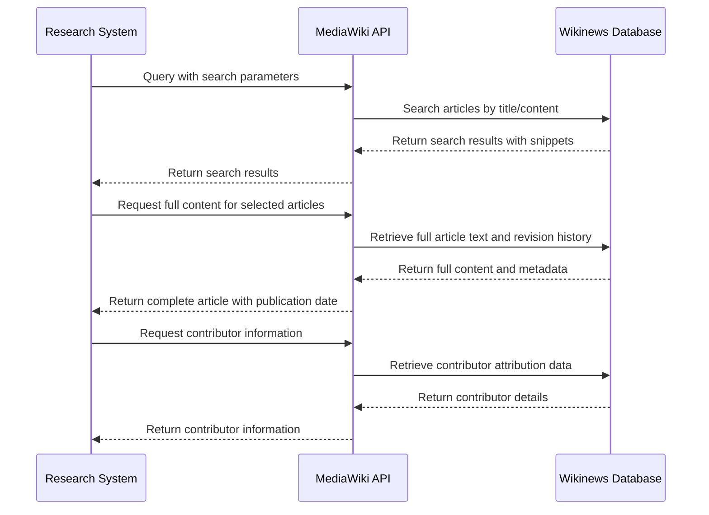
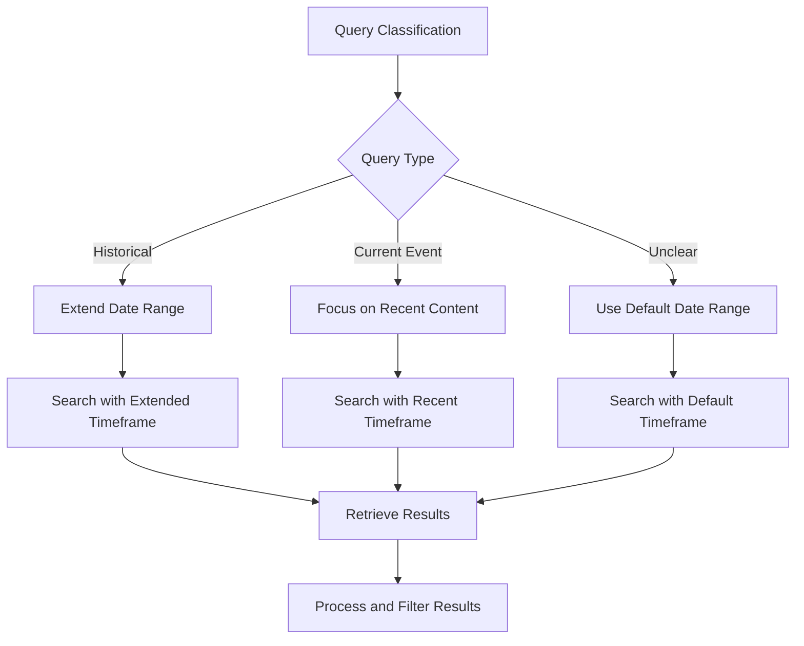
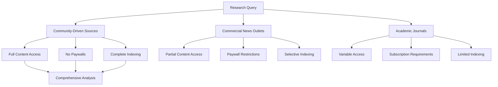
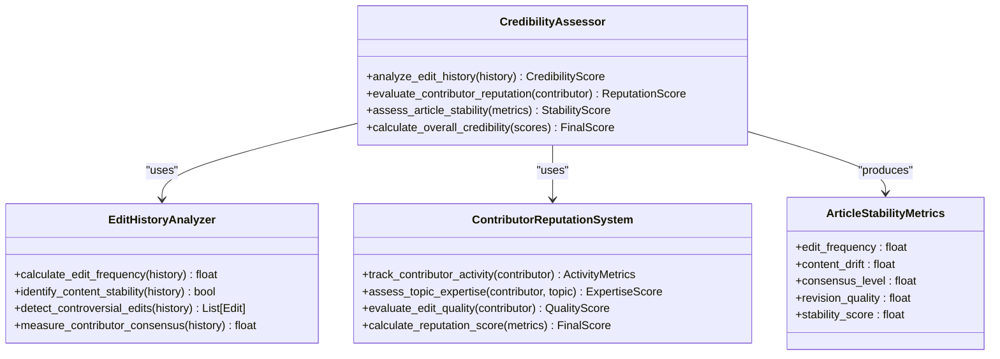
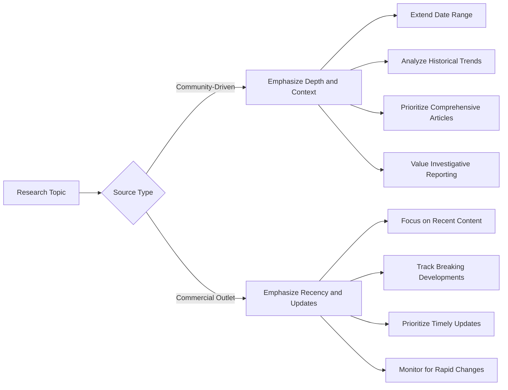

# Community-Driven News Sources

<cite>
**Referenced Files in This Document**   
- [search_engine_wikinews.py](file://src/local_deep_research/web_search_engines/engines/search_engine_wikinews.py)
- [api.py](file://src/local_deep_research/news/api.py)
- [scheduler.py](file://src/local_deep_research/news/subscription_manager/scheduler.py)
- [folder_manager.py](file://src/local_deep_research/news/folder_manager.py)
- [default_settings.json](file://src/local_deep_research/defaults/default_settings.json)
- [journal_reputation_filter.py](file://src/local_deep_research/advanced_search_system/filters/journal_reputation_filter.py)
- [news.js](file://src/local_deep_research/web/static/js/pages/news.js)
</cite>

## Table of Contents
1. [Introduction](#introduction)
2. [Open-Content Model and Editorial Process](#open-content-model-and-editorial-process)
3. [MediaWiki API Integration](#mediawiki-api-integration)
4. [Content Freshness and Update Cycles](#content-freshness-and-update-cycles)
5. [Access and Indexing Characteristics](#access-and-indexing-characteristics)
6. [Credibility Assessment Configuration](#credibility-assessment-configuration)
7. [Handling Update Frequency and Reporting Style](#handling-update-frequency-and-reporting-style)
8. [Conclusion](#conclusion)

## Introduction
Community-driven news sources represent a collaborative approach to journalism where content is created, edited, and maintained by a distributed network of volunteers rather than professional journalists or corporate media organizations. This documentation focuses on Wikinews as a reference implementation, examining its technical integration patterns, editorial processes, and reliability characteristics within the Local Deep Research system. The analysis covers how community-driven news sources are integrated into research workflows, their unique content characteristics, and configuration options for assessing credibility and managing their distinct update patterns.

## Open-Content Model and Editorial Process
Community-driven news platforms like Wikinews operate on an open-content model where anyone can contribute to and edit articles, creating a dynamic but potentially inconsistent information source. The editorial process is volunteer-driven, with contributors following established guidelines to maintain quality and neutrality.

The system implements a neutral point of view policy that affects content reliability by requiring contributors to present information fairly and without bias. This policy is enforced through community consensus and editorial oversight, though the effectiveness varies based on contributor expertise and engagement levels. The volunteer nature of contributions means that article quality and depth can be inconsistent, with some topics receiving extensive coverage while others remain underdeveloped.

The integration with the research system respects these characteristics by treating community-driven sources as one component of a broader information ecosystem, rather than a definitive authority. The system acknowledges that while these sources can provide valuable perspectives and information, their reliability must be assessed through additional verification mechanisms.

**Section sources**
- [search_engine_wikinews.py](file://src/local_deep_research/web_search_engines/engines/search_engine_wikinews.py#L1-L535)

## MediaWiki API Integration
The integration with community-driven news sources follows a standardized pattern using the MediaWiki API, which provides programmatic access to content and metadata. This integration enables several key capabilities that support research workflows.

**Diagram sources**
- [search_engine_wikinews.py](file://src/local_deep_research/web_search_engines/engines/search_engine_wikinews.py#L267-L494)

The integration pattern includes category-based querying, which allows researchers to filter content by topic areas such as politics, technology, or sports. This categorization helps organize the vast amount of community-generated content into manageable segments for analysis.

Revision history access is a critical component of the integration, providing transparency into how articles have evolved over time. Each article's edit history is accessible through the API, showing when changes were made, what content was modified, and which contributors were responsible. This historical record enables researchers to assess the stability and consensus around specific information.

Contributor attribution is implemented to identify the individuals behind content creation and modification. The system captures contributor usernames and can analyze their editing patterns, which supports credibility assessment by revealing contributor expertise and potential biases. This attribution data is particularly valuable for evaluating the reliability of information, as frequent contributors to specific topics may develop subject matter expertise.

**Section sources**
- [search_engine_wikinews.py](file://src/local_deep_research/web_search_engines/engines/search_engine_wikinews.py#L267-L494)

## Content Freshness and Update Cycles
Community-driven news sources typically exhibit slower update cycles compared to commercial news outlets, reflecting the volunteer nature of content creation and the deliberate editorial processes designed to ensure accuracy. This characteristic affects how the research system interacts with and prioritizes information from these sources.

The system accounts for these slower update cycles by adjusting its temporal expectations and search parameters. When querying community-driven sources, the research system extends its date range filters to capture relevant historical context and ongoing developments that may not have immediate coverage. This approach recognizes that community-driven platforms often prioritize comprehensive, well-vetted reporting over breaking news speed.

The integration implements adaptive date range functionality that automatically adjusts based on the query type. For historical topics, the system expands the search timeframe to include older content, while for current events, it focuses on recent contributions. This adaptability ensures that the research system can effectively retrieve relevant information regardless of the source's update frequency.

**Diagram sources**
- [search_engine_wikinews.py](file://src/local_deep_research/web_search_engines/engines/search_engine_wikinews.py#L202-L266)

The system also implements query optimization techniques to improve result relevance given the potentially slower content updates. Natural language queries are transformed into concise search terms that maximize the chances of finding relevant articles, even when exact matches may not exist due to the time lag in content creation.

**Section sources**
- [search_engine_wikinews.py](file://src/local_deep_research/web_search_engines/engines/search_engine_wikinews.py#L118-L201)

## Access and Indexing Characteristics
Community-driven news sources are characterized by the absence of paywalls and commercial restrictions, enabling full-content indexing and unrestricted access to information. This open access model supports comprehensive research by allowing the system to retrieve and analyze complete articles without limitations.

The lack of access barriers facilitates deep content analysis, as the research system can process entire articles rather than being restricted to abstracts or summaries. This capability is particularly valuable for extracting nuanced information, identifying subtle biases, and understanding the full context of reported events.

**Diagram sources**
- [search_engine_wikinews.py](file://src/local_deep_research/web_search_engines/engines/search_engine_wikinews.py#L52-L54)

The open nature of these sources also enables the system to implement more sophisticated content processing techniques, such as extracting key entities, identifying thematic elements, and mapping relationships between articles. This comprehensive access supports the creation of rich knowledge graphs that connect information across multiple community-driven sources.

The system leverages this unrestricted access to build detailed content profiles that include not only the article text but also metadata such as publication history, contributor information, and editorial discussions. This holistic view of the content enhances the research capabilities by providing context that would be unavailable from restricted sources.

**Section sources**
- [search_engine_wikinews.py](file://src/local_deep_research/web_search_engines/engines/search_engine_wikinews.py#L52-L54)

## Credibility Assessment Configuration
The research system provides configuration options for assessing the credibility of community-driven news sources based on edit history analysis and contributor reputation. These mechanisms help researchers evaluate the reliability of information from volunteer-edited platforms.

Edit history analysis examines the evolution of articles over time, identifying patterns that indicate content stability or controversy. The system analyzes factors such as the frequency of edits, the nature of changes (minor corrections vs. substantial revisions), and the consensus among contributors. Articles with stable content and minimal recent changes are generally considered more reliable than those undergoing frequent modifications.

**Diagram sources**
- [journal_reputation_filter.py](file://src/local_deep_research/advanced_search_system/filters/journal_reputation_filter.py#L40-L102)

Contributor reputation assessment evaluates the reliability of individual editors based on their activity patterns, expertise, and the quality of their contributions. The system tracks metrics such as the number of edits, the subjects they frequently edit, the reception of their contributions by other editors, and their adherence to editorial guidelines. Contributors with established reputations in specific domains are considered more credible sources of information on those topics.

The configuration system allows researchers to set thresholds for credibility assessment, enabling them to filter results based on minimum reliability standards. These settings can be adjusted according to the research requirements, with more critical applications demanding higher credibility thresholds.

**Section sources**
- [journal_reputation_filter.py](file://src/local_deep_research/advanced_search_system/filters/journal_reputation_filter.py#L40-L102)

## Handling Update Frequency and Reporting Style
The research system includes specific guidance for handling the less frequent updates and longer-form investigative reporting that are common in community-driven outlets. These characteristics require different research strategies compared to commercial news sources that prioritize breaking news and timely updates.

For less frequent updates, the system implements strategies that emphasize comprehensive coverage over recency. When researching topics covered by community-driven sources, the system prioritizes depth of information and historical context rather than the most recent developments. This approach recognizes that community-driven platforms often provide more thorough analysis that synthesizes information over time rather than reporting isolated events.

**Diagram sources**
- [search_engine_wikinews.py](file://src/local_deep_research/web_search_engines/engines/search_engine_wikinews.py#L104-L113)

The system is optimized to identify and prioritize longer-form investigative reporting, which is a strength of many community-driven outlets. These in-depth articles often provide valuable context, background information, and analysis that can enhance research outcomes. The integration pattern includes content analysis techniques that identify comprehensive reporting based on article length, structure, and the presence of detailed sourcing.

The research workflow accommodates the slower update cycles by implementing subscription-based monitoring that periodically checks community-driven sources for new content on specific topics. This approach ensures that researchers are notified of updates without requiring constant manual checking, balancing the need for current information with the reality of less frequent publishing schedules.

**Section sources**
- [scheduler.py](file://src/local_deep_research/news/subscription_manager/scheduler.py#L251-L357)

## Conclusion
Community-driven news sources like Wikinews offer valuable information resources with unique characteristics that require specialized integration and analysis approaches. The open-content model and volunteer editorial process create a dynamic information ecosystem that combines broad coverage with variable reliability. The MediaWiki API integration enables comprehensive access to content, revision history, and contributor information, supporting sophisticated research workflows.

The system effectively addresses the slower update cycles typical of community-driven outlets by implementing adaptive search strategies and subscription-based monitoring. The absence of paywalls and commercial restrictions facilitates full-content indexing and deep analysis, enhancing the research capabilities. Configuration options for credibility assessment based on edit history and contributor reputation provide researchers with tools to evaluate the reliability of information from these sources.

By understanding and accommodating the distinct characteristics of community-driven news sources, the research system can leverage their strengths—particularly longer-form investigative reporting and comprehensive coverage—while mitigating potential reliability concerns. This balanced approach ensures that community-driven sources contribute meaningfully to research outcomes without compromising information quality.