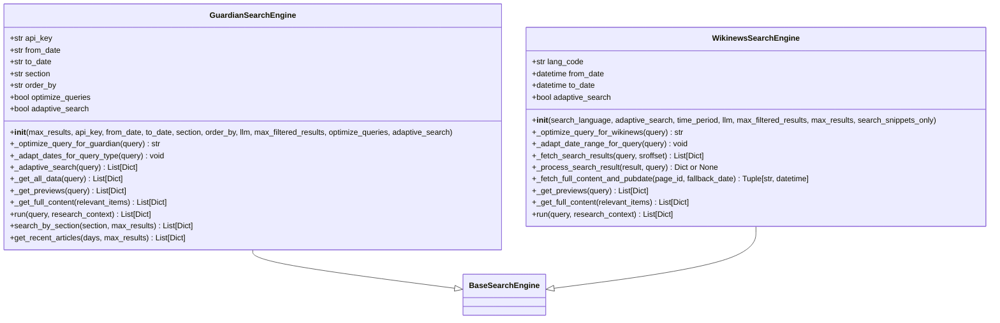
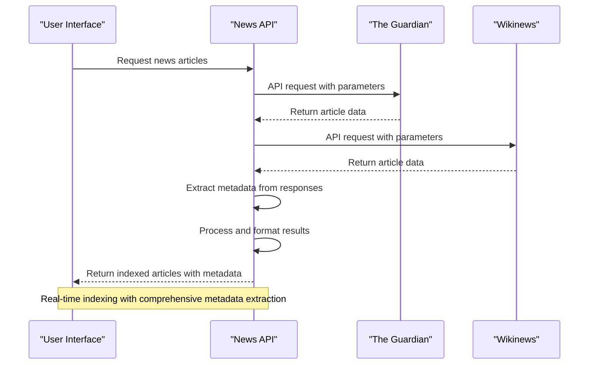
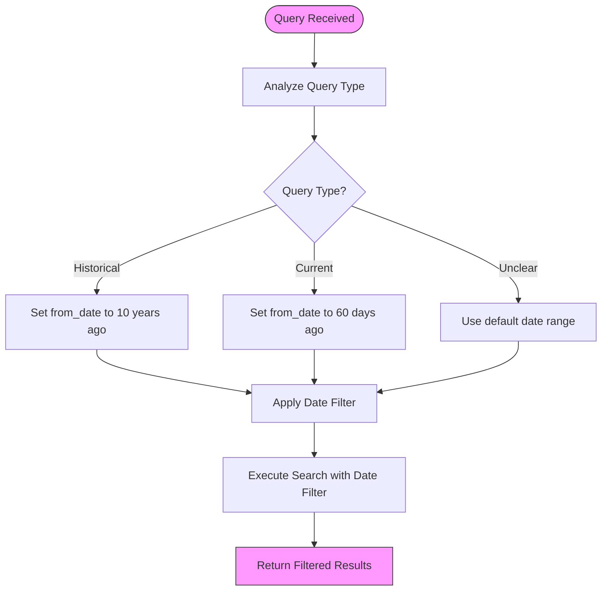
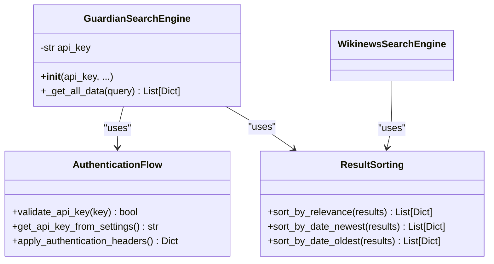
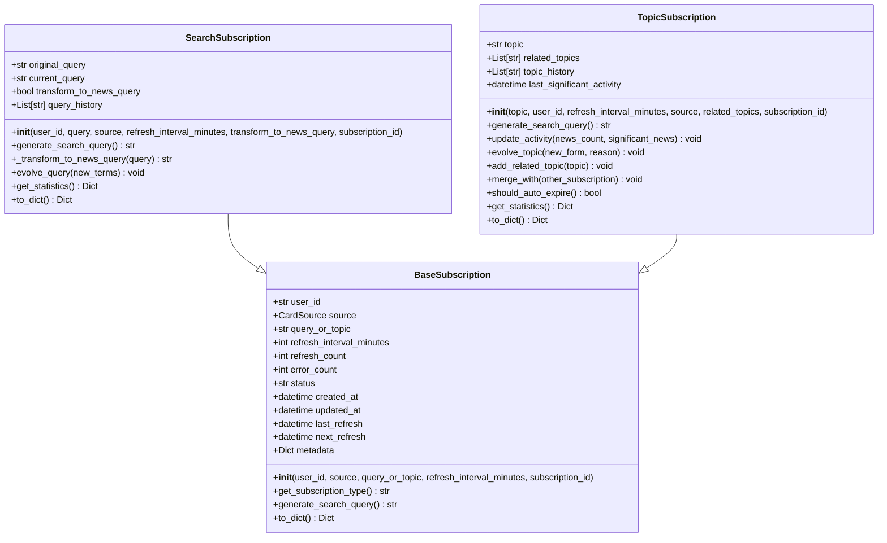
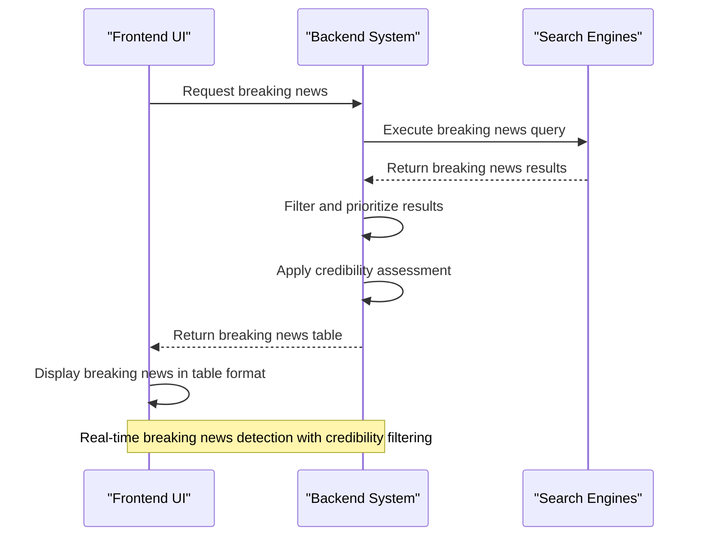
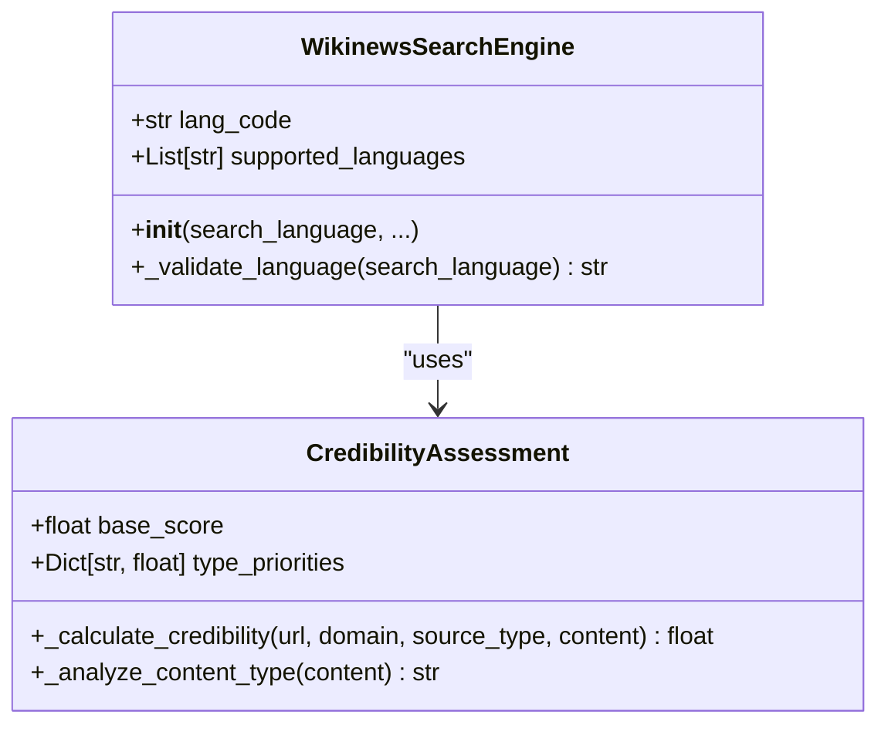
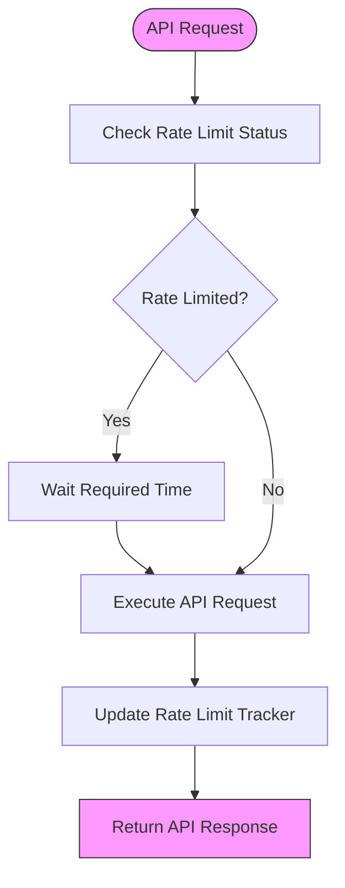
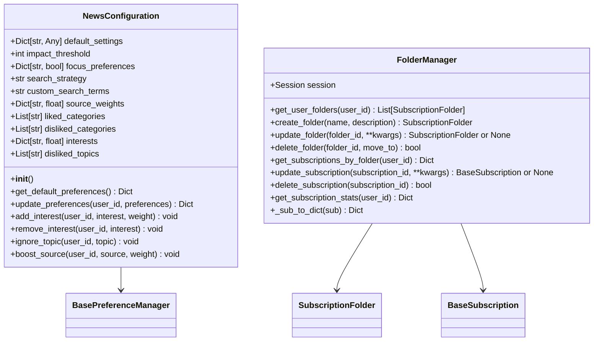

# News Sources

<cite>
**Referenced Files in This Document**   
- [search_engine_guardian.py](file://src/local_deep_research/web_search_engines/engines/search_engine_guardian.py)
- [search_engine_wikinews.py](file://src/local_deep_research/web_search_engines/engines/search_engine_wikinews.py)
- [search_subscription.py](file://src/local_deep_research/news/subscription_manager/search_subscription.py)
- [topic_subscription.py](file://src/local_deep_research/news/subscription_manager/topic_subscription.py)
- [base_preference.py](file://src/local_deep_research/news/preference_manager/base_preference.py)
- [folder_manager.py](file://src/local_deep_research/news/folder_manager.py)
- [api.py](file://src/local_deep_research/news/api.py)
- [news.js](file://src/local_deep_research/web/static/js/pages/news.js)
</cite>

## Table of Contents
1. [Introduction](#introduction)
2. [News Source Integration](#news-source-integration)
3. [Real-time News Indexing and Metadata Extraction](#real-time-news-indexing-and-metadata-extraction)
4. [Publication Date Filtering and Query Construction](#publication-date-filtering-and-query-construction)
5. [API Authentication and Result Sorting](#api-authentication-and-result-sorting)
6. [News Subscription System Integration](#news-subscription-system-integration)
7. [Breaking News Detection and Source Prioritization](#breaking-news-detection-and-source-prioritization)
8. [Language Filtering and Credibility Assessment](#language-filtering-and-credibility-assessment)
9. [Rate Limiting and Paywalled Content Handling](#rate-limiting-and-paywalled-content-handling)
10. [Configuration Options](#configuration-options)

## Introduction
This document provides comprehensive documentation for the news search sources integration in the local deep research system, focusing on The Guardian and Wikinews. The system enables real-time news indexing, sophisticated metadata extraction, and advanced filtering capabilities. It supports API authentication, intelligent query construction, and result sorting by relevance or date. The documentation covers integration with the news subscription system, breaking news detection, and configuration options for source prioritization, language filtering, and credibility assessment. Special attention is given to rate limiting for high-frequency monitoring and handling of paywalled content from commercial news providers.

## News Source Integration

The system integrates with major news sources through specialized search engine implementations that handle API interactions, authentication, and data retrieval. The Guardian and Wikinews are implemented as dedicated search engines with optimized query processing and result handling.

**Diagram sources**
- [search_engine_guardian.py](file://src/local_deep_research/web_search_engines/engines/search_engine_guardian.py#L1-L677)
- [search_engine_wikinews.py](file://src/local_deep_research/web_search_engines/engines/search_engine_wikinews.py#L1-L535)

**Section sources**
- [search_engine_guardian.py](file://src/local_deep_research/web_search_engines/engines/search_engine_guardian.py#L1-L677)
- [search_engine_wikinews.py](file://src/local_deep_research/web_search_engines/engines/search_engine_wikinews.py#L1-L535)

## Real-time News Indexing and Metadata Extraction

The system implements real-time news indexing capabilities for both The Guardian and Wikinews, extracting comprehensive metadata from articles to support advanced search and analysis. The Guardian integration extracts headline, trail text, byline, body content, publication information, and keywords, while the Wikinews integration extracts title, snippet, full content, publication date, and URL information.

**Diagram sources**
- [search_engine_guardian.py](file://src/local_deep_research/web_search_engines/engines/search_engine_guardian.py#L384-L414)
- [search_engine_wikinews.py](file://src/local_deep_research/web_search_engines/engines/search_engine_wikinews.py#L376-L386)

**Section sources**
- [search_engine_guardian.py](file://src/local_deep_research/web_search_engines/engines/search_engine_guardian.py#L384-L414)
- [search_engine_wikinews.py](file://src/local_deep_research/web_search_engines/engines/search_engine_wikinews.py#L376-L386)

## Publication Date Filtering and Query Construction

The system provides sophisticated publication date filtering capabilities with configurable date ranges and automatic adaptation based on query type. For The Guardian, users can specify from_date and to_date parameters in YYYY-MM-DD format, with defaults of one month ago to today. The Wikinews integration uses datetime objects with configurable time periods (all, year, month, week, day).

Query construction is enhanced with LLM-based optimization that transforms natural language queries into effective search queries. The system automatically optimizes queries by removing filler words, focusing on essential keywords, and structuring queries for optimal results.

**Diagram sources**
- [search_engine_guardian.py](file://src/local_deep_research/web_search_engines/engines/search_engine_guardian.py#L173-L237)
- [search_engine_wikinews.py](file://src/local_deep_research/web_search_engines/engines/search_engine_wikinews.py#L202-L266)

**Section sources**
- [search_engine_guardian.py](file://src/local_deep_research/web_search_engines/engines/search_engine_guardian.py#L173-L237)
- [search_engine_wikinews.py](file://src/local_deep_research/web_search_engines/engines/search_engine_wikinews.py#L202-L266)

## API Authentication and Result Sorting

API authentication is required for The Guardian integration, with the API key provided either as a parameter or retrieved from the system settings. The Wikinews integration does not require authentication but includes a user agent header for identification.

Results can be sorted by relevance, newest, or oldest based on the order_by parameter. The default sorting is by relevance, but users can specify alternative sorting methods to prioritize recent or chronological results.

**Diagram sources**
- [search_engine_guardian.py](file://src/local_deep_research/web_search_engines/engines/search_engine_guardian.py#L56-L69)
- [search_engine_wikinews.py](file://src/local_deep_research/web_search_engines/engines/search_engine_wikinews.py#L17-L18)

**Section sources**
- [search_engine_guardian.py](file://src/local_deep_research/web_search_engines/engines/search_engine_guardian.py#L56-L69)
- [search_engine_wikinews.py](file://src/local_deep_research/web_search_engines/engines/search_engine_wikinews.py#L17-L18)

## News Subscription System Integration

The system integrates with a comprehensive news subscription system that allows users to subscribe to specific search queries or topics for ongoing news updates. Subscriptions are managed through a subscription manager that handles creation, updating, and deletion of subscriptions.

**Diagram sources**
- [search_subscription.py](file://src/local_deep_research/news/subscription_manager/search_subscription.py#L13-L255)
- [topic_subscription.py](file://src/local_deep_research/news/subscription_manager/topic_subscription.py#L14-L314)

**Section sources**
- [search_subscription.py](file://src/local_deep_research/news/subscription_manager/search_subscription.py#L13-L255)
- [topic_subscription.py](file://src/local_deep_research/news/subscription_manager/topic_subscription.py#L14-L314)

## Breaking News Detection and Source Prioritization

The system includes breaking news detection capabilities through specialized query templates and monitoring. The JavaScript frontend implements a breaking news table query that searches for important breaking news stories from the current day only, with strict requirements for verifiable sources.

Source prioritization is configurable through user preferences, allowing users to boost specific news sources. The system also implements automatic source credibility assessment based on domain characteristics, content analysis, and HTTPS usage.

**Diagram sources**
- [news.js](file://src/local_deep_research/web/static/js/pages/news.js#L68-L77)
- [base_preference.py](file://src/local_deep_research/news/preference_manager/base_preference.py#L114-L137)

**Section sources**
- [news.js](file://src/local_deep_research/web/static/js/pages/news.js#L68-L77)
- [base_preference.py](file://src/local_deep_research/news/preference_manager/base_preference.py#L114-L137)

## Language Filtering and Credibility Assessment

The system supports language filtering for Wikinews, with support for multiple languages including English, Spanish, French, German, Chinese, and others. Users can specify the search language, which is mapped to the appropriate language code for the Wikinews API.

Credibility assessment is performed using a multi-factor approach that considers source type, domain characteristics (such as .edu or .gov), HTTPS usage, and content analysis. The system assigns credibility scores to sources to help prioritize more reliable information.

**Diagram sources**
- [search_engine_wikinews.py](file://src/local_deep_research/web_search_engines/engines/search_engine_wikinews.py#L19-L35)
- [base_preference.py](file://src/local_deep_research/news/preference_manager/base_preference.py#L196-L211)

**Section sources**
- [search_engine_wikinews.py](file://src/local_deep_research/web_search_engines/engines/search_engine_wikinews.py#L19-L35)
- [base_preference.py](file://src/local_deep_research/news/preference_manager/base_preference.py#L196-L211)

## Rate Limiting and Paywalled Content Handling

The system implements comprehensive rate limiting to prevent excessive API requests and ensure compliance with API usage policies. Rate limiting metrics are tracked and displayed in the system's analytics dashboard, including rate limit success rate, rate limit events, average wait time, and engines tracked.

Paywalled content from commercial news providers is handled by focusing on metadata and snippets that are typically available without subscription. The system prioritizes extracting accessible information while acknowledging the limitations of paywalled content.

**Diagram sources**
- [search_engine_guardian.py](file://src/local_deep_research/web_search_engines/engines/search_engine_guardian.py#L367-L371)
- [metrics.html](file://src/local_deep_research/web/templates/pages/metrics.html#L700-L723)

**Section sources**
- [search_engine_guardian.py](file://src/local_deep_research/web_search_engines/engines/search_engine_guardian.py#L367-L371)
- [metrics.html](file://src/local_deep_research/web/templates/pages/metrics.html#L700-L723)

## Configuration Options

The system provides extensive configuration options for news source management, including source prioritization, language filtering, and credibility assessment. Users can configure refresh intervals, date ranges, sorting preferences, and query optimization settings.

These configuration options are accessible through the user interface and can be managed programmatically through the API, allowing for flexible customization of the news search experience.

**Diagram sources**
- [base_preference.py](file://src/local_deep_research/news/preference_manager/base_preference.py#L14-L164)
- [folder_manager.py](file://src/local_deep_research/news/folder_manager.py#L15-L226)

**Section sources**
- [base_preference.py](file://src/local_deep_research/news/preference_manager/base_preference.py#L14-L164)
- [folder_manager.py](file://src/local_deep_research/news/folder_manager.py#L15-L226)