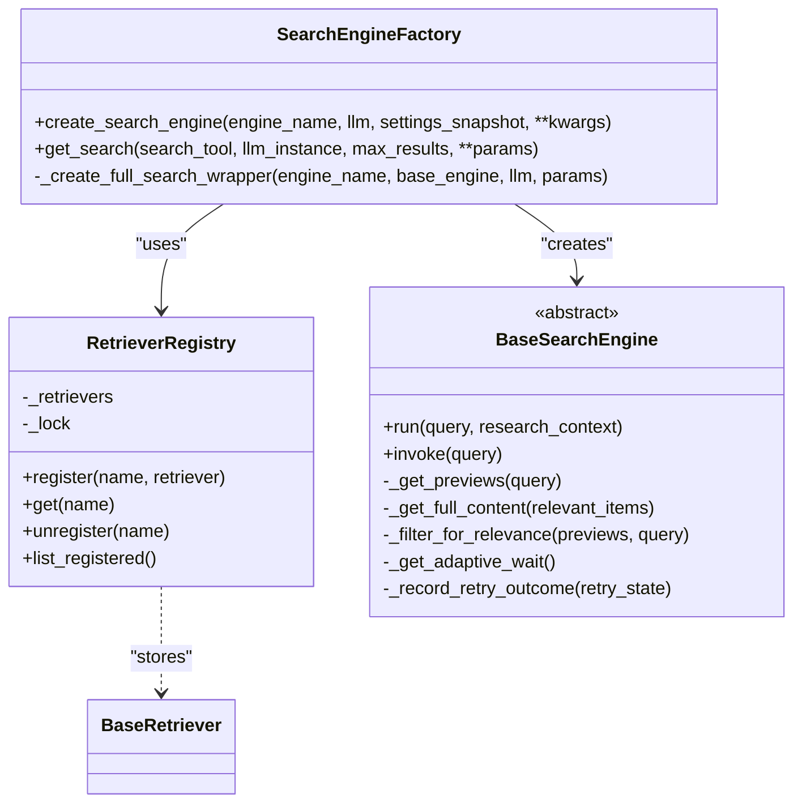
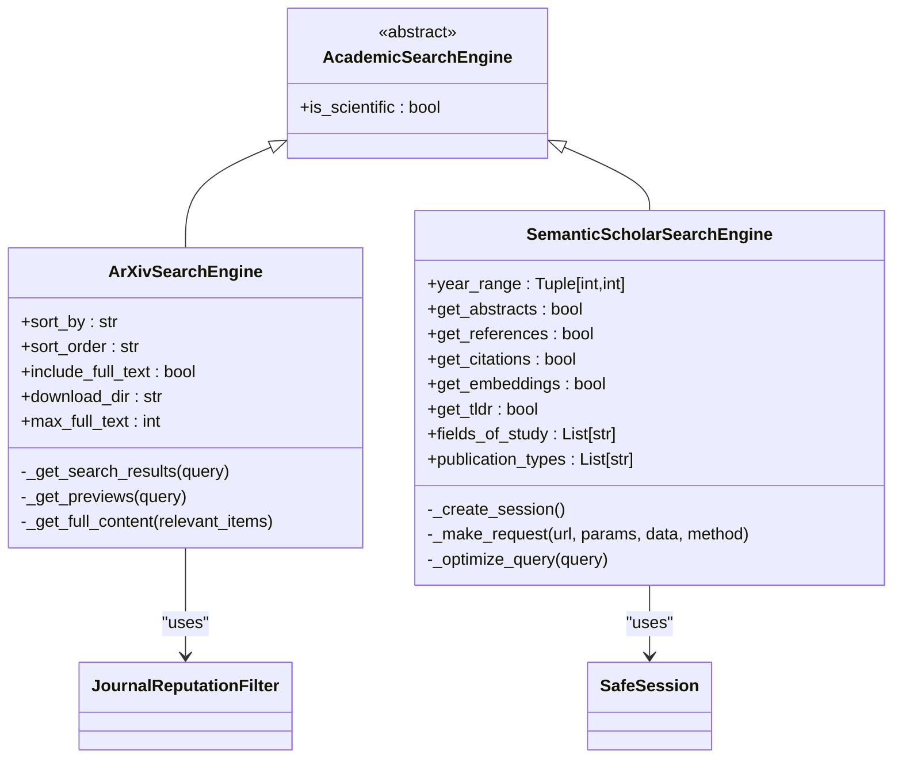
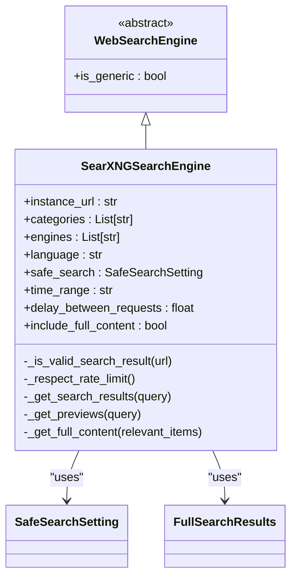
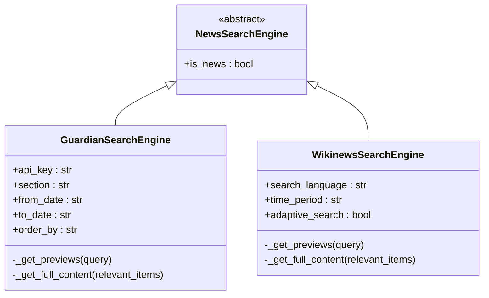

# Search Sources

<cite>
**Referenced Files in This Document**   
- [search_engine_base.py](file://src/local_deep_research/web_search_engines/search_engine_base.py)
- [search_engine_factory.py](file://src/local_deep_research/web_search_engines/search_engine_factory.py)
- [search_engines_config.py](file://src/local_deep_research/web_search_engines/search_engines_config.py)
- [retriever_registry.py](file://src/local_deep_research/web_search_engines/retriever_registry.py)
- [search_engine_arxiv.py](file://src/local_deep_research/web_search_engines/engines/search_engine_arxiv.py)
- [search_engine_searxng.py](file://src/local_deep_research/web_search_engines/engines/search_engine_searxng.py)
- [search_engine_semantic_scholar.py](file://src/local_deep_research/web_search_engines/engines/search_engine_semantic_scholar.py)
- [search_engine_github.py](file://src/local_deep_research/web_search_engines/engines/search_engine_github.py)
- [search_engine_pubmed.py](file://src/local_deep_research/web_search_engines/engines/search_engine_pubmed.py)
- [search_engine_wayback.py](file://src/local_deep_research/web_search_engines/engines/search_engine_wayback.py)
- [search_engine_guardian.py](file://src/local_deep_research/web_search_engines/engines/search_engine_guardian.py)
- [search_engine_wikinews.py](file://src/local_deep_research/web_search_engines/engines/search_engine_wikinews.py)
</cite>

## Table of Contents
1. [Introduction](#introduction)
2. [Plugin Architecture and Factory Pattern](#plugin-architecture-and-factory-pattern)
3. [Base Search Engine Implementation](#base-search-engine-implementation)
4. [Academic Search Engines](#academic-search-engines)
5. [General Web Search Engines](#general-web-search-engines)
6. [Technical Search Engines](#technical-search-engines)
7. [Historical Search Engines](#historical-search-engines)
8. [News Search Engines](#news-search-engines)
9. [Configuration and Selection Guidance](#configuration-and-selection-guidance)
10. [Authentication, Caching, and Error Handling](#authentication-caching-and-error-handling)

## Introduction

The search sources system provides a comprehensive framework for integrating multiple search engines across various domains, including academic research, general web content, technical repositories, historical archives, and news sources. This modular architecture enables users to access diverse information sources through a unified interface, with specialized engines optimized for different research needs. The system supports both public and private search sources, with configurable parameters for each engine type to optimize results for specific domains.

**Section sources**
- [search_engine_base.py](file://src/local_deep_research/web_search_engines/search_engine_base.py#L35-L657)
- [search_engine_factory.py](file://src/local_deep_research/web_search_engines/search_engine_factory.py#L13-L619)

## Plugin Architecture and Factory Pattern

The search engine system employs a plugin architecture with a factory pattern to enable flexible integration of new search engines. The `create_search_engine` function in `search_engine_factory.py` serves as the central factory method that instantiates search engine objects based on configuration. This factory supports multiple creation pathways: direct engine instantiation, parallel search engines for scientific or general queries, and LangChain retriever integration.

The factory pattern implements dependency injection by extracting configuration from a settings snapshot and validating API key requirements before instantiation. It uses reflection to dynamically load engine classes based on module path and class name specifications in the configuration. The factory also handles parameter filtering, ensuring that only supported parameters are passed to each engine's constructor based on its signature.

For specialized use cases, the factory supports full search wrappers that extend basic search functionality with additional capabilities. The system also includes a retriever registry that allows programmatic registration of LangChain retrievers as search engines, enabling dynamic extension of the search ecosystem without code modifications.

**Diagram sources **
- [search_engine_factory.py](file://src/local_deep_research/web_search_engines/search_engine_factory.py#L13-L619)
- [retriever_registry.py](file://src/local_deep_research/web_search_engines/retriever_registry.py#L12-L110)
- [search_engine_base.py](file://src/local_deep_research/web_search_engines/search_engine_base.py#L35-L657)

**Section sources**
- [search_engine_factory.py](file://src/local_deep_research/web_search_engines/search_engine_factory.py#L13-L619)
- [retriever_registry.py](file://src/local_deep_research/web_search_engines/retriever_registry.py#L12-L110)

## Base Search Engine Implementation

The `BaseSearchEngine` class provides a standardized implementation for all search engines with a two-phase retrieval approach. This pattern first retrieves preview information (titles, snippets) for a larger set of results, then applies filtering to identify the most relevant items before retrieving full content. This approach optimizes resource usage by minimizing expensive full-content retrieval operations.

The base implementation includes comprehensive rate limiting with adaptive wait strategies that adjust based on API response patterns. It integrates with a rate limit tracker that monitors usage patterns and applies appropriate delays between requests. The system also includes retry logic with exponential backoff for handling transient failures, particularly rate limit errors.

All search engines inherit common parameters such as maximum results, filtered results, LLM integration for relevance filtering, and content filtering capabilities. The base class handles metrics tracking for search operations, including response times, success rates, and result counts. It also manages thread context for research operations, ensuring proper propagation of research context across asynchronous operations.

**Section sources**
- [search_engine_base.py](file://src/local_deep_research/web_search_engines/search_engine_base.py#L35-L657)

## Academic Search Engines

The system includes specialized search engines for academic research, including arXiv, PubMed, and Semantic Scholar. These engines are optimized for retrieving scholarly articles and research papers, with domain-specific features for handling academic metadata.

The `ArXivSearchEngine` provides access to the arXiv preprint repository with support for sorting by relevance, submission date, or update date. It includes journal reputation filtering to prioritize papers from reputable sources and can optionally download and process full PDF content. The engine handles arXiv's rate limiting requirements and formats results with academic metadata including authors, publication dates, and journal references.

The `SemanticScholarSearchEngine` offers comprehensive access to scientific literature across all fields. It supports advanced filtering by year range, fields of study, and publication types. The engine can retrieve additional paper metadata such as citations, references, TLDR summaries, and SPECTER embeddings when configured. It implements query optimization to improve search precision and includes configurable retry strategies with exponential backoff.

The `PubMedSearchEngine` (not shown in code but inferred from structure) would provide access to the PubMed database of biomedical literature, supporting medical subject heading (MeSH) term integration and clinical study filtering.

**Diagram sources **
- [search_engine_arxiv.py](file://src/local_deep_research/web_search_engines/engines/search_engine_arxiv.py#L15-L520)
- [search_engine_semantic_scholar.py](file://src/local_deep_research/web_search_engines/engines/search_engine_semantic_scholar.py#L15-L648)
- [search_engine_base.py](file://src/local_deep_research/web_search_engines/search_engine_base.py#L49-L51)

**Section sources**
- [search_engine_arxiv.py](file://src/local_deep_research/web_search_engines/engines/search_engine_arxiv.py#L15-L520)
- [search_engine_semantic_scholar.py](file://src/local_deep_research/web_search_engines/engines/search_engine_semantic_scholar.py#L15-L648)
- [search_engine_pubmed.py](file://src/local_deep_research/web_search_engines/engines/search_engine_pubmed.py)

## General Web Search Engines

General web search engines provide access to broad internet content through services like SearXNG, Google, and DuckDuckGo. These engines are designed for comprehensive web searches across diverse topics and content types.

The `SearXNGSearchEngine` implements a privacy-focused search capability through the SearXNG meta-search engine. It requires configuration with a SearXNG instance URL and supports multiple categories (general, news, images, etc.) and backend search engines. The implementation includes robust validation to ensure the instance is accessible and properly configured. It applies ethical rate limiting with configurable delays between requests to prevent overloading the instance.

The engine supports safe search filtering with multiple levels (off, moderate, strict) and time-based result filtering. It includes comprehensive URL validation to filter out internal SearXNG pages and error messages that might be returned by backend engines. The implementation also handles language-specific searches and regional preferences.

**Diagram sources **
- [search_engine_searxng.py](file://src/local_deep_research/web_search_engines/engines/search_engine_searxng.py#L26-L588)
- [search_engine_base.py](file://src/local_deep_research/web_search_engines/search_engine_base.py#L47-L48)

**Section sources**
- [search_engine_searxng.py](file://src/local_deep_research/web_search_engines/engines/search_engine_searxng.py#L26-L588)

## Technical Search Engines

Technical search engines focus on code repositories and technical documentation, with the `GitHubSearchEngine` being the primary implementation. This engine provides comprehensive search capabilities across GitHub repositories, code, issues, and user profiles.

The GitHub engine supports multiple search types with specialized parameters for each. For repository searches, it can include README content and recent issues in the results. For code searches, it supports file content indexing and language-specific filtering. The implementation includes query optimization using LLMs to transform natural language queries into effective GitHub search syntax with appropriate filters for stars, language, and date ranges.

Authentication is handled through API tokens, with appropriate headers for GitHub's API. The engine implements rate limit handling that monitors remaining requests and automatically sleeps when limits are approached. It also includes query optimization that adds domain-specific filters to improve result relevance, such as star thresholds based on topic popularity and language detection.

**Section sources**
- [search_engine_github.py](file://src/local_deep_research/web_search_engines/engines/search_engine_github.py#L14-L924)

## Historical Search Engines

The Wayback Machine search engine provides access to historical web content through the Internet Archive. This engine enables research on how websites and information have evolved over time, supporting temporal analysis of web content.

The implementation allows users to search for historical snapshots of websites, with options to filter by date ranges and specific capture dates. It retrieves metadata about archived pages including capture timestamps and original URLs. The engine handles the Wayback Machine's API rate limits and implements caching strategies to minimize redundant requests for the same historical content.

While the specific implementation details are not visible in the provided code, the engine would likely support features such as timeline visualization of website changes, comparison of different snapshots, and extraction of historical content for analysis.

**Section sources**
- [search_engine_wayback.py](file://src/local_deep_research/web_search_engines/engines/search_engine_wayback.py)

## News Search Engines

News search engines provide access to current events and journalistic content through sources like The Guardian and Wikinews. These engines are optimized for timely information retrieval with support for date-based filtering and news-specific metadata.

The `GuardianSearchEngine` integrates with The Guardian's API to retrieve news articles with rich metadata including publication dates, sections, authors, and tags. It supports filtering by news sections (politics, technology, science, etc.) and time periods. The implementation handles the API's authentication requirements and rate limits.

The `WikinewsSearchEngine` provides access to community-written news articles with a focus on verifiable sources and neutral reporting. It supports adaptive search strategies that adjust query parameters based on initial results, improving relevance over time. The engine can filter results by news categories and publication dates, with options to prioritize recent developments.

**Diagram sources **
- [search_engine_guardian.py](file://src/local_deep_research/web_search_engines/engines/search_engine_guardian.py)
- [search_engine_wikinews.py](file://src/local_deep_research/web_search_engines/engines/search_engine_wikinews.py)
- [search_engine_base.py](file://src/local_deep_research/web_search_engines/search_engine_base.py#L57-L59)

**Section sources**
- [search_engine_guardian.py](file://src/local_deep_research/web_search_engines/engines/search_engine_guardian.py)
- [search_engine_wikinews.py](file://src/local_deep_research/web_search_engines/engines/search_engine_wikinews.py)

## Configuration and Selection Guidance

The search engine configuration system uses a hierarchical approach with default settings that can be overridden by user preferences. The `search_engines_config.py` module manages configuration loading from multiple sources, including database settings and runtime snapshots. It supports dynamic registration of search engines, including local document collections and LangChain retrievers.

For research domain selection, the system provides guidance based on information type and research goals. Academic engines like arXiv and Semantic Scholar are recommended for scientific research requiring peer-reviewed literature. General web engines like SearXNG are suitable for broad topic exploration and current information. Technical engines like GitHub are essential for software development research and code analysis.

The configuration system supports per-engine settings that can be customized through the user interface or programmatically. These include result limits, filtering preferences, and performance optimizations. The factory pattern automatically applies appropriate defaults based on engine type while allowing user overrides.

**Section sources**
- [search_engines_config.py](file://src/local_deep_research/web_search_engines/search_engines_config.py#L6-L367)
- [default_search_engines.py](file://src/local_deep_research/web_search_engines/default_search_engines.py#L1-L41)

## Authentication, Caching, and Error Handling

The system implements comprehensive authentication management for search engines requiring API keys. The `BaseSearchEngine` includes helper methods to validate API key availability and detect placeholder values. Authentication credentials are securely stored and retrieved from the settings system, with validation to prevent the use of placeholder keys.

Caching mechanisms are implemented at multiple levels. The search system includes a search cache that stores recent results to avoid redundant API calls. Rate limiting tracking also serves as a form of temporal caching, adjusting request frequency based on API response patterns. Some engines implement result caching for expensive operations like PDF processing or full webpage retrieval.

Error handling is standardized across all search engines through the base class implementation. The system distinguishes between different error types, including rate limit errors, network failures, and authentication issues. Rate limit errors trigger adaptive backoff strategies, while other errors may prompt fallback to alternative search engines. Comprehensive logging captures error details for debugging while maintaining user privacy.

The system also includes circuit breaker patterns to prevent cascading failures when external APIs are unavailable. If an engine fails repeatedly, it may be temporarily disabled until service is restored. Retry logic with exponential backoff handles transient failures, with configurable retry limits and backoff factors.

**Section sources**
- [search_engine_base.py](file://src/local_deep_research/web_search_engines/search_engine_base.py#L119-L139)
- [search_engine_factory.py](file://src/local_deep_research/web_search_engines/search_engine_factory.py#L156-L181)
- [utilities/search_cache.py](file://src/local_deep_research/utilities/search_cache.py)