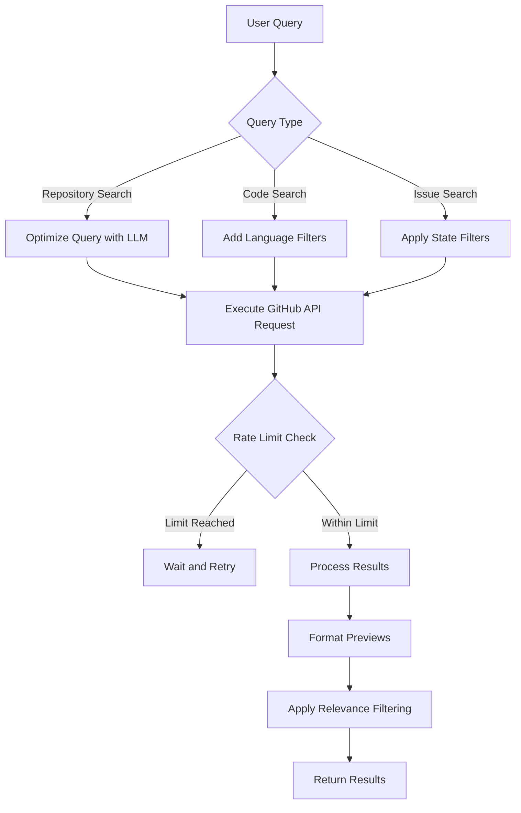
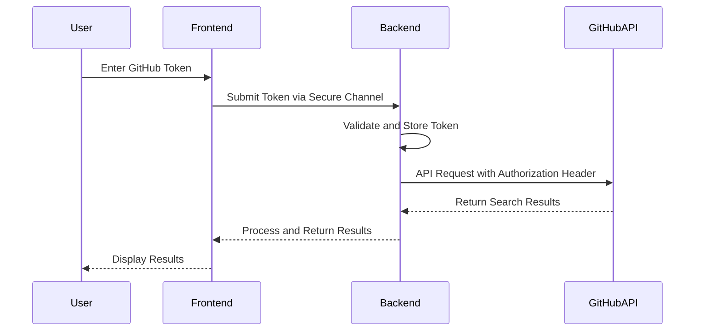
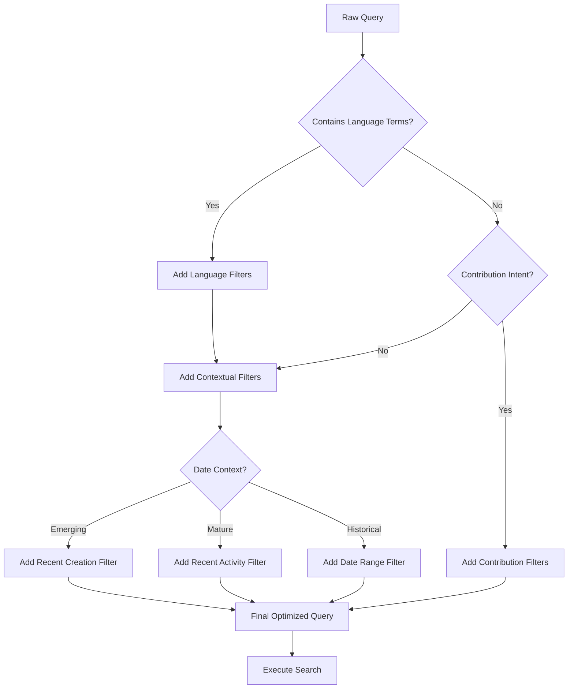
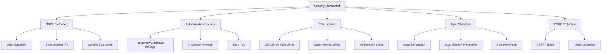

# Code Repositories

<cite>
**Referenced Files in This Document**   
- [search_engine_github.py](file://src/local_deep_research/web_search_engines/engines/search_engine_github.py)
- [llm_config.py](file://src/local_deep_research/config/llm_config.py)
- [search_config.py](file://src/local_deep_research/config/search_config.py)
- [safe_requests.py](file://src/local_deep_research/security/safe_requests.py)
- [credential_store_base.py](file://src/local_deep_research/database/credential_store_base.py)
- [temp_auth.py](file://src/local_deep_research/database/temp_auth.py)
- [session_passwords.py](file://src/local_deep_research/database/session_passwords.py)
- [routes.py](file://src/local_deep_research/web/auth/routes.py)
</cite>

## Table of Contents
1. [Introduction](#introduction)
2. [Repository Indexing and Retrieval](#repository-indexing-and-retrieval)
3. [Authentication Methods](#authentication-methods)
4. [Query Syntax and Search Filters](#query-syntax-and-search-filters)
5. [Use Cases](#use-cases)
6. [Security Considerations](#security-considerations)
7. [Examples of Effective Search Queries](#examples-of-effective-search-queries)
8. [Conclusion](#conclusion)

## Introduction
This document provides comprehensive documentation for GitHub code repository integration within the Local Deep Research system. It covers the mechanisms for indexing and retrieving code from both public and private repositories, authentication methods, query syntax, use cases, security considerations, and practical examples of effective search queries. The system leverages the GitHub Search API to provide powerful code discovery capabilities while maintaining robust security practices for handling credentials and sensitive codebases.

## Repository Indexing and Retrieval
The system implements a sophisticated GitHub search engine that indexes and retrieves code from public and private repositories through the GitHub Search API. The `GitHubSearchEngine` class handles all aspects of repository indexing and retrieval, supporting multiple search types including repositories, code, issues, and users.

The search engine automatically optimizes queries using a language model to improve result quality. It analyzes the original query and transforms it into an optimized version for the GitHub Search API by stripping question words, stop words, and redundant terms while adding GitHub-specific filters with dynamic thresholds based on query context. The system applies rate limiting to prevent API abuse and handles rate limit responses appropriately by logging warnings and implementing wait times when necessary.

For code retrieval, the system can fetch full file content from GitHub repositories when needed. It uses base64 decoding to extract content from GitHub's API responses and handles various encoding scenarios. The search engine also retrieves README content and recent issues for repositories when configured to do so, providing comprehensive context for research purposes.

**Diagram sources**
- [search_engine_github.py](file://src/local_deep_research/web_search_engines/engines/search_engine_github.py#L101-L154)

**Section sources**
- [search_engine_github.py](file://src/local_deep_research/web_search_engines/engines/search_engine_github.py#L156-L247)

## Authentication Methods
The system supports multiple authentication methods for accessing private repositories, with primary support for personal access tokens. Users can configure their GitHub API token through environment variables or application settings, which is then used to authenticate API requests.

When a GitHub API key is provided, it is included in the request headers as a bearer token, enabling authenticated access to private repositories and increasing the API rate limit from 60 requests per hour (unauthenticated) to 5,000 requests per hour (authenticated). The system logs when authenticated requests are being used and provides warnings when no API key is provided, alerting users to the restricted rate limits.

For web application authentication, the system implements a comprehensive authentication framework that handles user login, registration, and session management. It uses encrypted databases with SQLCipher and implements temporary authentication storage for handling post-registration flows. Passwords are stored temporarily in memory during authentication processes but are not persisted, following security best practices.

**Diagram sources**
- [search_engine_github.py](file://src/local_deep_research/web_search_engines/engines/search_engine_github.py#L63-L70)
- [routes.py](file://src/local_deep_research/web/auth/routes.py#L136-L153)

**Section sources**
- [search_engine_github.py](file://src/local_deep_research/web_search_engines/engines/search_engine_github.py#L48-L70)
- [temp_auth.py](file://src/local_deep_research/database/temp_auth.py#L16-L45)
- [session_passwords.py](file://src/local_deep_research/database/session_passwords.py#L23-L44)

## Query Syntax and Search Filters
The system supports advanced query syntax for code search with comprehensive filters for programming language, file type, and repository metadata. The query syntax follows GitHub's search syntax conventions, allowing users to construct powerful search queries that can be refined with various qualifiers.

The system automatically enhances queries by detecting programming languages mentioned in the search terms and adding appropriate language filters. Supported languages include Python, JavaScript, Java, Rust, Go, TypeScript, C#, C++, and Ruby. The search engine also adds contextual filters based on the query content, such as star thresholds for popular repositories or date ranges for emerging versus mature technologies.

Key search filters include:
- **Language filtering**: `language:python`, `language:javascript`
- **Repository metadata**: `stars:>100`, `forks:>10`, `size:>1000`
- **Date-based filtering**: `created:>2024-01-01`, `pushed:>2023-01-01`
- **File and content scope**: `in:name`, `in:description`, `in:readme`, `in:file`
- **Repository status**: `archived:false`, `is:public`

For contribution-focused queries, the system automatically adjusts the search to find beginner-friendly projects by looking for repositories with "good-first-issue" labels and a minimum number of such issues. It also excludes archived repositories to ensure users find active projects for contribution.

**Diagram sources**
- [search_engine_github.py](file://src/local_deep_research/web_search_engines/engines/search_engine_github.py#L494-L537)

**Section sources**
- [search_engine_github.py](file://src/local_deep_research/web_search_engines/engines/search_engine_github.py#L111-L125)
- [search_engine_github.py](file://src/local_deep_research/web_search_engines/engines/search_engine_github.py#L494-L537)

## Use Cases
The GitHub repository integration supports several key use cases for developers and researchers, including finding code examples, discovering API implementations, and analyzing library usage patterns across repositories.

For finding code examples, users can search for specific functionality or algorithms across repositories. The system's query optimization enhances these searches by adding relevant language filters and contextual qualifiers. For example, a search for "implementing OAuth2 authentication in Python" would be optimized to include `language:python` and potentially `stars:>50` to find well-maintained examples.

When discovering API implementations, users can search for specific API endpoints or method signatures across code repositories. The system supports code-specific searches that look within file contents rather than just repository metadata. This allows researchers to find actual implementation patterns and usage examples of specific APIs or libraries.

For analyzing library usage patterns, the system can identify how a particular library is used across multiple projects. By searching for the library import statements or initialization patterns, researchers can gather insights into common configuration approaches, integration patterns, and best practices as demonstrated in real-world projects.

The system also supports finding contribution opportunities by identifying repositories with beginner-friendly issues. When users search for terms like "contribute" or "beginner," the system automatically adjusts the search to find repositories with "good-first-issue" labels and a healthy number of such issues, helping new contributors find appropriate projects.

## Security Considerations
The system implements comprehensive security measures when handling credentials for code repositories and accessing sensitive codebases. All external HTTP requests are wrapped with SSRF (Server-Side Request Forgery) protection through the `safe_requests` module, which validates URLs before making requests and prevents access to internal network resources.

Credentials are handled with extreme care throughout the system. Temporary authentication storage is implemented for post-registration flows, storing passwords briefly in memory with a short TTL (time-to-live). These temporary stores use in-memory storage with automatic expiration rather than persisting credentials to disk. The system explicitly documents that passwords are stored in plain text in memory, acknowledging that encryption provides no real security benefit when an attacker has sufficient privileges to read process memory.

Rate limiting is implemented at multiple levels to prevent abuse of the GitHub API and protect against brute force attacks. The system respects GitHub's rate limits and implements appropriate waiting periods when limits are approached. For web application authentication, rate limiting is applied to login and registration endpoints to prevent brute force attacks, with configurable limits of 5 attempts per 15 minutes for login and 3 attempts per hour for registration.

The system also implements input validation and sanitization for all user inputs, preventing injection attacks and other common web vulnerabilities. URL validation ensures that redirects are safe and prevents open redirect vulnerabilities. The security framework includes protection against CSRF (Cross-Site Request Forgery) attacks through the use of CSRF tokens for state-changing operations.

**Diagram sources**
- [safe_requests.py](file://src/local_deep_research/security/safe_requests.py#L21-L95)
- [credential_store_base.py](file://src/local_deep_research/database/credential_store_base.py#L17-L45)
- [routes.py](file://src/local_deep_research/web/auth/routes.py#L67-L68)

**Section sources**
- [safe_requests.py](file://src/local_deep_research/security/safe_requests.py#L21-L95)
- [credential_store_base.py](file://src/local_deep_research/database/credential_store_base.py#L17-L45)
- [SECURITY_REVIEW_PROCESS.md](file://docs/SECURITY_REVIEW_PROCESS.md#L1-L111)

## Examples of Effective Search Queries
The system enables users to construct highly effective search queries for locating specific functionality within large codebases. Here are several examples of optimized search patterns:

1. **Finding code examples**: 
   - Raw query: "How to implement JWT authentication in Node.js"
   - Optimized query: "JWT authentication language:javascript in:file"

2. **Discovering API implementations**:
   - Raw query: "Stripe payment integration examples"
   - Optimized query: "Stripe API integration language:python stars:>100"

3. **Analyzing library usage patterns**:
   - Raw query: "How is React Router used in modern applications"
   - Optimized query: "React Router usage pattern language:javascript in:file"

4. **Finding contribution opportunities**:
   - Raw query: "Beginner-friendly Python projects to contribute to"
   - Optimized query: "good-first-issues:>5 language:python is:public archived:false"

5. **Locating specific functionality**:
   - Raw query: "Implementing WebSockets with authentication"
   - Optimized query: "WebSockets authentication implementation language:typescript in:file"

6. **Researching security patterns**:
   - Raw query: "Best practices for password hashing in web applications"
   - Optimized query: "password hashing security best practices language:python in:file"

The system's query optimization automatically enhances these searches by adding appropriate filters based on context. For example, when detecting that a query is about an emerging technology, it may add a `created:>2024-01-01` filter to focus on recent implementations. For mature technologies, it might use `pushed:>2023-01-01` to find actively maintained examples.

## Conclusion
The GitHub code repository integration in the Local Deep Research system provides a powerful and secure framework for indexing and retrieving code from public and private repositories. By leveraging the GitHub Search API with intelligent query optimization, the system delivers relevant results while maintaining robust security practices for credential handling and access control. The comprehensive authentication methods, advanced query syntax, and thoughtful security considerations make this integration a valuable tool for developers and researchers seeking to explore, analyze, and contribute to code repositories at scale.