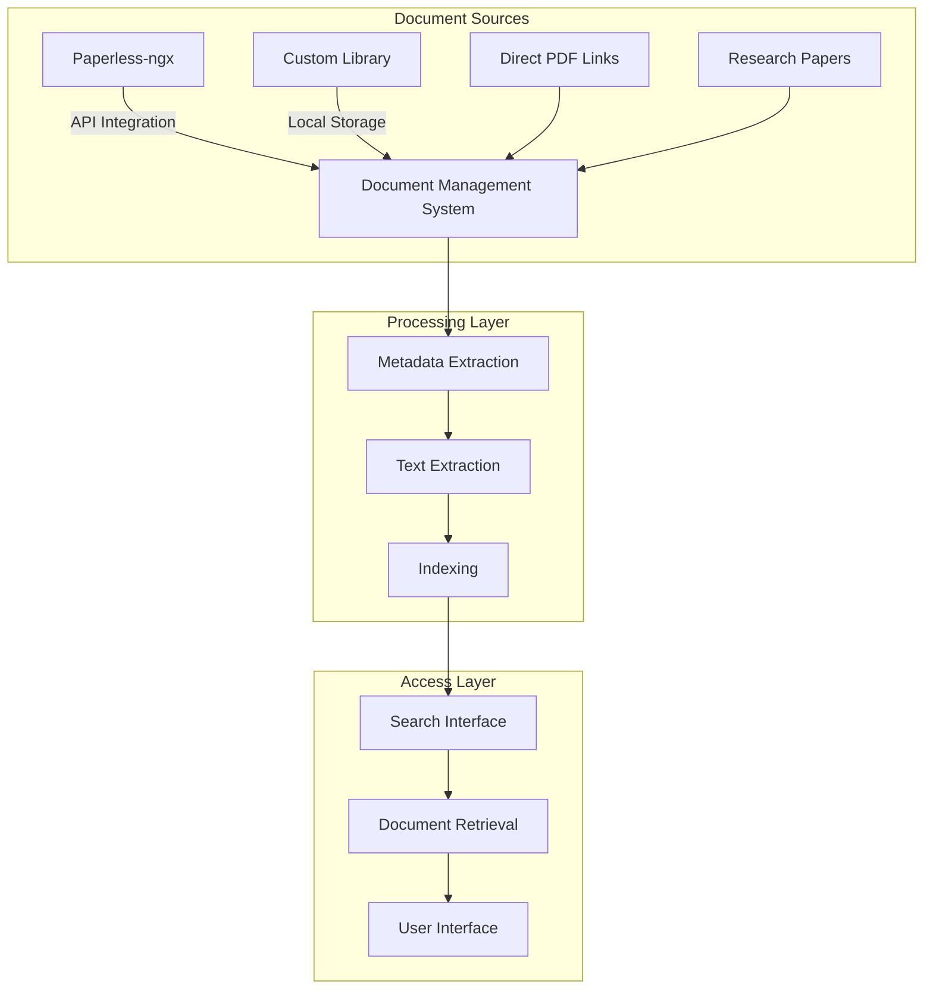
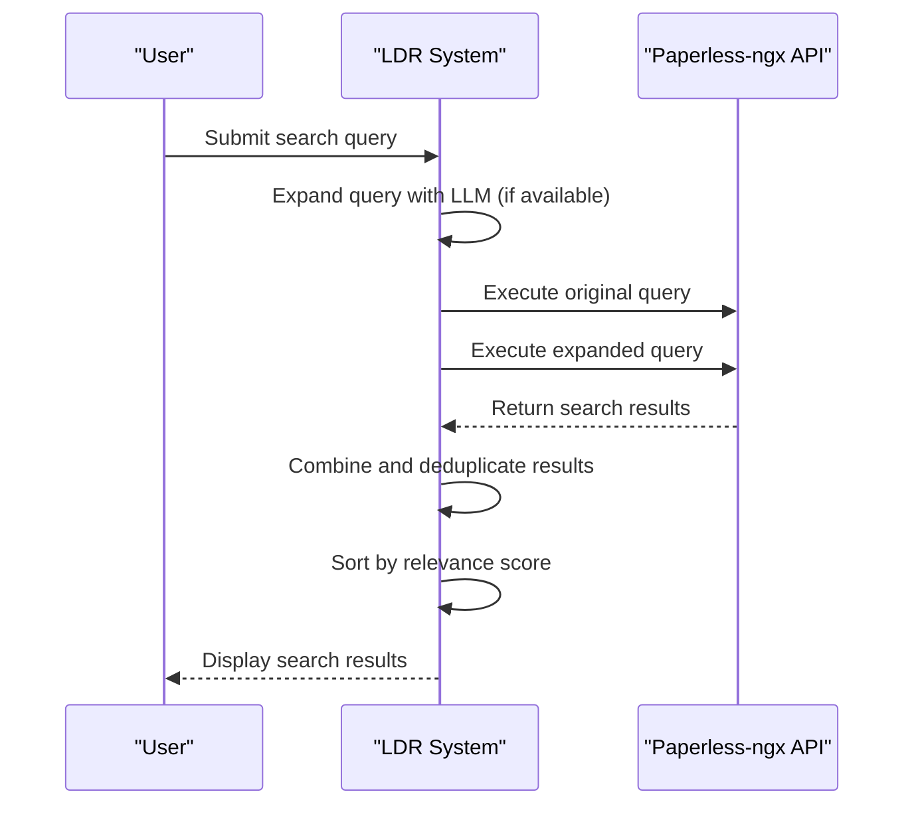
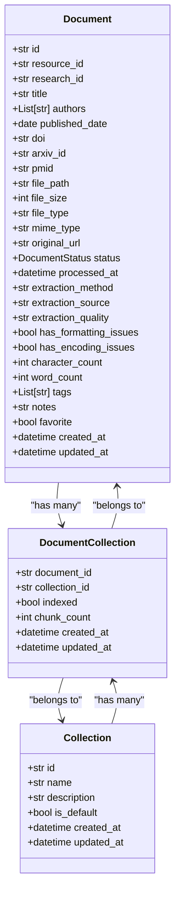
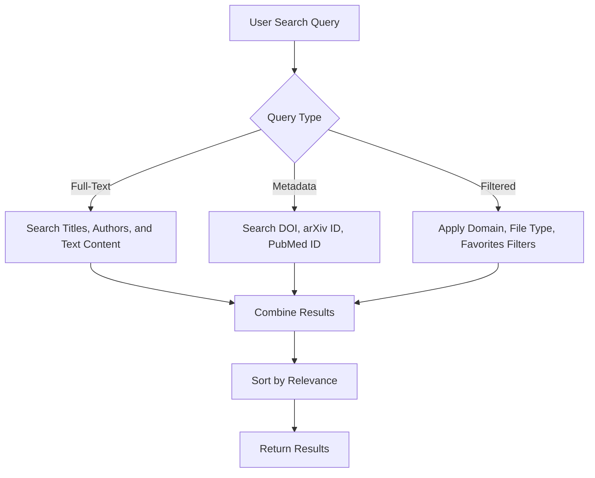

# Document Management Systems

<cite>
**Referenced Files in This Document**   
- [search_engine_paperless.py](file://src/local_deep_research/web_search_engines/engines/search_engine_paperless.py)
- [library_service.py](file://src/local_deep_research/research_library/services/library_service.py)
- [library_routes.py](file://src/local_deep_research/research_library/routes/library_routes.py)
- [pdf_extraction_service.py](file://src/local_deep_research/web/services/pdf_extraction_service.py)
- [base.py](file://src/local_deep_research/research_library/downloaders/base.py)
- [database.py](file://src/local_deep_research/database/models/library.py)
</cite>

## Table of Contents
1. [Introduction](#introduction)
2. [Document Management System Integration](#document-management-system-integration)
3. [Paperless-ngx Integration](#paperless-ngx-integration)
4. [Custom Library System Configuration](#custom-library-system-configuration)
5. [Document Indexing and Searchability](#document-indexing-and-searchability)
6. [Metadata Extraction and Document Classification](#metadata-extraction-and-document-classification)
7. [Security and Compliance](#security-and-compliance)
8. [Search Strategies for Document Retrieval](#search-strategies-for-document-retrieval)
9. [Conclusion](#conclusion)

## Introduction
This document provides comprehensive guidance on integrating document management systems with Local Deep Research (LDR), focusing on Paperless-ngx and custom library systems. It covers the technical implementation of document indexing, search functionality, metadata extraction, and security considerations for handling sensitive information. The system enables users to efficiently retrieve internal policies, technical manuals, research papers, and other organizational documents from various repositories.

## Document Management System Integration
The document management system in LDR is designed to integrate with both external document management platforms like Paperless-ngx and internal custom library systems. The architecture follows a modular approach with distinct components for search, storage, and retrieval.

The integration framework supports multiple document types including scanned documents, PDFs, and other file formats. Documents can be indexed and made searchable through both direct integration with document management APIs and local storage mechanisms. The system provides a unified interface for accessing documents regardless of their source or storage location.

Key integration points include:
- API connectivity to external document management systems
- Local document storage with multiple storage mode options
- Metadata extraction and enrichment
- Full-text search capabilities
- Document classification and organization



**Diagram sources**
- [search_engine_paperless.py](file://src/local_deep_research/web_search_engines/engines/search_engine_paperless.py)
- [library_service.py](file://src/local_deep_research/research_library/services/library_service.py)

**Section sources**
- [search_engine_paperless.py](file://src/local_deep_research/web_search_engines/engines/search_engine_paperless.py#L1-L780)
- [library_service.py](file://src/local_deep_research/research_library/services/library_service.py#L1-L911)

## Paperless-ngx Integration
The Paperless-ngx integration provides seamless connectivity between LDR and the Paperless-ngx document management system. This integration enables users to search, retrieve, and manage documents stored in their Paperless-ngx instance directly from LDR.

### Configuration and Authentication
The Paperless-ngx integration is configured through API endpoints and authentication tokens. The system supports both API URL and API token configuration, which can be set through environment variables or application settings.

```python
def __init__(
    self,
    api_url: str = None,
    api_key: str = None,
    api_token: str = None,
    max_results: int = 10,
    timeout: int = 30,
    verify_ssl: bool = True,
    include_content: bool = True,
    llm: Optional[BaseLLM] = None,
    settings_snapshot: Optional[Dict[str, Any]] = None,
    **kwargs,
):
```

The authentication process uses token-based authentication with the Authorization header. The system automatically handles SSL verification and connection timeouts.

### Search Functionality
The Paperless-ngx integration implements a multi-pass search strategy to maximize result quality:

1. **Original Query Pass**: Executes the search with the original query terms
2. **LLM-Expanded Query Pass**: Uses a language model to expand the query with relevant keywords and synonyms
3. **Result Combination**: Combines and deduplicates results from both passes

The search results include document metadata such as title, correspondent, document type, creation date, and tags. The system also preserves search relevance scores and ranking information from Paperless-ngx.



**Diagram sources**
- [search_engine_paperless.py](file://src/local_deep_research/web_search_engines/engines/search_engine_paperless.py#L223-L321)

### Document Retrieval
When retrieving documents from Paperless-ngx, the system extracts both metadata and content. The integration preserves the original document structure while enhancing it with additional metadata for better citation and organization.

Key metadata fields extracted include:
- Document ID
- Title and enhanced title with bibliographic information
- Correspondent/author
- Document type
- Creation and modification dates
- Archive serial number
- Search score and rank
- Tags

The system also handles document content retrieval, either from search highlights or by extracting content directly from the document. For documents with multiple search highlights, the system creates separate results for each highlight to ensure proper citation.

**Section sources**
- [search_engine_paperless.py](file://src/local_deep_research/web_search_engines/engines/search_engine_paperless.py#L362-L617)

## Custom Library System Configuration
The custom library system in LDR provides local document management capabilities with flexible storage options and advanced organization features.

### Storage Configuration
The system supports multiple storage modes for PDF documents:

- **Database Storage**: Documents are stored in the application database
- **Filesystem Storage**: Documents are stored in a designated directory on the local filesystem
- **Metadata-Only Storage**: Only document metadata is stored, with references to external locations

The storage mode is configurable through application settings, allowing users to choose the most appropriate option based on their requirements and infrastructure.



**Diagram sources**
- [database.py](file://src/local_deep_research/database/models/library.py#L1-L293)

### Library Organization
The custom library system provides advanced organization features through collections and tagging:

- **Collections**: Documents can be organized into collections, with a default "Library" collection and user-defined collections
- **Tagging**: Documents can be tagged with user-defined keywords for easier categorization and retrieval
- **Favorites**: Users can mark important documents as favorites for quick access
- **Domain Filtering**: Documents can be filtered by domain (e.g., arxiv.org, pubmed)

The system also supports document statistics and analytics, providing insights into the library's composition, including document counts by type, domain distribution, and storage usage.

**Section sources**
- [library_service.py](file://src/local_deep_research/research_library/services/library_service.py#L390-L427)
- [library_routes.py](file://src/local_deep_research/research_library/routes/library_routes.py#L203-L250)

## Document Indexing and Searchability
The document indexing system in LDR ensures that both locally stored documents and those accessed through integrations are fully searchable.

### Text Extraction
For PDF documents, the system extracts text content using pdfplumber, a Python library for PDF text extraction. The extraction process is optimized for research papers and technical documents, preserving as much formatting and structure as possible.

```python
@staticmethod
def extract_text_from_pdf(pdf_content: bytes) -> Optional[str]:
    """
    Extract text from PDF content using in-memory processing.
    
    Args:
        pdf_content: PDF file content as bytes
        
    Returns:
        Extracted text, or None if extraction failed
    """
```

The extracted text is stored in the document database, enabling full-text search capabilities. For documents where text extraction fails or produces poor results, the system preserves information about the extraction quality and any issues encountered.

### Indexing Process
Documents are indexed through the following process:

1. **Document Ingestion**: Documents are added to the system through various methods (direct upload, research download, API integration)
2. **Metadata Extraction**: Document metadata is extracted and stored
3. **Text Extraction**: Text content is extracted from the document
4. **Storage**: The document is stored according to the configured storage mode
5. **Indexing**: The document is added to the search index with its metadata and text content

The indexing process is designed to be efficient and scalable, handling large document repositories without performance degradation.

### Search Capabilities
The system supports multiple search capabilities:

- **Full-Text Search**: Search across document titles, authors, and extracted text content
- **Metadata Search**: Search by document metadata such as DOI, arXiv ID, or PubMed ID
- **Domain Filtering**: Filter results by document source domain
- **File Type Filtering**: Filter results by file type (PDF, text, etc.)
- **Favorites Filtering**: Show only favorited documents

The search interface provides real-time filtering and sorting options, allowing users to quickly narrow down results to the most relevant documents.



**Diagram sources**
- [library_service.py](file://src/local_deep_research/research_library/services/library_service.py#L109-L119)
- [pdf_extraction_service.py](file://src/local_deep_research/web/services/pdf_extraction_service.py#L1-L152)

**Section sources**
- [library_service.py](file://src/local_deep_research/research_library/services/library_service.py#L196-L388)
- [pdf_extraction_service.py](file://src/local_deep_research/web/services/pdf_extraction_service.py#L15-L140)

## Metadata Extraction and Document Classification
The system automatically extracts and enriches document metadata to improve organization and searchability.

### Metadata Fields
The following metadata fields are extracted and stored for each document:

**Core Metadata**
- Title
- Authors
- Publication date
- Document type
- Creation and modification dates

**Academic Identifiers**
- DOI (Digital Object Identifier)
- arXiv ID
- PubMed ID (PMID)
- PubMed Central ID (PMCID)
- ISBN

**Technical Metadata**
- File size
- MIME type
- Character count
- Word count
- Extraction method and quality
- Formatting and encoding issues

**Organizational Metadata**
- Tags
- Notes
- Favorite status
- Collections

### Document Classification
The system classifies documents based on their source and content:

- **arXiv Documents**: Identified by arXiv.org URLs or arXiv IDs
- **PubMed Documents**: Identified by PubMed or NCBI URLs
- **Other Documents**: All remaining documents

The classification is used for filtering and organization, allowing users to easily find documents from specific sources.

```python
def _is_arxiv_url(self, url: str) -> bool:
    """Check if URL is from arXiv domain."""
    try:
        hostname = urlparse(url).hostname
        return bool(
            hostname
            and (hostname == "arxiv.org" or hostname.endswith(".arxiv.org"))
        )
    except Exception:
        return False

def _is_pubmed_url(self, url: str) -> bool:
    """Check if URL is from PubMed or NCBI domains."""
    try:
        parsed = urlparse(url)
        hostname = parsed.hostname
        if not hostname:
            return False

        # Check for pubmed.ncbi.nlm.nih.gov
        if hostname == "pubmed.ncbi.nlm.nih.gov":
            return True

        # Check for ncbi.nlm.nih.gov with PMC path
        if hostname == "ncbi.nlm.nih.gov" and "/pmc" in parsed.path:
            return True

        # Check for pubmed in subdomain
        if "pubmed" in hostname:
            return True

        return False
    except Exception:
        return False
```

The system also supports user-defined classification through tags and collections, allowing for custom organization schemes.

**Section sources**
- [library_service.py](file://src/local_deep_research/research_library/services/library_service.py#L52-L85)
- [database.py](file://src/local_deep_research/database/models/library.py#L233-L244)

## Security and Compliance
The document management system implements several security measures to protect sensitive information and ensure compliance with data protection regulations.

### Access Control
The system enforces user authentication and authorization for all document access. Users can only access documents within their own library, preventing unauthorized access to other users' documents.

### Data Protection
For sensitive documents, the system supports multiple protection mechanisms:

- **Encryption**: Database storage can be encrypted using SQLCipher
- **Filesystem Permissions**: Filesystem storage respects operating system file permissions
- **Secure Connections**: API connections use HTTPS with SSL verification

### Compliance Features
The system includes features to support compliance with data protection regulations:

- **Audit Logging**: Document access and modifications are logged
- **Data Retention**: Configurable data retention policies
- **Secure Deletion**: Documents are securely deleted when removed from the system

The system also validates file uploads to prevent malicious content and implements rate limiting to prevent abuse.

**Section sources**
- [security.py](file://src/local_deep_research/security/file_upload_validator.py)
- [database.py](file://src/local_deep_research/database/models/library.py#L246-L255)

## Search Strategies for Document Retrieval
Effective search strategies are essential for retrieving specific content from large document repositories.

### Basic Search
For simple queries, use specific keywords related to the document's content, title, or metadata:

- Search by document title or partial title
- Search by author name
- Search by DOI, arXiv ID, or other academic identifiers
- Search by specific terms found in the document

### Advanced Search
For more complex searches, combine multiple search techniques:

- **Boolean Operators**: Use AND, OR, and NOT to combine search terms
- **Phrase Search**: Use quotation marks to search for exact phrases
- **Wildcard Search**: Use asterisks for partial matching
- **Field-Specific Search**: Search within specific metadata fields

### Domain-Specific Search
When searching for documents from specific sources:

- Use domain filters to limit results to arXiv, PubMed, or other domains
- Include source-specific identifiers in your search (e.g., arXiv:1234.5678)
- Use the enhanced title format that includes author and year information

### Research-Oriented Search
For academic research, consider these strategies:

- Search by citation information (author, year, journal)
- Use specialized search engines like arXiv, PubMed, or Semantic Scholar
- Follow citation chains from known relevant papers
- Use the document classification features to find papers from specific domains

The system also supports saving search results and organizing them into collections for future reference.

**Section sources**
- [library_service.py](file://src/local_deep_research/research_library/services/library_service.py#L109-L119)
- [search_engine_paperless.py](file://src/local_deep_research/web_search_engines/engines/search_engine_paperless.py#L223-L321)

## Conclusion
The document management system in Local Deep Research provides comprehensive integration with both external document management platforms like Paperless-ngx and internal custom library systems. The system enables efficient indexing, searching, and retrieval of various document types, including scanned documents, PDFs, and research papers.

Key features include:
- Seamless integration with Paperless-ngx through API connectivity
- Flexible local document storage with multiple storage modes
- Comprehensive metadata extraction and document classification
- Advanced search capabilities with full-text and metadata search
- Robust security measures for protecting sensitive documents
- Effective search strategies for retrieving specific content

By leveraging these features, organizations can create a unified document management solution that combines the benefits of centralized document storage with powerful search and retrieval capabilities, improving access to internal policies, technical manuals, research papers, and other important documents.