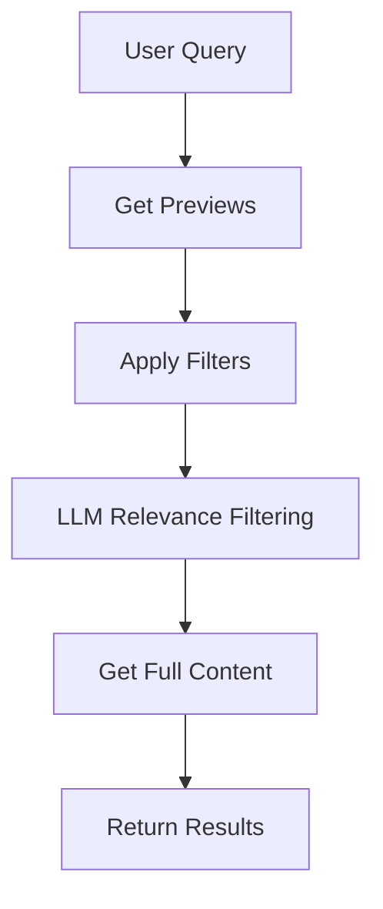
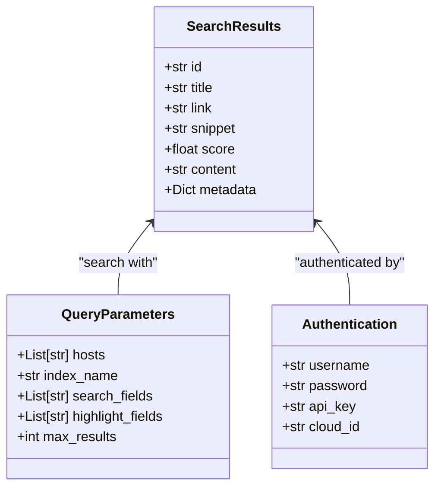

# Enterprise Search

<cite>
**Referenced Files in This Document**   
- [elasticsearch_search_engine.md](file://docs/elasticsearch_search_engine.md)
- [search_engine_elasticsearch.py](file://src/local_deep_research/web_search_engines/engines/search_engine_elasticsearch.py)
- [es_utils.py](file://src/local_deep_research/utilities/es_utils.py)
- [elasticsearch.json](file://src/local_deep_research/defaults/settings/search_engines/elasticsearch.json)
- [docker-compose.yml](file://examples/elasticsearch/docker-compose.yml)
- [search_example.py](file://examples/elasticsearch/search_example.py)
</cite>

## Table of Contents
1. [Introduction](#introduction)
2. [Connection Configuration](#connection-configuration)
3. [Index Management and Document Structure](#index-management-and-document-structure)
4. [Query DSL Support and Search Execution](#query-dsl-support-and-search-execution)
5. [Use Cases for Enterprise Search](#use-cases-for-enterprise-search)
6. [Security Considerations](#security-considerations)
7. [Performance Optimization](#performance-optimization)
8. [Troubleshooting Guide](#troubleshooting-guide)

## Introduction

This document provides comprehensive guidance on integrating Elasticsearch as an enterprise search source within the Local Deep Research platform. It covers configuration, indexing strategies, query execution, security, and performance optimization for searching internal documentation, logs, and knowledge bases.

The Elasticsearch integration enables organizations to leverage powerful full-text search capabilities across structured and unstructured data. The system supports advanced query features, relevance filtering with LLMs, and seamless integration with existing document collections.

**Section sources**
- [elasticsearch_search_engine.md](file://docs/elasticsearch_search_engine.md#L1-L155)

## Connection Configuration

### Host and Port Configuration

The Elasticsearch search engine connects to one or more Elasticsearch hosts using standard HTTP/HTTPS protocols. By default, the connection is established to `http://localhost:9200`, which is the standard port for Elasticsearch.

Multiple hosts can be specified in a list format to support cluster configurations:
```python
hosts=["http://node1:9200", "http://node2:9200", "http://node3:9200"]
```

The host configuration can be set programmatically or through the web interface settings. For Docker-based deployments, the example configuration uses port mapping `9200:9200` to expose the Elasticsearch service.

**Section sources**
- [elasticsearch_search_engine.md](file://docs/elasticsearch_search_engine.md#L31-L32)
- [docker-compose.yml](file://examples/elasticsearch/docker-compose.yml#L1-L16)
- [search_engine_elasticsearch.py](file://src/local_deep_research/web_search_engines/engines/search_engine_elasticsearch.py#L16-L17)

### Authentication Methods

The system supports multiple authentication methods for secure access to Elasticsearch clusters:

#### Basic Authentication
Username and password credentials can be provided for basic authentication:
```python
username="elastic"
password="your_password"
```

This is implemented by setting the `basic_auth` parameter in the Elasticsearch client configuration when both username and password are provided.

#### API Key Authentication
API key authentication is supported for enhanced security:
```python
api_key="your_api_key_here"
```

The API key is passed directly to the Elasticsearch client as an authentication token, providing a secure alternative to username/password credentials.

#### Elastic Cloud Integration
For Elastic Cloud deployments, the Cloud ID can be used:
```python
cloud_id="your_cloud_id"
```

This simplifies connection management for cloud-hosted Elasticsearch instances by encapsulating the connection details in a single identifier.

**Section sources**
- [elasticsearch_search_engine.md](file://docs/elasticsearch_search_engine.md#L33-L37)
- [search_engine_elasticsearch.py](file://src/local_deep_research/web_search_engines/engines/search_engine_elasticsearch.py#L18-L21)
- [es_utils.py](file://src/local_deep_research/utilities/es_utils.py#L43-L52)

### SSL/TLS Configuration

While SSL/TLS settings are not explicitly configured in the code, the system inherently supports HTTPS connections through the underlying Elasticsearch Python client. When using HTTPS endpoints (e.g., `https://your-es-cluster:9200`), the client automatically handles SSL/TLS encryption.

For self-signed certificates or custom CA configurations, the Elasticsearch client's default SSL handling can be extended through environment variables or system certificate stores. The current implementation focuses on connection simplicity while maintaining compatibility with secure Elasticsearch deployments.

**Section sources**
- [search_engine_elasticsearch.py](file://src/local_deep_research/web_search_engines/engines/search_engine_elasticsearch.py#L58-L75)
- [es_utils.py](file://src/local_deep_research/utilities/es_utils.py#L54-L55)

## Index Management and Document Structure

### Index Creation and Configuration

The system provides robust index management capabilities through the `ElasticsearchManager` utility class. When creating an index, default mappings and settings are applied if none are specified:

```python
def create_index(
    self,
    index_name: str,
    mappings: Optional[Dict[str, Any]] = None,
    settings: Optional[Dict[str, Any]] = None,
) -> bool:
```

Default mappings include optimized configurations for text search:
- **title**: Text field with keyword sub-field for exact matching
- **content**: Standard text field with text analysis
- **url**: Keyword field for exact matching
- **timestamp**: Date field for time-based queries
- **metadata**: Object field for flexible metadata storage

Default index settings configure:
- Single shard (`number_of_shards: 1`)
- No replicas (`number_of_replicas: 0`)
- Standard text analysis with the standard analyzer

These defaults can be overridden with custom mappings and settings to meet specific search requirements.

**Section sources**
- [es_utils.py](file://src/local_deep_research/utilities/es_utils.py#L70-L136)
- [search_example.py](file://examples/elasticsearch/search_example.py#L38-L39)

### Document Indexing Strategies

The system supports multiple document indexing methods to accommodate various data sources:

#### Single Document Indexing
Individual documents can be indexed with optional ID specification:
```python
index_document(index_name, document, document_id=None, refresh=False)
```

#### Bulk Indexing
Multiple documents can be indexed efficiently in bulk:
```python
bulk_index_documents(index_name, documents, id_field=None, refresh=False)
```

This method uses Elasticsearch's bulk API for optimal performance when indexing large document collections.

#### File Content Indexing
The system can automatically extract content from various file formats:
```python
index_file(index_name, file_path, content_field="content", title_field="title")
```

Supported formats include PDF, DOCX, TXT, and Markdown files, with text extraction powered by the Unstructured library.

#### Directory Indexing
Entire directories can be indexed recursively:
```python
index_directory(index_name, directory_path, file_patterns=["*.pdf", "*.docx", "*.txt"])
```

This feature enables comprehensive indexing of document repositories with configurable file pattern matching.

**Section sources**
- [es_utils.py](file://src/local_deep_research/utilities/es_utils.py#L168-L387)
- [search_example.py](file://examples/elasticsearch/search_example.py#L76-L81)

### Document Structure and Field Mapping

Documents are structured with a consistent schema to optimize search performance:

```json
{
  "title": "Document Title",
  "content": "Full text content",
  "url": "Source URL (keyword)",
  "source": "File path or source identifier",
  "file_extension": "Document format",
  "filename": "Original filename",
  "metadata": "Extracted document metadata",
  "tags": ["array", "of", "keywords"],
  "category": "Content classification"
}
```

The field mapping strategy separates analyzed text fields (for full-text search) from keyword fields (for exact matching and filtering). This hybrid approach enables both flexible text search and precise field-based filtering.

**Section sources**
- [es_utils.py](file://src/local_deep_research/utilities/es_utils.py#L97-L114)
- [search_example.py](file://examples/elasticsearch/search_example.py#L44-L72)

## Query DSL Support and Search Execution

### Search Architecture

The Elasticsearch integration implements a two-phase retrieval approach:

1. **Preview Phase**: Retrieve document previews with metadata and highlighted snippets
2. **Content Phase**: Fetch full content for relevant documents only

This architecture optimizes performance by minimizing data transfer and processing only the most relevant results.



**Diagram sources**
- [search_engine_elasticsearch.py](file://src/local_deep_research/web_search_engines/engines/search_engine_elasticsearch.py#L89-L178)
- [search_engine_base.py](file://src/local_deep_research/web_search_engines/search_engine_base.py#L259-L394)

### Query String Syntax

The system supports Elasticsearch's Query String syntax for advanced search capabilities:

```python
search_by_query_string("title:keyword AND content:search_text")
```

This allows users to construct complex queries with:
- Field-specific searches (`title:python`)
- Boolean operators (`AND`, `OR`, `NOT`)
- Wildcards (`*`, `?`)
- Proximity searches (`"phrase"~5`)
- Range queries (`date:[2023-01-01 TO 2023-12-31]`)

The query string is executed against configurable search fields, with highlighting applied to specified fields.

**Section sources**
- [elasticsearch_search_engine.md](file://docs/elasticsearch_search_engine.md#L53-L54)
- [search_engine_elasticsearch.py](file://src/local_deep_research/web_search_engines/engines/search_engine_elasticsearch.py#L249-L285)

### Elasticsearch DSL Support

Full Elasticsearch DSL (Domain Specific Language) is supported for maximum query flexibility:

```python
search_by_dsl({
    "query": {
        "bool": {
            "must": {"match": {"content": "search term"}},
            "filter": {"term": {"category": "technology"}}
        }
    }
})
```

The DSL interface enables:
- Complex boolean queries
- Aggregations and analytics
- Geo-spatial searches
- Fuzzy matching
- Custom scoring functions
- Nested document queries

This provides enterprise users with complete control over search behavior and result ranking.

**Section sources**
- [elasticsearch_search_engine.md](file://docs/elasticsearch_search_engine.md#L56-L64)
- [search_engine_elasticsearch.py](file://src/local_deep_research/web_search_engines/engines/search_engine_elasticsearch.py#L290-L313)

### Result Processing

Search results are processed to enhance usability and relevance:

- **Highlighting**: Search terms are highlighted in results using `<em>` tags
- **Snippet Generation**: Excerpts are created from highlighted content or truncated text
- **Relevance Scoring**: Elasticsearch's built-in scoring (BM25) is used
- **Metadata Enrichment**: Source information and document metadata are included

The system also supports LLM-based relevance filtering to further refine results based on semantic understanding of the query context.



**Diagram sources**
- [search_engine_elasticsearch.py](file://src/local_deep_research/web_search_engines/engines/search_engine_elasticsearch.py#L162-L170)
- [search_engine_base.py](file://src/local_deep_research/web_search_engines/search_engine_base.py#L630-L657)

## Use Cases for Enterprise Search

### Internal Documentation Search

The system excels at searching internal documentation repositories, including:
- Technical manuals and user guides
- API documentation
- Internal wikis and knowledge bases
- Standard operating procedures
- Training materials

The file indexing capabilities automatically extract content from various formats, making unstructured documents searchable. The example implementation demonstrates indexing technical documentation about Elasticsearch, Python, and AI topics.

**Section sources**
- [search_example.py](file://examples/elasticsearch/search_example.py#L44-L72)

### Log and Event Data Search

While not explicitly demonstrated in the examples, the architecture supports log search use cases by:
- Indexing structured log data with timestamp fields
- Supporting time-range queries
- Enabling field-specific searches on log attributes
- Providing fast full-text search across large log volumes

The system could be extended to ingest log data from various sources and provide real-time search capabilities.

### Knowledge Base Search

The integration is ideal for enterprise knowledge management systems, enabling:
- Semantic search across organizational knowledge
- Context-aware retrieval with LLM filtering
- Multi-format document search (PDF, DOCX, TXT, etc.)
- Hierarchical organization through category and tag fields

The two-phase retrieval model ensures fast response times even with large knowledge bases.

**Section sources**
- [elasticsearch.json](file://src/local_deep_research/defaults/settings/search_engines/elasticsearch.json#L250-L252)

## Security Considerations

### Network Isolation

The default Docker configuration demonstrates best practices for network isolation:
- Single-node discovery mode (`discovery.type=single-node`)
- Local port binding (9200:9200)
- Dedicated Docker volume for data persistence

For production deployments, additional network security measures should be implemented:
- Firewall rules to restrict access to Elasticsearch ports
- Network segmentation to isolate the search cluster
- VPN or private network connectivity for remote access

**Section sources**
- [docker-compose.yml](file://examples/elasticsearch/docker-compose.yml#L1-L16)

### Access Controls

Multiple authentication methods provide flexible access control options:

#### Configuration-Based Security
The system supports:
- Basic authentication with username/password
- API key authentication for service accounts
- Elastic Cloud ID for managed deployments

#### Security Configuration
Security settings are managed through:
- Environment variables
- Configuration files
- Web interface settings

The `elasticsearch.json` configuration file defines security-related parameters including authentication requirements and API key settings.

#### Security Best Practices
Recommended security practices include:
- Using API keys instead of username/password when possible
- Rotating credentials regularly
- Implementing least-privilege access
- Monitoring authentication attempts
- Using HTTPS for all connections

**Section sources**
- [elasticsearch.json](file://src/local_deep_research/defaults/settings/search_engines/elasticsearch.json#L86-L127)
- [search_engine_elasticsearch.py](file://src/local_deep_research/web_search_engines/engines/search_engine_elasticsearch.py#L61-L72)

## Performance Optimization

### Index Configuration

Optimal index settings for enterprise search:
- **Sharding**: Configure appropriate shard count based on data volume and query patterns
- **Replication**: Enable replicas for high availability and read scalability
- **Refresh Interval**: Adjust refresh settings based on real-time requirements
- **Merge Policy**: Tune segment merging for optimal search performance

The default configuration uses a single shard with no replicas, suitable for development and small deployments.

**Section sources**
- [es_utils.py](file://src/local_deep_research/utilities/es_utils.py#L118-L125)

### Search Performance

The two-phase retrieval architecture optimizes search performance by:
- Minimizing data transfer in the initial phase
- Reducing processing overhead by fetching full content only for relevant results
- Leveraging Elasticsearch's efficient scoring and sorting
- Implementing client-side caching where appropriate

### Resource Management

The Docker configuration includes resource limits:
```yaml
environment:
  - "ES_JAVA_OPTS=-Xms512m -Xmx512m"
```

This limits Elasticsearch to 512MB of heap memory, preventing resource exhaustion on shared systems.

For large-scale deployments, consider:
- Scaling horizontally with additional nodes
- Optimizing JVM settings for available memory
- Configuring appropriate shard and replica counts
- Implementing query caching
- Using search templates for frequently executed queries

**Section sources**
- [docker-compose.yml](file://examples/elasticsearch/docker-compose.yml#L1-L16)
- [search_engine_base.py](file://src/local_deep_research/web_search_engines/search_engine_base.py#L259-L394)

## Troubleshooting Guide

### Connection Issues

Common connection problems and solutions:

#### Cannot Connect to Elasticsearch
- **Verify Service Status**: Ensure Elasticsearch is running
- **Check Host and Port**: Confirm the host URL and port are correct
- **Authentication**: Verify username, password, or API key if required
- **Network Connectivity**: Check firewall settings and network connectivity
- **Security Settings**: For Elastic Cloud, verify the Cloud ID is correct

The system provides detailed connection logging, including cluster name and version information upon successful connection.

**Section sources**
- [elasticsearch_search_engine.md](file://docs/elasticsearch_search_engine.md#L142-L147)
- [search_engine_elasticsearch.py](file://src/local_deep_research/web_search_engines/engines/search_engine_elasticsearch.py#L77-L87)

### Empty Search Results

When searches return no results:

#### Index and Data Verification
- Ensure the specified index exists and contains data
- Verify the index name in the configuration matches the actual index
- Confirm documents have been successfully indexed

#### Query and Field Validation
- Check that search fields are correctly configured
- Try simpler queries to isolate the issue
- Verify field names in the query match the document structure
- Examine Elasticsearch logs for query parsing errors

#### Configuration Review
- Validate that the index name in settings matches the target index
- Confirm search fields include the appropriate document fields
- Check that authentication credentials have appropriate permissions

**Section sources**
- [elasticsearch_search_engine.md](file://docs/elasticsearch_search_engine.md#L149-L154)
- [search_example.py](file://examples/elasticsearch/search_example.py#L158-L159)

### Performance Issues

For slow search performance:

#### Index Optimization
- Review shard and replica configuration
- Optimize mappings for the specific use case
- Consider index lifecycle management for large datasets

#### Query Optimization
- Use appropriate query types for the use case
- Limit result sizes when possible
- Use filters for exact matches instead of queries
- Implement pagination for large result sets

#### Resource Monitoring
- Monitor Elasticsearch cluster health
- Check JVM memory usage and garbage collection
- Monitor disk I/O performance
- Review query execution times and optimize slow queries