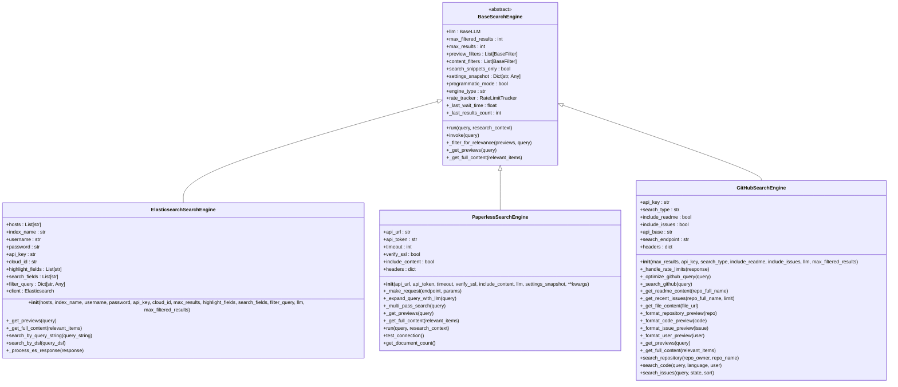

# Technical Sources

<cite>
**Referenced Files in This Document**   
- [search-engines.md](file://docs/search-engines.md)
- [elasticsearch_search_engine.md](file://docs/elasticsearch_search_engine.md)
- [search_engine_github.py](file://src/local_deep_research/web_search_engines/engines/search_engine_github.py)
- [search_engine_paperless.py](file://src/local_deep_research/web_search_engines/engines/search_engine_paperless.py)
- [search_engine_elasticsearch.py](file://src/local_deep_research/web_search_engines/engines/search_engine_elasticsearch.py)
- [es_utils.py](file://src/local_deep_research/utilities/es_utils.py)
- [search_example.py](file://examples/elasticsearch/search_example.py)
- [search_engine_base.py](file://src/local_deep_research/web_search_engines/search_engine_base.py)
- [search_config.py](file://src/local_deep_research/config/search_config.py)
- [default_search_engines.py](file://src/local_deep_research/web_search_engines/default_search_engines.py)
- [safe_requests.py](file://src/local_deep_research/security/safe_requests.py)
</cite>

## Table of Contents
1. [Introduction](#introduction)
2. [GitHub Integration](#github-integration)
3. [Elasticsearch Integration](#elasticsearch-integration)
4. [Paperless Integration](#paperless-integration)
5. [Custom Library Integrations](#custom-library-integrations)
6. [Security Considerations](#security-considerations)
7. [Use Cases](#use-cases)
8. [Conclusion](#conclusion)

## Introduction

This document provides comprehensive technical documentation for integrating various search sources within the Local Deep Research (LDR) system. It covers the implementation details for GitHub, Elasticsearch, Paperless, and custom library integrations, focusing on indexing, retrieval, authentication, and security considerations. The LDR system supports multiple search engines categorized as free, premium, and custom sources, with intelligent routing through an auto-engine that selects the most appropriate engines based on the query context. The architecture follows a two-phase retrieval approach where preview information is first retrieved, followed by full content retrieval for relevant results, optimizing both performance and accuracy.

**Section sources**
- [search-engines.md](file://docs/search-engines.md#L1-L253)

## GitHub Integration

The GitHub search engine implementation provides comprehensive search capabilities across repositories, code, issues, and users. It follows the two-phase retrieval pattern common to all LDR search engines, first retrieving preview information and then fetching full content for relevant results. The integration supports multiple search types including repositories, code, issues, and users, with configurable parameters for result limits and content inclusion.

Authentication is handled through API tokens, which can be provided programmatically or via environment variables. When no API key is provided, the system operates in unauthenticated mode with stricter rate limits. The search engine automatically handles rate limiting by monitoring the X-RateLimit-Remaining and X-RateLimit-Reset headers, implementing appropriate wait times when limits are approached.

Query optimization is enhanced through LLM integration, which transforms natural language queries into optimized GitHub search syntax. This includes adding appropriate filters based on context, such as star thresholds, language specifications, and date ranges. For repository searches, the engine can optionally include README content and recent issues in the results.

**Diagram sources **
- [search_engine_github.py](file://src/local_deep_research/web_search_engines/engines/search_engine_github.py#L14-L800)

**Section sources**
- [search_engine_github.py](file://src/local_deep_research/web_search_engines/engines/search_engine_github.py#L1-L800)
- [search-engines.md](file://docs/search-engines.md#L76-L81)

## Elasticsearch Integration

The Elasticsearch integration provides robust search capabilities for custom document collections and structured data. It implements a two-phase retrieval approach with preview generation followed by full content retrieval for relevant results. The integration supports multiple authentication methods including basic authentication, API keys, and Elastic Cloud ID, ensuring compatibility with various deployment scenarios.

The search engine configuration includes parameters for specifying the Elasticsearch hosts, index name, authentication credentials, result limits, and search fields. By default, it searches across content and title fields with highlighting enabled. The integration also supports advanced search methods using Elasticsearch Query String syntax and DSL (Domain Specific Language) for complex queries.

Indexing of documents is facilitated through the ElasticsearchManager utility class, which provides methods for creating indices, indexing individual documents, bulk indexing, and processing various file formats. The manager automatically extracts text content from supported file types using UnstructuredFileLoader and can include metadata in the indexed documents.

**Diagram sources **
- [search_engine_elasticsearch.py](file://src/local_deep_research/web_search_engines/engines/search_engine_elasticsearch.py#L11-L363)
- [es_utils.py](file://src/local_deep_research/utilities/es_utils.py#L13-L447)
- [search_example.py](file://examples/elasticsearch/search_example.py#L1-L179)

**Section sources**
- [elasticsearch_search_engine.md](file://docs/elasticsearch_search_engine.md#L1-L155)
- [search_engine_elasticsearch.py](file://src/local_deep_research/web_search_engines/engines/search_engine_elasticsearch.py#L1-L363)
- [es_utils.py](file://src/local_deep_research/utilities/es_utils.py#L1-L447)
- [search_example.py](file://examples/elasticsearch/search_example.py#L1-L179)

## Paperless Integration

The Paperless-ngx search engine integration enables searching within personal document management systems. It implements a multi-pass search strategy to improve result quality, first performing an initial search and then using LLM expansion to generate additional keyword queries. This approach compensates for Paperless-ngx's TF-IDF based keyword search by leveraging semantic understanding to identify relevant synonyms and related terms.

Authentication is handled through API tokens, which can be configured programmatically, via environment variables, or through the system settings. The integration includes comprehensive error handling and logging to assist with troubleshooting connectivity issues. Connection testing is supported through the test_connection() method, and document count can be retrieved via get_document_count().

The search engine processes results to create enhanced titles with bibliographic information including correspondent, document type, and year. When multiple highlights are available for a document, it creates separate preview entries for each highlight, enabling more precise citation of specific content sections. The integration also handles content extraction from the raw API response, falling back to content snippets when full content is not available.

**Diagram sources **
- [search_engine_paperless.py](file://src/local_deep_research/web_search_engines/engines/search_engine_paperless.py#L21-L780)

**Section sources**
- [search_engine_paperless.py](file://src/local_deep_research/web_search_engines/engines/search_engine_paperless.py#L1-L780)

## Custom Library Integrations

Custom library integrations in LDR follow a standardized architecture based on the BaseSearchEngine abstract class. This design enables consistent implementation patterns across different search sources while allowing for specialized functionality. The two-phase retrieval approach is central to this architecture, separating preview retrieval from full content retrieval to optimize performance and resource usage.

The search engine factory pattern allows for dynamic loading of engine classes based on configuration, supporting extensibility without modifying core code. Default configurations for search engines are defined in default_search_engines.py, specifying the module path, class name, and default parameters. This enables easy configuration and initialization of search engines through the system settings.

All search engines inherit from BaseSearchEngine, which provides common functionality including rate limiting, LLM-based relevance filtering, and result processing. The base class handles the execution flow, including retry logic for rate-limited requests and metrics tracking. Search engines can extend this base functionality by implementing the abstract _get_previews() and _get_full_content() methods to provide source-specific retrieval logic.

**Diagram sources **
- [search_engine_base.py](file://src/local_deep_research/web_search_engines/search_engine_base.py#L35-L657)
- [search_config.py](file://src/local_deep_research/config/search_config.py#L1-L153)
- [default_search_engines.py](file://src/local_deep_research/web_search_engines/default_search_engines.py#L1-L41)

**Section sources**
- [search_engine_base.py](file://src/local_deep_research/web_search_engines/search_engine_base.py#L1-L657)
- [search_config.py](file://src/local_deep_research/config/search_config.py#L1-L153)
- [default_search_engines.py](file://src/local_deep_research/web_search_engines/default_search_engines.py#L1-L41)

## Security Considerations

Security is a critical aspect of the LDR system's integration with external technical sources. The implementation includes multiple layers of protection to prevent common vulnerabilities such as SSRF (Server-Side Request Forgery), unauthorized access, and data exposure. The safe_requests module provides a secure wrapper around the requests library, validating URLs before making HTTP requests to prevent SSRF attacks.

URL validation is performed by the ssrf_validator, which checks that requested URLs do not target internal network resources. The validation allows configuration for trusted internal services, with separate flags for localhost and private IP addresses. This enables integration with self-hosted services like SearXNG while maintaining protection against SSRF attacks. By default, redirects are disabled to prevent SSRF bypass through redirect chains, though callers can explicitly enable them when the redirect target is trusted.

Authentication credentials are handled securely, with API keys and tokens stored in environment variables or encrypted databases rather than in code. The system follows the principle of least privilege, using the minimum required permissions for each integration. For example, the GitHub integration can operate in unauthenticated mode with reduced rate limits when no API key is provided, rather than failing completely.

Rate limiting is implemented to prevent abuse and ensure fair usage of external APIs. The adaptive rate limiting system learns optimal wait times for each search engine based on historical success rates, helping to avoid rate limit violations while maintaining performance. This system also includes exploration behavior to discover when rate limits have been relaxed, balancing reliability with efficiency.

**Diagram sources **
- [safe_requests.py](file://src/local_deep_research/security/safe_requests.py#L1-L228)
- [ssrf_validator.py](file://src/local_deep_research/security/ssrf_validator.py)

**Section sources**
- [safe_requests.py](file://src/local_deep_research/security/safe_requests.py#L1-L228)

## Use Cases

The LDR system's technical search sources support a variety of use cases for finding code examples, API documentation, and internal knowledge bases. For code search, the GitHub integration enables discovery of repositories, code snippets, and issues related to specific technologies or problems. Developers can search for implementation examples, library usage patterns, or solutions to common issues by leveraging the system's ability to search across millions of public repositories.

For API documentation and technical specifications, the combination of general web search engines and specialized sources like SearXNG provides comprehensive coverage. The system can retrieve official documentation, community tutorials, and Stack Overflow discussions to provide a complete picture of how to use various APIs and technologies. The two-phase retrieval approach ensures that only the most relevant documentation is retrieved in full, optimizing both speed and accuracy.

Internal knowledge base searches are supported through integrations with document management systems like Paperless-ngx and custom Elasticsearch clusters. These integrations enable organizations to search their private documentation, research papers, and technical reports. The multi-pass search strategy with LLM query expansion improves recall by identifying relevant documents even when the exact search terms don't match the query language.

The system's support for multiple search strategies allows users to balance speed and accuracy based on their needs. The source-based strategy provides fast results by executing a single query, while the focused_iteration strategy uses iterative refinement for higher accuracy. This flexibility makes the system suitable for both exploratory research and precise information retrieval tasks.

**Section sources**
- [search-engines.md](file://docs/search-engines.md#L1-L253)

## Conclusion

The technical search sources in the Local Deep Research system provide a comprehensive framework for indexing and retrieving information from diverse sources including GitHub, Elasticsearch, Paperless, and custom libraries. The architecture follows a consistent two-phase retrieval pattern that optimizes performance by separating preview retrieval from full content fetching. This design, combined with LLM-enhanced query optimization and relevance filtering, delivers high-quality results while minimizing resource usage.

The integration of security measures such as SSRF protection, adaptive rate limiting, and secure credential handling ensures that the system can safely interact with both public and private technical systems. The modular design based on the BaseSearchEngine abstract class enables easy extension to new sources while maintaining consistency across implementations.

For organizations looking to implement similar capabilities, the key considerations include proper authentication management, rate limit handling, and security validation for external requests. The use of LLMs for query expansion and relevance filtering significantly enhances search quality, particularly for specialized sources with limited search capabilities. By following the patterns demonstrated in this implementation, developers can create robust technical search systems that effectively bridge the gap between natural language queries and structured technical information.