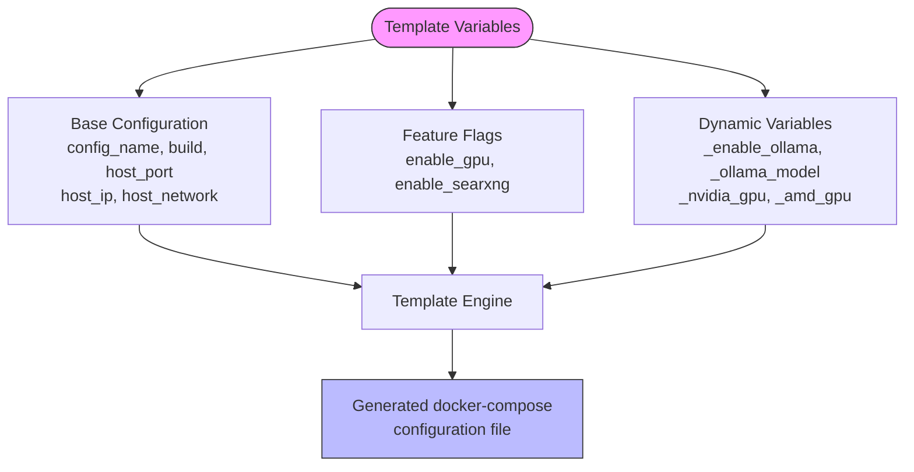
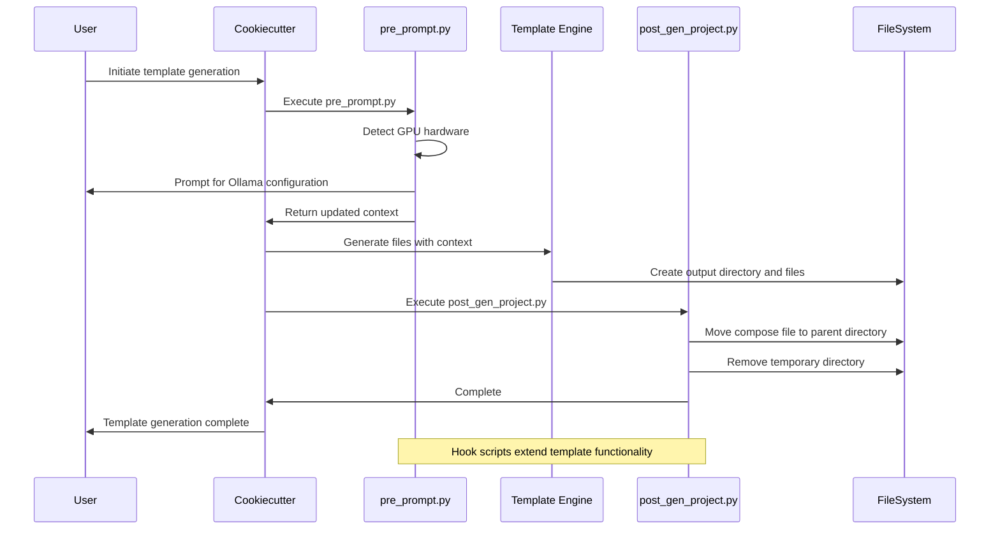

# Custom Docker Configuration with Cookiecutter

<cite>
**Referenced Files in This Document**   
- [cookiecutter.json](file://cookiecutter-docker/cookiecutter.json)
- [pre_prompt.py](file://cookiecutter-docker/hooks/pre_prompt.py)
- [post_gen_project.py](file://cookiecutter-docker/hooks/post_gen_project.py)
- [docker-compose.{{cookiecutter.config_name}}.yml](file://cookiecutter-docker/{{cookiecutter.config_name}}/docker-compose.{{cookiecutter.config_name}}.yml)
- [ollama_entrypoint.sh](file://scripts/ollama_entrypoint.sh)
</cite>

## Table of Contents
1. [Introduction](#introduction)
2. [Template Structure and Variables](#template-structure-and-variables)
3. [Hook Scripts Analysis](#hook-scripts-analysis)
4. [Configuration Generation Process](#configuration-generation-process)
5. [Customization Scenarios](#customization-scenarios)
6. [Advanced Use Cases](#advanced-use-cases)
7. [Troubleshooting Guide](#troubleshooting-guide)

## Introduction
The cookiecutter-docker template system provides a powerful framework for generating customized Docker configurations for the Local Deep Research application. This templating approach enables users to create tailored deployment configurations that match their specific hardware, network, and operational requirements. By leveraging Cookiecutter's interactive templating capabilities, users can generate optimized docker-compose files without requiring in-depth knowledge of Docker configuration syntax.

**Section sources**
- [cookiecutter.json](file://cookiecutter-docker/cookiecutter.json)
- [docker-compose.{{cookiecutter.config_name}}.yml](file://cookiecutter-docker/{{cookiecutter.config_name}}/docker-compose.{{cookiecutter.config_name}}.yml)

## Template Structure and Variables
The cookiecutter-docker template is structured around a central configuration file (cookiecutter.json) that defines the available customization options and their default values. The template generates docker-compose configuration files with variable substitution based on user inputs.

The primary template variables include:
- **config_name**: Configuration profile name that determines the output filename
- **build**: Boolean flag to determine whether to build from source or use pre-built images
- **host_port**: Port mapping for the web interface (default: 5000)
- **host_ip**: Host IP binding for the web server (default: 0.0.0.0)
- **host_network**: Boolean flag to use host networking mode
- **enable_gpu**: Boolean flag to enable GPU acceleration
- **enable_searxng**: Boolean flag to include SearXNG search engine service

Additional context variables are dynamically generated by the pre_prompt.py hook script:
- **_enable_ollama**: Internal flag for Ollama integration
- **_ollama_model**: Default model to use with Ollama
- **_nvidia_gpu**: Detected NVIDIA GPU availability
- **_amd_gpu**: Detected AMD GPU availability

The template uses Jinja2 conditional syntax to include or exclude service configurations based on these variables, enabling modular configuration generation.

**Diagram sources**
- [cookiecutter.json](file://cookiecutter-docker/cookiecutter.json)
- [docker-compose.{{cookiecutter.config_name}}.yml](file://cookiecutter-docker/{{cookiecutter.config_name}}/docker-compose.{{cookiecutter.config_name}}.yml)

**Section sources**
- [cookiecutter.json](file://cookiecutter-docker/cookiecutter.json)
- [docker-compose.{{cookiecutter.config_name}}.yml](file://cookiecutter-docker/{{cookiecutter.config_name}}/docker-compose.{{cookiecutter.config_name}}.yml)

## Hook Scripts Analysis
The cookiecutter-docker template includes two hook scripts that extend the basic templating functionality with interactive configuration and post-generation processing.

### pre_prompt.py
The pre_prompt.py script executes before the user is prompted for input values. It performs system detection and interactive configuration:

1. **GPU Detection**: On Linux systems, it uses the lspci command to detect NVIDIA or AMD GPUs and sets appropriate context variables
2. **Ollama Configuration**: Prompts the user to enable Ollama integration and select a default model
3. **Context Updates**: Modifies the template context with detected system capabilities and user preferences

The script enhances the template by providing intelligent defaults based on the host system's hardware capabilities, particularly for GPU acceleration.

### post_gen_project.py
The post_gen_project.py script executes after the template generation is complete. It performs cleanup and file organization:

1. **File Relocation**: Moves the generated docker-compose configuration file from the template output directory to the parent directory
2. **Directory Cleanup**: Removes the temporary template output directory
3. **File Naming**: Uses the config_name variable to create appropriately named configuration files (docker-compose.[config_name].yml)

This post-processing ensures that the generated configuration is immediately usable without requiring manual file management.

**Diagram sources**
- [pre_prompt.py](file://cookiecutter-docker/hooks/pre_prompt.py)
- [post_gen_project.py](file://cookiecutter-docker/hooks/post_gen_project.py)

**Section sources**
- [pre_prompt.py](file://cookiecutter-docker/hooks/pre_prompt.py)
- [post_gen_project.py](file://cookiecutter-docker/hooks/post_gen_project.py)

## Configuration Generation Process
The process of generating custom Docker configurations using the cookiecutter-docker template follows these steps:

1. **Prerequisites Installation**: Ensure Docker, Docker Compose, and Cookiecutter are installed on the system
2. **Repository Cloning**: Clone the Local Deep Research repository to access the template
3. **Template Execution**: Run the cookiecutter command with the template directory path
4. **Interactive Configuration**: Respond to prompts for configuration options
5. **File Generation**: Allow the template engine to generate the customized configuration
6. **Post-Processing**: The post-generation hook automatically organizes the output files

The generated docker-compose configuration includes conditional service definitions based on the selected options:
- When Ollama integration is enabled, an Ollama service is included with appropriate GPU configuration
- When SearXNG integration is enabled, a SearXNG service is included in the configuration
- Network configuration adapts based on the host_network setting
- Volume mappings are established for persistent data storage

The template also integrates with the ollama_entrypoint.sh script, which handles model downloading and service initialization when the containers are started.

**Section sources**
- [cookiecutter.json](file://cookiecutter-docker/cookiecutter.json)
- [pre_prompt.py](file://cookiecutter-docker/hooks/pre_prompt.py)
- [post_gen_project.py](file://cookiecutter-docker/hooks/post_gen_project.py)
- [docker-compose.{{cookiecutter.config_name}}.yml](file://cookiecutter-docker/{{cookiecutter.config_name}}/docker-compose.{{cookiecutter.config_name}}.yml)
- [ollama_entrypoint.sh](file://scripts/ollama_entrypoint.sh)

## Customization Scenarios
The cookiecutter-docker template supports various customization scenarios for different deployment requirements:

### Resource Limit Adjustment
Users can modify resource allocation by editing the generated docker-compose file to include resource constraints:
- CPU limits using the deploy.resources.limits.cpus parameter
- Memory limits using deploy.resources.limits.memory
- GPU memory allocation through Ollama configuration parameters

### Reverse Proxy Configuration
For integration with reverse proxies like Nginx or Traefik:
- Set host_port to an internal port number
- Configure the reverse proxy to forward requests to the Local Deep Research service
- Adjust health check intervals in the docker-compose configuration

### Storage Backend Integration
The template supports integration with various storage backends through volume configuration:
- Local file system mounts for data persistence
- Network-attached storage (NAS) mounts for shared access
- Cloud storage integration through appropriate volume plugins

### Environment-Specific Configurations
Different configuration profiles can be created for various environments:
- Development: Lower resource limits, debug logging enabled
- Production: Optimized resource allocation, enhanced security settings
- Testing: Isolated network configuration, test data volumes

**Section sources**
- [docker-compose.{{cookiecutter.config_name}}.yml](file://cookiecutter-docker/{{cookiecutter.config_name}}/docker-compose.{{cookiecutter.config_name}}.yml)
- [ollama_entrypoint.sh](file://scripts/ollama_entrypoint.sh)

## Advanced Use Cases
The cookiecutter-docker template supports advanced deployment scenarios beyond basic single-node configurations.

### Clustered Deployments
For clustered deployments across multiple nodes:
- Generate configuration files with service discovery enabled
- Configure distributed volume storage solutions
- Implement load balancing across multiple Local Deep Research instances
- Set up centralized logging and monitoring

### Specialized Hardware Requirements
The template accommodates specialized hardware configurations:
- **NVIDIA GPU Systems**: Automatically detects NVIDIA GPUs and configures Docker for GPU access using the nvidia-container-toolkit
- **AMD GPU Systems**: Detects AMD GPUs and configures appropriate device mappings for ROCm support
- **Apple Silicon**: Optimized configurations for M1/M2/M3/M4 Mac systems without GPU acceleration requirements

### High-Availability Setups
For mission-critical deployments requiring high availability:
- Generate configurations with multiple replica services
- Implement automated failover mechanisms
- Configure persistent storage with redundancy
- Set up health checks and automated recovery

### Hybrid Cloud-Local Deployments
The template can be adapted for hybrid deployment models:
- Local processing with cloud-based search services
- On-premises data storage with cloud-based LLM inference
- Edge computing configurations with centralized coordination

**Section sources**
- [pre_prompt.py](file://cookiecutter-docker/hooks/pre_prompt.py)
- [docker-compose.{{cookiecutter.config_name}}.yml](file://cookiecutter-docker/{{cookiecutter.config_name}}/docker-compose.{{cookiecutter.config_name}}.yml)

## Troubleshooting Guide
When encountering issues with template generation or configuration validation, consider the following troubleshooting steps:

### Template Generation Issues
- **Missing Cookiecutter**: Ensure Cookiecutter is installed via pip install --user cookiecutter
- **Permission Errors**: Run the template generation in a directory with appropriate write permissions
- **Network Issues**: Ensure internet connectivity for downloading template files and dependencies

### Configuration Validation
- **Syntax Checking**: Use docker-compose config to validate the generated configuration file
- **Variable Substitution**: Verify that all template variables have been properly substituted
- **Path Validation**: Check that volume paths are accessible on the host system

### Runtime Issues
- **GPU Detection**: On Linux systems, verify GPU detection with lspci | grep -i 'vga'
- **Port Conflicts**: Check for port conflicts with netstat or lsof
- **Volume Permissions**: Ensure proper permissions on volume mount points

### Common Error Resolution
- **Ollama Service Not Starting**: Verify that the ollama_entrypoint.sh script has execute permissions
- **SearXNG Connection Issues**: Check network configuration and service dependencies
- **Model Download Failures**: Verify internet connectivity and model name correctness

**Section sources**
- [pre_prompt.py](file://cookiecutter-docker/hooks/pre_prompt.py)
- [post_gen_project.py](file://cookiecutter-docker/hooks/post_gen_project.py)
- [docker-compose.{{cookiecutter.config_name}}.yml](file://cookiecutter-docker/{{cookiecutter.config_name}}/docker-compose.{{cookiecutter.config_name}}.yml)
- [ollama_entrypoint.sh](file://scripts/ollama_entrypoint.sh)