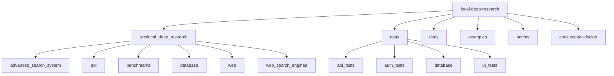
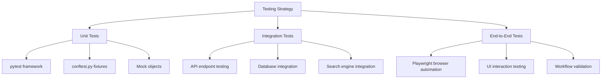
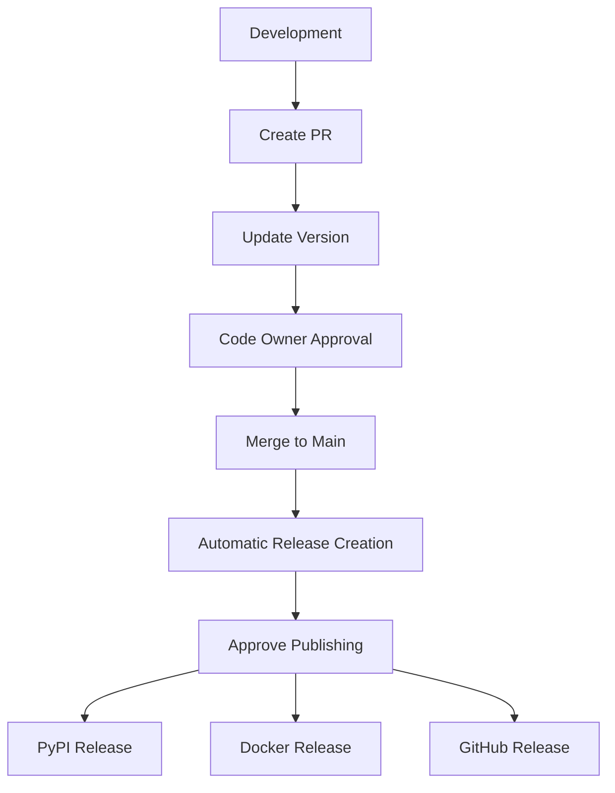
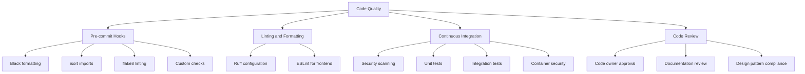

# Development

<cite>
**Referenced Files in This Document**   
- [CONTRIBUTING.md](file://CONTRIBUTING.md)
- [README.md](file://README.md)
- [pyproject.toml](file://pyproject.toml)
- [package.json](file://package.json)
- [eslint.config.mjs](file://eslint.config.mjs)
- [scripts/dev/debug_pytest.py](file://scripts/dev/debug_pytest.py)
- [tests/conftest.py](file://tests/conftest.py)
- [src/local_deep_research/__init__.py](file://src/local_deep_research/__init__.py)
- [src/local_deep_research/constants.py](file://src/local_deep_research/constants.py)
- [scripts/pre_commit/check_datetime_timezone.py](file://scripts/pre_commit/check_datetime_timezone.py)
- [docs/developing.md](file://docs/developing.md)
- [docs/RELEASE_GUIDE.md](file://docs/RELEASE_GUIDE.md)
- [docs/SECURITY_REVIEW_PROCESS.md](file://docs/SECURITY_REVIEW_PROCESS.md)
</cite>

## Table of Contents
1. [Introduction](#introduction)
2. [Project Structure and Organization](#project-structure-and-organization)
3. [Contribution Guidelines](#contribution-guidelines)
4. [Testing Strategy](#testing-strategy)
5. [Development Environment Setup](#development-environment-setup)
6. [Release Process](#release-process)
7. [Security Review Process](#security-review-process)
8. [Code Quality and CI/CD](#code-quality-and-cicd)
9. [Conclusion](#conclusion)

## Introduction

This document provides comprehensive development documentation for contributors to the local-deep-research project. It covers the codebase structure, contribution guidelines, testing strategy, development environment setup, release process, security review procedures, and code quality requirements. The goal is to provide a complete resource for developers who want to contribute to the project, ensuring consistency in development practices and maintaining high code quality standards.

**Section sources**
- [README.md](file://README.md)
- [CONTRIBUTING.md](file://CONTRIBUTING.md)

## Project Structure and Organization

The local-deep-research project follows a modular structure with clear separation of concerns. The main components are organized as follows:

- **src/local_deep_research/**: Core application code with submodules for different functionalities
- **tests/**: Comprehensive test suite covering unit, integration, and end-to-end tests
- **docs/**: Documentation for users and developers
- **examples/**: Usage examples and tutorials
- **scripts/**: Development and deployment scripts
- **cookiecutter-docker/**: Template for generating Docker configurations

The core application is organized into several key modules:
- **advanced_search_system**: Implements the deep research capabilities with various explorers and constraint checkers
- **api**: Provides programmatic access to the research functionality
- **benchmarks**: Contains benchmarking tools and datasets
- **database**: Handles database operations with encrypted storage
- **web**: Contains the web interface and related components
- **web_search_engines**: Manages integration with various search engines

The project uses PDM as the package manager, with dependencies defined in pyproject.toml. The frontend is built with modern JavaScript tools, using Vite for building assets and Bootstrap for styling.



**Diagram sources**
- [README.md](file://README.md)
- [pyproject.toml](file://pyproject.toml)

**Section sources**
- [README.md](file://README.md)
- [pyproject.toml](file://pyproject.toml)
- [src/local_deep_research/__init__.py](file://src/local_deep_research/__init__.py)
- [src/local_deep_research/constants.py](file://src/local_deep_research/constants.py)

## Contribution Guidelines

Contributors to the local-deep-research project should follow the established workflow to ensure smooth integration of changes. The process begins with forking the repository and creating a dedicated branch for each feature or fix.

### Branching Strategy

The project uses a feature-branch workflow:
- All development occurs on feature branches
- The main branch is protected and only updated through pull requests
- Each pull request should focus on a single feature or fix
- Branch names should be descriptive and follow the pattern: feature/descriptive-name or fix/descriptive-name

### Commit Message Conventions

Commit messages should be clear and descriptive, following these guidelines:
- Use imperative mood ("Add feature" not "Added feature")
- Limit the first line to 72 characters
- Include a body that explains what and why if necessary
- Reference related issues when applicable

### Pull Request Requirements

Pull requests must meet the following requirements:
- Include a clear description of the changes
- Update documentation to reflect code changes
- Add tests for new functionality
- Pass all CI checks
- Receive approval from at least one code owner

The project maintains strict file management policies to ensure code quality and prevent unintended data exposure. Only specific file types are permitted, including source code (.py, .js, .html, .css), configuration files (.json, .yml, .yaml), documentation (.md, .ipynb), and project files (LICENSE, README, Dockerfile, etc.).

**Section sources**
- [CONTRIBUTING.md](file://CONTRIBUTING.md)
- [README.md](file://README.md)

## Testing Strategy

The local-deep-research project employs a comprehensive testing strategy with multiple layers of testing to ensure code quality and reliability.

### Unit Tests

Unit tests focus on individual components and functions, ensuring they work as expected in isolation. These tests are located in the tests/ directory and are organized by module. The project uses pytest as the testing framework, with fixtures defined in conftest.py to provide common test setup and utilities.

### Integration Tests

Integration tests verify that multiple components work together correctly. These tests are particularly important for the web interface and API endpoints, ensuring that requests are handled properly and responses are formatted correctly. The tests/api_tests/ directory contains comprehensive API integration tests that cover various scenarios.

### End-to-End Tests

End-to-end tests simulate real user interactions with the application, testing the complete workflow from user input to final output. The project includes UI tests that use Playwright to automate browser interactions, ensuring the web interface functions correctly across different scenarios.

### Test Configuration

The testing environment is configured through pytest.ini options, with markers defined for different test types:
- requires_llm: Marks tests that require a real LLM (not fallback)
- integration: Marks integration tests
- slow: Marks slow tests
- asyncio: Marks async tests that use asyncio

The coverage configuration excludes certain directories from coverage requirements, including experimental strategies, CLI entry points, and visualization code, while maintaining high coverage standards for core functionality.



**Diagram sources**
- [tests/conftest.py](file://tests/conftest.py)
- [scripts/dev/debug_pytest.py](file://scripts/dev/debug_pytest.py)

**Section sources**
- [tests/conftest.py](file://tests/conftest.py)
- [scripts/dev/debug_pytest.py](file://scripts/dev/debug_pytest.py)

## Development Environment Setup

Setting up the development environment for local-deep-research involves several steps to ensure all dependencies are properly installed and configured.

### Python Environment

The project uses PDM as the package manager. After installing PDM, configure the environment and install dependencies:

```bash
pdm install --no-self
```

Commands can be run in the environment by prefixing them with `pdm run`. The environment can also be activated with `pdm venv activate`.

### Pre-commit Hooks

The project includes pre-commit hooks that automatically run linting and formatting for every commit. These hooks should be initialized after configuring the environment:

```bash
pre-commit install
pre-commit install-hooks
```

These hooks will automatically format code with Black, sort imports with isort, run flake8 linting, check for large files, and prevent commits to the main branch.

### Frontend Development

For frontend development, Node.js and npm are required. The frontend assets are built using Vite:

```bash
npm install
npm run build
```

This builds the Vite frontend into `src/local_deep_research/web/static/dist/`. Developers working on the frontend can use `npm run dev` to start a development server with hot reloading.

### Running the Application

The application can be run directly using Python module syntax:

```bash
# Run the web interface
python -m local_deep_research.web.app

# Run the CLI version
python -m local_deep_research.main
```

**Section sources**
- [docs/developing.md](file://docs/developing.md)
- [pyproject.toml](file://pyproject.toml)
- [package.json](file://package.json)
- [eslint.config.mjs](file://eslint.config.mjs)

## Release Process

The release process for local-deep-research is fully automated, triggered by merges to the main branch. This ensures consistent and reliable releases while minimizing manual intervention.

### Versioning Scheme

The project follows Semantic Versioning (SemVer):
- **Major** (X.0.0): Breaking changes
- **Minor** (0.X.0): New features, backward compatible
- **Patch** (0.0.X): Bug fixes, backward compatible

The version number is stored in `src/local_deep_research/__version__.py` and is automatically used in the release process.

### Changelog Management

Changelogs are auto-generated from the commit history since the last release. Contributors should ensure their commit messages are clear and descriptive to facilitate accurate changelog generation.

### Distribution Methods

Releases are distributed through multiple channels:
- **PyPI**: The Python Package Index for pip installation
- **Docker Hub**: Container images for Docker deployment
- **GitHub Releases**: Source code and release artifacts

The automated release process creates a GitHub release, which then triggers publishing to PyPI and Docker Hub after approval from code owners.

### Release Workflow

The standard release workflow is:
1. Create a PR with changes
2. Update the version in `__version__.py`
3. Get approval from code owners
4. Merge to main (triggers automatic release creation)
5. Approve publishing to PyPI and Docker Hub

For hotfixes, a similar process is followed with a focus on rapid review and deployment.



**Diagram sources**
- [docs/RELEASE_GUIDE.md](file://docs/RELEASE_GUIDE.md)

**Section sources**
- [docs/RELEASE_GUIDE.md](file://docs/RELEASE_GUIDE.md)
- [src/local_deep_research/__version__.py](file://src/local_deep_research/__version__.py)

## Security Review Process

The security review process is designed to ensure that changes to security-critical components receive appropriate scrutiny without blocking development.

### Automated Detection

The CI system automatically detects when PRs modify security-critical files, including:
- Database encryption components
- Authentication code
- Security utilities
- Encryption/decryption code
- Secrets baseline

When such changes are detected, the system posts a prominent warning comment with a security-specific review checklist, adds relevant labels to the PR, and creates an informational status check.

### Review Checklists

The automated system generates specific checklists based on the modified files:

#### For Encryption Changes:
- SQLCipher pragma order (key must come first)
- No hardcoded keys
- Backward compatibility
- Migration paths

#### For Authentication Changes:
- No auth bypasses
- Secure session handling
- Proper password hashing
- No privilege escalation

#### For All Security Changes:
- No exposed secrets
- No debug bypasses
- Safe error messages
- Secure logging

### Developer Guidelines

When modifying security files, developers should:
- Expect and welcome the security warning
- Perform self-review against the checklist
- Document the rationale for security changes
- Test thoroughly, especially with existing encrypted databases
- Be patient with the review process

### Reviewer Responsibilities

Reviewers should take security warnings seriously and:
- Carefully go through each checklist item
- Test changes locally, especially encryption modifications
- Ask questions if anything seems unclear
- Seek second opinions for critical changes

The process is designed to be educational and risk-based, providing specific guidance while trusting developers to make appropriate decisions.

**Diagram sources**
- [docs/SECURITY_REVIEW_PROCESS.md](file://docs/SECURITY_REVIEW_PROCESS.md)

**Section sources**
- [docs/SECURITY_REVIEW_PROCESS.md](file://docs/SECURITY_REVIEW_PROCESS.md)
- [CONTRIBUTING.md](file://CONTRIBUTING.md)

## Code Quality and CI/CD

The local-deep-research project maintains high code quality standards through a combination of automated tools and manual review processes.

### Pre-commit Hooks

The project uses pre-commit hooks to enforce code quality standards. These hooks automatically:
- Format code with Black
- Sort imports with isort
- Run flake8 linting
- Check for large files
- Prevent commits to the main branch

Additionally, custom pre-commit hooks like check_datetime_timezone.py ensure database compatibility by verifying that datetime columns use UtcDateTime for SQLite compatibility.

### Linting and Formatting

The project uses Ruff for linting, configured in pyproject.toml with rules that match Black's formatting style. The JavaScript frontend is linted using ESLint with a configuration that enforces best practices while allowing flexibility for existing code.

### Continuous Integration

The CI pipeline includes multiple workflows:
- **Security tests**: Code scanning with CodeQL and Semgrep
- **Unit and integration tests**: Comprehensive test coverage
- **Pre-commit checks**: Ensuring code style compliance
- **Container security**: Scanning Docker images for vulnerabilities
- **Automated publishing**: Deploying releases to PyPI and Docker Hub

### Code Quality Requirements

All contributions must meet the following quality requirements:
- Pass all linting and formatting checks
- Achieve adequate test coverage
- Include appropriate documentation
- Follow established design patterns
- Maintain backward compatibility when possible

The project uses coverage.py to measure test coverage, with exclusions for experimental code, CLI entry points, and visualization code. The goal is to maintain high coverage for core functionality while allowing flexibility for less critical components.



**Diagram sources**
- [pyproject.toml](file://pyproject.toml)
- [package.json](file://package.json)
- [eslint.config.mjs](file://eslint.config.mjs)
- [scripts/pre_commit/check_datetime_timezone.py](file://scripts/pre_commit/check_datetime_timezone.py)

**Section sources**
- [pyproject.toml](file://pyproject.toml)
- [package.json](file://package.json)
- [eslint.config.mjs](file://eslint.config.mjs)
- [scripts/pre_commit/check_datetime_timezone.py](file://scripts/pre_commit/check_datetime_timezone.py)

## Conclusion

The local-deep-research project provides a comprehensive framework for contributors to develop and maintain a high-quality AI research assistant. The documented processes for contribution, testing, release management, security review, and code quality ensure that the project maintains its standards while welcoming new contributions. By following these guidelines, developers can effectively contribute to the project while maintaining the security, reliability, and usability that users expect.