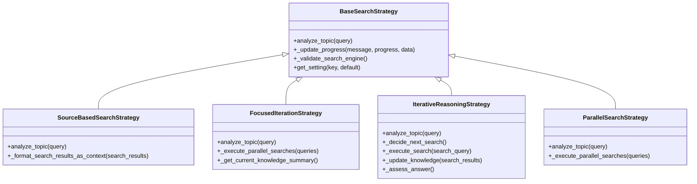
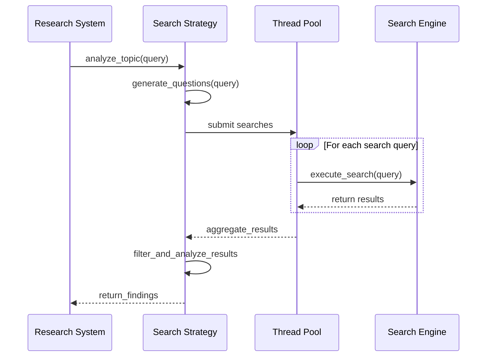
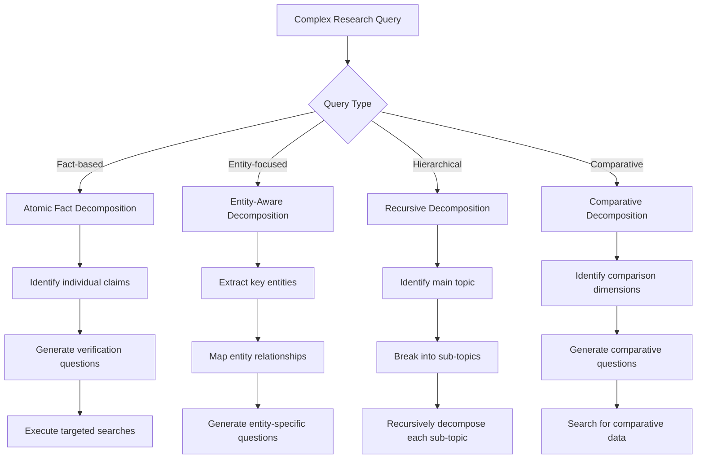
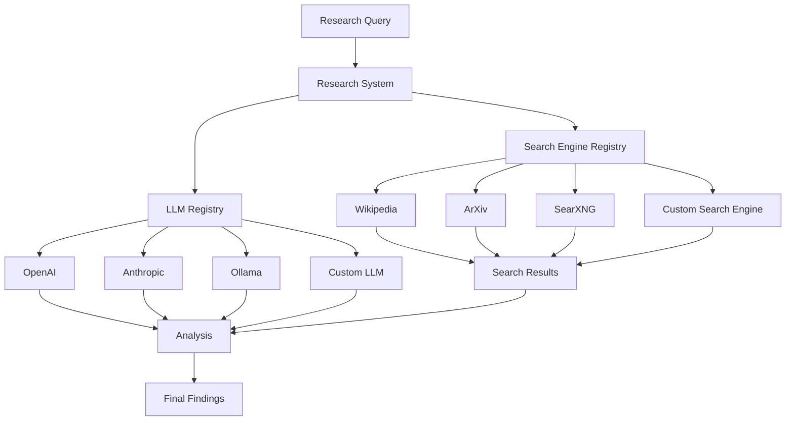
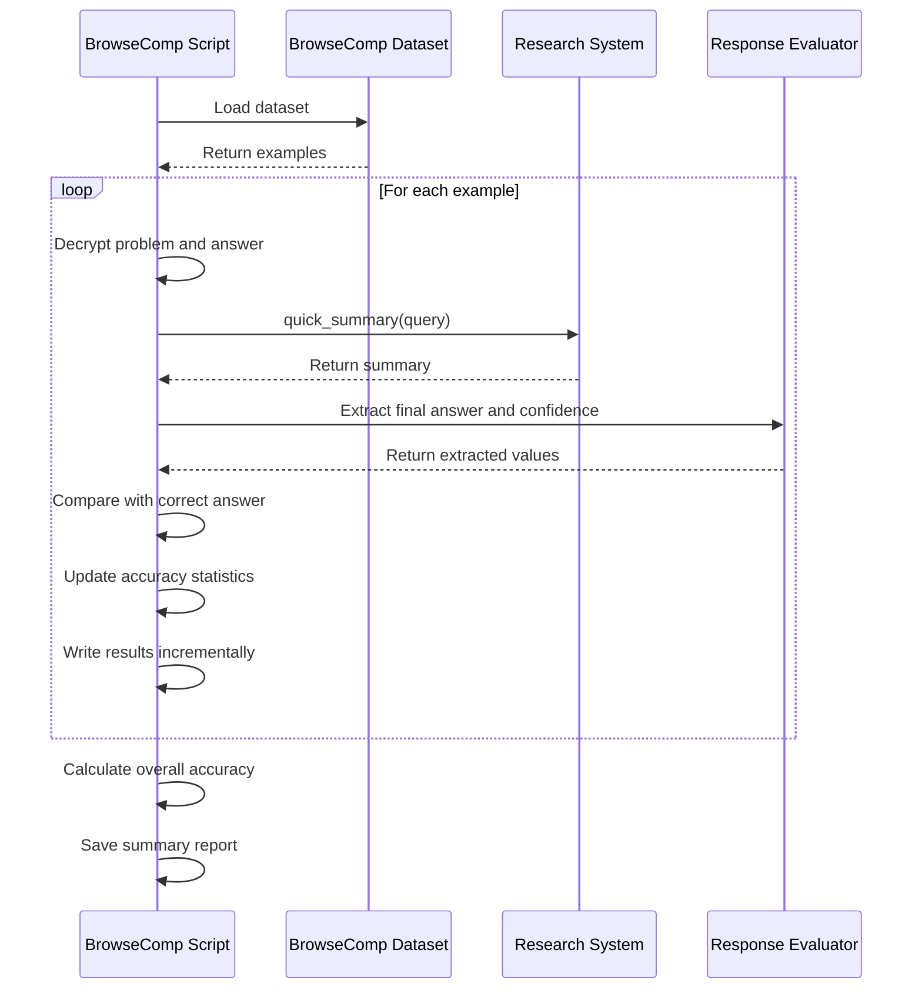
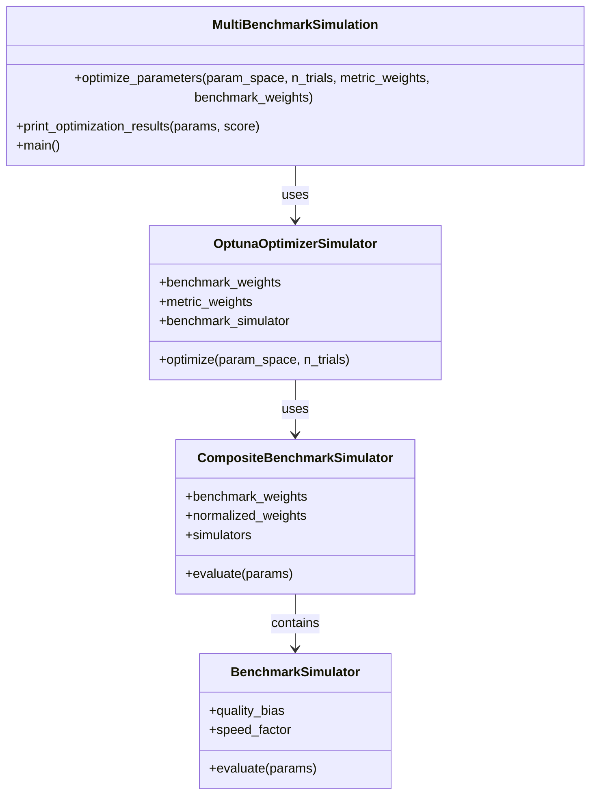
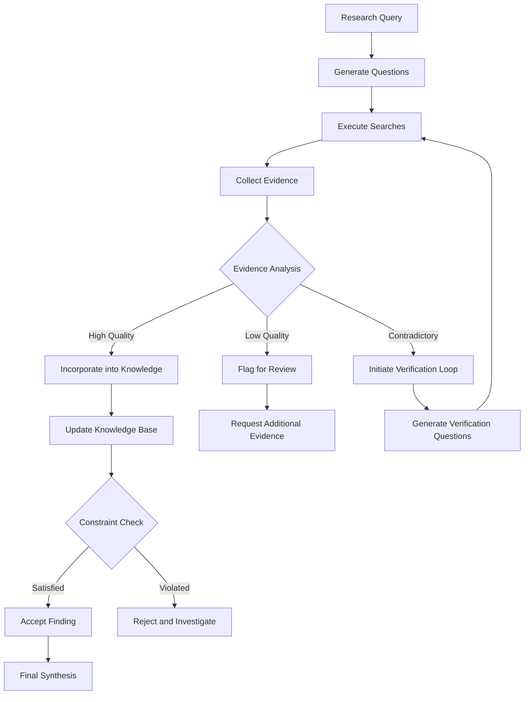
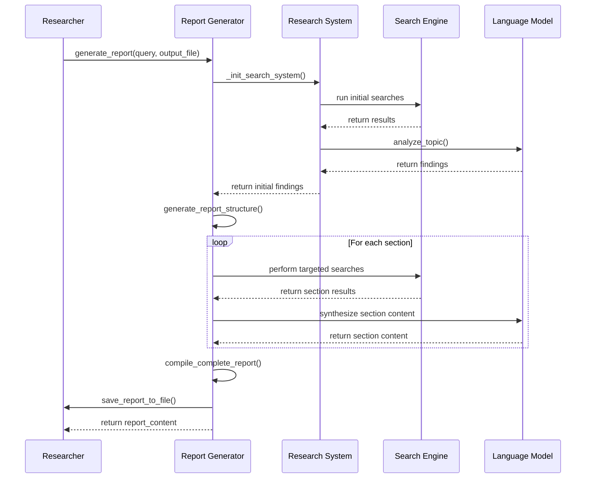

# Advanced Research Scenarios

<cite>
**Referenced Files in This Document**   
- [advanced_features_example.py](file://examples/api_usage/programmatic/advanced_features_example.py)
- [search_strategies_example.py](file://examples/api_usage/programmatic/search_strategies_example.py)
- [run_browsecomp_fixed_v2.py](file://examples/benchmarks/browsecomp/run_browsecomp_fixed_v2.py)
- [multi_benchmark_simulation.py](file://examples/optimization/multi_benchmark_simulation.py)
- [source_based_strategy.py](file://src/local_deep_research/advanced_search_system/strategies/source_based_strategy.py)
- [focused_iteration_strategy.py](file://src/local_deep_research/advanced_search_system/strategies/focused_iteration_strategy.py)
- [iterative_reasoning_strategy.py](file://src/local_deep_research/advanced_search_system/strategies/iterative_reasoning_strategy.py)
- [parallel_search_strategy.py](file://src/local_deep_research/advanced_search_system/strategies/parallel_search_strategy.py)
- [research_functions.py](file://src/local_deep_research/api/research_functions.py)
- [settings_utils.py](file://src/local_deep_research/api/settings_utils.py)
</cite>

## Table of Contents
1. [Introduction](#introduction)
2. [Multi-Strategy Research Implementation](#multi-strategy-research-implementation)
3. [Hybrid Search Approaches](#hybrid-search-approaches)
4. [Query Decomposition Patterns](#query-decomposition-patterns)
5. [Integration of Multiple Search Engines and LLM Providers](#integration-of-multiple-search-engines-and-llm-providers)
6. [BrowseComp Benchmark Execution](#browsecomp-benchmark-execution)
7. [Multi-Benchmark Simulations](#multi-benchmark-simulations)
8. [Evidence-Based Reasoning and Constraint Checking](#evidence-based-reasoning-and-constraint-checking)
9. [Report Generation and Findings Synthesis](#report-generation-and-findings-synthesis)
10. [Performance Considerations and Best Practices](#performance-considerations-and-best-practices)

## Introduction
The local-deep-research system provides advanced capabilities for conducting complex research scenarios through sophisticated programmatic interfaces and strategic research methodologies. This document explores the implementation details of multi-strategy research, hybrid search approaches, and query decomposition patterns that enable comprehensive information gathering and analysis. The system supports various research strategies including source-based, focused-iteration, and parallel approaches, each optimized for different research objectives and information landscapes. By integrating multiple search engines and LLM providers within single research workflows, the system enables evidence-based reasoning, constraint checking, and verification loops to ensure research quality and reliability. The documentation covers advanced topics such as BrowseComp benchmark execution, multi-benchmark simulations, and comprehensive report generation for synthesizing findings across multiple sources.

## Multi-Strategy Research Implementation

The local-deep-research system implements multiple research strategies through specialized classes that inherit from a common base strategy. The primary strategies include source-based, focused-iteration, iterative reasoning, and parallel search approaches, each designed for specific research scenarios and objectives.

The **Source-Based Search Strategy** focuses on gathering and synthesizing information from multiple sources with detailed citation tracking. This strategy is ideal for academic research, fact-checking, and comprehensive reports that require source verification. It systematically searches for sources related to the topic, synthesizes information across multiple sources, and provides detailed citations for all claims.

**Diagram sources**
- [source_based_strategy.py](file://src/local_deep_research/advanced_search_system/strategies/source_based_strategy.py#L22-L461)
- [focused_iteration_strategy.py](file://src/local_deep_research/advanced_search_system/strategies/focused_iteration_strategy.py#L40-L586)
- [iterative_reasoning_strategy.py](file://src/local_deep_research/advanced_search_system/strategies/iterative_reasoning_strategy.py#L58-L761)
- [parallel_search_strategy.py](file://src/local_deep_research/advanced_search_system/strategies/parallel_search_strategy.py#L20-L471)

The **Focused-Iteration Strategy** emphasizes deep exploration of complex topics through adaptive research that evolves based on previous findings. This approach is particularly effective for exploratory or investigative research where the goal is to discover unexpected connections and relationships. The strategy iteratively refines understanding through multiple rounds of questioning and searching, making it ideal for complex topics requiring deep exploration.

The **Iterative Reasoning Strategy** maintains a persistent knowledge base and iteratively analyzes what is known, decides what to search next, performs the search, updates knowledge with findings, and repeats until confident in the answer. This step-by-step approach is particularly effective for complex queries that require building knowledge incrementally and assessing confidence levels throughout the research process.

The **Parallel Search Strategy** is designed for maximum search speed by generating questions and running all searches simultaneously. This approach is optimal when time is a critical factor and the research objective requires gathering a broad range of information quickly. The strategy executes searches in parallel across multiple threads, significantly reducing the overall research time compared to sequential approaches.

**Section sources**
- [source_based_strategy.py](file://src/local_deep_research/advanced_search_system/strategies/source_based_strategy.py#L22-L461)
- [focused_iteration_strategy.py](file://src/local_deep_research/advanced_search_system/strategies/focused_iteration_strategy.py#L40-L586)
- [iterative_reasoning_strategy.py](file://src/local_deep_research/advanced_search_system/strategies/iterative_reasoning_strategy.py#L58-L761)
- [parallel_search_strategy.py](file://src/local_deep_research/advanced_search_system/strategies/parallel_search_strategy.py#L20-L471)

## Hybrid Search Approaches

The local-deep-research system implements hybrid search approaches that combine the strengths of different strategies to achieve optimal research outcomes. These approaches leverage the complementary nature of various search methodologies to address complex research challenges that cannot be effectively solved by a single strategy alone.

One key hybrid approach combines the **source-based strategy** with **parallel execution** to achieve both comprehensive coverage and speed. This approach first generates a diverse set of questions using the source-based methodology, then executes all searches in parallel to minimize research time. The system uses thread pools to manage concurrent search operations, with each thread handling a separate search query while maintaining proper context and progress tracking.

**Diagram sources**
- [parallel_search_strategy.py](file://src/local_deep_research/advanced_search_system/strategies/parallel_search_strategy.py#L229-L256)
- [source_based_strategy.py](file://src/local_deep_research/advanced_search_system/strategies/source_based_strategy.py#L269-L295)

Another hybrid approach combines **iterative reasoning** with **constraint checking** to ensure research quality and reliability. This approach uses the iterative reasoning framework to build knowledge incrementally while incorporating constraint checking at each step to validate findings against predefined criteria. The system employs a constraint satisfaction tracker that monitors compliance with research constraints throughout the process, flagging any violations and suggesting corrective actions.

The system also implements a **progressive exploration** hybrid that combines entity extraction with targeted searching. This approach first analyzes the initial query to extract key entities, then systematically searches for information about each entity while tracking coverage and confidence levels. The explorer component maintains a progress tracker that monitors which entities have been adequately covered and which require further investigation, enabling the system to focus subsequent searches on under-explored areas.

A particularly sophisticated hybrid approach combines **evidence-based reasoning** with **dual confidence checking**. This method evaluates findings from multiple perspectives, using different LLM providers or reasoning patterns to assess the same information. The system compares confidence scores from different sources and only accepts findings when there is sufficient agreement between independent assessments, significantly reducing the risk of accepting incorrect or biased information.

**Section sources**
- [parallel_search_strategy.py](file://src/local_deep_research/advanced_search_system/strategies/parallel_search_strategy.py#L20-L471)
- [iterative_reasoning_strategy.py](file://src/local_deep_research/advanced_search_system/strategies/iterative_reasoning_strategy.py#L58-L761)
- [constraint_checking](file://src/local_deep_research/advanced_search_system/constraint_checking)

## Query Decomposition Patterns

The local-deep-research system implements sophisticated query decomposition patterns that break down complex research questions into manageable sub-questions, enabling systematic exploration of multifaceted topics. These patterns leverage specialized question generators and analysis frameworks to ensure comprehensive coverage of the research domain.

The system employs several key decomposition patterns, including **atomic fact decomposition**, **entity-aware decomposition**, and **recursive decomposition**. Atomic fact decomposition breaks complex queries into discrete factual statements that can be individually verified. This approach is particularly effective for fact-checking and validation tasks where each component of a claim must be independently assessed.

**Diagram sources**
- [atomic_fact_question.py](file://src/local_deep_research/advanced_search_system/questions/atomic_fact_question.py)
- [entity_aware_question.py](file://src/local_deep_research/advanced_search_system/questions/entity_aware_question.py)
- [recursive_decomposition_strategy.py](file://src/local_deep_research/advanced_search_system/strategies/recursive_decomposition_strategy.py)

Entity-aware decomposition identifies key entities within a query and generates questions focused on each entity's properties, relationships, and context. This pattern is particularly effective for research involving people, organizations, locations, or technical concepts where understanding the characteristics and connections between entities is crucial. The system uses entity extraction techniques to identify relevant entities and then systematically explores each one through targeted questioning.

Recursive decomposition applies a hierarchical approach to break down complex topics into increasingly specific sub-topics. This pattern is ideal for comprehensive research that requires exploring a subject at multiple levels of detail. The system starts with broad questions about the main topic, then generates follow-up questions about each identified sub-topic, continuing the process until sufficient depth is achieved or research constraints are met.

The system also implements **adaptive query generation** that modifies the decomposition pattern based on intermediate findings. If initial searches reveal unexpected connections or contradictions, the system can dynamically adjust its decomposition strategy to explore these new avenues. This adaptive approach ensures that the research remains responsive to emerging information while maintaining systematic coverage of the original research objectives.

**Section sources**
- [questions](file://src/local_deep_research/advanced_search_system/questions)
- [query_generation](file://src/local_deep_research/advanced_search_system/query_generation)

## Integration of Multiple Search Engines and LLM Providers

The local-deep-research system enables seamless integration of multiple search engines and LLM providers within single research workflows, allowing researchers to leverage the strengths of different tools and services. This integration is facilitated through a flexible API that supports programmatic configuration of search engines and language models.

The system provides programmatic access to search and research capabilities through the API module, which allows users to specify custom search engines and LLM providers as parameters. The `quick_summary`, `generate_report`, and `detailed_research` functions accept optional `retrievers` and `llms` parameters that enable the registration of custom search engines and language models for use in the research process.

**Diagram sources**
- [research_functions.py](file://src/local_deep_research/api/research_functions.py#L23-L146)
- [retriever_registry.py](file://src/local_deep_research/web_search_engines/retriever_registry.py)
- [llm_registry.py](file://src/local_deep_research/llm/llm_registry.py)

The integration process involves registering custom components with the system's registries. For search engines, users can pass a dictionary of retriever instances to the `retrievers` parameter, which are then registered with the retriever registry. Similarly, custom LLM instances can be passed through the `llms` parameter and registered with the LLM registry. This modular design allows researchers to incorporate specialized search tools or language models tailored to their specific research needs.

The system also supports hybrid workflows that combine multiple search engines and LLM providers in a single research session. For example, a researcher might use Wikipedia and ArXiv as search engines while leveraging both OpenAI and Anthropic models for analysis. The system coordinates these components, ensuring proper context sharing and result aggregation across the different tools.

Configuration of integrated components is managed through settings snapshots, which provide a consistent interface for specifying parameters across different search engines and LLM providers. The `create_settings_snapshot` function allows users to define overrides for specific settings, such as API keys, temperature values, or search parameters, ensuring that each component operates with the appropriate configuration.

**Section sources**
- [research_functions.py](file://src/local_deep_research/api/research_functions.py#L149-L658)
- [settings_utils.py](file://src/local_deep_research/api/settings_utils.py#L18-L333)

## BrowseComp Benchmark Execution

The local-deep-research system includes comprehensive support for BrowseComp benchmark execution, enabling researchers to evaluate and compare the performance of different research configurations. The BrowseComp benchmark assesses the system's ability to answer complex questions by decrypting problem statements and correct answers using canary strings from the dataset.

The benchmark execution process is implemented in the `run_browsecomp_fixed_v2.py` script, which handles the complete workflow from dataset loading to result evaluation. The script uses the `quick_summary` function to query the system with formatted questions and evaluates the responses against the correct answers from the dataset. The evaluation process includes extracting final answers and confidence scores from the responses and comparing them to the ground truth.

**Diagram sources**
- [run_browsecomp_fixed_v2.py](file://examples/benchmarks/browsecomp/run_browsecomp_fixed_v2.py#L81-L258)

The benchmark script supports various configuration options that allow researchers to customize the evaluation process. Parameters such as the number of examples to use, search iterations, questions per iteration, and search tool can be specified to test different research configurations. The script also supports command-line arguments for easy integration into automated testing pipelines.

The evaluation process includes several key components: problem decryption, query formatting, response generation, answer extraction, and accuracy assessment. The script uses a query template to format questions consistently and a grader template to structure the evaluation criteria. Response processing involves cleaning up the output and extracting the final answer and confidence score using regular expressions.

Results are written incrementally to an output file in JSONL format, allowing for real-time monitoring of the benchmark progress. A summary report is also generated, containing overall accuracy statistics and configuration details. This comprehensive reporting enables detailed analysis of the system's performance across different metrics and configurations.

**Section sources**
- [run_browsecomp_fixed_v2.py](file://examples/benchmarks/browsecomp/run_browsecomp_fixed_v2.py#L1-L309)

## Multi-Benchmark Simulations

The local-deep-research system supports multi-benchmark simulations that allow researchers to evaluate and optimize system performance across multiple evaluation criteria simultaneously. The `multi_benchmark_simulation.py` script demonstrates how to use weighted scores to balance performance across different benchmarks without executing real benchmarks.

The simulation framework includes several key components: benchmark simulators, composite benchmark evaluation, and optimization algorithms. The `BenchmarkSimulator` class simulates the execution of individual benchmarks, calculating quality and speed scores based on system parameters. Different benchmark types respond differently to parameters, with SimpleQA favoring more iterations and BrowseComp preferring more questions per iteration.

**Diagram sources**
- [multi_benchmark_simulation.py](file://examples/optimization/multi_benchmark_simulation.py#L18-L414)

The `CompositeBenchmarkSimulator` class combines multiple benchmarks with configurable weights, allowing researchers to create custom evaluation profiles that reflect their specific priorities. The simulator normalizes weights and calculates weighted contributions from each benchmark to produce a combined score that represents overall system performance.

The optimization process is implemented through the `OptunaOptimizerSimulator` class, which simulates parameter optimization using a trial-based approach. The optimizer explores a defined parameter space, testing different configurations and tracking performance metrics. It calculates combined scores based on quality and speed weights, identifying the best parameters through iterative evaluation.

The simulation supports various optimization scenarios, including single-benchmark optimization, weighted combination optimization, and comparative analysis of different configurations. The script demonstrates these scenarios through examples that optimize for SimpleQA only, BrowseComp only, and a 60/40 weighted combination of both benchmarks.

Results are saved to timestamped directories with comprehensive JSON files containing all trial information, best parameters, and performance metrics. This detailed recording enables thorough analysis of the optimization process and facilitates comparison between different approaches.

**Section sources**
- [multi_benchmark_simulation.py](file://examples/optimization/multi_benchmark_simulation.py#L1-L414)

## Evidence-Based Reasoning and Constraint Checking

The local-deep-research system implements sophisticated evidence-based reasoning and constraint checking mechanisms to ensure research quality and reliability. These features are critical for maintaining the integrity of research findings and preventing the propagation of incorrect or unsupported information.

The system's evidence-based reasoning is implemented through the `evidence_analyzer.py` and `citation_handler.py` components, which evaluate the quality and relevance of information sources. The evidence analyzer assesses factors such as source credibility, information consistency, and supporting evidence strength to determine the reliability of findings. This analysis informs the citation handler's decision-making process when synthesizing information from multiple sources.

**Diagram sources**
- [evidence_analyzer.py](file://src/local_deep_research/advanced_search_system/constraint_checking/evidence_analyzer.py)
- [constraint_checker.py](file://src/local_deep_research/advanced_search_system/constraint_checking/constraint_checker.py)

Constraint checking is implemented through a comprehensive framework that includes multiple checker types: `strict_checker`, `threshold_checker`, `dual_confidence_checker`, and `intelligent_constraint_relaxer`. These checkers enforce different types of constraints, from strict compliance requirements to probabilistic confidence thresholds. The system can be configured to use different checker combinations based on the research context and requirements.

The verification loop mechanism automatically initiates additional research when contradictory evidence is detected or when confidence levels are insufficient. This process generates targeted verification questions designed to resolve uncertainties and validate findings. The system tracks verification progress and ensures that all significant contradictions are addressed before accepting final conclusions.

The constraint satisfaction tracker monitors compliance with research constraints throughout the process, providing real-time feedback on constraint status. This tracking enables the system to adapt its research strategy dynamically, focusing additional efforts on areas where constraints are not being met or where confidence levels are low.

**Section sources**
- [constraint_checking](file://src/local_deep_research/advanced_search_system/constraint_checking)
- [evidence](file://src/local_deep_research/advanced_search_system/evidence)

## Report Generation and Findings Synthesis

The local-deep-research system provides comprehensive report generation capabilities that transform research findings into structured, human-readable documents. The `generate_report` function creates detailed markdown reports with executive summaries, organized findings, source citations, and conclusions, enabling effective communication of research results.

The report generation process begins with the `generate_report` function, which configures the research system with appropriate settings and initiates the analysis process. The function accepts parameters such as the query, output file path, number of searches per section, and settings snapshot, allowing for customized report generation. The system performs multiple searches per section to ensure depth and comprehensiveness in the final report.

**Diagram sources**
- [research_functions.py](file://src/local_deep_research/api/research_functions.py#L308-L441)
- [report_generator.py](file://src/local_deep_research/report_generator.py)

The findings synthesis process involves aggregating information from multiple sources, identifying key themes and patterns, and organizing the results into a coherent narrative. The system uses the `IntegratedReportGenerator` class to manage this process, which coordinates between the search system and language model to produce well-structured reports.

The system supports multiple export formats, including JSON for programmatic processing, markdown for human readability, and custom formats for specialized applications. The `format_as_markdown` function converts research results into markdown format with proper section headings, bullet points, and source citations. The `extract_citations` function identifies and extracts citations from research results for separate processing or analysis.

Advanced features include batch research processing, which enables comparative analysis across multiple topics, and result analysis tools that extract insights, themes, and patterns from research findings. The system can generate statistics on finding categories, source distribution, and keyword frequency, providing additional context for interpreting the results.

**Section sources**
- [advanced_features_example.py](file://examples/api_usage/programmatic/advanced_features_example.py#L23-L613)
- [research_functions.py](file://src/local_deep_research/api/research_functions.py#L308-L441)

## Performance Considerations and Best Practices

When conducting complex research tasks with the local-deep-research system, several performance considerations and best practices should be observed to ensure optimal results and efficient resource utilization. These guidelines help researchers balance research quality, speed, and reliability while avoiding common pitfalls.

For **research strategy selection**, choose the appropriate strategy based on the research objectives:
- Use **source-based strategy** for academic research, fact-checking, and comprehensive reports requiring source verification
- Use **focused-iteration strategy** for deep exploration of complex topics and discovery of unexpected connections
- Use **parallel search strategy** when speed is critical and broad information gathering is required
- Use **iterative reasoning strategy** for complex queries requiring step-by-step knowledge building

When configuring **search parameters**, consider the following best practices:
- Set appropriate values for `iterations` and `questions_per_iteration` based on research complexity
- Use lower temperature values (0.2-0.5) for more focused output in analytical tasks
- Increase iterations for thorough exploration of complex topics
- Balance the number of questions per iteration to avoid information overload

For **resource management**, implement these practices:
- Monitor system resources during long-running research tasks
- Use appropriate timeout settings for search operations
- Implement error handling and retry mechanisms for failed searches
- Consider the computational cost of multiple LLM calls in extended research sessions

When integrating **multiple search engines and LLM providers**:
- Ensure API rate limits are respected across all integrated services
- Validate credentials and connectivity before starting research
- Monitor usage quotas and costs for commercial services
- Implement fallback mechanisms for unavailable services

For **benchmarking and optimization**:
- Use simulation tools to test configurations before executing real benchmarks
- Apply appropriate weights to different benchmarks based on research priorities
- Balance quality and speed metrics according to specific requirements
- Document configuration changes and their impact on performance

When generating **reports and synthesizing findings**:
- Use appropriate file output settings and verify write permissions
- Structure reports with clear section headings and logical organization
- Include comprehensive source citations and references
- Validate report content for accuracy and completeness

Finally, implement **error handling and verification** practices:
- Incorporate constraint checking and evidence validation in research workflows
- Use verification loops to resolve contradictory findings
- Monitor confidence scores and investigate low-confidence results
- Implement logging and progress tracking for debugging and analysis

**Section sources**
- [best_practices.md](file://docs/best-practices.md)
- [performance-optimization.md](file://docs/performance-optimization.md)