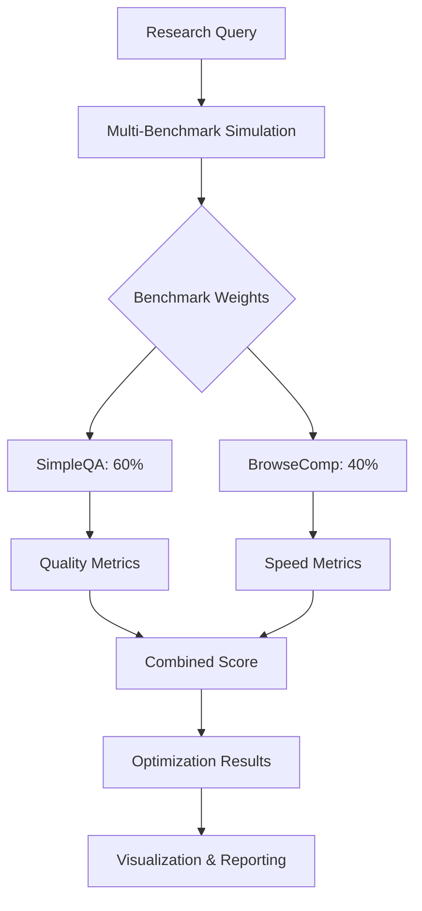
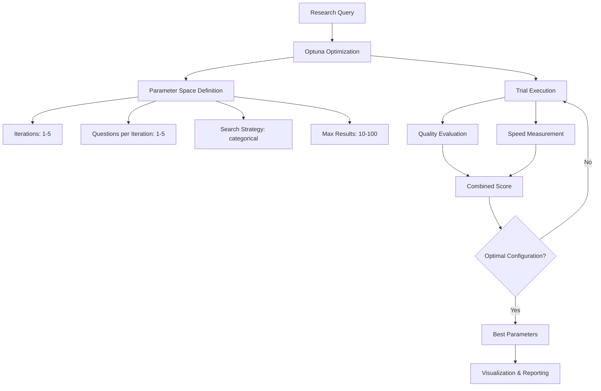
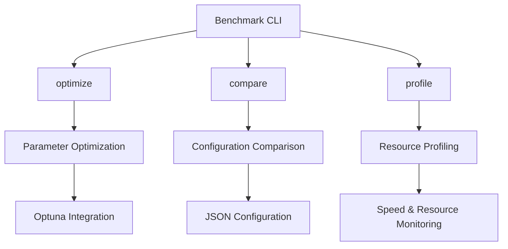
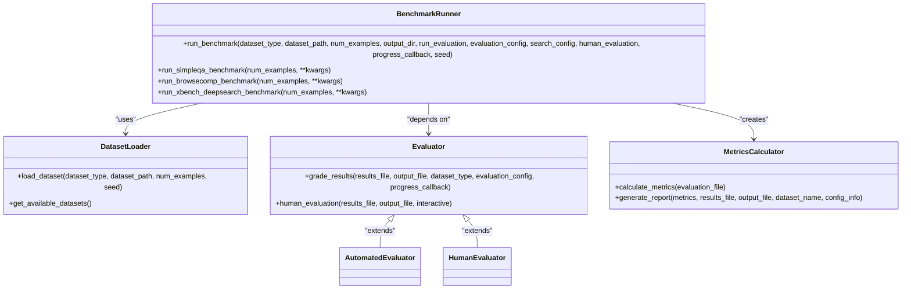
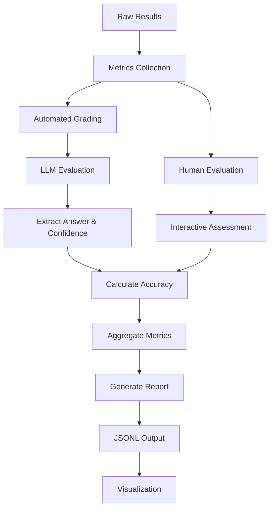

# Complex Benchmarking

<cite>
**Referenced Files in This Document**   
- [run_browsecomp.py](file://examples/benchmarks/run_browsecomp.py)
- [example_multi_benchmark.py](file://examples/optimization/example_multi_benchmark.py)
- [runners.py](file://src/local_deep_research/benchmarks/runners.py)
- [optuna_optimizer.py](file://src/local_deep_research/benchmarks/optimization/optuna_optimizer.py)
- [graders.py](file://src/local_deep_research/benchmarks/graders.py)
- [templates.py](file://src/local_deep_research/benchmarks/templates.py)
- [cli.py](file://src/local_deep_research/benchmarks/cli.py)
</cite>

## Table of Contents
1. [Introduction](#introduction)
2. [BrowseComp Benchmark Execution](#browsecomp-benchmark-execution)
3. [Multi-Benchmark Simulations](#multi-benchmark-simulations)
4. [Optimization Workflows](#optimization-workflows)
5. [Benchmark Command-Line Interface](#benchmark-command-line-interface)
6. [Runner Architecture](#runner-architecture)
7. [Dataset Integration Patterns](#dataset-integration-patterns)
8. [Metrics Collection and Result Aggregation](#metrics-collection-and-result-aggregation)
9. [Performance Analysis Capabilities](#performance-analysis-capabilities)
10. [Interpreting Benchmark Results](#interpreting-benchmark-results)
11. [Best Practices for Reproducible Benchmarking](#best-practices-for-reproducible-benchmarking)

## Introduction
The local-deep-research system provides a comprehensive benchmarking framework for evaluating and optimizing research performance across various dimensions. This document details the implementation of complex benchmarking scenarios, focusing on the BrowseComp benchmark execution, multi-benchmark simulations, and optimization workflows. The system enables users to configure and execute comprehensive evaluations through command-line interfaces and programmatic APIs, with robust metrics collection, result aggregation, and performance analysis capabilities.

The benchmarking architecture is designed to support both automated and human evaluation methods, with integration of optimization techniques like Optuna for tuning research parameters. Users can compare different research strategies and configurations to identify optimal approaches for specific research domains and requirements.

## BrowseComp Benchmark Execution

The BrowseComp benchmark evaluates the system's ability to understand complex questions that may require web browsing for answers. The implementation in `run_browsecomp.py` handles encrypted questions and answers using a canary-based decryption mechanism. The benchmark processes each example by decrypting the problem and answer, formatting the query according to the BrowseComp template, and executing the search through the LDR system.

The execution flow includes loading the BrowseComp dataset, processing each example with configurable parameters such as search iterations and questions per iteration, and collecting results with processing time metrics. After processing all examples, the system runs automated evaluation using a grader model to assess answer accuracy. The results are aggregated to calculate key metrics including accuracy, total examples processed, correct answers, and average processing time.

The benchmark supports various search tools, with SearXNG as the default option, and allows customization of output directories for result storage. Error handling is implemented throughout the process to ensure robust execution even when individual examples fail.

**Section sources**
- [run_browsecomp.py](file://examples/benchmarks/run_browsecomp.py#L1-L289)
- [browsecomp_benchmark_readme.md](file://examples/benchmarks/browsecomp_benchmark_readme.md#L1-L85)

## Multi-Benchmark Simulations

The multi-benchmark simulation framework enables evaluation across multiple benchmark types with customizable weights. The `example_multi_benchmark.py` demonstrates how to use weighted benchmarks combining SimpleQA and BrowseComp with different emphasis. The simulation creates timestamp-based directories for organizing results and supports various optimization strategies including quality-focused, speed-focused, and balanced approaches.

The implementation allows users to specify benchmark weights through the `benchmark_weights` parameter, enabling fine-grained control over the evaluation emphasis. For example, a 60/40 weighted combination can be configured with 60% weight for SimpleQA and 40% for BrowseComp. The system also supports specialized optimization functions like `optimize_for_quality` and `optimize_for_speed` that prioritize specific performance dimensions.

The simulation framework includes comprehensive result reporting with formatted output showing optimization scores and parameter configurations. Results are saved to designated output directories with detailed logs and visualizations for subsequent analysis. This approach enables researchers to compare different benchmarking strategies and identify optimal configurations for their specific use cases.

**Diagram sources**
- [example_multi_benchmark.py](file://examples/optimization/example_multi_benchmark.py#L1-L196)

**Section sources**
- [example_multi_benchmark.py](file://examples/optimization/example_multi_benchmark.py#L1-L196)
- [multi_benchmark_simulation.py](file://examples/optimization/multi_benchmark_simulation.py#L1-L414)

## Optimization Workflows

The optimization framework leverages Optuna to systematically explore parameter spaces and identify optimal configurations for research performance. The `OptunaOptimizer` class in `optuna_optimizer.py` provides the core functionality for parameter optimization, supporting multiple metrics including quality, speed, and resource usage. The optimizer can balance these metrics according to user-defined weights, enabling customization of the optimization objective.

The optimization process defines a search space for parameters such as iterations, questions per iteration, search strategy, and maximum results. The default search space includes integer parameters with specified ranges and categorical parameters with predefined choices like "iterdrag", "standard", "rapid", "parallel", and "source_based". The optimization runs multiple trials, evaluating each parameter combination through benchmark execution and returning the best-performing configuration.

The framework supports both automated and manual progress tracking, with callbacks for monitoring optimization progress. Visualization capabilities include optimization history plots, parameter importance charts, slice plots, and contour plots that help users understand the relationship between parameters and performance. The results are saved to disk with comprehensive metadata, including the best parameters, optimization score, and trial history.

**Diagram sources**
- [optuna_optimizer.py](file://src/local_deep_research/benchmarks/optimization/optuna_optimizer.py#L1-L1239)

**Section sources**
- [optuna_optimizer.py](file://src/local_deep_research/benchmarks/optimization/optuna_optimizer.py#L1-L1239)
- [example_multi_benchmark.py](file://examples/optimization/example_multi_benchmark.py#L1-L196)

## Benchmark Command-Line Interface

The command-line interface for benchmarking provides a unified entry point for various benchmarking operations through the `cli.py` module. The interface supports three main commands: optimize, compare, and profile, each with specific functionality for parameter optimization, configuration comparison, and resource profiling respectively.

The optimize command enables parameter optimization for a given research query, with configurable options for output directory, model, provider, search tool, temperature, number of trials, timeout, parallel jobs, and study name. Users can also specify optimization focus through speed-focus and quality-focus flags that adjust the metric weights accordingly.

The compare command facilitates comparison of different configurations using a JSON file that defines the configurations to test. This enables systematic evaluation of various research strategies and parameter combinations. The profile command provides detailed resource usage analysis, measuring both timing and system resource consumption during research execution.

The CLI implementation includes comprehensive argument parsing, progress reporting, and error handling to ensure robust operation. Results are saved to specified output directories with timestamps for easy identification and comparison across different runs.

**Diagram sources**
- [cli.py](file://src/local_deep_research/benchmarks/cli.py#L1-L373)

**Section sources**
- [cli.py](file://src/local_deep_research/benchmarks/cli.py#L1-L373)

## Runner Architecture

The benchmark runner architecture provides a modular framework for executing different types of benchmarks through a unified interface. The `runners.py` module implements the core `run_benchmark` function that serves as the foundation for all benchmark execution, with specialized functions for SimpleQA, BrowseComp, and xbench-DeepSearch benchmarks.

The runner architecture follows a consistent execution pattern: loading the dataset, setting up output files, processing each example with progress tracking, executing the search with configurable parameters, and aggregating results. The system supports both automated evaluation using LLM graders and human evaluation for validation purposes.

Key components of the runner architecture include:
- Dataset loading with support for various formats and sampling
- Search configuration with customizable parameters
- Progress callbacks for real-time monitoring
- Error handling and fallback mechanisms
- Automated evaluation with grading models
- Metric calculation and report generation

The architecture is designed to be extensible, allowing new benchmark types to be added through the registration system. The runner handles both successful executions and error conditions, ensuring comprehensive result collection even when individual examples fail.

**Diagram sources**
- [runners.py](file://src/local_deep_research/benchmarks/runners.py#L1-L494)

**Section sources**
- [runners.py](file://src/local_deep_research/benchmarks/runners.py#L1-L494)
- [datasets.py](file://src/local_deep_research/benchmarks/datasets.py#L1-L23)

## Dataset Integration Patterns

The dataset integration system provides flexible mechanisms for loading and processing benchmark datasets. The architecture supports both legacy function-based access and modern class-based approaches through the `DatasetRegistry`. This dual approach ensures backward compatibility while enabling extensible dataset implementations.

The `BenchmarkDataset` base class defines the interface for all datasets, requiring implementations to provide dataset information, default paths, and example processing methods. The registry system allows datasets to be discovered and instantiated by ID, facilitating dynamic dataset loading and management.

For the BrowseComp benchmark, the system handles encrypted data using a canary-based decryption mechanism. The decryption process uses XOR cipher with a key derived from the canary value using SHA-256, matching the approach used in the original BrowseComp evaluation. The system attempts multiple decryption methods when standard decryption fails, including using various parts of the canary string and hardcoded keys.

Dataset loading supports multiple formats including CSV, JSON, and JSONL, with automatic detection based on file extension. The system also supports sampling a subset of examples with configurable random seed for reproducible results. This flexibility enables researchers to work with various dataset sizes and configurations while maintaining consistency in evaluation.

**Section sources**
- [datasets.py](file://src/local_deep_research/benchmarks/datasets.py#L1-L23)
- [base.py](file://src/local_deep_research/benchmarks/datasets/base.py#L1-L313)
- [run_browsecomp.py](file://examples/benchmarks/run_browsecomp.py#L1-L289)

## Metrics Collection and Result Aggregation

The metrics collection system provides comprehensive evaluation of benchmark results through both automated and human assessment methods. The `graders.py` module implements the core evaluation functionality, using specialized LLMs to assess answer accuracy against reference answers. The system supports different grading templates for various benchmark types, with specific formats for SimpleQA and BrowseComp evaluations.

Automated grading uses Claude 3.7 Sonnet via OpenRouter by default, with configurable evaluation settings. The grading process extracts structured information from model responses, including extracted answers, reasoning, correctness judgments, and confidence scores. For BrowseComp, the system specifically looks for "Exact Answer" and "Confidence" fields in the response format.

Result aggregation combines individual example results into comprehensive metrics including accuracy, average processing time, and other performance indicators. The system handles both successful evaluations and error conditions, ensuring complete result collection. Results are saved in JSONL format for efficient processing and analysis, with separate files for raw results and evaluation outcomes.

The metrics system also supports human evaluation as a fallback when automated evaluation fails, providing interactive console-based assessment. This hybrid approach ensures robust evaluation capabilities across different scenarios and requirements.

**Diagram sources**
- [graders.py](file://src/local_deep_research/benchmarks/graders.py#L1-L611)
- [metrics.py](file://src/local_deep_research/benchmarks/metrics.py#L1-L12)

**Section sources**
- [graders.py](file://src/local_deep_research/benchmarks/graders.py#L1-L611)
- [metrics.py](file://src/local_deep_research/benchmarks/metrics.py#L1-L12)
- [run_browsecomp.py](file://examples/benchmarks/run_browsecomp.py#L1-L289)

## Performance Analysis Capabilities

The performance analysis framework provides detailed insights into research system behavior through comprehensive timing and resource monitoring. The `SpeedProfiler` class implements granular timing measurements for different components and operations, enabling detailed performance breakdowns. The profiler supports both manual timer management and context manager usage for convenient code block timing.

Resource monitoring is implemented through the `ResourceMonitor` class, which tracks process-level metrics including CPU usage, memory consumption, and system resource utilization. The monitoring system samples at configurable intervals, providing detailed time-series data for analysis. Combined timing and resource statistics enable comprehensive performance profiling.

The analysis capabilities include:
- Component-level timing breakdowns
- Per-operation performance metrics
- Resource utilization trends
- Peak and average resource consumption
- Timing percentiles and distributions

Visualization tools generate various plots including optimization history, parameter importance, slice plots, and contour plots that help identify performance bottlenecks and optimization opportunities. The system also creates custom visualizations such as quality vs. speed trade-off plots and parameter evolution charts.

Performance data is saved in structured JSON format with comprehensive metadata, enabling longitudinal analysis and comparison across different configurations and runs. The framework supports both real-time monitoring through progress callbacks and post-execution analysis through saved results.

**Section sources**
- [speed_profiler.py](file://src/local_deep_research/benchmarks/efficiency/speed_profiler.py#L1-L227)
- [optuna_optimizer.py](file://src/local_deep_research/benchmarks/optimization/optuna_optimizer.py#L1-L1239)
- [cli.py](file://src/local_deep_research/benchmarks/cli.py#L1-L373)

## Interpreting Benchmark Results

Interpreting benchmark results requires understanding the various metrics and their implications for research performance. The primary metrics include accuracy, processing time, and combined quality-speed scores. Accuracy measures the percentage of correct answers, while processing time indicates the efficiency of the research process.

The combined score, calculated as a weighted average of quality and speed metrics, provides a holistic assessment of performance. The default weighting (60% quality, 40% speed) can be adjusted based on specific requirements, with quality-focused configurations emphasizing accuracy and speed-focused configurations prioritizing efficiency.

When analyzing results, consider the following:
- Accuracy trends across different parameter configurations
- Processing time variations with different search strategies
- Trade-offs between quality and speed
- Consistency of results across multiple trials
- Impact of specific parameters on performance

The visualization outputs provide valuable insights into parameter importance and interactions. Parameter importance plots show which parameters have the greatest impact on performance, while contour plots reveal interactions between parameter pairs. These visualizations help identify optimal configurations and understand the sensitivity of performance to different parameters.

For optimization results, focus on the best parameters and their corresponding scores. Compare results across different benchmark weights to understand how the optimal configuration changes with different evaluation emphases. The trial history provides additional context about the optimization process and convergence behavior.

**Section sources**
- [run_browsecomp.py](file://examples/benchmarks/run_browsecomp.py#L1-L289)
- [optuna_optimizer.py](file://src/local_deep_research/benchmarks/optimization/optuna_optimizer.py#L1-L1239)
- [graders.py](file://src/local_deep_research/benchmarks/graders.py#L1-L611)

## Best Practices for Reproducible Benchmarking

To ensure reproducible and reliable benchmarking, follow these best practices:

1. **Use consistent configurations**: Maintain consistent settings for model, provider, search tool, and other parameters across benchmark runs to enable valid comparisons.

2. **Set random seeds**: Use fixed random seeds for dataset sampling and other stochastic processes to ensure reproducible results.

3. **Document parameters**: Record all benchmark parameters, including command-line arguments and configuration settings, for each run.

4. **Use version control**: Track changes to benchmark scripts and configurations using version control systems.

5. **Save comprehensive results**: Preserve all output files, including raw results, evaluation outcomes, and visualization artifacts.

6. **Validate with multiple runs**: Perform multiple runs to assess result consistency and statistical significance.

7. **Monitor system resources**: Track CPU, memory, and network usage to identify environmental factors that may affect performance.

8. **Use isolated environments**: Run benchmarks in isolated environments to minimize interference from other processes.

9. **Document hardware specifications**: Record system specifications including CPU, GPU, memory, and network configuration.

10. **Share benchmark weights**: When using weighted benchmarks, document the weights and rationale for their selection.

These practices ensure that benchmark results are reliable, comparable, and scientifically valid, enabling meaningful analysis and optimization of research configurations.

**Section sources**
- [run_browsecomp.py](file://examples/benchmarks/run_browsecomp.py#L1-L289)
- [example_multi_benchmark.py](file://examples/optimization/example_multi_benchmark.py#L1-L196)
- [cli.py](file://src/local_deep_research/benchmarks/cli.py#L1-L373)