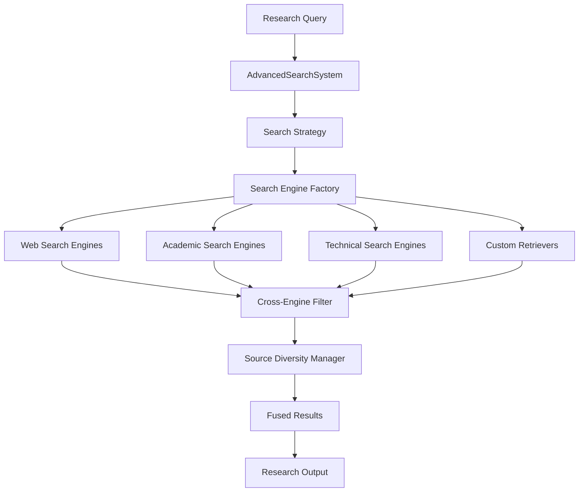
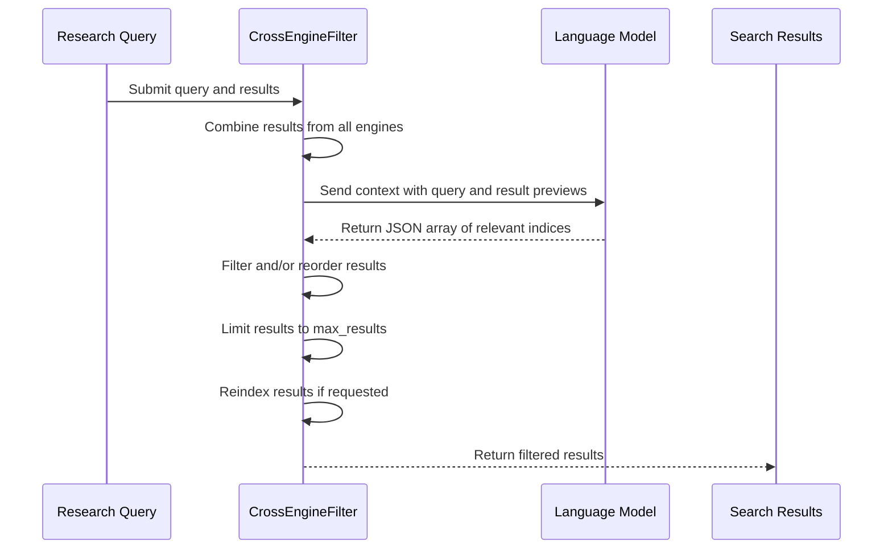
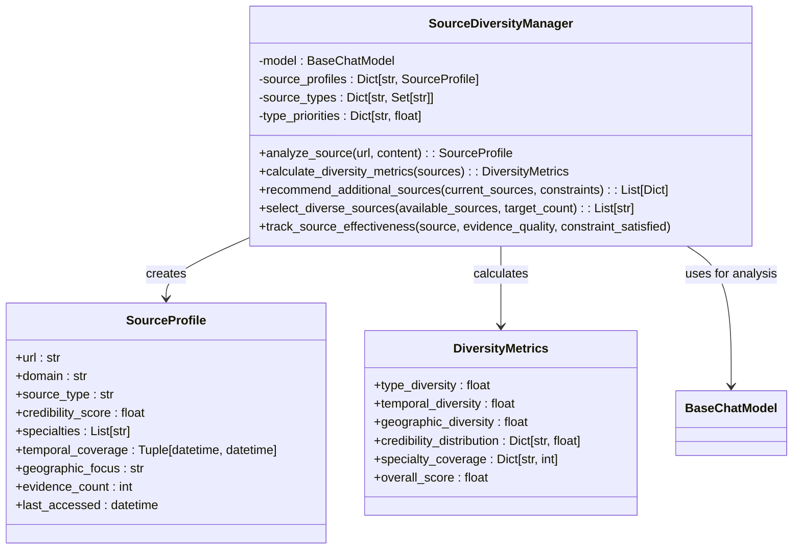
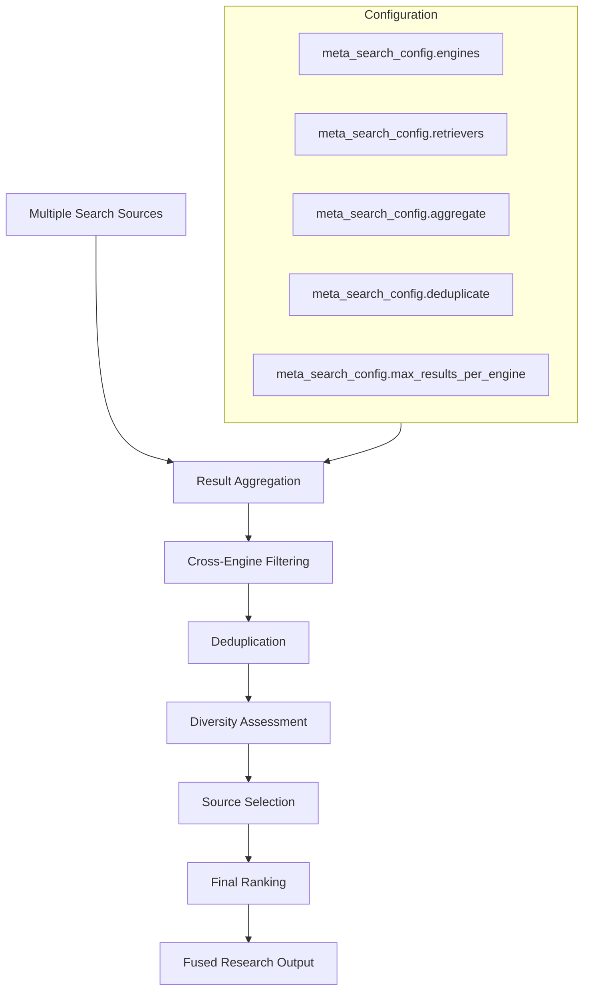
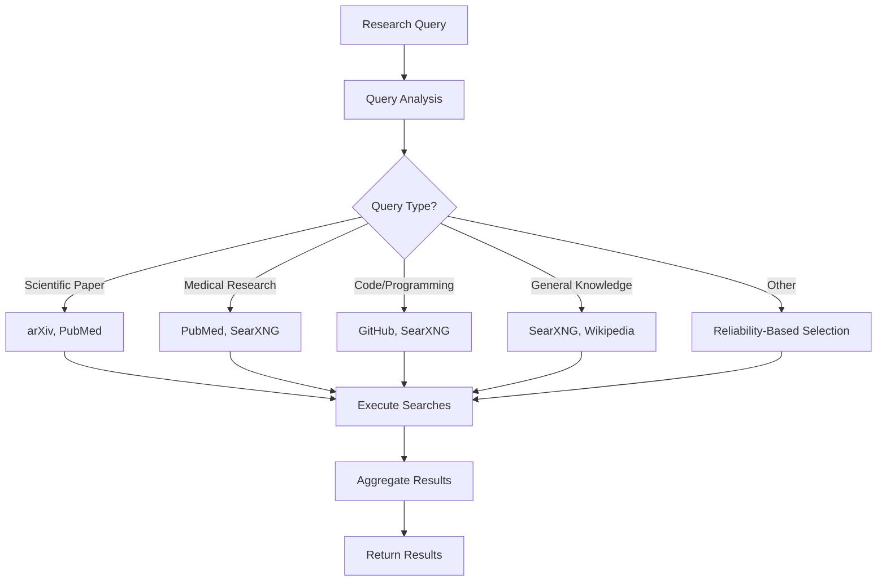

# Hybrid Search

<cite>
**Referenced Files in This Document**   
- [hybrid_search_example.py](file://examples/api_usage/programmatic/hybrid_search_example.py)
- [diversity_manager.py](file://src/local_deep_research/advanced_search_system/source_management/diversity_manager.py)
- [cross_engine_filter.py](file://src/local_deep_research/advanced_search_system/filters/cross_engine_filter.py)
- [search_system.py](file://src/local_deep_research/search_system.py)
- [meta_search_engine.py](file://src/local_deep_research/web_search_engines/engines/meta_search_engine.py)
- [search_engine_factory.py](file://src/local_deep_research/web_search_engines/search_engine_factory.py)
- [retriever_registry.py](file://src/local_deep_research/web_search_engines/retriever_registry.py)
</cite>

## Table of Contents
1. [Introduction](#introduction)
2. [Hybrid Search Architecture](#hybrid-search-architecture)
3. [Cross-Engine Filtering](#cross-engine-filtering)
4. [Source Diversity Management](#source-diversity-management)
5. [Result Fusion Algorithms](#result-fusion-algorithms)
6. [Search Engine Orchestration](#search-engine-orchestration)
7. [Configuration and Integration](#configuration-and-integration)
8. [Performance Considerations](#performance-considerations)
9. [Best Practices](#best-practices)
10. [Conclusion](#conclusion)

## Introduction

The local-deep-research system implements a sophisticated hybrid search capability that combines multiple search engines and data sources to provide comprehensive research results. This documentation details the implementation of cross-engine filtering, source diversity management, and result fusion algorithms that enable the system to orchestrate various search sources effectively.

The hybrid search system is designed to combine internal knowledge bases with external search engines, providing both specific proprietary information and general contextual knowledge. The system supports various search engines including academic (arXiv, PubMed), web (SearXNG, DuckDuckGo), technical (GitHub), and news sources, allowing researchers to gather information from diverse domains.

**Section sources**
- [hybrid_search_example.py](file://examples/api_usage/programmatic/hybrid_search_example.py#L1-L404)

## Hybrid Search Architecture

The hybrid search architecture in local-deep-research is built around a modular design that separates search engine management, result filtering, and source diversity components. The system uses a strategy pattern to coordinate different search approaches, with the AdvancedSearchSystem class serving as the central orchestrator.

The architecture consists of three main components:
1. **Search Engine Factory**: Creates and manages instances of different search engines
2. **Result Processing Pipeline**: Filters and ranks results from multiple sources
3. **Source Management System**: Ensures diversity and quality of information sources

The system supports both synchronous and asynchronous search operations, allowing for efficient resource utilization when combining fast web searches with slower academic database queries.



**Diagram sources **
- [search_system.py](file://src/local_deep_research/search_system.py#L20-L377)
- [search_engine_factory.py](file://src/local_deep_research/web_search_engines/search_engine_factory.py#L13-L619)

**Section sources**
- [search_system.py](file://src/local_deep_research/search_system.py#L20-L377)

## Cross-Engine Filtering

The cross-engine filtering system is implemented in the CrossEngineFilter class, which ranks and filters search results from multiple engines based on relevance to the query. This component plays a crucial role in the hybrid search workflow by eliminating redundant or irrelevant results while preserving diverse perspectives.

The filter uses a language model to assess the relevance of search results, creating a ranked list of indices that represent the most relevant results. The filtering process includes several key features:

- **Relevance Assessment**: Uses an LLM to evaluate result relevance to the query
- **Deduplication**: Identifies and removes duplicate content across sources
- **Result Limiting**: Enforces maximum result count based on configuration
- **Index Reassignment**: Updates result indices after filtering for consistent presentation

The filter can operate in two modes: reordering (results are ranked by relevance) and filtering (only relevant results are kept in original order). This flexibility allows the system to balance between presenting the most relevant information first and maintaining the original search engine's ranking.



**Diagram sources **
- [cross_engine_filter.py](file://src/local_deep_research/advanced_search_system/filters/cross_engine_filter.py#L14-L227)

**Section sources**
- [cross_engine_filter.py](file://src/local_deep_research/advanced_search_system/filters/cross_engine_filter.py#L14-L227)

## Source Diversity Management

The SourceDiversityManager class implements a comprehensive system for managing source diversity to ensure high-quality evidence collection. This component tracks source characteristics and ensures a balanced selection of information from different types, temporal periods, and geographic regions.

Key features of the source diversity management system include:

- **Source Profiling**: Creates detailed profiles for each source including type, credibility, specialties, and temporal coverage
- **Diversity Metrics**: Calculates type, temporal, and geographic diversity scores
- **Gap Analysis**: Identifies missing source types or coverage gaps
- **Recommendation Engine**: Suggests additional sources to improve diversity

The system assigns credibility scores to sources based on their type, domain characteristics, and content features. Academic and government sources receive higher base scores, which are further adjusted based on HTTPS usage, citation presence, and author information.



**Diagram sources **
- [diversity_manager.py](file://src/local_deep_research/advanced_search_system/source_management/diversity_manager.py#L16-L614)

**Section sources**
- [diversity_manager.py](file://src/local_deep_research/advanced_search_system/source_management/diversity_manager.py#L16-L614)

## Result Fusion Algorithms

The result fusion algorithms in the local-deep-research system combine information from multiple sources to create comprehensive research outputs. The fusion process occurs at multiple levels, from initial result aggregation to final synthesis.

The primary fusion mechanism is implemented through the meta search configuration, which allows for sophisticated combination of search results. Key fusion strategies include:

- **Aggregation**: Combines results from multiple search engines and retrievers
- **Deduplication**: Removes duplicate content across sources
- **Ranking**: Ranks results by relevance using LLM assessment
- **Weighting**: Applies different weights to sources based on credibility and relevance

The system uses a multi-stage fusion process:
1. Initial aggregation of results from all configured sources
2. Cross-engine filtering to remove irrelevant or low-quality results
3. Diversity-based selection to ensure balanced source representation
4. Final ranking and presentation of results



**Diagram sources **
- [hybrid_search_example.py](file://examples/api_usage/programmatic/hybrid_search_example.py#L333-L350)
- [meta_search_engine.py](file://src/local_deep_research/web_search_engines/engines/meta_search_engine.py#L12-L534)

**Section sources**
- [hybrid_search_example.py](file://examples/api_usage/programmatic/hybrid_search_example.py#L333-L350)

## Search Engine Orchestration

The search engine orchestration system in local-deep-research coordinates multiple search engines and data sources within hybrid search workflows. The MetaSearchEngine class serves as the primary orchestrator, intelligently selecting and using appropriate search engines based on query analysis.

The orchestration process follows these steps:
1. Query analysis to determine the nature of the research topic
2. Engine selection based on query type and available sources
3. Sequential or parallel execution of searches
4. Results aggregation and filtering

The system supports various search engine types:
- **Academic**: arXiv, PubMed, Semantic Scholar
- **Web**: SearXNG, DuckDuckGo, Brave
- **Technical**: GitHub, Elasticsearch
- **News**: Wikinews, The Guardian
- **Specialized**: NASA ADS, OpenAlex

The MetaSearchEngine analyzes queries to determine the most appropriate search engines, with specialized heuristics for different query types. For example, queries containing "arxiv" prioritize the arXiv engine, while medical research queries prioritize PubMed.



**Diagram sources **
- [meta_search_engine.py](file://src/local_deep_research/web_search_engines/engines/meta_search_engine.py#L12-L534)

**Section sources**
- [meta_search_engine.py](file://src/local_deep_research/web_search_engines/engines/meta_search_engine.py#L12-L534)

## Configuration and Integration

The hybrid search system provides flexible configuration options for integrating multiple search sources. The configuration is managed through settings snapshots and meta search configurations, allowing for fine-grained control over the search process.

Key configuration parameters include:
- **Search engines**: List of engines to use (e.g., "wikipedia", "arxiv")
- **Retrievers**: Custom retrievers for internal knowledge bases
- **Aggregation**: Whether to combine results from multiple sources
- **Deduplication**: Whether to remove duplicate content
- **Result limits**: Maximum results per engine and overall

The system integrates with LangChain retrievers through the retriever registry, allowing custom knowledge bases to be used alongside web search engines. This integration enables hybrid searches that combine proprietary information with public knowledge.

```mermaid
flowchart TD
A[Configuration] --> B[Settings Snapshot]
A --> C[Meta Search Config]
B --> D[search.tool: "meta"]
C --> E[retrievers: ["tech_docs"]]
C --> F[engines: ["wikipedia", "arxiv"]]
C --> G[aggregate: true]
C --> H[deduplicate: true]
C --> I[max_results_per_engine: 5]
D --> J[AdvancedSearchSystem]
E --> J
F --> J
G --> J
H --> J
I --> J
J --> K[Hybrid Search Results]
```

**Section sources**
- [hybrid_search_example.py](file://examples/api_usage/programmatic/hybrid_search_example.py#L333-L350)
- [retriever_registry.py](file://src/local_deep_research/web_search_engines/retriever_registry.py#L12-L110)

## Performance Considerations

The hybrid search system addresses performance challenges when combining synchronous and asynchronous search sources through several optimization strategies:

- **Parallel Execution**: Multiple search engines can be queried simultaneously
- **Caching**: Search engine instances are cached to avoid repeated initialization
- **Fallback Mechanisms**: If primary engines fail, the system uses fallback engines
- **Rate Limiting**: Respects rate limits of individual search engines

The system handles the performance implications of LLM-based filtering by:
- Limiting the context length sent to the LLM
- Setting reasonable limits on the number of results processed
- Using efficient data structures for result storage and manipulation

For synchronous sources, the system uses direct API calls, while asynchronous sources are handled through background tasks. This hybrid approach ensures responsiveness while maintaining comprehensive search coverage.

**Section sources**
- [meta_search_engine.py](file://src/local_deep_research/web_search_engines/engines/meta_search_engine.py#L12-L534)
- [search_engine_factory.py](file://src/local_deep_research/web_search_engines/search_engine_factory.py#L13-L619)

## Best Practices

Based on the implementation and examples in the codebase, the following best practices are recommended for configuring hybrid search:

1. **Name retrievers descriptively**: Use clear names for custom retrievers to facilitate tracking and analysis
2. **Balance internal and external sources**: Combine proprietary knowledge with public information for comprehensive results
3. **Use source analysis**: Track and analyze sources to verify information consistency and identify gaps
4. **Configure meta search appropriately**: Set aggregation, deduplication, and result limits based on research needs
5. **Monitor diversity metrics**: Ensure source diversity to prevent bias and improve evidence quality
6. **Set appropriate result limits**: Balance comprehensiveness with performance by limiting results per engine
7. **Use specialized engines for domain-specific queries**: Leverage academic, technical, and news engines for relevant topics

The hybrid_search_example.py file demonstrates these best practices through concrete examples of configuring multiple search sources and analyzing the resulting information.

**Section sources**
- [hybrid_search_example.py](file://examples/api_usage/programmatic/hybrid_search_example.py#L387-L397)

## Conclusion

The hybrid search capabilities in the local-deep-research system provide a powerful framework for combining multiple search engines and data sources. Through sophisticated cross-engine filtering, source diversity management, and result fusion algorithms, the system delivers comprehensive and balanced research results.

The architecture enables seamless integration of internal knowledge bases with external search engines, allowing researchers to leverage both proprietary information and public knowledge. The system's flexibility in configuring search workflows makes it suitable for various research domains and information needs.

By following the best practices outlined in this documentation, users can effectively configure hybrid search to meet their specific research requirements, ensuring high-quality, diverse, and reliable information gathering.