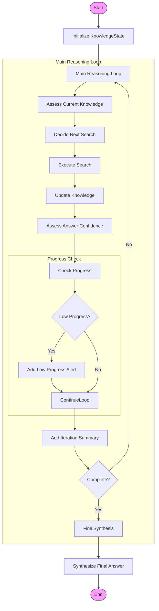
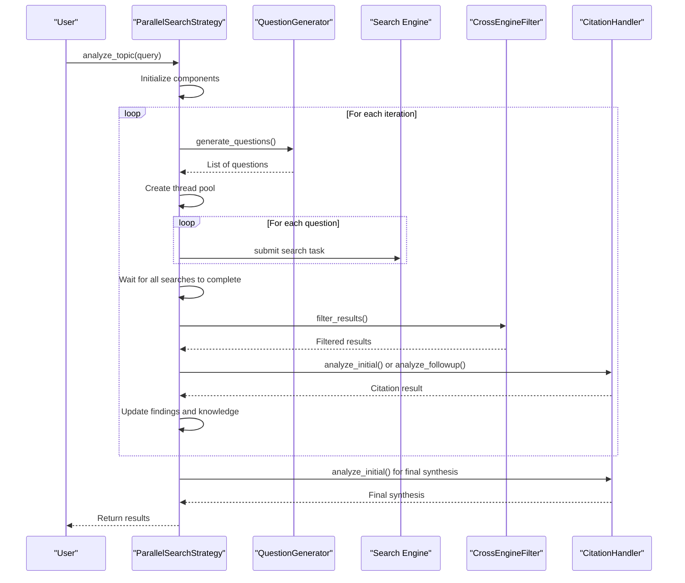
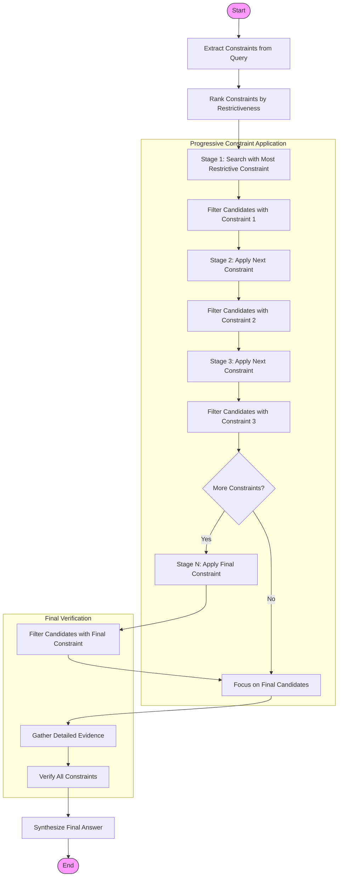
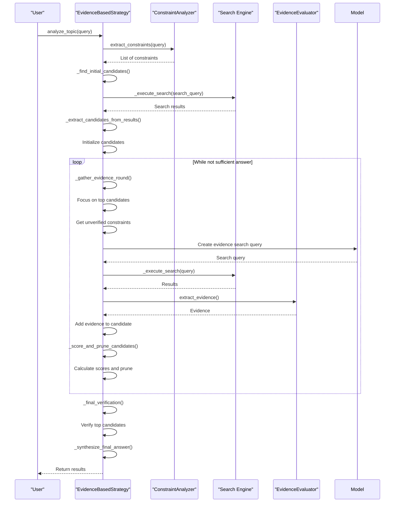

# Search Strategies

<cite>
**Referenced Files in This Document**   
- [adaptive_decomposition_strategy.py](file://src/local_deep_research/advanced_search_system/strategies/adaptive_decomposition_strategy.py)
- [base_strategy.py](file://src/local_deep_research/advanced_search_system/strategies/base_strategy.py)
- [constrained_search_strategy.py](file://src/local_deep_research/advanced_search_system/strategies/constrained_search_strategy.py)
- [evidence_based_strategy.py](file://src/local_deep_research/advanced_search_system/strategies/evidence_based_strategy.py)
- [iterative_reasoning_strategy.py](file://src/local_deep_research/advanced_search_system/strategies/iterative_reasoning_strategy.py)
- [parallel_search_strategy.py](file://src/local_deep_research/advanced_search_system/strategies/parallel_search_strategy.py)
- [search_strategies_example.py](file://examples/api_usage/programmatic/search_strategies_example.py)
</cite>

## Table of Contents
1. [Introduction](#introduction)
2. [Core Strategy Classes](#core-strategy-classes)
3. [Adaptive Decomposition Strategy](#adaptive-decomposition-strategy)
4. [Iterative Reasoning Strategy](#iterative-reasoning-strategy)
5. [Parallel Search Strategy](#parallel-search-strategy)
6. [Constrained Search Strategy](#constrained-search-strategy)
7. [Evidence-Based Strategy](#evidence-based-strategy)
8. [Strategy Selection and Performance](#strategy-selection-and-performance)
9. [Integration of Constraint Checking and Verification](#integration-of-constraint-checking-and-verification)
10. [Conclusion](#conclusion)

## Introduction
The local-deep-research system employs a sophisticated suite of search strategies designed to handle complex research queries through advanced reasoning, decomposition, and evidence-based analysis. These strategies are implemented as specialized classes that inherit from a common base class, each providing unique approaches to query resolution. The system supports multiple strategies including Adaptive Decomposition, Iterative Reasoning, Parallel Search, Constrained Search, and Evidence-Based approaches, each optimized for different types of research problems. These strategies integrate constraint checking, verification loops, and confidence scoring to ensure accurate and reliable results. The implementation leverages language models for dynamic decision-making, parallel processing for efficiency, and systematic evidence gathering for comprehensive analysis.

**Section sources**
- [base_strategy.py](file://src/local_deep_research/advanced_search_system/strategies/base_strategy.py#L1-L227)

## Core Strategy Classes
The search strategy system is built on an object-oriented architecture with a hierarchical class structure. At the foundation is the `BaseSearchStrategy` class, which defines the common interface and shared functionality for all search strategies. This abstract base class implements the core methods and properties that are inherited by all specialized strategy classes. The base class handles progress callbacks, setting management, and provides utility methods for progress updates and error handling. All concrete strategy classes inherit from this base class, implementing the abstract `analyze_topic` method with their specific approach to research. The strategy classes are organized in the strategies package and can be imported through the package's `__init__.py` file, which exposes all strategy classes through the `__all__` list for easy access.

```mermaid
classDiagram
class BaseSearchStrategy {
+__init__(all_links_of_system, settings_snapshot, questions_by_iteration, search_original_query)
+get_setting(key, default)
+set_progress_callback(callback)
+_update_progress(message, progress_percent, metadata)
+analyze_topic(query) Abstract
+_validate_search_engine() boolean
+_handle_search_error(error, question, progress_base) List
+_handle_analysis_error(error, question, progress_base) void
+_emit_question_generation_progress(iteration, progress_percent, source_count, query) void
+_emit_searching_progress(iteration, questions, progress_percent) void
}
class AdaptiveDecompositionStrategy {
+__init__(model, search, all_links_of_system, max_steps, min_confidence, source_search_iterations, source_questions_per_iteration)
+analyze_topic(query) Dict
+_decide_next_step(query, step_count) StepResult
+_execute_step(step, query) StepResult
+_extract_constraints(query) StepResult
+_perform_initial_search(description) StepResult
+_verify_candidates(description) StepResult
+_refine_search(description) StepResult
+_synthesize_current_knowledge(query) StepResult
+_synthesize_findings(query) Dict
}
class IterativeReasoningStrategy {
+__init__(model, search, all_links_of_system, max_iterations, confidence_threshold, search_iterations_per_round, questions_per_search)
+analyze_topic(query) Dict
+_decide_next_search() Optional[str]
+_execute_search(search_query) Dict
+_update_knowledge(search_results) void
+_assess_answer() void
+_synthesize_final_answer() Dict
}
class ParallelSearchStrategy {
+__init__(search, model, citation_handler, include_text_content, use_cross_engine_filter, filter_reorder, filter_reindex, cross_engine_max_results, all_links_of_system, settings_snapshot)
+analyze_topic(query) Dict
}
class ConstrainedSearchStrategy {
+__init__(model, search, all_links_of_system, max_iterations, confidence_threshold, candidate_limit, evidence_threshold, max_search_iterations, questions_per_iteration, min_candidates_per_stage, settings_snapshot)
+analyze_topic(query) Dict
+_rank_constraints_by_restrictiveness() List[Constraint]
+_progressive_constraint_search() void
+_search_with_single_constraint(constraint) List[Candidate]
+_filter_candidates_with_constraint(candidates, constraint) List[Candidate]
+_extract_relevant_candidates(results, constraint) List[Candidate]
+_quick_evidence_check(results, candidate, constraint) Evidence
+_focused_evidence_gathering() void
}
class EvidenceBasedStrategy {
+__init__(model, search, all_links_of_system, max_iterations, confidence_threshold, candidate_limit, evidence_threshold, max_search_iterations, questions_per_iteration, settings_snapshot)
+analyze_topic(query) Dict
+_find_initial_candidates() void
+_gather_evidence_round() void
+_score_and_prune_candidates() void
+_has_sufficient_answer() boolean
+_final_verification() void
+_execute_search(search_query) Dict
+_create_candidate_search_query(constraints) str
+_get_distinctive_constraints() List[Constraint]
+_extract_candidates_from_results(results, search_query) List[Candidate]
+_find_additional_candidates() void
}
BaseSearchStrategy <|-- AdaptiveDecompositionStrategy
BaseSearchStrategy <|-- IterativeReasoningStrategy
BaseSearchStrategy <|-- ParallelSearchStrategy
BaseSearchStrategy <|-- ConstrainedSearchStrategy
BaseSearchStrategy <|-- EvidenceBasedStrategy
```



**Diagram sources **   
- [base_strategy.py](file://src/local_deep_research/advanced_search_system/strategies/base_strategy.py#L12-L227)
- [adaptive_decomposition_strategy.py](file://src/local_deep_research/advanced_search_system/strategies/adaptive_decomposition_strategy.py#L43-L565)
- [iterative_reasoning_strategy.py](file://src/local_deep_research/advanced_search_system/strategies/iterative_reasoning_strategy.py#L58-L761)
- [parallel_search_strategy.py](file://src/local_deep_research/advanced_search_system/strategies/parallel_search_strategy.py#L20-L471)
- [constrained_search_strategy.py](file://src/local_deep_research/advanced_search_system/strategies/constrained_search_strategy.py#L24-L1347)
- [evidence_based_strategy.py](file://src/local_deep_research/advanced_search_system/strategies/evidence_based_strategy.py#L24-L1250)

**Section sources**
- [base_strategy.py](file://src/local_deep_research/advanced_search_system/strategies/base_strategy.py#L12-L227)
- [adaptive_decomposition_strategy.py](file://src/local_deep_research/advanced_search_system/strategies/adaptive_decomposition_strategy.py#L43-L565)
- [iterative_reasoning_strategy.py](file://src/local_deep_research/advanced_search_system/strategies/iterative_reasoning_strategy.py#L58-L761)
- [parallel_search_strategy.py](file://src/local_deep_research/advanced_search_system/strategies/parallel_search_strategy.py#L20-L471)
- [constrained_search_strategy.py](file://src/local_deep_research/advanced_search_system/strategies/constrained_search_strategy.py#L24-L1347)
- [evidence_based_strategy.py](file://src/local_deep_research/advanced_search_system/strategies/evidence_based_strategy.py#L24-L1250)

## Adaptive Decomposition Strategy
The Adaptive Decomposition Strategy implements a step-by-step approach to query analysis that dynamically adapts based on intermediate findings. Unlike traditional decomposition methods that break down the entire query upfront, this strategy takes an iterative approach, making decisions at each step based on the knowledge accumulated so far. The strategy begins by extracting constraints from the query, then performs an initial search to identify candidate locations, verifies specific facts about these candidates, refines the search based on new information, and finally synthesizes all findings into a comprehensive answer. Each step in the process is represented by a `StepResult` object that contains the step type, description, findings, next action, and confidence level. The strategy uses a language model to decide the next best action based on the current knowledge state, allowing it to adapt its approach dynamically throughout the research process.

```mermaid
sequenceDiagram
participant User as "User"
participant Strategy as "AdaptiveDecompositionStrategy"
participant Model as "Language Model"
participant Search as "Search Engine"
User->>Strategy : analyze_topic(query)
Strategy->>Strategy : Initialize working knowledge
loop For each step until max_steps or confident answer
Strategy->>Model : _decide_next_step(query, step_count)
Model-->>Strategy : Next step decision
alt Constraint Extraction
Strategy->>Strategy : _extract_constraints(query)
Strategy->>Strategy : Update constraints in working knowledge
else Initial Search
Strategy->>Strategy : _perform_initial_search(description)
Strategy->>Search : Execute search with SourceBasedStrategy
Search-->>Strategy : Search results
Strategy->>Strategy : Extract candidates from results
else Verification
Strategy->>Strategy : _verify_candidates(description)
Strategy->>Search : Execute targeted search
Search-->>Strategy : Search results
Strategy->>Strategy : Extract verified facts
else Refinement
Strategy->>Strategy : _refine_search(description)
Strategy->>Search : Execute refined search
Search-->>Strategy : Search results
else Synthesis
Strategy->>Strategy : _synthesize_current_knowledge(query)
Strategy->>Model : Generate final answer
Model-->>Strategy : Synthesized answer
end
Strategy->>Strategy : Update step_results and confidence
alt Confidence >= min_confidence
break
end
end
Strategy->>Strategy : _synthesize_findings(query)
Strategy-->>User : Return final results
```

**Diagram sources **   
- [adaptive_decomposition_strategy.py](file://src/local_deep_research/advanced_search_system/strategies/adaptive_decomposition_strategy.py#L43-L565)

**Section sources**
- [adaptive_decomposition_strategy.py](file://src/local_deep_research/advanced_search_system/strategies/adaptive_decomposition_strategy.py#L43-L565)

## Iterative Reasoning Strategy
The Iterative Reasoning Strategy employs a persistent knowledge base and follows a systematic loop of analysis, decision-making, searching, and knowledge updating. This strategy maintains a `KnowledgeState` object that tracks the original query, key facts, uncertainties, search history, candidate answers, confidence level, and current iteration. The process begins with an initial analysis of the query, followed by a main reasoning loop that continues until either the maximum number of iterations is reached or sufficient confidence in the answer is achieved. In each iteration, the strategy assesses the current knowledge state, decides what to search for next, executes the search using the source-based strategy, updates the knowledge with new findings, and assesses the answer's confidence. The confidence assessment considers multiple factors including the number of key facts discovered, the number of uncertainties remaining, the search history, and the number of candidate answers. The strategy uses a language model to decide the next search query based on the current knowledge state, allowing it to adapt its approach dynamically throughout the research process.



**Diagram sources **   
- [iterative_reasoning_strategy.py](file://src/local_deep_research/advanced_search_system/strategies/iterative_reasoning_strategy.py#L58-L761)

**Section sources**
- [iterative_reasoning_strategy.py](file://src/local_deep_research/advanced_search_system/strategies/iterative_reasoning_strategy.py#L58-L761)

## Parallel Search Strategy
The Parallel Search Strategy is designed for maximum search speed by generating questions and running all searches simultaneously. This strategy implements a multi-iteration approach where each iteration consists of three main phases: question generation, parallel search execution, and result analysis. In the first iteration, the strategy generates initial search questions based on the original query and executes all searches in parallel using a thread pool executor. In subsequent iterations, it generates follow-up questions based on the accumulated knowledge from previous iterations. The strategy uses a cross-engine filter to consolidate and rank results from multiple search engines, applying relevance reordering and reindexing as needed. For each iteration, the strategy emits progress updates indicating the current phase (question generation, parallel search, or analysis). The results from all iterations are combined, and a final synthesis is generated from the aggregated search results. This approach significantly reduces research time by eliminating the sequential dependencies between individual searches.



**Diagram sources **   
- [parallel_search_strategy.py](file://src/local_deep_research/advanced_search_system/strategies/parallel_search_strategy.py#L20-L471)

**Section sources**
- [parallel_search_strategy.py](file://src/local_deep_research/advanced_search_system/strategies/parallel_search_strategy.py#L20-L471)

## Constrained Search Strategy
The Constrained Search Strategy implements a progressive narrowing approach that systematically reduces the candidate pool by applying constraints in order of restrictiveness. This strategy begins by extracting and ranking constraints from the query based on their restrictiveness, with statistical and temporal constraints typically ranked higher than property constraints. The search process proceeds in stages, with each stage applying an additional constraint to further filter the candidate pool. In the first stage, the strategy searches for candidates that match the most restrictive constraint. In subsequent stages, it filters the existing candidates using additional constraints, progressively narrowing down the pool. The strategy uses a quick evidence check to determine if a candidate satisfies a constraint, calculating confidence based on name presence, constraint presence, co-occurrence proximity, and context quality. For the final candidates, the strategy performs focused evidence gathering to verify all constraints in detail. This approach mimics human problem-solving by starting with the most specific criteria and gradually adding more general constraints.



**Diagram sources **   
- [constrained_search_strategy.py](file://src/local_deep_research/advanced_search_system/strategies/constrained_search_strategy.py#L24-L1347)

**Section sources**
- [constrained_search_strategy.py](file://src/local_deep_research/advanced_search_system/strategies/constrained_search_strategy.py#L24-L1347)

## Evidence-Based Strategy
The Evidence-Based Strategy systematically decomposes queries into verifiable constraints, finds potential candidates, and gathers specific evidence to score each candidate. The process begins with constraint extraction, where the query is analyzed to identify specific, testable constraints such as statistics, events, locations, and properties. The strategy then searches for initial candidates that might satisfy the most distinctive constraints, using an LLM to create effective search queries that surface specific named entities. Once candidates are identified, the strategy enters a main evidence-gathering loop where it collects evidence for each candidate-constraint pair, scores candidates based on evidence quality, and prunes low-scoring candidates. The evidence gathering focuses on the most important unverified constraints for the top candidates, ensuring efficient use of search resources. The strategy continues this process until it has a sufficiently confident answer, defined as a top candidate with high score that has evidence for all critical constraints. A final verification phase performs additional searches to strengthen weak evidence or address missing critical constraints before generating the final answer.



**Diagram sources **   
- [evidence_based_strategy.py](file://src/local_deep_research/advanced_search_system/strategies/evidence_based_strategy.py#L24-L1250)

**Section sources**
- [evidence_based_strategy.py](file://src/local_deep_research/advanced_search_system/strategies/evidence_based_strategy.py#L24-L1250)

## Strategy Selection and Performance
The selection of appropriate search strategies depends on the query complexity and domain characteristics. The system provides multiple strategies optimized for different research scenarios, each with distinct performance characteristics. The Adaptive Decomposition Strategy is best suited for complex queries that require step-by-step analysis and dynamic adaptation based on intermediate findings. The Iterative Reasoning Strategy excels in deep exploratory research where knowledge accumulates over multiple iterations, making it ideal for complex topics requiring progressive refinement. The Parallel Search Strategy offers the fastest execution time by running searches concurrently, making it optimal for time-sensitive research or when comprehensive coverage is needed quickly. The Constrained Search Strategy is particularly effective for queries with multiple specific constraints, as it systematically narrows down candidates in a logical progression. The Evidence-Based Strategy provides the most thorough analysis, making it suitable for high-stakes research requiring rigorous verification.

Performance comparisons indicate that the Parallel Search Strategy typically completes research in the shortest time due to its concurrent execution model, while the Evidence-Based Strategy may take longer but provides the most comprehensive analysis with detailed evidence scoring. The choice of strategy should consider factors such as the required depth of analysis, time constraints, query specificity, and the need for source verification. For queries with clear, testable constraints, the Constrained or Evidence-Based strategies are recommended. For exploratory research with evolving questions, the Iterative Reasoning or Adaptive Decomposition strategies are more appropriate. The Parallel Search Strategy is ideal when speed is paramount and the research scope is well-defined.

**Section sources**
- [search_strategies_example.py](file://examples/api_usage/programmatic/search_strategies_example.py#L1-L226)

## Integration of Constraint Checking and Verification
The search strategies integrate constraint checking and verification loops through a sophisticated system of evidence analysis and confidence scoring. The Constraint Checking system, located in the constraint_checking module, provides specialized checkers that evaluate candidates against constraints using dual confidence scoring (positive/negative/uncertainty). The DualConfidenceChecker analyzes evidence to determine not only if a constraint is satisfied but also if there is evidence that it is not satisfied, providing a more nuanced assessment. This approach allows the system to make better rejection decisions and avoid false positives. The verification process is implemented as a loop that continues until sufficient confidence is achieved or the maximum number of iterations is reached. During each iteration, the system gathers additional evidence for the most critical unsatisfied constraints, updates the confidence scores, and reassesses the candidate rankings. The integration of constraint checking is seamless across strategies, with each strategy leveraging the constraint checking system to validate findings and ensure answer accuracy. The system also includes early stopping mechanisms that terminate the research process when a candidate reaches the confidence threshold, optimizing resource usage.

**Section sources**
- [constraint_checker.py](file://src/local_deep_research/advanced_search_system/constraint_checking/constraint_checker.py#L76-L180)
- [dual_confidence_checker.py](file://src/local_deep_research/advanced_search_system/constraint_checking/dual_confidence_checker.py#L1-L42)
- [dual_confidence_strategy.py](file://src/local_deep_research/advanced_search_system/strategies/dual_confidence_strategy.py#L1-L324)

## Conclusion
The local-deep-research system's search strategies provide a comprehensive framework for advanced research capabilities, offering multiple approaches to query resolution that balance speed, depth, and accuracy. The Adaptive Decomposition Strategy enables dynamic, step-by-step analysis that adapts to intermediate findings, while the Iterative Reasoning Strategy maintains persistent knowledge across multiple reasoning iterations. The Parallel Search Strategy maximizes efficiency through concurrent execution, and the Constrained Search Strategy systematically narrows down candidates using progressively applied constraints. The Evidence-Based Strategy provides the most rigorous analysis, decomposing queries into verifiable constraints and systematically gathering evidence to score candidates. These strategies are integrated with sophisticated constraint checking and verification systems that use dual confidence scoring to ensure answer accuracy. The choice of strategy depends on the specific research requirements, with different strategies optimized for various query types and performance needs. Together, these strategies form a powerful research engine capable of handling complex queries with sophisticated reasoning and evidence-based validation.