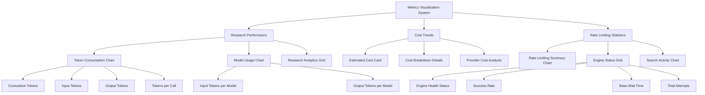
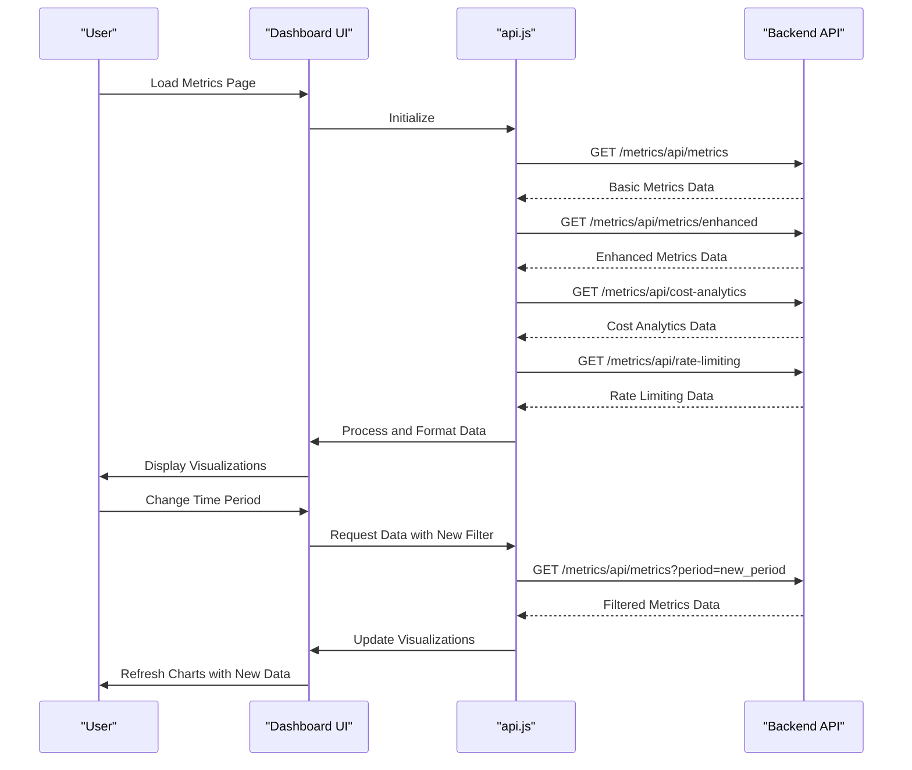
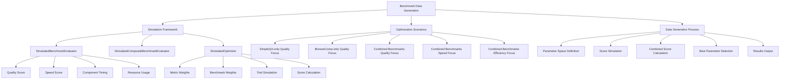

# Analytics Dashboard Interface

<cite>
**Referenced Files in This Document**   
- [metrics.html](file://src/local_deep_research/web/templates/pages/metrics.html)
- [api.js](file://src/local_deep_research/web/static/js/services/api.js)
- [multi_benchmark_speed_demo.py](file://examples/optimization/multi_benchmark_speed_demo.py)
- [analytics-dashboard.md](file://docs/analytics-dashboard.md)
- [metrics_routes.py](file://src/local_deep_research/web/routes/metrics_routes.py)
</cite>

## Table of Contents
1. [Introduction](#introduction)
2. [Dashboard Structure](#dashboard-structure)
3. [Metrics Visualization System](#metrics-visualization-system)
4. [Data Retrieval and Real-time Updates](#data-retrieval-and-real-time-updates)
5. [Benchmark Data Generation](#benchmark-data-generation)
6. [User Interaction and Controls](#user-interaction-and-controls)
7. [Data Export Functionality](#data-export-functionality)
8. [Troubleshooting Common Issues](#troubleshooting-common-issues)
9. [Conclusion](#conclusion)

## Introduction

The Analytics Dashboard Interface provides comprehensive insights into research performance, cost trends, and rate limiting statistics for the Local Deep Research system. This documentation guides users through navigating and interpreting the metrics visualization system, covering the structure of the metrics.html interface, data retrieval mechanisms via api.js, benchmark data generation using multi_benchmark_speed_demo.py, and practical guidance for using filter controls, interpreting time-series graphs, and exporting analytics data.

The dashboard serves as a central hub for monitoring system performance, tracking resource usage, and optimizing research workflows. It offers real-time visualization of key metrics including token consumption, research activity, cost analytics, and search engine performance, enabling users to make data-driven decisions about their research strategies and configurations.

**Section sources**
- [analytics-dashboard.md](file://docs/analytics-dashboard.md#L1-L246)

## Dashboard Structure

The analytics dashboard is structured as a comprehensive metrics interface with multiple sections organized in a logical flow. The primary layout consists of system overview cards, detailed analytics sections, and interactive visualizations. The dashboard is accessible via the `/metrics` endpoint and provides a responsive design that adapts to different screen sizes.

The interface is built using a template-based approach with the metrics.html file extending a base template and incorporating custom CSS and JavaScript. The page structure includes a header with navigation links to related analytics pages (Star Reviews, Cost Analytics, Context Overflow, and Link Analytics), followed by filter controls for time range and research mode. The main content area is organized into several card-based sections, each focusing on a specific aspect of system performance.

Key structural components include:
- System Overview Cards displaying key metrics
- Models & Performance section with usage statistics
- Rate Limiting Analytics for monitoring search engine health
- Developer Insights for technical metrics
- Research History & Activity tracking

The dashboard employs a grid-based layout system using CSS Grid to ensure responsive design across different devices. Each metric card is designed with hover effects and expandable details to provide both high-level overviews and granular data access.

```mermaid
graph TD
A[Analytics Dashboard] --> B[Header Navigation]
A --> C[Filter Controls]
A --> D[System Overview Cards]
A --> E[Models & Performance]
A --> F[Rate Limiting Analytics]
A --> G[Developer Insights]
A --> H[Research History & Activity]
A --> I[Information Section]
B --> B1[Star Reviews]
B --> B2[Cost Analytics]
B --> B3[Context Overflow]
B --> B4[Link Analytics]
C --> C1[Time Range Selector]
C --> C2[Research Mode Filter]
D --> D1[Total Tokens Used]
D --> D2[Total Researches]
D --> D3[Avg Response Time]
D --> D4[Success Rate]
D --> D5[User Satisfaction]
D --> D6[Estimated Cost]
E --> E1[Model Usage List]
E --> E2[Token Distribution Chart]
E --> E3[Research Analytics Grid]
F --> F1[Rate Limiting Overview]
F --> F2[Engine Status Grid]
F --> F3[Rate Limiting Summary Chart]
G --> G1[Most Active Files]
G --> G2[Most Active Functions]
G --> G3[Recent Call Stack Traces]
H --> H1[Recent Researches]
H --> H2[Recent LLM Calls]
```



**Diagram sources**
- [metrics.html](file://src/local_deep_research/web/templates/pages/metrics.html#L1-L2249)

**Section sources**
- [metrics.html](file://src/local_deep_research/web/templates/pages/metrics.html#L1-L2249)

## Metrics Visualization System

The metrics visualization system in the analytics dashboard provides comprehensive insights through multiple chart types and data representations. The system tracks research performance, cost trends, and rate limiting statistics using interactive visualizations that update in real-time based on user-selected filters.

### Research Performance Metrics

The dashboard displays research performance through several key visualizations:

1. **Token Consumption Over Time**: A line chart showing cumulative token usage with multiple data series including total tokens, input tokens, and output tokens. This chart also displays individual token counts per call on a secondary y-axis, allowing users to analyze both cumulative trends and individual call patterns.

2. **Model Usage**: A bar chart that breaks down token distribution by model, with separate bars for input and output tokens. This visualization helps users identify which models are consuming the most resources and understand the balance between input and output token usage.

3. **Research Analytics Grid**: A compact grid displaying breakdowns by research mode, search engine usage, research strategies, research phases, and user satisfaction. Each section uses consistent styling with model usage items to maintain visual coherence.

### Cost Trends Visualization

Cost analytics are presented through both summary cards and detailed breakdowns:

1. **Estimated Cost Card**: Displays the total estimated cost with expandable details showing average cost per research, average cost per token, and cost breakdown by token type (input vs. output).

2. **Cost Calculation**: Costs are automatically calculated based on provider pricing, actual token usage, and model-specific rates. The system supports multiple providers including OpenAI, Anthropic, Google (Gemini), and local models (shown as $0).

### Rate Limiting Statistics

The rate limiting analytics section provides real-time monitoring of search engine performance:

1. **Rate Limiting Summary**: A bar chart comparing successful requests versus blocked requests due to rate limiting. This visualization helps users understand the impact of rate limits on their research activities.

2. **Engine Status Grid**: Displays individual cards for each search engine with health indicators (green for healthy, yellow for degraded, red for poor) based on success rates. Each card shows base wait times, success rates, total attempts, and last updated timestamps.

3. **Search Activity Over Time**: A line chart tracking search results count over time, grouped by search engine. This visualization helps identify patterns in search engine performance and usage frequency.



**Diagram sources**
- [metrics.html](file://src/local_deep_research/web/templates/pages/metrics.html#L1-L2249)
- [analytics-dashboard.md](file://docs/analytics-dashboard.md#L1-L246)

**Section sources**
- [metrics.html](file://src/local_deep_research/web/templates/pages/metrics.html#L1-L2249)
- [analytics-dashboard.md](file://docs/analytics-dashboard.md#L1-L246)

## Data Retrieval and Real-time Updates

The analytics dashboard retrieves data from the backend metrics API through the api.js service, which facilitates real-time updates and dynamic content loading. The data retrieval system is designed to provide seamless user experience with efficient API calls and responsive updates.

### API Service Architecture

The api.js file implements a comprehensive API service that handles all communication with the server endpoints. The service is structured as a modular system with specific functions for different operations:

1. **Core Functions**: The service includes generic fetchWithErrorHandling for error management, postJSON for POST requests, and getApiUrl for URL construction.

2. **Research Operations**: Functions for starting research, getting research status and details, retrieving logs, and managing research history.

3. **Configuration Management**: Functions for saving various configuration types including main configuration, search engines, collections, API keys, and LLM settings.

4. **Data Export**: Functions for retrieving markdown exports and other research outputs.

The API service uses CSRF token protection for security and includes comprehensive error handling to ensure robust communication with the backend.

### Data Loading Process

The dashboard implements a sophisticated data loading process that retrieves information from multiple endpoints:

1. **Initial Load**: When the page loads, the system fetches data from two primary endpoints:
   - `/metrics/api/metrics`: Retrieves basic metrics data
   - `/metrics/api/metrics/enhanced`: Retrieves enhanced metrics with time-series data

2. **Additional Data Endpoints**: The system also loads specialized data from:
   - `/metrics/api/cost-analytics`: Cost breakdown information
   - `/metrics/api/rate-limiting`: Rate limiting statistics
   - `/api/star-reviews`: User satisfaction ratings

3. **Real-time Updates**: The dashboard automatically refreshes data when users change time period or research mode filters, ensuring that visualizations always reflect the current selection.

### Response Handling and Error Management

The data retrieval system includes comprehensive error handling and user feedback mechanisms:

1. **Loading States**: The dashboard displays a loading spinner during data retrieval to provide visual feedback.

2. **Error States**: If API calls fail, the system displays an error message with appropriate iconography.

3. **Empty States**: When no data is available, the dashboard shows helpful messages with guidance on how to generate metrics through research activities.

4. **Data Validation**: The system validates API responses and handles cases where expected data fields are missing or null.



**Diagram sources**
- [api.js](file://src/local_deep_research/web/static/js/services/api.js#L1-L255)
- [metrics.html](file://src/local_deep_research/web/templates/pages/metrics.html#L1-L2249)
- [metrics_routes.py](file://src/local_deep_research/web/routes/metrics_routes.py#L830-L975)

**Section sources**
- [api.js](file://src/local_deep_research/web/static/js/services/api.js#L1-L255)
- [metrics.html](file://src/local_deep_research/web/templates/pages/metrics.html#L1-L2249)
- [metrics_routes.py](file://src/local_deep_research/web/routes/metrics_routes.py#L830-L975)

## Benchmark Data Generation

The multi_benchmark_speed_demo.py script provides a simulation framework for generating comparative benchmark data used in performance analysis. This script demonstrates the multi-benchmark API structure without executing actual benchmarks, allowing users to understand optimization workflows and performance trade-offs.

### Simulation Framework

The script implements a simulated benchmarking system with three main components:

1. **SimulatedBenchmarkEvaluator**: Represents individual benchmark evaluators with predefined quality and speed scores. This class simulates benchmark execution and returns consistent results for demonstration purposes.

2. **SimulatedCompositeBenchmarkEvaluator**: Combines multiple benchmarks with configurable weights, allowing users to simulate composite evaluations that consider multiple performance dimensions.

3. **SimulatedOptimizer**: Demonstrates the optimization API structure, showing how different optimization strategies (quality-focused, speed-focused, efficiency-focused) can be applied to research configurations.

### Optimization Scenarios

The script runs five demonstration scenarios that illustrate different optimization approaches:

1. **SimpleQA-only Optimization (Quality Focus)**: Uses 90% quality and 10% speed weighting to prioritize research quality over speed.

2. **BrowseComp-only Optimization (Quality Focus)**: Similar quality focus but using the BrowseComp benchmark, which has different performance characteristics.

3. **Combined Benchmarks with Quality Focus**: Combines SimpleQA and BrowseComp benchmarks with weights (60% SimpleQA, 40% BrowseComp) while maintaining a quality-focused approach.

4. **Combined Benchmarks with Speed Focus**: Uses the same benchmark combination but with speed-focused weighting (20% quality, 80% speed).

5. **Combined Benchmarks with Efficiency Focus**: Balances quality, speed, and resource usage with weights (40% quality, 30% speed, 30% resource).

### Data Generation Process

The benchmark data generation process follows these steps:

1. **Parameter Space Definition**: The script defines a parameter space with different trial configurations (iterations and search strategies).

2. **Score Simulation**: For each trial, the system simulates benchmark scores based on the trial parameters and configured weights.

3. **Combined Score Calculation**: The optimizer calculates a combined score using the configured metric weights, combining quality, speed, and resource metrics.

4. **Best Parameter Selection**: The system identifies the trial with the highest combined score as the optimal configuration.

5. **Results Output**: The script outputs detailed results including the best parameters, score, and breakdown of trial performances.

This simulation framework allows users to understand how different optimization strategies affect research outcomes without incurring actual computational costs or API usage.



**Diagram sources**
- [multi_benchmark_speed_demo.py](file://examples/optimization/multi_benchmark_speed_demo.py#L1-L282)

**Section sources**
- [multi_benchmark_speed_demo.py](file://examples/optimization/multi_benchmark_speed_demo.py#L1-L282)

## User Interaction and Controls

The analytics dashboard provides intuitive user controls for filtering, interpreting, and interacting with metrics data. These controls enable users to customize their view of the analytics and gain deeper insights into their research performance.

### Filter Controls

The dashboard includes two primary filter controls that allow users to refine the displayed data:

1. **Time Range Filter**: Located in the header, this control allows users to select different time periods for analysis:
   - 30 Days (default)
   - 7 Days
   - 3 Months
   - 1 Year
   - All Time

2. **Research Mode Filter**: Enables filtering by research mode:
   - Quick Summary
   - Detailed
   - All (default)

When users select a different filter option, the interface updates all visualizations and metrics in real-time to reflect the new selection. The active filter is highlighted with a distinct visual style to provide clear feedback.

### Interpreting Time-series Graphs

The dashboard includes several time-series graphs that require specific interpretation techniques:

1. **Token Consumption Over Time**: This line chart shows cumulative token usage with multiple data series. Users should look for:
   - Overall trends in token consumption
   - Periods of high activity
   - The relationship between cumulative tokens and individual call sizes
   - Patterns in input vs. output token usage

2. **Search Activity Over Time**: This chart tracks search results count by search engine. Users should analyze:
   - Relative performance of different search engines
   - Temporal patterns in search activity
   - Correlation between search volume and results quality
   - Engine-specific usage patterns

3. **Rate Limiting Summary**: The bar chart compares successful and blocked requests. Users should monitor:
   - The ratio of successful to blocked requests
   - Changes in this ratio over time
   - The impact of rate limiting on overall research throughput

### Interactive Elements

The dashboard includes several interactive elements that enhance user experience:

1. **Expandable Details**: Many metric cards feature expandable sections that reveal additional details when clicked. For example, the Total Tokens Used card expands to show breakdowns by input/output tokens and average usage per research.

2. **Clickable Items**: Several elements are clickable, allowing users to navigate to related content:
   - Recent research items link to detailed research views
   - Search engine status cards provide detailed information
   - Navigation buttons lead to specialized analytics pages

3. **Tooltips**: The interface uses tooltips to provide additional context for metrics. Hovering over information icons reveals detailed explanations of how metrics are calculated and what they represent.

4. **Responsive Design**: The dashboard adapts to different screen sizes, reorganizing content and adjusting chart sizes to maintain usability across devices.

**Section sources**
- [metrics.html](file://src/local_deep_research/web/templates/pages/metrics.html#L1-L2249)
- [analytics-dashboard.md](file://docs/analytics-dashboard.md#L1-L246)

## Data Export Functionality

The analytics dashboard provides comprehensive data export capabilities that allow users to access and utilize their metrics data outside the web interface. The export functionality supports multiple formats and use cases, from individual research reports to comprehensive analytics datasets.

### Research Report Export

Users can export individual research results in three formats:

1. **PDF**: Formatted reports with citations and proper styling, suitable for sharing and archiving. These reports include the complete research findings with proper formatting and reference links.

2. **Markdown**: Raw markdown output that preserves the structure and formatting of the research results. This format is ideal for integration with other documentation systems or version control.

3. **JSON**: Structured data format accessible via API, containing all research details in a machine-readable format. This enables programmatic access and integration with other tools.

### Analytics Data Export

The system provides API endpoints for accessing analytics data programmatically:

```bash
# Get overall metrics
curl http://localhost:5000/api/metrics

# Get specific research metrics
curl http://localhost:5000/api/metrics/research/<research_id>

# Get enhanced tracking data
curl http://localhost:5000/api/metrics/enhanced

# Get rating analytics
curl http://localhost:5000/api/star-reviews

# Get cost analytics
curl http://localhost:5000/api/cost-analytics

# Get rate limiting status
curl http://localhost:5000/api/rate-limiting
```

These endpoints support optional query parameters for filtering by time period and research mode, allowing users to retrieve specific subsets of data.

### Export Use Cases

The data export functionality supports several key use cases:

1. **Performance Analysis**: Exporting enhanced metrics data for detailed performance analysis using external tools like spreadsheets or data visualization software.

2. **Cost Tracking**: Retrieving cost analytics data to monitor and forecast research expenses over time.

3. **Research Archiving**: Saving research reports in PDF format for long-term storage and reference.

4. **Integration with External Systems**: Using JSON exports to integrate research data with other knowledge management or documentation systems.

5. **Benchmarking and Optimization**: Exporting benchmark data to compare different research configurations and identify optimization opportunities.

The export system ensures that all data remains private and stored locally, with no external analytics services used. Data is stored in SQLite databases on the user's device, maintaining privacy and security.

**Section sources**
- [analytics-dashboard.md](file://docs/analytics-dashboard.md#L1-L246)
- [metrics_routes.py](file://src/local_deep_research/web/routes/metrics_routes.py#L830-L975)

## Troubleshooting Common Issues

This section provides guidance for resolving common dashboard issues related to missing data, rendering problems, and performance concerns. The troubleshooting tips are organized by issue type with specific solutions and workarounds.

### Missing Data Issues

When the dashboard displays incomplete or missing data, users should consider the following solutions:

1. **No Research Data Yet**: If the dashboard shows "No research data yet" messages:
   - Complete at least one research session to generate metrics
   - Ensure the research completes successfully (not canceled or failed)
   - Wait a few moments for data to be processed and displayed

2. **Empty Cost Analytics**: If cost data is not appearing:
   - Verify that API keys are properly configured for paid LLM providers
   - Check that research has been conducted using providers with associated costs
   - Ensure the system has access to current pricing information

3. **Missing Rate Limiting Data**: If rate limiting metrics are absent:
   - Perform searches using external search engines that have rate limits
   - Wait for rate limiting events to occur naturally during research
   - Verify that the rate limiting system is properly configured

### Rendering Problems

When encountering visual or rendering issues with the dashboard:

1. **Charts Not Displaying**: If charts fail to render:
   - Refresh the page to reload Chart.js and data
   - Check browser console for JavaScript errors
   - Ensure Chart.js library is properly loaded (verify in browser developer tools)

2. **Layout Issues**: If the dashboard layout appears broken:
   - Clear browser cache and reload the page
   - Try accessing the dashboard in a different browser
   - Check for CSS loading errors in the browser console

3. **Interactive Elements Not Working**: If buttons or filters don't respond:
   - Verify JavaScript is enabled in the browser
   - Check for JavaScript errors in the console
   - Try disabling browser extensions that might interfere with script execution

### Performance and Loading Issues

For dashboard performance problems:

1. **Slow Loading**: If the dashboard takes too long to load:
   - The system may be processing a large amount of historical data
   - Try filtering to a shorter time period (e.g., 7 days instead of all time)
   - Ensure the database is not corrupted or excessively large

2. **API Connection Errors**: If API calls are failing:
   - Verify the backend server is running
   - Check network connectivity
   - Ensure the correct port and hostname are being used

3. **Data Refresh Problems**: If data doesn't update after research:
   - Manually refresh the dashboard page
   - Check that research completion triggers proper data recording
   - Verify database write permissions

### General Troubleshooting Steps

When encountering dashboard issues, follow these general steps:

1. **Refresh the Page**: Many issues can be resolved with a simple page refresh.

2. **Check Browser Console**: Open developer tools to identify JavaScript errors or network issues.

3. **Verify Server Status**: Ensure the backend server is running and accessible.

4. **Clear Cache**: Clear browser cache and cookies if layout or functionality issues persist.

5. **Test in Different Browser**: Try accessing the dashboard in an alternative browser to isolate the issue.

6. **Check Documentation**: Refer to the analytics-dashboard.md documentation for updated information and known issues.

**Section sources**
- [analytics-dashboard.md](file://docs/analytics-dashboard.md#L1-L246)
- [metrics.html](file://src/local_deep_research/web/templates/pages/metrics.html#L1-L2249)
- [metrics_routes.py](file://src/local_deep_research/web/routes/metrics_routes.py#L830-L975)

## Conclusion

The Analytics Dashboard Interface provides a comprehensive system for monitoring, analyzing, and optimizing research activities within the Local Deep Research platform. Through its integrated visualization system, the dashboard enables users to track key metrics including research performance, cost trends, and rate limiting statistics in real-time.

The interface combines an intuitive user experience with powerful data analysis capabilities, allowing users to filter data by time period and research mode, interpret complex time-series graphs, and export analytics for further analysis. The underlying architecture, built on the api.js service, ensures efficient data retrieval and responsive updates, while the multi_benchmark_speed_demo.py script provides a framework for generating comparative benchmark data to inform optimization decisions.

By leveraging the dashboard's features, users can gain valuable insights into their research patterns, identify cost drivers, optimize model selection, and improve overall research quality. The troubleshooting guidance provided helps resolve common issues related to missing data and rendering problems, ensuring a smooth user experience.

The analytics system represents a critical tool for data-driven research management, enabling users to make informed decisions about their configurations and strategies based on comprehensive performance metrics and historical trends.

**Section sources**
- [analytics-dashboard.md](file://docs/analytics-dashboard.md#L1-L246)
- [metrics.html](file://src/local_deep_research/web/templates/pages/metrics.html#L1-L2249)
- [api.js](file://src/local_deep_research/web/static/js/services/api.js#L1-L255)
- [multi_benchmark_speed_demo.py](file://examples/optimization/multi_benchmark_speed_demo.py#L1-L282)
- [metrics_routes.py](file://src/local_deep_research/web/routes/metrics_routes.py#L830-L975)