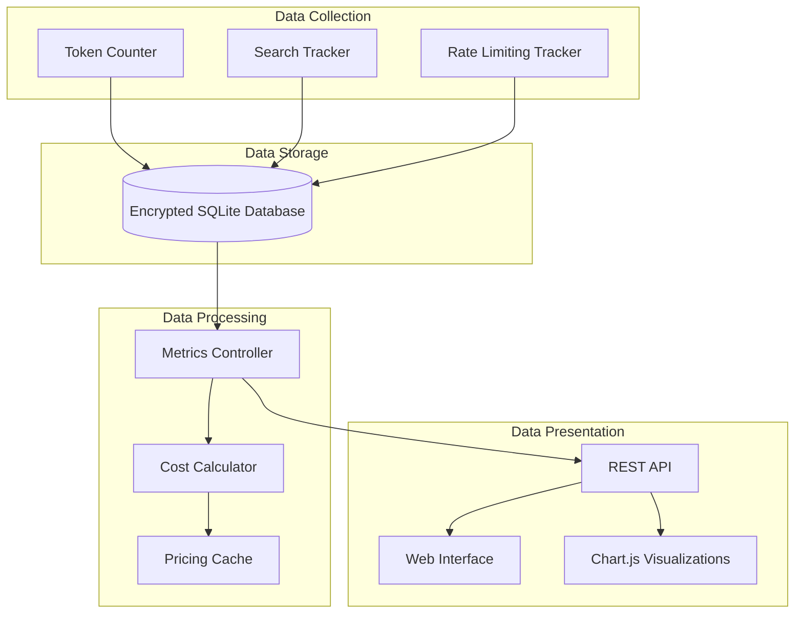
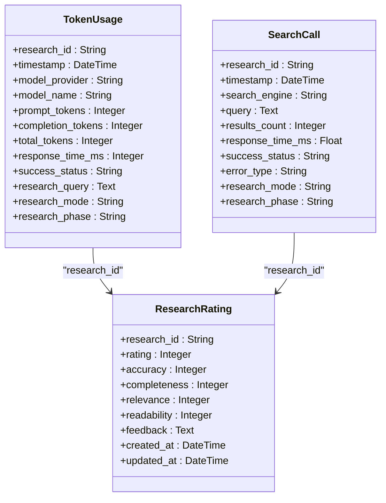
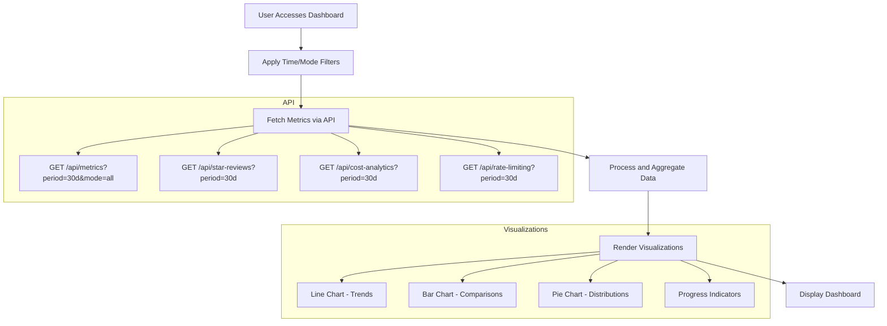
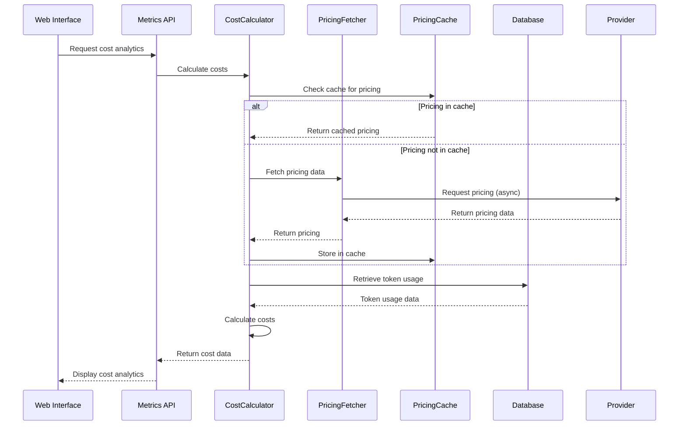
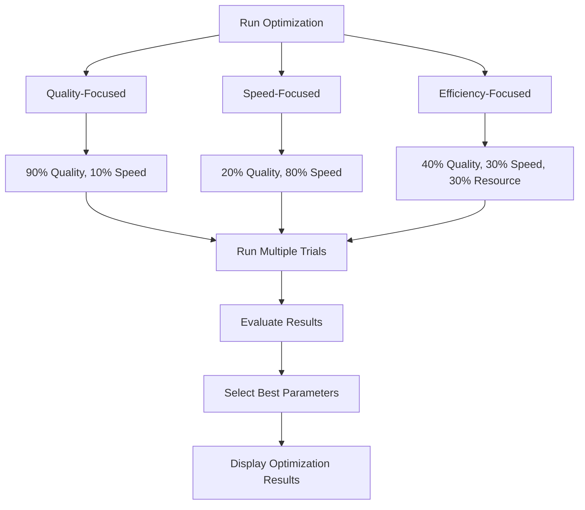

# Analytics Dashboard Usage

<cite>
**Referenced Files in This Document**   
- [analytics-dashboard.md](file://docs/analytics-dashboard.md)
- [multi_benchmark_speed_demo.py](file://examples/optimization/multi_benchmark_speed_demo.py)
- [token_counter.py](file://src/local_deep_research/metrics/token_counter.py)
- [search_tracker.py](file://src/local_deep_research/metrics/search_tracker.py)
- [cost_calculator.py](file://src/local_deep_research/metrics/pricing/cost_calculator.py)
- [pricing_fetcher.py](file://src/local_deep_research/metrics/pricing/pricing_fetcher.py)
- [metrics_routes.py](file://src/local_deep_research/web/routes/metrics_routes.py)
- [database.py](file://src/local_deep_research/metrics/database.py)
- [metrics.py](file://src/local_deep_research/database/models/metrics.py)
</cite>

## Table of Contents
1. [Introduction](#introduction)
2. [Metrics Tracking System Architecture](#metrics-tracking-system-architecture)
3. [Core Metrics and Data Collection](#core-metrics-and-data-collection)
4. [Dashboard Components and Visualization](#dashboard-components-and-visualization)
5. [Cost Analytics and Pricing System](#cost-analytics-and-pricing-system)
6. [Performance and Rate Limiting Analytics](#performance-and-rate-limiting-analytics)
7. [Benchmarking and Optimization](#benchmarking-and-optimization)
8. [Programmatic Access to Metrics](#programmatic-access-to-metrics)
9. [Privacy and Data Retention](#privacy-and-data-retention)
10. [Troubleshooting and Optimization Guidance](#troubleshooting-and-optimization-guidance)

## Introduction

The Analytics Dashboard provides comprehensive insights into system performance, resource usage, and research effectiveness. This documentation details the implementation of the metrics tracking system, explains how to interpret the various metrics available, and provides guidance on using analytics for optimization and troubleshooting.

The dashboard tracks key performance indicators including token usage, research duration, cost calculations, success rates, and system performance metrics. All data is collected locally and stored in encrypted databases, ensuring user privacy while providing detailed analytics for system optimization.

**Section sources**
- [analytics-dashboard.md](file://docs/analytics-dashboard.md#L1-L246)

## Metrics Tracking System Architecture

The metrics tracking system is implemented as a modular component within the application, with separate modules for different types of metrics collection and analysis. The architecture follows a layered approach with clear separation between data collection, storage, and presentation layers.



**Diagram sources **
- [token_counter.py](file://src/local_deep_research/metrics/token_counter.py#L1-L1932)
- [search_tracker.py](file://src/local_deep_research/metrics/search_tracker.py#L1-L443)
- [metrics_routes.py](file://src/local_deep_research/web/routes/metrics_routes.py#L1-L2207)

**Section sources**
- [token_counter.py](file://src/local_deep_research/metrics/token_counter.py#L1-L1932)
- [search_tracker.py](file://src/local_deep_research/metrics/search_tracker.py#L1-L443)
- [metrics_routes.py](file://src/local_deep_research/web/routes/metrics_routes.py#L1-L2207)

## Core Metrics and Data Collection

The system collects several categories of metrics through specialized tracking components. The primary metrics include token usage, search performance, research session statistics, and user satisfaction ratings.

### Token Usage Tracking

Token usage is tracked through the `TokenCountingCallback` class, which integrates with the LangChain callback system to monitor LLM interactions. The callback captures detailed information about each LLM call, including:

- Token counts (prompt, completion, total)
- Model and provider information
- Response times and success status
- Research context (query, mode, phase)
- Call stack information for debugging

The token counter also implements context overflow detection, monitoring when prompts approach the model's context limit and estimating the number of tokens that may have been truncated.

### Search Performance Tracking

Search engine performance is monitored through the `SearchTracker` class, which records metrics for each search operation. Key tracked metrics include:

- Search engine used and query executed
- Number of results returned and response time
- Success/failure status and error information
- Research context (mode, phase, iteration)
- Timing metrics for performance analysis

The search tracker uses thread-safe database operations to ensure reliable metrics collection even during concurrent operations.

### Research Session Metrics

Research sessions are tracked at multiple levels, capturing both high-level session information and detailed operation metrics. The system records:

- Research duration and completion status
- Strategy usage and query complexity
- User satisfaction ratings (1-5 stars)
- Resource usage and performance trends
- Error rates and system latency



**Diagram sources **
- [metrics.py](file://src/local_deep_research/database/models/metrics.py#L1-L210)
- [token_counter.py](file://src/local_deep_research/metrics/token_counter.py#L1-L1932)
- [search_tracker.py](file://src/local_deep_research/metrics/search_tracker.py#L1-L443)

**Section sources**
- [token_counter.py](file://src/local_deep_research/metrics/token_counter.py#L1-L1932)
- [search_tracker.py](file://src/local_deep_research/metrics/search_tracker.py#L1-L443)
- [metrics.py](file://src/local_deep_research/database/models/metrics.py#L1-L210)

## Dashboard Components and Visualization

The analytics dashboard provides multiple views for examining system metrics, with interactive visualizations and filtering capabilities.

### System Overview Dashboard

The main dashboard displays key metrics in summary cards:

- **Total Tokens Used**: Aggregate token consumption with breakdown by model
- **Total Researches**: Number of completed research sessions
- **Average Response Time**: System performance metric
- **Success Rate**: Percentage of successful operations
- **User Satisfaction**: Average star rating from user feedback
- **Estimated Costs**: Token-based cost estimation with provider breakdown

Users can filter analytics by time period (last 7 days, 30 days, 3 months, year, all time) and research mode (Quick Summary, Detailed, All).

### Detailed Analytics Pages

The dashboard includes specialized pages for in-depth analysis of specific metric categories:

- **Star Reviews Analytics**: 5-star rating distribution, average ratings by time period, rating trends, and breakdown by model and search engine
- **Cost Analytics**: Cost breakdown by provider, token usage details, cost trends over time, and model-specific cost analysis
- **Rate Limiting Dashboard**: Real-time monitoring of search engine rate limit status, success/failure rates per engine, wait time tracking, and engine health indicators

### Data Visualization

The dashboard uses Chart.js to display metrics through various visualization types:

- **Line Charts**: Token usage and search activity over time
- **Bar Charts**: Model usage comparison and cost breakdown
- **Pie Charts**: Provider distribution and search engine usage
- **Progress Indicators**: Success rates and health status



**Diagram sources **
- [metrics_routes.py](file://src/local_deep_research/web/routes/metrics_routes.py#L846-L1844)
- [analytics-dashboard.md](file://docs/analytics-dashboard.md#L1-L246)

**Section sources**
- [metrics_routes.py](file://src/local_deep_research/web/routes/metrics_routes.py#L846-L1844)
- [analytics-dashboard.md](file://docs/analytics-dashboard.md#L1-L246)

## Cost Analytics and Pricing System

The cost tracking system calculates estimated costs based on token usage and provider pricing information. The system implements a multi-layered approach to pricing data management.

### Cost Calculation Architecture

The cost calculation system consists of three main components:

1. **CostCalculator**: Core class that performs cost calculations
2. **PricingFetcher**: Retrieves pricing data from various sources
3. **PricingCache**: Caches pricing data to minimize API calls



**Diagram sources **
- [cost_calculator.py](file://src/local_deep_research/metrics/pricing/cost_calculator.py#L1-L237)
- [pricing_fetcher.py](file://src/local_deep_research/metrics/pricing/pricing_fetcher.py#L1-L241)
- [pricing_cache.py](file://src/local_deep_research/metrics/pricing/pricing_cache.py#L1-L109)

### Pricing Data Management

The system uses a hierarchical approach to obtain pricing data:

1. **Cache Check**: First checks the in-memory pricing cache
2. **Live Fetching**: Attempts to fetch current pricing from provider APIs
3. **Static Fallback**: Uses built-in static pricing data when live data is unavailable

The pricing fetcher supports multiple providers including OpenAI, Anthropic, Google (Gemini), and local models. For providers without public pricing APIs, the system relies on static pricing data that is periodically updated.

### Supported Providers and Rates

The system tracks costs for the following providers:

- **OpenAI**: GPT-3.5, GPT-4, and GPT-4-turbo models
- **Anthropic**: Claude models (Opus, Sonnet, Haiku)
- **Google**: Gemini models (Pro, Vision, 1.5 Pro, 1.5 Flash)
- **Local Models**: Ollama, vLLM, LM Studio, and other local inference engines (shown as $0)

The cost calculator converts token counts to costs using provider-specific rates, with pricing data expressed per 1,000 tokens in USD.

**Section sources**
- [cost_calculator.py](file://src/local_deep_research/metrics/pricing/cost_calculator.py#L1-L237)
- [pricing_fetcher.py](file://src/local_deep_research/metrics/pricing/pricing_fetcher.py#L1-L241)
- [pricing_cache.py](file://src/local_deep_research/metrics/pricing/pricing_cache.py#L1-L109)

## Performance and Rate Limiting Analytics

The system provides detailed analytics for monitoring performance and rate limiting status, helping users identify and resolve issues.

### Rate Limiting Monitoring

The rate limiting dashboard tracks the status of search engine API usage:

- **Real-time rate limit status** for each search engine
- **Historical rate limit events** and patterns
- **Automatic wait time optimization** based on success rates
- **Per-engine performance tracking** with success/failure rates

The system uses a color-coded health indicator system:
- 🟢 Healthy: >95% success rate
- 🟡 Degraded: 70-95% success rate  
- 🔴 Poor: <70% success rate

### Performance Metrics

The system tracks several performance indicators:

- **API response times** for LLM and search operations
- **System latency** and throughput statistics
- **Error rates** and failure patterns
- **Resource usage** (memory, CPU) when available

These metrics help identify performance bottlenecks and optimize system configuration.

**Section sources**
- [metrics_routes.py](file://src/local_deep_research/web/routes/metrics_routes.py#L601-L843)
- [analytics-dashboard.md](file://docs/analytics-dashboard.md#L1-L246)

## Benchmarking and Optimization

The system includes tools for benchmarking and optimization, allowing users to compare performance across different configurations.

### Multi-Benchmark Speed Demo

The `multi_benchmark_speed_demo.py` script demonstrates the benchmarking API with simulated performance testing. The script shows how to:

- Simulate quality-focused optimization
- Simulate speed-focused optimization  
- Simulate efficiency-focused optimization
- Compare results across different benchmark weights

The demo uses simulated evaluators to demonstrate the API structure without running actual benchmarks, making it safe for testing and demonstration purposes.



**Diagram sources **
- [multi_benchmark_speed_demo.py](file://examples/optimization/multi_benchmark_speed_demo.py#L1-L282)

**Section sources**
- [multi_benchmark_speed_demo.py](file://examples/optimization/multi_benchmark_speed_demo.py#L1-L282)

## Programmatic Access to Metrics

The analytics system provides a comprehensive API for programmatic access to metrics data, enabling integration with external tools and custom analysis.

### API Endpoints

The following API endpoints are available:

```bash
# Get overall metrics
curl http://localhost:5000/api/metrics

# Get specific research metrics
curl http://localhost:5000/api/metrics/research/<research_id>

# Get enhanced tracking data
curl http://localhost:5000/api/metrics/enhanced

# Get rating analytics
curl http://localhost:5000/api/star-reviews

# Get cost analytics
curl http://localhost:5000/api/cost-analytics

# Get rate limiting status
curl http://localhost:5000/api/rate-limiting
```

### Data Export

Analytics data can be exported in JSON format for further analysis:

- **Research Reports**: Export individual research results as PDF, Markdown, or JSON
- **Analytics Data**: Access comprehensive metrics via API for external processing
- **Time Series Data**: Retrieve historical trends for performance analysis

The API supports filtering by time period and research mode, allowing targeted data extraction.

**Section sources**
- [metrics_routes.py](file://src/local_deep_research/web/routes/metrics_routes.py#L860-L1844)
- [analytics-dashboard.md](file://docs/analytics-dashboard.md#L1-L246)

## Privacy and Data Retention

The analytics system prioritizes user privacy and data security through several design principles.

### Data Storage

All analytics data is stored locally in encrypted SQLite databases:
- No external analytics services are used
- Data remains on the user's device
- Databases are encrypted with user credentials
- Configurable data retention policies

### Privacy Considerations

The system implements privacy-preserving practices:
- Only aggregate metrics are displayed in the dashboard
- Individual research details are accessible only through direct lookup
- No personally identifiable information is collected beyond what's necessary for operation
- Users can configure data retention periods

**Section sources**
- [analytics-dashboard.md](file://docs/analytics-dashboard.md#L1-L246)
- [database.py](file://src/local_deep_research/metrics/database.py#L1-L72)

## Troubleshooting and Optimization Guidance

The analytics dashboard provides actionable insights for troubleshooting issues and optimizing system performance.

### Identifying Cost Drivers

To optimize costs:
1. Review high-token queries in cost analytics
2. Compare model costs vs. quality ratings
3. Optimize model selection for different tasks
4. Consider using local models for cost-sensitive operations

### Improving Search Performance

To enhance search effectiveness:
1. Monitor search engine health status
2. Identify frequently rate-limited engines
3. Adjust search strategy based on success rates
4. Configure rate limiting parameters appropriately

### Enhancing Research Quality

To improve research outcomes:
1. Analyze user ratings by research type
2. Review low-rated sessions for patterns
3. Adjust parameters based on feedback
4. Experiment with different search strategies

The system's comprehensive metrics provide the data needed to make informed decisions about configuration and optimization.

**Section sources**
- [analytics-dashboard.md](file://docs/analytics-dashboard.md#L1-L246)
- [metrics_routes.py](file://src/local_deep_research/web/routes/metrics_routes.py#L1-L2207)
- [token_counter.py](file://src/local_deep_research/metrics/token_counter.py#L1-L1932)