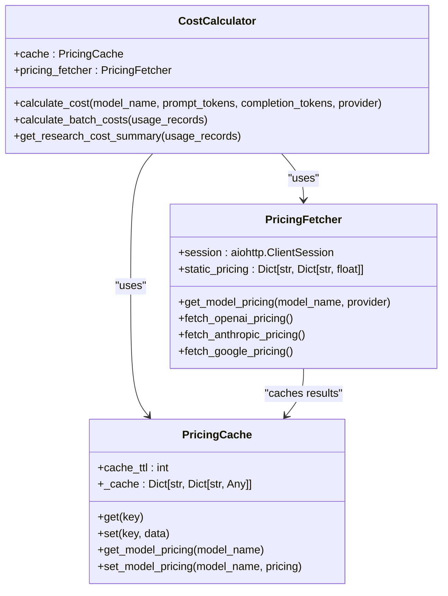
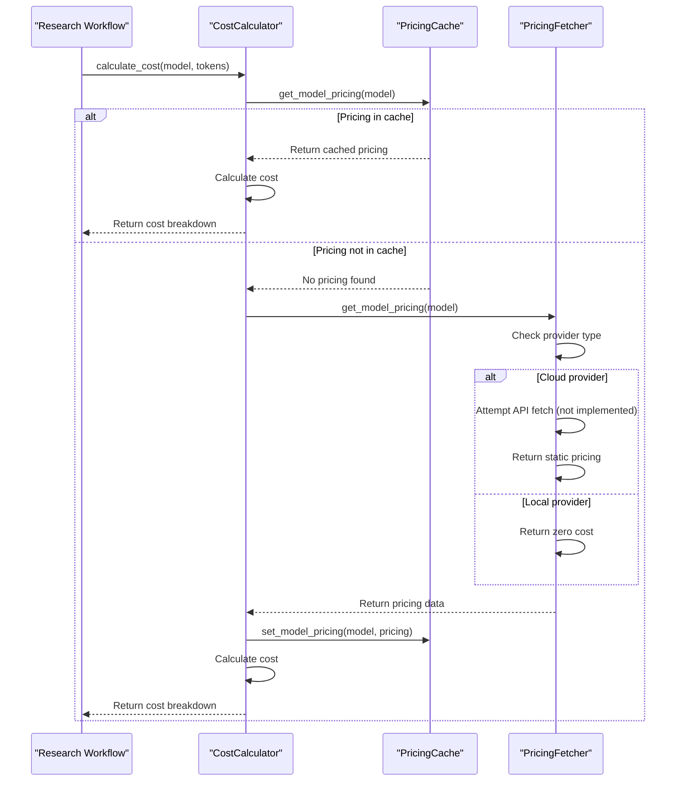
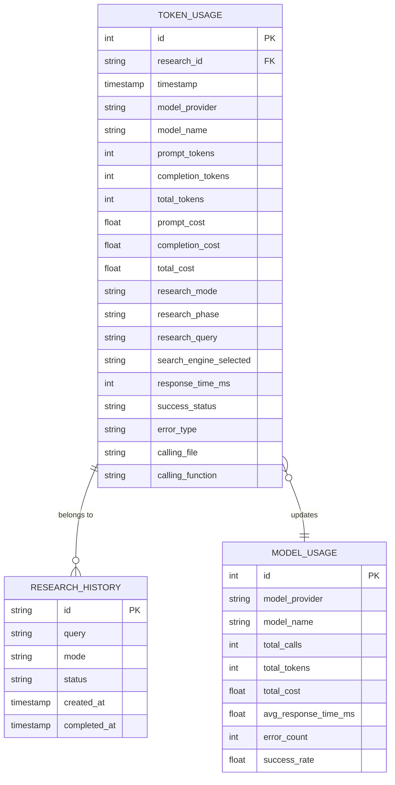
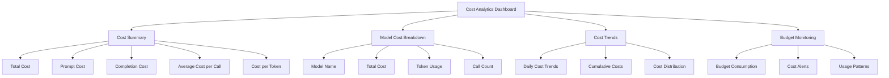

# Cost Analytics and Pricing

<cite>
**Referenced Files in This Document**   
- [cost_calculator.py](file://src/local_deep_research/metrics/pricing/cost_calculator.py)
- [pricing_fetcher.py](file://src/local_deep_research/metrics/pricing/pricing_fetcher.py)
- [pricing_cache.py](file://src/local_deep_research/metrics/pricing/pricing_cache.py)
- [token_counter.py](file://src/local_deep_research/metrics/token_counter.py)
- [metrics.py](file://src/local_deep_research/database/models/metrics.py)
- [metrics_routes.py](file://src/local_deep_research/web/routes/metrics_routes.py)
</cite>

## Table of Contents
1. [Introduction](#introduction)
2. [Cost Calculation Architecture](#cost-calculation-architecture)
3. [Pricing Data Management](#pricing-data-management)
4. [Token Usage and Cost Tracking](#token-usage-and-cost-tracking)
5. [Cost Analytics Dashboard](#cost-analytics-dashboard)
6. [Cost Analysis and Optimization](#cost-analysis-and-optimization)
7. [Configuration and Customization](#configuration-and-customization)

## Introduction

The cost analytics system in Local Deep Research provides comprehensive tracking and analysis of research costs based on token usage and provider pricing. This system enables users to monitor their budget consumption, understand cost patterns, and optimize their research workflows for cost efficiency. The implementation consists of three core components: the cost calculator, pricing fetcher, and pricing cache, which work together to compute expenses based on token usage and provider pricing data.

The system tracks both cloud-based LLM providers with associated costs and local models that are free to use. By integrating with the token counter and database systems, it captures detailed usage metrics that power the analytics dashboard, allowing users to visualize cost trends and identify expensive research patterns.

## Cost Calculation Architecture

The cost calculation system is built around the `CostCalculator` class, which orchestrates the calculation of research costs based on token usage and pricing data. The architecture follows a layered approach that integrates pricing data retrieval, caching, and cost computation.

**Diagram sources**
- [cost_calculator.py](file://src/local_deep_research/metrics/pricing/cost_calculator.py#L16-L237)
- [pricing_fetcher.py](file://src/local_deep_research/metrics/pricing/pricing_fetcher.py#L14-L241)
- [pricing_cache.py](file://src/local_deep_research/metrics/pricing/pricing_cache.py#L14-L109)

**Section sources**
- [cost_calculator.py](file://src/local_deep_research/metrics/pricing/cost_calculator.py#L16-L237)

## Pricing Data Management

The pricing system manages LLM provider pricing through a combination of static pricing data and dynamic fetching capabilities. The `PricingFetcher` class maintains a comprehensive static pricing database for major LLM providers, which serves as the primary source of pricing information.

The system supports multiple LLM providers with detailed pricing for prompt and completion tokens. For cloud providers like OpenAI, Anthropic, and Google, the system uses static pricing data since these providers do not offer public pricing APIs. For local models (Ollama, vLLM, etc.), the system returns zero cost as these are free to use.

The `PricingCache` class implements an in-memory cache with time-to-live (TTL) expiration to avoid repeated API calls and improve performance. The cache stores pricing data with a default TTL of 1 hour, after which entries are considered expired and will be refreshed on the next request.

**Diagram sources**
- [pricing_fetcher.py](file://src/local_deep_research/metrics/pricing/pricing_fetcher.py#L14-L241)
- [pricing_cache.py](file://src/local_deep_research/metrics/pricing/pricing_cache.py#L14-L109)

**Section sources**
- [pricing_fetcher.py](file://src/local_deep_research/metrics/pricing/pricing_fetcher.py#L14-L241)
- [pricing_cache.py](file://src/local_deep_research/metrics/pricing/pricing_cache.py#L14-L109)

## Token Usage and Cost Tracking

The cost analytics system integrates with the token tracking infrastructure to capture and store detailed usage metrics. The `TokenUsage` database model stores comprehensive information about each LLM call, including token counts, costs, and contextual information.

The `TokenCountingCallback` class captures token usage during research execution and saves it to the database. For each LLM call, it records:
- Token counts (prompt, completion, and total)
- Cost calculations based on provider pricing
- Performance metrics (response time, success status)
- Contextual information (research mode, phase, query)
- Call stack information (calling file and function)

The system also maintains aggregate statistics in the `ModelUsage` table, which tracks total calls, tokens, and costs for each model over time. This enables efficient querying for cost analytics without needing to aggregate individual token usage records.

**Diagram sources**
- [metrics.py](file://src/local_deep_research/database/models/metrics.py#L20-L210)
- [token_counter.py](file://src/local_deep_research/metrics/token_counter.py#L19-L593)

**Section sources**
- [metrics.py](file://src/local_deep_research/database/models/metrics.py#L20-L210)
- [token_counter.py](file://src/local_deep_research/metrics/token_counter.py#L19-L593)

## Cost Analytics Dashboard

The cost analytics dashboard provides a comprehensive view of research costs through the `/metrics/costs` endpoint. The dashboard displays key metrics including total costs, cost breakdown by model, and savings from using local models.

The dashboard supports multiple time periods (7d, 30d, 3m, 1y, all) and allows users to filter by research mode. It visualizes cost data through charts and tables, making it easy to identify trends and patterns. The system also highlights savings from using local models, which have zero cost compared to cloud-based alternatives.

The API endpoint `/metrics/api/cost-analytics` provides the data for the dashboard, returning a comprehensive JSON response with cost metrics, model breakdowns, and trend data. The frontend uses this data to render interactive visualizations that help users understand their cost patterns.

**Diagram sources**
- [metrics_routes.py](file://src/local_deep_research/web/routes/metrics_routes.py#L1-L2207)
- [test_cost_analytics.js](file://tests/ui_tests/test_cost_analytics.js#L1-L202)

**Section sources**
- [metrics_routes.py](file://src/local_deep_research/web/routes/metrics_routes.py#L1-L2207)

## Cost Analysis and Optimization

The cost analytics system enables users to analyze their research costs and identify optimization opportunities. By examining cost trends and usage patterns, users can make informed decisions about model selection and research strategies.

### Interpreting Cost Trends

Cost trends can reveal important insights about research efficiency:
- **High completion costs**: Indicate models that generate lengthy responses, which may be optimized by adjusting response length parameters
- **Frequent small calls**: Suggest opportunities to batch requests or use more efficient models
- **High-cost models**: Highlight expensive LLM providers that could be replaced with more cost-effective alternatives

The system tracks cost per token, which is a key metric for comparing model efficiency. Users can identify the most cost-effective models for their use cases by comparing this metric across different providers.

### Identifying Expensive Research Patterns

Certain research patterns tend to be more expensive:
- **Iterative strategies**: Multiple rounds of LLM calls can accumulate significant costs
- **Large context windows**: Models with high context limits consume more tokens even when not fully utilized
- **Complex queries**: Questions requiring extensive reasoning or data processing generate more tokens

The analytics dashboard helps identify these patterns by breaking down costs by research phase, strategy, and model usage. Users can see which research modes and strategies are most expensive and adjust their approaches accordingly.

### Performance Considerations

The cost calculation system is designed for performance and reliability:
- **Caching**: Pricing data is cached in memory to avoid repeated API calls
- **Fallbacks**: Static pricing serves as a fallback when dynamic fetching is not available
- **Error handling**: The system gracefully handles missing pricing data by returning zero cost
- **Asynchronous operations**: The cost calculator supports async operations for non-blocking performance

**Section sources**
- [cost_calculator.py](file://src/local_deep_research/metrics/pricing/cost_calculator.py#L16-L237)
- [token_counter.py](file://src/local_deep_research/metrics/token_counter.py#L595-L1932)

## Configuration and Customization

The cost analytics system supports configuration through environment variables and settings. Users can customize pricing models and handle rate limit costs through the system's configuration options.

### Custom Pricing Models

While the system provides built-in pricing for major LLM providers, users can extend the pricing system by:
- Adding custom models to the static pricing database
- Implementing custom pricing fetchers for providers with public APIs
- Configuring custom cost multipliers for specific use cases

The `PricingFetcher` class includes a framework for adding new providers, though currently most providers rely on static pricing due to the lack of public pricing APIs.

### Handling Rate Limit Costs

The system accounts for rate limiting in cost calculations by:
- Tracking rate limit attempts and successes
- Including wait times in performance metrics
- Calculating the opportunity cost of rate-limited requests

The rate limiting analytics provide insights into how often requests are delayed or blocked, helping users understand the indirect costs of rate limiting on their research efficiency.

### Configuration Options

Key configuration options include:
- `CACHE_TTL`: Time-to-live for pricing cache entries (default: 3600 seconds)
- `PRICING_FETCH_TIMEOUT`: Timeout for pricing API requests
- `COST_CALCULATION_ENABLED`: Toggle for cost calculation functionality

These settings can be configured through the application's settings system, allowing users to customize the behavior of the cost analytics system based on their needs.

**Section sources**
- [pricing_fetcher.py](file://src/local_deep_research/metrics/pricing/pricing_fetcher.py#L14-L241)
- [pricing_cache.py](file://src/local_deep_research/metrics/pricing/pricing_cache.py#L14-L109)
- [settings_manager.py](file://src/local_deep_research/web/services/settings_manager.py)