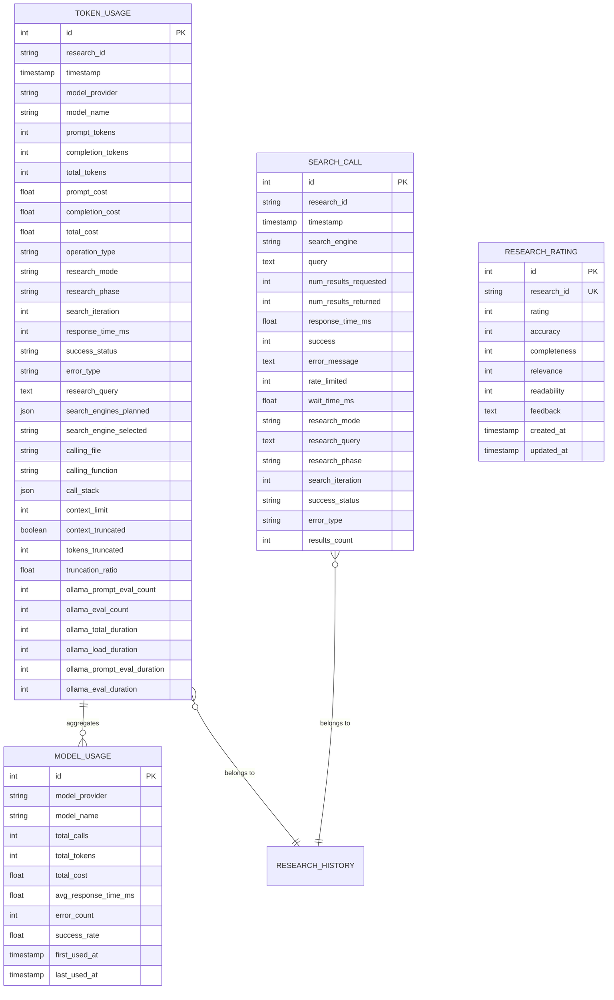
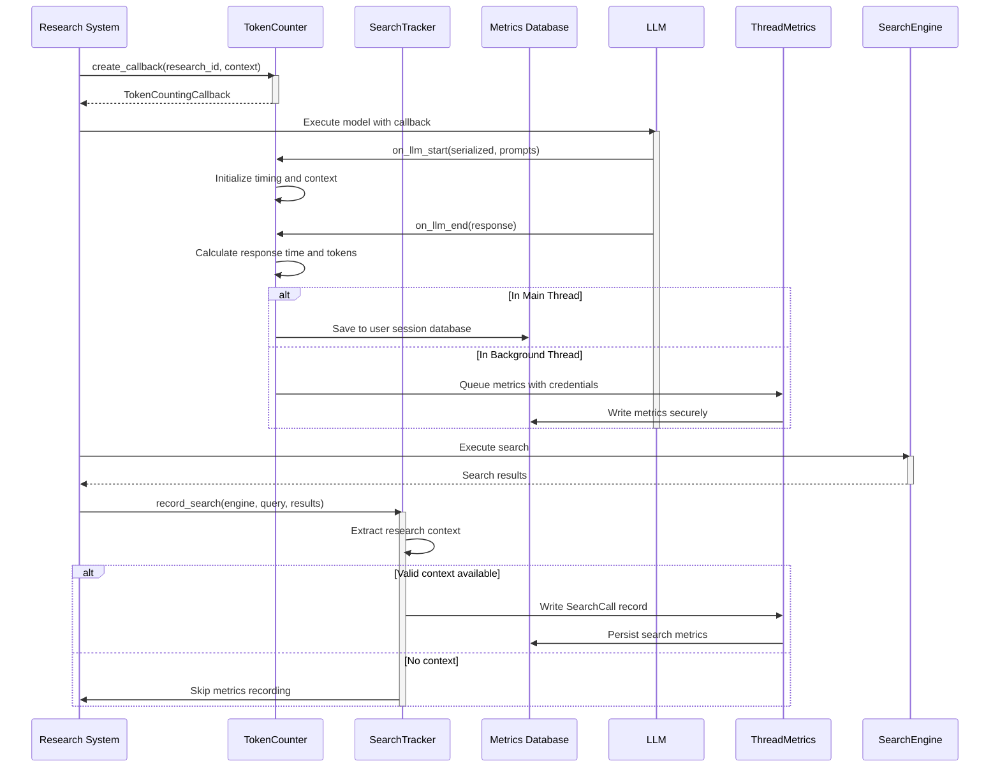
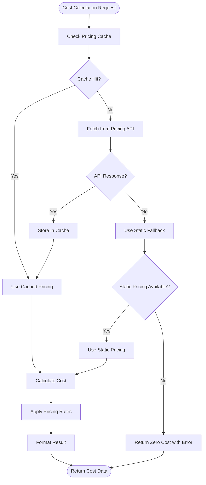

# Metrics System Implementation

<cite>
**Referenced Files in This Document**   
- [search_tracker.py](file://src/local_deep_research/metrics/search_tracker.py)
- [token_counter.py](file://src/local_deep_research/metrics/token_counter.py)
- [database.py](file://src/local_deep_research/metrics/database.py)
- [query_utils.py](file://src/local_deep_research/metrics/query_utils.py)
- [cost_calculator.py](file://src/local_deep_research/metrics/pricing/cost_calculator.py)
- [metrics.py](file://src/local_deep_research/database/models/metrics.py)
- [research.py](file://src/local_deep_research/database/models/research.py)
- [thread_metrics.py](file://src/local_deep_research/database/thread_metrics.py)
</cite>

## Table of Contents
1. [Introduction](#introduction)
2. [Core Components](#core-components)
3. [Data Model for Metrics Storage](#data-model-for-metrics-storage)
4. [Metrics Collection Process](#metrics-collection-process)
5. [Cost Calculation System](#cost-calculation-system)
6. [Querying Historical Data](#querying-historical-data)
7. [Extending the Metrics System](#extending-the-metrics-system)
8. [Integration with External Monitoring](#integration-with-external-monitoring)
9. [Conclusion](#conclusion)

## Introduction

The metrics system in the Local Deep Research application provides comprehensive tracking of research performance, LLM usage, and system efficiency. This documentation details the implementation of the metrics system, focusing on how research performance data is collected, processed, and stored. The system consists of three primary components: search_tracker.py for monitoring research sessions, token_counter.py for tracking LLM token usage, and database.py for persisting metrics data. These components work together to provide detailed insights into research operations, enabling users and administrators to analyze performance, optimize costs, and improve research quality.

The metrics system captures various dimensions of research execution, including research duration, token counts, cost calculations, and success/failure states. It leverages SQLAlchemy for database operations and implements thread-safe mechanisms to ensure reliable metrics collection even during concurrent research operations. The system is designed to be extensible, allowing for custom tracking capabilities and integration with external monitoring tools.

## Core Components

The metrics system comprises several interconnected components that work together to collect, process, and store research performance data. The primary components are search_tracker.py, token_counter.py, and database.py, each serving a specific purpose in the metrics collection pipeline.

The search_tracker.py module monitors research sessions by tracking search engine calls and their performance characteristics. It records details such as search engine type, query parameters, response times, success/failure states, and error information. This component provides insights into the effectiveness of different search strategies and helps identify potential bottlenecks in the research process.

The token_counter.py module tracks LLM usage by monitoring token consumption across different models and providers. It implements a callback system that integrates with the LLM framework to capture token counts during model invocations. This component not only tracks basic token metrics but also collects enhanced data such as response times, context overflow detection, and call stack information for debugging purposes.

The database.py module provides the persistence layer for metrics data, handling database connections and session management. It works in conjunction with thread_metrics.py to ensure thread-safe access to the encrypted user database, allowing metrics to be recorded reliably even when research operations are executed in background threads.

**Section sources**
- [search_tracker.py](file://src/local_deep_research/metrics/search_tracker.py#L1-L443)
- [token_counter.py](file://src/local_deep_research/metrics/token_counter.py#L1-L800)
- [database.py](file://src/local_deep_research/metrics/database.py#L1-L72)

## Data Model for Metrics Storage

The metrics system uses a well-defined data model to store research performance data, with specialized tables for different types of metrics. The primary data structures are defined in the metrics.py model file and include TokenUsage, ModelUsage, SearchCall, and ResearchRating entities.

The TokenUsage model tracks detailed information about LLM token consumption, with fields for research_id, timestamp, model_provider, model_name, prompt_tokens, completion_tokens, and total_tokens. It also includes cost tracking fields (prompt_cost, completion_cost, total_cost) that are populated based on model pricing data. Additional context fields such as operation_type, research_mode, research_phase, and search_iteration provide granular insights into when and how tokens are consumed.

The ModelUsage model maintains aggregate statistics for each model, including total_calls, total_tokens, total_cost, avg_response_time_ms, error_count, and success_rate. This model enables quick retrieval of high-level usage patterns without querying individual token records.

The SearchCall model captures information about search engine interactions, including search_engine, query, num_results_requested, num_results_returned, response_time_ms, success status, and error_message. It also includes research context fields such as research_mode, research_query, and research_phase to correlate search performance with specific research sessions.

The data model includes compound indexes on key fields to optimize query performance, particularly for time-series analysis and research-specific metrics retrieval. For example, the TokenUsage table has indexes on (research_id, timestamp) and (model_provider, model_name, timestamp) to accelerate common query patterns.

**Diagram sources**
- [metrics.py](file://src/local_deep_research/database/models/metrics.py#L1-L210)
- [research.py](file://src/local_deep_research/database/models/research.py#L214-L258)

## Metrics Collection Process

The metrics collection process is initiated when a research session begins and continues throughout the research lifecycle. The system uses a combination of callback mechanisms and direct recording to capture metrics from both LLM operations and search engine interactions.

For LLM token tracking, the TokenCounter class creates TokenCountingCallback instances that integrate with the LLM framework. When an LLM operation starts, the on_llm_start method is called, which initializes timing and captures context information. The callback extracts model and provider information from multiple sources within the serialized data and invocation parameters to ensure accurate tracking even when different LLM providers use varying parameter names.

During LLM execution, the callback monitors for context overflow conditions by analyzing response metadata, particularly for Ollama models which provide detailed usage information. When the LLM operation completes, the on_llm_end method calculates response time, extracts token usage from the response, and updates in-memory counters. If an error occurs during LLM processing, the on_llm_error method captures the error details and records a failed call in the metrics database.

For search engine tracking, the SearchTracker class provides a record_search method that is called whenever a search operation completes. This method extracts research context from thread-local storage, including research_id, research_query, research_mode, and research_phase. It then creates a SearchCall record with details about the search engine, query, response time, success status, and any error information.

Both components handle thread safety through the thread_metrics.py module, which provides a ThreadSafeMetricsWriter that manages database connections for background threads. When operating in a background thread, metrics are written using credentials stored in thread-local storage, ensuring that each thread can securely access the user's encrypted database without sharing connection objects.

The metrics collection process also includes enhanced context tracking, capturing information such as the calling file and function, call stack, and search engine selection context. This additional metadata enables detailed analysis of research patterns and helps identify optimization opportunities.

**Diagram sources**
- [token_counter.py](file://src/local_deep_research/metrics/token_counter.py#L19-L589)
- [search_tracker.py](file://src/local_deep_research/metrics/search_tracker.py#L17-L121)
- [thread_metrics.py](file://src/local_deep_research/database/thread_metrics.py#L19-L159)

## Cost Calculation System

The cost calculation system transforms token counts into financial metrics by applying model-specific pricing data. This system is implemented in the cost_calculator.py module and works in conjunction with pricing_fetcher.py and pricing_cache.py to retrieve and apply pricing information.

The CostCalculator class provides both asynchronous and synchronous methods for calculating costs. The primary calculate_cost method takes model_name, prompt_tokens, completion_tokens, and an optional provider parameter, then returns a dictionary with prompt_cost, completion_cost, and total_cost. The calculation converts token counts to thousands and multiplies by the respective pricing rates for prompt and completion tokens.

The system uses a two-tier approach to obtain pricing data: first checking a local cache, then fetching from external APIs if necessary. The PricingCache stores pricing information with keys that include both provider and model name to avoid conflicts between models with the same name from different providers. When pricing data is not available in the cache, the PricingFetcher attempts to retrieve it from configured sources, falling back to static pricing configurations for common models.

For scenarios where asynchronous operations are not available, the calculate_cost_sync method provides a synchronous alternative that relies solely on cached pricing data or static fallbacks. This ensures that cost calculations can still be performed in contexts where async/await is not supported.

The cost calculation system also provides batch processing capabilities through the calculate_batch_costs method, which processes multiple usage records efficiently. Additionally, the get_research_cost_summary method aggregates costs across multiple records to provide comprehensive financial analysis for research sessions, including total cost, cost per call, and cost per token metrics.

The system handles missing pricing data gracefully by returning zero costs with an error message, ensuring that research operations are not disrupted when pricing information is unavailable. This fault-tolerant design allows the application to continue functioning while still providing visibility into usage patterns.

**Diagram sources**
- [cost_calculator.py](file://src/local_deep_research/metrics/pricing/cost_calculator.py#L16-L237)
- [pricing_cache.py](file://src/local_deep_research/metrics/pricing/pricing_cache.py)
- [pricing_fetcher.py](file://src/local_deep_research/metrics/pricing/pricing_fetcher.py)

## Querying Historical Data

The metrics system provides several methods for retrieving historical data through the TokenCounter and SearchTracker classes. These methods enable efficient analysis of research performance over time and support the creation of analytics dashboards and reports.

The TokenCounter class offers the get_research_metrics method, which retrieves all token usage data for a specific research session identified by research_id. This method returns a comprehensive summary including total tokens, total calls, and model-specific usage breakdowns. It queries the TokenUsage table, grouping results by model_name and model_provider to provide aggregated statistics.

For overall metrics across all research sessions, the get_overall_metrics method combines data from both the user's encrypted database and the thread-safe metrics database. This ensures that metrics from background operations are included in the analysis. The method supports time-based filtering through the period parameter (7d, 30d, 3m, 1y, all) and research mode filtering (quick, detailed, all).

The SearchTracker class provides similar querying capabilities for search engine metrics. The get_search_metrics method returns statistics on search engine usage, including call counts, average response times, total results, and success rates. It also includes recent search calls for detailed analysis. The get_research_search_metrics method focuses on a specific research session, providing detailed information about search operations within that context.

Both components use the query_utils.py module to generate time-based and research mode filters. The get_time_filter_condition function creates SQLAlchemy conditions for filtering by time periods, while get_research_mode_condition handles research mode filtering. These utility functions ensure consistent filtering logic across different metrics queries.

The system also supports time-series analysis through the get_search_time_series method in SearchTracker, which returns chronological data points for charting search activity over time. This enables visualization of research patterns and performance trends.

**Section sources**
- [token_counter.py](file://src/local_deep_research/metrics/token_counter.py#L633-L722)
- [search_tracker.py](file://src/local_deep_research/metrics/search_tracker.py#L122-L404)
- [query_utils.py](file://src/local_deep_research/metrics/query_utils.py#L9-L52)

## Extending the Metrics System

The metrics system is designed to be extensible, allowing developers to add custom tracking capabilities and integrate with external monitoring tools. Several extension points are available for enhancing the system's functionality.

Custom tracking can be implemented by extending the TokenCountingCallback class to capture additional context or metrics. For example, developers can override the on_llm_start and on_llm_end methods to extract custom information from the serialized data or response objects. The research_context parameter can be used to pass additional metadata that will be stored with the token usage records.

To add new metrics types, developers can create additional database models in the metrics.py file and implement corresponding tracker classes similar to SearchTracker. These classes should follow the same pattern of using the MetricsDatabase for session management and implementing methods for recording and retrieving metrics.

Integration with external monitoring tools can be achieved through several approaches. The system could be extended to include webhook notifications that send metrics data to external services when specific events occur. Alternatively, a periodic export function could be implemented to push aggregated metrics to monitoring platforms.

For real-time monitoring, the system could be enhanced with a streaming interface that emits metrics events as they are recorded. This would enable integration with real-time analytics platforms and alerting systems.

The cost calculation system can be extended by adding new pricing sources to the PricingFetcher class. Developers can implement additional methods to retrieve pricing data from different providers or create custom pricing models based on negotiated rates or volume discounts.

When extending the metrics system, developers should consider performance implications and ensure that additional tracking does not significantly impact research execution times. The use of asynchronous operations and batch processing can help minimize performance overhead.

**Section sources**
- [token_counter.py](file://src/local_deep_research/metrics/token_counter.py#L19-L589)
- [search_tracker.py](file://src/local_deep_research/metrics/search_tracker.py#L17-L443)
- [cost_calculator.py](file://src/local_deep_research/metrics/pricing/cost_calculator.py#L16-L237)

## Integration with External Monitoring

The metrics system can be integrated with external monitoring tools through several mechanisms that leverage its existing architecture and data model. These integrations enable centralized monitoring, alerting, and advanced analytics beyond the capabilities of the local system.

One integration approach is to implement a metrics export service that periodically queries the metrics database and pushes data to external monitoring platforms such as Prometheus, Grafana, or Datadog. This service could use the existing querying methods in TokenCounter and SearchTracker to retrieve aggregated metrics and transform them into the appropriate format for the target monitoring system.

Another approach is to implement webhook notifications that trigger when specific metrics thresholds are exceeded. For example, when research costs exceed a certain amount or when error rates increase beyond acceptable levels, the system could send HTTP POST requests to configured webhook endpoints with relevant metrics data.

The system could also expose a REST API for metrics retrieval, allowing external tools to query metrics data directly. This API would build upon the existing metrics routes in the application, potentially extending them with additional filtering and aggregation capabilities.

For real-time monitoring, the system could be enhanced with a message queue integration, publishing metrics events to systems like RabbitMQ or Kafka. This would enable real-time processing and analysis of metrics data by external consumers.

When integrating with external monitoring tools, security considerations are paramount. All integrations should use secure communication protocols (HTTPS), implement proper authentication mechanisms, and follow the principle of least privilege when accessing metrics data.

The thread-safe architecture of the metrics system, particularly the ThreadSafeMetricsWriter in thread_metrics.py, facilitates integration with external systems by ensuring that metrics can be reliably accessed and exported even during active research operations.

**Section sources**
- [thread_metrics.py](file://src/local_deep_research/database/thread_metrics.py#L19-L159)
- [database.py](file://src/local_deep_research/metrics/database.py#L11-L72)
- [metrics_routes.py](file://src/local_deep_research/web/routes/metrics_routes.py)

## Conclusion

The metrics system in the Local Deep Research application provides a comprehensive solution for tracking research performance, LLM usage, and system efficiency. By leveraging the search_tracker.py, token_counter.py, and database.py components, the system captures detailed information about research operations, enabling deep analysis of performance, costs, and quality.

The data model is thoughtfully designed to support efficient querying and aggregation, with specialized tables for different types of metrics and appropriate indexing for common access patterns. The system handles both LLM token tracking and search engine monitoring, providing a holistic view of research activities.

The cost calculation system transforms token counts into financial metrics using a flexible pricing model that supports both cached and real-time pricing data. This enables accurate cost tracking and budget management for research operations.

The querying capabilities allow for both detailed analysis of individual research sessions and aggregate analysis across multiple sessions, supporting the creation of insightful analytics dashboards. The system's extensibility enables custom tracking and integration with external monitoring tools, making it adaptable to various use cases and organizational requirements.

Overall, the metrics system provides valuable insights that can be used to optimize research processes, control costs, and improve the quality of research outputs. Its robust architecture and comprehensive feature set make it a critical component of the Local Deep Research application.