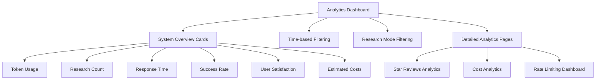
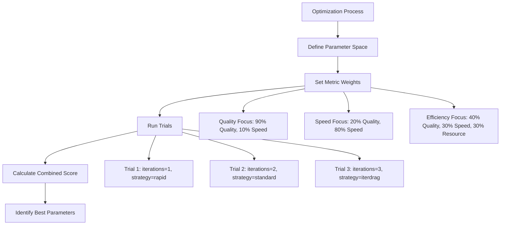
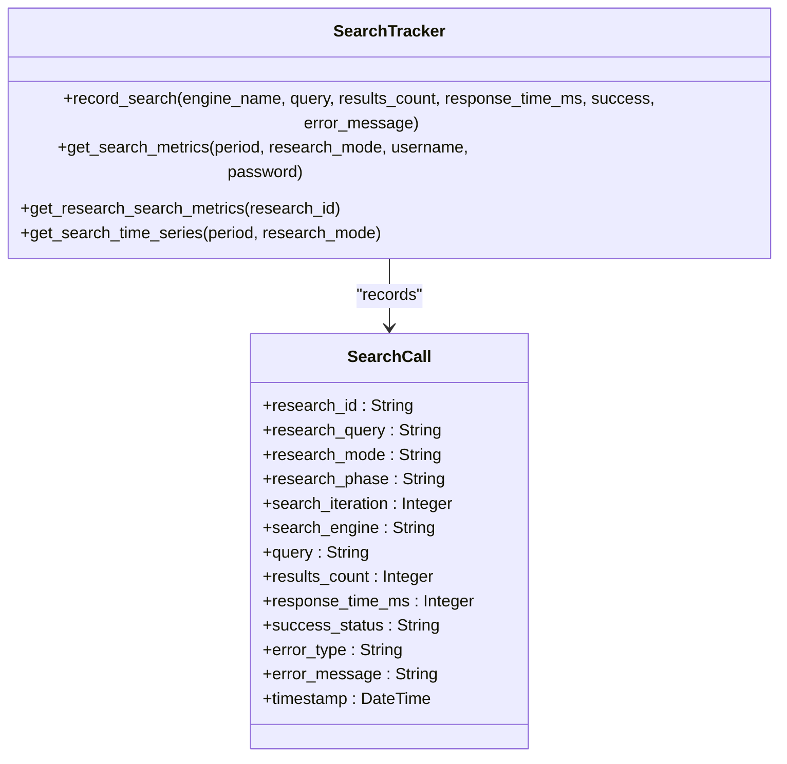
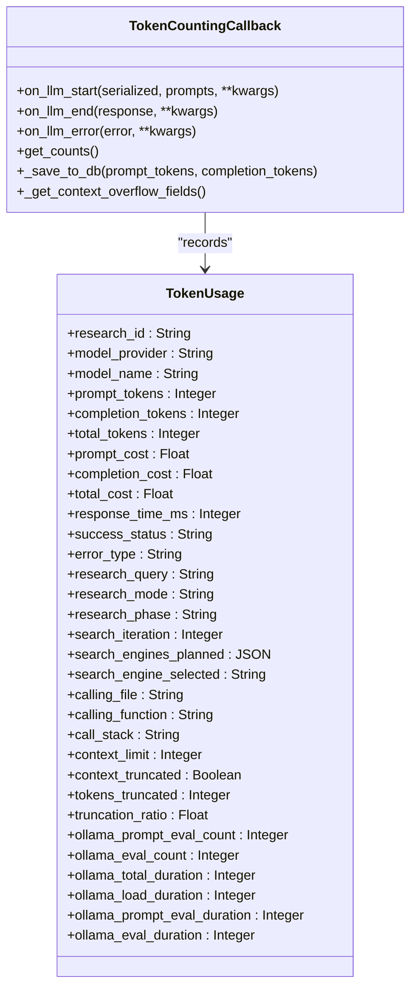
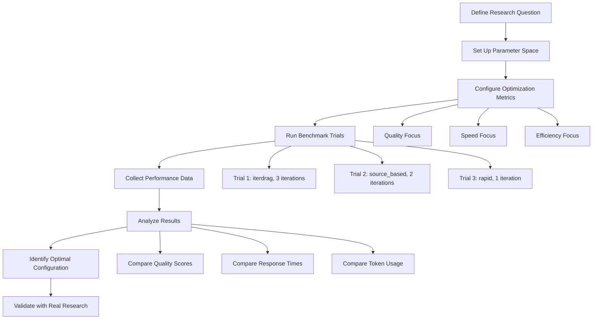
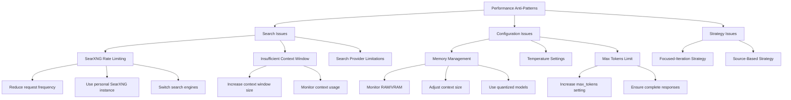

# Performance Analysis and Optimization

<cite>
**Referenced Files in This Document**   
- [multi_benchmark_speed_demo.py](file://examples/optimization/multi_benchmark_speed_demo.py)
- [search_tracker.py](file://src/local_deep_research/metrics/search_tracker.py)
- [token_counter.py](file://src/local_deep_research/metrics/token_counter.py)
- [analytics-dashboard.md](file://docs/analytics-dashboard.md)
- [enhanced-token-tracking.md](file://docs/enhancements/metrics/enhanced-token-tracking.md)
- [COMMON_ISSUES.md](file://community_benchmark_results/COMMON_ISSUES.md)
- [strategy_benchmark_plan.py](file://examples/optimization/strategy_benchmark_plan.py)
- [metrics.py](file://src/local_deep_research/database/models/metrics.py)
</cite>

## Table of Contents
1. [Introduction](#introduction)
2. [Analytics Dashboard Overview](#analytics-dashboard-overview)
3. [Interpreting Multi-Benchmark Metrics](#interpreting-multi-benchmark-metrics)
4. [Search Performance Analysis](#search-performance-analysis)
5. [Token Consumption and Cost Tracking](#token-consumption-and-cost-tracking)
6. [A/B Testing and Configuration Optimization](#ab-testing-and-configuration-optimization)
7. [Performance Anti-Patterns and Solutions](#performance-anti-patterns-and-solutions)
8. [Conclusion](#conclusion)

## Introduction

The Local Deep Research system provides comprehensive performance analytics to help users optimize their research workflows. This document explains how to use the analytics dashboard and associated tools to identify optimization opportunities, interpret benchmark metrics, and improve research efficiency. The system tracks key performance indicators including token usage, search engine performance, response times, and cost metrics, enabling data-driven decisions for LLM selection, search engine configuration, and research strategy parameters.

**Section sources**
- [analytics-dashboard.md](file://docs/analytics-dashboard.md#L1-L246)

## Analytics Dashboard Overview

The metrics dashboard provides a centralized view of research performance and resource usage. Accessible at `/metrics` in the web interface, it offers several key components for performance analysis:

- **System Overview Cards**: Display total tokens used, total researches conducted, average response time, success rate, user satisfaction ratings, and estimated costs
- **Time-based Filtering**: Analyze metrics over different periods (last 7 days, 30 days, 3 months, year, or all time)
- **Research Mode Filtering**: Compare performance between different research modes (Quick Summary, Detailed, All)
- **Detailed Analytics Pages**: Specialized views for star reviews, cost analytics, and rate limiting status

The dashboard tracks four main categories of metrics:
- **Token Metrics**: Total tokens (input + output), usage by model, average tokens per research, and consumption trends
- **Search Metrics**: Search engine usage frequency, response times per engine, success/failure rates, and results count statistics
- **Research Metrics**: Total research sessions, duration, completion status, strategy usage, and query complexity
- **Performance Metrics**: API response times, system latency, error rates, and throughput statistics

Data can be exported via API endpoints for external analysis, and visualizations use Chart.js to display line charts, bar charts, pie charts, and progress indicators.

**Diagram sources**
- [analytics-dashboard.md](file://docs/analytics-dashboard.md#L7-L246)

**Section sources**
- [analytics-dashboard.md](file://docs/analytics-dashboard.md#L1-L246)

## Interpreting Multi-Benchmark Metrics

The `multi_benchmark_speed_demo.py` script demonstrates how to compare different research strategies and configurations using weighted benchmarks. This simulation-based approach evaluates performance across multiple dimensions including quality, speed, and resource usage.

The script implements three optimization strategies:
- **Quality-focused optimization**: Weights quality at 90% and speed at 10%
- **Speed-focused optimization**: Weights quality at 20% and speed at 80% 
- **Efficiency-focused optimization**: Balances quality (40%), speed (30%), and resource usage (30%)

Each optimization trial evaluates different parameter combinations such as iterations, search strategy, and questions per iteration. The system calculates a combined score based on the weighted metrics, allowing comparison across different configurations.

The benchmark can combine multiple evaluation methods with custom weights. For example, a combined benchmark might use 60% weight for SimpleQA and 40% weight for BrowseComp, enabling comprehensive evaluation across different assessment criteria.

**Diagram sources**
- [multi_benchmark_speed_demo.py](file://examples/optimization/multi_benchmark_speed_demo.py#L1-L282)

**Section sources**
- [multi_benchmark_speed_demo.py](file://examples/optimization/multi_benchmark_speed_demo.py#L1-L282)

## Search Performance Analysis

The `search_tracker.py` module provides comprehensive tracking of search engine performance and usage patterns. This component records detailed metrics for each search operation, enabling analysis of search engine effectiveness, response times, and success rates.

Key metrics tracked include:
- **Search engine usage frequency**: How often each search engine is utilized
- **Response times**: Performance metrics for each search engine in milliseconds
- **Success/failure rates**: Reliability of search operations
- **Results count statistics**: Quantity of results returned by each engine
- **Rate limiting status**: Monitoring of search engine rate limits

The SearchTracker class records search operations with contextual information including research ID, query, results count, response time, success status, and error messages. This data is stored in the SearchCall database model, which includes fields for research context, search engine name, query, results count, response time, success status, and error information.

Search metrics can be analyzed at multiple levels:
- **Overall metrics**: Aggregate statistics across all research sessions
- **Per-research metrics**: Detailed analysis of search performance for specific research sessions
- **Time-series data**: Trends in search activity over time

The system also provides real-time monitoring of search engine health with status indicators:
- 🟢 Healthy: >95% success rate
- 🟡 Degraded: 70-95% success rate  
- 🔴 Poor: <70% success rate

**Diagram sources**
- [search_tracker.py](file://src/local_deep_research/metrics/search_tracker.py#L1-L443)
- [metrics.py](file://src/local_deep_research/database/models/metrics.py#L1-L51)

**Section sources**
- [search_tracker.py](file://src/local_deep_research/metrics/search_tracker.py#L1-L443)

## Token Consumption and Cost Tracking

The `token_counter.py` module provides comprehensive tracking of LLM token usage and associated costs. This component captures detailed metrics for each LLM call, enabling analysis of token consumption patterns, cost implications, and performance characteristics.

Key metrics tracked include:
- **Token usage by model**: Input tokens, output tokens, and total tokens for each model
- **Cost tracking**: Estimated costs in USD based on model pricing
- **Response times**: Performance metrics for LLM calls in milliseconds
- **Success/failure rates**: Reliability of LLM operations
- **Context overflow detection**: Monitoring for prompts exceeding context limits

The TokenCountingCallback class implements a LangChain callback handler that captures token usage during LLM operations. It records detailed information including:
- Model name and provider
- Prompt and completion token counts
- Response time in milliseconds
- Success status and error information
- Research context (query, mode, phase, iteration)
- Search engine context (planned and selected engines)
- Call stack information (calling file and function)

The system also tracks advanced metrics such as context overflow detection, which identifies when prompts approach or exceed the model's context limit. This includes fields for context limit, whether truncation occurred, tokens truncated, and truncation ratio.

Token metrics can be analyzed at multiple levels:
- **Per-research metrics**: Detailed token usage for specific research sessions
- **Overall metrics**: Aggregate statistics across all research sessions
- **Time-series data**: Trends in token consumption over time

**Diagram sources**
- [token_counter.py](file://src/local_deep_research/metrics/token_counter.py#L1-L1932)
- [metrics.py](file://src/local_deep_research/database/models/metrics.py#L1-L51)

**Section sources**
- [token_counter.py](file://src/local_deep_research/metrics/token_counter.py#L1-L1932)

## A/B Testing and Configuration Optimization

The system supports A/B testing of different configurations through benchmarking scripts like `strategy_benchmark_plan.py`. This enables systematic comparison of research strategies, LLM configurations, and search engine settings to identify optimal parameters.

Key optimization approaches include:

### Multi-Benchmark Optimization
Combining multiple benchmark types with custom weights to evaluate configurations across different dimensions. For example:
- Quality-focused: 90% quality weight, 10% speed weight
- Speed-focused: 20% quality weight, 80% speed weight  
- Balanced: 40% quality, 30% speed, 30% resource

### Parameter Space Exploration
Testing different combinations of research parameters:
- Search strategy (iterdrag, source_based, rapid, standard)
- Number of iterations (1-5)
- Questions per iteration (1-5)
- Max results (10-50)

### Experimental Design
Running controlled experiments with:
- Large sample sizes (500 examples) for statistical significance
- Multiple trials (30 Optuna trials) for robust optimization
- Consistent test queries for fair comparisons

The optimization process follows these steps:
1. Define the parameter space to explore
2. Set optimization metrics and weights
3. Run trials with different parameter combinations
4. Calculate combined scores based on weighted metrics
5. Identify the best-performing configuration

Example optimization scenarios:
- Comparing iterdrag vs. source_based strategies
- Evaluating different iteration counts
- Testing various search engine configurations
- Assessing LLM performance across different models

**Section sources**
- [strategy_benchmark_plan.py](file://examples/optimization/strategy_benchmark_plan.py#L1-L584)
- [multi_benchmark_speed_demo.py](file://examples/optimization/multi_benchmark_speed_demo.py#L1-L282)

## Performance Anti-Patterns and Solutions

Several common performance anti-patterns can impact research efficiency and quality. Understanding these issues and their solutions is critical for optimizing the system.

### Search-Related Anti-Patterns

**SearXNG Rate Limiting**
- **Problem**: Excessive requests trigger protective rate limiting, resulting in empty search results
- **Solutions**: 
  - Monitor search health indicator in settings
  - Reduce questions per iteration
  - Use a personal SearXNG instance
  - Consider alternative search engines for high-volume testing

**Insufficient Context Window**
- **Problem**: Default 4096-token context window is too small for multi-iteration research
- **Symptoms**: Model "forgets" earlier search results, produces inconsistent answers
- **Solution**: Increase context window size to at least 32768 tokens

**Search Provider Limitations**
- **Problem**: Some search engines provide limited or specialized results
- **Examples**: Wikipedia-only searches are too narrow for general questions
- **Recommendation**: Test with SearXNG (aggregates multiple engines) or Tavily

### Configuration Anti-Patterns

**Memory Management Issues**
- **Problem**: Large models with high context requirements exceed available memory
- **Symptoms**: Benchmark crashes, system freezes
- **Solutions**:
  - Monitor RAM/VRAM usage during tests
  - Adjust context window size based on available memory
  - Use quantized models if necessary

**Temperature Settings**
- **Problem**: High temperature affects consistency of benchmark results
- **Solution**: Use lower temperature (0.0-0.1) for more consistent benchmarking results

**Max Tokens Limit**
- **Problem**: Low max_tokens setting cuts off model responses
- **Symptoms**: Incomplete answers, missing citations
- **Solution**: Ensure max_tokens is sufficient for complete responses

### Strategy-Specific Considerations

**Focused-Iteration Strategy**
- Higher token usage due to multiple iterations and questions
- Context accumulation across iterations
- Time-intensive but potentially more thorough
- Best for models with larger context windows

**Source-Based Strategy**
- Generally faster than focused-iteration
- Fewer iterations and different search pattern
- Suitable for models with limited context windows

**Section sources**
- [COMMON_ISSUES.md](file://community_benchmark_results/COMMON_ISSUES.md#L1-L133)

## Conclusion

The Local Deep Research system provides comprehensive performance analytics and optimization capabilities. By leveraging the analytics dashboard, multi-benchmark testing, and detailed tracking of search and token metrics, users can make data-driven decisions to improve research efficiency and quality.

Key optimization strategies include:
- Using multi-benchmark evaluations with custom weights to balance quality, speed, and resource usage
- Analyzing search performance to identify reliable search engines and avoid rate limiting
- Monitoring token consumption to control costs and prevent context overflow
- Conducting A/B testing of different configurations to identify optimal parameters

The system's detailed tracking capabilities enable identification of performance bottlenecks and anti-patterns, with specific solutions for common issues like rate limiting, insufficient context windows, and memory management. By systematically applying these optimization techniques, users can significantly improve the efficiency and effectiveness of their research workflows.

**Section sources**
- [analytics-dashboard.md](file://docs/analytics-dashboard.md#L1-L246)
- [multi_benchmark_speed_demo.py](file://examples/optimization/multi_benchmark_speed_demo.py#L1-L282)
- [search_tracker.py](file://src/local_deep_research/metrics/search_tracker.py#L1-L443)
- [token_counter.py](file://src/local_deep_research/metrics/token_counter.py#L1-L1932)