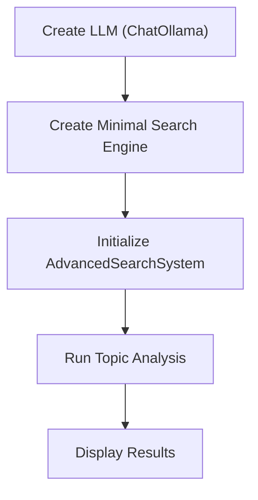
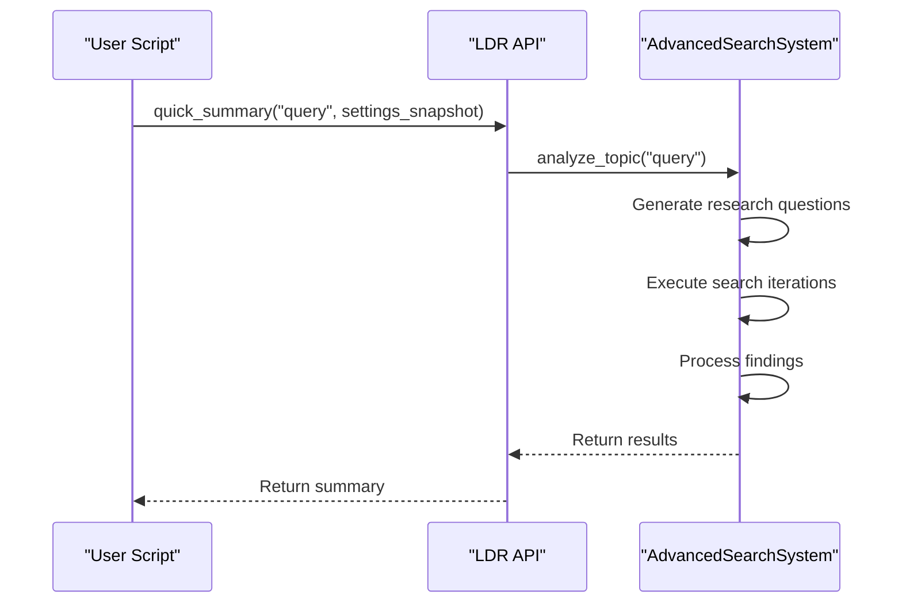
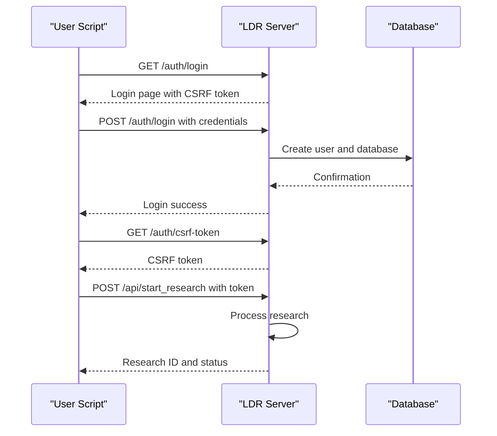
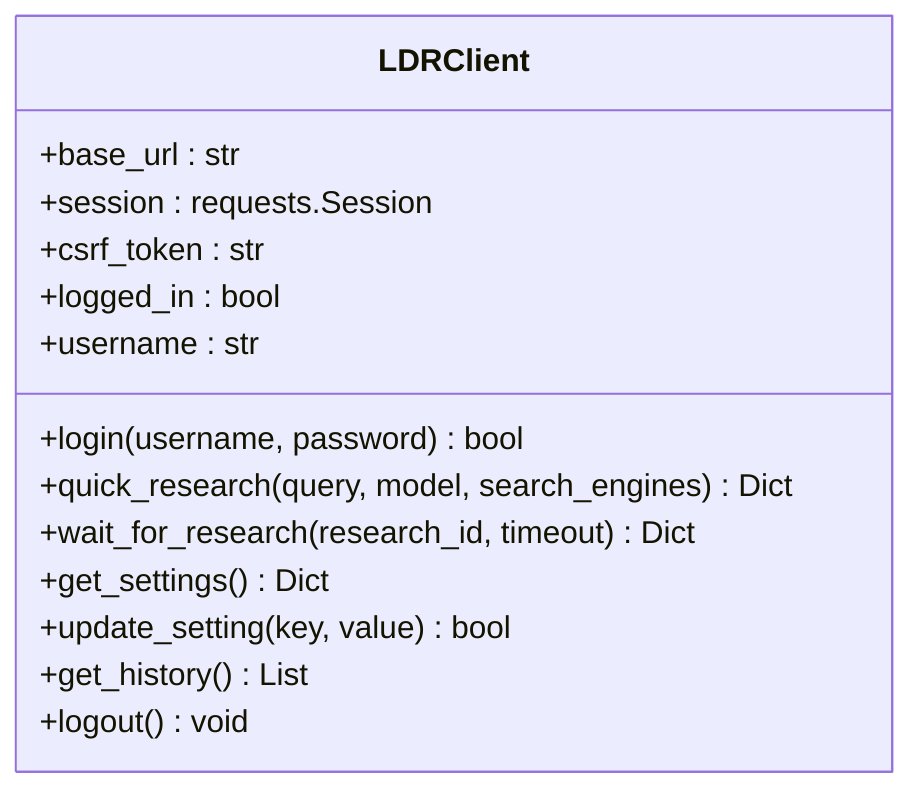
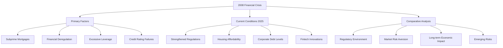
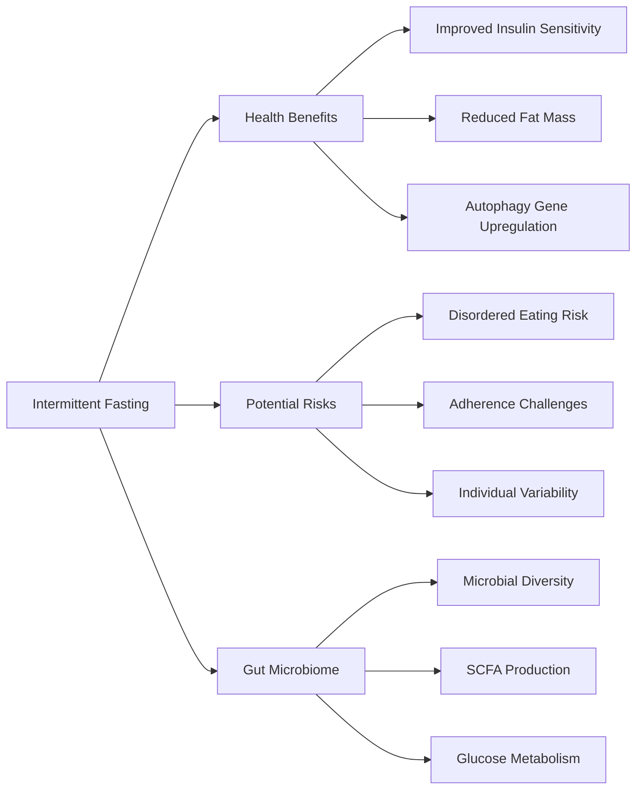
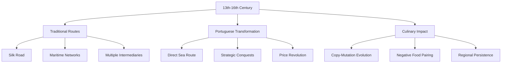

# Basic Research Examples

<cite>
**Referenced Files in This Document**   
- [minimal_working_example.py](file://examples/api_usage/programmatic/minimal_working_example.py)
- [simple_client_example.py](file://examples/api_usage/simple_client_example.py)
- [simple_working_example.py](file://examples/api_usage/http/simple_working_example.py)
- [client.py](file://src/local_deep_research/api/client.py)
- [search_system.py](file://src/local_deep_research/search_system.py)
- [simple_programmatic_example.py](file://examples/api_usage/programmatic/simple_programmatic_example.py)
- [README.md](file://examples/api_usage/programmatic/README.md)
- [README.md](file://examples/api_usage/http/README.md)
- [README.md](file://examples/api_usage/README.md)
- [2008-finicial-crisis.md](file://examples/2008-finicial-crisis.md)
- [medical_topic.md](file://examples/medical_topic.md)
- [traditional-spice-trade-routes.md](file://examples/traditional-spice-trade-routes.md)
</cite>

## Table of Contents
1. [Introduction](#introduction)
2. [Programmatic API Usage](#programmatic-api-usage)
3. [HTTP API Usage](#http-api-usage)
4. [Example Research Topics](#example-research-topics)
5. [Troubleshooting Common Issues](#troubleshooting-common-issues)
6. [Conclusion](#conclusion)

## Introduction
This document provides comprehensive guidance for new users to understand and utilize the local-deep-research system through basic research examples. It covers step-by-step execution of simple queries using both programmatic and HTTP APIs, explaining the structure of minimal working examples, environment setup, client initialization, and result interpretation. The content is designed to be accessible to developers with minimal AI/LLM experience while establishing a foundation for more advanced topics. Real example topics such as financial crisis analysis, medical research, and historical trade routes are used to illustrate practical usage. The document also addresses common beginner mistakes and provides troubleshooting tips for initial setup issues.

## Programmatic API Usage

The programmatic API allows direct Python integration with the local-deep-research system, bypassing authentication requirements for development and testing purposes. This approach is ideal for developers who want to integrate research capabilities into their applications without managing HTTP requests and authentication flows.

### Minimal Working Example
The minimal working example demonstrates the core functionality without database dependencies. It creates a simple LLM and search engine to perform basic research.

**Diagram sources**
- [minimal_working_example.py](file://examples/api_usage/programmatic/minimal_working_example.py#L46-L84)

**Section sources**
- [minimal_working_example.py](file://examples/api_usage/programmatic/minimal_working_example.py#L1-L89)

### Simple Programmatic Example
The simple programmatic example showcases common API functions with practical implementations. It demonstrates the use of `quick_summary`, `detailed_research`, and `generate_report` functions with custom parameters.

**Diagram sources**
- [simple_programmatic_example.py](file://examples/api_usage/programmatic/simple_programmatic_example.py#L29-L87)
- [search_system.py](file://src/local_deep_research/search_system.py#L240-L271)

**Section sources**
- [simple_programmatic_example.py](file://examples/api_usage/programmatic/simple_programmatic_example.py#L1-L87)
- [client.py](file://src/local_deep_research/api/client.py#L1-L489)

### Key Parameters and Function Calls
The programmatic API provides several key functions for different research needs:

| Function | Purpose | Key Parameters |
|--------|---------|---------------|
| `quick_summary()` | Generate a quick research summary | query, settings_snapshot, search_tool, iterations |
| `detailed_research()` | Perform in-depth research with multiple iterations | query, settings_snapshot, search_strategy, iterations, questions_per_iteration |
| `generate_report()` | Create comprehensive markdown reports | query, output_file, searches_per_section, iterations |

The `settings_snapshot` parameter is crucial for programmatic mode, providing all necessary configuration without requiring database access. The `programmatic_mode=True` parameter explicitly bypasses authentication requirements.

**Section sources**
- [simple_programmatic_example.py](file://examples/api_usage/programmatic/simple_programmatic_example.py#L17-L24)
- [README.md](file://examples/api_usage/programmatic/README.md#L92-L101)

## HTTP API Usage

The HTTP API provides RESTful access to the local-deep-research system, requiring authentication and CSRF token handling. This approach is suitable for integration with applications written in any programming language.

### Simple Working Example
The simple working example demonstrates the complete HTTP API workflow, including automatic user creation, authentication, and research execution. It handles all CSRF complexity internally and works completely out of the box.

**Diagram sources**
- [simple_working_example.py](file://examples/api_usage/http/simple_working_example.py#L207-L266)

**Section sources**
- [simple_working_example.py](file://examples/api_usage/http/simple_working_example.py#L1-L266)
- [README.md](file://examples/api_usage/http/README.md#L20-L35)

### Client-Based Approach
The client-based approach simplifies HTTP API usage by handling authentication and CSRF tokens automatically. The `LDRClient` class provides a convenient interface for interacting with the API.

**Diagram sources**
- [client.py](file://src/local_deep_research/api/client.py#L65-L459)

**Section sources**
- [simple_client_example.py](file://examples/api_usage/simple_client_example.py#L1-L132)
- [client.py](file://src/local_deep_research/api/client.py#L1-L489)

### Authentication and CSRF Handling
The HTTP API requires proper authentication and CSRF token handling to prevent cross-site request forgery attacks. The process involves three main steps:

1. **Login**: Retrieve the login page to extract the CSRF token from the HTML form
2. **Authentication**: Submit login credentials with the extracted CSRF token
3. **API Access**: Obtain a CSRF token for subsequent API requests from the `/auth/csrf-token` endpoint

The `LDRClient` class automates this process, making it easier to integrate with the API.

**Section sources**
- [simple_client_example.py](file://examples/api_usage/simple_client_example.py#L16-L132)
- [client.py](file://src/local_deep_research/api/client.py#L90-L159)

## Example Research Topics

The local-deep-research system can handle a wide range of research topics, from financial analysis to medical research and historical studies. These examples demonstrate the system's capabilities and provide templates for similar queries.

### Financial Crisis Analysis
The 2008 financial crisis research example analyzes economic factors contributing to the crisis and compares them to current conditions. It examines subprime mortgage proliferation, financial deregulation, excessive risk-taking, and complex derivatives trading.

**Diagram sources**
- [2008-finicial-crisis.md](file://examples/2008-finicial-crisis.md#L1-L749)

**Section sources**
- [2008-finicial-crisis.md](file://examples/2008-finicial-crisis.md#L1-L749)

### Medical Research
The medical research example compares intermittent fasting and calorie restriction diets, examining their health benefits, risks, and effects on the gut microbiome. It analyzes recent clinical trials and meta-analyses from 2023-2025.

**Diagram sources**
- [medical_topic.md](file://examples/medical_topic.md#L1-L330)

**Section sources**
- [medical_topic.md](file://examples/medical_topic.md#L1-L330)

### Historical Trade Routes
The historical trade routes example examines the evolution of spice trade routes between Europe and Asia from the 13th to 16th centuries. It analyzes the impact of Vasco da Gama's voyage and the transformation of trade networks.

**Diagram sources**
- [traditional-spice-trade-routes.md](file://examples/traditional-spice-trade-routes.md#L1-L569)

**Section sources**
- [traditional-spice-trade-routes.md](file://examples/traditional-spice-trade-routes.md#L1-L569)

## Troubleshooting Common Issues

This section addresses common beginner mistakes and provides solutions for initial setup issues encountered when using the local-deep-research system.

### Environment Setup Issues
Common environment setup issues include missing dependencies, incorrect LLM configuration, and network connectivity problems.

**Common Issues and Solutions:**
- **"No settings context available" Error**: Ensure `settings_snapshot` and `programmatic_mode=True` are passed to all API functions
- **Ollama Connection Error**: Verify Ollama is running and the correct URL is configured in environment variables
- **SearXNG Connection Error**: Start a SearXNG instance or use the fallback configuration
- **Model Not Available**: Pull required models using `ollama pull` command

**Section sources**
- [README.md](file://examples/api_usage/programmatic/README.md#L204-L225)
- [README.md](file://examples/api_usage/http/README.md#L124-L147)

### Authentication Problems
Authentication issues typically occur when using the HTTP API and involve CSRF token handling or user creation.

**Authentication Troubleshooting:**
- **Cannot connect to server**: Start the LDR server using `python -m local_deep_research.web.app`
- **Authentication failed**: The examples should create users automatically; check server logs if this fails
- **CSRF token issues**: Ensure proper sequence of requests: login page → login with CSRF → get API CSRF token
- **Session cookie problems**: The system only works with localhost connections for security reasons

**Section sources**
- [simple_working_example.py](file://examples/api_usage/http/simple_working_example.py#L1-L266)
- [README.md](file://examples/api_usage/http/README.md#L124-L147)

### Performance and Timeout Issues
Research queries may take several minutes to complete, and users might encounter timeout issues.

**Performance Tips:**
- Monitor progress in server logs using `tail -f /tmp/ldr_server.log`
- Use context managers to ensure proper cleanup of resources
- Start with simple queries before attempting complex research
- Check that required models are available in Ollama
- Verify network connectivity between components

**Section sources**
- [README.md](file://examples/api_usage/http/README.md#L149-L153)
- [simple_working_example.py](file://examples/api_usage/http/simple_working_example.py#L207-L266)

## Conclusion
This document has provided a comprehensive introduction to the local-deep-research system through basic research examples. It has covered both programmatic and HTTP API usage, demonstrating step-by-step execution of simple queries. The examples show how to set up the environment, initialize clients, and interpret results using real-world topics like financial crisis analysis, medical research, and historical trade routes. The troubleshooting section addresses common beginner issues, helping new users overcome initial setup challenges. By following these examples, developers with minimal AI/LLM experience can quickly start using the system and build a foundation for more advanced research workflows. The local-deep-research system offers flexible integration options through both direct Python API access and HTTP RESTful interfaces, making it accessible for various use cases and development environments.