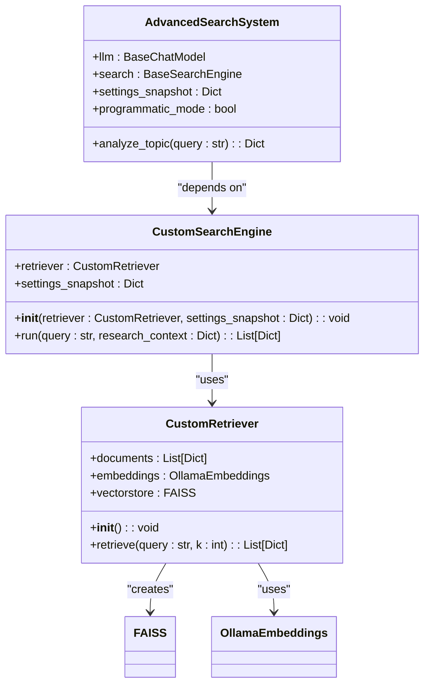
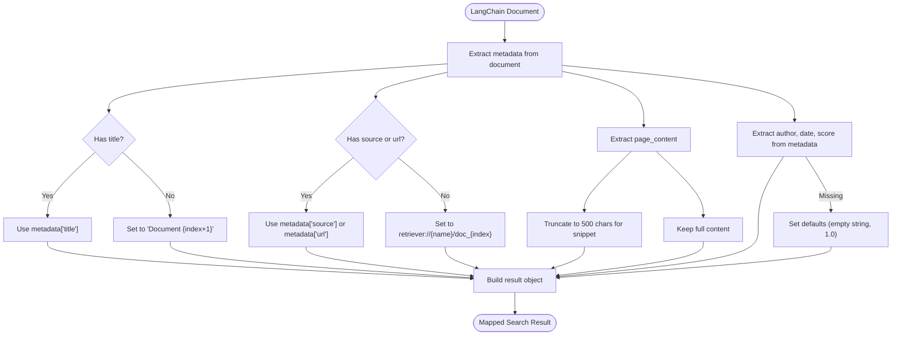
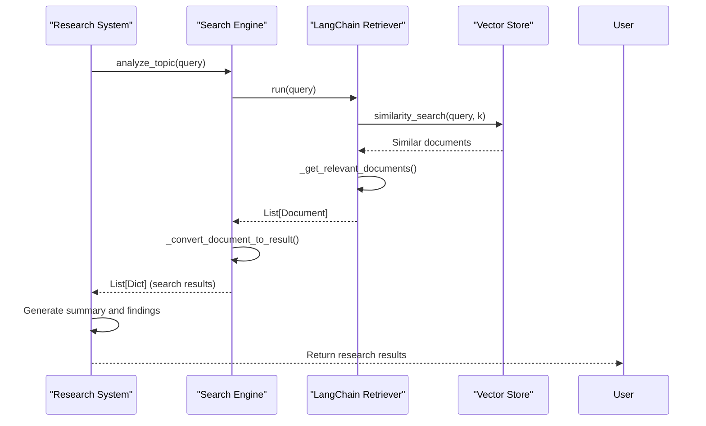
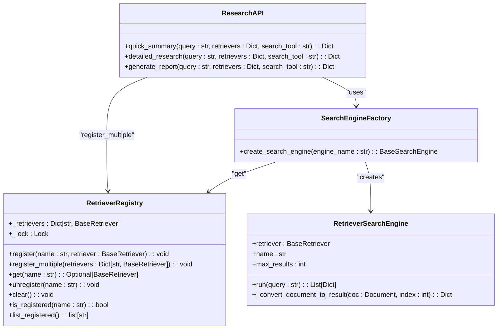
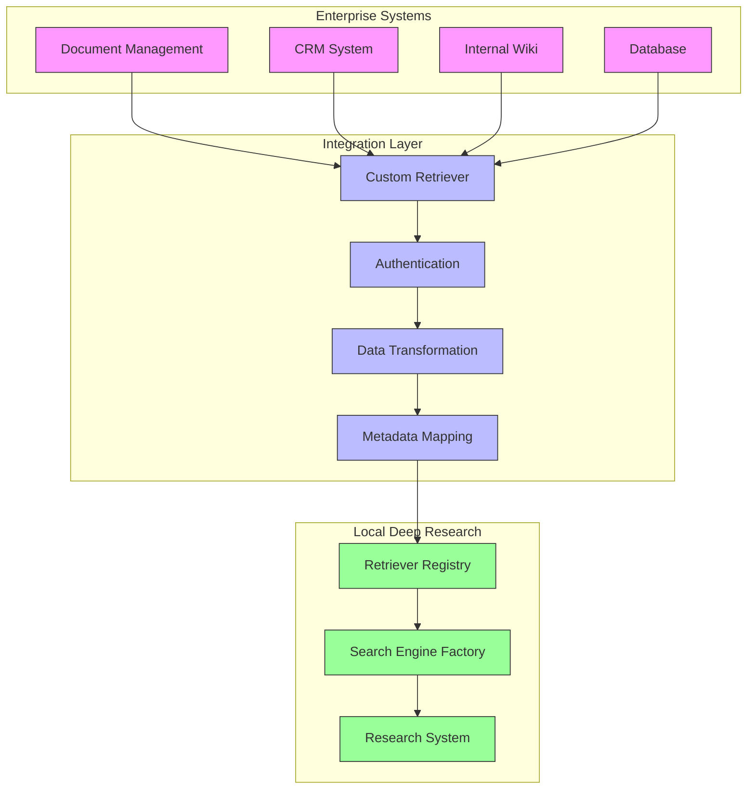

# Framework Integration Examples

<cite>
**Referenced Files in This Document**   
- [custom_llm_retriever_example.py](file://examples/api_usage/programmatic/custom_llm_retriever_example.py)
- [retriever_registry.py](file://src/local_deep_research/web_search_engines/retriever_registry.py)
- [LANGCHAIN_RETRIEVER_INTEGRATION.md](file://docs/LANGCHAIN_RETRIEVER_INTEGRATION.md)
- [test_custom_langchain_retriever.py](file://tests/langchain_integration/test_custom_langchain_retriever.py)
- [test_api_integration.py](file://tests/retriever_integration/test_api_integration.py)
- [search_engine_retriever.py](file://src/local_deep_research/web_search_engines/engines/search_engine_retriever.py)
- [research_functions.py](file://src/local_deep_research/api/research_functions.py)
- [search_engine_factory.py](file://src/local_deep_research/web_search_engines/search_engine_factory.py)
- [search_system.py](file://src/local_deep_research/search_system.py)
</cite>

## Table of Contents
1. [Introduction](#introduction)
2. [Retriever Interface Implementation](#retriever-interface-implementation)
3. [Document Schema Mapping](#document-schema-mapping)
4. [Query Translation Patterns](#query-translation-patterns)
5. [Integration with LangChain Retriever System](#integration-with-langchain-retriever-system)
6. [Enterprise Knowledge Base Integration](#enterprise-knowledge-base-integration)
7. [Bidirectional Integration Patterns](#bidirectional-integration-patterns)
8. [Common Integration Challenges](#common-integration-challenges)
9. [Testing and Validation Strategies](#testing-and-validation-strategies)
10. [Conclusion](#conclusion)

## Introduction

This document provides comprehensive guidance on integrating the local-deep-research framework with external AI frameworks, particularly LangChain. The integration enables users to leverage custom retrieval systems within the research workflow, combining internal knowledge bases with external search capabilities. The documentation focuses on practical implementation details, covering the retriever interface, document schema mapping, query translation, and enterprise integration patterns. The examples demonstrate how to extend the system's capabilities while maintaining compatibility with existing features and workflows.

**Section sources**
- [custom_llm_retriever_example.py](file://examples/api_usage/programmatic/custom_llm_retriever_example.py#L1-L208)
- [LANGCHAIN_RETRIEVER_INTEGRATION.md](file://docs/LANGCHAIN_RETRIEVER_INTEGRATION.md#L1-L164)

## Retriever Interface Implementation

The retriever interface implementation follows LangChain's BaseRetriever pattern, allowing seamless integration with the local-deep-research system. The CustomRetriever class in the example demonstrates the core components required for a functional retriever. It initializes with sample documents and creates embeddings using OllamaEmbeddings, storing them in a FAISS vector store for efficient similarity search. The retrieve method implements the core logic, accepting a query string and returning results in the expected format.

The implementation uses LangChain's Document class to represent search results, ensuring compatibility with the framework's ecosystem. Each document includes page_content for the main text and metadata for additional information such as title, source, and topic classification. The retrieve method performs vector similarity search using the query, then converts the results to the local-deep-research format with fields like title, link, snippet, and full_content.

The CustomSearchEngine adapter class bridges the custom retriever with the local-deep-research search system. It implements the run method expected by the search system, delegating to the retriever's retrieve method. This adapter pattern allows the custom retriever to work within the existing architecture without requiring modifications to the core search system.



**Diagram sources **
- [custom_llm_retriever_example.py](file://examples/api_usage/programmatic/custom_llm_retriever_example.py#L27-L118)

**Section sources**
- [custom_llm_retriever_example.py](file://examples/api_usage/programmatic/custom_llm_retriever_example.py#L27-L118)
- [test_custom_langchain_retriever.py](file://tests/langchain_integration/test_custom_langchain_retriever.py#L23-L86)

## Document Schema Mapping

Document schema mapping is critical for ensuring compatibility between LangChain retrievers and the local-deep-research system. The RetrieverSearchEngine class handles the conversion from LangChain's Document format to the local-deep-research search result format. This conversion occurs in the _convert_document_to_result method, which maps LangChain document properties to the expected fields in the search results.

The mapping process extracts metadata from the LangChain Document and populates the corresponding fields in the local-deep-research result structure. Key mappings include:
- title: Extracted from metadata["title"] or defaults to "Document {index + 1}"
- url: Extracted from metadata["source"] or metadata["url"], with a fallback to a retriever-specific URL
- snippet: First 500 characters of the page_content
- full_content: Complete page_content from the document
- author, date, score: Extracted from metadata if available
- metadata: Preserved as-is for flexibility
- source: Set to the retriever's name
- retriever_type: Set to the retriever class name

The implementation handles edge cases such as missing metadata by providing sensible defaults. For example, when metadata is empty, the title defaults to "Document {index + 1}" and the URL follows the pattern "retriever://{retriever_name}/doc_{index}". The score defaults to 1.0 when not specified in the metadata.



**Diagram sources **
- [search_engine_retriever.py](file://src/local_deep_research/web_search_engines/engines/search_engine_retriever.py#L74-L112)

**Section sources**
- [search_engine_retriever.py](file://src/local_deep_research/web_search_engines/engines/search_engine_retriever.py#L74-L112)
- [test_search_engine_retriever.py](file://tests/retriever_integration/test_search_engine_retriever.py#L88-L117)

## Query Translation Patterns

Query translation patterns in the integration system handle the transformation of queries between the local-deep-research system and LangChain retrievers. The system uses a direct pass-through approach for query translation, where the original query is passed unchanged to the retriever. This approach maintains the integrity of the user's intent while allowing the retriever to apply its own query processing logic.

The CustomRetriever implementation demonstrates basic query processing through keyword matching in the _get_relevant_documents method. It converts both the query and document content to lowercase and checks for the presence of query words in the document text. This simple approach serves as a foundation that can be extended with more sophisticated techniques such as semantic similarity, vector search, or hybrid methods.

The integration supports multiple query translation strategies through the search system's configuration. The settings_snapshot parameter allows users to specify search parameters such as iterations, questions_per_iteration, and search.strategy. These settings influence how queries are generated and processed throughout the research workflow. For example, the "source-based" strategy focuses on finding and extracting from sources, while the "iterative" strategy uses loop-based reasoning with persistent knowledge.

The system also supports meta search configurations that combine multiple retrievers and search engines. In this pattern, queries are distributed across multiple sources, and results are aggregated and ranked. The meta_search_config parameter allows users to specify which retrievers and engines to use, enabling complex query routing patterns.



**Diagram sources **
- [research_functions.py](file://src/local_deep_research/api/research_functions.py#L23-L146)
- [search_system.py](file://src/local_deep_research/search_system.py#L25-L200)

**Section sources**
- [custom_llm_retriever_example.py](file://examples/api_usage/programmatic/custom_llm_retriever_example.py#L81-L105)
- [test_custom_langchain_retriever.py](file://tests/langchain_integration/test_custom_langchain_retriever.py#L65-L85)

## Integration with LangChain Retriever System

The integration with LangChain's retriever system is facilitated by the RetrieverRegistry, which provides a thread-safe mechanism for registering and accessing retrievers. The registry allows users to programmatically register retrievers and use them as search engines within the local-deep-research system. This design enables dynamic configuration without requiring changes to the core system.

The RetrieverRegistry class implements standard CRUD operations for retriever management:
- register: Add a single retriever with a name
- register_multiple: Add multiple retrievers at once
- get: Retrieve a registered retriever by name
- unregister: Remove a retriever from the registry
- clear: Remove all registered retrievers
- is_registered: Check if a retriever is registered
- list_registered: Get a list of all registered retriever names

The integration process begins in the _init_search_system function, which checks for provided retrievers and registers them with the global retriever_registry instance. This registration makes the retrievers available to the search engine factory, which creates the appropriate search engine wrapper. The search_engine_factory.py file contains the logic that detects registered retrievers and creates RetrieverSearchEngine instances for them.

The API functions (quick_summary, detailed_research, generate_report) accept a retrievers parameter, which is a dictionary of {name: retriever} pairs. When these functions are called, they pass the retrievers to _init_search_system, which handles the registration and integration process. The search_tool parameter specifies which retriever to use, with "auto" indicating that all registered retrievers should be used.



**Diagram sources **
- [retriever_registry.py](file://src/local_deep_research/web_search_engines/retriever_registry.py#L12-L109)
- [search_engine_factory.py](file://src/local_deep_research/web_search_engines/search_engine_factory.py#L60-L70)

**Section sources**
- [retriever_registry.py](file://src/local_deep_research/web_search_engines/retriever_registry.py#L12-L109)
- [test_api_integration.py](file://tests/retriever_integration/test_api_integration.py#L74-L80)
- [research_functions.py](file://src/local_deep_research/api/research_functions.py#L70-L78)

## Enterprise Knowledge Base Integration

Enterprise knowledge base integration extends the basic retriever pattern to handle organizational requirements such as security, scalability, and data governance. The system supports various enterprise-grade retrievers including vector databases (FAISS, Chroma, Pinecone), cloud services (Vertex AI, AWS Bedrock), and traditional databases (PostgreSQL, MongoDB).

For enterprise deployments, the integration supports complex configurations through environment variables and settings snapshots. Users can configure proxy settings, authentication, and other enterprise requirements before creating their retrievers. The example demonstrates this with environment variable setup for proxy configuration before creating a VertexAI retriever.

The system handles enterprise integration through several key patterns:
1. **Secure Configuration**: Sensitive information like API keys and endpoints are managed through environment variables or secure configuration stores.
2. **Hybrid Search**: Combines internal knowledge bases with external web search for comprehensive results.
3. **Selective Usage**: Allows organizations to maintain multiple knowledge bases and select the appropriate one for each query.
4. **Metadata Enrichment**: Preserves rich metadata from enterprise systems, including author, date, department, and custom fields.

The testing framework includes examples of enterprise integration patterns, such as the CompanyKnowledgeRetriever that simulates an internal knowledge base with domain-specific documents. This pattern can be extended to connect with actual enterprise systems like document management platforms, CRM systems, or internal wikis.



**Diagram sources **
- [LANGCHAIN_RETRIEVER_INTEGRATION.md](file://docs/LANGCHAIN_RETRIEVER_INTEGRATION.md#L107-L135)
- [test_combined_llm_retriever.py](file://tests/langchain_integration/test_combined_llm_retriever.py#L23-L82)

**Section sources**
- [LANGCHAIN_RETRIEVER_INTEGRATION.md](file://docs/LANGCHAIN_RETRIEVER_INTEGRATION.md#L58-L84)
- [test_combined_llm_retriever.py](file://tests/langchain_integration/test_combined_llm_retriever.py#L23-L107)

## Bidirectional Integration Patterns

Bidirectional integration patterns enable the local-deep-research system to function both as a LangChain tool and as a provider of standard interfaces. The system can be used within LangChain workflows as a retriever, while also exposing its capabilities through standard APIs that can be consumed by other systems.

As a LangChain tool, the local-deep-research system can be wrapped in a custom retriever that delegates to its research functions. This allows LangChain applications to leverage the system's advanced research capabilities, including iterative questioning, source-based strategies, and comprehensive analysis. The CustomSearchEngine adapter pattern demonstrates how to bridge between different system architectures.

As a service provider, the system exposes its capabilities through programmatic APIs that return structured results. These APIs can be consumed by external systems, enabling integration with enterprise workflows, dashboards, and other applications. The quick_summary, detailed_research, and generate_report functions provide different levels of detail and analysis, allowing consumers to choose the appropriate level of processing.

The bidirectional pattern supports hybrid workflows where the system both consumes external retrievers and provides its own capabilities to external systems. This creates a flexible ecosystem where knowledge can flow in both directions, combining internal expertise with external research capabilities.

```mermaid
graph TD
subgraph "LangChain Ecosystem"
A[LangChain Application]
B[LangChain Agents]
C[LangChain Chains]
end
subgraph "Local Deep Research"
D[Research System]
E[Retriever Registry]
F[API Functions]
end
subgraph "External Systems"
G[Enterprise Applications]
H[Web Services]
I[Data Pipelines]
end
A --> D : "Uses as retriever"
B --> D : "Uses as tool"
C --> D : "Uses in chain"
D --> E : "Registers retrievers"
D --> F : "Provides API"
F --> G : "Returns results"
F --> H : "Returns results"
F --> I : "Returns results"
style A fill:#f9f,stroke:#333
style B fill:#f9f,stroke:#333
style C fill:#f9f,stroke:#333
style D fill:#9f9,stroke:#333
style E fill:#9f9,stroke:#333
style F fill:#9f9,stroke:#333
style G fill:#f9f,stroke:#333
style H fill:#f9f,stroke:#333
style I fill:#f9f,stroke:#333
```

**Diagram sources **
- [custom_llm_retriever_example.py](file://examples/api_usage/programmatic/custom_llm_retriever_example.py#L120-L203)
- [research_functions.py](file://src/local_deep_research/api/research_functions.py#L149-L200)

**Section sources**
- [custom_llm_retriever_example.py](file://examples/api_usage/programmatic/custom_llm_retriever_example.py#L120-L203)
- [test_custom_langchain_retriever.py](file://tests/langchain_integration/test_custom_langchain_retriever.py#L322-L347)

## Common Integration Challenges

Common integration challenges include data format compatibility, error propagation, and performance overhead. The system addresses these challenges through robust design patterns and comprehensive error handling.

Data format compatibility is managed through the document schema mapping process, which converts between LangChain's Document format and the local-deep-research search result format. The system handles missing or malformed data gracefully, providing sensible defaults and logging warnings when necessary. For example, when metadata is missing, the system generates default titles and URLs rather than failing.

Error propagation is handled through comprehensive exception handling at multiple levels. The RetrieverSearchEngine wraps retriever calls in try-except blocks, returning empty results on error rather than propagating exceptions. This prevents a single failing retriever from disrupting the entire research process. The system logs detailed error information for debugging while maintaining a consistent interface for callers.

Performance overhead is minimized through several optimizations:
- **Caching**: Results are cached to avoid redundant retriever calls
- **Parallel Execution**: Multiple retrievers can be queried simultaneously
- **Result Limiting**: The max_results parameter limits the number of results processed
- **Selective Retrieval**: The search_tool parameter allows targeting specific retrievers

The system also provides configuration options to control performance characteristics, such as disabling rate limiting for custom setups and configuring the number of iterations and questions per iteration. These settings allow users to balance thoroughness with performance requirements.

**Section sources**
- [test_search_engine_retriever.py](file://tests/retriever_integration/test_search_engine_retriever.py#L175-L194)
- [test_custom_langchain_retriever.py](file://tests/langchain_integration/test_custom_langchain_retriever.py#L349-L378)

## Testing and Validation Strategies

Testing and validation strategies ensure the reliability and correctness of framework integrations. The system includes comprehensive test coverage for retriever integration, with tests for basic usage, multiple retrievers, hybrid search, error handling, and metadata preservation.

The test suite uses mocking to isolate components and verify behavior without external dependencies. For example, the TestCustomLangChainRetriever class uses Mock objects for the LLM and random number generation, allowing deterministic testing of the retriever integration. The tests verify that results contain expected content, sources come from the correct retriever, and metadata is preserved.

Validation strategies include:
- **Unit Tests**: Verify individual components in isolation
- **Integration Tests**: Verify the interaction between components
- **End-to-End Tests**: Verify the complete research workflow
- **Error Handling Tests**: Verify graceful degradation on failure
- **Performance Tests**: Verify response times and resource usage

The testing framework also includes examples of test retrievers that can be used to validate integration points. The TestRetriever example in the documentation demonstrates how to create a simple retriever for testing purposes, returning predefined documents based on the query.

**Section sources**
- [test_custom_langchain_retriever.py](file://tests/langchain_integration/test_custom_langchain_retriever.py#L97-L469)
- [test_api_integration.py](file://tests/retriever_integration/test_api_integration.py#L61-L263)

## Conclusion

The framework integration examples demonstrate a robust and flexible approach to connecting local-deep-research with external AI frameworks like LangChain. The system provides a comprehensive solution for custom retriever integration, supporting various enterprise knowledge base patterns and bidirectional integration scenarios. Key strengths include the thread-safe retriever registry, comprehensive document schema mapping, and support for hybrid search patterns that combine internal and external sources.

The integration design prioritizes compatibility, performance, and ease of use, allowing organizations to extend the system's capabilities without modifying its core architecture. The comprehensive testing framework ensures reliability and provides guidance for validating custom integrations. By following the patterns demonstrated in this documentation, users can create powerful research workflows that leverage both internal expertise and external knowledge sources.