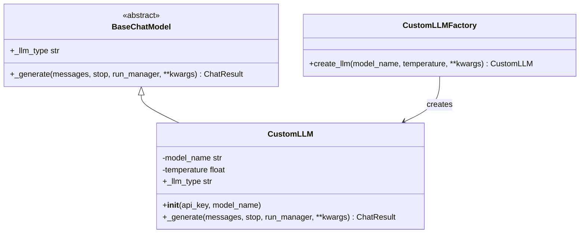
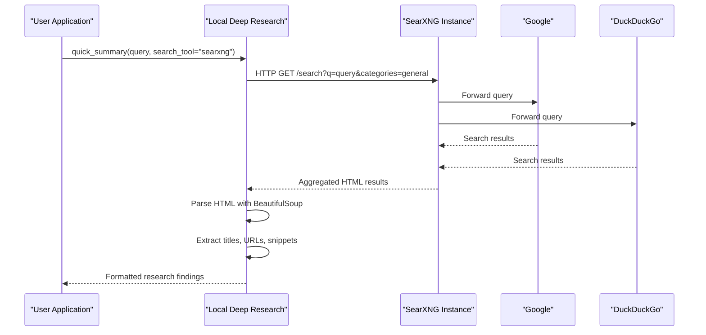
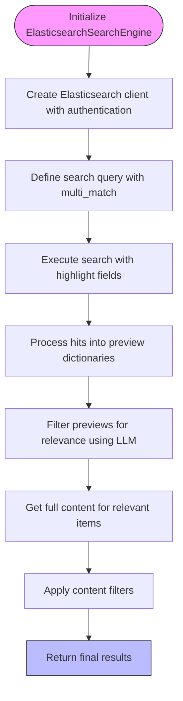
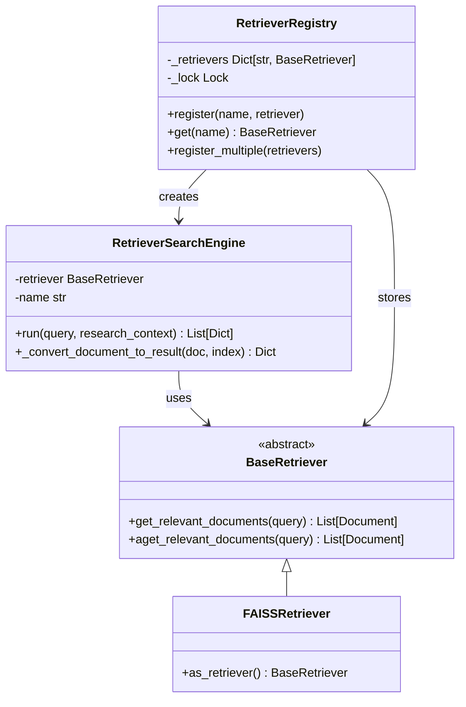
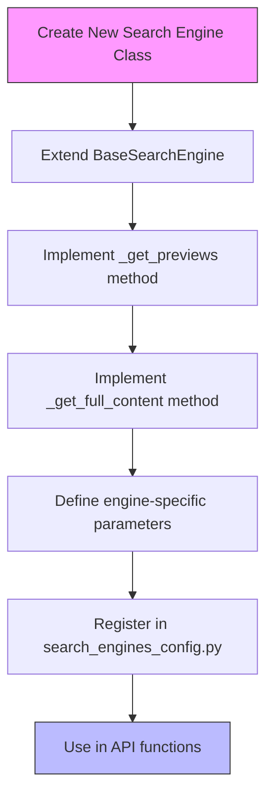
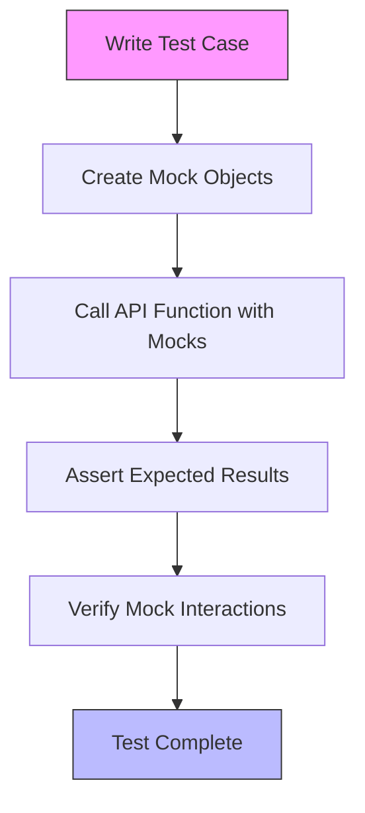

# Integration Examples

<cite>
**Referenced Files in This Document**   
- [custom_llm_retriever_example.py](file://examples/api_usage/programmatic/custom_llm_retriever_example.py)
- [basic_custom_llm.py](file://examples/llm_integration/basic_custom_llm.py)
- [searxng_example.py](file://examples/api_usage/programmatic/searxng_example.py)
- [search_example.py](file://examples/elasticsearch/search_example.py)
- [CUSTOM_LLM_INTEGRATION.md](file://docs/CUSTOM_LLM_INTEGRATION.md)
- [LANGCHAIN_RETRIEVER_INTEGRATION.md](file://docs/LANGCHAIN_RETRIEVER_INTEGRATION.md)
- [SearXNG-Setup.md](file://docs/SearXNG-Setup.md)
- [elasticsearch_search_engine.md](file://docs/elasticsearch_search_engine.md)
- [search_engine_searxng.py](file://src/local_deep_research/web_search_engines/engines/search_engine_searxng.py)
- [search_engine_elasticsearch.py](file://src/local_deep_research/web_search_engines/engines/search_engine_elasticsearch.py)
- [search_engine_base.py](file://src/local_deep_research/web_search_engines/search_engine_base.py)
- [search_engine_factory.py](file://src/local_deep_research/web_search_engines/search_engine_factory.py)
- [es_utils.py](file://src/local_deep_research/utilities/es_utils.py)
- [retriever_registry.py](file://src/local_deep_research/web_search_engines/retriever_registry.py)
- [search_engine_retriever.py](file://src/local_deep_research/web_search_engines/engines/search_engine_retriever.py)
</cite>

## Table of Contents
1. [Custom LLM Provider Integration](#custom-llm-provider-integration)
2. [SearXNG Integration for Privacy-Focused Web Search](#searxng-integration-for-privacy-focused-web-search)
3. [Elasticsearch Integration for Enhanced Search](#elasticsearch-integration-for-enhanced-search)
4. [LangChain Retriever Integration Patterns](#langchain-retriever-integration-patterns)
5. [Extending the System with New Search Engines and LLM Providers](#extending-the-system-with-new-search-engines-and-llm-providers)
6. [Common Integration Challenges](#common-integration-challenges)
7. [Testing and Validation Guidelines](#testing-and-validation-guidelines)

## Custom LLM Provider Integration

The local-deep-research system provides a flexible framework for integrating custom LLM providers, allowing users to leverage proprietary models, fine-tuned instances, or specialized LLM wrappers. The integration is built on the LangChain `BaseChatModel` interface, ensuring compatibility with a wide range of LLM implementations.

The core integration pattern involves either passing a direct LLM instance or a factory function to the system's API functions. The `llms` parameter in functions like `quick_summary`, `detailed_research`, and `generate_report` accepts a dictionary where keys are provider names and values are either LLM instances or callable factory functions. When a factory function is used, it receives all parameters from the API call, enabling dynamic configuration of the LLM based on the research context.

**Diagram sources**
- [basic_custom_llm.py](file://examples/llm_integration/basic_custom_llm.py#L17-L48)
- [CUSTOM_LLM_INTEGRATION.md](file://docs/CUSTOM_LLM_INTEGRATION.md#L49-L84)

The system's implementation handles the registration and lifecycle of custom LLMs. When an API function is called with a `llms` dictionary, the provided LLMs are registered in a global, thread-safe registry. During LLM creation, the system first checks if the requested provider name matches a registered custom LLM. If the registered object is callable, it is treated as a factory function and invoked with the provided parameters. All LLMs, whether custom or built-in, are wrapped with utility functions for think-tag removal and token counting.

Advanced integration patterns include creating LLMs with specialized behaviors, such as retry logic, rate limiting, or domain-specific expertise. For example, a `RetryLLM` wrapper can be implemented to add exponential backoff to any base LLM, while a `DomainExpertLLM` can be configured to provide responses with a specific tone or focus based on its domain parameter. Factory functions can also be used to create complex configurations, such as a retry wrapper around a configurable LLM, by nesting configuration dictionaries.

**Section sources**
- [basic_custom_llm.py](file://examples/llm_integration/basic_custom_llm.py)
- [advanced_custom_llm.py](file://examples/llm_integration/advanced_custom_llm.py)
- [CUSTOM_LLM_INTEGRATION.md](file://docs/CUSTOM_LLM_INTEGRATION.md)

## SearXNG Integration for Privacy-Focused Web Search

Integrating SearXNG with the local-deep-research system enables privacy-focused web search by aggregating results from multiple search engines while protecting user data. SearXNG acts as a meta-search engine, forwarding queries to backend engines like Google, Bing, and DuckDuckGo, and returning a unified result set without tracking the user.

The integration requires explicit configuration of a SearXNG instance URL, which can be provided via environment variables or configuration files. By default, the SearXNG search engine is disabled until an instance URL is configured, ensuring that the system does not attempt to use public instances without explicit user consent. The recommended approach is to self-host a SearXNG instance using Docker, which provides full control over the search experience and ensures ethical usage.

**Diagram sources**
- [searxng_example.py](file://examples/api_usage/programmatic/searxng_example.py#L25-L176)
- [search_engine_searxng.py](file://src/local_deep_research/web_search_engines/engines/search_engine_searxng.py#L56-L588)

The `SearXNGSearchEngine` class implements the integration by extending the `BaseSearchEngine` class. It uses the `safe_get` utility to make HTTP requests to the SearXNG instance, with built-in support for private network IPs to accommodate self-hosted deployments. The engine respects rate limiting by enforcing a configurable delay between requests, which helps prevent overloading the SearXNG instance or its backend engines.

Query formatting is handled through a set of parameters that map directly to SearXNG's API. These include the search query, categories (e.g., general, science), engines (e.g., google, duckduckgo), language, time range, and safe search level. The results are returned in HTML format and parsed using BeautifulSoup to extract titles, URLs, and snippets. The engine includes robust error handling to filter out invalid results, such as error pages or internal SearXNG URLs, ensuring that only valid search results are returned to the research system.

**Section sources**
- [searxng_example.py](file://examples/api_usage/programmatic/searxng_example.py)
- [search_engine_searxng.py](file://src/local_deep_research/web_search_engines/engines/search_engine_searxng.py)
- [SearXNG-Setup.md](file://docs/SearXNG-Setup.md)

## Elasticsearch Integration for Enhanced Search

The Elasticsearch integration extends the local-deep-research system with powerful full-text search capabilities, enabling efficient querying of large document collections. This integration is particularly useful for enterprise knowledge bases, technical documentation, or any scenario requiring fast and accurate retrieval from structured or unstructured text data.

The integration is implemented through the `ElasticsearchSearchEngine` class, which extends the `BaseSearchEngine` class and provides a two-phase retrieval approach. In the first phase, the engine retrieves preview information (titles, snippets) for a large number of documents using Elasticsearch's search API. In the second phase, it fetches the full content for only the relevant documents, optimizing performance and resource usage.

**Diagram sources**
- [search_example.py](file://examples/elasticsearch/search_example.py#L26-L178)
- [search_engine_elasticsearch.py](file://src/local_deep_research/web_search_engines/engines/search_engine_elasticsearch.py#L11-L363)

The `ElasticsearchManager` utility class simplifies the process of indexing data into Elasticsearch. It provides methods for creating indices with custom mappings and settings, indexing individual documents, bulk indexing multiple documents, and indexing files and directories. The manager uses LangChain's document loaders to extract text content and metadata from various file formats, making it easy to build a searchable knowledge base from existing documents.

For advanced search capabilities, the integration supports both Elasticsearch Query String syntax and Domain Specific Language (DSL) queries. The `search_by_query_string` method allows users to perform complex searches using a simple query string, while the `search_by_dsl` method provides full access to Elasticsearch's powerful query DSL. This flexibility enables users to implement sophisticated search logic, such as boolean queries, range queries, and nested queries, directly within the research workflow.

**Section sources**
- [search_example.py](file://examples/elasticsearch/search_example.py)
- [search_engine_elasticsearch.py](file://src/local_deep_research/web_search_engines/engines/search_engine_elasticsearch.py)
- [es_utils.py](file://src/local_deep_research/utilities/es_utils.py)
- [elasticsearch_search_engine.md](file://docs/elasticsearch_search_engine.md)

## LangChain Retriever Integration Patterns

The local-deep-research system supports seamless integration with any LangChain retriever, allowing users to leverage vector stores, databases, or custom retrieval implementations as search engines. This integration is facilitated by the `RetrieverRegistry`, a thread-safe registry that allows retrievers to be dynamically registered and used within the research system.

The integration pattern is straightforward: users create a LangChain retriever instance, register it with the `retriever_registry` under a unique name, and then use that name as the `search_tool` parameter in API functions. The system automatically wraps the retriever with the `RetrieverSearchEngine` class, which converts the LangChain `Document` objects into the local-deep-research result format and handles the two-phase retrieval process.

**Diagram sources**
- [custom_llm_retriever_example.py](file://examples/api_usage/programmatic/custom_llm_retriever_example.py#L27-L105)
- [retriever_registry.py](file://src/local_deep_research/web_search_engines/retriever_registry.py#L12-L110)
- [search_engine_retriever.py](file://src/local_deep_research/web_search_engines/engines/search_engine_retriever.py#L14-L197)

The `RetrieverSearchEngine` class implements the conversion from LangChain's `Document` format to the local-deep-research result format. It extracts the title, URL, and snippet from the document's metadata and content, and includes additional fields such as author, date, and score if available. The engine also supports async retrieval through the `arun` method, which uses the retriever's `aget_relevant_documents` method if available, or falls back to the sync version.

Advanced integration patterns include combining multiple retrievers for different document types, such as a technical documentation retriever and a business strategy retriever, and using meta search to aggregate results from both custom retrievers and web search engines. This hybrid approach allows users to conduct comprehensive research that draws on both internal knowledge bases and external web sources, providing a balanced and well-rounded perspective on the research topic.

**Section sources**
- [custom_llm_retriever_example.py](file://examples/api_usage/programmatic/custom_llm_retriever_example.py)
- [hybrid_search_example.py](file://examples/api_usage/programmatic/hybrid_search_example.py)
- [retriever_registry.py](file://src/local_deep_research/web_search_engines/retriever_registry.py)
- [search_engine_retriever.py](file://src/local_deep_research/web_search_engines/engines/search_engine_retriever.py)
- [LANGCHAIN_RETRIEVER_INTEGRATION.md](file://docs/LANGCHAIN_RETRIEVER_INTEGRATION.md)

## Extending the System with New Search Engines and LLM Providers

Extending the local-deep-research system with new search engines and LLM providers follows a consistent pattern based on the existing architecture. For search engines, developers create a new class that extends `BaseSearchEngine` and implements the abstract methods `_get_previews` and `_get_full_content`. For LLM providers, they create a class that extends `BaseChatModel` and implements the `_generate` method and `_llm_type` property.

To add a new search engine, the developer must first implement the core functionality in a new class within the `web_search_engines/engines` directory. The class should define any engine-specific parameters in its `__init__` method and use them to configure the search process. The `_get_previews` method should return a list of dictionaries containing at least the 'id', 'title', and 'snippet' keys, while the `_get_full_content` method should enrich these previews with full content and additional metadata.

**Diagram sources**
- [search_engine_base.py](file://src/local_deep_research/web_search_engines/search_engine_base.py#L35-L657)
- [search_engine_factory.py](file://src/local_deep_research/web_search_engines/search_engine_factory.py#L13-L619)

The new search engine must then be registered in the `search_engines_config.py` file, which defines the configuration for all search engines. This registration includes the module path, class name, and default parameters. Once registered, the search engine can be used in API functions by passing its name as the `search_tool` parameter.

For LLM providers, the extension process is even simpler. Developers create a new class that extends `BaseChatModel`, implement the required methods, and pass an instance of the class to the API functions via the `llms` parameter. The system's dynamic registration mechanism automatically handles the rest, making the custom LLM available throughout the research process.

**Section sources**
- [search_engine_base.py](file://src/local_deep_research/web_search_engines/search_engine_base.py)
- [search_engine_factory.py](file://src/local_deep_research/web_search_engines/search_engine_factory.py)
- [basic_custom_llm.py](file://examples/llm_integration/basic_custom_llm.py)

## Common Integration Challenges

Integrating external tools and platforms with the local-deep-research system can present several common challenges, including authentication, rate limiting, and data format compatibility. Addressing these challenges is crucial for building robust and reliable integrations.

Authentication challenges vary depending on the external service. For SearXNG, the primary challenge is ensuring that the instance URL is correctly configured and accessible. For Elasticsearch, authentication can be handled through basic auth, API keys, or Elastic Cloud IDs, and the integration must correctly pass these credentials to the Elasticsearch client. The system's configuration framework supports all these methods, allowing users to securely store and manage their credentials.

Rate limiting is a significant concern when integrating with web search engines and LLM providers. The local-deep-research system includes a built-in rate limiting mechanism that tracks request rates and enforces delays between requests. For SearXNG, this is particularly important to prevent overloading the instance or its backend engines. The `SearXNGSearchEngine` class includes a `delay_between_requests` parameter that can be configured to respect the rate limits of the target service.

Data format compatibility is another common challenge. Different search engines and LLM providers return data in various formats, which must be normalized to the local-deep-research result format. The system handles this through the `_get_previews` and `_get_full_content` methods, which are responsible for parsing the raw data and converting it into a consistent structure. For example, the `SearXNGSearchEngine` uses BeautifulSoup to parse HTML results, while the `ElasticsearchSearchEngine` processes JSON responses from the Elasticsearch API.

**Section sources**
- [search_engine_searxng.py](file://src/local_deep_research/web_search_engines/engines/search_engine_searxng.py)
- [search_engine_elasticsearch.py](file://src/local_deep_research/web_search_engines/engines/search_engine_elasticsearch.py)
- [search_engine_base.py](file://src/local_deep_research/web_search_engines/search_engine_base.py)

## Testing and Validation Guidelines

Testing and validating integrations is essential to ensure their reliability and correctness. The local-deep-research system provides several tools and patterns to facilitate this process, including mock implementations, test fixtures, and comprehensive API functions.

For testing custom LLM providers, developers can create a `MockLLM` class that returns predefined responses. This allows them to test the integration without making actual API calls, which can be slow and costly. The `MockLLM` can be registered with the API functions and used in place of the real LLM, enabling fast and repeatable tests.

**Diagram sources**
- [basic_custom_llm.py](file://examples/llm_integration/basic_custom_llm.py#L218-L234)
- [LANGCHAIN_RETRIEVER_INTEGRATION.md](file://docs/LANGCHAIN_RETRIEVER_INTEGRATION.md#L147-L164)

For testing search engine integrations, the system provides test fixtures and mock search engines that simulate the behavior of real services. Developers can use these to test their integration code in isolation, verifying that it correctly handles various scenarios, such as empty results, error responses, and malformed data.

Validation of integrations should include both unit tests and end-to-end tests. Unit tests focus on individual components, such as the parsing of search results or the formatting of LLM requests, while end-to-end tests verify the entire integration workflow, from the initial API call to the final research findings. The system's programmatic API functions, such as `quick_summary` and `detailed_research`, are ideal for end-to-end testing, as they exercise the full research pipeline.

**Section sources**
- [basic_custom_llm.py](file://examples/llm_integration/basic_custom_llm.py)
- [LANGCHAIN_RETRIEVER_INTEGRATION.md](file://docs/LANGCHAIN_RETRIEVER_INTEGRATION.md)