# Advanced LLM Integration

<cite>
**Referenced Files in This Document**   
- [advanced_custom_llm.py](file://examples/llm_integration/advanced_custom_llm.py)
- [custom_openai_endpoint.py](file://src/local_deep_research/llm/providers/implementations/custom_openai_endpoint.py)
- [openai_base.py](file://src/local_deep_research/llm/providers/openai_base.py)
- [ollama.py](file://src/local_deep_research/llm/providers/implementations/ollama.py)
- [llm_config.py](file://src/local_deep_research/config/llm_config.py)
- [lmstudio.py](file://src/local_deep_research/llm/providers/implementations/lmstudio.py)
- [llm_utils.py](file://src/local_deep_research/utilities/llm_utils.py)
- [test_custom_openai_endpoint.py](file://tests/llm_providers/test_custom_openai_endpoint.py)
- [test_ollama_provider.py](file://tests/llm_providers/test_ollama_provider.py)
</cite>

## Table of Contents
1. [Introduction](#introduction)
2. [Core Components](#core-components)
3. [Custom LLM Implementation Patterns](#custom-llm-implementation-patterns)
4. [Custom OpenAI Endpoint Integration](#custom-openai-endpoint-integration)
5. [Local LLM Server Integration](#local-llm-server-integration)
6. [Advanced Configuration and Optimization](#advanced-configuration-and-optimization)
7. [Testing and Validation](#testing-and-validation)
8. [Best Practices](#best-practices)
9. [Conclusion](#conclusion)

## Introduction
This document provides comprehensive guidance on advanced LLM integration techniques within the Local Deep Research framework. It covers complex configuration scenarios, optimization techniques, and integration with various LLM providers including custom endpoints and local servers. The documentation focuses on implementation details from key files such as advanced_custom_llm.py and custom_openai_endpoint.py, explaining how to configure custom endpoints, tune model parameters, handle streaming responses, and implement performance optimizations like rate limiting, connection pooling, and response caching.

The system supports integration with multiple LLM providers through a flexible architecture that enables both cloud-based services and local LLM servers like Ollama and LMStudio. The framework provides auto-discovery features, custom model specification, and robust error handling to ensure reliable operation across different deployment scenarios.

## Core Components

The advanced LLM integration system is built around several core components that work together to provide a flexible and extensible framework for working with various LLM providers. The architecture is designed to support both simple configurations and complex, multi-stage research workflows with specialized LLMs.

The system implements a provider-based architecture where each LLM provider (OpenAI, Ollama, LMStudio, etc.) is implemented as a separate module that inherits from common base classes. This design enables consistent interfaces while allowing provider-specific optimizations and features. The core components include factory functions for LLM creation, configuration management, auto-discovery mechanisms, and comprehensive error handling.

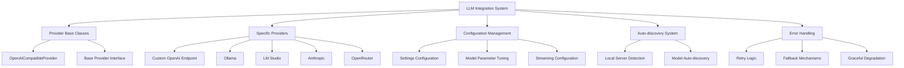

**Diagram sources**
- [openai_base.py](file://src/local_deep_research/llm/providers/openai_base.py#L25-L340)
- [custom_openai_endpoint.py](file://src/local_deep_research/llm/providers/implementations/custom_openai_endpoint.py#L25-L112)
- [ollama.py](file://src/local_deep_research/llm/providers/implementations/ollama.py#L27-L345)

**Section sources**
- [advanced_custom_llm.py](file://examples/llm_integration/advanced_custom_llm.py#L23-L351)
- [llm_config.py](file://src/local_deep_research/config/llm_config.py#L1-L1041)

## Custom LLM Implementation Patterns

### Factory Functions and Configuration
The system implements a sophisticated factory pattern for creating and configuring LLM instances based on runtime parameters and settings. The `create_configured_llm` function in advanced_custom_llm.py demonstrates this pattern by creating different types of LLMs based on configuration dictionaries. This approach enables dynamic LLM creation with various wrappers and specializations.

The factory function supports multiple LLM types including retry wrappers, configurable LLMs with response style and length parameters, and domain-specific experts. Each LLM type is created based on the configuration's "type" field, allowing for flexible composition of LLM capabilities. The factory pattern enables complex configurations to be defined in JSON or other configuration formats, making it easy to manage and version control LLM setups.

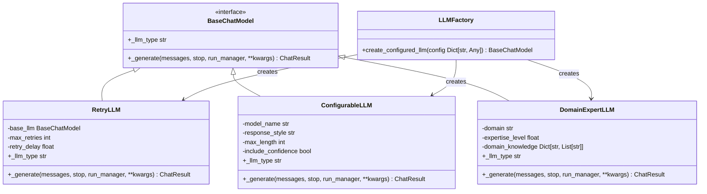

**Diagram sources**
- [advanced_custom_llm.py](file://examples/llm_integration/advanced_custom_llm.py#L23-L221)

**Section sources**
- [advanced_custom_llm.py](file://examples/llm_integration/advanced_custom_llm.py#L188-L221)

### Error Handling and Retry Logic
The system implements comprehensive error handling and retry mechanisms to ensure robust operation in production environments. The `RetryLLM` class wraps any base LLM with retry logic that automatically attempts to recover from transient failures. This implementation uses exponential backoff to avoid overwhelming the underlying service during periods of high load or temporary unavailability.

The retry mechanism is configurable with parameters for maximum retries and initial delay, allowing users to tune the behavior based on their specific requirements and the characteristics of their target LLM provider. The implementation logs warning messages for each retry attempt, providing visibility into reliability issues without overwhelming the logs.

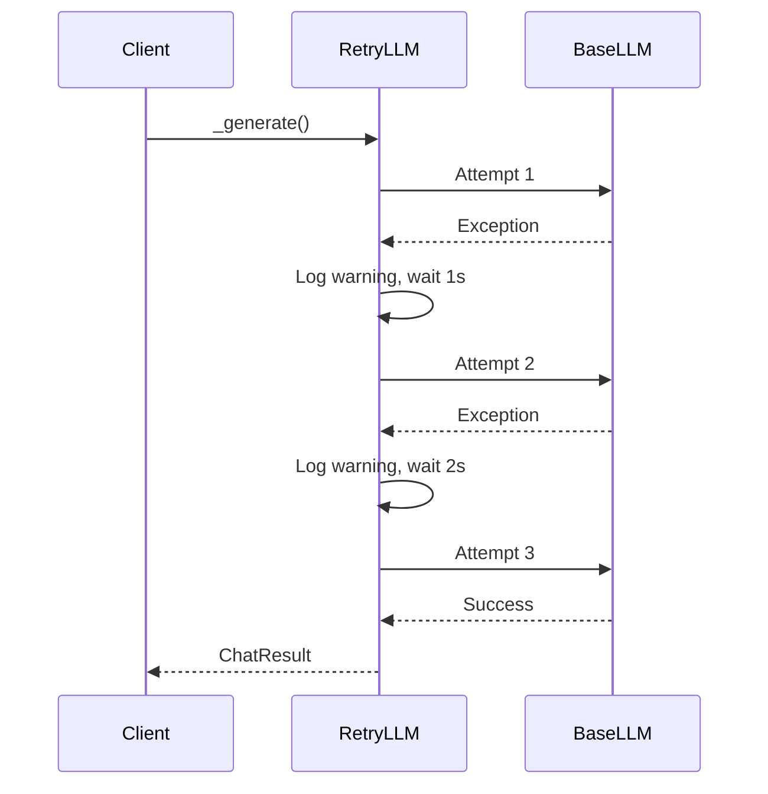

**Diagram sources**
- [advanced_custom_llm.py](file://examples/llm_integration/advanced_custom_llm.py#L23-L61)

**Section sources**
- [advanced_custom_llm.py](file://examples/llm_integration/advanced_custom_llm.py#L23-L61)

### Multi-LLM Research Pipelines
The framework supports complex research workflows that combine multiple specialized LLMs in a pipeline. This approach enables different stages of research to use LLMs optimized for specific tasks, such as using a simple LLM for initial exploration followed by a domain expert LLM for detailed analysis.

The pipeline pattern is demonstrated in the main function of advanced_custom_llm.py, which shows a multi-stage research process. The first stage uses a simple LLM for quick exploration, while subsequent stages employ more sophisticated LLMs for in-depth analysis. This pattern optimizes both performance and quality by matching the LLM complexity to the task requirements.

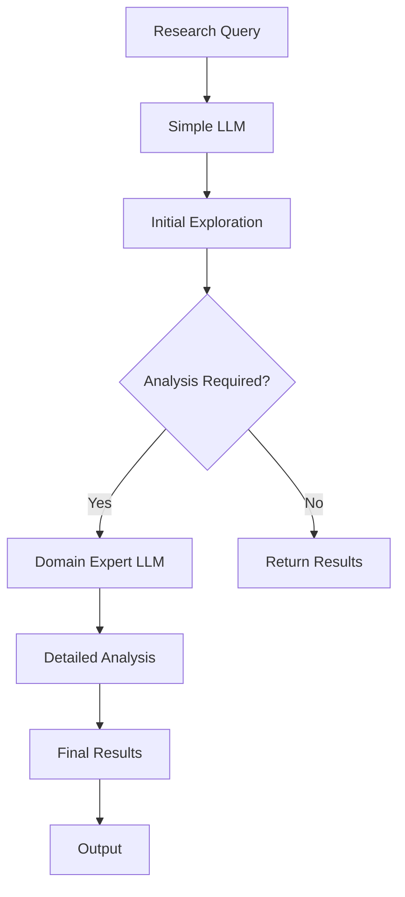

**Diagram sources**
- [advanced_custom_llm.py](file://examples/llm_integration/advanced_custom_llm.py#L295-L321)

**Section sources**
- [advanced_custom_llm.py](file://examples/llm_integration/advanced_custom_llm.py#L295-L321)

## Custom OpenAI Endpoint Integration

### Architecture and Implementation
The custom OpenAI endpoint integration enables connection to any OpenAI-compatible API endpoint by specifying a custom URL in the settings. This feature is implemented through the `CustomOpenAIEndpointProvider` class, which extends the `OpenAICompatibleProvider` base class to handle provider-specific configuration.

The implementation follows a clean separation of concerns, with the provider class handling configuration retrieval and the base class managing the core LLM creation logic. This design allows for consistent behavior across different OpenAI-compatible providers while enabling customization where needed. The provider uses settings keys to store the endpoint URL and API key, making configuration straightforward through the application's settings system.

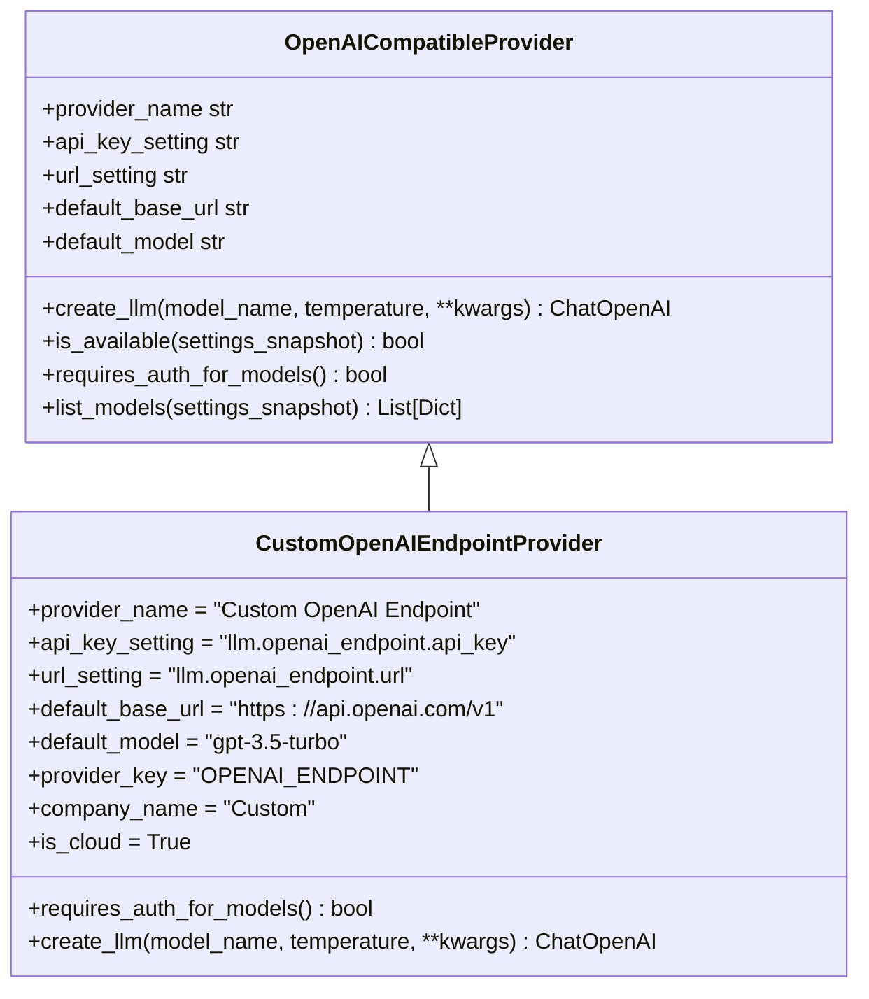

**Diagram sources**
- [custom_openai_endpoint.py](file://src/local_deep_research/llm/providers/implementations/custom_openai_endpoint.py#L25-L73)
- [openai_base.py](file://src/local_deep_research/llm/providers/openai_base.py#L25-L145)

**Section sources**
- [custom_openai_endpoint.py](file://src/local_deep_research/llm/providers/implementations/custom_openai_endpoint.py#L25-L73)

### Configuration and Authentication
The custom OpenAI endpoint integration uses a flexible configuration system that supports both API key authentication and keyless endpoints. The provider checks for authentication requirements through the `requires_auth_for_models` method, which returns False to allow model listing without authentication for many self-hosted servers that don't require authentication.

Configuration is managed through specific settings keys that store the endpoint URL and API key. The system normalizes URLs to ensure consistent formatting and handles both secure (HTTPS) and insecure (HTTP) connections. For endpoints that require authentication, the API key is retrieved from settings and passed to the OpenAI client, while endpoints that don't require authentication can use a dummy key.

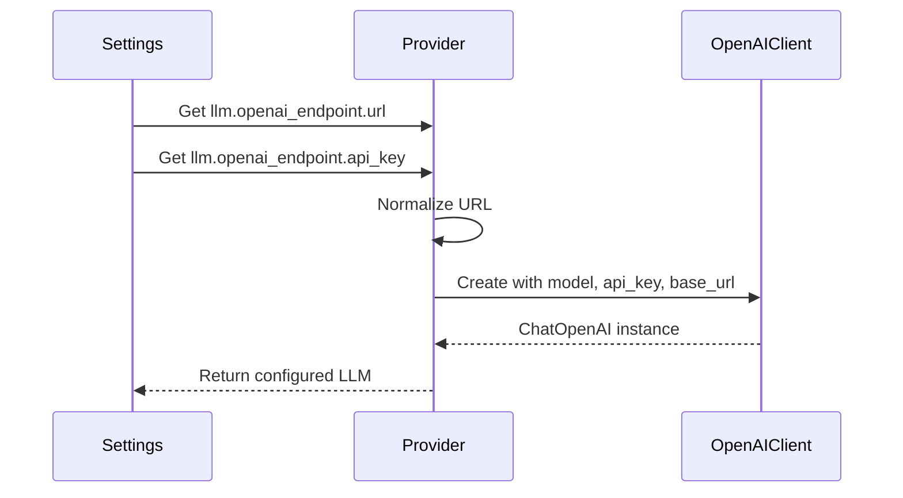

**Diagram sources**
- [custom_openai_endpoint.py](file://src/local_deep_research/llm/providers/implementations/custom_openai_endpoint.py#L56-L73)
- [openai_base.py](file://src/local_deep_research/llm/providers/openai_base.py#L76-L145)

**Section sources**
- [custom_openai_endpoint.py](file://src/local_deep_research/llm/providers/implementations/custom_openai_endpoint.py#L56-L73)

### Model Discovery and Auto-discovery
The system implements a robust model discovery mechanism that can list available models from custom OpenAI endpoints. The `list_models_for_api` method handles the process of connecting to the endpoint and retrieving the available models, with special handling for private IP addresses commonly used in Docker and self-hosted setups.

The auto-discovery feature is designed to work with various network configurations, including private IP ranges (10.x, 172.x, 192.168.x), localhost, and loopback addresses. The implementation ensures that URLs are properly formatted without duplicate path segments (like /v1/v1) and handles both authenticated and unauthenticated endpoints.

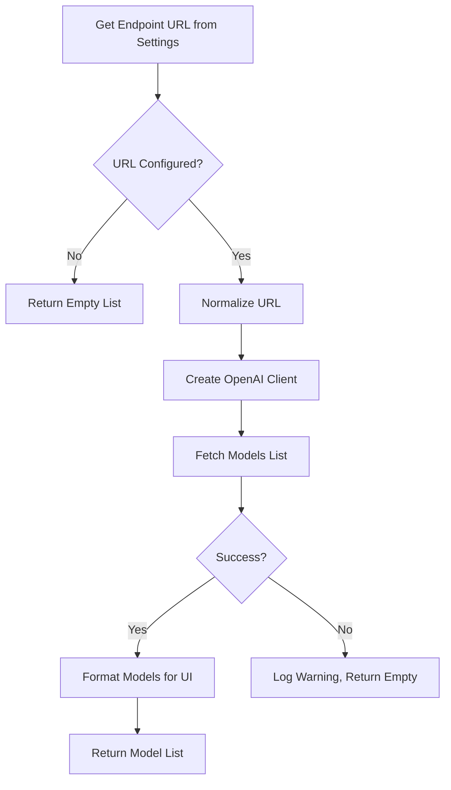

**Diagram sources**
- [custom_openai_endpoint.py](file://src/local_deep_research/llm/providers/implementations/custom_openai_endpoint.py#L249-L308)
- [openai_base.py](file://src/local_deep_research/llm/providers/openai_base.py#L250-L308)

**Section sources**
- [custom_openai_endpoint.py](file://src/local_deep_research/llm/providers/implementations/custom_openai_endpoint.py#L249-L308)

## Local LLM Server Integration

### Ollama Integration
The Ollama integration provides seamless connectivity to local Ollama servers for running models. The `OllamaProvider` class implements the provider interface with specific functionality for Ollama's API, including model listing, availability checking, and LLM creation. The provider supports both authenticated and unauthenticated Ollama instances through optional API key configuration.

The integration includes comprehensive error handling for common issues such as connection failures, timeout errors, and model availability checks. Before creating an LLM instance, the provider verifies that the requested model exists on the server, preventing errors during research execution. The implementation also supports custom context window sizes and max tokens configuration to optimize performance based on available resources.

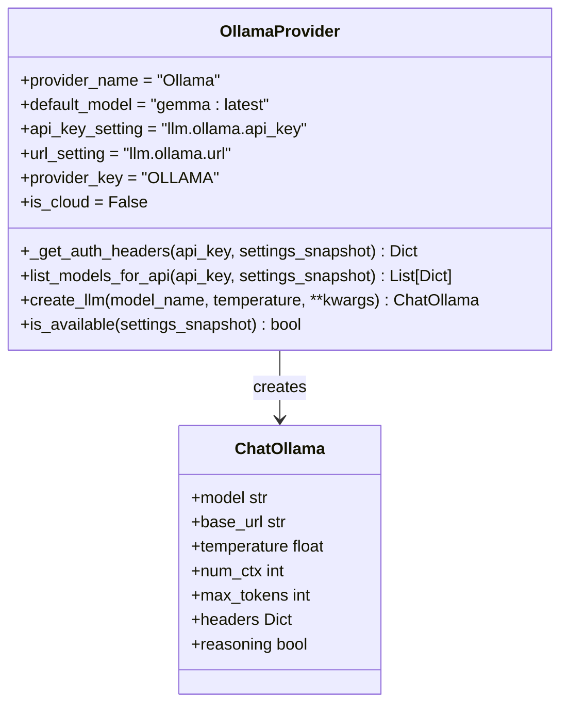

**Diagram sources**
- [ollama.py](file://src/local_deep_research/llm/providers/implementations/ollama.py#L27-L244)

**Section sources**
- [ollama.py](file://src/local_deep_research/llm/providers/implementations/ollama.py#L27-L244)

### LM Studio Integration
The LM Studio integration enables connection to local LM Studio instances through its OpenAI-compatible API. The `LMStudioProvider` class extends the `OpenAICompatibleProvider` base class, leveraging the shared implementation for OpenAI-compatible endpoints while adding LM Studio-specific defaults and metadata.

The provider is designed to work without requiring a real API key, using a dummy key for authentication since LM Studio typically doesn't require authentication. It uses a default base URL of http://localhost:1234/v1, which matches LM Studio's default configuration. The integration supports auto-discovery of available models and proper error handling for cases where LM Studio is not running.

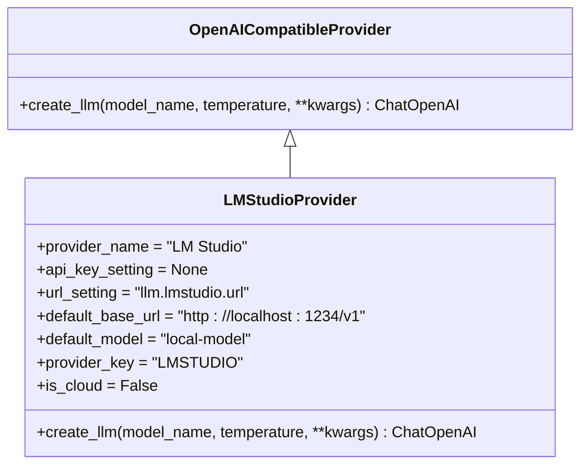

**Diagram sources**
- [lmstudio.py](file://src/local_deep_research/llm/providers/implementations/lmstudio.py#L9-L41)

**Section sources**
- [lmstudio.py](file://src/local_deep_research/llm/providers/implementations/lmstudio.py#L9-L41)

### Auto-discovery Features
The system implements a comprehensive auto-discovery system that automatically detects available LLM providers and their models. This feature enables the UI to dynamically present available options without requiring manual configuration. The auto-discovery process checks for the availability of each provider by testing connectivity and authentication, then retrieves the list of available models.

For local providers like Ollama and LM Studio, the system checks specific URLs and ports to determine availability. For cloud providers, it verifies API key configuration. The discovery process is designed to be resilient, returning empty model lists rather than throwing errors when providers are unavailable, ensuring the application remains functional even when some providers are not accessible.

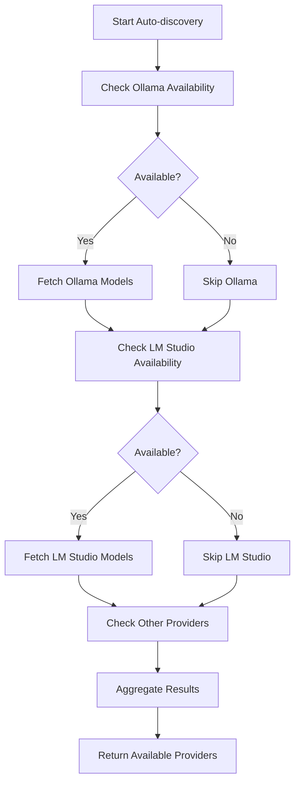

**Diagram sources**
- [ollama.py](file://src/local_deep_research/llm/providers/implementations/ollama.py#L254-L308)
- [lmstudio.py](file://src/local_deep_research/llm/providers/implementations/lmstudio.py#L30-L41)

**Section sources**
- [ollama.py](file://src/local_deep_research/llm/providers/implementations/ollama.py#L254-L308)

## Advanced Configuration and Optimization

### Model Parameter Tuning
The system provides extensive options for tuning model parameters to optimize performance and output quality. Key parameters include temperature (controlling randomness), max_tokens (limiting response length), and context window size (managing memory usage). These parameters can be configured globally, per-provider, or dynamically during research execution.

The configuration system uses a hierarchical approach where specific settings override general ones, allowing for fine-grained control. For example, local providers use smaller default context window sizes to prevent memory issues, while cloud providers can use larger or unrestricted contexts. The system also supports provider-specific parameters like Ollama's "reasoning" parameter for controlling thinking behavior.

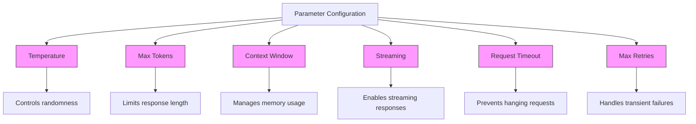

**Diagram sources**
- [llm_config.py](file://src/local_deep_research/config/llm_config.py#L457-L531)
- [openai_base.py](file://src/local_deep_research/llm/providers/openai_base.py#L84-L137)

**Section sources**
- [llm_config.py](file://src/local_deep_research/config/llm_config.py#L457-L531)

### Streaming Response Handling
The integration supports streaming responses from LLM providers that support this feature. Streaming enables real-time display of responses as they are generated, improving user experience by reducing perceived latency. The system configures streaming through the "llm.streaming" setting, which is passed to the underlying LLM client.

For providers that support streaming, the system can process responses incrementally, allowing for early analysis and display of partial results. This is particularly useful for long-running queries where users can see progress and potentially interrupt if the direction is not what they expected. The implementation handles both streaming and non-streaming modes transparently, falling back gracefully when streaming is not supported.

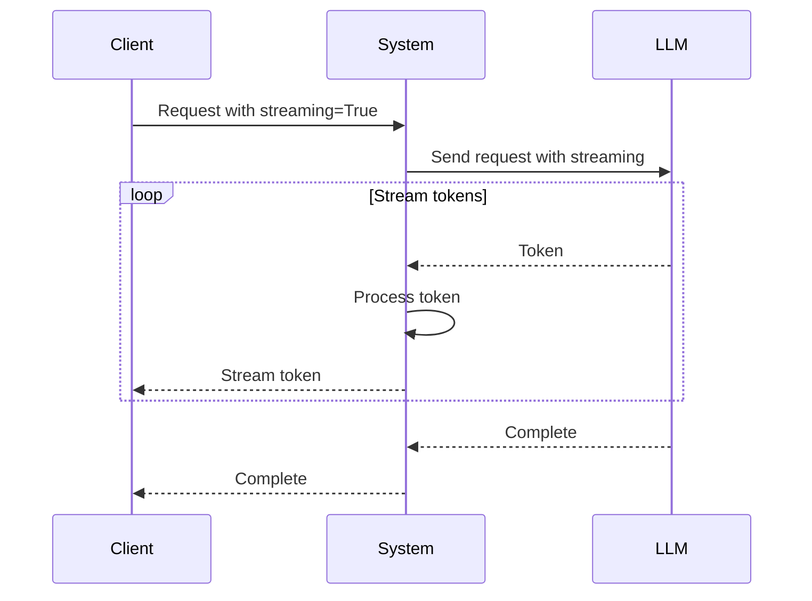

**Diagram sources**
- [openai_base.py](file://src/local_deep_research/llm/providers/openai_base.py#L104-L113)
- [llm_config.py](file://src/local_deep_research/config/llm_config.py#L597-L605)

**Section sources**
- [openai_base.py](file://src/local_deep_research/llm/providers/openai_base.py#L104-L113)

### Performance Optimization
The system implements several performance optimization techniques to improve latency and throughput when working with LLM providers. These include connection pooling, response caching, and rate limit handling. Connection pooling reuses established connections to reduce the overhead of creating new connections for each request.

Response caching stores the results of previous queries to avoid redundant LLM calls for identical or similar requests. The cache uses query hashing to identify duplicates and supports configurable TTL (time-to-live) values. Rate limit handling monitors API usage and implements backoff strategies to avoid exceeding provider limits, with support for both client-side and server-side rate limiting.

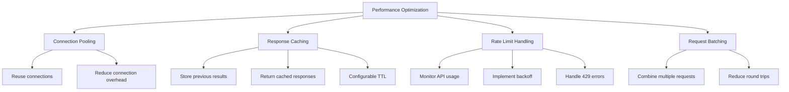

**Diagram sources**
- [llm_utils.py](file://src/local_deep_research/utilities/llm_utils.py#L104-L159)
- [test_search_cache_stampede.py](file://tests/test_search_cache_stampede.py#L141-L245)

**Section sources**
- [llm_utils.py](file://src/local_deep_research/utilities/llm_utils.py#L104-L159)

## Testing and Validation

### Integration Testing
The system includes comprehensive integration tests that verify the functionality of LLM integrations, particularly for custom endpoints and local servers. The tests for the custom OpenAI endpoint provider include regression tests that ensure compatibility with private IP addresses used in Docker and self-hosted setups.

The test suite validates that the provider can list models from various private IP ranges (10.x, 172.x, 192.168.x), handle URLs with and without /v1 suffixes correctly, and work with both authenticated and unauthenticated endpoints. These tests prevent regressions that could break connectivity to self-hosted LLM servers.

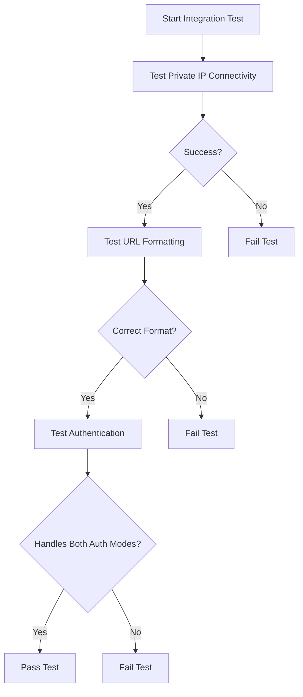

**Diagram sources**
- [test_custom_openai_endpoint.py](file://tests/llm_providers/test_custom_openai_endpoint.py#L74-L167)
- [test_ollama_provider.py](file://tests/llm_providers/test_ollama_provider.py#L88-L143)

**Section sources**
- [test_custom_openai_endpoint.py](file://tests/llm_providers/test_custom_openai_endpoint.py#L74-L167)

### Error Scenario Testing
The testing framework includes extensive coverage of error scenarios to ensure robust error handling and graceful degradation. Tests verify that the system properly handles connection errors, timeout errors, authentication failures, and model unavailability. The tests also validate that fallback mechanisms work correctly when primary providers are unavailable.

For Ollama integration, tests cover scenarios such as Ollama server not running, connection refused, timeout, and HTTP error responses. The system is designed to return meaningful error messages and fallback to alternative providers or dummy models when necessary, ensuring the application remains functional even when specific LLM providers are unavailable.

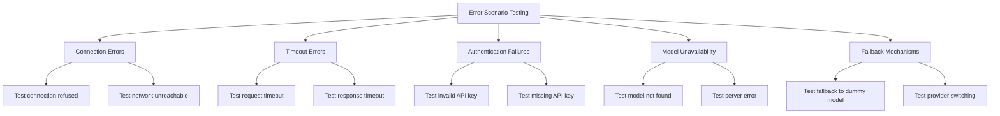

**Diagram sources**
- [test_ollama_provider.py](file://tests/llm_providers/test_ollama_provider.py#L88-L143)
- [llm_config.py](file://src/local_deep_research/config/llm_config.py#L378-L446)

**Section sources**
- [test_ollama_provider.py](file://tests/llm_providers/test_ollama_provider.py#L88-L143)

## Best Practices

### Configuration Management
Effective configuration management is critical for reliable LLM integration. The system uses a hierarchical settings system where specific settings override general ones, allowing for fine-grained control. Best practices include using environment variables for sensitive information like API keys, version controlling non-sensitive configuration, and using clear naming conventions for settings.

For multi-provider setups, it's recommended to configure fallback providers to ensure availability when primary providers are down. The system supports this through the provider registration mechanism and fallback model functionality. Configuration should be tested thoroughly in staging environments before deployment to production.

### Performance Optimization
To optimize performance, several strategies should be employed. First, use connection pooling to reduce the overhead of establishing new connections for each request. Second, implement response caching with appropriate TTL values based on the volatility of the data being retrieved. Third, tune model parameters like max_tokens and temperature to balance quality and cost.

For high-throughput applications, consider implementing request batching to combine multiple queries into a single request when possible. Monitor rate limits and implement appropriate backoff strategies to avoid being throttled by providers. Use streaming responses when available to improve perceived performance and enable early processing of results.

### Error Handling and Resilience
Robust error handling is essential for production deployments. Implement comprehensive retry logic with exponential backoff for transient failures. Use circuit breakers to prevent cascading failures when a provider is consistently unavailable. Log errors appropriately for debugging while avoiding sensitive information disclosure.

Implement graceful degradation by providing fallback providers or cached results when primary providers fail. Monitor error rates and set up alerts for unusual patterns that might indicate configuration issues or provider problems. Test error scenarios thoroughly to ensure the system behaves predictably under failure conditions.

## Conclusion
The advanced LLM integration system provides a comprehensive framework for working with various LLM providers, from cloud services to local servers. The architecture is designed for flexibility, reliability, and performance, with features like custom endpoint configuration, model parameter tuning, and streaming response handling.

Key strengths of the system include its support for multiple provider types, robust error handling, and comprehensive testing. The factory pattern for LLM creation enables complex configurations, while the auto-discovery features simplify setup for local servers like Ollama and LMStudio. Performance optimizations like connection pooling, response caching, and rate limit handling ensure efficient operation in production environments.

By following the best practices outlined in this document, developers can create reliable and high-performing LLM integrations that meet the needs of their specific use cases. The system's modular design makes it easy to extend with new providers and adapt to changing requirements.