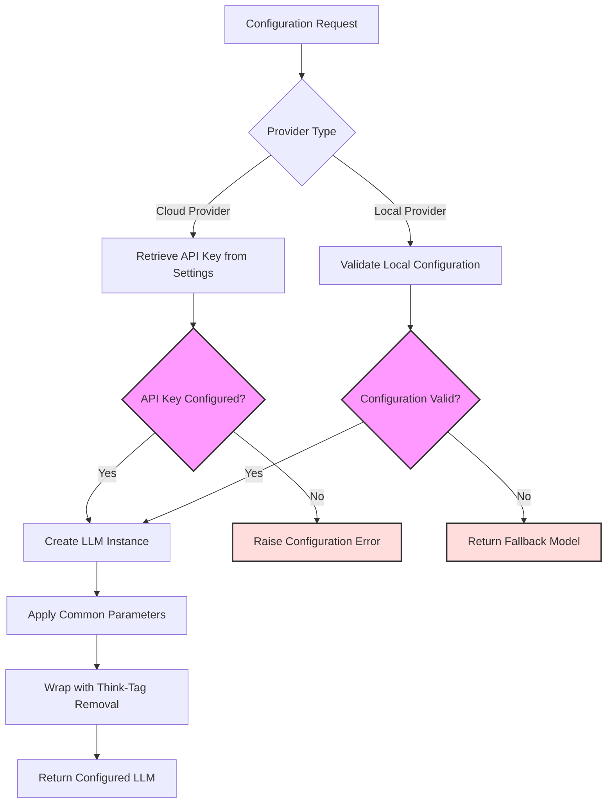
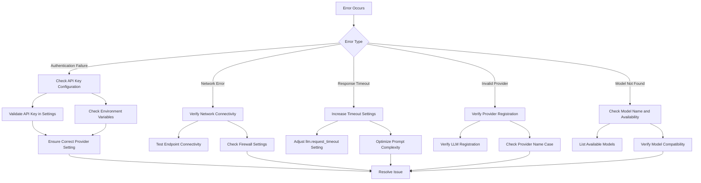
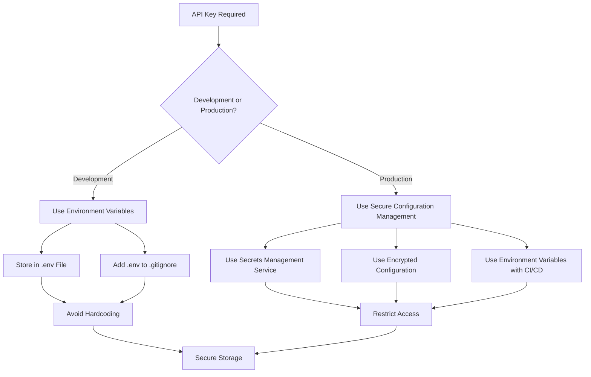

# Basic LLM Integration

<cite>
**Referenced Files in This Document**   
- [basic_custom_llm.py](file://examples/llm_integration/basic_custom_llm.py)
- [llm_registry.py](file://src/local_deep_research/llm/llm_registry.py)
- [openai_base.py](file://src/local_deep_research/llm/providers/openai_base.py)
- [openai.py](file://src/local_deep_research/llm/providers/implementations/openai.py)
- [anthropic.py](file://src/local_deep_research/llm/providers/implementations/anthropic.py)
- [google.py](file://src/local_deep_research/llm/providers/implementations/google.py)
- [llm_config.py](file://src/local_deep_research/config/llm_config.py)
- [__init__.py](file://src/local_deep_research/llm/providers/__init__.py)
</cite>

## Table of Contents
1. [Introduction](#introduction)
2. [Core LLM Interface](#core-llm-interface)
3. [LLM Registry System](#llm-registry-system)
4. [Cloud Provider Integration](#cloud-provider-integration)
5. [Configuration and Authentication](#configuration-and-authentication)
6. [Implementation Examples](#implementation-examples)
7. [Error Handling and Troubleshooting](#error-handling-and-troubleshooting)
8. [Best Practices](#best-practices)

## Introduction

Local Deep Research provides a flexible system for integrating Large Language Models (LLMs) from various providers, including OpenAI, Anthropic, and Google. The system supports both built-in providers and custom LLM implementations through a standardized interface. This document explains the implementation details, configuration patterns, and integration methods for connecting local-deep-research with standard LLM providers.

The integration system is designed to be extensible, allowing users to register custom LLMs or use factory functions to create LLM instances with dynamic configuration. The architecture supports multiple providers simultaneously, enabling complex research workflows that leverage different models for different tasks.

**Section sources**
- [basic_custom_llm.py](file://examples/llm_integration/basic_custom_llm.py#L1-L118)
- [CUSTOM_LLM_INTEGRATION.md](file://docs/CUSTOM_LLM_INTEGRATION.md#L1-L276)

## Core LLM Interface

The LLM integration system is built around the LangChain `BaseChatModel` interface, which defines the contract that all LLM providers must implement. This standardized interface ensures consistency across different providers while allowing for provider-specific extensions.

```mermaid
classDiagram
class BaseChatModel {
<<abstract>>
+_generate(messages, stop, run_manager, **kwargs) ChatResult
+_llm_type str
+__init__(**kwargs)
}
class CustomLLM {
+model_name str
+temperature float
+_generate(messages, stop, run_manager, **kwargs) ChatResult
+_llm_type str
+__init__(model_name, temperature)
}
BaseChatModel <|-- CustomLLM
class LLMFactory {
+create_llm(model_name, temperature, **kwargs) BaseChatModel
}
note right of CustomLLM
Custom LLM implementation
following the BaseChatModel
interface requirements
end note
```

**Diagram sources**
- [basic_custom_llm.py](file://examples/llm_integration/basic_custom_llm.py#L17-L47)

The core interface requires two essential components:

1. **_generate method**: This method handles the actual LLM call and must return a `ChatResult` object containing the model's response. The method receives a list of messages, optional stop sequences, and a run manager for callbacks.

2. **_llm_type property**: This read-only property returns a string identifier for the LLM type, which is used internally for identification and logging purposes.

The system also supports factory functions as an alternative to direct LLM instances. Factory functions are callables that return a configured LLM instance when invoked with appropriate parameters. This pattern enables dynamic configuration and parameter injection.

**Section sources**
- [basic_custom_llm.py](file://examples/llm_integration/basic_custom_llm.py#L17-L47)
- [llm_config.py](file://src/local_deep_research/config/llm_config.py#L283-L377)

## LLM Registry System

The LLM registry provides a centralized, thread-safe mechanism for managing LLM instances and factory functions. This registry enables dynamic discovery and loading of LLM providers throughout the application lifecycle.

```mermaid
classDiagram
class LLMRegistry {
-_llms Dict[str, Union[BaseChatModel, Callable]]
-_lock threading.Lock
+register(name, llm)
+unregister(name)
+get(name) Optional[Union[BaseChatModel, Callable]]
+is_registered(name) bool
+list_registered() list[str]
+clear()
}
class GlobalRegistry {
-_llm_registry LLMRegistry
+register_llm(name, llm)
+unregister_llm(name)
+get_llm_from_registry(name)
+is_llm_registered(name)
+list_registered_llms()
+clear_llm_registry()
}
GlobalRegistry --> LLMRegistry : "delegates to"
note right of LLMRegistry
Thread-safe registry with
case-insensitive name storage
and thread locking
end note
```

**Diagram sources**
- [llm_registry.py](file://src/local_deep_research/llm/llm_registry.py#L14-L96)

The registry system consists of two main components:

1. **LLMRegistry class**: A thread-safe container that stores LLM instances and factory functions with case-insensitive name lookup. It uses a dictionary to map provider names to their corresponding LLM objects and employs threading locks to ensure safe concurrent access.

2. **Global registry functions**: Public API functions that provide convenient access to the singleton registry instance. These functions handle registration, retrieval, and management of LLM providers across the application.

The registry automatically normalizes provider names to lowercase for case-insensitive storage and retrieval. When a provider is registered with a name that already exists, the system issues a warning and overwrites the previous registration.

**Section sources**
- [llm_registry.py](file://src/local_deep_research/llm/llm_registry.py#L14-L162)
- [llm_config.py](file://src/local_deep_research/config/llm_config.py#L333-L377)

## Cloud Provider Integration

The system provides specialized implementations for major cloud LLM providers, each following a consistent pattern while accommodating provider-specific requirements. The integration architecture uses a base class for OpenAI-compatible endpoints and extends it for specific providers.

```mermaid
classDiagram
class OpenAICompatibleProvider {
<<abstract>>
+provider_name str
+api_key_setting str
+url_setting str
+default_base_url str
+default_model str
+create_llm(model_name, temperature, **kwargs) ChatOpenAI
+is_available(settings_snapshot) bool
+requires_auth_for_models() bool
+list_models_for_api(api_key, base_url) list[dict]
+list_models(settings_snapshot) list[dict]
}
class OpenAIProvider {
+provider_name "OpenAI"
+api_key_setting "llm.openai.api_key"
+default_model "gpt-3.5-turbo"
+default_base_url "https : //api.openai.com/v1"
+provider_key "OPENAI"
+company_name "OpenAI"
+region "US"
+country "United States"
+data_location "United States"
+is_cloud True
+create_llm(model_name, temperature, **kwargs) ChatOpenAI
+is_available(settings_snapshot) bool
}
class AnthropicProvider {
+provider_name "Anthropic"
+api_key_setting "llm.anthropic.api_key"
+default_model "claude-3-sonnet-20240229"
+default_base_url "https : //api.anthropic.com/v1"
+provider_key "ANTHROPIC"
+company_name "Anthropic"
+region "US"
+country "United States"
+data_location "United States"
+is_cloud True
+create_llm(model_name, temperature, **kwargs) ChatAnthropic
+is_available(settings_snapshot) bool
}
class GoogleProvider {
+provider_name "Google Gemini"
+api_key_setting "llm.google.api_key"
+default_base_url "https : //generativelanguage.googleapis.com/v1beta/openai"
+default_model "gemini-1.5-flash"
+provider_key "GOOGLE"
+company_name "Google"
+region "US"
+country "United States"
+data_location "Worldwide"
+is_cloud True
+requires_auth_for_models() bool
+list_models_for_api(api_key, settings_snapshot) list[dict]
+create_llm(model_name, temperature, **kwargs) ChatOpenAI
+is_available(settings_snapshot) bool
}
OpenAICompatibleProvider <|-- OpenAIProvider
OpenAICompatibleProvider <|-- AnthropicProvider
OpenAICompatibleProvider <|-- GoogleProvider
note right of OpenAICompatibleProvider
Base class for OpenAI-compatible
API providers with common
implementation patterns
end note
```

**Diagram sources**
- [openai_base.py](file://src/local_deep_research/llm/providers/openai_base.py#L25-L340)
- [openai.py](file://src/local_deep_research/llm/providers/implementations/openai.py#L26-L218)
- [anthropic.py](file://src/local_deep_research/llm/providers/implementations/anthropic.py#L26-L162)
- [google.py](file://src/local_deep_research/llm/providers/implementations/google.py#L9-L133)

### OpenAI Integration

The OpenAI provider implementation extends the `OpenAICompatibleProvider` base class and configures it with OpenAI-specific settings:

- **API key setting**: `llm.openai.api_key` - The configuration key for storing the OpenAI API key
- **Default model**: `gpt-3.5-turbo` - The default model used when none is specified
- **Base URL**: `https://api.openai.com/v1` - The OpenAI API endpoint
- **Provider metadata**: Includes company information, region, and cloud status

The implementation supports optional parameters such as API base URL, organization ID, streaming, maximum retries, and request timeout, which can be configured through the settings system.

### Anthropic Integration

The Anthropic provider follows a similar pattern but uses Anthropic-specific configurations:

- **API key setting**: `llm.anthropic.api_key` - Configuration key for Anthropic API key
- **Default model**: `claude-3-sonnet-20240229` - Default Claude model
- **Base URL**: `https://api.anthropic.com/v1` - Anthropic API endpoint

The implementation uses `ChatAnthropic` from langchain_anthropic instead of `ChatOpenAI`, reflecting the different client library requirements.

### Google Gemini Integration

The Google provider implementation has unique characteristics due to Google's API design:

- **API key setting**: `llm.google.api_key` - Configuration key for Google API key
- **Base URL**: `https://generativelanguage.googleapis.com/v1beta/openai` - Google's OpenAI-compatible endpoint
- **Model listing**: Uses Google's native API endpoint since the OpenAI-compatible models endpoint has a known bug

The implementation demonstrates how to handle provider-specific quirks, such as Google's requirement to pass the API key as a query parameter rather than in headers.

**Section sources**
- [openai_base.py](file://src/local_deep_research/llm/providers/openai_base.py#L25-L340)
- [openai.py](file://src/local_deep_research/llm/providers/implementations/openai.py#L26-L218)
- [anthropic.py](file://src/local_deep_research/llm/providers/implementations/anthropic.py#L26-L162)
- [google.py](file://src/local_deep_research/llm/providers/implementations/google.py#L9-L133)

## Configuration and Authentication

The system uses a comprehensive configuration framework to manage LLM provider settings, API keys, and authentication mechanisms. Configuration is handled through a combination of environment variables, settings snapshots, and secure storage.



**Diagram sources**
- [llm_config.py](file://src/local_deep_research/config/llm_config.py#L283-L800)

### Environment Variable Configuration

The system supports configuration through environment variables, which are automatically loaded and validated. Key environment variables include:

- **OPENAI_API_KEY**: For OpenAI provider authentication
- **ANTHROPIC_API_KEY**: For Anthropic provider authentication  
- **GOOGLE_API_KEY**: For Google Gemini provider authentication
- **LLM_PROVIDER**: Specifies the default LLM provider to use
- **LLM_MODEL**: Specifies the default model name

These environment variables are mapped to internal settings keys that are used throughout the system.

### API Key Management

API key management follows a secure pattern that avoids hardcoding credentials:

1. **Settings-based storage**: API keys are stored in the application's settings system rather than in code
2. **Environment variable fallback**: Keys can be provided via environment variables for development and testing
3. **Secure retrieval**: The `get_setting_from_snapshot` function handles secure retrieval of API keys with proper error handling
4. **Validation**: The system validates that required API keys are present before attempting to create LLM instances

### Basic Request/Response Handling

The request/response flow follows a standardized pattern across all providers:

1. **Parameter validation**: Input parameters are validated and normalized
2. **Configuration retrieval**: Provider-specific settings are retrieved from the configuration system
3. **LLM instance creation**: The appropriate LLM client is instantiated with the required parameters
4. **Request execution**: The LLM request is executed through the LangChain interface
5. **Response processing**: The response is processed and wrapped with additional functionality

The system automatically handles common parameters such as temperature, max_tokens, streaming, and request timeouts, applying them consistently across different providers.

**Section sources**
- [llm_config.py](file://src/local_deep_research/config/llm_config.py#L283-L800)
- [openai_base.py](file://src/local_deep_research/llm/providers/openai_base.py#L54-L145)
- [env_configuration.md](file://docs/env_configuration.md)

## Implementation Examples

The system provides clear patterns for integrating LLM providers, ranging from simple instance usage to advanced factory functions.

### Basic Custom LLM Implementation

```python
class CustomLLM(BaseChatModel):
    """Example custom LLM implementation."""
    
    def __init__(self, model_name: str = "custom-model", temperature: float = 0.7):
        super().__init__()
        self.model_name = model_name
        self.temperature = temperature
    
    def _generate(self, messages: List[BaseMessage], stop: Optional[List[str]] = None,
                  run_manager: Optional[Any] = None, **kwargs: Any) -> ChatResult:
        """Generate a response. This is where you'd call your custom model."""
        response_text = f"This is a response from {self.model_name} to: {messages[-1].content}"
        message = AIMessage(content=response_text)
        generation = ChatGeneration(message=message)
        return ChatResult(generations=[generation])
    
    @property
    def _llm_type(self) -> str:
        """Return identifier for this LLM."""
        return "custom"
```

This basic implementation demonstrates the minimal requirements for a custom LLM: inheriting from `BaseChatModel`, implementing `_generate`, and providing the `_llm_type` property.

### Factory Function Pattern

```python
def custom_llm_factory(model_name: str = "factory-model", temperature: float = 0.5, **kwargs):
    """Factory function that creates a custom LLM instance."""
    return CustomLLM(model_name=model_name, temperature=temperature)
```

Factory functions enable dynamic configuration and parameter injection. They can accept additional parameters beyond the standard `model_name` and `temperature`, allowing for more complex configuration patterns.

### Provider Initialization and Usage

```python
# Example 1: Using a custom LLM instance
custom_llm = CustomLLM(model_name="my-custom-model", temperature=0.8)
result = quick_summary(
    query="What are the latest advances in quantum computing?",
    llms={"my_custom": custom_llm},
    provider="my_custom",
    search_tool="wikipedia",
)

# Example 2: Using a factory function
result = quick_summary(
    query="Explain the benefits of renewable energy",
    llms={"factory_llm": custom_llm_factory},
    provider="factory_llm",
    model_name="renewable-expert",
    temperature=0.3,
    search_tool="auto",
)
```

These examples show how to register and use custom LLMs through the `llms` parameter in API functions, specifying the registered name as the `provider` parameter.

**Section sources**
- [basic_custom_llm.py](file://examples/llm_integration/basic_custom_llm.py#L17-L118)
- [CUSTOM_LLM_INTEGRATION.md](file://docs/CUSTOM_LLM_INTEGRATION.md#L48-L84)

## Error Handling and Troubleshooting

The system includes comprehensive error handling and troubleshooting mechanisms to address common issues that may arise during LLM integration.

### Common Issues and Solutions



**Diagram sources**
- [llm_config.py](file://src/local_deep_research/config/llm_config.py#L533-L554)
- [openai_base.py](file://src/local_deep_research/llm/providers/openai_base.py#L54-L71)

#### Authentication Failures

Authentication issues typically occur when API keys are not properly configured:

- **Symptoms**: "API key not found in settings" errors, authentication failures
- **Solutions**: 
  - Verify the API key is set in the appropriate configuration setting
  - Check that environment variables are properly loaded
  - Ensure the provider is correctly registered with the registry
  - Validate that the API key has the necessary permissions

#### Network Errors

Network connectivity issues can prevent communication with LLM providers:

- **Symptoms**: Connection timeouts, network unreachable errors
- **Solutions**:
  - Verify internet connectivity
  - Check firewall and proxy settings
  - Test endpoint accessibility directly
  - Validate the base URL configuration

#### Response Timeouts

Timeouts occur when LLM responses take longer than the configured threshold:

- **Symptoms**: Request timeout errors, slow response times
- **Solutions**:
  - Increase the `llm.request_timeout` setting
  - Optimize prompts to reduce complexity
  - Consider using faster models for time-sensitive operations
  - Implement retry logic with exponential backoff

### Diagnostic Methods

The system provides several methods for diagnosing and resolving issues:

1. **Provider availability checks**: Functions like `is_openai_available()` and `is_anthropic_available()` verify that providers are properly configured
2. **Model listing**: The `list_models()` methods allow users to verify which models are available from each provider
3. **Logging**: Comprehensive logging throughout the LLM creation and request process helps identify failure points
4. **Fallback mechanisms**: The system automatically falls back to alternative models when primary providers are unavailable

**Section sources**
- [llm_config.py](file://src/local_deep_research/config/llm_config.py#L53-L274)
- [openai_base.py](file://src/local_deep_research/llm/providers/openai_base.py#L198-L211)
- [troubleshooting-openai-api-key.md](file://docs/troubleshooting-openai-api-key.md)

## Best Practices

Adhering to best practices ensures secure, reliable, and efficient LLM integration.

### Secure API Key Storage



**Diagram sources**
- [security_headers.py](file://src/local_deep_research/security/security_headers.py)
- [encrypted_db.py](file://src/local_deep_research/database/encrypted_db.py)

Key security practices include:
- Never hardcode API keys in source code
- Use environment variables for development
- Implement proper secrets management in production
- Regularly rotate API keys
- Use the principle of least privilege when configuring API key permissions

### Error Handling

Effective error handling strategies include:
- Implement comprehensive exception handling in the `_generate` method
- Provide meaningful error messages for debugging
- Implement retry logic with exponential backoff for transient failures
- Gracefully handle rate limiting from providers
- Include proper logging for troubleshooting

### Performance Optimization

Performance considerations:
- Cache frequently used LLM instances rather than recreating them
- Use appropriate timeout values based on expected response times
- Implement connection pooling where supported
- Monitor and optimize token usage to control costs
- Consider using smaller models for less complex tasks

The LLM integration system in local-deep-research provides a robust, extensible framework for connecting with various LLM providers. By following the patterns and best practices outlined in this document, developers can effectively integrate and utilize LLMs from OpenAI, Anthropic, Google, and other providers in their research workflows.

**Section sources**
- [CUSTOM_LLM_INTEGRATION.md](file://docs/CUSTOM_LLM_INTEGRATION.md#L191-L197)
- [security_headers.py](file://src/local_deep_research/security/security_headers.py)
- [encrypted_db.py](file://src/local_deep_research/database/encrypted_db.py)