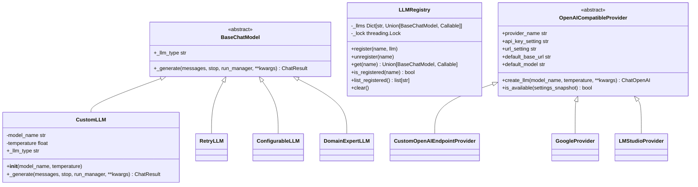
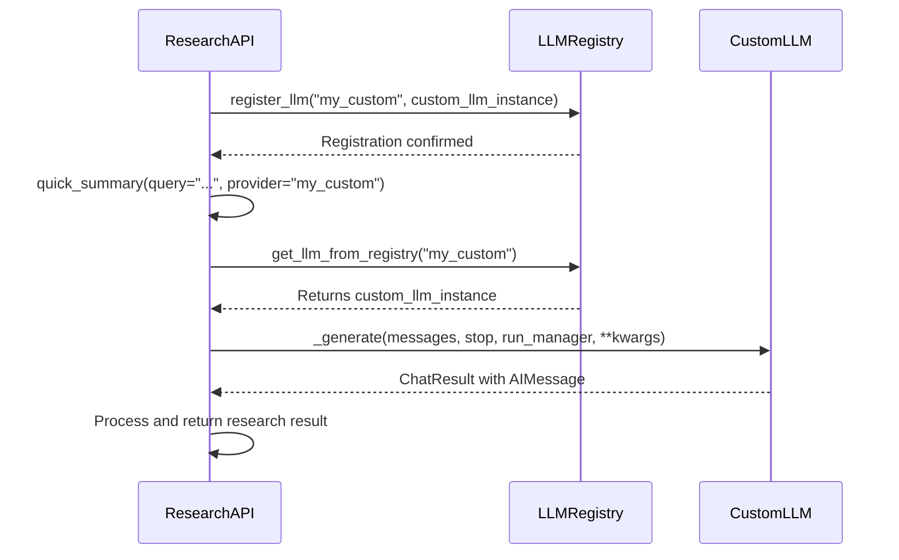
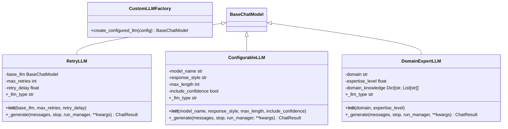
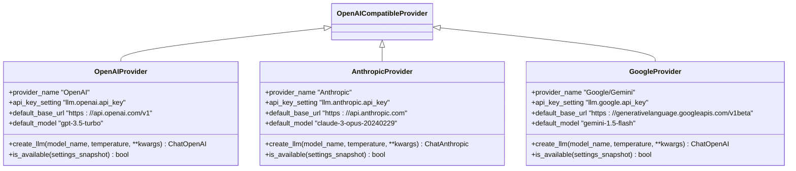
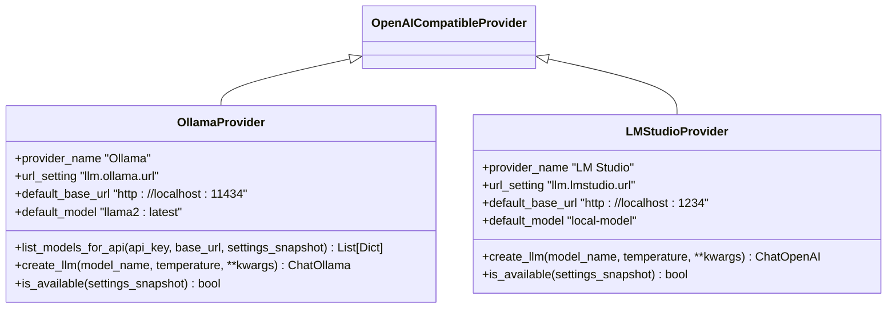
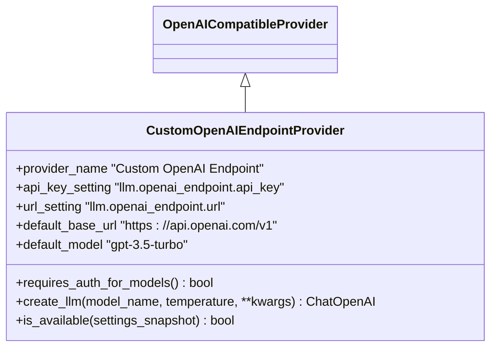
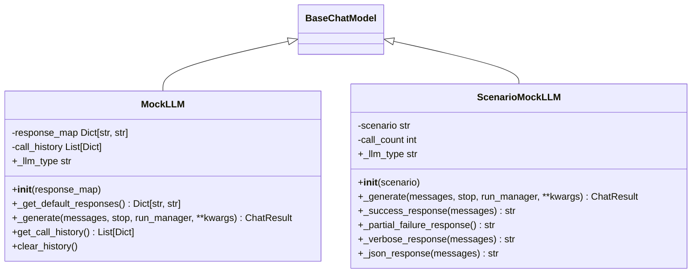

# LLM Integration Examples

<cite>
**Referenced Files in This Document**   
- [basic_custom_llm.py](file://examples/llm_integration/basic_custom_llm.py)
- [advanced_custom_llm.py](file://examples/llm_integration/advanced_custom_llm.py)
- [mock_llm_example.py](file://examples/llm_integration/mock_llm_example.py)
- [custom_openai_endpoint.py](file://src/local_deep_research/llm/providers/implementations/custom_openai_endpoint.py)
- [openai_base.py](file://src/local_deep_research/llm/providers/openai_base.py)
- [llm_registry.py](file://src/local_deep_research/llm/llm_registry.py)
- [thread_settings.py](file://src/local_deep_research/config/thread_settings.py)
- [CUSTOМ_LLM_INTEGRATION.md](file://docs/CUSTOM_LLM_INTEGRATION.md)
</cite>

## Table of Contents
1. [Introduction](#introduction)
2. [Core Integration Patterns](#core-integration-patterns)
3. [Basic Custom LLM Implementation](#basic-custom-llm-implementation)
4. [Advanced Custom LLM Patterns](#advanced-custom-llm-patterns)
5. [Cloud Provider Integration](#cloud-provider-integration)
6. [Local Model Integration](#local-model-integration)
7. [Custom Endpoint Implementation](#custom-endpoint-implementation)
8. [Testing and Validation](#testing-and-validation)
9. [Performance and Security Considerations](#performance-and-security-considerations)
10. [Best Practices](#best-practices)

## Introduction

This document provides comprehensive guidance on integrating various LLM providers with the Local Deep Research system. It covers implementation details for both basic and advanced custom LLM integrations, including configuration patterns, authentication mechanisms, and best practices for connecting to cloud providers (OpenAI, Anthropic, Google) and local models (Ollama, LMStudio). The documentation also explains how to implement custom endpoints, handle advanced topics like streaming responses and rate limiting, and provides testing strategies for validating LLM integrations.

The Local Deep Research system supports flexible LLM integration through a registry pattern that allows custom LangChain LLMs to be registered and used throughout the research pipeline. This enables users to leverage proprietary models, specialized wrappers, or third-party LLM providers alongside the built-in options.

**Section sources**
- [CUSTOМ_LLM_INTEGRATION.md](file://docs/CUSTOM_LLM_INTEGRATION.md#L1-L276)

## Core Integration Patterns

The Local Deep Research system implements a flexible LLM integration architecture based on the LangChain framework. The core patterns include LLM registration, factory functions, and thread-safe configuration management.

**Diagram sources**
- [basic_custom_llm.py](file://examples/llm_integration/basic_custom_llm.py#L17-L48)
- [advanced_custom_llm.py](file://examples/llm_integration/advanced_custom_llm.py#L23-L187)
- [llm_registry.py](file://src/local_deep_research/llm/llm_registry.py#L14-L162)
- [openai_base.py](file://src/local_deep_research/llm/providers/openai_base.py#L25-L200)

The system uses a global LLM registry to manage custom LLM instances and factory functions. When an LLM is registered, it is stored in a thread-safe dictionary with case-insensitive keys. The registry supports both direct LLM instances and callable factory functions that can create LLMs with dynamic configuration.

**Section sources**
- [llm_registry.py](file://src/local_deep_research/llm/llm_registry.py#L1-L162)
- [CUSTOМ_LLM_INTEGRATION.md](file://docs/CUSTOM_LLM_INTEGRATION.md#L1-L276)

## Basic Custom LLM Implementation

The basic custom LLM implementation demonstrates the minimum requirements for creating a custom LLM that integrates with the Local Deep Research system. This includes inheriting from `BaseChatModel`, implementing the required methods, and handling the standard LangChain message formats.

**Diagram sources**
- [basic_custom_llm.py](file://examples/llm_integration/basic_custom_llm.py#L17-L118)
- [llm_registry.py](file://src/local_deep_research/llm/llm_registry.py#L103-L113)

The basic implementation requires three key components:
1. A class that inherits from `langchain_core.language_models.BaseChatModel`
2. Implementation of the `_generate` method that returns a `ChatResult` object
3. A property `_llm_type` that returns a string identifier for the LLM

The `_generate` method is the core of the LLM implementation, where the actual model call would be made. In the example, this is a mock implementation that returns a formatted string, but in a real implementation, this would call the actual model API.

Factory functions can also be used to create LLM instances with dynamic configuration. These functions are registered in the same way as instances and are called with the provided parameters when the LLM is needed.

**Section sources**
- [basic_custom_llm.py](file://examples/llm_integration/basic_custom_llm.py#L17-L118)
- [CUSTOМ_LLM_INTEGRATION.md](file://docs/CUSTOM_LLM_INTEGRATION.md#L47-L84)

## Advanced Custom LLM Patterns

Advanced custom LLM patterns demonstrate more sophisticated integration techniques, including retry logic, configurable parameters, domain expertise, and factory functions with configuration.

**Diagram sources**
- [advanced_custom_llm.py](file://examples/llm_integration/advanced_custom_llm.py#L23-L187)

The advanced patterns include several key components:

1. **Retry Wrapper**: The `RetryLLM` class wraps any base LLM with retry logic and exponential backoff. This is useful for handling transient failures when calling external APIs.

2. **Configurable LLM**: The `ConfigurableLLM` class supports various response styles (technical, simple), length limits, and optional confidence scores. This allows fine-tuning the LLM's behavior for different use cases.

3. **Domain Expert LLM**: The `DomainExpertLLM` specializes in specific domains (medical, legal, technical, finance) and adjusts its responses based on the query's relevance to its domain.

4. **Configuration Factory**: The `create_configured_llm` function creates LLMs based on configuration dictionaries, enabling complex nested configurations (e.g., a retry wrapper around a configurable LLM).

These patterns can be combined to create sophisticated research pipelines, such as using different LLMs for different research phases or combining multiple LLMs in a single workflow.

**Section sources**
- [advanced_custom_llm.py](file://examples/llm_integration/advanced_custom_llm.py#L23-L351)

## Cloud Provider Integration

Cloud provider integration follows a consistent pattern across different providers (OpenAI, Anthropic, Google), with each provider implementing a specific configuration and authentication mechanism.

**Diagram sources**
- [openai_base.py](file://src/local_deep_research/llm/providers/openai_base.py#L25-L200)
- [src/local_deep_research/llm/providers/implementations/openai.py](file://src/local_deep_research/llm/providers/implementations/openai.py#L154-L217)
- [src/local_deep_research/llm/providers/implementations/anthropic.py](file://src/local_deep_research/llm/providers/implementations/anthropic.py#L119-L161)
- [src/local_deep_research/llm/providers/implementations/google.py](file://src/local_deep_research/llm/providers/implementations/google.py#L68-L132)

The integration pattern for cloud providers includes:

1. **Provider Class**: Each provider implements a class that inherits from `OpenAICompatibleProvider` (or a similar base class) and defines provider-specific settings.

2. **Configuration Settings**: Each provider has specific settings for API key and endpoint URL, stored in the system's configuration.

3. **Authentication**: API keys are retrieved from settings and passed to the LLM client. The system handles missing or invalid keys with appropriate error messages.

4. **Model Management**: Providers implement methods to list available models, which are used in the UI to populate model selection dropdowns.

5. **Availability Checking**: Each provider implements an `is_available` method that checks whether the necessary credentials are configured.

The factory functions for each provider (e.g., `create_openai_llm`, `create_anthropic_llm`) serve as entry points for creating LLM instances and are registered with the LLM registry.

**Section sources**
- [openai_base.py](file://src/local_deep_research/llm/providers/openai_base.py#L25-L200)
- [src/local_deep_research/llm/providers/implementations/openai.py](file://src/local_deep_research/llm/providers/implementations/openai.py#L154-L217)
- [src/local_deep_research/llm/providers/implementations/anthropic.py](file://src/local_deep_research/llm/providers/implementations/anthropic.py#L119-L161)
- [src/local_deep_research/llm/providers/implementations/google.py](file://src/local_deep_research/llm/providers/implementations/google.py#L68-L132)

## Local Model Integration

Local model integration supports self-hosted LLMs through OpenAI-compatible APIs, with specific implementations for Ollama and LMStudio.

**Diagram sources**
- [src/local_deep_research/llm/providers/implementations/ollama.py](file://src/local_deep_research/llm/providers/implementations/ollama.py#L79-L119)
- [src/local_deep_research/config/llm_config.py](file://src/local_deep_research/config/llm_config.py#L809-L841)

Local model integration differs from cloud providers in several key aspects:

1. **URL Configuration**: Instead of fixed endpoints, local models use configurable URLs that point to the local server (e.g., `http://localhost:11434` for Ollama).

2. **Authentication**: Many local models do not require API keys, or use simpler authentication mechanisms.

3. **Model Discovery**: Local models often support dynamic model listing through API endpoints, allowing the UI to display available models.

4. **Network Considerations**: Special handling is required for private IP addresses and localhost connections, particularly in Docker environments.

The Ollama integration uses a dedicated `ChatOllama` client from LangChain, while LMStudio uses the standard `ChatOpenAI` client since it provides an OpenAI-compatible API.

**Section sources**
- [src/local_deep_research/llm/providers/implementations/ollama.py](file://src/local_deep_research/llm/providers/implementations/ollama.py#L79-L119)
- [src/local_deep_research/config/llm_config.py](file://src/local_deep_research/config/llm_config.py#L809-L841)
- [tests/llm_providers/test_ollama_provider.py](file://tests/llm_providers/test_ollama_provider.py#L77-L325)

## Custom Endpoint Implementation

The custom OpenAI endpoint implementation allows users to connect to any OpenAI-compatible API endpoint by specifying a custom URL in the settings.

**Diagram sources**
- [custom_openai_endpoint.py](file://src/local_deep_research/llm/providers/implementations/custom_openai_endpoint.py#L25-L74)

The custom endpoint implementation includes several key features:

1. **Dynamic URL Configuration**: The endpoint URL is retrieved from settings, allowing users to specify any OpenAI-compatible API endpoint.

2. **Flexible Authentication**: The implementation supports both authenticated and unauthenticated endpoints, with a `requires_auth_for_models` method that returns `False` to accommodate self-hosted servers that don't require authentication.

3. **URL Normalization**: The `normalize_url` utility ensures consistent URL formatting, handling edge cases like duplicate `/v1` paths.

4. **Backward Compatibility**: Standalone functions (`create_openai_endpoint_llm`, `is_openai_endpoint_available`) are maintained for backward compatibility.

The implementation is designed to work with various self-hosted LLM servers like vLLM, text-generation-webui, and other OpenAI-compatible APIs. It handles private IP addresses commonly used in Docker and self-hosted setups, ensuring compatibility with local network configurations.

**Section sources**
- [custom_openai_endpoint.py](file://src/local_deep_research/llm/providers/implementations/custom_openai_endpoint.py#L1-L112)
- [tests/llm_providers/test_custom_openai_endpoint.py](file://tests/llm_providers/test_custom_openai_endpoint.py#L1-L319)

## Testing and Validation

Testing and validation of LLM integrations is critical for ensuring reliability and handling edge cases. The system provides several patterns for testing, including mock LLMs and scenario-based testing.

**Diagram sources**
- [mock_llm_example.py](file://examples/llm_integration/mock_llm_example.py#L22-L179)

The testing patterns include:

1. **Basic Mock LLM**: Returns predefined responses based on query content, useful for testing research pipelines without API costs.

2. **Scenario Mock LLM**: Simulates specific scenarios for testing (success, partial failure, empty responses, verbose responses, JSON responses).

3. **Call History Tracking**: Records all calls to the LLM, enabling analysis of call patterns and parameter usage.

4. **Integration Testing**: Tests mock LLMs in full research pipelines, including report generation and custom retriever combinations.

These testing patterns allow developers to validate their research flows, debug specific scenarios, and ensure compatibility with the system without incurring API costs or requiring external services.

**Section sources**
- [mock_llm_example.py](file://examples/llm_integration/mock_llm_example.py#L1-L319)

## Performance and Security Considerations

When integrating with external LLM services, several performance and security considerations must be addressed to ensure reliable and secure operation.

### Performance Considerations

1. **Rate Limiting**: Implement rate limiting to avoid exceeding API quotas, especially when using cloud providers with usage-based pricing.

2. **Retry Logic**: Use exponential backoff for retrying failed requests, with appropriate delay intervals to avoid overwhelming the service.

3. **Connection Management**: Reuse connections where possible and configure appropriate timeouts to handle network issues.

4. **Caching**: Implement response caching for frequently asked questions to reduce API calls and improve response times.

5. **Streaming**: Use streaming responses when available to provide faster feedback to users and reduce memory usage.

### Security Considerations

1. **Authentication**: Store API keys securely in the system's configuration, never in code or version control.

2. **Input Validation**: Validate and sanitize all inputs to prevent injection attacks and ensure data integrity.

3. **Network Security**: Use HTTPS for all external connections and validate SSL certificates.

4. **Error Handling**: Avoid exposing sensitive information in error messages, especially in production environments.

5. **Access Control**: Implement proper access control to ensure only authorized users can configure and use LLM integrations.

6. **Data Privacy**: Be aware of data privacy regulations and ensure sensitive data is not sent to external LLM services without proper safeguards.

These considerations are critical for maintaining system reliability, protecting user data, and ensuring compliance with relevant regulations.

**Section sources**
- [CUSTOМ_LLM_INTEGRATION.md](file://docs/CUSTOM_LLM_INTEGRATION.md#L191-L271)
- [security](file://src/local_deep_research/security)

## Best Practices

Following these best practices will help ensure successful LLM integration and optimal system performance:

1. **Consistent Naming**: Use clear, descriptive names for custom LLMs to make them easily identifiable in logs and configuration.

2. **Error Handling**: Implement comprehensive error handling in the `_generate` method to gracefully handle API failures, network issues, and invalid responses.

3. **Configuration Management**: Use the system's configuration framework to manage LLM settings, allowing for easy updates without code changes.

4. **Thread Safety**: Ensure LLM implementations are thread-safe, as they may be used in concurrent environments.

5. **Resource Management**: Properly manage resources like network connections and memory, especially for long-running processes.

6. **Monitoring and Logging**: Implement appropriate logging to track LLM usage, performance, and errors for debugging and optimization.

7. **Testing**: Use mock LLMs to test research pipelines thoroughly before deploying with real LLMs.

8. **Documentation**: Document custom LLM configurations and usage patterns to ensure maintainability and knowledge sharing.

9. **Version Compatibility**: Ensure compatibility with the LangChain version used by the system, as API changes may affect integration.

10. **Performance Optimization**: Implement caching, batching, and other optimizations to improve performance and reduce costs.

By following these best practices, developers can create robust, maintainable, and efficient LLM integrations that enhance the capabilities of the Local Deep Research system.

**Section sources**
- [CUSTOМ_LLM_INTEGRATION.md](file://docs/CUSTOM_LLM_INTEGRATION.md#L191-L271)
- [best_practices.md](file://docs/best_practices.md)