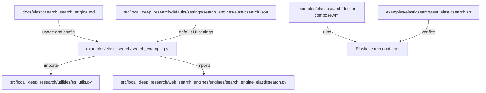
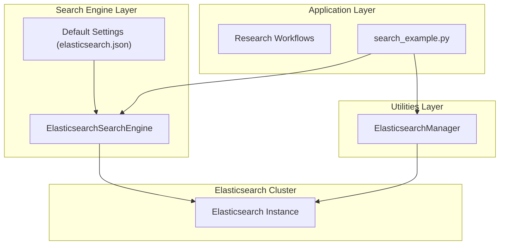
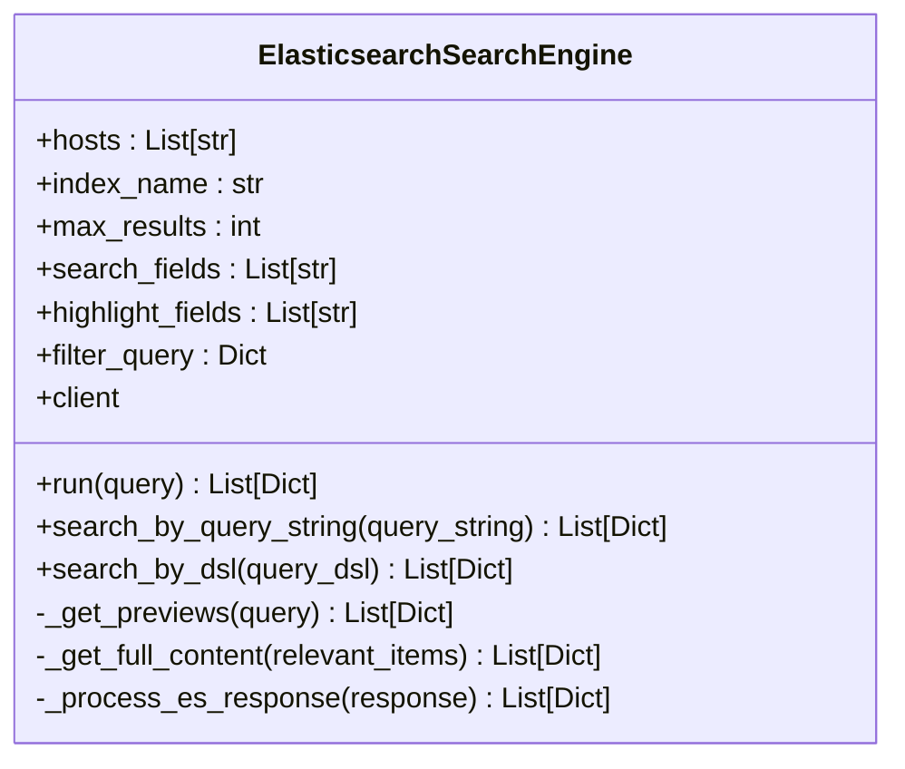
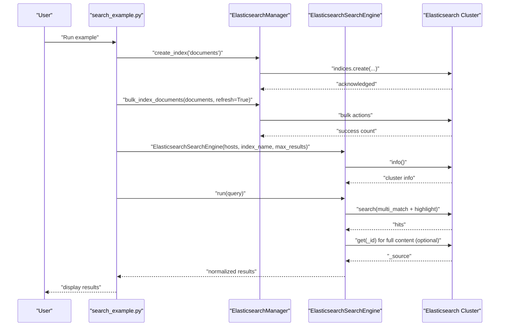
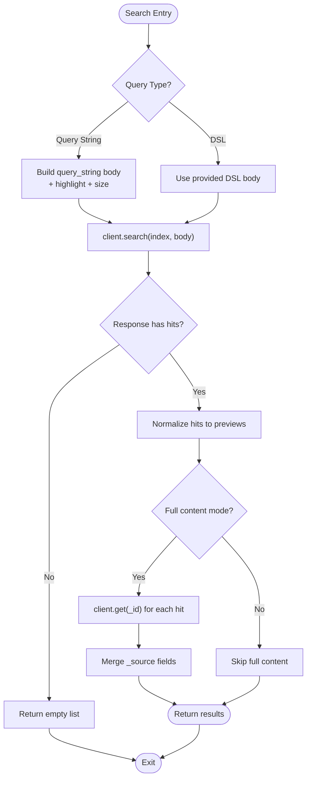
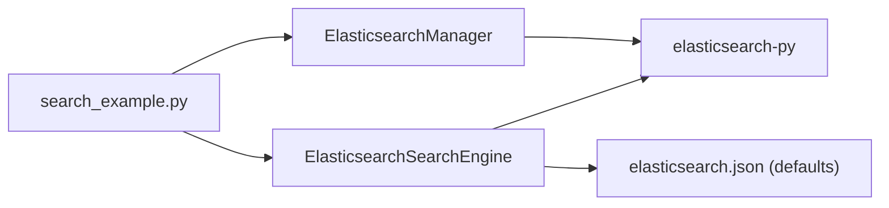

# Elasticsearch Integration Example

<cite>
**Referenced Files in This Document**
- [search_example.py](file://examples/elasticsearch/search_example.py)
- [README.md](file://examples/elasticsearch/README.md)
- [docker-compose.yml](file://examples/elasticsearch/docker-compose.yml)
- [test_elasticsearch.sh](file://examples/elasticsearch/test_elasticsearch.sh)
- [es_utils.py](file://src/local_deep_research/utilities/es_utils.py)
- [search_engine_elasticsearch.py](file://src/local_deep_research/web_search_engines/engines/search_engine_elasticsearch.py)
- [elasticsearch_search_engine.md](file://docs/elasticsearch_search_engine.md)
- [elasticsearch.json](file://src/local_deep_research/defaults/settings/search_engines/elasticsearch.json)
</cite>

## Table of Contents
1. [Introduction](#introduction)
2. [Project Structure](#project-structure)
3. [Core Components](#core-components)
4. [Architecture Overview](#architecture-overview)
5. [Detailed Component Analysis](#detailed-component-analysis)
6. [Dependency Analysis](#dependency-analysis)
7. [Performance Considerations](#performance-considerations)
8. [Troubleshooting Guide](#troubleshooting-guide)
9. [Conclusion](#conclusion)
10. [Appendices](#appendices)

## Introduction
This document explains how the local-deep-research project integrates with Elasticsearch to power enhanced search capabilities. It focuses on the example script that demonstrates connecting to an Elasticsearch cluster, configuring index mappings, indexing sample documents, and executing queries using both query string syntax and Elasticsearch Domain Specific Language (DSL). It also covers how results are retrieved, parsed, and prepared for downstream research workflows, along with performance optimization techniques, authentication configuration, and operational guidance.

## Project Structure
The Elasticsearch integration example is organized under the examples directory and includes:
- A runnable example script that indexes sample documents and performs searches
- A Docker Compose file to quickly spin up a local Elasticsearch instance
- A shell script to verify connectivity and readiness
- Supporting documentation and default settings for the Elasticsearch search engine

**Diagram sources**
- [search_example.py](file://examples/elasticsearch/search_example.py#L1-L179)
- [es_utils.py](file://src/local_deep_research/utilities/es_utils.py#L1-L447)
- [search_engine_elasticsearch.py](file://src/local_deep_research/web_search_engines/engines/search_engine_elasticsearch.py#L1-L363)
- [docker-compose.yml](file://examples/elasticsearch/docker-compose.yml#L1-L17)
- [test_elasticsearch.sh](file://examples/elasticsearch/test_elasticsearch.sh#L1-L81)
- [elasticsearch_search_engine.md](file://docs/elasticsearch_search_engine.md#L1-L155)
- [elasticsearch.json](file://src/local_deep_research/defaults/settings/search_engines/elasticsearch.json#L1-L283)

**Section sources**
- [README.md](file://examples/elasticsearch/README.md#L1-L41)
- [search_example.py](file://examples/elasticsearch/search_example.py#L1-L179)
- [docker-compose.yml](file://examples/elasticsearch/docker-compose.yml#L1-L17)
- [test_elasticsearch.sh](file://examples/elasticsearch/test_elasticsearch.sh#L1-L81)
- [elasticsearch_search_engine.md](file://docs/elasticsearch_search_engine.md#L1-L155)
- [elasticsearch.json](file://src/local_deep_research/defaults/settings/search_engines/elasticsearch.json#L1-L283)

## Core Components
- ElasticsearchManager: Provides index lifecycle operations (create/delete), single and bulk document indexing, file and directory indexing, and a general-purpose search method with highlighting.
- ElasticsearchSearchEngine: Implements a two-phase search pipeline that retrieves previews and optionally fetches full content, supports query string and DSL search, and integrates optional LLM-based relevance filtering.
- Example script: Demonstrates end-to-end usage—creating an index, indexing sample documents, and executing basic and advanced searches.

Key responsibilities:
- ElasticsearchManager
  - Connection configuration via hosts, username/password, API key, or cloud ID
  - Index mapping and settings management
  - Bulk indexing and file-based indexing
  - Multi-field search with highlighting
- ElasticsearchSearchEngine
  - Two-phase retrieval: previews then full content
  - Query string and DSL search entry points
  - Result normalization into a unified structure for research workflows
  - Optional filter query composition and snippet-only mode support

**Section sources**
- [es_utils.py](file://src/local_deep_research/utilities/es_utils.py#L1-L447)
- [search_engine_elasticsearch.py](file://src/local_deep_research/web_search_engines/engines/search_engine_elasticsearch.py#L1-L363)
- [search_example.py](file://examples/elasticsearch/search_example.py#L1-L179)

## Architecture Overview
The integration follows a layered approach:
- Application layer: Example script and research workflows
- Search engine abstraction: ElasticsearchSearchEngine
- Elasticsearch utilities: ElasticsearchManager
- Elasticsearch client: elasticsearch-py

**Diagram sources**
- [search_example.py](file://examples/elasticsearch/search_example.py#L1-L179)
- [search_engine_elasticsearch.py](file://src/local_deep_research/web_search_engines/engines/search_engine_elasticsearch.py#L1-L363)
- [es_utils.py](file://src/local_deep_research/utilities/es_utils.py#L1-L447)
- [elasticsearch.json](file://src/local_deep_research/defaults/settings/search_engines/elasticsearch.json#L1-L283)

## Detailed Component Analysis

### ElasticsearchManager: Index Management and Search Utilities
- Connection and authentication
  - Supports hosts, username/password, API key, and cloud ID
  - Validates connectivity by fetching cluster info
- Index operations
  - create_index: Creates indices with default mappings and settings if not provided
  - delete_index: Safely deletes indices if they exist
- Document operations
  - index_document: Single document indexing with optional refresh
  - bulk_index_documents: Batch indexing with optional ID extraction from a specified field
  - index_file: Loads file content via UnstructuredFileLoader and indexes with optional metadata
  - index_directory: Recursively indexes files matching patterns
- Search utility
  - search: Executes multi-field best_fields search with highlighting and configurable size

Implementation highlights:
- Default mappings include text fields with standard analyzers and keyword sub-fields for exact matches
- Default settings define shard/replica counts and analyzer configuration
- Bulk indexing uses helpers.bulk with stats_only for performance
- Search uses multi_match best_fields with tie_breaker to balance field relevance

**Section sources**
- [es_utils.py](file://src/local_deep_research/utilities/es_utils.py#L1-L447)

### ElasticsearchSearchEngine: Two-Phase Retrieval and Query Methods
- Initialization and authentication mirror ElasticsearchManager
- Two-phase retrieval
  - _get_previews: Builds and executes a multi-match query with highlighting, applies optional filter query, and normalizes results
  - _get_full_content: Optionally fetches full documents by ID and merges metadata
- Query methods
  - run: High-level entry point that delegates to _get_previews and _get_full_content
  - search_by_query_string: Executes query string syntax search with highlighting
  - search_by_dsl: Executes arbitrary DSL queries passed as JSON bodies
- Result normalization
  - Produces a unified structure with id, title, link, snippet, score, and _index
  - Falls back to content excerpt if highlighting is unavailable

**Diagram sources**
- [search_engine_elasticsearch.py](file://src/local_deep_research/web_search_engines/engines/search_engine_elasticsearch.py#L1-L363)

**Section sources**
- [search_engine_elasticsearch.py](file://src/local_deep_research/web_search_engines/engines/search_engine_elasticsearch.py#L1-L363)

### Example Script: End-to-End Workflow
- Indexing
  - Creates an index named “documents”
  - Bulk indexes sample documents with refresh enabled for immediate searchability
- Basic search
  - Initializes ElasticsearchSearchEngine with hosts, index name, and max results
  - Executes run(query) and prints results with titles, snippets, and scores
- Advanced search
  - Demonstrates query string syntax and DSL queries
  - Uses bool must/filter composition for combined matching and filtering

**Diagram sources**
- [search_example.py](file://examples/elasticsearch/search_example.py#L1-L179)
- [es_utils.py](file://src/local_deep_research/utilities/es_utils.py#L1-L447)
- [search_engine_elasticsearch.py](file://src/local_deep_research/web_search_engines/engines/search_engine_elasticsearch.py#L1-L363)

**Section sources**
- [search_example.py](file://examples/elasticsearch/search_example.py#L1-L179)

### Setup and Configuration
- Local Elasticsearch instance
  - Use Docker Compose to start a single-node Elasticsearch container exposing port 9200
  - Data volume persists across runs
- Authentication
  - Username/password, API key, or cloud ID supported in both ElasticsearchManager and ElasticsearchSearchEngine
  - Default example runs without authentication
- Index management
  - Default mappings include text fields with standard analyzers and keyword sub-fields
  - Default settings configure shards and replicas
- Web UI integration
  - Default settings define hosts, index name, max results, search fields, and highlight fields
  - The example script’s index name aligns with the default UI setting

Operational steps:
- Start Elasticsearch with Docker Compose
- Run the example script to index and search
- Configure the Elasticsearch search engine in the web UI using the default settings

**Section sources**
- [docker-compose.yml](file://examples/elasticsearch/docker-compose.yml#L1-L17)
- [elasticsearch.json](file://src/local_deep_research/defaults/settings/search_engines/elasticsearch.json#L1-L283)
- [elasticsearch_search_engine.md](file://docs/elasticsearch_search_engine.md#L1-L155)

### Query DSL Usage and Result Parsing
- Query string syntax
  - Supported via search_by_query_string
  - Highlights matched fields and respects configured search fields
- DSL queries
  - Supported via search_by_dsl
  - Allows complex structures like bool must/filter combinations
- Result parsing
  - Normalized previews include id, title, link, snippet, score, and _index
  - Full content retrieval merges metadata from the source document
  - Snippet fallback uses content excerpt when highlighting is unavailable

**Diagram sources**
- [search_engine_elasticsearch.py](file://src/local_deep_research/web_search_engines/engines/search_engine_elasticsearch.py#L1-L363)

**Section sources**
- [search_engine_elasticsearch.py](file://src/local_deep_research/web_search_engines/engines/search_engine_elasticsearch.py#L1-L363)

## Dependency Analysis
- Internal dependencies
  - search_example.py depends on es_utils.py and search_engine_elasticsearch.py
  - ElasticsearchSearchEngine depends on elasticsearch-py and LangChain LLM interface
  - ElasticsearchManager depends on elasticsearch-py and helpers.bulk
- External dependencies
  - Elasticsearch Python client
  - Optional file loaders for indexing files
- Default settings
  - elasticsearch.json defines UI-configurable parameters for hosts, index name, max results, search fields, and highlight fields

**Diagram sources**
- [search_example.py](file://examples/elasticsearch/search_example.py#L1-L179)
- [es_utils.py](file://src/local_deep_research/utilities/es_utils.py#L1-L447)
- [search_engine_elasticsearch.py](file://src/local_deep_research/web_search_engines/engines/search_engine_elasticsearch.py#L1-L363)
- [elasticsearch.json](file://src/local_deep_research/defaults/settings/search_engines/elasticsearch.json#L1-L283)

**Section sources**
- [search_example.py](file://examples/elasticsearch/search_example.py#L1-L179)
- [elasticsearch.json](file://src/local_deep_research/defaults/settings/search_engines/elasticsearch.json#L1-L283)

## Performance Considerations
- Query optimization
  - Use multi_match best_fields with tie_breaker to balance relevance across fields
  - Limit size to reduce payload and latency
  - Prefer keyword sub-fields for exact filters and aggregations
- Result filtering
  - Apply filter queries in bool must/filter to narrow results early
  - Consider snippet-only mode to avoid full document retrieval when appropriate
- Caching strategies
  - Cache frequent queries at the application level keyed by normalized query and fields
  - Use short-lived caches for dynamic content; invalidate on index refresh
- Index tuning
  - Adjust number_of_shards and replicas based on workload
  - Choose analyzers appropriate for your content (standard vs ICU)
- Bulk operations
  - Use bulk_index_documents for large-scale ingestion
  - Refresh only when immediate searchability is required

[No sources needed since this section provides general guidance]

## Troubleshooting Guide
Common issues and resolutions:
- Cannot connect to Elasticsearch
  - Verify the Elasticsearch server is running and reachable
  - Confirm host address and port
  - Validate authentication credentials if required
  - Check network/firewall settings
- Empty search results
  - Ensure the index exists and contains data
  - Verify search fields match your mappings
  - Simplify the query to isolate the issue
  - Inspect Elasticsearch logs for errors
- Authentication failures
  - Confirm username/password, API key, or cloud ID configuration
  - Ensure credentials are set consistently in both ElasticsearchManager and ElasticsearchSearchEngine
- Version compatibility
  - The example targets Elasticsearch 8.x; ensure your cluster version matches expectations
- Docker environment
  - Use the provided Docker Compose file to start a local single-node instance
  - Use the test script to verify readiness and cluster info

**Section sources**
- [elasticsearch_search_engine.md](file://docs/elasticsearch_search_engine.md#L140-L155)
- [test_elasticsearch.sh](file://examples/elasticsearch/test_elasticsearch.sh#L1-L81)

## Conclusion
The Elasticsearch integration in local-deep-research provides a robust foundation for enhanced search workflows. The example script demonstrates a practical path from index creation to query execution and result normalization. By leveraging ElasticsearchManager for index operations and ElasticsearchSearchEngine for retrieval, developers can integrate Elasticsearch into research pipelines with strong support for query string syntax, DSL, highlighting, and optional full-content retrieval. Proper configuration of authentication, index mappings, and query parameters ensures reliable and performant search experiences.

[No sources needed since this section summarizes without analyzing specific files]

## Appendices

### Appendix A: Example Script Walkthrough
- Index creation and bulk indexing
  - Creates the “documents” index with default mappings and settings
  - Bulk indexes sample documents and refreshes immediately
- Basic search
  - Initializes ElasticsearchSearchEngine with hosts, index name, and max results
  - Executes run(query) and prints normalized results
- Advanced search
  - Demonstrates query string and DSL usage with bool must/filter composition

**Section sources**
- [search_example.py](file://examples/elasticsearch/search_example.py#L1-L179)

### Appendix B: Default Settings Reference
- Host URLs, index name, max results, search fields, and highlight fields are configurable via defaults
- These settings align with the example script’s index name and hosts

**Section sources**
- [elasticsearch.json](file://src/local_deep_research/defaults/settings/search_engines/elasticsearch.json#L1-L283)