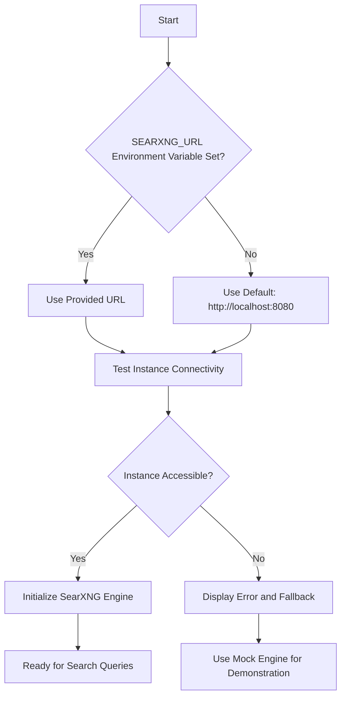
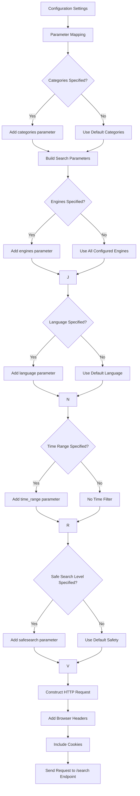
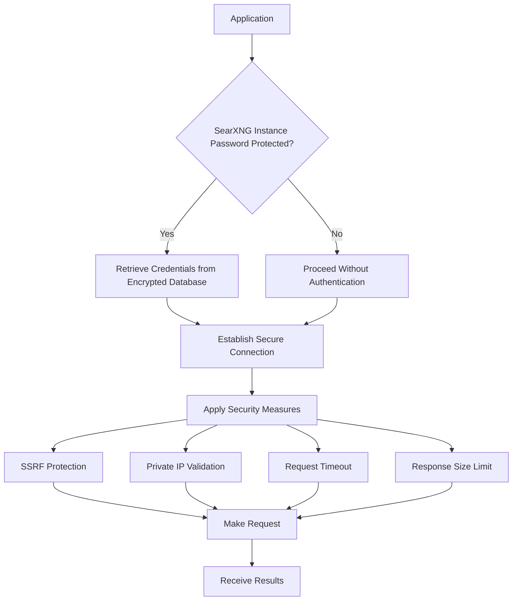
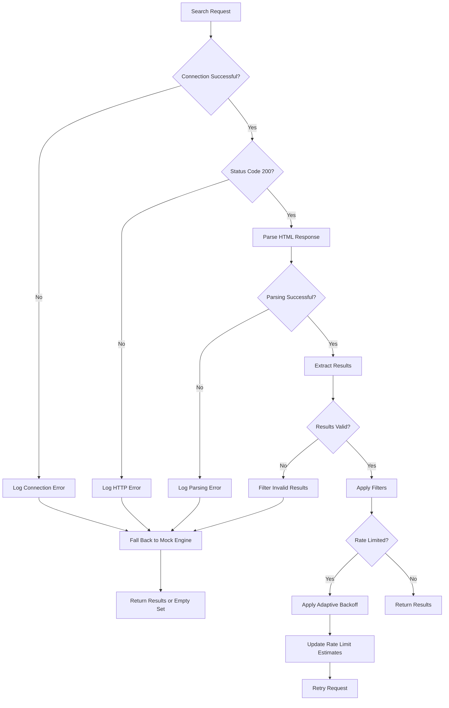
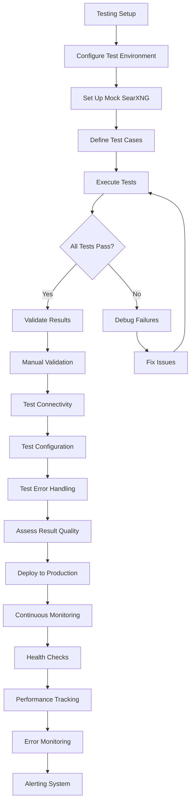

# SearXNG Integration Example

<cite>
**Referenced Files in This Document**   
- [searxng_example.py](file://examples/api_usage/programmatic/searxng_example.py)
- [search_engine_searxng.py](file://src/local_deep_research/web_search_engines/engines/search_engine_searxng.py)
- [search_engine_base.py](file://src/local_deep_research/web_search_engines/search_engine_base.py)
- [search_engine_factory.py](file://src/local_deep_research/web_search_engines/search_engine_factory.py)
- [search_engines_config.py](file://src/local_deep_research/web_search_engines/search_engines_config.py)
- [safe_requests.py](file://src/local_deep_research/security/safe_requests.py)
- [tracker.py](file://src/local_deep_research/web_search_engines/rate_limiting/tracker.py)
- [SearXNG-Setup.md](file://docs/SearXNG-Setup.md)
</cite>

## Table of Contents
1. [Introduction](#introduction)
2. [SearXNG Instance Configuration](#searxng-instance-configuration)
3. [API Endpoint Setup and Query Parameterization](#api-endpoint-setup-and-query-parameterization)
4. [Authentication and Credential Management](#authentication-and-credential-management)
5. [Search Results Retrieval and Normalization](#search-results-retrieval-and-normalization)
6. [Error Handling Strategies](#error-handling-strategies)
7. [Testing and Validation Guidelines](#testing-and-validation-guidelines)
8. [Best Practices for SearXNG Instances](#best-practices-for-searxng-instances)
9. [Conclusion](#conclusion)

## Introduction
This document provides a comprehensive guide to integrating SearXNG with the local-deep-research system for privacy-preserving web search. The integration enables users to leverage SearXNG's federated search capabilities while maintaining control over their data and search privacy. The implementation is demonstrated through the `searxng_example.py` file, which showcases how to configure and use SearXNG as a search engine within the research system. This document will thoroughly explain the implementation details, including configuration, authentication, error handling, and best practices for reliable integration.

**Section sources**
- [searxng_example.py](file://examples/api_usage/programmatic/searxng_example.py#L1-L177)

## SearXNG Instance Configuration
The SearXNG integration requires proper configuration of the SearXNG instance URL and related parameters. The system is designed to work with self-hosted instances for maximum privacy and reliability. Configuration can be done through environment variables or settings snapshots, with the environment variable `SEARXNG_URL` being the primary method. The default configuration points to `http://localhost:8080`, which is the standard port for a locally running SearXNG Docker container.

The configuration process begins by checking for the `SEARXNG_URL` environment variable, which can be set to any accessible SearXNG instance. If not specified, the default localhost URL is used. The system validates the instance URL by making a connectivity test during initialization, ensuring the instance is accessible before proceeding with searches. This validation includes checking the HTTP status code and handling connection exceptions, providing clear feedback if the instance is unreachable.

Self-hosting is strongly recommended for ethical usage and better performance. The documentation provides detailed instructions for deploying SearXNG using Docker or Docker Compose, with the latter being preferred for production environments. The Docker Compose configuration includes volume mounting for persistent configuration and environment variables for base URL settings, ensuring a stable and configurable deployment.



**Diagram sources **
- [searxng_example.py](file://examples/api_usage/programmatic/searxng_example.py#L29-L34)
- [search_engine_searxng.py](file://src/local_deep_research/web_search_engines/engines/search_engine_searxng.py#L100-L124)
- [SearXNG-Setup.md](file://docs/SearXNG-Setup.md#L1-L130)

**Section sources**
- [searxng_example.py](file://examples/api_usage/programmatic/searxng_example.py#L29-L34)
- [search_engine_searxng.py](file://src/local_deep_research/web_search_engines/engines/search_engine_searxng.py#L100-L124)
- [SearXNG-Setup.md](file://docs/SearXNG-Setup.md#L1-L130)

## API Endpoint Setup and Query Parameterization
The SearXNG integration utilizes a comprehensive set of query parameters to customize search behavior and results. These parameters are configured through a settings dictionary that maps to specific SearXNG API endpoints and query string parameters. The primary endpoint for search queries is `/search`, which accepts various parameters to control the search process.

Key configuration parameters include:
- **base_url**: The root URL of the SearXNG instance (maps to `instance_url` in the engine)
- **timeout**: Request timeout in seconds (default: 30)
- **categories**: List of search categories to include (e.g., ["general", "science"])
- **engines**: Specific search engines to use (e.g., ["google", "duckduckgo", "bing"])
- **language**: Language code for search results (e.g., "en" for English)
- **time_range**: Temporal filter for results (e.g., "day", "week", "month", "year", or empty for all time)
- **safesearch**: Safety level (0=off, 1=moderate, 2=strict)

The parameterization follows a hierarchical structure in the settings dictionary, using dot notation to organize SearXNG-specific configurations under the `search_engines.searxng` namespace. This structure allows for clear separation of concerns and easy configuration management. The system converts these settings into appropriate HTTP parameters when making requests to the SearXNG API.

The search request construction includes browser-like headers to mimic legitimate user traffic, reducing the likelihood of being blocked by backend search engines. These headers include User-Agent, Accept, Accept-Language, Referer, Connection, and Upgrade-Insecure-Requests, creating a realistic HTTP request profile. The system also handles cookies by first making a request to the instance root to capture session cookies, which are then included in subsequent search requests.



**Diagram sources **
- [searxng_example.py](file://examples/api_usage/programmatic/searxng_example.py#L41-L54)
- [search_engine_searxng.py](file://src/local_deep_research/web_search_engines/engines/search_engine_searxng.py#L227-L243)
- [search_engine_searxng.py](file://src/local_deep_research/web_search_engines/engines/search_engine_searxng.py#L243-L252)

**Section sources**
- [searxng_example.py](file://examples/api_usage/programmatic/searxng_example.py#L41-L54)
- [search_engine_searxng.py](file://src/local_deep_research/web_search_engines/engines/search_engine_searxng.py#L60-L74)
- [search_engine_searxng.py](file://src/local_deep_research/web_search_engines/engines/search_engine_searxng.py#L227-L263)

## Authentication and Credential Management
The SearXNG integration does not require traditional API key authentication, as it operates as a proxy to other search engines rather than a service with individual user accounts. Instead, authentication is handled at the instance level through network access controls and optional SearXNG instance passwords. The system focuses on secure credential management for the connection between the local-deep-research application and the SearXNG instance.

When a SearXNG instance is password-protected, the credentials are managed through the application's secure settings system. The settings are stored in an encrypted database, with access controlled through user authentication. The system uses environment variables or configuration files to specify the instance URL, but sensitive credentials like instance passwords are stored securely in the encrypted database rather than in plaintext configuration files.

The integration employs several security measures to protect the connection:
- **SSRF Protection**: The `safe_get` function validates URLs to prevent Server-Side Request Forgery attacks, ensuring that requests cannot be made to internal network resources.
- **Private IP Access**: The system allows configuration of private IP access for self-hosted instances on local networks, with appropriate security checks to prevent unauthorized access.
- **Timeout Enforcement**: All HTTP requests have a default timeout of 30 seconds to prevent hanging requests and potential denial-of-service conditions.
- **Response Size Limits**: Responses are limited to 10MB to prevent memory exhaustion attacks.

For self-hosted instances, administrators can configure additional security measures such as IP whitelisting, rate limiting at the instance level, and HTTPS encryption. The Docker Compose configuration supports environment variables for setting up basic authentication and SSL termination, providing multiple layers of security for production deployments.



**Diagram sources **
- [safe_requests.py](file://src/local_deep_research/security/safe_requests.py#L14-L51)
- [search_engine_searxng.py](file://src/local_deep_research/web_search_engines/engines/search_engine_searxng.py#L108-L123)
- [database/encrypted_db.py](file://src/local_deep_research/database/encrypted_db.py)

**Section sources**
- [safe_requests.py](file://src/local_deep_research/security/safe_requests.py#L14-L87)
- [search_engine_searxng.py](file://src/local_deep_research/web_search_engines/engines/search_engine_searxng.py#L108-L123)
- [SearXNG-Setup.md](file://docs/SearXNG-Setup.md#L31-L68)

## Search Results Retrieval and Normalization
The SearXNG integration implements a two-phase retrieval process to efficiently obtain and process search results. This approach first retrieves preview information (titles, snippets, URLs) for multiple results, then selectively fetches full content only for the most relevant items. This optimization reduces bandwidth usage and processing time while maintaining comprehensive research capabilities.

The retrieval process begins with the `_get_search_results` method, which sends a GET request to the SearXNG `/search` endpoint with the configured parameters. The response is in HTML format, which is parsed using BeautifulSoup to extract result elements. The system employs multiple CSS selectors to locate result items, accommodating different SearXNG theme variations. The primary selectors include `.result-item`, `.result`, and `article` elements, with fallback to div elements with result IDs.

Once the HTML is parsed, the system extracts three key components from each result:
- **Title**: Extracted from elements with classes like `.result-title`, `.title`, or `h3` tags
- **URL**: Extracted from href attributes of link elements or text content of URL elements
- **Content**: Extracted from elements with classes like `.result-content`, `.content`, `.snippet`, or `p` tags

The extracted results undergo validation to filter out invalid entries, such as relative URLs or links pointing back to the SearXNG instance itself (which would indicate error pages or internal navigation). This validation ensures that only genuine search results from external sources are processed further.

After preview extraction, the system applies a two-step filtering process:
1. **Preview Filtering**: Custom filters are applied to remove irrelevant or low-quality results based on URL patterns, content quality, or other criteria
2. **LLM Relevance Filtering**: When enabled, a language model evaluates the remaining previews and selects the most relevant results based on the research query

For the final results, the system can optionally retrieve full webpage content using the `FullSearchResults` component. This process respects the `search_snippets_only` setting, allowing users to choose between lightweight snippet-only results or comprehensive full-content retrieval. The full content retrieval is rate-limited and includes additional error handling to manage connection issues with external websites.

```mermaid
flowchart TD
A[Send Search Query] --> B[Receive HTML Response]
B --> C[Parse with BeautifulSoup]
C --> D[Extract Result Elements]
D --> E{Multiple Selectors?}
E --> |Yes| F[Try .result-item]
F --> G{Found?}
G --> |No| H[Try .result]
H --> I{Found?}
I --> |No| J[Try article]
J --> K{Found?}
K --> |No| L[Try div[id^='result']]
L --> M[Extract Data from Elements]
M --> N[Validate Results]
N --> O{Valid URL and External?}
O --> |Yes| P[Include in Results]
O --> |No| Q[Discard as Invalid]
P --> R[Apply Preview Filters]
R --> S[LLM Relevance Filtering]
S --> T{Retrieve Full Content?}
T --> |Yes| U[Fetch Full Webpage Content]
T --> |No| V[Use Snippets Only]
U --> W[Process Full Content]
W --> X[Return Final Results]
V --> X
```

**Diagram sources **
- [search_engine_searxng.py](file://src/local_deep_research/web_search_engines/engines/search_engine_searxng.py#L188-L387)
- [search_engine_base.py](file://src/local_deep_research/web_search_engines/search_engine_base.py#L259-L432)
- [search_engine_searxng.py](file://src/local_deep_research/web_search_engines/engines/search_engine_searxng.py#L432-L464)

**Section sources**
- [search_engine_searxng.py](file://src/local_deep_research/web_search_engines/engines/search_engine_searxng.py#L188-L387)
- [search_engine_base.py](file://src/local_deep_research/web_search_engines/search_engine_base.py#L259-L432)
- [search_engine_searxng.py](file://src/local_deep_research/web_search_engines/engines/search_engine_searxng.py#L432-L464)

## Error Handling Strategies
The SearXNG integration implements comprehensive error handling to manage various failure modes and ensure robust operation. The system addresses connection failures, rate limiting, response format issues, and other common API problems through a multi-layered approach that combines immediate error recovery with adaptive learning for future requests.

Connection failures are handled at multiple levels:
- **Instance Availability Check**: During initialization, the system tests connectivity to the SearXNG instance and sets an `is_available` flag accordingly
- **Request-Level Retries**: Failed requests are automatically retried with exponential backoff through the adaptive rate limiting system
- **Fallback Mechanism**: If the SearXNG instance is unreachable, the system can fall back to a mock search engine for demonstration purposes

Rate limiting is managed through an adaptive rate limiting tracker that learns optimal wait times for each search engine. The system monitors success rates and adjusts wait times accordingly, balancing between aggressive searching and respecting API limits. When rate limits are encountered, the system implements exponential backoff and records the outcome to improve future rate limit predictions.

Response format issues are addressed through several mechanisms:
- **HTML Parsing Resilience**: The system uses multiple CSS selectors to locate result elements, accommodating different SearXNG theme variations
- **Result Validation**: Extracted results are validated to ensure they represent genuine search results rather than error pages or internal navigation
- **Graceful Degradation**: If HTML parsing fails or returns no valid results, the system logs the issue and returns an empty result set rather than failing completely

The error handling system also includes specific protections for common SearXNG issues:
- **Backend Engine Failures**: SearXNG may return error pages from its backend search engines; these are filtered out by checking for internal URLs
- **CAPTCHA Challenges**: Some backend engines may present CAPTCHAs, which are detected by analyzing response content and handled by skipping affected results
- **Incomplete Results**: The system monitors the average number of results returned and can trigger alerts if this falls below expected thresholds



**Diagram sources **
- [search_engine_searxng.py](file://src/local_deep_research/web_search_engines/engines/search_engine_searxng.py#L198-L203)
- [search_engine_searxng.py](file://src/local_deep_research/web_search_engines/engines/search_engine_searxng.py#L379-L387)
- [tracker.py](file://src/local_deep_research/web_search_engines/rate_limiting/tracker.py#L226-L290)
- [search_engine_searxng.py](file://src/local_deep_research/web_search_engines/engines/search_engine_searxng.py#L364-L368)

**Section sources**
- [search_engine_searxng.py](file://src/local_deep_research/web_search_engines/engines/search_engine_searxng.py#L198-L203)
- [search_engine_searxng.py](file://src/local_deep_research/web_search_engines/engines/search_engine_searxng.py#L379-L387)
- [tracker.py](file://src/local_deep_research/web_search_engines/rate_limiting/tracker.py#L226-L290)
- [search_engine_searxng.py](file://src/local_deep_research/web_search_engines/engines/search_engine_searxng.py#L364-L368)

## Testing and Validation Guidelines
To ensure reliable operation of the SearXNG integration, comprehensive testing and validation procedures should be followed. These guidelines cover both automated testing and manual validation to verify correct functionality and result quality.

Automated testing includes:
- **Unit Tests**: Verify individual components like parameter handling, result parsing, and error handling
- **Integration Tests**: Test the complete workflow from query submission to result retrieval
- **Mock Testing**: Use mocked HTTP responses to test various scenarios without requiring a live SearXNG instance
- **Performance Testing**: Measure response times and resource usage under different load conditions

Manual validation procedures include:
- **Connectivity Verification**: Confirm the SearXNG instance is accessible at the configured URL
- **Result Quality Assessment**: Evaluate the relevance and accuracy of search results for sample queries
- **Configuration Testing**: Verify that all configuration parameters (categories, engines, language, etc.) are properly applied
- **Error Scenario Testing**: Test the system's behavior when the SearXNG instance is unavailable or returning errors

The system includes built-in validation features:
- **Connection Testing**: The integration automatically tests connectivity during initialization
- **Search Quality Monitoring**: The rate limiting system tracks average results per query and can trigger alerts for degraded performance
- **Fallback Mechanism**: When the primary SearXNG instance fails, a mock engine provides basic functionality for demonstration

For production deployments, continuous monitoring should be implemented to track:
- **Instance Availability**: Regular health checks to ensure the SearXNG instance is responsive
- **Result Volume**: Monitoring the average number of results returned to detect backend engine issues
- **Error Rates**: Tracking connection failures and parsing errors to identify systemic problems
- **Performance Metrics**: Response times and resource usage to identify bottlenecks



**Diagram sources **
- [test_search_engine_searxng.py](file://tests/search_engines/test_search_engine_searxng.py)
- [searxng_example.py](file://examples/api_usage/programmatic/searxng_example.py#L61-L69)
- [tracker.py](file://src/local_deep_research/web_search_engines/rate_limiting/tracker.py#L650-L697)

**Section sources**
- [test_search_engine_searxng.py](file://tests/search_engines/test_search_engine_searxng.py)
- [searxng_example.py](file://examples/api_usage/programmatic/searxng_example.py#L61-L69)
- [tracker.py](file://src/local_deep_research/web_search_engines/rate_limiting/tracker.py#L650-L697)

## Best Practices for SearXNG Instances
To ensure optimal performance and reliability when using SearXNG with the local-deep-research system, several best practices should be followed for instance selection and configuration.

**Instance Selection Guidelines:**
- **Self-Hosting**: Always prefer self-hosted instances over public instances for better reliability, privacy, and control
- **Instance Health**: Choose instances with high uptime and responsive maintainers
- **Engine Configuration**: Select instances with multiple backend search engines configured (Google, Bing, DuckDuckGo, etc.)
- **Geographic Proximity**: Choose instances geographically close to reduce latency
- **Privacy Policy**: Review the instance's privacy policy and data handling practices

**Configuration Best Practices:**
- **Regular Updates**: Keep the SearXNG instance updated with the latest version and security patches
- **Resource Allocation**: Ensure adequate CPU, memory, and network bandwidth for the expected load
- **Backup Strategy**: Implement regular backups of instance configuration and data
- **Monitoring**: Set up monitoring for instance availability, performance, and error rates
- **Security Hardening**: Implement HTTPS, rate limiting, and access controls

**Operational Best Practices:**
- **Instance Monitoring**: Regularly check instance health and performance metrics
- **Engine Testing**: Periodically test all configured search engines to ensure they are working
- **Configuration Validation**: Verify that instance settings (categories, languages, etc.) match requirements
- **Update Management**: Plan and test updates before applying them to production instances
- **User Documentation**: Maintain clear documentation for instance configuration and troubleshooting

For production deployments, consider implementing redundancy with multiple SearXNG instances and a load balancing strategy. This approach provides failover capabilities and can distribute load across multiple instances, improving overall reliability and performance.

**Section sources**
- [SearXNG-Setup.md](file://docs/SearXNG-Setup.md)
- [search_engine_searxng.py](file://src/local_deep_research/web_search_engines/engines/search_engine_searxng.py#L517-L562)
- [cookiecutter.json](file://cookiecutter-docker/cookiecutter.json#L1-L9)

## Conclusion
The SearXNG integration in local-deep-research provides a powerful, privacy-preserving solution for web search that combines the benefits of federated search with comprehensive research capabilities. By leveraging a self-hosted SearXNG instance, users can maintain control over their search data while accessing results from multiple search engines through a single interface. The integration demonstrates robust design principles, including comprehensive error handling, adaptive rate limiting, and secure credential management.

Key strengths of the implementation include its flexibility in configuration, resilience to failures, and efficient two-phase retrieval process that optimizes both performance and result quality. The system's modular design allows for easy customization and extension, while its comprehensive testing framework ensures reliability. By following the best practices outlined in this document, users can deploy and maintain a high-performing SearXNG integration that supports effective research while respecting privacy and ethical considerations.

The integration serves as a model for how privacy-focused search technologies can be effectively incorporated into research systems, providing a template that could be adapted for other federated search services. As privacy concerns continue to grow in importance, solutions like this SearXNG integration will play an increasingly critical role in enabling ethical, transparent, and user-controlled research workflows.