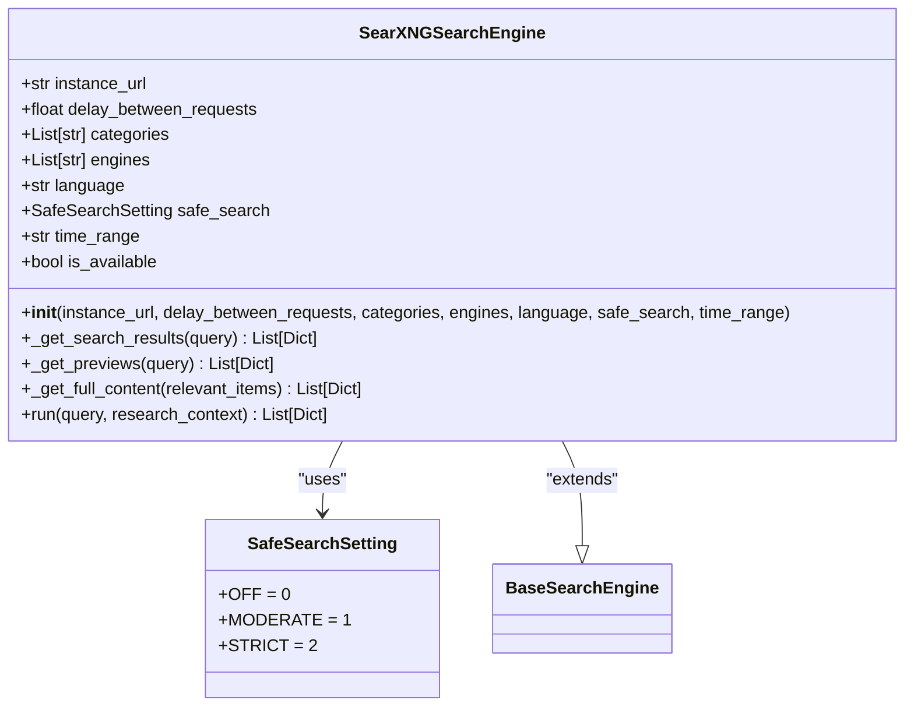
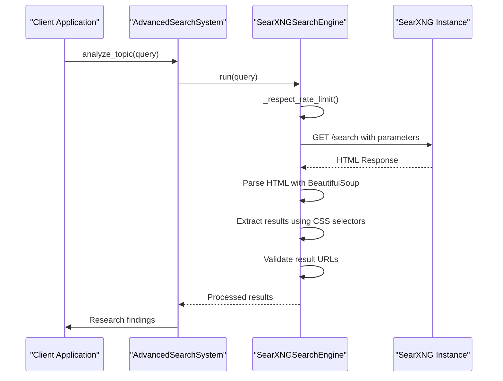
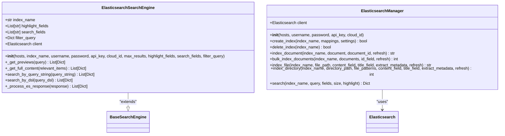
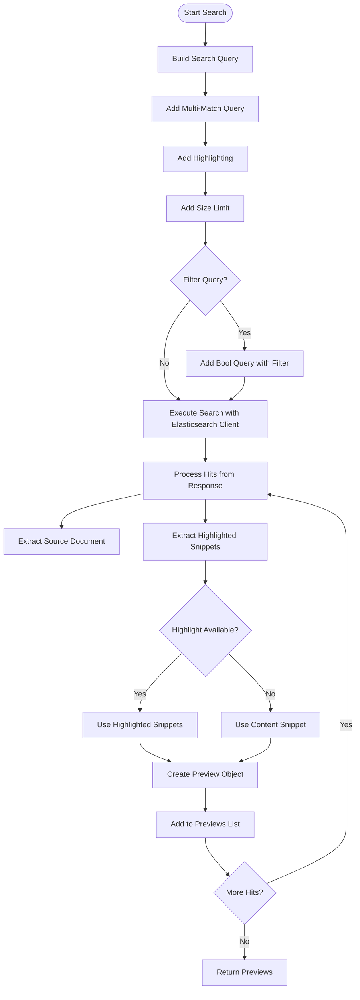
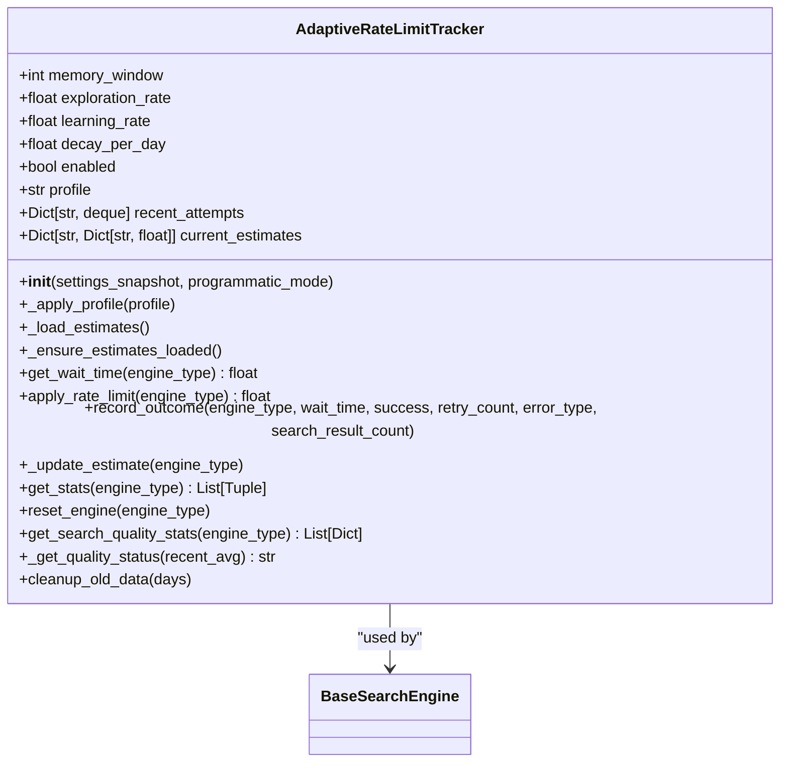

# Search Engine Integration Examples

<cite>
**Referenced Files in This Document**   
- [searxng_example.py](file://examples/api_usage/programmatic/searxng_example.py)
- [search_example.py](file://examples/elasticsearch/search_example.py)
- [SearXNG-Setup.md](file://docs/SearXNG-Setup.md)
- [elasticsearch_search_engine.md](file://docs/elasticsearch_search_engine.md)
- [search-engines.md](file://docs/search-engines.md)
- [search_engine_searxng.py](file://src/local_deep_research/web_search_engines/engines/search_engine_searxng.py)
- [search_engine_elasticsearch.py](file://src/local_deep_research/web_search_engines/engines/search_engine_elasticsearch.py)
- [search_engine_base.py](file://src/local_deep_research/web_search_engines/search_engine_base.py)
- [es_utils.py](file://src/local_deep_research/utilities/es_utils.py)
- [tracker.py](file://src/local_deep_research/web_search_engines/rate_limiting/tracker.py)
- [default_search_engines.py](file://src/local_deep_research/web_search_engines/default_search_engines.py)
- [search_config.py](file://src/local_deep_research/config/search_config.py)
</cite>

## Table of Contents
1. [Introduction](#introduction)
2. [SearXNG Integration](#searxng-integration)
3. [Elasticsearch Integration](#elasticsearch-integration)
4. [Common Integration Patterns](#common-integration-patterns)
5. [Testing and Validation](#testing-and-validation)
6. [Conclusion](#conclusion)

## Introduction

This document provides comprehensive guidance on integrating external search services with the local-deep-research system. It focuses on two primary integration examples: SearXNG for privacy-preserving web search and Elasticsearch for enhanced search capabilities within custom data collections. The documentation covers implementation details, configuration options, authentication setup, query parameterization, result parsing, and best practices for secure and efficient search engine integration.

The local-deep-research system supports multiple search engines through a modular architecture that allows seamless integration of both public and private search services. The system is designed to handle various search scenarios, from general web queries to specialized academic and technical searches, while maintaining user privacy and data security.

**Section sources**
- [search-engines.md](file://docs/search-engines.md#L1-L253)

## SearXNG Integration

### Authentication and Instance Configuration

SearXNG integration requires proper instance configuration and authentication setup. The system is designed to work with self-hosted SearXNG instances for maximum privacy and ethical usage. By default, the SearXNG search engine is disabled until an instance URL is provided, ensuring that the system doesn't attempt to use public instances without explicit configuration.

Authentication is handled through instance URL configuration rather than traditional API keys. The system supports two primary methods for configuring SearXNG access:

1. **Environment Variable (Recommended)**:
```bash
SEARXNG_INSTANCE=http://localhost:8080
SEARXNG_DELAY=2.0
```

2. **Configuration Parameter**:
```python
SEARXNG_CONFIG = {
    "instance_url": "http://localhost:8080",
    "delay_between_requests": 2.0
}
```

The system validates the instance URL during initialization and checks accessibility by making a test request to the instance. This ensures that the SearXNG service is running and accessible before attempting searches.



**Diagram sources**
- [search_engine_searxng.py](file://src/local_deep_research/web_search_engines/engines/search_engine_searxng.py#L26-L588)

**Section sources**
- [SearXNG-Setup.md](file://docs/SearXNG-Setup.md#L1-L130)
- [search_engine_searxng.py](file://src/local_deep_research/web_search_engines/engines/search_engine_searxng.py#L1-L588)

### Query Parameterization

The SearXNG search engine supports extensive query parameterization to customize search behavior and results. Key parameters include:

| Parameter | Type | Default Value | Description |
| :--- | :--- | :--- | :--- |
| max_results | int | 15 | Maximum number of search results to return |
| instance_url | str | "http://localhost:8080" | URL of the SearXNG instance |
| categories | List[str] | ["general"] | Categories to search in (general, images, videos, news, etc.) |
| engines | List[str] | None | Specific search engines to use (google, bing, duckduckgo, etc.) |
| language | str | "en" | Language code for search results |
| safe_search | str/int | 0 (OFF) | Safe search level (0=off, 1=moderate, 2=strict) |
| time_range | str | "" (all time) | Time range for results (day, week, month, year) |
| delay_between_requests | float | 0.0 | Seconds to wait between requests |

The `searxng_example.py` demonstrates how to configure these parameters programmatically:

```python
settings = {
    "search.iterations": 2,
    "search.questions_per_iteration": 3,
    "search.strategy": "source-based",
    "rate_limiting.enabled": False,
    "search_engines.searxng.base_url": searxng_url,
    "search_engines.searxng.timeout": 30,
    "search_engines.searxng.categories": ["general", "science"],
    "search_engines.searxng.engines": ["google", "duckduckgo", "bing"],
    "search_engines.searxng.language": "en",
    "search_engines.searxng.time_range": "",
    "search_engines.searxng.safesearch": 0,
}
```

**Section sources**
- [searxng_example.py](file://examples/api_usage/programmatic/searxng_example.py#L1-L177)
- [search_engine_searxng.py](file://src/local_deep_research/web_search_engines/engines/search_engine_searxng.py#L60-L74)

### Result Parsing and Processing

The SearXNG integration implements a two-phase retrieval approach for efficient result processing:

1. **Preview Retrieval**: The system first retrieves preview information (titles, summaries) for initial search results using the `_get_previews` method.
2. **Relevance Filtering**: Previews are filtered for relevance using an LLM when enabled.
3. **Full Content Retrieval**: Full content is retrieved only for relevant results using the `_get_full_content` method.

The result parsing process involves HTML parsing using BeautifulSoup to extract search results from the SearXNG interface. The system identifies result elements using CSS selectors and extracts title, URL, and content information. It includes validation to ensure that only valid search results are processed, filtering out error pages and internal SearXNG pages.

The integration handles different search result formats by attempting multiple CSS selectors to locate result elements:
- `.result-item`
- `.result`
- `article`
- `div[id^="result"]`

This flexible approach ensures compatibility with different SearXNG themes and configurations.



**Diagram sources**
- [search_engine_searxng.py](file://src/local_deep_research/web_search_engines/engines/search_engine_searxng.py#L188-L387)

**Section sources**
- [search_engine_searxng.py](file://src/local_deep_research/web_search_engines/engines/search_engine_searxng.py#L188-L387)

## Elasticsearch Integration

### Index Configuration and Mapping

Elasticsearch integration requires proper index configuration and mapping to ensure optimal search performance and relevance. The system provides the `ElasticsearchManager` utility class to simplify index management and document indexing.

Index creation includes default mappings for better text search:
- **title**: Text field with keyword sub-field for exact matching
- **content**: Text field with standard analyzer
- **url**: Keyword field for exact matching
- **source**: Keyword field for source tracking
- **timestamp**: Date field for temporal queries
- **metadata**: Object field for additional metadata

```python
mappings = {
    "properties": {
        "title": {
            "type": "text",
            "analyzer": "standard",
            "fields": {
                "keyword": {
                    "type": "keyword",
                    "ignore_above": 256,
                }
            },
        },
        "content": {"type": "text", "analyzer": "standard"},
        "url": {"type": "keyword"},
        "source": {"type": "keyword"},
        "timestamp": {"type": "date"},
        "metadata": {"type": "object", "enabled": True},
    }
}
```

The `search_example.py` demonstrates index creation and sample document indexing:

```python
# Create index
index_name = "documents"
es_manager.create_index(index_name)

# Prepare sample documents
documents = [
    {
        "title": "Elasticsearch 简介",
        "content": "Elasticsearch 是一个分布式、开源的搜索和分析引擎，适用于所有类型的数据。",
        "tags": ["搜索引擎", "数据库", "全文搜索"],
        "category": "技术",
    },
    # Additional documents...
]

# Bulk index documents
success_count = es_manager.bulk_index_documents(
    index_name=index_name,
    documents=documents,
    refresh=True,
)
```



**Diagram sources**
- [search_engine_elasticsearch.py](file://src/local_deep_research/web_search_engines/engines/search_engine_elasticsearch.py#L11-L363)
- [es_utils.py](file://src/local_deep_research/utilities/es_utils.py#L13-L447)

**Section sources**
- [search_example.py](file://examples/elasticsearch/search_example.py#L1-L179)
- [elasticsearch_search_engine.md](file://docs/elasticsearch_search_engine.md#L1-L155)
- [search_engine_elasticsearch.py](file://src/local_deep_research/web_search_engines/engines/search_engine_elasticsearch.py#L1-L363)
- [es_utils.py](file://src/local_deep_research/utilities/es_utils.py#L1-L447)

### Query DSL Usage

The Elasticsearch integration supports multiple query methods, including Query String syntax and Elasticsearch DSL (Domain Specific Language). This flexibility allows for complex search queries with precise control over search behavior.

**Query String Syntax**:
```python
query_string = "content:深度学习 OR title:elasticsearch"
results = search_engine.search_by_query_string(query_string)
```

**Elasticsearch DSL**:
```python
query_dsl = {
    "query": {
        "bool": {
            "must": {"match": {"content": "人工智能"}},
            "filter": {"term": {"category.keyword": "人工智能"}},
        }
    }
}
results = search_engine.search_by_dsl(query_dsl)
```

The system implements a two-phase retrieval approach similar to SearXNG:
1. **Preview Retrieval**: Uses multi-match queries with highlighting to retrieve document previews.
2. **Full Content Retrieval**: Fetches complete documents for relevant results.

The `_get_previews` method constructs search queries with:
- Multi-match queries across specified search fields
- Highlighting for improved result presentation
- Size limits based on `max_results` parameter
- Optional filtering based on `filter_query` parameter



**Diagram sources**
- [search_engine_elasticsearch.py](file://src/local_deep_research/web_search_engines/engines/search_engine_elasticsearch.py#L104-L135)

**Section sources**
- [search_example.py](file://examples/elasticsearch/search_example.py#L124-L154)
- [search_engine_elasticsearch.py](file://src/local_deep_research/web_search_engines/engines/search_engine_elasticsearch.py#L104-L135)

### Performance Optimization Techniques

The Elasticsearch integration includes several performance optimization techniques:

1. **Bulk Indexing**: The `bulk_index_documents` method efficiently indexes multiple documents in a single request, reducing network overhead.

2. **Asynchronous Operations**: While not explicitly shown in the examples, the integration can be enhanced with asynchronous operations for improved performance.

3. **Connection Pooling**: The Elasticsearch client maintains a connection pool for efficient reuse of connections.

4. **Caching**: The system can be configured to cache search results to reduce redundant queries.

5. **Index Optimization**: Proper index settings including shard and replica configuration:
```python
settings = {
    "number_of_shards": 1,
    "number_of_replicas": 0,
    "analysis": {
        "analyzer": {"standard": {"type": "standard"}}
    },
}
```

6. **Field Selection**: Limiting search to specific fields improves performance and relevance.

7. **Result Size Management**: Configurable `max_results` parameter prevents excessive data retrieval.

The integration also supports advanced features like:
- **File indexing**: Automatic content extraction from various file formats (PDF, DOCX, etc.)
- **Directory indexing**: Recursive indexing of entire directories
- **Metadata extraction**: Automatic extraction of file metadata

**Section sources**
- [es_utils.py](file://src/local_deep_research/utilities/es_utils.py#L207-L253)
- [search_engine_elasticsearch.py](file://src/local_deep_research/web_search_engines/engines/search_engine_elasticsearch.py#L104-L135)

## Common Integration Patterns

### Rate Limiting and Reliability

Both SearXNG and Elasticsearch integrations implement robust rate limiting and reliability mechanisms. The system uses an adaptive rate limiting approach that learns optimal wait times for each search engine based on historical performance.

The `AdaptiveRateLimitTracker` class manages rate limiting with the following features:
- **Memory Window**: Tracks recent attempts (default: 100)
- **Exploration Rate**: Balances exploration of faster rates with exploitation of known good rates (default: 0.1)
- **Learning Rate**: Controls how quickly new information updates estimates (default: 0.3)
- **Decay Per Day**: Reduces confidence in old estimates over time (default: 0.95)



**Diagram sources**
- [tracker.py](file://src/local_deep_research/web_search_engines/rate_limiting/tracker.py#L43-L762)

**Section sources**
- [tracker.py](file://src/local_deep_research/web_search_engines/rate_limiting/tracker.py#L43-L762)
- [search_engine_base.py](file://src/local_deep_research/web_search_engines/search_engine_base.py#L25-L33)

### Error Handling and Fallback Strategies

The system implements comprehensive error handling and fallback strategies to ensure reliability:

1. **Connection Validation**: Both integrations validate connectivity during initialization.
2. **Retry Mechanisms**: Automatic retry on rate limiting and transient errors.
3. **Fallback to Mock Engines**: When external services are unavailable, the system can use mock search engines for demonstration purposes.
4. **Graceful Degradation**: The system continues to function with reduced capabilities when specific search engines fail.

For SearXNG, the example includes a fallback to a mock search engine:
```python
except Exception as e:
    print(f"\n⚠ Error connecting to SearXNG: {e}")
    print("\nFalling back to mock search engine for demonstration...")
    
    class MockSearchEngine:
        def __init__(self, settings_snapshot=None):
            self.settings_snapshot = settings_snapshot or {}
        
        def run(self, query, research_context=None):
            return [
                {
                    "title": f"Result for: {query}",
                    "link": "https://example.com/result",
                    "snippet": f"This is a mock result for the query: {query}.",
                    "full_content": "Full content would be fetched here...",
                    "rank": 1,
                }
            ]
    
    search_engine = MockSearchEngine(settings)
```

### Result Normalization

The system normalizes search results from different engines into a consistent format:
- **title**: Document or result title
- **link**: URL or identifier
- **snippet**: Summary or excerpt
- **engine**: Source engine identifier
- **category**: Result category
- **score**: Relevance score (when available)

This normalization enables consistent processing and presentation of results regardless of the underlying search engine.

**Section sources**
- [search_engine_base.py](file://src/local_deep_research/web_search_engines/search_engine_base.py#L630-L656)
- [search_engine_searxng.py](file://src/local_deep_research/web_search_engines/engines/search_engine_searxng.py#L347-L354)
- [search_engine_elasticsearch.py](file://src/local_deep_research/web_search_engines/engines/search_engine_elasticsearch.py#L162-L170)

## Testing and Validation

### Integration Testing

The system includes comprehensive tests for both search engine integrations. The test suite validates:
- **Initialization**: Proper configuration and parameter handling
- **Availability Checking**: Connection validation and error handling
- **Search Execution**: Query processing and result retrieval
- **Rate Limiting**: Delay configuration and adaptive behavior
- **Static Methods**: Utility functions and instructions

For SearXNG, tests verify:
- Default parameter initialization
- Custom instance URL configuration
- Safe search settings (OFF, MODERATE, STRICT)
- Availability checking with different HTTP responses
- Rate limiting configuration

For Elasticsearch, while specific test files were not available, the pattern follows similar principles with focus on:
- Index creation and mapping
- Document indexing and retrieval
- Query DSL execution
- Error handling for connection failures

### Result Quality Validation

The system includes mechanisms for validating result quality:
- **LLM Relevance Filtering**: Uses language models to filter results by relevance
- **Search Quality Statistics**: Tracks average results, success rates, and quality status
- **Configuration Validation**: Ensures proper setup before execution

The `get_search_quality_stats` method provides insights into search performance:
```python
def get_search_quality_stats(self, engine_type: Optional[str] = None) -> List[Dict]:
    """
    Get basic search quality statistics for monitoring.
    """
    # Implementation details...
    return stats
```

Quality status is categorized as:
- **CRITICAL**: Average results < 1
- **WARNING**: Average results < 3
- **CAUTION**: Average results < 5
- **GOOD**: Average results 5-9
- **EXCELLENT**: Average results ≥ 10

**Section sources**
- [test_search_engine_searxng.py](file://tests/search_engines/test_search_engine_searxng.py#L1-L415)
- [tracker.py](file://src/local_deep_research/web_search_engines/rate_limiting/tracker.py#L650-L709)

## Conclusion

The local-deep-research system provides robust integration capabilities for both SearXNG and Elasticsearch search engines. The SearXNG integration offers privacy-preserving web search through a self-hosted meta-search engine, while the Elasticsearch integration enables powerful search capabilities within custom data collections.

Key integration patterns include:
- **Modular Architecture**: Extensible design through the `BaseSearchEngine` class
- **Two-Phase Retrieval**: Efficient processing with preview and full content retrieval
- **Adaptive Rate Limiting**: Intelligent rate limiting that learns optimal wait times
- **Comprehensive Error Handling**: Robust error handling and fallback strategies
- **Result Normalization**: Consistent result format across different engines

Best practices for integration include:
1. **Self-Hosting**: Prefer self-hosted instances for privacy and reliability
2. **Proper Configuration**: Set appropriate parameters for search behavior
3. **Rate Limiting**: Configure delays to avoid rate limiting
4. **Testing**: Validate integrations with comprehensive tests
5. **Monitoring**: Track search quality and performance metrics

The system's design enables seamless integration of additional search engines by following the established patterns and extending the base search engine class.

**Section sources**
- [search-engines.md](file://docs/search-engines.md#L1-L253)
- [search_engine_base.py](file://src/local_deep_research/web_search_engines/search_engine_base.py#L35-L657)