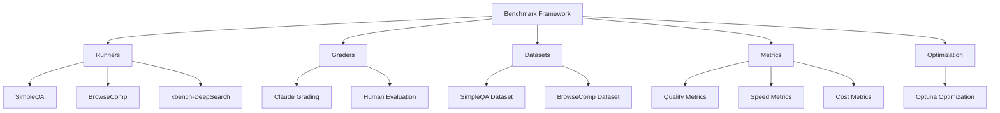
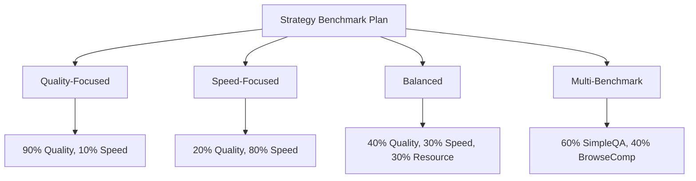
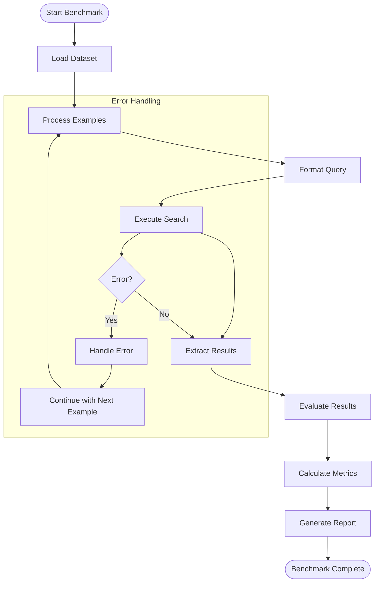
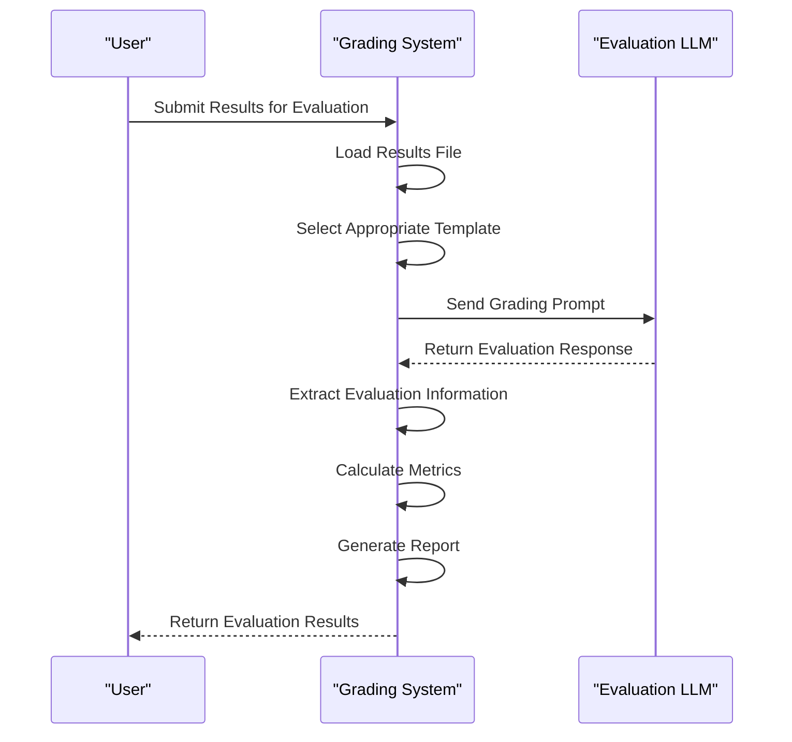
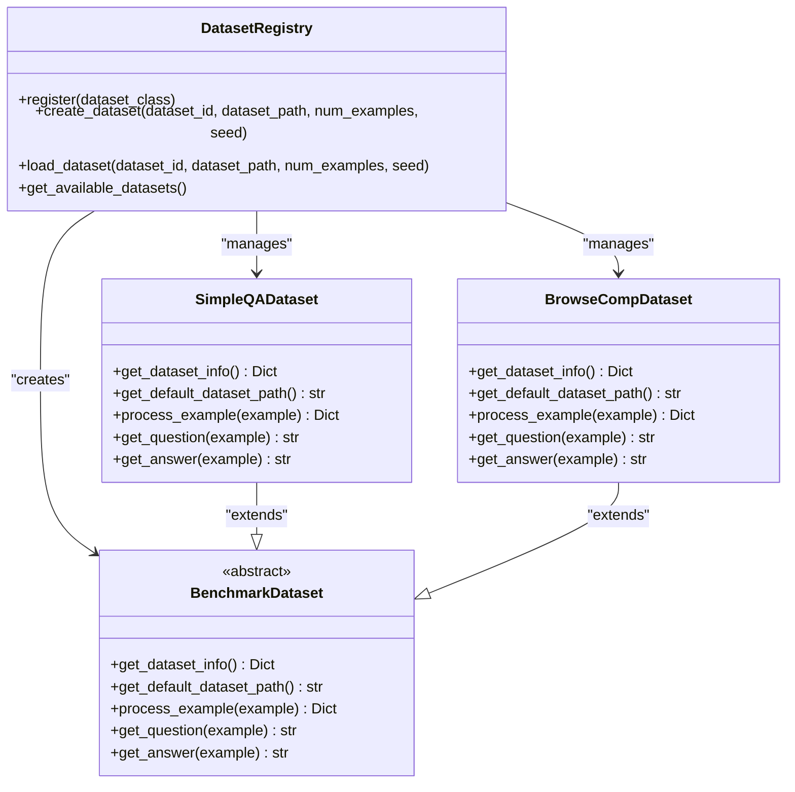
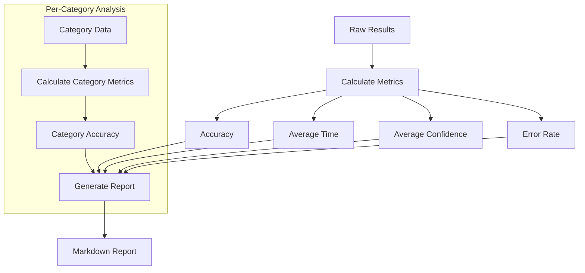
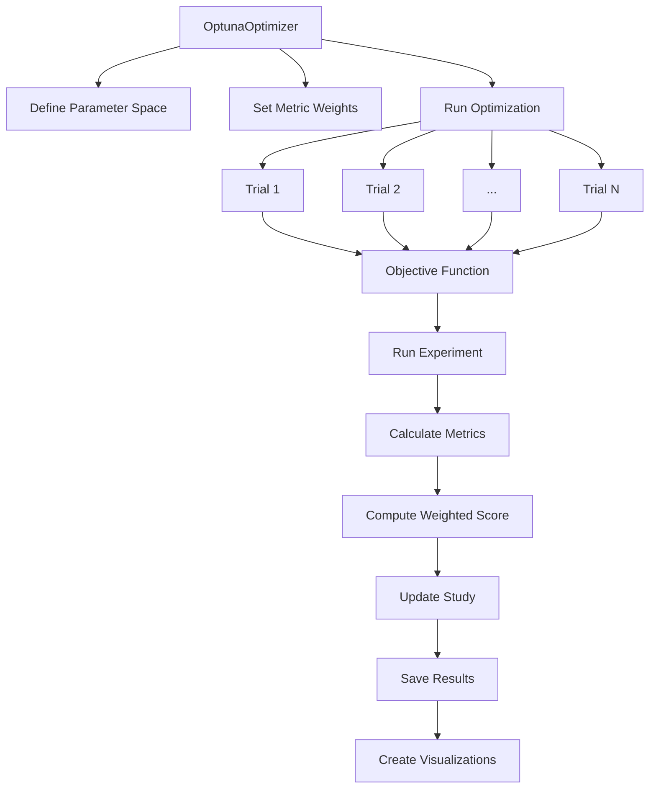
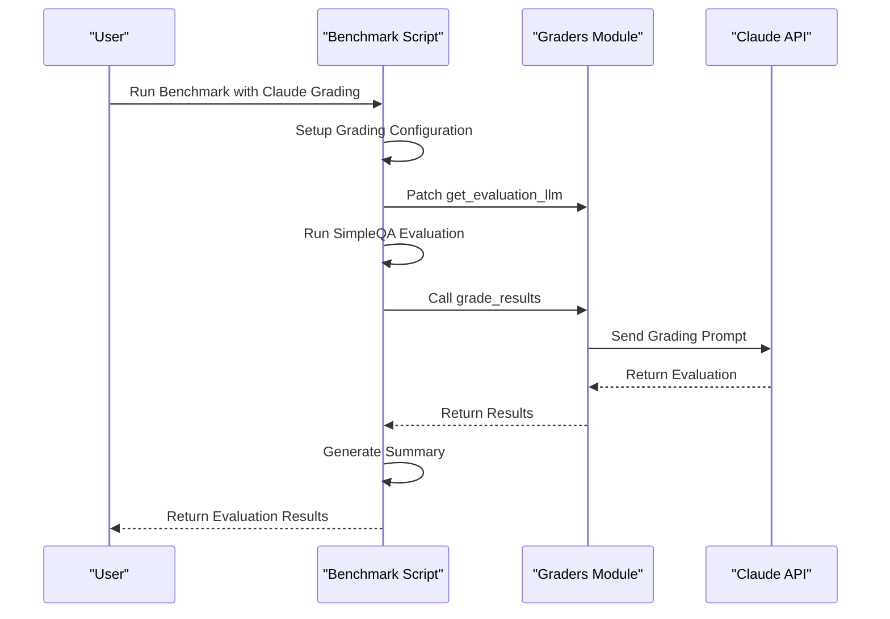
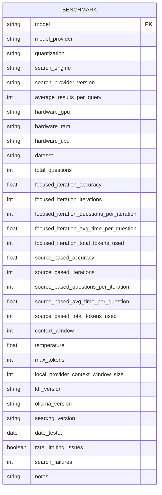

# Benchmarking Strategies

<cite>
**Referenced Files in This Document**   
- [strategy_benchmark_plan.py](file://examples/optimization/strategy_benchmark_plan.py)
- [runners.py](file://src/local_deep_research/benchmarks/runners.py)
- [graders.py](file://src/local_deep_research/benchmarks/graders.py)
- [optuna_optimizer.py](file://src/local_deep_research/benchmarks/optimization/optuna_optimizer.py)
- [datasets.py](file://src/local_deep_research/benchmarks/datasets.py)
- [metrics.py](file://src/local_deep_research/benchmarks/metrics.py)
- [templates.py](file://src/local_deep_research/benchmarks/templates.py)
- [speed_profiler.py](file://src/local_deep_research/benchmarks/efficiency/speed_profiler.py)
- [run_benchmark_with_claude_grading.py](file://examples/benchmarks/scripts/run_benchmark_with_claude_grading.py)
- [benchmark_template.yaml](file://community_benchmark_results/benchmark_template.yaml)
</cite>

## Table of Contents
1. [Introduction](#introduction)
2. [Benchmarking Framework Overview](#benchmarking-framework-overview)
3. [Strategy Benchmark Plan Implementation](#strategy-benchmark-plan-implementation)
4. [Benchmark Runners and Execution](#benchmark-runners-and-execution)
5. [Evaluation and Grading System](#evaluation-and-grading-system)
6. [Dataset Management](#dataset-management)
7. [Metrics and Reporting](#metrics-and-reporting)
8. [Optimization with Optuna](#optimization-with-optuna)
9. [Claude Grading Integration](#claude-grading-integration)
10. [Benchmark Configuration and Templates](#benchmark-configuration-and-templates)
11. [Performance Profiling](#performance-profiling)
12. [Best Practices for Benchmarking](#best-practices-for-benchmarking)
13. [Interpreting Results](#interpreting-results)
14. [Conclusion](#conclusion)

## Introduction

The local-deep-research system provides a comprehensive benchmarking framework for systematically evaluating research approaches, enabling data-driven decisions about system configuration. This documentation details the implementation of strategy_benchmark_plan.py for designing controlled experiments that compare different research strategies, LLM providers, and search engine combinations. The framework supports comparative studies with metrics on quality, speed, and cost, integrating with external grading systems like Claude for objective quality assessment.

The benchmarking system is designed to facilitate rigorous evaluation of research methodologies, allowing users to compare strategies such as Rapid Search, Evidence-Based, and Recursive Decomposition. By providing standardized evaluation protocols and metrics, the system enables reproducible experiments and meaningful comparisons across different configurations and approaches.

**Section sources**
- [strategy_benchmark_plan.py](file://examples/optimization/strategy_benchmark_plan.py#L1-L584)

## Benchmarking Framework Overview

The benchmarking framework in local-deep-research is a modular system designed for comprehensive evaluation of research strategies. It consists of several interconnected components that work together to execute experiments, collect metrics, and generate reports. The framework supports various benchmark types including SimpleQA, BrowseComp, and xbench-DeepSearch, each with specific evaluation criteria and metrics.

At the core of the framework is the ability to run controlled experiments that compare different research strategies, LLM providers, and search engine combinations. The system collects metrics on quality, speed, and cost, providing a multi-dimensional assessment of performance. This allows users to make informed decisions about system configuration based on their specific requirements and constraints.

The framework is designed to be extensible, allowing for the addition of new benchmark types, evaluation methods, and metrics. It also supports integration with external grading systems, enabling objective quality assessment using advanced LLMs like Claude 3.7 Sonnet. The modular architecture ensures that each component can be developed and maintained independently while working together to provide a comprehensive evaluation system.



**Diagram sources **
- [runners.py](file://src/local_deep_research/benchmarks/runners.py#L1-L494)
- [graders.py](file://src/local_deep_research/benchmarks/graders.py#L1-L611)
- [datasets.py](file://src/local_deep_research/benchmarks/datasets.py#L1-L23)
- [metrics.py](file://src/local_deep_research/benchmarks/metrics.py#L1-L12)
- [optuna_optimizer.py](file://src/local_deep_research/benchmarks/optimization/optuna_optimizer.py#L1-L800)

**Section sources**
- [runners.py](file://src/local_deep_research/benchmarks/runners.py#L1-L494)
- [graders.py](file://src/local_deep_research/benchmarks/graders.py#L1-L611)
- [datasets.py](file://src/local_deep_research/benchmarks/datasets.py#L1-L23)
- [metrics.py](file://src/local_deep_research/benchmarks/metrics.py#L1-L12)

## Strategy Benchmark Plan Implementation

The strategy_benchmark_plan.py script provides a comprehensive framework for comparing different research strategies using Optuna-based optimization. This implementation focuses on statistically significant results by using a large sample size of 500 examples per experiment. The script specifically compares iterdrag and source_based strategies across multiple optimization goals.

The implementation includes four main experiments: quality-focused, speed-focused, balanced, and multi-benchmark optimization. Each experiment uses different metric weights to prioritize specific aspects of performance. The quality-focused experiment prioritizes result quality (90%) over speed (10%), while the speed-focused experiment reverses this weighting. The balanced experiment considers quality (40%), speed (30%), and resource usage (30%), providing a more holistic assessment.

The multi-benchmark experiment combines SimpleQA and BrowseComp benchmarks with weighted contributions (60% and 40% respectively), allowing for a comprehensive evaluation across different task types. The script generates detailed summary reports that compare the performance of different strategies across optimization goals, helping users identify the most suitable approach for their specific requirements.



**Diagram sources **
- [strategy_benchmark_plan.py](file://examples/optimization/strategy_benchmark_plan.py#L1-L584)

**Section sources**
- [strategy_benchmark_plan.py](file://examples/optimization/strategy_benchmark_plan.py#L1-L584)

## Benchmark Runners and Execution

The benchmark runners module provides the main functions for executing benchmark experiments in the local-deep-research system. The core function, run_benchmark, orchestrates the entire evaluation process, from dataset loading to result collection and reporting. This module supports multiple benchmark types including SimpleQA, BrowseComp, and xbench-DeepSearch, each with specific formatting and evaluation requirements.

The run_benchmark function accepts various parameters to customize the evaluation process, including dataset type, number of examples, output directory, and search configuration. It also supports both automated and human evaluation modes, allowing users to choose the most appropriate assessment method for their needs. The function includes progress callbacks to monitor execution and handle errors gracefully.

The module provides convenience functions for running specific benchmark types: run_simpleqa_benchmark, run_browsecomp_benchmark, and run_xbench_deepsearch_benchmark. These functions wrap the main run_benchmark function with default settings appropriate for each benchmark type, simplifying the execution process for common use cases.



**Diagram sources **
- [runners.py](file://src/local_deep_research/benchmarks/runners.py#L1-L494)

**Section sources**
- [runners.py](file://src/local_deep_research/benchmarks/runners.py#L1-L494)

## Evaluation and Grading System

The grading system in local-deep-research provides objective quality assessment through both automated and human evaluation methods. The automated grading uses LLMs, with a default configuration that utilizes Claude 3.7 Sonnet via OpenRouter for consistent and reliable evaluation. The system includes specialized templates for different benchmark types, ensuring appropriate evaluation criteria are applied.

The DEFAULT_EVALUATION_CONFIG defines the default settings for the evaluation LLM, including model name, provider, endpoint URL, and temperature. The temperature is set to 0 for consistent evaluation results. The system supports custom evaluation configurations that can override these defaults, allowing users to specify different models, providers, or parameters.

The grading process involves extracting structured information from model responses and comparing them to reference answers. For SimpleQA, the system extracts the final answer and determines correctness based on factual accuracy. For BrowseComp, it evaluates the extracted final answer against the correct answer, considering minor variations but being strict about factual accuracy. The system also captures confidence scores and provides detailed reasoning for each evaluation decision.



**Diagram sources **
- [graders.py](file://src/local_deep_research/benchmarks/graders.py#L1-L611)
- [templates.py](file://src/local_deep_research/benchmarks/templates.py#L1-L66)

**Section sources**
- [graders.py](file://src/local_deep_research/benchmarks/graders.py#L1-L611)
- [templates.py](file://src/local_deep_research/benchmarks/templates.py#L1-L66)

## Dataset Management

The dataset management system in local-deep-research provides a flexible and extensible framework for handling benchmark datasets. The system uses a registry pattern with the DatasetRegistry class to manage different dataset types, currently supporting SimpleQA, BrowseComp, and xbench-DeepSearch. This design allows for easy addition of new dataset types while maintaining backward compatibility.

Each dataset type has a corresponding class that handles loading, processing, and accessing data. The SimpleQADataset class manages the SimpleQA benchmark dataset, which contains straightforward question-answering pairs. The BrowseCompDataset class handles the BrowseComp dataset, which requires special processing due to encrypted data that needs decryption using a canary string as the key.

The system provides a unified interface through the load_dataset function, which acts as a factory method to create and load the appropriate dataset based on the specified type. This abstraction simplifies the usage of different datasets while encapsulating the specific processing requirements of each type. The system also maintains default dataset URLs for each type, making it easy to access standard benchmark datasets.



**Diagram sources **
- [datasets.py](file://src/local_deep_research/benchmarks/datasets.py#L1-L23)
- [simpleqa.py](file://src/local_deep_research/benchmarks/datasets/simpleqa.py#L1-L74)
- [browsecomp.py](file://src/local_deep_research/benchmarks/datasets/browsecomp.py#L1-L137)

**Section sources**
- [datasets.py](file://src/local_deep_research/benchmarks/datasets.py#L1-L23)
- [simpleqa.py](file://src/local_deep_research/benchmarks/datasets/simpleqa.py#L1-L74)
- [browsecomp.py](file://src/local_deep_research/benchmarks/datasets/browsecomp.py#L1-L137)

## Metrics and Reporting

The metrics system in local-deep-research provides comprehensive evaluation of benchmark results through standardized calculation and reporting. The calculate_metrics function processes evaluation results to generate key performance indicators including accuracy, average processing time, average confidence, and error rate. These metrics provide a multi-dimensional assessment of system performance.

For datasets with category information, the system calculates per-category metrics, allowing for detailed analysis of performance across different question types or domains. This enables users to identify strengths and weaknesses in specific areas and make targeted improvements to their research strategies.

The reporting system generates detailed markdown reports that summarize the benchmark results, including configuration information, performance metrics, and analysis. The generate_report function creates comprehensive reports that can be used for documentation, sharing results, or further analysis. The reports include tables and formatted text to present the information clearly and concisely.



**Diagram sources **
- [metrics.py](file://src/local_deep_research/benchmarks/metrics.py#L1-L12)
- [calculation.py](file://src/local_deep_research/benchmarks/metrics/calculation.py#L1-L397)

**Section sources**
- [metrics.py](file://src/local_deep_research/benchmarks/metrics.py#L1-L12)
- [calculation.py](file://src/local_deep_research/benchmarks/metrics/calculation.py#L1-L397)

## Optimization with Optuna

The OptunaOptimizer class provides a powerful framework for parameter optimization in the local-deep-research system. This implementation uses Optuna, a hyperparameter optimization framework, to find optimal configurations for research strategies by balancing quality and performance metrics. The optimizer supports multi-objective optimization with customizable weights for different metrics.

The optimization process involves defining a parameter search space that includes variables such as iterations, questions_per_iteration, search_strategy, and max_results. The optimizer explores this space to find the combination that maximizes a weighted score based on the specified metrics. The system supports both integer and categorical parameters, allowing for comprehensive exploration of different configuration options.

The optimization process includes visualization capabilities that help users understand the results and identify important parameters. These visualizations include optimization history, parameter importances, slice plots, and contour plots. The system also saves intermediate results periodically, allowing for analysis of the optimization progress and recovery from interruptions.



**Diagram sources **
- [optuna_optimizer.py](file://src/local_deep_research/benchmarks/optimization/optuna_optimizer.py#L1-L800)

**Section sources**
- [optuna_optimizer.py](file://src/local_deep_research/benchmarks/optimization/optuna_optimizer.py#L1-L800)

## Claude Grading Integration

The Claude grading integration provides a robust system for objective quality assessment using Anthropic's Claude models. The run_benchmark_with_claude_grading.py script demonstrates how to configure and use Claude 3 Sonnet for grading benchmark results, either directly through the Anthropic API or via OpenRouter as a fallback option.

The integration includes a setup_grading_config function that creates the appropriate evaluation configuration based on available API keys. It first checks for an Anthropic API key in the environment variables, and if not found, attempts to use OpenRouter with a Claude model. This flexible approach ensures that users can leverage Claude's advanced reasoning capabilities for evaluation regardless of their specific API access.

The script patches the graders module to use the local get_llm function, ensuring that database configurations and API keys are properly accessed. This integration allows for seamless use of Claude grading within the existing benchmarking framework, providing high-quality evaluations that can be used to compare different research strategies and configurations.



**Diagram sources **
- [run_benchmark_with_claude_grading.py](file://examples/benchmarks/scripts/run_benchmark_with_claude_grading.py#L1-L335)

**Section sources**
- [run_benchmark_with_claude_grading.py](file://examples/benchmarks/scripts/run_benchmark_with_claude_grading.py#L1-L335)

## Benchmark Configuration and Templates

The benchmark configuration system uses YAML templates to ensure reproducibility and standardization of benchmark results. The benchmark_template.yaml file provides a comprehensive structure for documenting benchmark configurations, results, and environmental factors. This template includes sections for model information, search engine details, hardware specifications, benchmark results, configuration parameters, and test details.

The template emphasizes critical factors for reproducibility, such as the search engine used, hardware specifications, and software versions. It also includes fields for recording test details like rate limiting issues and search failures, which can impact benchmark results. The notes section allows users to add observations and insights that may help interpret the results or guide future experiments.

For evaluation, the system uses prompt templates defined in templates.py. These templates provide standardized formats for grading model outputs against reference answers. The SIMPLEQA_GRADER_TEMPLATE and BROWSECOMP_GRADER_TEMPLATE are specifically designed for their respective benchmark types, ensuring appropriate evaluation criteria are applied. The BROWSECOMP_QUERY_TEMPLATE defines the required response format for BrowseComp evaluations, ensuring consistency in the output structure.



**Diagram sources **
- [benchmark_template.yaml](file://community_benchmark_results/benchmark_template.yaml#L1-L64)
- [templates.py](file://src/local_deep_research/benchmarks/templates.py#L1-L66)

**Section sources**
- [benchmark_template.yaml](file://community_benchmark_results/benchmark_template.yaml#L1-L64)
- [templates.py](file://src/local_deep_research/benchmarks/templates.py#L1-L66)

## Performance Profiling

The performance profiling system in local-deep-research provides detailed timing information for benchmark execution. The SpeedProfiler class offers comprehensive tools for measuring execution time of different components and processes within the research system. This allows for fine-grained analysis of performance bottlenecks and optimization opportunities.

The profiler supports multiple methods for timing operations, including start/stop timers, context managers, and automatic timing of function calls through the time_function decorator. The SpeedProfiler class maintains detailed timing data for each named operation, including total time, count, minimum, maximum, and average duration. This information is crucial for understanding the performance characteristics of different research strategies and configurations.

The profiling system integrates with the optimization framework, providing execution time metrics that contribute to the overall optimization score. By measuring the total duration of experiments and breaking down time spent in different components, the system enables users to make informed decisions about the trade-offs between quality and speed in their research approaches.

```mermaid
flowchart TD
A[Start Profiler] --> B[Start Timer]
B --> C[Execute Operation]
C --> D[Stop Timer]
D --> E[Record Timing Data]
E --> F[Calculate Statistics]
F --> G[Generate Summary]
G --> H[Output Results]
subgraph "Context Manager"
I[With Timer] --> J[Start Timer]
J --> K[Execute Code]
K --> L[Stop Timer]
L --> M[Record Data]
end
subgraph "Function Decorator"
N[@time_function] --> O[Record Start Time]
O --> P[Execute Function]
P --> Q[Record End Time]
Q --> R[Log Duration]
end
```

**Diagram sources **
- [speed_profiler.py](file://src/local_deep_research/benchmarks/efficiency/speed_profiler.py#L1-L227)

**Section sources**
- [speed_profiler.py](file://src/local_deep_research/benchmarks/efficiency/speed_profiler.py#L1-L227)

## Best Practices for Benchmarking

To ensure reliable and meaningful benchmark results, several best practices should be followed when conducting evaluations in the local-deep-research system. First, use a statistically significant sample size, such as the 500 examples used in the strategy_benchmark_plan.py script, to ensure that results are robust and not influenced by random variation.

Second, maintain consistency in the evaluation environment by documenting all relevant configuration parameters, hardware specifications, and software versions. Use the benchmark_template.yaml file to record this information systematically, ensuring that results are reproducible and comparable across different experiments.

Third, consider multiple optimization goals by running experiments with different metric weightings. This provides a more comprehensive understanding of how different strategies perform under various priorities, such as quality-focused, speed-focused, or balanced approaches.

Fourth, use representative test datasets that reflect the types of queries and information needs expected in real-world usage. The system's support for multiple dataset types (SimpleQA, BrowseComp, xbench-DeepSearch) allows for evaluation across different task complexities and domains.

Finally, integrate external grading systems like Claude for objective quality assessment, as this provides more reliable and consistent evaluation than human judgment alone. The automated grading system reduces bias and ensures that evaluations are applied consistently across all test cases.

**Section sources**
- [strategy_benchmark_plan.py](file://examples/optimization/strategy_benchmark_plan.py#L1-L584)
- [benchmark_template.yaml](file://community_benchmark_results/benchmark_template.yaml#L1-L64)

## Interpreting Results

Interpreting benchmark results requires careful analysis of multiple metrics and their trade-offs. The primary metrics to consider are accuracy (quality), average processing time (speed), and resource usage (cost). These metrics often have inverse relationships, where improvements in one area may come at the expense of others.

When comparing different research strategies, look for patterns in the results across multiple optimization goals. A strategy that performs well in quality-focused experiments but poorly in speed-focused ones may be suitable for applications where accuracy is paramount. Conversely, a strategy that excels in speed-focused experiments but has lower accuracy may be appropriate for time-sensitive applications.

The optimization visualizations generated by the OptunaOptimizer provide valuable insights into parameter importance and interactions. The parameter importance plot shows which configuration variables have the greatest impact on performance, while contour plots reveal interactions between pairs of parameters. These visualizations can guide further experimentation and refinement of research strategies.

Consider the specific requirements of your use case when interpreting results. For example, in academic research, higher accuracy may be worth the additional time and computational cost. In contrast, for real-time applications, faster response times may be more important than marginal improvements in accuracy.

**Section sources**
- [strategy_benchmark_plan.py](file://examples/optimization/strategy_benchmark_plan.py#L1-L584)
- [optuna_optimizer.py](file://src/local_deep_research/benchmarks/optimization/optuna_optimizer.py#L1-L800)

## Conclusion

The benchmarking framework in local-deep-research provides a comprehensive system for evaluating research strategies through controlled experiments that compare different approaches, LLM providers, and search engine combinations. The implementation of strategy_benchmark_plan.py enables systematic assessment of performance across quality, speed, and cost dimensions, supporting data-driven decisions about system configuration.

The framework's modular design, with separate components for runners, graders, datasets, metrics, and optimization, allows for flexible and extensible evaluation. Integration with external grading systems like Claude ensures objective quality assessment, while the use of Optuna for parameter optimization enables sophisticated exploration of configuration spaces.

By following best practices for benchmarking, including the use of statistically significant sample sizes, consistent evaluation environments, and representative test datasets, users can generate reliable and meaningful results. The comprehensive reporting and visualization capabilities support thorough analysis and interpretation of benchmark outcomes, facilitating continuous improvement of research strategies and system performance.