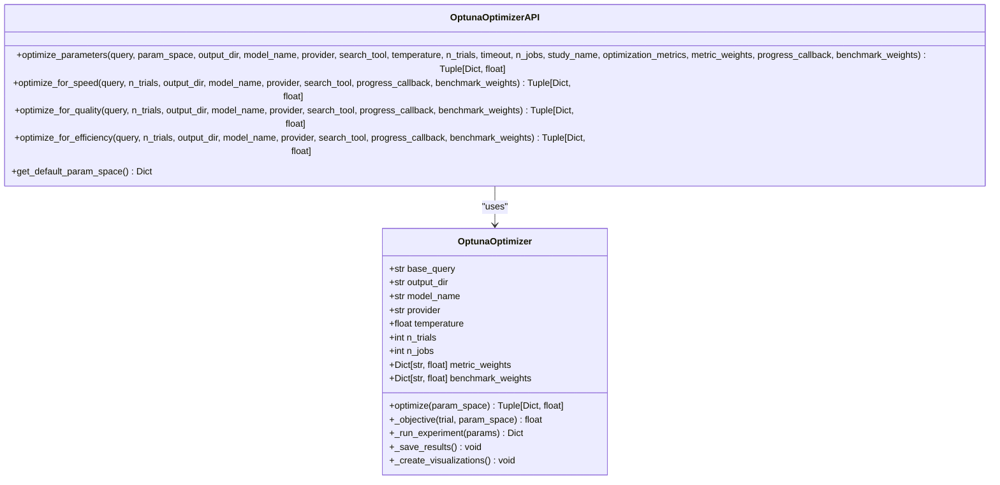
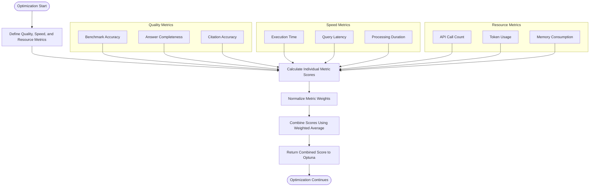
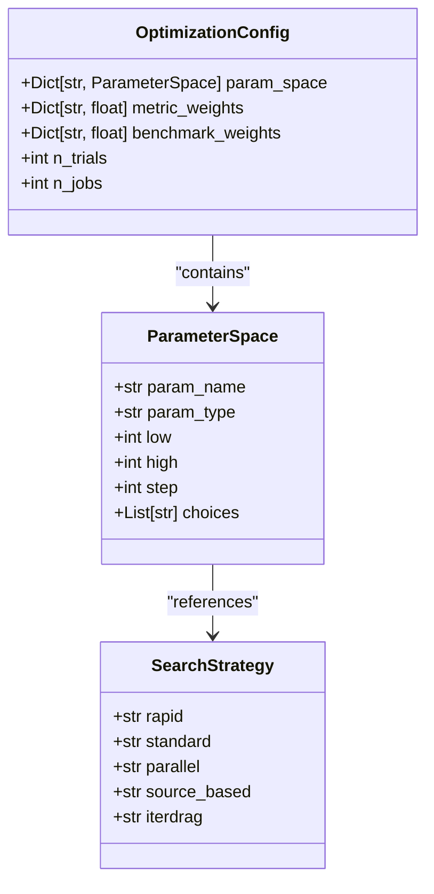
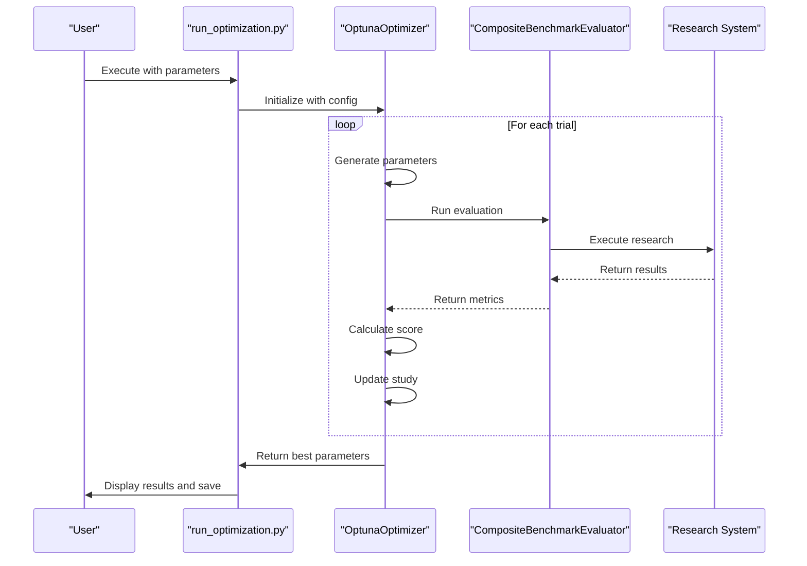
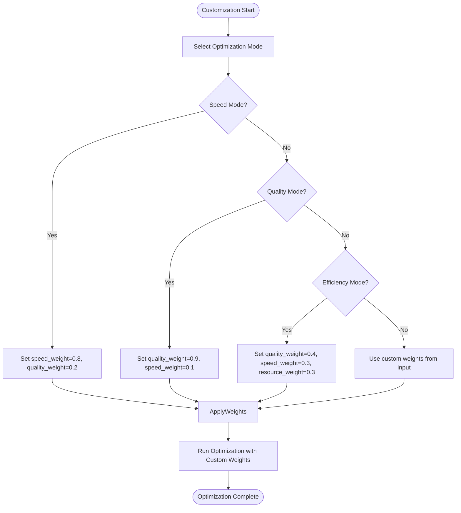
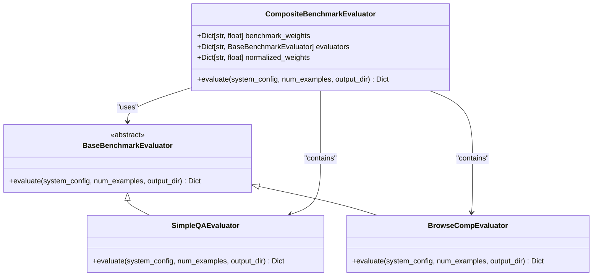
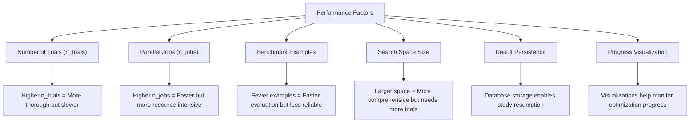
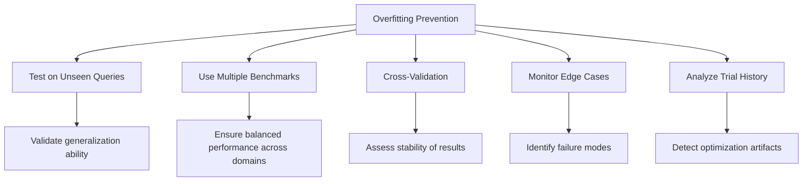

# Configuration Optimization

<cite>
**Referenced Files in This Document**   
- [run_optimization.py](file://examples/optimization/run_optimization.py)
- [example_optimization.py](file://examples/optimization/example_optimization.py)
- [browsecomp_optimization.py](file://examples/optimization/browsecomp_optimization.py)
- [gemini_optimization.py](file://examples/optimization/gemini_optimization.py)
- [api.py](file://src/local_deep_research/benchmarks/optimization/api.py)
- [optuna_optimizer.py](file://src/local_deep_research/benchmarks/optimization/optuna_optimizer.py)
- [metrics.py](file://src/local_deep_research/benchmarks/optimization/metrics.py)
- [calculation.py](file://src/local_deep_research/benchmarks/metrics/calculation.py)
- [composite.py](file://src/local_deep_research/benchmarks/evaluators/composite.py)
- [search_system.py](file://src/local_deep_research/search_system.py)
</cite>

## Table of Contents
1. [Introduction](#introduction)
2. [Optimization API Implementation](#optimization-api-implementation)
3. [Objective Functions and Metrics](#objective-functions-and-metrics)
4. [Search Space Configuration](#search-space-configuration)
5. [Running Optimization Studies](#running-optimization-studies)
6. [Customizing Optimization Goals](#customizing-optimization-goals)
7. [Multi-Benchmark Optimization](#multi-benchmark-optimization)
8. [Performance Considerations](#performance-considerations)
9. [Validation and Overfitting Prevention](#validation-and-overfitting-prevention)
10. [Troubleshooting Guide](#troubleshooting-guide)

## Introduction

The local-deep-research system features a sophisticated configuration optimization framework built on Optuna, enabling automated tuning of research parameters to balance quality, speed, and cost. This optimization system allows users to systematically explore different configurations of LLM selection, search strategies, and citation handling to find optimal settings for specific use cases.

The optimization framework is designed to be both powerful and accessible, providing high-level APIs for common optimization scenarios while allowing fine-grained control over the optimization process. By leveraging Optuna's advanced Bayesian optimization algorithms, the system efficiently navigates complex parameter spaces to identify configurations that maximize research effectiveness.

**Section sources**
- [run_optimization.py](file://examples/optimization/run_optimization.py#L1-L197)
- [example_optimization.py](file://examples/optimization/example_optimization.py#L1-L94)

## Optimization API Implementation

The optimization system provides a comprehensive API that abstracts the complexity of Optuna while exposing essential configuration options. The core optimization functionality is exposed through several entry points that cater to different use cases.

The primary interface is the `optimize_parameters` function, which serves as the foundation for all optimization operations. This function accepts a wide range of parameters including the research query, search tool, LLM configuration, and optimization settings. It orchestrates the entire optimization process, from study creation to result analysis.

**Diagram sources **
- [api.py](file://src/local_deep_research/benchmarks/optimization/api.py#L15-L278)
- [optuna_optimizer.py](file://src/local_deep_research/benchmarks/optimization/optuna_optimizer.py#L51-L800)

**Section sources**
- [api.py](file://src/local_deep_research/benchmarks/optimization/api.py#L15-L278)
- [optuna_optimizer.py](file://src/local_deep_research/benchmarks/optimization/optuna_optimizer.py#L51-L800)

## Objective Functions and Metrics

The optimization system employs a multi-objective approach that balances research quality, speed, and resource efficiency. The objective function combines these metrics into a single score that Optuna maximizes during the optimization process.

Quality is measured using benchmark evaluations such as SimpleQA and BrowseComp, which assess the accuracy and completeness of research results. Speed is evaluated based on execution time, with faster configurations receiving higher scores. Resource efficiency considers factors like API call volume and computational complexity.

**Diagram sources **
- [calculation.py](file://src/local_deep_research/benchmarks/metrics/calculation.py#L354-L397)
- [optuna_optimizer.py](file://src/local_deep_research/benchmarks/optimization/optuna_optimizer.py#L464-L468)

**Section sources**
- [calculation.py](file://src/local_deep_research/benchmarks/metrics/calculation.py#L255-L397)
- [optuna_optimizer.py](file://src/local_deep_research/benchmarks/optimization/optuna_optimizer.py#L464-L468)

## Search Space Configuration

The optimization system allows users to define custom search spaces that specify the range of values for each configurable parameter. The search space determines which parameters are optimized and their possible values.

The default search space includes key parameters such as iterations, questions per iteration, search strategy, and result limits. Users can customize this space to focus on specific parameters or expand it to include additional configuration options.

**Diagram sources **
- [api.py](file://src/local_deep_research/benchmarks/optimization/api.py#L235-L278)
- [optuna_optimizer.py](file://src/local_deep_research/benchmarks/optimization/optuna_optimizer.py#L254-L291)

**Section sources**
- [api.py](file://src/local_deep_research/benchmarks/optimization/api.py#L235-L278)
- [optuna_optimizer.py](file://src/local_deep_research/benchmarks/optimization/optuna_optimizer.py#L254-L291)

## Running Optimization Studies

The optimization framework provides multiple approaches for running studies, from simple command-line execution to programmatic configuration. The `run_optimization.py` script offers a convenient entry point for most use cases.

To run an optimization study, users specify a research query and optimization mode (balanced, speed, quality, or efficiency). The system then executes multiple trials with different parameter combinations, evaluating each configuration and tracking the results.

**Diagram sources **
- [run_optimization.py](file://examples/optimization/run_optimization.py#L32-L197)
- [optuna_optimizer.py](file://src/local_deep_research/benchmarks/optimization/optuna_optimizer.py#L140-L230)

**Section sources**
- [run_optimization.py](file://examples/optimization/run_optimization.py#L32-L197)
- [optuna_optimizer.py](file://src/local_deep_research/benchmarks/optimization/optuna_optimizer.py#L140-L230)

## Customizing Optimization Goals

The optimization system supports customization of optimization goals through metric weights and specialized optimization functions. Users can prioritize specific objectives such as maximizing accuracy or minimizing cost by adjusting the relative weights of different metrics.

Pre-configured optimization modes provide convenient shortcuts for common scenarios:
- **Speed mode**: Focuses on minimizing execution time
- **Quality mode**: Prioritizes research accuracy and completeness  
- **Efficiency mode**: Balances quality, speed, and resource usage
- **Balanced mode**: Equal weighting of quality and speed

**Diagram sources **
- [api.py](file://src/local_deep_research/benchmarks/optimization/api.py#L79-L233)
- [run_optimization.py](file://examples/optimization/run_optimization.py#L120-L168)

**Section sources**
- [api.py](file://src/local_deep_research/benchmarks/optimization/api.py#L79-L233)
- [run_optimization.py](file://examples/optimization/run_optimization.py#L120-L168)

## Multi-Benchmark Optimization

The system supports multi-benchmark optimization, allowing users to evaluate configurations across multiple benchmark types with customizable weights. This approach provides a more comprehensive assessment of research system performance.

The CompositeBenchmarkEvaluator combines results from different benchmarks such as SimpleQA and BrowseComp, weighting them according to user preferences. This enables optimization for specific domains or task types.

**Diagram sources **
- [composite.py](file://src/local_deep_research/benchmarks/evaluators/composite.py#L17-L109)
- [optuna_optimizer.py](file://src/local_deep_research/benchmarks/optimization/optuna_optimizer.py#L113-L117)

**Section sources**
- [composite.py](file://src/local_deep_research/benchmarks/evaluators/composite.py#L17-L109)
- [optuna_optimizer.py](file://src/local_deep_research/benchmarks/optimization/optuna_optimizer.py#L113-L117)

## Performance Considerations

Running optimization studies involves trade-offs between thoroughness and computational cost. The system provides several options to manage performance and accelerate convergence.

Key performance considerations include:
- **Trial count**: More trials increase confidence in results but require more time
- **Parallel execution**: Multiple jobs can run simultaneously to reduce total time
- **Benchmark examples**: Fewer examples speed up evaluation but reduce statistical significance
- **Parameter space**: Larger search spaces require more trials to explore thoroughly

The system automatically creates SQLite databases to persist study results, allowing optimization to be resumed if interrupted. Visualization files are generated periodically to monitor progress.

**Diagram sources **
- [optuna_optimizer.py](file://src/local_deep_research/benchmarks/optimization/optuna_optimizer.py#L68-L72)
- [optuna_optimizer.py](file://src/local_deep_research/benchmarks/optimization/optuna_optimizer.py#L156-L163)

**Section sources**
- [optuna_optimizer.py](file://src/local_deep_research/benchmarks/optimization/optuna_optimizer.py#L68-L72)
- [optuna_optimizer.py](file://src/local_deep_research/benchmarks/optimization/optuna_optimizer.py#L156-L163)

## Validation and Overfitting Prevention

To ensure optimized configurations generalize well to new queries, the system includes several mechanisms to prevent overfitting to benchmark datasets.

Best practices for validation include:
- Testing optimized configurations on unseen queries
- Using multiple benchmark types with appropriate weighting
- Employing cross-validation techniques when possible
- Monitoring for performance degradation on edge cases

The system automatically saves detailed records of all trials, enabling post-hoc analysis of optimization results and identification of potential overfitting patterns.

**Diagram sources **
- [optuna_optimizer.py](file://src/local_deep_research/benchmarks/optimization/optuna_optimizer.py#L503-L582)
- [calculation.py](file://src/local_deep_research/benchmarks/metrics/calculation.py#L115-L170)

**Section sources**
- [optuna_optimizer.py](file://src/local_deep_research/benchmarks/optimization/optuna_optimizer.py#L503-L582)
- [calculation.py](file://src/local_deep_research/benchmarks/metrics/calculation.py#L115-L170)

## Troubleshooting Guide

Common issues when running optimization studies and their solutions:

**Issue**: Optimization takes too long
- **Solution**: Reduce n_trials, decrease benchmark examples, or limit the search space

**Issue**: Out of memory errors
- **Solution**: Reduce n_jobs to limit parallel execution

**Issue**: Poor optimization results
- **Solution**: Increase n_trials, expand the search space, or adjust metric weights

**Issue**: Benchmark failures
- **Solution**: Verify API keys and network connectivity, check LLM provider availability

**Issue**: Inconsistent results
- **Solution**: Ensure consistent environment settings, verify benchmark dataset integrity

The system logs detailed information about each trial, which can be used to diagnose issues. All results are saved to disk, allowing analysis of failed trials and identification of problematic configurations.

**Section sources**
- [optuna_optimizer.py](file://src/local_deep_research/benchmarks/optimization/optuna_optimizer.py#L386-L405)
- [run_optimization.py](file://examples/optimization/run_optimization.py#L96-L103)