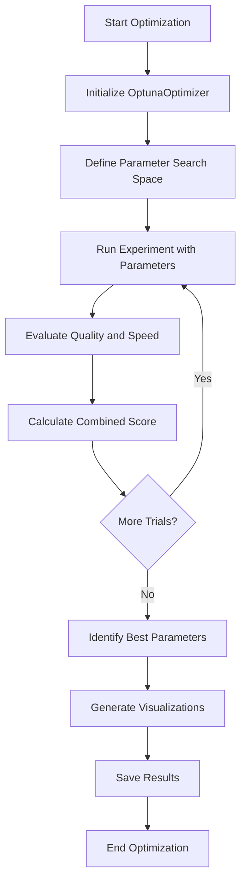
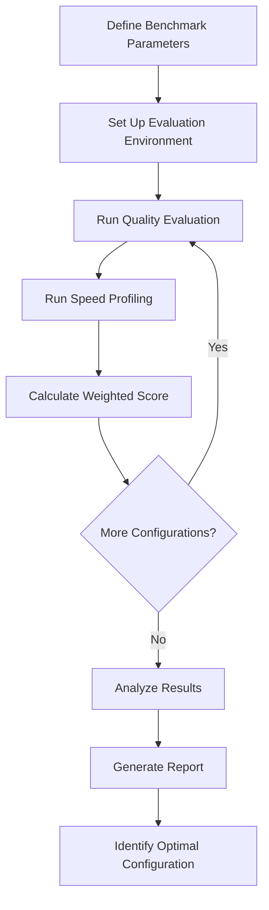
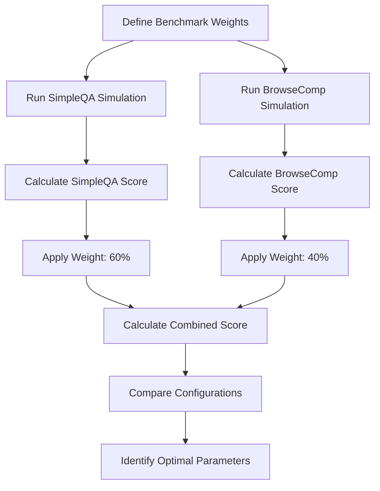
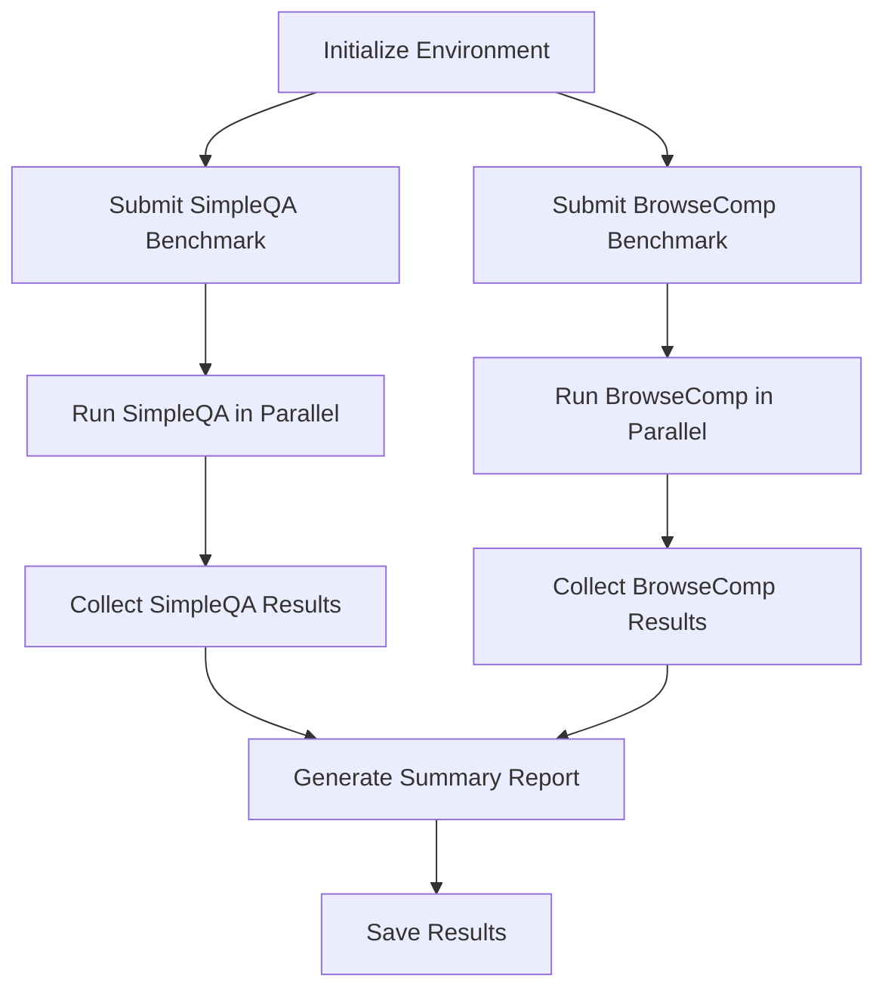
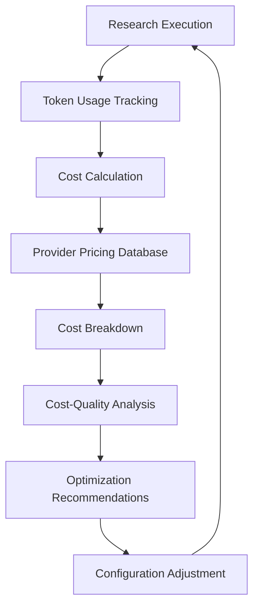
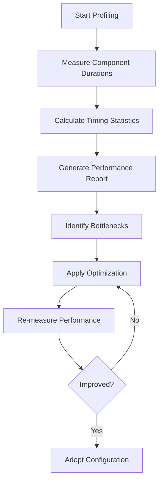
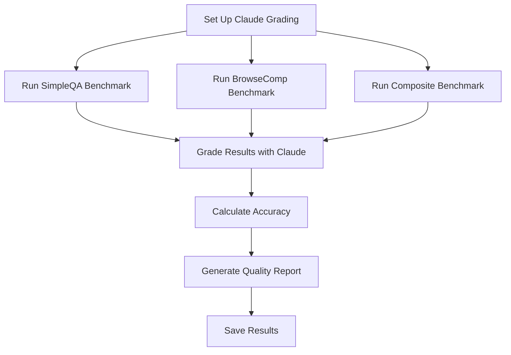

# Optimization Techniques

<cite>
**Referenced Files in This Document**   
- [run_optimization.py](file://examples/optimization/run_optimization.py)
- [strategy_benchmark_plan.py](file://examples/optimization/strategy_benchmark_plan.py)
- [multi_benchmark_simulation.py](file://examples/optimization/multi_benchmark_simulation.py)
- [run_parallel_benchmark.py](file://examples/optimization/run_parallel_benchmark.py)
- [optuna_optimizer.py](file://src/local_deep_research/benchmarks/optimization/optuna_optimizer.py)
- [benchmark.py](file://examples/benchmarks/claude_grading/benchmark.py)
- [speed_profiler.py](file://src/local_deep_research/benchmarks/efficiency/speed_profiler.py)
- [cost_calculator.py](file://src/local_deep_research/metrics/pricing/cost_calculator.py)
- [pricing_fetcher.py](file://src/local_deep_research/metrics/pricing/pricing_fetcher.py)
- [simpleqa.py](file://src/local_deep_research/benchmarks/evaluators/simpleqa.py)
- [browsecomp.py](file://src/local_deep_research/benchmarks/evaluators/browsecomp.py)
- [composite.py](file://src/local_deep_research/benchmarks/evaluators/composite.py)
- [benchmark_functions.py](file://src/local_deep_research/benchmarks/benchmark_functions.py)
</cite>

## Table of Contents
1. [Introduction](#introduction)
2. [Configuration Optimization with Optuna](#configuration-optimization-with-optuna)
3. [Benchmarking Methodologies](#benchmarking-methodologies)
4. [Multi-Benchmark Simulations](#multi-benchmark-simulations)
5. [Parallel Benchmark Execution](#parallel-benchmark-execution)
6. [Cost Optimization Strategies](#cost-optimization-strategies)
7. [Performance Bottleneck Identification](#performance-bottleneck-identification)
8. [Claude Grading System](#claude-grading-system)
9. [Conclusion](#conclusion)

## Introduction
The local-deep-research system provides comprehensive optimization techniques to improve research quality and efficiency. This document details the implementation of configuration optimization using the Optuna-based optimizer in run_optimization.py, benchmarking methodologies for comparing different research strategies, LLM providers, and search engine combinations, and the use of strategy_benchmark_plan.py for systematic evaluation of research approaches. The system enables data-driven decisions about configuration through comprehensive performance analysis, cost optimization, and quality assessment.

**Section sources**
- [run_optimization.py](file://examples/optimization/run_optimization.py#L1-L197)
- [strategy_benchmark_plan.py](file://examples/optimization/strategy_benchmark_plan.py#L1-L584)

## Configuration Optimization with Optuna

The local-deep-research system implements a sophisticated configuration optimization framework using Optuna, a powerful hyperparameter optimization library. The core implementation is found in the OptunaOptimizer class within optuna_optimizer.py, which provides a comprehensive solution for finding optimal parameters that balance research quality and performance metrics.

The optimization process is initiated through the run_optimization.py script, which serves as a command-line interface for parameter optimization. This script accepts various configuration options including the research query, search tool, LLM model, provider, API key, temperature, number of trials, and optimization mode (balanced, speed, quality, or efficiency). The script sets environment variables for the specified LLM configuration and then delegates to specialized optimization functions based on the selected mode.

The OptunaOptimizer class orchestrates the optimization process by defining search spaces for parameters such as iterations, questions per iteration, search strategy, and maximum results. It supports multiple optimization objectives through configurable metric weights that balance quality, speed, and resource usage. The optimization process evaluates parameter combinations by running experiments with the specified configuration and calculating a combined score based on the weighted metrics.

Key features of the optimization framework include:
- Support for multiple optimization modes (speed, quality, efficiency, balanced)
- Customizable metric weights to prioritize specific performance aspects
- Integration with benchmark evaluators for comprehensive assessment
- Visualization of optimization results including parameter importances and optimization history
- Periodic saving of intermediate results for progress tracking

The optimization process follows a structured workflow:
1. Initialize the optimizer with configuration parameters and metric weights
2. Define the parameter search space based on the optimization goal
3. Run experiments with different parameter combinations using Optuna's TPE sampler
4. Evaluate each combination using benchmark evaluators and speed profiling
5. Calculate a combined score based on weighted metrics
6. Identify the optimal parameter set that maximizes the combined score

**Diagram sources**
- [optuna_optimizer.py](file://src/local_deep_research/benchmarks/optimization/optuna_optimizer.py#L51-L800)
- [run_optimization.py](file://examples/optimization/run_optimization.py#L32-L197)

**Section sources**
- [optuna_optimizer.py](file://src/local_deep_research/benchmarks/optimization/optuna_optimizer.py#L51-L800)
- [run_optimization.py](file://examples/optimization/run_optimization.py#L32-L197)

## Benchmarking Methodologies

The local-deep-research system employs systematic benchmarking methodologies to evaluate and compare different research strategies, LLM providers, and search engine combinations. The benchmarking framework is designed to provide statistically significant results through comprehensive testing and analysis.

The strategy_benchmark_plan.py script implements a comprehensive benchmarking plan that compares different search strategies (iterdrag and source_based) across multiple optimization goals. This script runs four distinct experiments: quality-focused, speed-focused, balanced, and multi-benchmark optimization, each with 500 examples to ensure statistical significance. The benchmarking process evaluates parameters such as search strategy, iterations, questions per iteration, and maximum results, with different weightings for quality and speed metrics.

The benchmarking framework supports multiple evaluation metrics and provides detailed analysis of results. For quality assessment, the system uses benchmark evaluators that measure accuracy and other quality indicators. For speed assessment, the system employs the SpeedProfiler class to measure execution time and identify performance bottlenecks. The results are combined using configurable weights to produce a comprehensive score that reflects the overall performance of each configuration.

The benchmarking process follows a standardized methodology:
1. Define the parameter space for evaluation
2. Set up the evaluation environment with specified LLM and search configurations
3. Run experiments with different parameter combinations
4. Collect quality and speed metrics for each combination
5. Calculate weighted scores based on optimization goals
6. Identify the optimal configuration for each optimization goal
7. Generate comprehensive reports and visualizations

The system supports various benchmark types, including SimpleQA for factual question answering, BrowseComp for web browsing comprehension, and xbench-DeepSearch for deep research capability evaluation. Each benchmark type has specific evaluation criteria and metrics that are used to assess performance.

**Diagram sources**
- [strategy_benchmark_plan.py](file://examples/optimization/strategy_benchmark_plan.py#L46-L584)
- [speed_profiler.py](file://src/local_deep_research/benchmarks/efficiency/speed_profiler.py#L14-L227)

**Section sources**
- [strategy_benchmark_plan.py](file://examples/optimization/strategy_benchmark_plan.py#L46-L584)
- [benchmark_functions.py](file://src/local_deep_research/benchmarks/benchmark_functions.py#L24-L460)

## Multi-Benchmark Simulations

The local-deep-research system supports multi-benchmark simulations that combine results from different benchmark types using weighted scores. This approach enables comprehensive evaluation across multiple dimensions of research performance, providing a more holistic assessment than single-benchmark evaluations.

The multi_benchmark_simulation.py script demonstrates how to use multi-benchmark optimization with weighted scores without running actual benchmarks. This simulation framework allows users to understand the behavior of the optimization system and test different weighting strategies before conducting resource-intensive real benchmarks.

The multi-benchmark approach uses the CompositeBenchmarkEvaluator class, which combines results from multiple benchmark evaluators according to specified weights. For example, a configuration might assign 60% weight to SimpleQA results and 40% weight to BrowseComp results, creating a balanced evaluation that considers both factual accuracy and browsing comprehension.

The simulation framework models the behavior of different benchmark types:
- SimpleQA: Focuses on factual question answering, with performance influenced by the number of iterations
- BrowseComp: Emphasizes web browsing comprehension, with performance affected by the number of questions per iteration
- Strategy-specific effects: Different search strategies (rapid, iterdrag) have characteristic impacts on quality and speed

The multi-benchmark simulation process involves:
1. Defining benchmark weights for each benchmark type
2. Running simulations for each benchmark type with the same parameter configuration
3. Calculating individual scores for each benchmark
4. Combining scores using the specified weights
5. Identifying the optimal parameter set based on the combined score

This approach allows users to customize the evaluation criteria based on their specific research needs, emphasizing the aspects of performance that are most important for their use case.

**Diagram sources**
- [multi_benchmark_simulation.py](file://examples/optimization/multi_benchmark_simulation.py#L1-L414)
- [composite.py](file://src/local_deep_research/benchmarks/evaluators/composite.py#L17-L125)

**Section sources**
- [multi_benchmark_simulation.py](file://examples/optimization/multi_benchmark_simulation.py#L1-L414)
- [composite.py](file://src/local_deep_research/benchmarks/evaluators/composite.py#L17-L125)

## Parallel Benchmark Execution

The local-deep-research system supports parallel benchmark execution to improve efficiency and reduce total evaluation time. The run_parallel_benchmark.py script demonstrates how to run multiple benchmarks simultaneously, specifically SimpleQA and BrowseComp benchmarks with 300 examples each.

The parallel execution framework uses Python's concurrent.futures.ThreadPoolExecutor to run benchmarks in parallel. This approach maximizes resource utilization by allowing both benchmarks to run concurrently, significantly reducing the total execution time compared to sequential execution. The system manages resource allocation and synchronization to ensure reliable results.

Key features of the parallel benchmark execution system include:
- Concurrent execution of multiple benchmark types
- Independent configuration for each benchmark
- Centralized result collection and reporting
- Error handling and recovery for individual benchmarks
- Comprehensive summary reporting

The parallel execution process follows these steps:
1. Initialize the benchmark environment with common configuration
2. Submit both benchmark jobs to the thread pool executor
3. Monitor execution progress and handle any errors
4. Collect results from completed benchmarks
5. Generate a comprehensive summary report

This approach is particularly valuable for comprehensive system evaluation, as it allows users to assess multiple aspects of performance simultaneously. The system can evaluate both factual accuracy (SimpleQA) and browsing comprehension (BrowseComp) in a single execution, providing a more complete picture of research capabilities.

**Diagram sources**
- [run_parallel_benchmark.py](file://examples/optimization/run_parallel_benchmark.py#L1-L299)
- [benchmark_functions.py](file://src/local_deep_research/benchmarks/benchmark_functions.py#L24-L460)

**Section sources**
- [run_parallel_benchmark.py](file://examples/optimization/run_parallel_benchmark.py#L1-L299)

## Cost Optimization Strategies

The local-deep-research system incorporates cost optimization strategies to balance research quality and expense across different LLM providers. The cost calculation framework, implemented in cost_calculator.py and pricing_fetcher.py, enables users to make informed decisions about provider selection based on both performance and cost considerations.

The cost optimization system uses a comprehensive pricing database that includes rates for major LLM providers such as OpenAI, Anthropic, and Google. The PricingFetcher class maintains static pricing data as a fallback when real-time pricing APIs are unavailable. The CostCalculator class uses this pricing data to calculate costs based on token usage, providing detailed cost breakdowns for research sessions.

Key cost optimization features include:
- Real-time cost calculation based on token usage
- Provider-specific pricing models
- Cost comparison across different LLM providers
- Integration with benchmark results for cost-quality analysis
- Detailed cost reporting with model-level breakdowns

The system calculates costs using the following formula:
- Prompt cost = (prompt_tokens / 1000) × prompt_price_per_1K_tokens
- Completion cost = (completion_tokens / 1000) × completion_price_per_1K_tokens
- Total cost = Prompt cost + Completion cost

Users can optimize costs by:
1. Selecting providers with favorable pricing for their use case
2. Balancing model quality with cost considerations
3. Using local models (Ollama, vLLM) for zero-cost inference when appropriate
4. Optimizing prompt engineering to reduce token usage
5. Choosing models with lower cost per token for high-volume tasks

The cost optimization framework integrates with the benchmarking system, allowing users to evaluate the cost-effectiveness of different configurations. This enables data-driven decisions that consider both performance metrics and financial implications.

**Diagram sources**
- [cost_calculator.py](file://src/local_deep_research/metrics/pricing/cost_calculator.py#L16-L237)
- [pricing_fetcher.py](file://src/local_deep_research/metrics/pricing/pricing_fetcher.py#L14-L241)

**Section sources**
- [cost_calculator.py](file://src/local_deep_research/metrics/pricing/cost_calculator.py#L16-L237)
- [pricing_fetcher.py](file://src/local_deep_research/metrics/pricing/pricing_fetcher.py#L14-L241)

## Performance Bottleneck Identification

The local-deep-research system includes sophisticated tools for identifying performance bottlenecks and improving research speed without sacrificing accuracy. The SpeedProfiler class, located in speed_profiler.py, provides detailed timing information for different components of the research process, enabling targeted optimization.

The performance analysis framework measures execution time at multiple levels:
- Total research session duration
- Individual component durations (search, processing, evaluation)
- Per-operation timing statistics (average, minimum, maximum)
- Resource utilization patterns

The SpeedProfiler class offers several methods for performance measurement:
- start() and stop(): Measure total execution time
- start_timer() and stop_timer(): Measure specific operations
- timer(): Context manager for timing code blocks
- get_summary(): Generate comprehensive timing reports

Key performance metrics include:
- Total execution time
- Component duration percentages
- Average time per operation
- Timing distribution statistics

Users can identify bottlenecks by analyzing the timing breakdown and focusing optimization efforts on components with the highest duration percentages. Common optimization strategies include:
- Reducing the number of iterations for faster execution
- Adjusting questions per iteration to balance thoroughness and speed
- Selecting faster search strategies when appropriate
- Optimizing LLM model selection for speed
- Improving prompt efficiency to reduce processing time

The system also provides visualization tools that show parameter importances and optimization history, helping users understand which configuration parameters have the greatest impact on performance.

**Diagram sources**
- [speed_profiler.py](file://src/local_deep_research/benchmarks/efficiency/speed_profiler.py#L14-L227)
- [optuna_optimizer.py](file://src/local_deep_research/benchmarks/optimization/optuna_optimizer.py#L414-L478)

**Section sources**
- [speed_profiler.py](file://src/local_deep_research/benchmarks/efficiency/speed_profiler.py#L14-L227)

## Claude Grading System

The local-deep-research system incorporates a Claude grading system for objective evaluation of research quality. The benchmark.py script in the claude_grading directory demonstrates how to integrate Claude API grading into benchmark evaluations, providing consistent and reliable quality assessment.

The grading system uses Claude 3 Sonnet as the evaluation model, configured with zero temperature for consistent results. It supports multiple evaluation methods:
- Direct Anthropic API access using ANTHROPIC_API_KEY
- OpenRouter fallback using OPENROUTER_API_KEY
- Environment variable configuration for API keys

The grading process follows these steps:
1. Set up the evaluation configuration with Claude 3 Sonnet
2. Run benchmark evaluations (SimpleQA, BrowseComp, composite)
3. Use Claude to grade the results based on predefined criteria
4. Calculate accuracy and other quality metrics
5. Generate comprehensive evaluation reports

Key features of the Claude grading system include:
- Consistent evaluation using zero temperature
- Support for multiple benchmark types
- Detailed accuracy reporting
- Integration with the composite benchmark evaluator
- Error handling and fallback mechanisms

The system ensures objective quality assessment by using a powerful LLM specifically for evaluation purposes, separate from the research process. This separation prevents bias and provides reliable metrics for comparing different configurations.

**Diagram sources**
- [benchmark.py](file://examples/benchmarks/claude_grading/benchmark.py#L1-L338)
- [simpleqa.py](file://src/local_deep_research/benchmarks/evaluators/simpleqa.py#L20-L292)

**Section sources**
- [benchmark.py](file://examples/benchmarks/claude_grading/benchmark.py#L1-L338)

## Conclusion
The local-deep-research system provides a comprehensive suite of optimization techniques that significantly enhance research quality and efficiency. Through the integration of Optuna-based parameter optimization, systematic benchmarking methodologies, multi-benchmark simulations, parallel execution, cost optimization, and objective quality assessment, the system enables data-driven decisions about configuration and strategy.

The optimization framework allows users to balance competing objectives such as quality, speed, and cost, finding the optimal configuration for their specific research needs. The benchmarking system provides statistically significant results through comprehensive testing with multiple examples, while the parallel execution capabilities reduce evaluation time and improve productivity.

By combining these optimization techniques, users can systematically improve their research processes, identifying bottlenecks, reducing costs, and enhancing quality. The integration of the Claude grading system ensures objective quality assessment, while the cost calculation framework enables informed decisions about provider selection and resource allocation.

These optimization capabilities make the local-deep-research system a powerful tool for conducting high-quality, efficient research across various domains and applications.