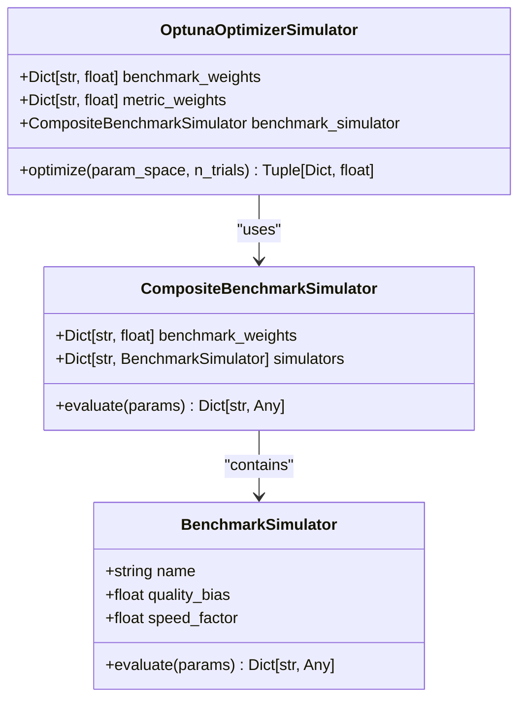
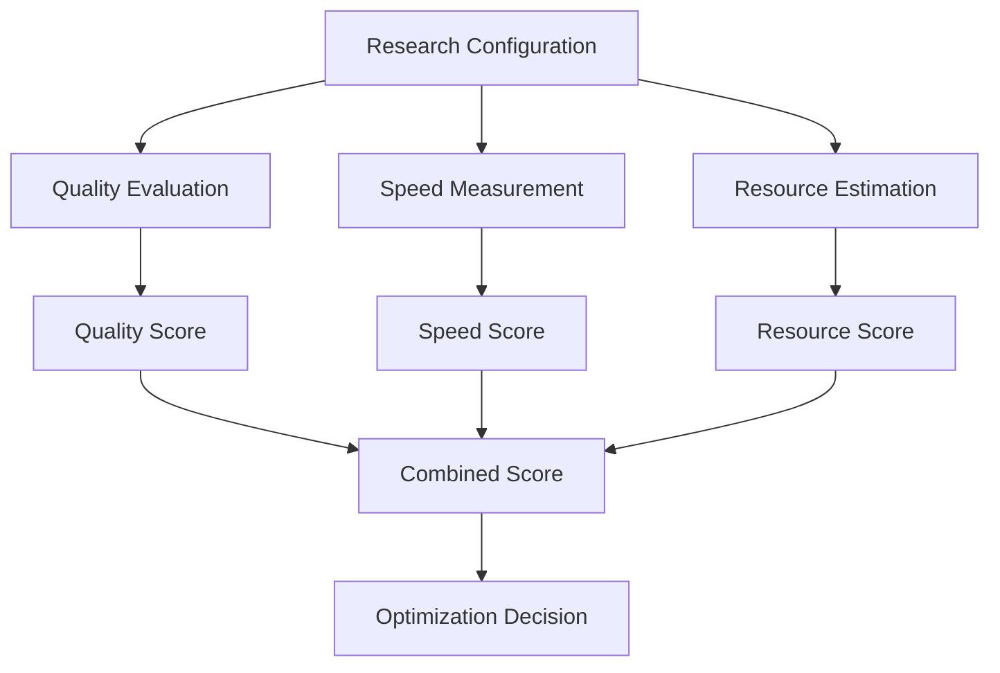
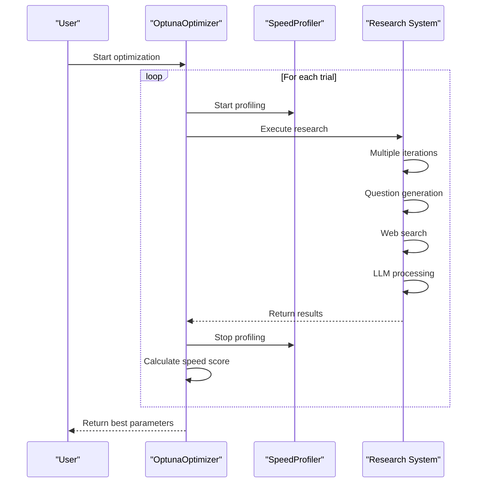
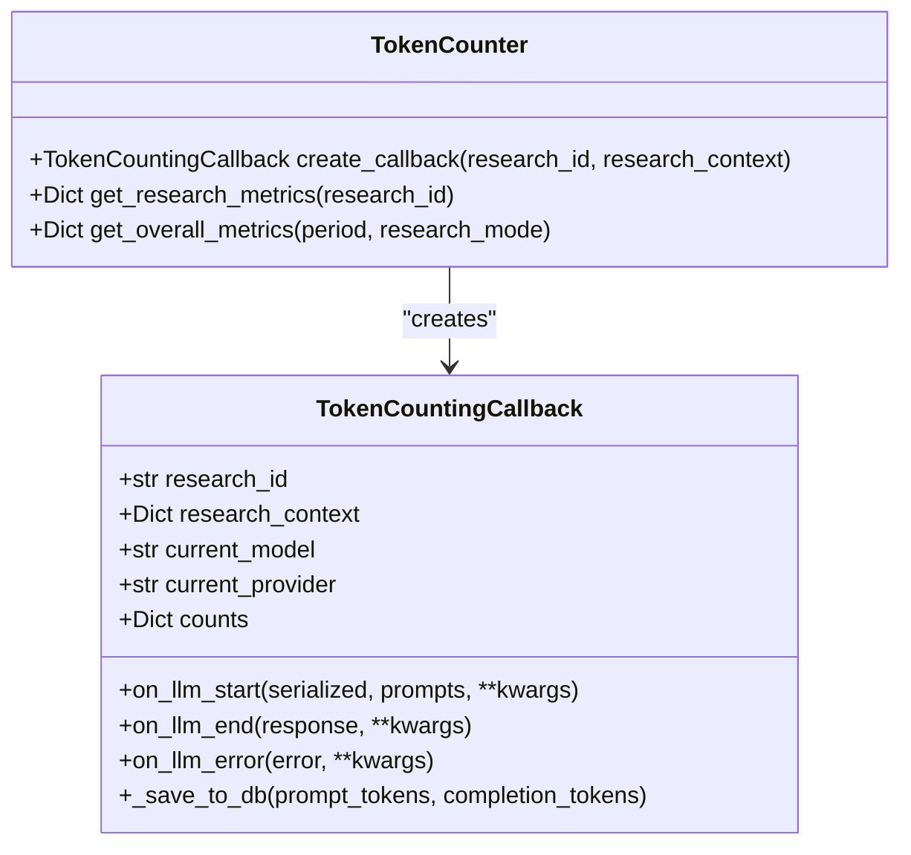
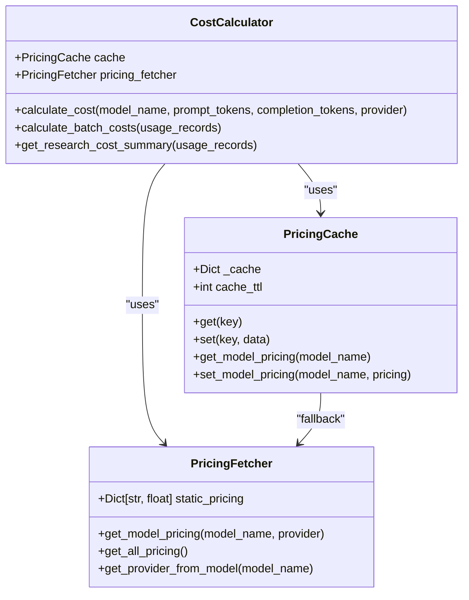

# Performance Analysis

<cite>
**Referenced Files in This Document**   
- [multi_benchmark_simulation.py](file://examples/optimization/multi_benchmark_simulation.py)
- [token_counter.py](file://src/local_deep_research/metrics/token_counter.py)
- [cost_calculator.py](file://src/local_deep_research/metrics/pricing/cost_calculator.py)
- [pricing_fetcher.py](file://src/local_deep_research/metrics/pricing/pricing_fetcher.py)
- [optuna_optimizer.py](file://src/local_deep_research/benchmarks/optimization/optuna_optimizer.py)
- [calculation.py](file://src/local_deep_research/benchmarks/metrics/calculation.py)
- [runners.py](file://src/local_deep_research/benchmarks/runners.py)
</cite>

## Table of Contents
1. [Introduction](#introduction)
2. [Multi-Benchmark Simulation](#multi-benchmark-simulation)
3. [Metrics System](#metrics-system)
4. [Speed Profiler](#speed-profiler)
5. [Token Counter](#token-counter)
6. [Cost Optimization](#cost-optimization)
7. [Performance Data Visualization](#performance-data-visualization)
8. [Diagnosing and Optimizing Performance](#diagnosing-and-optimizing-performance)
9. [Conclusion](#conclusion)

## Introduction
The local-deep-research system provides a comprehensive suite of performance analysis tools to identify bottlenecks and optimize research efficiency. This document details the implementation of multi-benchmark simulations, the metrics system for tracking research speed, token usage, and computational cost, and strategies for cost optimization. The system enables users to make informed decisions about system configuration and resource allocation by providing detailed performance data and visualization capabilities.

## Multi-Benchmark Simulation
The multi-benchmark simulation framework allows for comprehensive performance evaluation across diverse scenarios without executing actual benchmarks. This simulation capability is particularly useful for demonstrating optimization techniques and understanding system behavior under different configurations.

### Implementation Details
The `multi_benchmark_simulation.py` example demonstrates a complete simulation framework with three main components:

1. **BenchmarkSimulator**: Simulates individual benchmark execution with configurable quality bias and speed factors
2. **CompositeBenchmarkSimulator**: Combines multiple benchmarks with weighted scores
3. **OptunaOptimizerSimulator**: Simulates parameter optimization using Optuna's optimization algorithm

The simulation framework evaluates system parameters such as iterations, questions per iteration, and search strategy, calculating quality and speed scores based on these parameters. Different benchmark types respond differently to parameter changes:
- SimpleQA benefits from more iterations
- BrowseComp performs better with more questions per iteration
- Various search strategies (rapid, iterdrag) have trade-offs between speed and quality

**Diagram sources**
- [multi_benchmark_simulation.py](file://examples/optimization/multi_benchmark_simulation.py#L18-L273)

The simulation runs multiple trials, testing different parameter combinations and tracking performance metrics. It supports weighted combinations of benchmarks (e.g., 60% SimpleQA and 40% BrowseComp) to reflect different evaluation priorities. Results are saved in JSON format with detailed trial information, including parameters, quality scores, speed scores, and combined scores.

**Section sources**
- [multi_benchmark_simulation.py](file://examples/optimization/multi_benchmark_simulation.py#L1-L414)

## Metrics System
The metrics system in local-deep-research provides comprehensive tracking of research performance across multiple dimensions, including speed, quality, and resource usage.

### Core Metrics
The system calculates three primary categories of metrics:

1. **Quality Metrics**: Evaluated using benchmark datasets like SimpleQA, measuring accuracy and correctness of results
2. **Speed Metrics**: Measured by execution time of research queries, normalized to a 0-1 scale
3. **Resource Metrics**: Estimated based on configuration complexity, reflecting computational cost

**Diagram sources**
- [calculation.py](file://src/local_deep_research/benchmarks/metrics/calculation.py#L115-L397)

The combined score is calculated as a weighted sum of these metrics, allowing users to prioritize different aspects of performance. The default weighting is 60% quality, 30% speed, and 10% resource efficiency, but these weights can be customized based on specific requirements.

### Metric Calculation Process
The metrics system follows a structured process:
1. Execute research with specific configuration parameters
2. Measure execution time using the speed profiler
3. Evaluate result quality using benchmark datasets
4. Estimate resource usage based on configuration
5. Calculate normalized scores for each metric category
6. Combine scores using configured weights

The system supports both automated and human evaluation of results, with fallback mechanisms when automated evaluation fails.

**Section sources**
- [calculation.py](file://src/local_deep_research/benchmarks/metrics/calculation.py#L115-L397)
- [runners.py](file://src/local_deep_research/benchmarks/runners.py#L41-L494)

## Speed Profiler
The speed profiler is a critical component for measuring execution time of different research phases and identifying performance bottlenecks.

### Implementation
The speed profiler is integrated into the optimization workflow through the `OptunaOptimizer` class. It measures the total duration of research execution, providing timing data that contributes to the speed score calculation.

**Diagram sources**
- [optuna_optimizer.py](file://src/local_deep_research/benchmarks/optimization/optuna_optimizer.py#L424-L453)

The profiler captures the total execution time, which is then converted to a speed score using a sigmoid-like normalization function. This ensures that faster executions receive higher scores, with diminishing returns for very fast executions.

### Usage
The speed profiler is automatically instantiated and used during optimization trials. It provides timing data that helps balance the trade-off between research quality and execution speed. The timing results are included in the optimization history and can be analyzed to understand how different parameters affect performance.

**Section sources**
- [optuna_optimizer.py](file://src/local_deep_research/benchmarks/optimization/optuna_optimizer.py#L424-L453)

## Token Counter
The token counter provides detailed tracking of LLM usage, enabling precise monitoring of token consumption and identification of potential issues.

### Implementation
The token counter is implemented as a callback handler that integrates with the LLM system to capture token usage data:

**Diagram sources**
- [token_counter.py](file://src/local_deep_research/metrics/token_counter.py#L19-L699)

The `TokenCountingCallback` class captures token usage from various sources, including:
- LLM output token_usage field
- Generation message usage_metadata
- Response metadata (particularly for Ollama)

It also tracks additional context such as:
- Research phase and iteration
- Search engine usage
- Call stack information
- Response time and success status
- Context overflow detection

### Data Collection
The token counter collects comprehensive data for each LLM call, including:
- Prompt and completion token counts
- Model name and provider
- Research context (query, mode, phase)
- Performance metrics (response time, success status)
- Search engine context (planned and selected engines)
- Call stack information for debugging

This data is stored in the database, enabling detailed analysis of token usage patterns across different research sessions and configurations.

**Section sources**
- [token_counter.py](file://src/local_deep_research/metrics/token_counter.py#L1-L800)

## Cost Optimization
The cost optimization framework analyzes the trade-offs between different LLM providers and their pricing models to minimize computational expenses while maintaining research quality.

### Pricing System
The pricing system consists of three main components:

**Diagram sources**
- [cost_calculator.py](file://src/local_deep_research/metrics/pricing/cost_calculator.py#L16-L237)
- [pricing_cache.py](file://src/local_deep_research/metrics/pricing/pricing_cache.py#L14-L109)
- [pricing_fetcher.py](file://src/local_deep_research/metrics/pricing/pricing_fetcher.py#L14-L241)

### Cost Calculation
The cost calculator determines expenses based on token usage and provider pricing:

1. **Model Identification**: Determines the provider from the model name
2. **Pricing Retrieval**: Gets pricing data from cache or fetcher
3. **Cost Calculation**: Computes costs based on prompt and completion tokens
4. **Currency Conversion**: All costs are calculated in USD per 1,000 tokens

The system maintains a comprehensive static pricing database for major providers:
- OpenAI (GPT-4, GPT-3.5-turbo, etc.)
- Anthropic (Claude models)
- Google (Gemini models)
- Local models (Ollama, vLLM, etc.) with zero cost

### Optimization Strategies
The system supports several cost optimization strategies:

1. **Provider Selection**: Choosing the most cost-effective provider for specific tasks
2. **Parameter Tuning**: Optimizing parameters to reduce token consumption
3. **Caching**: Reusing results to avoid redundant processing
4. **Local Models**: Utilizing free local models when quality requirements allow

The optimization process balances cost against quality and speed, allowing users to find the optimal configuration for their specific requirements and budget constraints.

**Section sources**
- [cost_calculator.py](file://src/local_deep_research/metrics/pricing/cost_calculator.py#L16-L237)
- [pricing_fetcher.py](file://src/local_deep_research/metrics/pricing/pricing_fetcher.py#L14-L241)

## Performance Data Visualization
The system provides comprehensive visualization capabilities to identify patterns and outliers in performance data.

### Built-in Visualizations
The optimization framework generates several types of visualizations:

1. **Optimization History**: Shows the progress of the optimization process over trials
2. **Parameter Importances**: Ranks parameters by their impact on the objective function
3. **Slice Plots**: Displays the relationship between individual parameters and the objective value
4. **Contour Plots**: Shows interactions between pairs of parameters
5. **Custom Visualizations**: Quality vs. speed trade-off plots and parameter evolution

These visualizations are created using Optuna's visualization module and Matplotlib, and are saved in the optimization results directory.

### Data Analysis
The visualization system helps identify:
- Parameter interactions and dependencies
- Optimal parameter ranges
- Performance trade-offs between quality and speed
- Outliers and anomalous results
- Convergence patterns in the optimization process

The visualizations are automatically generated during and after optimization, providing immediate feedback on the optimization process and enabling deeper analysis of the results.

**Section sources**
- [optuna_optimizer.py](file://src/local_deep_research/benchmarks/optimization/optuna_optimizer.py#L583-L727)

## Diagnosing and Optimizing Performance
The system provides practical tools and techniques for diagnosing slow research performance and implementing targeted optimizations.

### Diagnosing Performance Issues
To diagnose performance issues, follow these steps:

1. **Analyze Token Usage**: Use the token counter to identify excessive token consumption
2. **Check Context Overflow**: Monitor for context truncation warnings
3. **Review Execution Time**: Examine speed profiler results for slow components
4. **Evaluate Cost Efficiency**: Analyze cost calculator output for expensive operations
5. **Examine Error Patterns**: Review error logs and failed trials

### Targeted Optimization Strategies
Based on the diagnosis, implement appropriate optimizations:

#### For Slow Performance:
- Reduce iterations and questions per iteration
- Use faster search strategies (rapid, parallel)
- Limit result counts
- Use faster LLM models

#### For High Costs:
- Switch to more cost-effective providers
- Optimize for efficiency rather than quality
- Use local models when possible
- Reduce token consumption through parameter tuning

#### For Low Quality:
- Increase iterations and questions per iteration
- Use quality-focused search strategies (iterdrag)
- Select higher-quality LLM models
- Adjust temperature settings

### Optimization Workflow
The recommended optimization workflow:

1. **Baseline Measurement**: Run initial research with default parameters
2. **Data Collection**: Gather metrics on speed, quality, and cost
3. **Analysis**: Identify bottlenecks and inefficiencies
4. **Targeted Optimization**: Apply specific optimizations based on analysis
5. **Validation**: Verify improvements with benchmark testing
6. **Iteration**: Repeat the process until desired performance is achieved

The multi-benchmark optimization framework automates much of this process, systematically exploring the parameter space to find optimal configurations.

**Section sources**
- [multi_benchmark_simulation.py](file://examples/optimization/multi_benchmark_simulation.py#L1-L414)
- [optuna_optimizer.py](file://src/local_deep_research/benchmarks/optimization/optuna_optimizer.py#L1-L1239)

## Conclusion
The local-deep-research system provides a comprehensive suite of performance analysis tools that enable users to optimize research efficiency across multiple dimensions. The multi-benchmark simulation framework allows for thorough evaluation of different configurations without executing actual benchmarks. The metrics system tracks research speed, token usage, and computational cost, providing detailed data for analysis. The speed profiler and token counter offer granular insights into performance characteristics, while the cost optimization framework helps balance quality against expenses. By leveraging these tools and following systematic optimization approaches, users can significantly improve research efficiency and make informed decisions about system configuration and resource allocation.