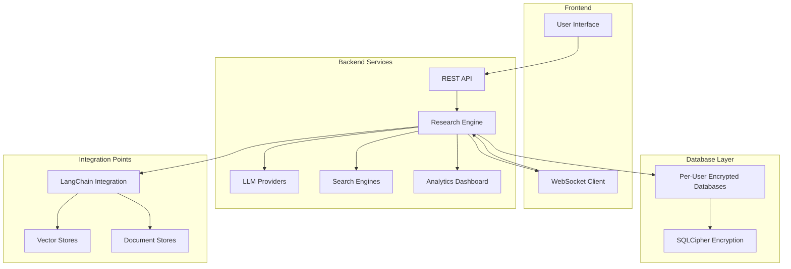
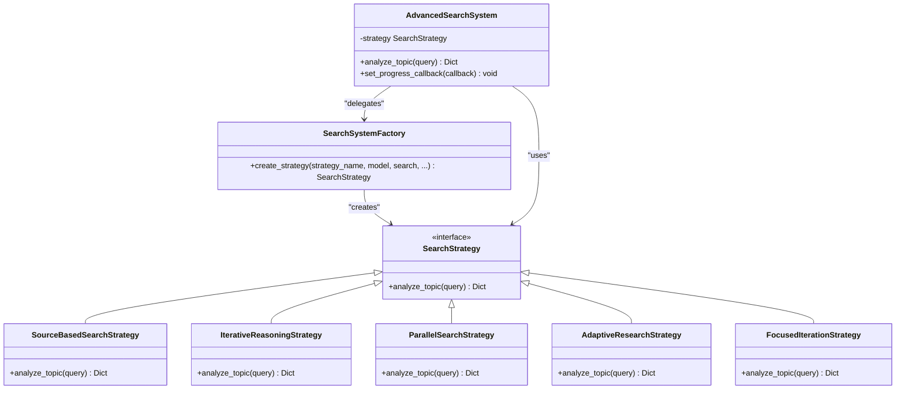
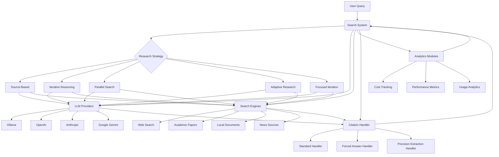
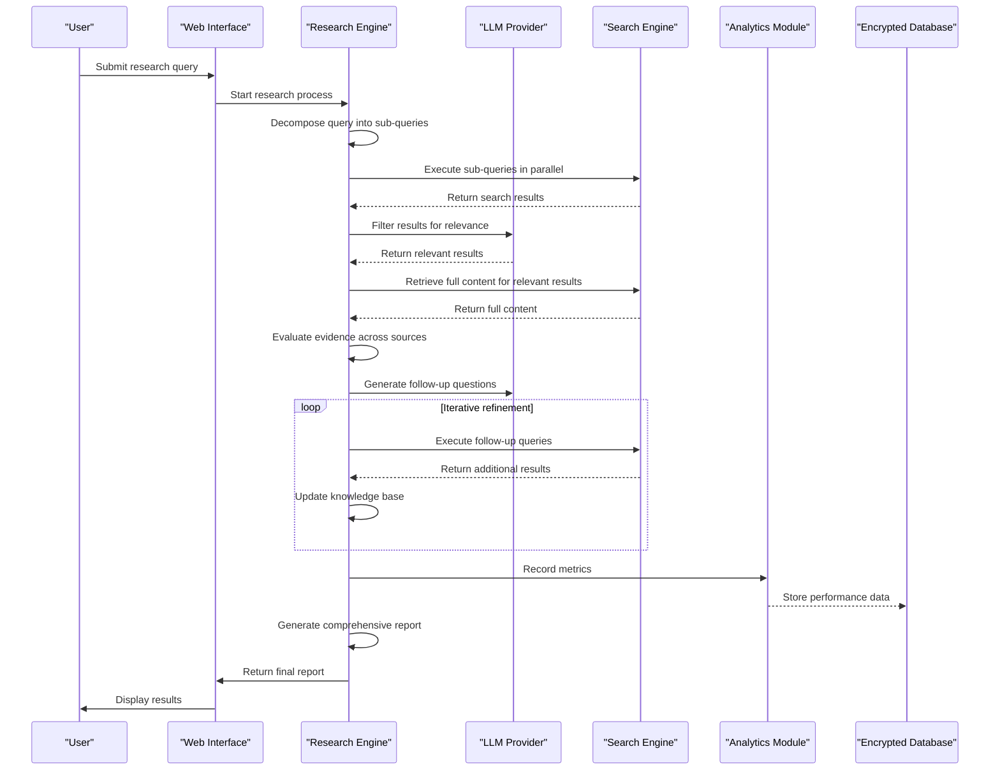
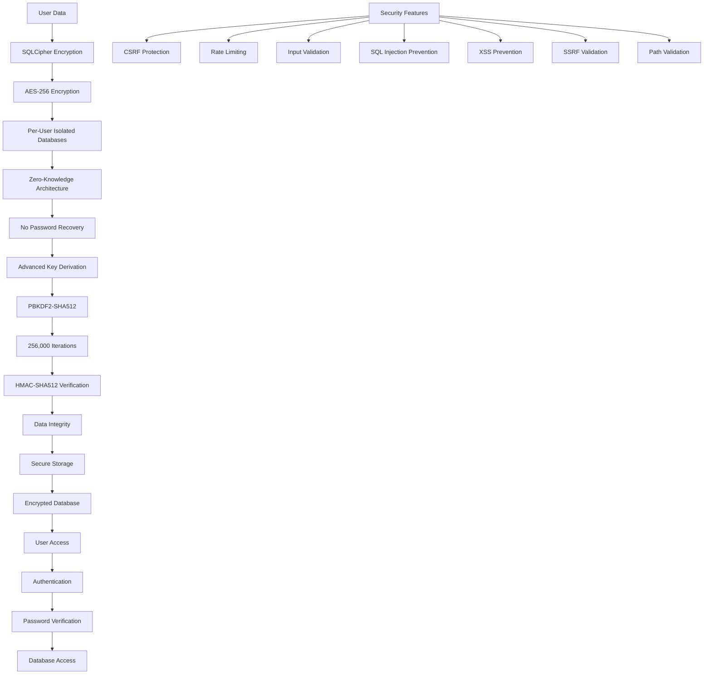

# Project Overview

<cite>
**Referenced Files in This Document**   
- [README.md](file://README.md)
- [search_system.py](file://src/local_deep_research/search_system.py)
- [search_system_factory.py](file://src/local_deep_research/search_system_factory.py)
- [encrypted_db.py](file://src/local_deep_research/database/encrypted_db.py)
- [web/app.py](file://src/local_deep_research/web/app.py)
- [web_search_engines/search_engine_base.py](file://src/local_deep_research/web_search_engines/search_engine_base.py)
- [citation_handler.py](file://src/local_deep_research/citation_handler.py)
- [web/routes/research_routes.py](file://src/local_deep_research/web/routes/research_routes.py)
- [web/services/socket_service.py](file://src/local_deep_research/web/services/socket_service.py)
</cite>

## Table of Contents
1. [Introduction](#introduction)
2. [Core Goals and Purpose](#core-goals-and-purpose)
3. [High-Level System Architecture](#high-level-system-architecture)
4. [Key Design Patterns](#key-design-patterns)
5. [Component Relationships](#component-relationships)
6. [Data Flow and Processing](#data-flow-and-processing)
7. [Privacy and Security Features](#privacy-and-security-features)
8. [Conclusion](#conclusion)

## Introduction
The local-deep-research project is an advanced AI-powered research assistant designed to perform systematic, citation-aware deep research using multiple LLMs and search engines. This document provides a comprehensive overview of the project's core goals, architectural design, and key technical components. The system is built to break down complex queries into focused sub-queries, search multiple sources in parallel, verify information across sources for accuracy, and create comprehensive reports with proper citations. The architecture is designed to be privacy-focused, flexible, and transparent, allowing users to run the system entirely locally with Ollama and SearXNG while maintaining complete data isolation through per-user encrypted databases.

**Section sources**
- [README.md](file://README.md#L38-L55)

## Core Goals and Purpose
The primary goal of the local-deep-research project is to provide an AI-powered research assistant that performs systematic, iterative research with proper citation tracking. The system is designed to help researchers, students, and professionals find accurate information quickly while maintaining transparency about sources. The project aims to break down complex questions into focused sub-queries, search multiple sources in parallel (including web, academic papers, and local documents), verify information across sources for accuracy, and create comprehensive reports with proper citations. The system supports multiple research modes from quick summaries to detailed reports and document analysis, making it suitable for various research needs. The project emphasizes privacy and security, allowing users to run the system entirely locally with Ollama and SearXNG, ensuring that sensitive queries never leave their local environment.

**Section sources**
- [README.md](file://README.md#L40-L47)

## High-Level System Architecture
The local-deep-research system follows a modular architecture with distinct layers for web interface, backend services, database layer, and integration points. The web interface provides a user-friendly frontend for submitting research queries and viewing results, while the backend services handle the core research logic, including query decomposition, search execution, and report generation. The database layer uses SQLCipher with AES-256 encryption to store user data securely, with each user having their own isolated encrypted database. The system integrates with multiple LLM providers (including local models via Ollama and cloud models like OpenAI, Anthropic, and Google) and various search engines (both free and premium). The architecture supports real-time updates through WebSocket connections, allowing users to monitor research progress in real-time. The system is designed to be extensible, supporting integration with existing knowledge bases through LangChain retrievers and various vector stores.

**Diagram sources**
- [README.md](file://README.md#L50-L55)
- [web/app.py](file://src/local_deep_research/web/app.py#L35-L36)
- [encrypted_db.py](file://src/local_deep_research/database/encrypted_db.py#L27-L31)

## Key Design Patterns
The local-deep-research project employs several key design patterns to achieve its goals of flexibility, extensibility, and maintainability. The Strategy pattern is used extensively in the research strategy selection system, allowing different research approaches (such as source-based, iterative, parallel, and adaptive) to be implemented as interchangeable components. The Factory pattern is used in the `search_system_factory.py` module to create instances of different search strategies based on configuration, providing a centralized way to instantiate strategies without code duplication. The system also uses a modular architecture with clear separation of concerns, where components like the citation handler, search engines, and analytics modules can be developed and maintained independently. The use of these design patterns enables the system to support multiple research modes and configurations while maintaining a clean, maintainable codebase.

**Diagram sources**
- [search_system.py](file://src/local_deep_research/search_system.py#L20-L219)
- [search_system_factory.py](file://src/local_deep_research/search_system_factory.py#L25-L800)

## Component Relationships
The local-deep-research system consists of several interconnected components that work together to perform deep research. The search system coordinates different search strategies and manages the research process, while the LLM providers handle natural language processing and reasoning tasks. The search engines interface with various information sources, including web search engines, academic databases, and local document collections. The analytics modules track costs, performance, and usage metrics, providing insights into the research process. The citation handler ensures proper attribution of sources in the final reports. These components are connected through well-defined interfaces, allowing for flexible configuration and extension. The system uses a two-phase retrieval approach where it first gets preview information for many results, filters them for relevance using the LLM, and then retrieves full content only for the relevant results, optimizing both efficiency and accuracy.

**Diagram sources**
- [search_system.py](file://src/local_deep_research/search_system.py#L20-L219)
- [web_search_engines/search_engine_base.py](file://src/local_deep_research/web_search_engines/search_engine_base.py#L35-L657)
- [citation_handler.py](file://src/local_deep_research/citation_handler.py#L8-L107)

## Data Flow and Processing
The data flow in the local-deep-research system follows a structured process from user query to final report generation. When a user submits a research query, the system first decomposes the complex question into focused sub-queries using the selected research strategy. These sub-queries are then executed in parallel across multiple search engines, retrieving relevant information from various sources. The retrieved results undergo a two-phase filtering process: first, preview information is filtered for relevance using the LLM, and then full content is retrieved only for the most relevant results. The evidence evaluation component analyzes the retrieved information, verifying facts across multiple sources and assessing the credibility of each source. The system iteratively refines its understanding, generating follow-up questions based on the initial findings. Finally, the report generator compiles the verified information into a comprehensive report with proper citations, using the citation handler to ensure accurate attribution of sources.

**Diagram sources**
- [search_system.py](file://src/local_deep_research/search_system.py#L240-L377)
- [web/routes/research_routes.py](file://src/local_deep_research/web/routes/research_routes.py#L129-L706)
- [web_search_engines/search_engine_base.py](file://src/local_deep_research/web_search_engines/search_engine_base.py#L259-L433)

## Privacy and Security Features
The local-deep-research project places a strong emphasis on privacy and security, implementing several features to protect user data. The system uses SQLCipher with AES-256 encryption (the same technology used by Signal messenger) to protect all user data at rest, ensuring that databases are encrypted with strong cryptography. Each user has their own isolated encrypted database, providing complete data isolation and preventing cross-user data access. The system follows a zero-knowledge architecture, meaning there is no password recovery mechanism, ensuring true privacy and preventing unauthorized access even by system administrators. The encryption uses advanced key derivation with PBKDF2-SHA512 and 256,000 iterations to prevent brute-force attacks, and includes HMAC-SHA512 verification to prevent data tampering. The system also implements CSRF protection for web forms and API endpoints, rate limiting to prevent abuse, and input validation to prevent injection attacks, providing a comprehensive security framework.

**Diagram sources**
- [README.md](file://README.md#L57-L71)
- [encrypted_db.py](file://src/local_deep_research/database/encrypted_db.py#L27-L621)
- [web/auth/routes.py](file://src/local_deep_research/web/auth/routes.py#L32-L45)

## Conclusion
The local-deep-research project represents a comprehensive AI-powered research assistant that combines advanced natural language processing with systematic research methodologies. By leveraging multiple LLMs and search engines, the system can perform deep, iterative research with proper citation tracking, helping users find accurate information efficiently. The modular architecture, built on design patterns like Strategy and Factory, provides flexibility and extensibility, allowing the system to support various research modes and configurations. The emphasis on privacy and security, with features like per-user encrypted databases and zero-knowledge architecture, ensures that sensitive research remains protected. The system's ability to integrate with existing knowledge bases through LangChain and support real-time updates via WebSockets makes it a powerful tool for researchers, students, and professionals who need to conduct thorough, transparent research while maintaining control over their data.

**Section sources**
- [README.md](file://README.md#L32-L55)
- [search_system.py](file://src/local_deep_research/search_system.py#L20-L377)