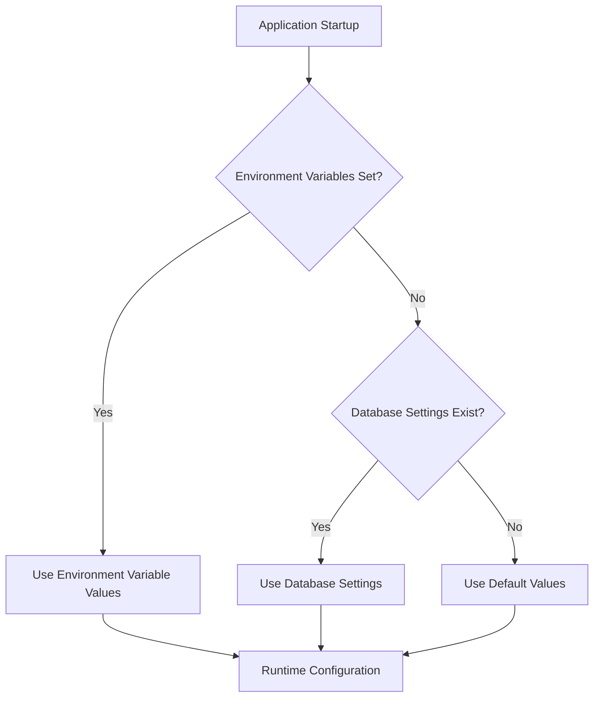
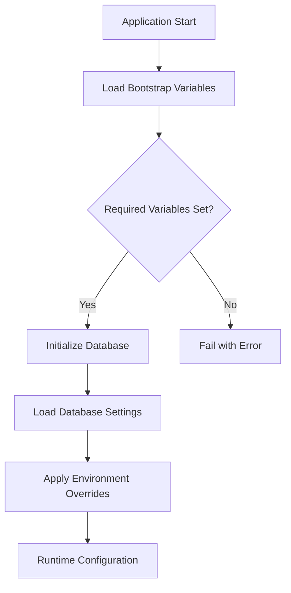
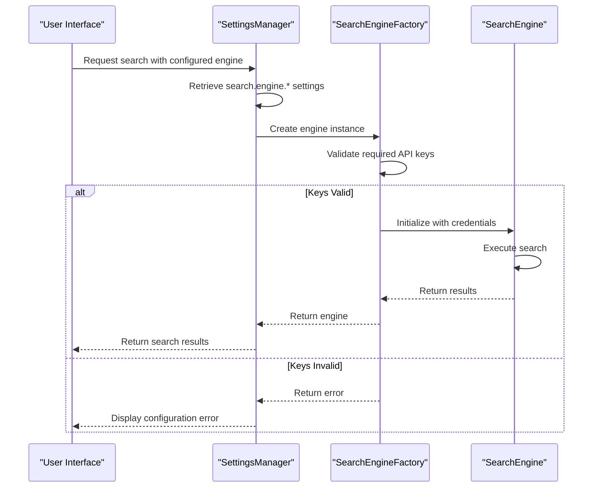

# Configuration Issues

<cite>
**Referenced Files in This Document**   
- [show_env_vars.py](file://examples/show_env_vars.py)
- [env_configuration.md](file://docs/env_configuration.md)
- [troubleshooting-openai-api-key.md](file://docs/troubleshooting-openai-api-key.md)
- [llm_config.py](file://src/local_deep_research/config/llm_config.py)
- [manager.py](file://src/local_deep_research/settings/manager.py)
- [env_settings.py](file://src/local_deep_research/settings/env_settings.py)
- [default_settings.json](file://src/local_deep_research/defaults/default_settings.json)
- [search_engines_config.py](file://src/local_deep_research/web_search_engines/search_engines_config.py)
- [settings_snapshot](file://src/local_deep_research/settings/manager.py#L537-L554)
</cite>

## Table of Contents
1. [Introduction](#introduction)
2. [Configuration System Overview](#configuration-system-overview)
3. [API Key Configuration](#api-key-configuration)
4. [Environment Variable Configuration](#environment-variable-configuration)
5. [Search Engine Credentials](#search-engine-credentials)
6. [Configuration Validation and Debugging](#configuration-validation-and-debugging)
7. [Common Configuration Issues and Solutions](#common-configuration-issues-and-solutions)
8. [Best Practices](#best-practices)

## Introduction
This document provides comprehensive guidance on troubleshooting configuration issues in the Local Deep Research application. It covers common problems related to API key setup for OpenAI and other LLM providers, environment variable misconfigurations, and search engine credential issues. The content explains the correct format and placement of configuration values in both environment variables and settings files, with concrete examples from the actual codebase. It also addresses the relationships between configuration files and runtime behavior, providing step-by-step debugging guidance for configuration validation.

## Configuration System Overview

The Local Deep Research application employs a hierarchical configuration system that combines environment variables, database-stored settings, and default values. This multi-layered approach provides flexibility for different deployment scenarios while maintaining security for sensitive credentials.

The configuration system follows a specific priority order:
1. Environment variables (highest priority)
2. Database-stored settings
3. Default values (lowest priority)



**Diagram sources**
- [manager.py](file://src/local_deep_research/settings/manager.py#L178-L194)

**Section sources**
- [manager.py](file://src/local_deep_research/settings/manager.py#L178-L194)
- [env_settings.py](file://src/local_deep_research/settings/env_settings.py#L33-L50)

## API Key Configuration

### OpenAI API Key Setup
The application supports multiple LLM providers, with OpenAI being one of the primary options. API keys for OpenAI and other providers are configured through the settings system, which can be accessed via the web interface, programmatically, or through environment variables.

The configuration for OpenAI is stored in the database with the key `llm.openai.api_key`. When setting up an OpenAI API key, ensure it follows the correct format:
- Starts with `sk-`
- Approximately 51 characters long
- No extra spaces or quotes

```mermaid
classDiagram
class SettingsManager {
+get_setting(key, default) Any
+set_setting(key, value) bool
+get_all_settings() Dict[str, Any]
+get_settings_snapshot() Dict[str, Any]
}
class LLMConfig {
+get_llm(settings_snapshot) BaseChatModel
+is_openai_available(settings_snapshot) bool
+is_anthropic_available(settings_snapshot) bool
+is_openai_endpoint_available(settings_snapshot) bool
}
SettingsManager --> LLMConfig : "provides settings"
LLMConfig ..> "API Key Validation" : "checks availability"
```

**Diagram sources**
- [llm_config.py](file://src/local_deep_research/config/llm_config.py#L53-L63)
- [manager.py](file://src/local_deep_research/settings/manager.py#L342-L387)

**Section sources**
- [llm_config.py](file://src/local_deep_research/config/llm_config.py#L53-L63)
- [troubleshooting-openai-api-key.md](file://docs/troubleshooting-openai-api-key.md#L25-L55)

### Other LLM Providers
The application supports several other LLM providers beyond OpenAI, each with their own configuration requirements:

**Anthropic**
- Setting key: `llm.anthropic.api_key`
- API key format: Starts with `sk-ant-`
- Environment variable: `LDR_LLM_ANTHROPIC_API_KEY`

**OpenAI-Compatible Endpoints (e.g., OpenRouter)**
- Setting key: `llm.openai_endpoint.api_key`
- Additional settings:
  - `llm.openai_endpoint.url`: Custom endpoint URL
  - `llm.provider`: Set to `openai_endpoint`

**Local Models (Ollama, LM Studio)**
- No API key required
- Configuration focuses on endpoint URLs and model paths
- Ollama URL setting: `llm.ollama.url` (default: `http://localhost:11434`)

## Environment Variable Configuration

### Environment Variable Format
The application uses a standardized format for environment variables, following the pattern `LDR_SECTION__SETTING`. Key points about the format:

- Prefix all variables with `LDR_`
- Use double underscores (`__`) to separate setting path components
- Convert setting keys to uppercase
- Example: `app.host` becomes `LDR_APP__HOST`

The `show_env_vars.py` example script demonstrates how to view all available environment variables:

```python
# Example script to show environment variables
from local_deep_research.settings.manager import SettingsManager

all_env_vars = SettingsManager.get_all_env_vars()
for category, vars_dict in all_env_vars.items():
    print(f"\n{category.upper()} VARIABLES:")
    for var_name, description in sorted(vars_dict.items()):
        current_value = os.environ.get(var_name)
        # Mask sensitive values
        display_value = "***SET***" if current_value and any(sensitive in var_name for sensitive in ["KEY", "PASSWORD", "SECRET"]) else current_value
        status = f" [Current: {display_value}]" if current_value else ""
        print(f"  {var_name}")
        print(f"    {description}{status}")
```

**Section sources**
- [show_env_vars.py](file://examples/show_env_vars.py#L1-L66)
- [env_configuration.md](file://docs/env_configuration.md#L10-L18)

### Bootstrap Environment Variables
Certain configuration settings must be provided as environment variables before the database is accessible. These "bootstrap" variables are critical for system initialization:

- `LDR_BOOTSTRAP_ENCRYPTION_KEY`: Database encryption key
- `LDR_BOOTSTRAP_SECRET_KEY`: Application secret key for session encryption
- `LDR_BOOTSTRAP_DATA_DIR`: Data directory path
- `LDR_BOOTSTRAP_CONFIG_DIR`: Configuration directory path
- `LDR_DB_CONFIG_CACHE_SIZE_MB`: Database cache size in MB

These variables are defined in the environment settings system and cannot be stored in the database due to their role in initializing the database connection itself.



**Diagram sources**
- [env_settings.py](file://src/local_deep_research/settings/env_settings.py#L1-L21)
- [bootstrap.py](file://src/local_deep_research/settings/env_definitions/bootstrap.py#L1-L60)

**Section sources**
- [env_settings.py](file://src/local_deep_research/settings/env_settings.py#L1-L21)
- [bootstrap.py](file://src/local_deep_research/settings/env_definitions/bootstrap.py#L1-L60)

## Search Engine Credentials

### Search Engine Configuration Structure
Search engine credentials are managed through a flexible configuration system that supports both built-in search engines and custom providers. The configuration is stored in the database under the `search.engine` namespace.

The application supports various search engines, each with specific credential requirements:

**Google Programmable Search Engine**
- Required settings:
  - `search.engine.google_pse.api_key`: Google API key
  - `search.engine.google_pse.engine_id`: Search engine ID
- Environment variables: `GOOGLE_PSE_API_KEY` and `GOOGLE_PSE_ENGINE_ID`

**SerpAPI**
- Required setting: `search.engine.serpapi.api_key`
- Environment variable: `SERP_API_KEY`

**Brave Search**
- Required setting: `search.engine.brave.api_key`
- Environment variable: `BRAVE_API_KEY`

**SearXNG**
- Required setting: `search.engine.searxng.base_url`
- No API key required for public instances

### Configuration Relationships
The relationship between search engine configuration and runtime behavior is managed through the search engine factory system. When a search is initiated, the system:

1. Retrieves the configured search engine from settings
2. Validates required credentials are present
3. Instantiates the appropriate search engine class
4. Executes the search with the configured parameters



**Diagram sources**
- [search_engines_config.py](file://src/local_deep_research/web_search_engines/search_engines_config.py#L94-L302)
- [manager.py](file://src/local_deep_research/settings/manager.py#L342-L387)

**Section sources**
- [search_engines_config.py](file://src/local_deep_research/web_search_engines/search_engines_config.py#L94-L302)
- [default_settings.json](file://src/local_deep_research/defaults/default_settings.json#L540-L580)

## Configuration Validation and Debugging

### Using the show_env_vars.py Script
The `show_env_vars.py` script is a valuable tool for debugging configuration issues. It displays all available environment variables, their descriptions, and current values (with sensitive values masked).

To use the script:
```bash
python examples/show_env_vars.py
```

The output includes:
- All available environment variables grouped by category
- Current values (masked for sensitive variables)
- Format guidelines for environment variables
- List of bootstrap variables that must be set before database access

### Configuration Validation Process
The application performs several validation steps when loading configuration:

1. **Bootstrap Validation**: Checks for required bootstrap variables before database initialization
2. **Type Validation**: Ensures settings are of the correct type (boolean, string, integer)
3. **Path Validation**: Validates file and directory paths for security
4. **Credential Validation**: Checks for required API keys based on the selected provider

The SettingsManager class handles most of this validation, with specific methods for different data types:

```python
def parse_boolean(value: Any) -> bool:
    """
    Convert various representations to boolean using HTML checkbox semantics.
    
    Examples:
        parse_boolean("on") -> True
        parse_boolean("true") -> True
        parse_boolean("1") -> True
        parse_boolean("false") -> False
        parse_boolean("off") -> False
        parse_boolean("") -> False
        parse_boolean(None) -> False
    """
    FALSY_VALUES = ("off", "false", "0", "", "no")
    
    if isinstance(value, bool):
        return value
    if value is None:
        return False
    if isinstance(value, str):
        value_lower = value.lower().strip()
        if value_lower in FALSY_VALUES:
            return False
        return True
    return bool(value)
```

**Section sources**
- [show_env_vars.py](file://examples/show_env_vars.py#L1-L66)
- [manager.py](file://src/local_deep_research/settings/manager.py#L26-L87)

## Common Configuration Issues and Solutions

### Missing API Keys
**Symptoms:**
- "No API key found" errors
- Research fails to start
- Fallback to dummy models

**Solutions:**
1. **Via Web Interface:**
   - Navigate to Settings
   - Select the appropriate LLM provider
   - Enter the API key in the designated field
   - Save settings

2. **Via Environment Variables:**
   ```bash
   export OPENAI_API_KEY=sk-your-api-key
   export LDR_OPENAI_API_KEY=sk-your-api-key  # Required duplicate
   python -m local_deep_research.web.app
   ```

3. **Programmatically:**
   ```python
   from local_deep_research.settings import SettingsManager
   from local_deep_research.database.session_context import get_user_db_session
   
   with get_user_db_session(username="user", password="pass") as session:
       settings_manager = SettingsManager(session)
       settings_manager.set_setting("llm.provider", "openai")
       settings_manager.set_setting("llm.openai.api_key", "sk-your-api-key")
   ```

### Invalid API Keys
**Symptoms:**
- 401 Unauthorized errors
- "Incorrect API key provided" messages
- Authentication failures

**Solutions:**
1. **Verify API Key Format:**
   - OpenAI keys start with `sk-`
   - Should be around 51 characters long
   - No extra spaces or quotes

2. **Check API Key Validity:**
   ```bash
   curl https://api.openai.com/v1/models \
     -H "Authorization: Bearer YOUR_API_KEY"
   ```

3. **Regenerate API Key:**
   - Visit the provider's dashboard (e.g., https://platform.openai.com/api-keys)
   - Create a new API key
   - Update in application settings

### Environment Variable Issues
**Symptoms:**
- Settings not being overridden by environment variables
- Bootstrap variables not recognized
- Incorrect variable naming

**Solutions:**
1. **Verify Variable Naming:**
   - Use `LDR_` prefix
   - Use double underscores (`__`) for path separation
   - Convert to uppercase
   - Example: `app.host` becomes `LDR_APP__HOST`

2. **Check Bootstrap Variables:**
   ```python
   # List all bootstrap variables
   bootstrap_vars = SettingsManager.get_bootstrap_env_vars()
   for var in sorted(bootstrap_vars.keys()):
       print(f"  - {var}")
   ```

3. **Validate Variable Setting:**
   ```bash
   # Check if variable is set
   echo $LDR_APP__HOST
   
   # Test with the show_env_vars.py script
   python examples/show_env_vars.py
   ```

### Search Engine Credential Issues
**Symptoms:**
- Search engines not appearing in the UI
- "API key required" messages
- Failed search attempts

**Solutions:**
1. **Verify Required Credentials:**
   - Google PSE: Both API key and engine ID required
   - SerpAPI: API key required
   - Brave: API key required

2. **Check Environment Variable Duplication:**
   ```bash
   # For search engines, both prefixed and non-prefixed variables needed
   export GOOGLE_PSE_API_KEY=your-key-here
   export LDR_GOOGLE_PSE_API_KEY=your-key-here
   ```

3. **Validate Configuration in Database:**
   ```python
   # Check current search engine settings
   settings_snapshot = settings_manager.get_all_settings()
   for key, value in settings_snapshot.items():
       if key.startswith("search.engine"):
           print(f"{key}: {value}")
   ```

## Best Practices

### Secure Configuration Management
1. **Never commit API keys to version control**
   - Use environment variables for production
   - Add `.env` files to `.gitignore`
   - Use the `.env` file in the config directory for local development

2. **Use strong, unique keys**
   - Rotate API keys regularly
   - Set usage limits in provider dashboards
   - Monitor usage and set alerts for unusual activity

3. **Limit environment variable scope**
   - Only set required variables
   - Use specific variable names
   - Avoid generic names that could conflict

### Configuration Testing
1. **Use the built-in test scripts**
   ```bash
   # Test OpenAI API key configuration
   python tests/test_openai_api_key_e2e.py --verbose
   
   # Check environment variables
   python examples/show_env_vars.py
   ```

2. **Validate settings persistence**
   ```python
   # After setting, verify it was saved
   saved_key = settings_manager.get_setting("llm.openai.api_key")
   print(f"Saved key: {'*' * 20 if saved_key else 'Not saved'}")
   ```

3. **Test configuration changes**
   ```python
   # Verify settings snapshot reflects changes
   settings_snapshot = settings_manager.get_all_settings()
   print("Provider:", settings_snapshot.get("llm.provider", {}).get("value"))
   print("API Key:", "Set" if settings_snapshot.get("llm.openai.api_key", {}).get("value") else "Not set")
   ```

### Troubleshooting Checklist
- [ ] Verify environment variables are correctly named and set
- [ ] Check that bootstrap variables are set before database initialization
- [ ] Confirm API keys are in the correct format
- [ ] Ensure both prefixed and non-prefixed environment variables are set for search engines
- [ ] Validate that settings are persisting in the database
- [ ] Test API key validity directly with the provider's API
- [ ] Check application logs for configuration-related errors
- [ ] Use the `show_env_vars.py` script to verify environment variable visibility