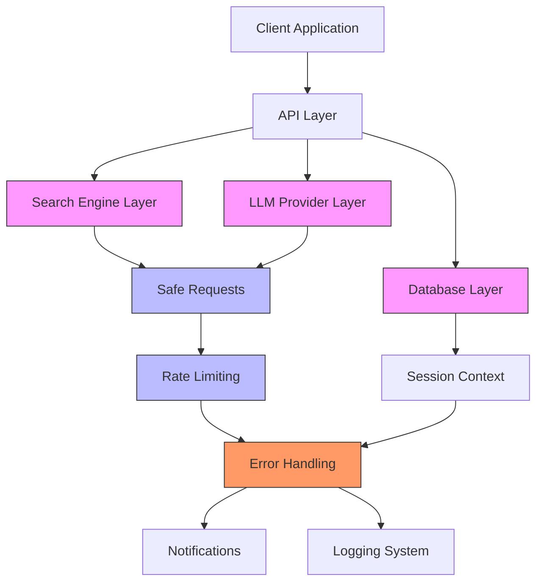
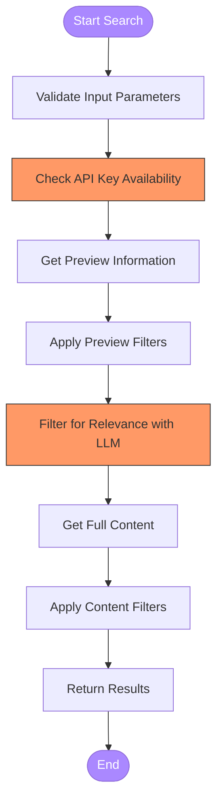
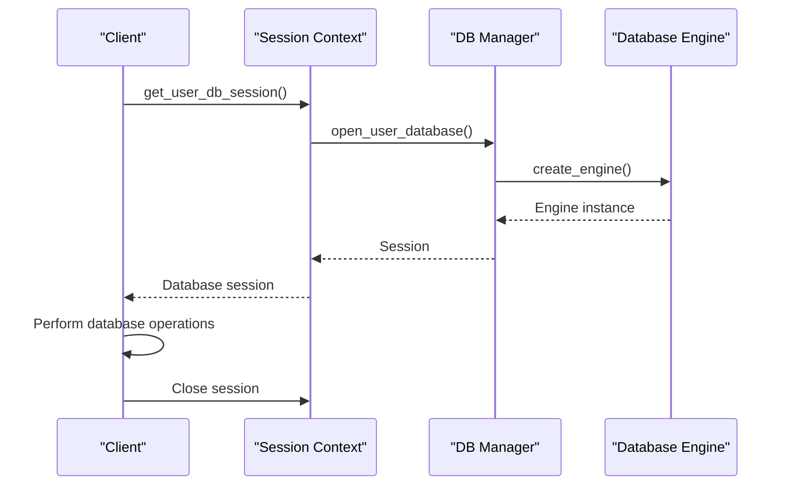
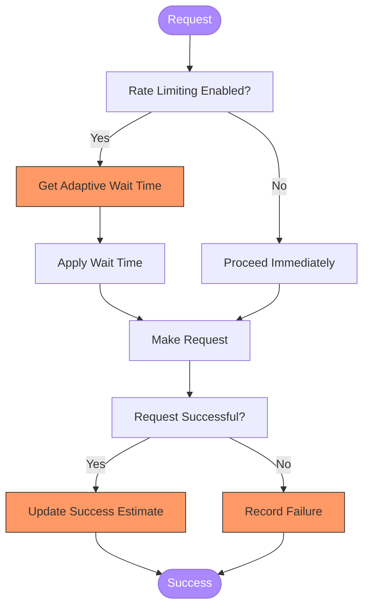
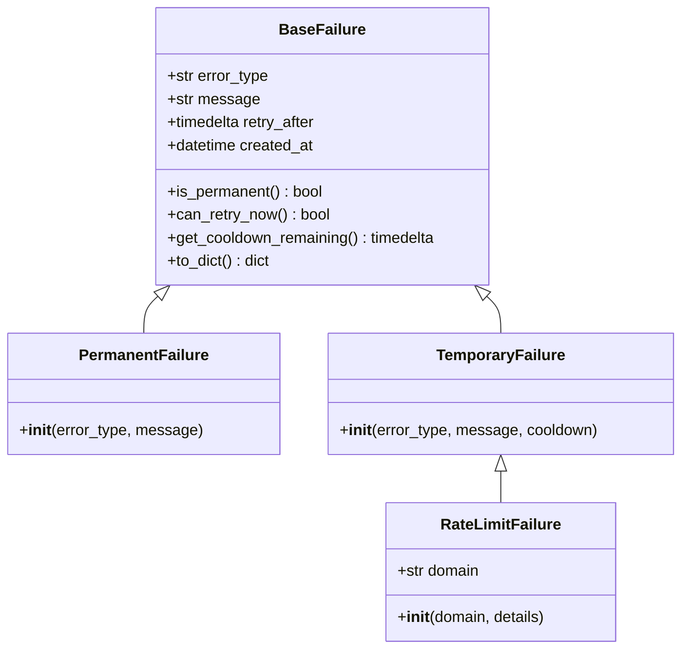
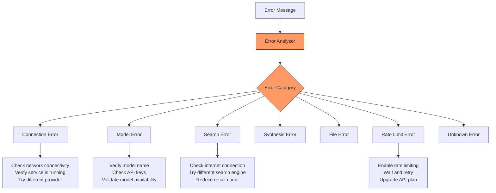
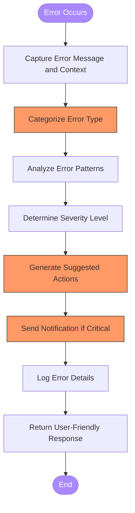
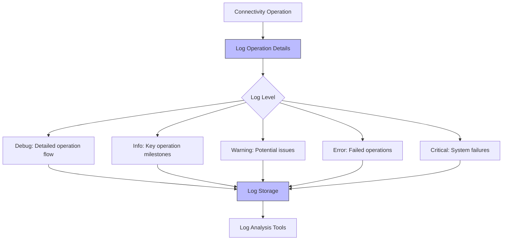
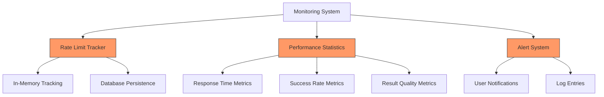

# Connectivity Issues

<cite>
**Referenced Files in This Document**   
- [search_engine_base.py](file://src/local_deep_research/web_search_engines/search_engine_base.py)
- [safe_requests.py](file://src/local_deep_research/security/safe_requests.py)
- [rate_limiter.py](file://src/local_deep_research/security/rate_limiter.py)
- [error_reporter.py](file://src/local_deep_research/error_handling/error_reporter.py)
- [tracker.py](file://src/local_deep_research/web_search_engines/rate_limiting/tracker.py)
- [failure_classifier.py](file://src/local_deep_research/library/download_management/failure_classifier.py)
- [session_context.py](file://src/local_deep_research/database/session_context.py)
- [default_search_engines.py](file://src/local_deep_research/web_search_engines/default_search_engines.py)
- [detection.py](file://src/local_deep_research/web_search_engines/rate_limiting/llm/detection.py)
</cite>

## Table of Contents
1. [Introduction](#introduction)
2. [External Service Connection Architecture](#external-service-connection-architecture)
3. [Common Connectivity Problems](#common-connectivity-problems)
4. [Connection Handling Patterns](#connection-handling-patterns)
5. [Retry Mechanisms and Rate Limiting](#retry-mechanisms-and-rate-limiting)
6. [Error Handling System Integration](#error-handling-system-integration)
7. [Diagnosing Network Issues](#diagnosing-network-issues)
8. [Troubleshooting Guide](#troubleshooting-guide)

## Introduction
This document provides comprehensive guidance on troubleshooting connectivity issues in the local-deep-research system. It covers implementation details of external service connections including search engines, LLM providers, and database services. The document explains common connectivity problems such as network timeouts, rate limiting, SSL/TLS errors, and proxy configuration issues, with concrete examples from the actual codebase. It details connection handling patterns, retry mechanisms, and the relationship between connectivity components and error handling systems. The content is designed to be accessible to beginners while providing sufficient technical depth for experienced developers.

## External Service Connection Architecture
The system implements a robust architecture for connecting to external services, with specific components for different service types including search engines, LLM providers, and databases. The architecture follows a layered approach with security, rate limiting, and error handling integrated at multiple levels.

**Diagram sources**
- [search_engine_base.py](file://src/local_deep_research/web_search_engines/search_engine_base.py)
- [safe_requests.py](file://src/local_deep_research/security/safe_requests.py)
- [error_reporter.py](file://src/local_deep_research/error_handling/error_reporter.py)

**Section sources**
- [search_engine_base.py](file://src/local_deep_research/web_search_engines/search_engine_base.py)
- [safe_requests.py](file://src/local_deep_research/security/safe_requests.py)
- [session_context.py](file://src/local_deep_research/database/session_context.py)

## Common Connectivity Problems
The system encounters various connectivity issues when interacting with external services. These problems are categorized and handled systematically to ensure reliability and provide meaningful feedback to users.

### Network Timeouts
Network timeouts occur when a connection to an external service takes longer than the configured timeout period. The system uses a default timeout of 30 seconds for HTTP requests, which can be overridden for specific services.

### Rate Limiting
Rate limiting issues arise when the system exceeds the allowed number of requests to an external service within a specific time period. The system implements adaptive rate limiting to automatically learn and respect API limits.

### SSL/TLS Errors
SSL/TLS errors occur when there are certificate validation issues or protocol mismatches when establishing secure connections to external services. The system uses standard Python SSL handling with appropriate verification.

### Proxy Configuration Issues
Proxy configuration problems happen when the system is behind a corporate firewall or proxy server that requires specific configuration to access external services. The system respects standard proxy environment variables.

### Failed Search Engine Queries
Search engine queries may fail due to various reasons including invalid queries, service unavailability, or authentication issues. The system implements fallback mechanisms and error categorization.

### Unreachable LLM Endpoints
LLM endpoints may be unreachable due to network issues, service downtime, or incorrect configuration. The system provides multiple LLM provider options and automatic failover capabilities.

### Database Connection Problems
Database connection issues can occur due to authentication failures, network problems, or database server unavailability. The system implements connection pooling and retry logic for database operations.

**Section sources**
- [safe_requests.py](file://src/local_deep_research/security/safe_requests.py)
- [error_reporter.py](file://src/local_deep_research/error_handling/error_reporter.py)
- [session_context.py](file://src/local_deep_research/database/session_context.py)

## Connection Handling Patterns
The system implements consistent patterns for handling connections to external services, ensuring reliability, security, and proper error handling across all service types.

### Search Engine Connections
Search engine connections follow a two-phase retrieval approach with preview filtering and full content retrieval. The BaseSearchEngine class provides a common interface for all search engines.

**Diagram sources**
- [search_engine_base.py](file://src/local_deep_research/web_search_engines/search_engine_base.py)

### LLM Provider Connections
LLM provider connections are managed through a provider registry system that supports multiple LLM services including OpenAI, Anthropic, and Ollama. Configuration is stored in the database with provider-specific settings.

### Database Connections
Database connections use a thread-local session pattern with encryption support. The system manages database sessions through context managers and decorators to ensure proper resource cleanup.

**Diagram sources**
- [session_context.py](file://src/local_deep_research/database/session_context.py)
- [encrypted_db.py](file://src/local_deep_research/database/encrypted_db.py)

**Section sources**
- [search_engine_base.py](file://src/local_deep_research/web_search_engines/search_engine_base.py)
- [session_context.py](file://src/local_deep_research/database/session_context.py)

## Retry Mechanisms and Rate Limiting
The system implements sophisticated retry mechanisms and adaptive rate limiting to handle transient failures and respect API limits of external services.

### Adaptive Rate Limiting
The adaptive rate limiting system learns optimal retry wait times for each search engine by analyzing past request outcomes. It uses an exponential moving average to update wait time estimates.

**Diagram sources**
- [tracker.py](file://src/local_deep_research/web_search_engines/rate_limiting/tracker.py)

### Retry Decision Logic
The retry system uses a classification approach to determine whether to retry failed requests based on the failure type and cooldown periods.

**Diagram sources**
- [failure_classifier.py](file://src/local_deep_research/library/download_management/failure_classifier.py)

### Domain-Specific Rate Limits
The system implements domain-specific cooldown periods for different services based on their known rate limiting behavior.

| Domain | Cooldown Period | Notes |
|--------|----------------|-------|
| arxiv.org | 6 hours | General arXiv rate limiting |
| pubmed.ncbi.nlm.nih.gov | 2 hours | PubMed rate limits |
| biorxiv.org | 6 hours | BioRxiv rate limits |
| semanticscholar.org | 4 hours | Semantic Scholar rate limits |
| researchgate.net | 12 hours | ResearchGate rate limits |
| default | 1 hour | Default for unknown domains |

**Section sources**
- [tracker.py](file://src/local_deep_research/web_search_engines/rate_limiting/tracker.py)
- [failure_classifier.py](file://src/local_deep_research/library/download_management/failure_classifier.py)

## Error Handling System Integration
The error handling system is tightly integrated with connectivity components to provide comprehensive error analysis, categorization, and user feedback.

### Error Categorization
The system categorizes errors into specific types to provide targeted solutions and recommendations.

**Diagram sources**
- [error_reporter.py](file://src/local_deep_research/error_handling/error_reporter.py)

### Error Analysis Process
The error analysis process follows a systematic approach to identify the root cause and provide actionable solutions.

**Diagram sources**
- [error_reporter.py](file://src/local_deep_research/error_handling/error_reporter.py)

**Section sources**
- [error_reporter.py](file://src/local_deep_research/error_handling/error_reporter.py)

## Diagnosing Network Issues
The system provides several tools and methods for diagnosing network connectivity issues using logging and monitoring tools.

### Logging System
The system uses structured logging with Loguru to capture detailed information about connectivity operations and errors.

**Diagram sources**
- [search_engine_base.py](file://src/local_deep_research/web_search_engines/search_engine_base.py)
- [safe_requests.py](file://src/local_deep_research/security/safe_requests.py)

### Monitoring Tools
The system includes monitoring tools to track connectivity performance and identify potential issues before they affect users.

**Diagram sources**
- [tracker.py](file://src/local_deep_research/web_search_engines/rate_limiting/tracker.py)

**Section sources**
- [tracker.py](file://src/local_deep_research/web_search_engines/rate_limiting/tracker.py)

## Troubleshooting Guide
This section provides practical guidance for diagnosing and resolving common connectivity issues.

### Connection Timeout Issues
When experiencing connection timeouts, follow these steps:

1. **Verify network connectivity** to the target service
2. **Check firewall and proxy settings** that might block the connection
3. **Test with a simple curl command** to isolate the issue
4. **Review system logs** for detailed error messages
5. **Adjust timeout settings** if appropriate for the service

### Rate Limiting Problems
For rate limiting issues, consider these solutions:

1. **Enable adaptive rate limiting** in Settings → Rate Limiting
2. **Check API usage quotas** for your service provider
3. **Implement request batching** to reduce API calls
4. **Use caching** to avoid redundant requests
5. **Consider upgrading** to a higher-tier API plan

### SSL/TLS Certificate Errors
To resolve SSL/TLS issues:

1. **Verify system time and date** are correct
2. **Check certificate validity** of the target service
3. **Update CA certificates** on your system
4. **Configure proxy settings** if behind a corporate firewall
5. **Contact service provider** if certificate issues persist

### Authentication Failures
For authentication problems:

1. **Verify API keys** are correctly configured
2. **Check key permissions** with the service provider
3. **Regenerate API keys** if compromised or expired
4. **Review service documentation** for authentication requirements
5. **Test with provider's test tools** to isolate the issue

### Database Connection Issues
When facing database problems:

1. **Verify database service** is running and accessible
2. **Check connection credentials** and encryption settings
3. **Review database logs** for specific error messages
4. **Test connection** with database client tools
5. **Restart database service** if necessary

**Section sources**
- [safe_requests.py](file://src/local_deep_research/security/safe_requests.py)
- [error_reporter.py](file://src/local_deep_research/error_handling/error_reporter.py)
- [session_context.py](file://src/local_deep_research/database/session_context.py)