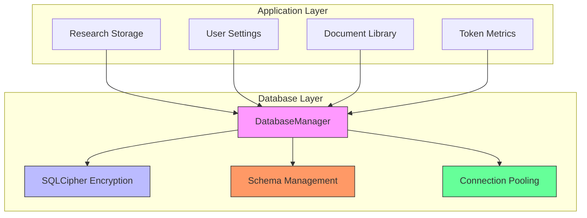
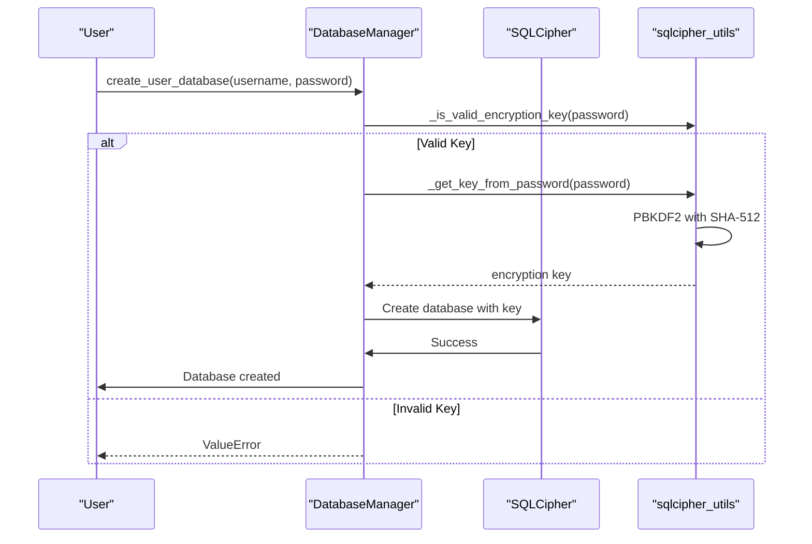
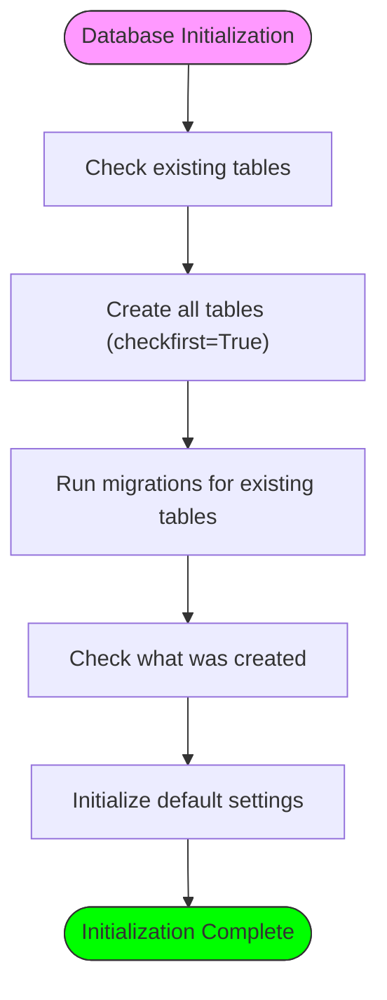
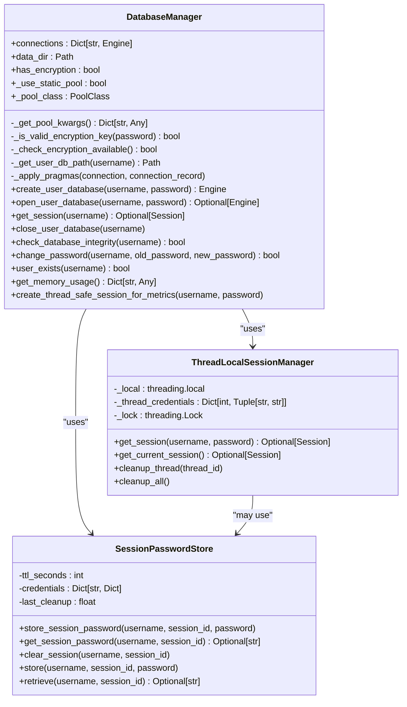
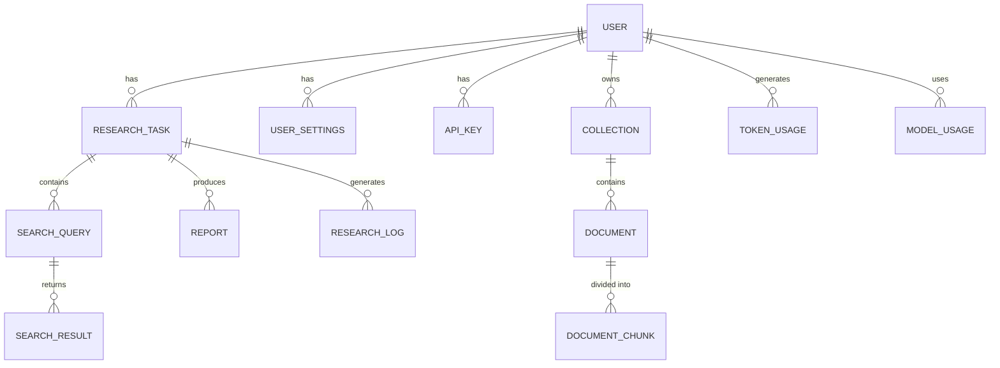

# Database Issues

<cite>
**Referenced Files in This Document**   
- [encrypted_db.py](file://src/local_deep_research/database/encrypted_db.py)
- [sqlcipher_utils.py](file://src/local_deep_research/database/sqlcipher_utils.py)
- [sqlcipher_compat.py](file://src/local_deep_research/database/sqlcipher_compat.py)
- [initialize.py](file://src/local_deep_research/database/initialize.py)
- [library_init.py](file://src/local_deep_research/database/library_init.py)
- [session_context.py](file://src/local_deep_research/database/session_context.py)
- [thread_local_session.py](file://src/local_deep_research/database/thread_local_session.py)
- [session_passwords.py](file://src/local_deep_research/database/session_passwords.py)
- [settings.py](file://src/local_deep_research/database/models/settings.py)
- [research.py](file://src/local_deep_research/database/models/research.py)
- [base.py](file://src/local_deep_research/database/models/base.py)
- [test_database_init.py](file://tests/database/test_database_init.py)
- [test_encrypted_database_orm.py](file://tests/database/test_encrypted_database_orm.py)
- [test_sqlcipher_missing.py](file://tests/database/test_sqlcipher_missing.py)
</cite>

## Table of Contents
1. [Introduction](#introduction)
2. [Database Architecture Overview](#database-architecture-overview)
3. [SQLCipher Encryption Implementation](#sqlcipher-encryption-implementation)
4. [Schema Management and Initialization](#schema-management-and-initialization)
5. [Connection Handling and Session Management](#connection-handling-and-session-management)
6. [Common Database Problems and Solutions](#common-database-problems-and-solutions)
7. [Database Recovery and Verification](#database-recovery-and-verification)
8. [Integration with Research Storage and User Settings](#integration-with-research-storage-and-user-settings)
9. [Troubleshooting Guide](#troubleshooting-guide)
10. [Conclusion](#conclusion)

## Introduction
This document provides comprehensive guidance on database troubleshooting for the Local Deep Research application. The system implements a sophisticated database architecture with SQLCipher encryption, per-user database isolation, and thread-safe connection handling. This documentation covers the implementation details of the database system, common problems users may encounter, and solutions for database recovery and verification. The content is designed to be accessible to beginners while providing sufficient technical depth for experienced developers to understand the underlying mechanisms and resolve complex issues.

**Section sources**
- [encrypted_db.py](file://src/local_deep_research/database/encrypted_db.py#L1-L621)
- [sqlcipher_utils.py](file://src/local_deep_research/database/sqlcipher_utils.py#L1-L267)

## Database Architecture Overview
The database system in Local Deep Research is designed with security, performance, and scalability in mind. Each user has their own encrypted SQLite database file, ensuring data isolation and privacy. The system uses SQLCipher for transparent encryption, protecting sensitive information such as API keys and research data. The architecture follows a multi-layered approach with distinct components for database management, encryption handling, connection pooling, and session context management.

**Diagram sources**
- [encrypted_db.py](file://src/local_deep_research/database/encrypted_db.py#L27-L621)
- [initialize.py](file://src/local_deep_research/database/initialize.py#L19-L63)

## SQLCipher Encryption Implementation
The database system implements SQLCipher encryption to protect user data at rest. The encryption is handled through a centralized utility system that ensures consistent key management and PRAGMA settings across all database operations. The implementation uses hexadecimal encoding for encryption keys to prevent SQL injection and escaping issues with special characters.

The encryption key is derived from the user's password using PBKDF2 with SHA-512, providing strong protection against brute force attacks. A placeholder salt is used for key stretching, while SQLCipher handles per-database salting internally. The system checks for SQLCipher availability during initialization and provides appropriate error messages if the library is not installed.

**Diagram sources**
- [encrypted_db.py](file://src/local_deep_research/database/encrypted_db.py#L179-L322)
- [sqlcipher_utils.py](file://src/local_deep_research/database/sqlcipher_utils.py#L15-L43)

## Schema Management and Initialization
The database schema is managed through SQLAlchemy ORM models organized by domain for better maintainability. The system uses a centralized initialization module that creates all tables defined in the models if they don't exist. This is a temporary solution until Alembic migrations are implemented for better version control and schema evolution.

The initialization process includes creating core tables, running migrations for existing tables, and initializing default settings from the defaults file. The system performs schema checks to verify the current database structure and identify missing tables. For the library system, the initialization includes seeding source types and ensuring the default "Library" collection exists.

**Diagram sources**
- [initialize.py](file://src/local_deep_research/database/initialize.py#L19-L63)
- [library_init.py](file://src/local_deep_research/database/library_init.py#L18-L151)

## Connection Handling and Session Management
The database system implements sophisticated connection handling to support concurrent access from multiple threads while maintaining security and performance. The DatabaseManager class manages encrypted SQLCipher databases for each user, with connections stored in a dictionary for reuse. The system uses different pool classes based on the environment, with StaticPool for testing to avoid locking issues and QueuePool for production.

Session management is handled through thread-local storage, where each thread gets its own database session that persists for the thread's lifetime. This approach avoids the expensive SQLCipher decryption on every database access. The system also implements a session password store that temporarily holds passwords in memory for the duration of a user's session, allowing background threads to access encrypted databases for metrics writing.

**Diagram sources**
- [encrypted_db.py](file://src/local_deep_research/database/encrypted_db.py#L27-L621)
- [thread_local_session.py](file://src/local_deep_research/database/thread_local_session.py#L14-L181)
- [session_passwords.py](file://src/local_deep_research/database/session_passwords.py#L23-L95)

## Common Database Problems and Solutions
The database system may encounter several common problems that can affect application functionality. Understanding these issues and their solutions is crucial for maintaining a stable and secure environment.

### Initialization Failures
Database initialization failures typically occur when SQLCipher is not properly installed or when there are permission issues with the data directory. The system checks for SQLCipher availability during initialization and provides detailed error messages if the library is not found. If SQLCipher is not available, the system can operate in unencrypted mode when the LDR_ALLOW_UNENCRYPTED environment variable is set to true, though this is not recommended for production use.

### Schema Migration Issues
Schema migration issues can arise when the database structure changes between application versions. The current system uses a simple migration approach that adds missing columns to existing tables but does not handle more complex schema changes. The TODO note in the code indicates that Alembic migrations will be implemented in the future for better version control and schema evolution.

### Connection Pooling Errors
Connection pooling errors may occur in high-concurrency scenarios or when background threads attempt to access the database. The system uses QueuePool with a pool size of 10 and max overflow of 30 to handle concurrent connections. For background threads writing metrics, the system uses NullPool to avoid connection pooling issues.

### Corrupted Databases
Database corruption can occur due to improper shutdowns or disk errors. The system provides integrity checking through the PRAGMA quick_check and PRAGMA cipher_integrity_check commands. If integrity checks fail, the database may be corrupted and require recovery from backup.

### Missing Tables
Missing tables can occur if the database initialization process is interrupted or if the schema changes are not properly applied. The system checks for missing tables during initialization and attempts to create them. The check_database_schema function returns information about tables and their columns, helping identify missing components.

### Encryption Key Problems
Encryption key problems typically manifest as authentication failures when opening encrypted databases. These issues can occur when the password is not properly passed from the main thread to background threads or when the password is changed without updating all references. The system includes debug logging to help identify these issues, with TODO notes indicating areas where password propagation needs to be fixed.

**Section sources**
- [encrypted_db.py](file://src/local_deep_research/database/encrypted_db.py#L36-L140)
- [initialize.py](file://src/local_deep_research/database/initialize.py#L98-L130)
- [test_sqlcipher_missing.py](file://tests/database/test_sqlcipher_missing.py#L1-L109)

## Database Recovery and Verification
The system provides several mechanisms for database recovery and verification to ensure data integrity and availability.

### Integrity Checking
The DatabaseManager class includes a check_database_integrity method that performs both a quick integrity check and a SQLCipher-specific integrity check. The quick check verifies the overall database structure, while the cipher_integrity_check verifies the HMAC of encrypted pages. If either check fails, the method returns false, indicating potential corruption.

### Password Change and Recovery
The system allows users to change their database encryption password through the change_password method. This process involves closing the existing connection, opening the database with the old password, rekeying the database with the new password, and then closing the connection. This ensures that the database remains encrypted throughout the process.

### Schema Verification
The check_database_schema function provides detailed information about the current database schema, including which tables exist and their columns. This function helps verify that the database structure matches the expected model definitions and can identify missing tables or columns.

### Backup and Restore
While not explicitly implemented in the provided code, the per-user database architecture facilitates backup and restore operations. Each user's data is contained in a single encrypted database file, making it easy to back up or restore individual user data. Regular backups should be performed to prevent data loss in case of corruption or hardware failure.

**Section sources**
- [encrypted_db.py](file://src/local_deep_research/database/encrypted_db.py#L452-L478)
- [initialize.py](file://src/local_deep_research/database/initialize.py#L98-L130)

## Integration with Research Storage and User Settings
The database system is tightly integrated with various application components, particularly research storage and user settings.

### Research Storage Integration
The research storage system uses the database to store research tasks, search queries, search results, reports, and related metadata. The ResearchTask model serves as the top-level object for research activities, with relationships to SearchQuery, SearchResult, and Report objects. This structure enables comprehensive tracking of the research process from initial queries to final reports.

### User Settings Integration
User settings are stored in the encrypted database, ensuring that sensitive configuration data is protected. The UserSettings model stores key-value pairs with categories and descriptions, while the APIKey model securely stores API credentials. The SettingsManager class handles loading default settings from files and synchronizing them with the database, ensuring consistent configuration across sessions.

### Library System Integration
The document library system uses the database to manage collections, documents, and download tracking. The unified document architecture includes models for SourceType, Collection, Document, and DocumentCollection, enabling flexible organization of research materials. The system seeds predefined source types and ensures the default "Library" collection exists for each user.

### Metrics and Logging Integration
The metrics system writes token usage, model usage, and search metrics to the database through thread-safe sessions. The create_thread_safe_session_for_metrics method creates sessions specifically for metrics operations, ensuring that background threads can write metrics without interfering with user data operations. Research logs are also stored in the database, providing a complete audit trail of research activities.

**Diagram sources**
- [settings.py](file://src/local_deep_research/database/models/settings.py#L24-L109)
- [research.py](file://src/local_deep_research/database/models/research.py#L24-L200)
- [base.py](file://src/local_deep_research/database/models/base.py#L7-L8)

## Troubleshooting Guide
This section provides practical guidance for diagnosing and resolving common database issues.

### SQLCipher Installation Issues
If SQLCipher is not installed, the system will display a security error message with instructions for installation. To resolve this issue:
1. Install SQLCipher system libraries: `sudo apt install sqlcipher libsqlcipher-dev`
2. Reinstall the project dependencies: `pdm install`
3. Alternatively, use Docker with SQLCipher pre-installed

If you must run without encryption (not recommended), set the environment variable: `export LDR_ALLOW_UNENCRYPTED=true`

### Database Initialization Problems
If database initialization fails:
1. Verify that the data directory is writable
2. Check that SQLCipher is properly installed
3. Ensure the user has sufficient permissions
4. Review the logs for specific error messages
5. Try running the application with elevated privileges if necessary

### Connection and Session Issues
For connection and session problems:
1. Verify that the database manager has a valid connection for the user
2. Check that passwords are properly propagated to background threads
3. Ensure that thread-local sessions are properly cleaned up
4. Monitor memory usage, as each connection consumes approximately 3.5MB
5. Consider reducing the pool size if memory is constrained

### Data Corruption Recovery
If database corruption is suspected:
1. Run the integrity check: `PRAGMA quick_check` and `PRAGMA cipher_integrity_check`
2. If integrity checks fail, restore from the most recent backup
3. If no backup is available, attempt to export data using SQLite tools
4. Recreate the database and re-import recovered data
5. Implement regular backup procedures to prevent future data loss

### Performance Optimization
To optimize database performance:
1. Ensure proper indexing on frequently queried fields
2. Configure PRAGMA settings for optimal performance
3. Use connection pooling appropriately for the workload
4. Monitor query performance and optimize slow queries
5. Consider partitioning large tables if they grow significantly

**Section sources**
- [encrypted_db.py](file://src/local_deep_research/database/encrypted_db.py#L36-L140)
- [session_context.py](file://src/local_deep_research/database/session_context.py#L28-L135)
- [test_database_init.py](file://tests/database/test_database_init.py#L1-L494)

## Conclusion
The database system in Local Deep Research provides a robust foundation for secure and scalable data storage. With SQLCipher encryption, per-user database isolation, and sophisticated connection management, the system protects sensitive information while supporting concurrent access from multiple components. Understanding the implementation details, common problems, and troubleshooting techniques is essential for maintaining a reliable and secure environment. As the system evolves, the planned migration to Alembic will provide better schema version control and more sophisticated migration capabilities. Regular monitoring, backup procedures, and proactive issue resolution will ensure the database continues to meet the needs of users and developers alike.