# Performance Issues

<cite>
**Referenced Files in This Document**   
- [token_counter.py](file://src/local_deep_research/metrics/token_counter.py)
- [search_tracker.py](file://src/local_deep_research/metrics/search_tracker.py)
- [search_system.py](file://src/local_deep_research/search_system.py)
- [cost_calculator.py](file://src/local_deep_research/metrics/pricing/cost_calculator.py)
- [adaptive_tracker.py](file://src/local_deep_research/web_search_engines/rate_limiting/adaptive_tracker.py)
- [rate_limiter.py](file://src/local_deep_research/security/rate_limiter.py)
- [search_cache.py](file://src/local_deep_research/utilities/search_cache.py)
- [analytics-dashboard.md](file://docs/analytics-dashboard.md)
- [BENCHMARKING.md](file://docs/BENCHMARKING.md)
- [benchmark.html](file://src/local_deep_research/web/templates/pages/benchmark.html)
- [detail.js](file://src/local_deep_research/web/static/js/components/detail.js)
- [details.js](file://src/local_deep_research/web/static/js/components/details.js)
</cite>

## Table of Contents
1. [Introduction](#introduction)
2. [Performance Monitoring System](#performance-monitoring-system)
3. [Resource Utilization Tracking](#resource-utilization-tracking)
4. [Response Time Analysis](#response-time-analysis)
5. [Search Engine Performance](#search-engine-performance)
6. [LLM Call Efficiency](#llm-call-efficiency)
7. [Rate Limiting and Error Handling](#rate-limiting-and-error-handling)
8. [Analytics Dashboard](#analytics-dashboard)
9. [Benchmarking and Optimization](#benchmarking-and-optimization)
10. [Common Performance Issues and Solutions](#common-performance-issues-and-solutions)
11. [Conclusion](#conclusion)

## Introduction

The Local Deep Research system incorporates comprehensive performance monitoring to track and optimize research workflows. This documentation details the implementation of performance tracking, including resource utilization, response time analysis, and efficiency metrics. The system monitors the relationship between LLM calls, search engine queries, and overall research duration to identify bottlenecks and optimize performance. The analytics dashboard and benchmarking tools provide insights to help users identify and resolve performance issues, making the system accessible to beginners while offering technical depth for experienced developers.

## Performance Monitoring System

The performance monitoring system in Local Deep Research consists of multiple components that track different aspects of the research workflow. The system captures metrics from LLM interactions, search engine queries, and overall research sessions to provide a comprehensive view of performance.

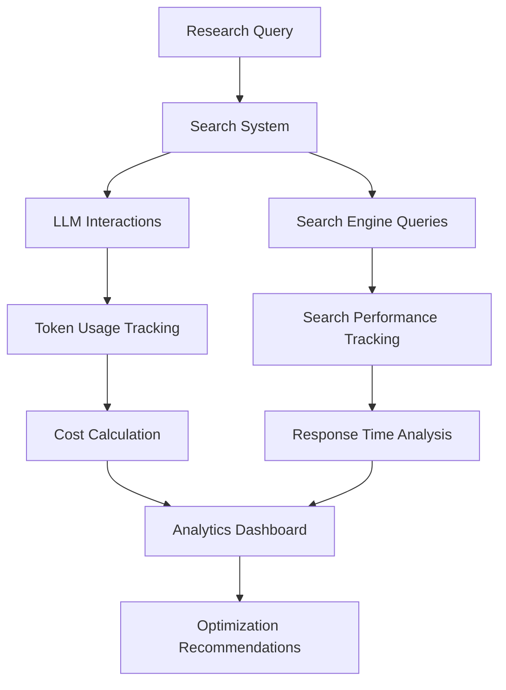

**Diagram sources**
- [search_system.py](file://src/local_deep_research/search_system.py)
- [token_counter.py](file://src/local_deep_research/metrics/token_counter.py)
- [search_tracker.py](file://src/local_deep_research/metrics/search_tracker.py)

**Section sources**
- [search_system.py](file://src/local_deep_research/search_system.py)
- [token_counter.py](file://src/local_deep_research/metrics/token_counter.py)
- [search_tracker.py](file://src/local_deep_research/metrics/search_tracker.py)

## Resource Utilization Tracking

The system tracks resource utilization through detailed metrics collection for both LLM interactions and search engine usage. The token counter component monitors LLM token usage, while the search tracker records search engine performance.

### Token Usage Monitoring

The TokenCountingCallback class captures detailed metrics about LLM interactions, including prompt and completion tokens, response times, and success rates. This information is used to calculate costs and identify inefficient patterns.

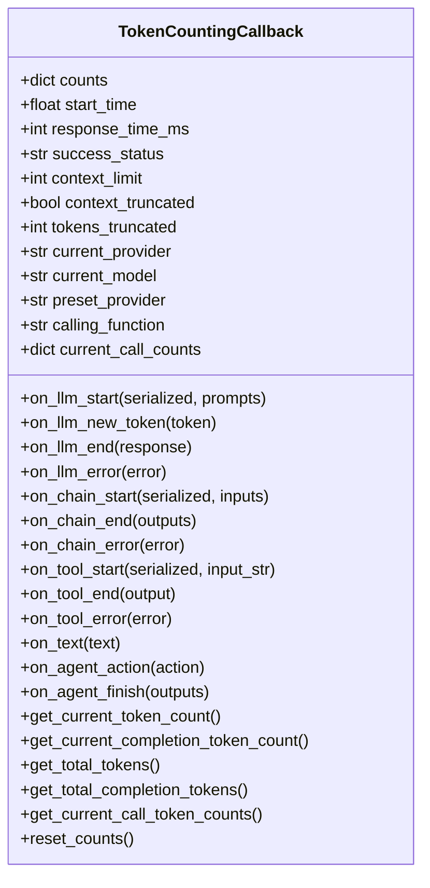

**Diagram sources**
- [token_counter.py](file://src/local_deep_research/metrics/token_counter.py)

### Search Engine Resource Tracking

The SearchTracker class monitors search engine usage, recording metrics such as response times, success rates, and results count. This data helps identify underperforming search engines and optimize search strategies.

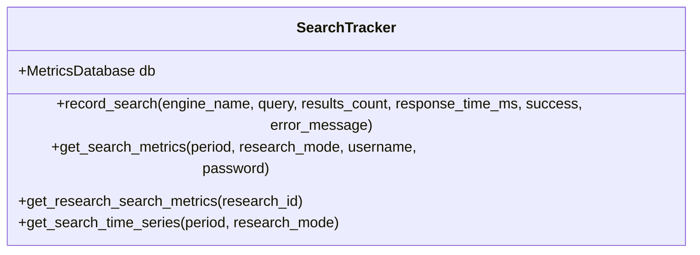

**Diagram sources**
- [search_tracker.py](file://src/local_deep_research/metrics/search_tracker.py)

**Section sources**
- [token_counter.py](file://src/local_deep_research/metrics/token_counter.py)
- [search_tracker.py](file://src/local_deep_research/metrics/search_tracker.py)

## Response Time Analysis

The system analyzes response times at multiple levels, from individual LLM calls to complete research sessions. This analysis helps identify bottlenecks and optimize the research workflow.

### LLM Response Time Tracking

The token counter captures response times for each LLM call, allowing for detailed analysis of model performance. The response time is calculated from the start of the LLM call to its completion.

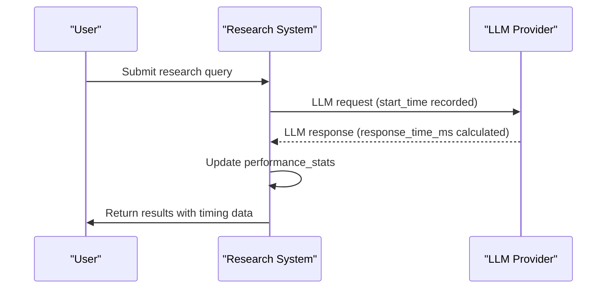

**Diagram sources**
- [token_counter.py](file://src/local_deep_research/metrics/token_counter.py)

### Search Engine Response Analysis

Search engine response times are tracked and analyzed to identify slow-performing engines and optimize search strategies. The system records the response time for each search query and aggregates this data for performance analysis.

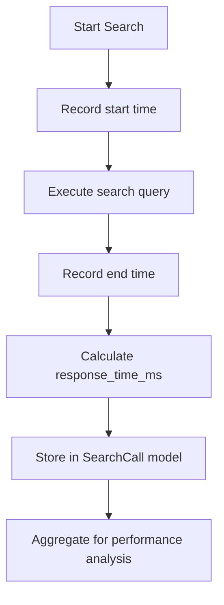

**Diagram sources**
- [search_tracker.py](file://src/local_deep_research/metrics/search_tracker.py)

**Section sources**
- [token_counter.py](file://src/local_deep_research/metrics/token_counter.py#L1446-L1455)
- [search_tracker.py](file://src/local_deep_research/metrics/search_tracker.py#L240-L241)

## Search Engine Performance

The system monitors search engine performance through detailed metrics collection and analysis. This includes tracking success rates, response times, and results count for each search engine.

### Search Engine Metrics

The get_search_metrics method in the SearchTracker class returns comprehensive statistics about search engine performance, including call count, average response time, total results, and success rate.

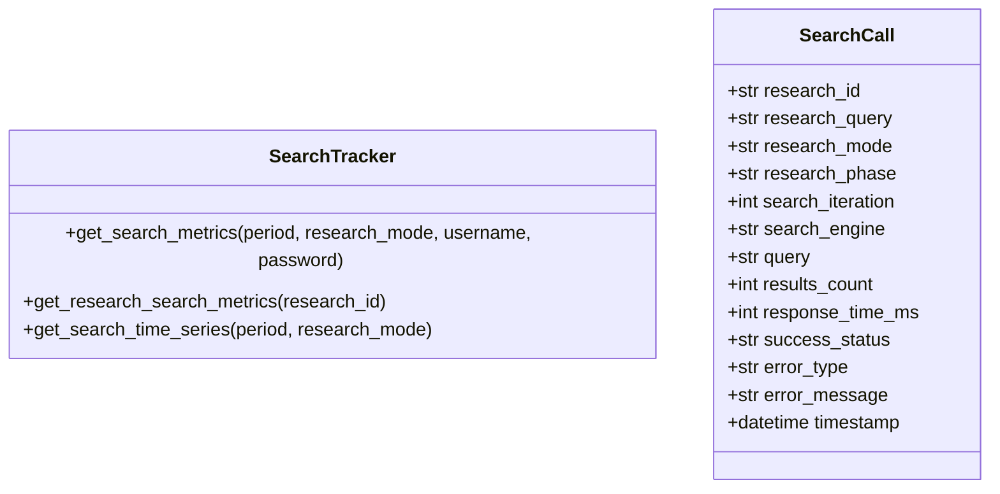

**Diagram sources**
- [search_tracker.py](file://src/local_deep_research/metrics/search_tracker.py)
- [database/models.py](file://src/local_deep_research/database/models.py)

### Search Engine Comparison

The system allows for comparison of different search engines based on performance metrics. This helps users identify the most effective search engines for their research needs.

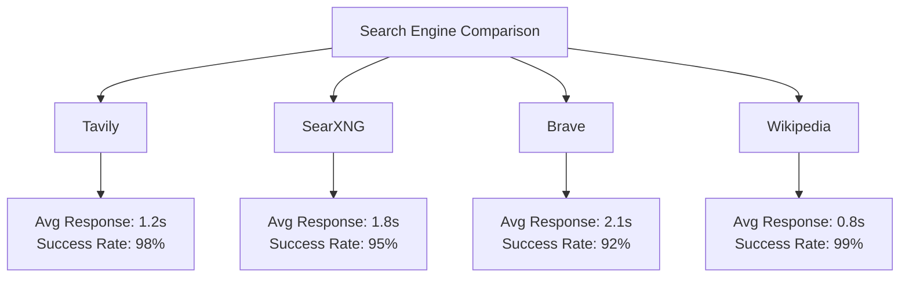

**Section sources**
- [search_tracker.py](file://src/local_deep_research/metrics/search_tracker.py)
- [web/templates/pages/benchmark.html](file://src/local_deep_research/web/templates/pages/benchmark.html)

## LLM Call Efficiency

The system tracks LLM call efficiency through detailed token usage analysis and cost calculation. This helps users optimize their LLM usage and reduce costs.

### Token Efficiency Analysis

The token counter tracks both prompt and completion tokens for each LLM call, allowing for analysis of token efficiency. The system calculates average token usage by model and function to identify optimization opportunities.

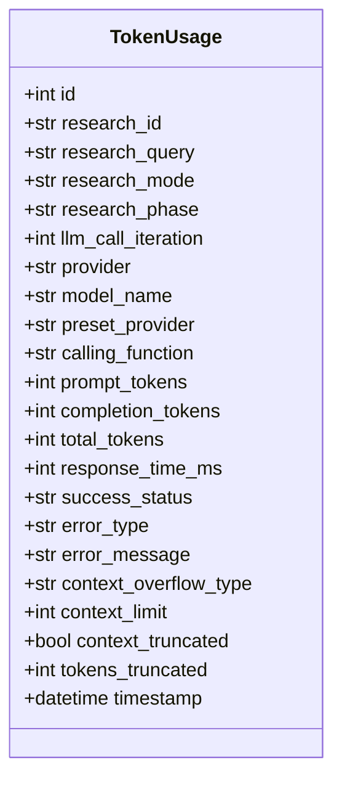

**Diagram sources**
- [database/models.py](file://src/local_deep_research/database/models.py)

### Cost Calculation

The CostCalculator class calculates the cost of LLM usage based on token counts and provider pricing. This allows users to understand the financial implications of their research activities.

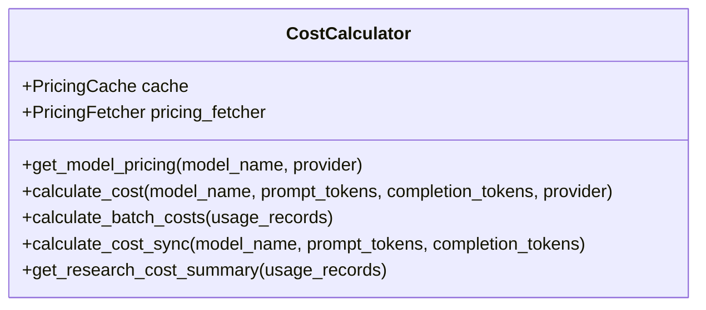

**Diagram sources**
- [cost_calculator.py](file://src/local_deep_research/metrics/pricing/cost_calculator.py)

**Section sources**
- [token_counter.py](file://src/local_deep_research/metrics/token_counter.py)
- [cost_calculator.py](file://src/local_deep_research/metrics/pricing/cost_calculator.py)

## Rate Limiting and Error Handling

The system implements comprehensive rate limiting and error handling to ensure reliable operation and prevent abuse.

### Adaptive Rate Limiting

The adaptive rate limiter monitors search engine rate limits and adjusts wait times accordingly. The system learns from past interactions to optimize wait times and maximize success rates.

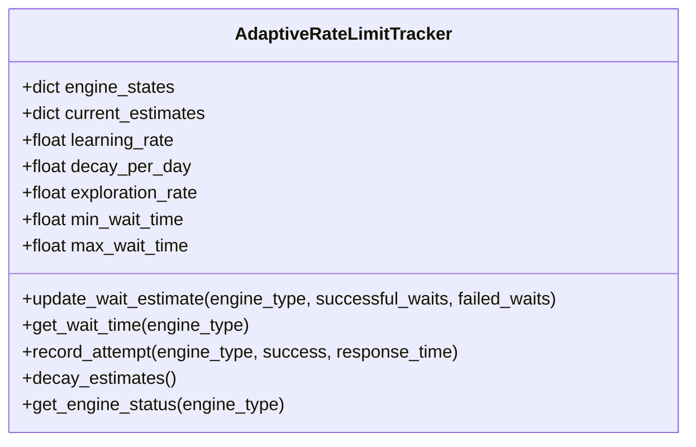

**Diagram sources**
- [adaptive_tracker.py](file://src/local_deep_research/web_search_engines/rate_limiting/adaptive_tracker.py)

### Error Rate Monitoring

The system tracks error rates for both LLM calls and search engine queries. This information is used to identify problematic components and optimize the research workflow.

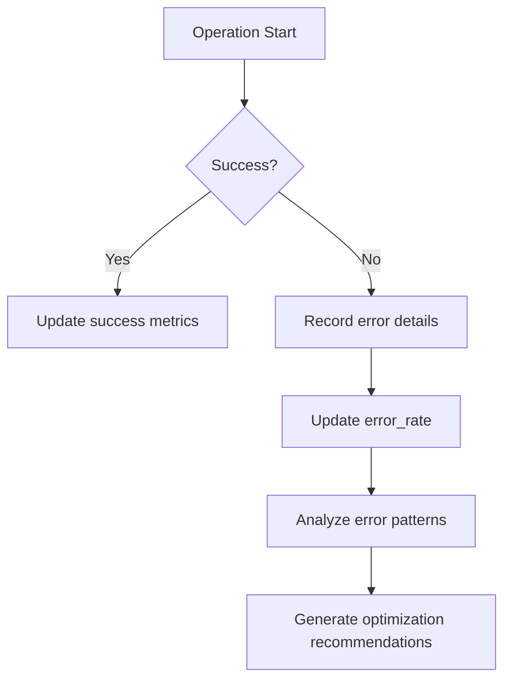

**Section sources**
- [token_counter.py](file://src/local_deep_research/metrics/token_counter.py#L1546-L1565)
- [search_tracker.py](file://src/local_deep_research/metrics/search_tracker.py#L164-L171)

## Analytics Dashboard

The analytics dashboard provides a comprehensive view of system performance and resource utilization. It visualizes key metrics to help users identify trends and optimize their research workflows.

### Dashboard Components

The dashboard includes multiple components that display different aspects of system performance:

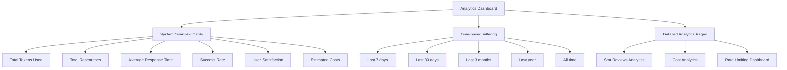

**Diagram sources**
- [analytics-dashboard.md](file://docs/analytics-dashboard.md)

### Real-time Monitoring

The dashboard provides real-time monitoring of system performance, including search engine health status and rate limiting status.

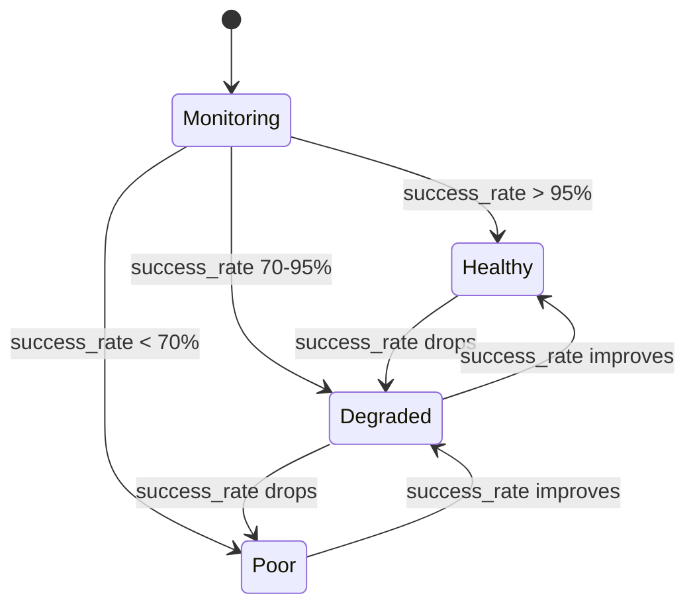

**Section sources**
- [analytics-dashboard.md](file://docs/analytics-dashboard.md#L76-L79)
- [detail.js](file://src/local_deep_research/web/static/js/components/detail.js)

## Benchmarking and Optimization

The system includes benchmarking tools to evaluate and optimize performance across different configurations.

### Benchmarking Framework

The benchmarking framework allows users to evaluate system performance on standardized datasets, such as SimpleQA and BrowseComp.

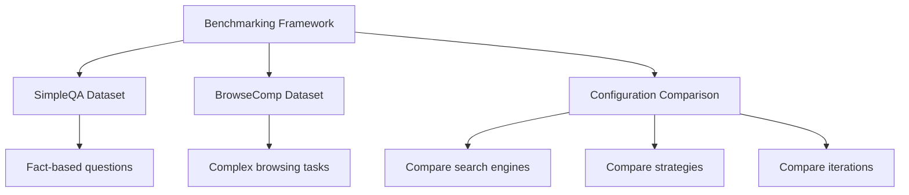

**Diagram sources**
- [BENCHMARKING.md](file://docs/BENCHMARKING.md)

### Optimization Strategies

The system supports various optimization strategies to improve performance and efficiency:

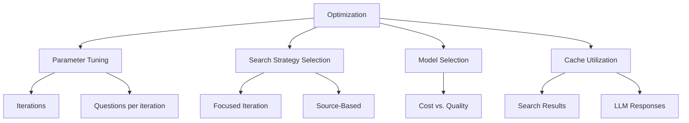

**Section sources**
- [BENCHMARKING.md](file://docs/BENCHMARKING.md)
- [analytics-dashboard.md](file://docs/analytics-dashboard.md#L190-L205)

## Common Performance Issues and Solutions

This section addresses common performance issues and provides solutions to resolve them.

### Slow Response Times

Slow response times can be caused by various factors, including slow search engines, inefficient LLM calls, or network issues.

**Solutions:**
- Switch to faster search engines (e.g., Wikipedia for simple queries)
- Reduce the number of iterations and questions per iteration
- Use caching to avoid redundant searches
- Optimize LLM prompts to reduce token usage

**Section sources**
- [analytics-dashboard.md](file://docs/analytics-dashboard.md#L29-L30)
- [detail.js](file://src/local_deep_research/web/static/js/components/detail.js#L240-L251)

### High Memory Usage

High memory usage can occur during complex research tasks with large context windows.

**Solutions:**
- Enable context overflow detection and truncation
- Use smaller models for less complex tasks
- Implement efficient data structures for result storage
- Optimize the search strategy to reduce unnecessary data retrieval

**Section sources**
- [token_counter.py](file://src/local_deep_research/metrics/token_counter.py#L51-L57)
- [search_system.py](file://src/local_deep_research/search_system.py#L37-L40)

### Rate Limiting Issues

Rate limiting can cause search failures and slow down research workflows.

**Solutions:**
- Implement adaptive rate limiting with appropriate wait times
- Use multiple search engines to distribute load
- Monitor rate limit status and adjust search frequency
- Implement retry logic with exponential backoff

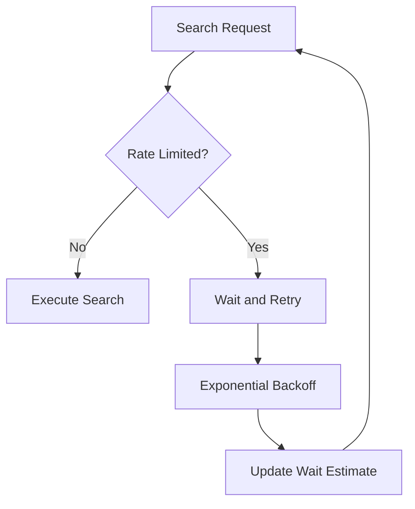

**Section sources**
- [adaptive_tracker.py](file://src/local_deep_research/web_search_engines/rate_limiting/adaptive_tracker.py)
- [rate_limiter.py](file://src/local_deep_research/security/rate_limiter.py)

### Inefficient LLM Usage

Inefficient LLM usage can lead to high costs and slow performance.

**Solutions:**
- Monitor token usage and optimize prompts
- Use cost-effective models for appropriate tasks
- Implement caching for common queries
- Analyze cost-to-quality ratio for different models

**Section sources**
- [cost_calculator.py](file://src/local_deep_research/metrics/pricing/cost_calculator.py)
- [token_counter.py](file://src/local_deep_research/metrics/token_counter.py)

## Conclusion

The Local Deep Research system provides comprehensive performance monitoring and optimization capabilities. By tracking resource utilization, response times, and efficiency metrics, the system helps users identify and resolve performance issues. The analytics dashboard and benchmarking tools offer valuable insights for optimizing research workflows. Understanding the relationships between LLM calls, search engine queries, and overall research duration is key to improving system performance. By addressing common issues like slow response times, high memory usage, and rate limiting, users can achieve more efficient and effective research outcomes.