# Security Issues

<cite>
**Referenced Files in This Document**   
- [encrypted_db.py](file://src/local_deep_research/database/encrypted_db.py)
- [sqlcipher_utils.py](file://src/local_deep_research/database/sqlcipher_utils.py)
- [sqlcipher_compat.py](file://src/local_deep_research/database/sqlcipher_compat.py)
- [SECURITY_REVIEW_PROCESS.md](file://docs/SECURITY_REVIEW_PROCESS.md)
- [SQLCIPHER_INSTALL.md](file://docs/SQLCIPHER_INSTALL.md)
- [CODEQL_GUIDE.md](file://docs/security/CODEQL_GUIDE.md)
- [analyze_sarif.sh](file://docs/security/analyze_sarif.sh)
- [analyze_sarif.ps1](file://docs/security/analyze_sarif.ps1)
- [data_sanitizer.py](file://src/local_deep_research/security/data_sanitizer.py)
- [path_validator.py](file://src/local_deep_research/security/path_validator.py)
- [url_validator.py](file://src/local_deep_research/security/url_validator.py)
- [ssrf_validator.py](file://src/local_deep_research/security/ssrf_validator.py)
- [security_headers.py](file://src/local_deep_research/security/security_headers.py)
- [rate_limiter.py](file://src/local_deep_research/security/rate_limiter.py)
</cite>

## Table of Contents
1. [Introduction](#introduction)
2. [SQLCipher Database Encryption](#sqlcipher-database-encryption)
3. [Authentication and Session Security](#authentication-and-session-security)
4. [Input Validation and Sanitization](#input-validation-and-sanitization)
5. [Common Security Issues and Solutions](#common-security-issues-and-solutions)
6. [Security Analysis with CODEQL](#security-analysis-with-codeql)
7. [Security Component Relationships](#security-component-relationships)
8. [Troubleshooting Guide](#troubleshooting-guide)
9. [Conclusion](#conclusion)

## Introduction
This document provides comprehensive guidance on security troubleshooting for the Local Deep Research application. It covers the implementation details of the security model, including SQLCipher encryption, authentication mechanisms, and input validation. The document addresses common security-related issues such as database encryption errors, authentication failures, and permission problems, with concrete examples from the codebase. It also explains how to use the CODEQL guide for security analysis and interpret security scan results. The content is designed to be accessible to beginners while providing sufficient technical depth for experienced developers.

## SQLCipher Database Encryption

The Local Deep Research application uses SQLCipher to provide encrypted databases for each user, ensuring that all user data, including API keys and research results, are encrypted at rest. The encryption system is implemented across multiple components that work together to provide secure database operations.

The database encryption architecture follows a layered approach where the `DatabaseManager` class in `encrypted_db.py` serves as the central component for managing encrypted SQLCipher databases for each user. This class handles the creation, opening, and management of per-user encrypted databases with browser-friendly authentication.

The encryption process begins with the `get_sqlcipher_module()` function in `sqlcipher_compat.py`, which provides a unified interface for importing SQLCipher on different platforms:
- x86_64 Linux: Uses `sqlcipher3-binary` (pre-compiled wheel)
- ARM64 Linux: Uses `sqlcipher3` (builds from source)
- Other platforms: Uses `sqlcipher3`

This compatibility layer ensures that the application can work across different operating systems while maintaining consistent encryption behavior. The actual encryption key management is handled by the `sqlcipher_utils.py` module, which centralizes all SQLCipher-specific operations to ensure consistent password handling and PRAGMA settings across the codebase.

```mermaid
classDiagram
class DatabaseManager {
+connections : Dict[str, Engine]
+data_dir : Path
+has_encryption : bool
+_use_static_pool : bool
+__init__()
+_check_encryption_available() bool
+create_user_database(username, password) Engine
+open_user_database(username, password) Optional[Engine]
+get_session(username) Optional[Session]
+close_user_database(username) void
+check_database_integrity(username) bool
+change_password(username, old_password, new_password) bool
}
class SQLCipherUtils {
+DEFAULT_KDF_ITERATIONS : int
+DEFAULT_PAGE_SIZE : int
+DEFAULT_HMAC_ALGORITHM : str
+DEFAULT_KDF_ALGORITHM : str
+PBKDF2_PLACEHOLDER_SALT : bytes
+get_sqlcipher_settings(username) dict
+set_sqlcipher_key(cursor_or_conn, password) void
+set_sqlcipher_rekey(cursor_or_conn, new_password) void
+apply_sqlcipher_pragmas(cursor_or_conn, creation_mode, username) void
+apply_performance_pragmas(cursor_or_conn, username) void
+verify_sqlcipher_connection(cursor_or_conn) bool
+create_sqlcipher_connection(db_path, password) Any
}
class SQLCipherCompat {
+get_sqlcipher_module() module
}
DatabaseManager --> SQLCipherUtils : "uses"
DatabaseManager --> SQLCipherCompat : "uses"
SQLCipherUtils ..> "sqlcipher3" : "depends on"
SQLCipherCompat ..> "sqlcipher3" : "depends on"
```

**Diagram sources**
- [encrypted_db.py](file://src/local_deep_research/database/encrypted_db.py#L27-L621)
- [sqlcipher_utils.py](file://src/local_deep_research/database/sqlcipher_utils.py#L1-L267)
- [sqlcipher_compat.py](file://src/local_deep_research/database/sqlcipher_compat.py#L1-L33)

**Section sources**
- [encrypted_db.py](file://src/local_deep_research/database/encrypted_db.py#L1-L621)
- [sqlcipher_utils.py](file://src/local_deep_research/database/sqlcipher_utils.py#L1-L267)
- [sqlcipher_compat.py](file://src/local_deep_research/database/sqlcipher_compat.py#L1-L33)

## Authentication and Session Security

The authentication system in Local Deep Research is designed to provide secure user access while maintaining usability. The system is implemented across multiple components that handle user authentication, session management, and security validation.

The core authentication functionality is managed by the web authentication module in the `web/auth/` directory, which includes components for session management, middleware, and route protection. The system uses encrypted databases to store user credentials securely, with each user's database encrypted using their password as the encryption key.

Key security features of the authentication system include:
- Password-based database encryption where each user's database is encrypted with their password
- No password recovery mechanism to prevent unauthorized access to encrypted data
- Secure session handling with proper cleanup mechanisms
- Protection against privilege escalation and authentication bypasses

The system follows a zero-trust approach where every database access requires the user's password, which serves as the encryption key. This design ensures that even if an attacker gains access to the database files, they cannot read the data without the user's password.


**Diagram sources**
- [encrypted_db.py](file://src/local_deep_research/database/encrypted_db.py#L27-L621)
- [web/auth/routes.py](file://src/local_deep_research/web/auth/routes.py)
- [web/auth/session_manager.py](file://src/local_deep_research/web/auth/session_manager.py)

**Section sources**
- [encrypted_db.py](file://src/local_deep_research/database/encrypted_db.py#L27-L621)
- [web/auth/](file://src/local_deep_research/web/auth/)

## Input Validation and Sanitization

The Local Deep Research application implements comprehensive input validation and sanitization to protect against various security threats. The security module contains multiple validators that handle different types of input and potential attack vectors.

The input validation system is organized into specialized components, each responsible for validating specific types of input:
- `data_sanitizer.py`: Handles general data sanitization
- `path_validator.py`: Validates file paths to prevent directory traversal attacks
- `url_validator.py`: Validates URLs and prevents malicious redirects
- `ssrf_validator.py`: Protects against Server-Side Request Forgery attacks
- `notification_validator.py`: Validates notification content
- `file_upload_validator.py`: Validates uploaded files

These validators work together to create a defense-in-depth approach to input validation. Each validator implements specific checks relevant to its domain, such as ensuring URLs use allowed schemes, validating file extensions, and checking path components for dangerous patterns.

```mermaid
classDiagram
class DataSanitizer {
+sanitize_input(input) str
+sanitize_html(html) str
+remove_dangerous_attributes(html) str
}
class PathValidator {
+validate_path(path) bool
+is_safe_path_component(component) bool
+check_for_directory_traversal(path) bool
}
class URLValidator {
+validate_url(url) bool
+is_allowed_scheme(url) bool
+check_for_open_redirect(url) bool
}
class SSRFValidator {
+validate_target(target) bool
+is_internal_address(target) bool
+check_blacklisted_hosts(target) bool
}
class NotificationValidator {
+validate_notification(notification) bool
+check_for_xss_content(content) bool
}
class FileUploadValidator {
+validate_file(file) bool
+check_file_extension(filename) bool
+validate_file_size(file) bool
}
class SecurityHeaders {
+get_security_headers() dict
+add_csp_headers(headers) dict
+add_hsts_headers(headers) dict
}
class RateLimiter {
+check_rate_limit(key) bool
+increment_counter(key) void
+reset_counter(key) void
}
DataSanitizer <|-- InputProcessor : "extends"
PathValidator <|-- InputProcessor : "extends"
URLValidator <|-- InputProcessor : "extends"
SSRFValidator <|-- InputProcessor : "extends"
NotificationValidator <|-- InputProcessor : "extends"
FileUploadValidator <|-- InputProcessor : "extends"
SecurityHeaders <|-- ResponseProcessor : "extends"
RateLimiter <|-- RequestProcessor : "extends"
```



**Diagram sources**
- [security/data_sanitizer.py](file://src/local_deep_research/security/data_sanitizer.py)
- [security/path_validator.py](file://src/local_deep_research/security/path_validator.py)
- [security/url_validator.py](file://src/local_deep_research/security/url_validator.py)
- [security/ssrf_validator.py](file://src/local_deep_research/security/ssrf_validator.py)
- [security/notification_validator.py](file://src/local_deep_research/security/notification_validator.py)
- [security/file_upload_validator.py](file://src/local_deep_research/security/file_upload_validator.py)
- [security/security_headers.py](file://src/local_deep_research/security/security_headers.py)
- [security/rate_limiter.py](file://src/local_deep_research/security/rate_limiter.py)

**Section sources**
- [security/data_sanitizer.py](file://src/local_deep_research/security/data_sanitizer.py)
- [security/path_validator.py](file://src/local_deep_research/security/path_validator.py)
- [security/url_validator.py](file://src/local_deep_research/security/url_validator.py)
- [security/ssrf_validator.py](file://src/local_deep_research/security/ssrf_validator.py)

## Common Security Issues and Solutions

This section addresses common security-related issues that may occur in the Local Deep Research application, along with their solutions and prevention strategies.

### Database Encryption Errors

One of the most critical security issues is database encryption errors, which can lead to data corruption or loss of access to encrypted data. The most common causes include:

1. **SQLCipher Pragma Order**: The order of PRAGMA statements is crucial for SQLCipher. The encryption key must be set before any other PRAGMA statements. Incorrect order can corrupt databases.

2. **Missing SQLCipher Installation**: If SQLCipher is not properly installed, the application falls back to unencrypted SQLite databases, exposing sensitive data.

3. **Password Management Issues**: Since the user's password serves as the encryption key, losing the password means losing access to the encrypted data permanently.

Solutions:
- Always set the encryption key first when applying PRAGMAs
- Verify SQLCipher installation during setup using the verification steps in SQLCIPHER_INSTALL.md
- Implement proper password recovery procedures (though the system intentionally doesn't provide password recovery for security reasons)

### Authentication Failures

Authentication failures can occur due to various reasons:

1. **Session Management Issues**: Problems with session creation, validation, or cleanup
2. **Password Verification Errors**: Issues with password hashing and verification
3. **Concurrent Access Problems**: Multiple threads or processes accessing the same database

Solutions:
- Implement proper session cleanup mechanisms
- Ensure password is passed correctly between threads
- Use thread-safe database connections for background operations

### Permission Problems

Permission issues typically arise from:

1. **File System Permissions**: The application needs appropriate permissions to read/write database files
2. **Database Access Control**: Ensuring users can only access their own encrypted databases
3. **Resource Limitations**: System limits on file descriptors or memory

Solutions:
- Ensure proper file system permissions for the data directory
- Implement strict access control based on user authentication
- Monitor and manage resource usage

## Security Analysis with CODEQL

The Local Deep Research project includes a comprehensive CODEQL analysis system for identifying security vulnerabilities in both Python backend and JavaScript frontend code.

The CODEQL analysis process involves several components:

1. **CodeQL CLI**: The core analysis engine that performs static code analysis
2. **Analysis Scripts**: Platform-specific scripts (`analyze_sarif.ps1` for Windows, `analyze_sarif.sh` for Linux/Mac) that automate the analysis process
3. **Ollama Integration**: Uses Ollama with the deepseek-r1:32b model to provide human-readable explanations of security findings

The analysis workflow follows these steps:
1. Create CodeQL databases for Python and JavaScript code
2. Run security queries on the databases
3. Generate SARIF (Static Analysis Results Interchange Format) results
4. Process the results using the analysis scripts
5. Generate human-readable reports with recommended fixes

Key security queries include:
- Python: SQL injection, hardcoded credentials, unsafe deserialization
- JavaScript: Cross-site scripting (XSS), prototype pollution, CORS misconfigurations
- Custom queries for logging injection, uninitialized variables, and API security issues


**Diagram sources**
- [CODEQL_GUIDE.md](file://docs/security/CODEQL_GUIDE.md)
- [analyze_sarif.sh](file://docs/security/analyze_sarif.sh)
- [analyze_sarif.ps1](file://docs/security/analyze_sarif.ps1)

**Section sources**
- [CODEQL_GUIDE.md](file://docs/security/CODEQL_GUIDE.md)
- [analyze_sarif.sh](file://docs/security/analyze_sarif.sh)
- [analyze_sarif.ps1](file://docs/security/analyze_sarif.ps1)

## Security Component Relationships

The security components in Local Deep Research are designed with clear relationships and dependencies to ensure a cohesive security model. Understanding these relationships is crucial for troubleshooting security issues and implementing new security features.

The core security architecture follows a layered approach where different components handle specific security concerns while working together to provide comprehensive protection.


**Diagram sources**
- [encrypted_db.py](file://src/local_deep_research/database/encrypted_db.py)
- [security/](file://src/local_deep_research/security/)
- [web/](file://src/local_deep_research/web/)

**Section sources**
- [encrypted_db.py](file://src/local_deep_research/database/encrypted_db.py)
- [security/](file://src/local_deep_research/security/)
- [web/](file://src/local_deep_research/web/)

## Troubleshooting Guide

This section provides solutions to common security-related issues that may occur in the Local Deep Research application.

### Corrupted Encrypted Databases

**Symptoms**: Database cannot be opened, integrity check fails, or data appears corrupted.

**Causes**:
- Incorrect PRAGMA order when setting encryption key
- Database file corruption due to improper shutdown
- Version incompatibility between SQLCipher versions

**Solutions**:
1. Verify the PRAGMA order in your code - the encryption key must be set first
2. Run the database integrity check: `PRAGMA quick_check` and `PRAGMA cipher_integrity_check`
3. If the database is corrupted beyond repair, restore from backup (if available)
4. Ensure you're using compatible SQLCipher versions

### Failed Integrity Checks

**Symptoms**: `cipher_integrity_check` returns HMAC failures or "not a valid cipher text" errors.

**Causes**:
- Incorrect encryption key
- Database file corruption
- Memory issues during encryption/decryption

**Solutions**:
1. Verify the user is providing the correct password
2. Check disk space and memory availability
3. Run `PRAGMA cipher_integrity_check` to identify specific issues
4. If the database is unrecoverable, recreate it (with data loss)

### CSRF Protection Errors

**Symptoms**: Form submissions fail with CSRF token errors.

**Causes**:
- Missing or invalid CSRF tokens in requests
- Session expiration
- Cross-origin request issues

**Solutions**:
1. Ensure CSRF tokens are included in all state-changing requests
2. Verify session is still valid
3. Check that the CSRF token matches the one stored in the session
4. Implement proper error handling to guide users through re-authentication

### Using CODEQL for Security Analysis

**Issue**: CODEQL analysis fails or produces unexpected results.

**Solutions**:
1. Verify Ollama is running: `ollama serve`
2. Check if the model is pulled: `ollama list`
3. Ensure the analysis script has proper permissions (Linux/Mac: `chmod +x analyze_sarif.sh`)
4. Verify the SARIF file format is valid
5. Check that all required tools (curl, jq) are installed

## Conclusion

The Local Deep Research application implements a comprehensive security model that protects user data through SQLCipher encryption, robust authentication mechanisms, and thorough input validation. The security architecture is designed with defense in depth, where multiple layers of protection work together to mitigate various attack vectors.

Key security features include:
- Per-user encrypted databases using SQLCipher with AES-256 encryption
- Password-based encryption where the user's password serves as the encryption key
- Comprehensive input validation and sanitization across all entry points
- Automated security review processes that flag changes to security-critical files
- Regular security analysis using CODEQL to identify potential vulnerabilities

When troubleshooting security issues, it's important to understand the relationships between security components and follow systematic approaches to identify and resolve problems. The documentation and tools provided, such as the CODEQL analysis system, are designed to help developers maintain a high level of security throughout the development lifecycle.

For ongoing security maintenance, it's recommended to:
1. Regularly run security scans using CODEQL
2. Review the security review process for any changes to security-critical files
3. Stay updated on SQLCipher installation and configuration best practices
4. Monitor for new security vulnerabilities in dependencies
5. Conduct regular security reviews of the codebase

By following these practices and understanding the security architecture, developers can ensure the Local Deep Research application remains secure and protects user data effectively.