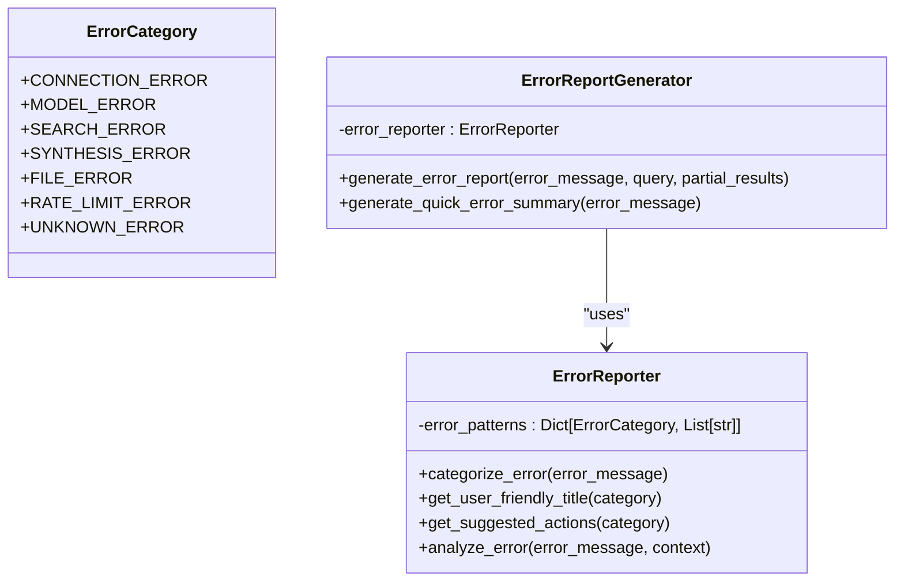
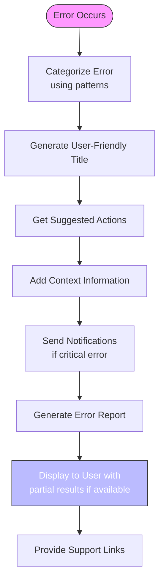
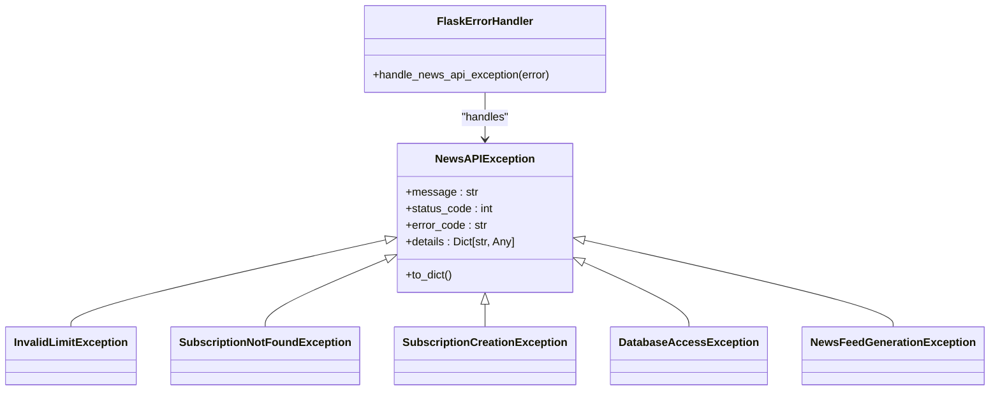

# Troubleshooting

<cite>
**Referenced Files in This Document**   
- [troubleshooting-openai-api-key.md](file://docs/troubleshooting-openai-api-key.md)
- [EXCEPTION_HANDLING.md](file://docs/news/EXCEPTION_HANDLING.md)
- [CODEQL_GUIDE.md](file://docs/security/CODEQL_GUIDE.md)
- [error_reporter.py](file://src/local_deep_research/error_handling/error_reporter.py)
- [report_generator.py](file://src/local_deep_research/error_handling/report_generator.py)
- [encrypted_db.py](file://src/local_deep_research/database/encrypted_db.py)
- [encryption_check.py](file://src/local_deep_research/database/encryption_check.py)
- [search_engine_base.py](file://src/local_deep_research/web_search_engines/search_engine_base.py)
- [rate_limiter.py](file://src/local_deep_research/security/rate_limiter.py)
- [log_utils.py](file://src/local_deep_research/utilities/log_utils.py)
</cite>

## Table of Contents
1. [Configuration Issues](#configuration-issues)
2. [Connectivity Issues](#connectivity-issues)
3. [Performance and Resource Utilization](#performance-and-resource-utilization)
4. [Error Handling and Reporting](#error-handling-and-reporting)
5. [Security and Authentication](#security-and-authentication)
6. [Database Problems](#database-problems)
7. [Debugging Tools and Techniques](#debugging-tools-and-techniques)

## Configuration Issues

This section addresses common configuration problems, particularly related to API key setup for LLM providers like OpenAI.

### OpenAI API Key Configuration

Common issues with OpenAI API key configuration include missing keys, invalid keys, rate limit errors, and settings persistence problems.

**Symptoms:**
- "No API key found" error messages
- Research fails to start
- "Invalid API key" or "401 Unauthorized" errors
- Settings not persisting after restart

**Root Causes:**
- API key not properly configured in settings
- Incorrect API key format (should start with `sk-`)
- Exceeded usage quota or rate limits
- Database permissions preventing settings persistence
- Provider setting not properly configured to use OpenAI

**Resolution Steps:**
1. **Verify API Key Configuration:**
   - Enter API key via web interface under Settings → OpenAI
   - Or set via environment variable: `export OPENAI_API_KEY=sk-your-api-key`
   - Ensure the LLM provider is set to "openai" in settings

2. **Validate API Key:**
   ```bash
   curl https://api.openai.com/v1/models \
     -H "Authorization: Bearer YOUR_API_KEY"
   ```

3. **Check Usage and Billing:**
   - Visit https://platform.openai.com/usage to verify available credits
   - Add payment method at https://platform.openai.com/account/billing if needed

4. **Ensure Settings Persistence:**
   - Use proper shutdown (Ctrl+C) to allow database write
   - Verify write permissions for the `encrypted_databases/` directory
   - Check that the API key is properly saved by retrieving it from settings

5. **Force Provider Selection:**
   ```python
   result = quick_summary(
       query="Test",
       settings_snapshot=settings_snapshot,
       provider="openai",
       model_name="gpt-3.5-turbo"
   )
   ```

**Section sources**
- [troubleshooting-openai-api-key.md](file://docs/troubleshooting-openai-api-key.md#L23-L250)

### Other LLM Provider Configuration

Similar configuration principles apply to other LLM providers. Ensure proper API keys, endpoints, and authentication are configured.

**Common Issues:**
- Invalid API keys
- Incorrect endpoint URLs
- Missing required authentication parameters
- Model name mismatches

**Resolution Steps:**
1. Verify provider-specific API key format and requirements
2. Check endpoint URLs for custom LLM services
3. Ensure all required authentication parameters are provided
4. Validate model names match available models

**Section sources**
- [troubleshooting-openai-api-key.md](file://docs/troubleshooting-openai-api-key.md#L204-L226)

## Connectivity Issues

This section addresses problems related to connecting with search engines and external services.

### Search Engine Connectivity

Issues connecting to search engines can prevent successful research execution.

**Symptoms:**
- "No search results found" messages
- "All search engines blocked or rate limited" errors
- Connection timeouts or refused connections
- "Failed to create search engine" errors

**Root Causes:**
- Search engine API keys not configured
- Network connectivity issues
- Rate limiting by search engine providers
- Incorrect search engine URLs or endpoints
- SearXNG container not running

**Resolution Steps:**
1. **Verify Search Engine Configuration:**
   - Ensure API keys are set for external search engines
   - Check that search engine URLs are correct
   - For SearXNG, verify the Docker container is running

2. **Test Search Engine Availability:**
   ```bash
   # Check if SearXNG is running
   docker ps | grep searxng
   # Start SearXNG if needed
   docker run -d -p 8080:8080 searxng/searxng
   ```

3. **Handle Rate Limiting:**
   - Enable LLM Rate Limiting in Settings → Rate Limiting
   - Wait before retrying if rate limited
   - Use a VPN if consistently rate limited

4. **Check Network Connectivity:**
   - Verify internet connection
   - Test connectivity to search engine endpoints
   - Ensure firewall is not blocking connections

**Section sources**
- [search_engine_base.py](file://src/local_deep_research/web_search_engines/search_engine_base.py#L140-L140)

### External Service Connectivity

Problems connecting to external services like Ollama, LM Studio, or other LLM providers.

**Symptoms:**
- "Connection refused" errors
- "POST predict EOF" errors
- "Host.docker.internal" connection issues
- "Max workers must be greater than 0" errors

**Root Causes:**
- LLM service not running
- Docker networking issues
- Incorrect service URLs or ports
- Firewall blocking connections

**Resolution Steps:**
1. **Verify Service Status:**
   - Start Ollama: `ollama serve`
   - Check if LM Studio is running
   - Verify service is listening on expected port

2. **Fix Docker Networking:**
   - On Mac/Windows: Replace `localhost` with `host.docker.internal`
   - On Linux: Use host IP address instead of localhost
   - Example: Change `http://localhost:1234` to `http://host.docker.internal:1234`

3. **Check Service Configuration:**
   - Verify port numbers (Ollama: 11434, LM Studio: 1234)
   - Ensure service URL in settings matches running service
   - Check firewall settings

**Section sources**
- [report_generator.py](file://src/local_deep_research/error_handling/report_generator.py#L320-L328)

## Performance and Resource Utilization

This section addresses performance bottlenecks and resource utilization problems.

### Rate Limiting and Throttling

API rate limits can significantly impact performance and research completion.

**Symptoms:**
- "429 Too Many Requests" errors
- "Resource exhausted" messages
- "Rate limit exceeded" warnings
- Slow response times

**Root Causes:**
- Exceeding API provider rate limits
- Insufficient rate limiting configuration
- High concurrency without proper throttling

**Resolution Steps:**
1. **Enable Rate Limiting:**
   - Enable LLM Rate Limiting in Settings → Rate Limiting
   - This allows the system to automatically learn and adapt to API limits

2. **Monitor Usage:**
   - Check usage against provider limits
   - Consider upgrading to paid API plans for higher limits

3. **Optimize Requests:**
   - Use different models temporarily to reduce load
   - Implement request batching where possible
   - Add delays between requests

**Section sources**
- [rate_limiter.py](file://src/local_deep_research/security/rate_limiter.py#L88-L114)

### Resource Utilization

High resource consumption can lead to performance degradation.

**Symptoms:**
- High CPU or memory usage
- Slow application response
- Database connection issues
- Process crashes due to resource exhaustion

**Root Causes:**
- Inefficient database queries
- Memory leaks in long-running processes
- High concurrency without proper resource management
- Large result sets overwhelming system resources

**Resolution Steps:**
1. **Optimize Database Performance:**
   - Ensure proper indexing
   - Use connection pooling
   - Implement query optimization

2. **Monitor Resource Usage:**
   - Track memory and CPU usage
   - Set up alerts for resource thresholds
   - Use performance monitoring tools

3. **Implement Resource Limits:**
   - Configure connection limits
   - Set memory limits for processes
   - Implement request timeouts

**Section sources**
- [encrypted_db.py](file://src/local_deep_research/database/encrypted_db.py#L38-L42)

## Error Handling and Reporting

This section explains the error handling and reporting mechanisms within the system.

### Error Categorization System

The system uses a comprehensive error categorization and reporting system to provide meaningful feedback.



**Diagram sources**
- [error_reporter.py](file://src/local_deep_research/error_handling/error_reporter.py#L12-L22)
- [report_generator.py](file://src/local_deep_research/error_handling/report_generator.py#L12-L15)

### Error Categories and Handling

The system categorizes errors into specific types with appropriate handling strategies.

**Error Categories:**
- **Connection Error**: Network connectivity issues
- **LLM Service Error**: Model or API key issues
- **Search Service Error**: Search engine failures
- **Report Generation Error**: Synthesis problems
- **File System Error**: Disk or permission issues
- **API Rate Limit Exceeded**: Quota limitations
- **Unexpected Error**: Unknown issues

**Handling Mechanism:**
1. Errors are categorized based on message patterns
2. User-friendly titles and suggested actions are generated
3. Notifications are sent for critical errors
4. Partial results are preserved when possible
5. Detailed error reports are generated

**Section sources**
- [error_reporter.py](file://src/local_deep_research/error_handling/error_reporter.py#L12-L384)

### Error Reporting Workflow

The error reporting system follows a structured workflow to provide comprehensive feedback.



**Diagram sources**
- [report_generator.py](file://src/local_deep_research/error_handling/report_generator.py#L26-L118)

**Section sources**
- [report_generator.py](file://src/local_deep_research/error_handling/report_generator.py#L26-L118)

## Security and Authentication

This section addresses security-related troubleshooting, including authentication failures and permission issues.

### Authentication Failures

Issues with authentication can prevent access to protected resources.

**Symptoms:**
- "No auth credentials found" errors
- "401 Unauthorized" messages
- "API key invalid" warnings
- Login failures

**Root Causes:**
- Missing or incorrect API keys
- Expired authentication tokens
- Incorrect username/password combinations
- Session expiration

**Resolution Steps:**
1. **Verify API Key Configuration:**
   - Set API key in web UI settings (not .env files)
   - Go to Settings → Advanced → enter API key
   - Ensure key format matches provider requirements

2. **Check Authentication Status:**
   - Verify user is properly logged in
   - Check session validity
   - Clear browser cache if needed

3. **Reset Credentials:**
   - Regenerate API keys if compromised
   - Reset password through proper channels
   - Clear stored credentials and re-authenticate

**Section sources**
- [error_reporter.py](file://src/local_deep_research/error_handling/error_reporter.py#L49-L56)

### Permission Issues

File and database permission problems can lead to access failures.

**Symptoms:**
- "Permission denied" errors
- "Attempt to write readonly database" messages
- "File not found" despite existence
- "Cannot write file" warnings

**Root Causes:**
- Insufficient file system permissions
- Read-only database files
- Running application without proper privileges
- File ownership issues

**Resolution Steps:**
1. **Check File Permissions:**
   - On Windows: Run as Administrator
   - On Linux/Mac: Check folder permissions with `ls -la`
   - Ensure write permissions for application directories

2. **Fix Database Permissions:**
   - Verify database file is not read-only
   - Check ownership of database files
   - Restart application with proper privileges

3. **Handle Corrupted Files:**
   - Delete and recreate database files if corrupted
   - Restore from backup if available
   - Check disk space availability

**Section sources**
- [report_generator.py](file://src/local_deep_research/error_handling/report_generator.py#L385-L387)

## Database Problems

This section addresses issues related to database operations, including encryption and schema migration.

### Database Encryption Issues

Problems with database encryption can compromise security and functionality.

**Symptoms:**
- "SQLCipher is not installed" errors
- "Running with UNENCRYPTED databases" warnings
- "SECURITY ERROR: SQLCipher is not installed!" messages
- Database connection failures

**Root Causes:**
- SQLCipher not installed or not functional
- Missing SQLCipher Python bindings
- Environment not allowing unencrypted databases
- Database initialization failures

**Resolution Steps:**
1. **Install SQLCipher:**
   ```bash
   # On Ubuntu/Debian
   sudo apt install sqlcipher libsqlcipher-dev
   # Reinstall project
   pdm install
   ```

2. **Verify SQLCipher Installation:**
   - Check if `sqlcipher` command is available
   - Test Python bindings with `import sqlcipher3`

3. **Handle Unencrypted Databases:**
   - Set `LDR_ALLOW_UNENCRYPTED=true` to allow unencrypted operation
   - Note: This is not recommended for production use
   - Install SQLCipher for secure operation

4. **Check Database Integrity:**
   - Use `PRAGMA quick_check` and `PRAGMA cipher_integrity_check`
   - Verify database connections
   - Check for HMAC failures

**Section sources**
- [encrypted_db.py](file://src/local_deep_research/database/encrypted_db.py#L68-L141)
- [encryption_check.py](file://src/local_deep_research/database/encryption_check.py#L11-L48)

### Schema Migration Issues

Database schema changes can cause compatibility problems.

**Symptoms:**
- "Database migration failed" errors
- "Table not found" messages
- "Column missing" warnings
- Application crashes on database operations

**Root Causes:**
- Incomplete database initialization
- Schema version mismatches
- Migration scripts not applied
- Database corruption

**Resolution Steps:**
1. **Run Database Initialization:**
   - Ensure `initialize_database()` is called
   - Check for missing tables
   - Verify schema version

2. **Apply Migrations:**
   - Run migration scripts in order
   - Check migration status
   - Handle migration conflicts

3. **Recover from Corruption:**
   - Use database backup if available
   - Recreate database from scratch
   - Restore from known good state

**Section sources**
- [encrypted_db.py](file://src/local_deep_research/database/encrypted_db.py#L417-L423)

## Debugging Tools and Techniques

This section provides debugging tools and techniques for diagnosing issues.

### Log Analysis

Comprehensive logging is available for debugging and troubleshooting.

**Log Configuration:**
- Multiple log sinks: console, database, frontend, file
- Research-specific logging with UUID context
- Different log levels for various severity
- Structured log entries with metadata

**Accessing Logs:**
1. **Frontend Log Panel:**
   - Accessible through web interface
   - Filter by log level and research ID
   - Real-time updates during research

2. **File Logs:**
   - Enable with `LDR_ENABLE_FILE_LOGGING=true`
   - Located in `logs/` directory
   - Rotated at 10MB with 7-day retention

3. **Database Logs:**
   - Stored in `ResearchLog` table
   - Include timestamp, message, module, function
   - Associated with research ID for context

**Section sources**
- [log_utils.py](file://src/local_deep_research/utilities/log_utils.py#L259-L306)

### Diagnostic Scripts

Various scripts are available for testing and diagnosing issues.

**Available Scripts:**
- **OpenAI API Key Test:**
  ```bash
  python tests/test_openai_api_key_e2e.py \
    --username YOUR_USERNAME \
    --password YOUR_PASSWORD \
    --api-key YOUR_OPENAI_API_KEY
  ```

- **Health Check:**
  ```bash
  python tests/health_check/run_quick_health_check.py
  ```

- **CodeQL Analysis:**
  ```bash
  # Create databases
  codeql database create --language=python --source-root . ./python-db
  # Run analysis
  codeql database analyze ./python-db python-security-and-quality.qls --format=sarif-latest --output=python-results.sarif
  ```

**Section sources**
- [troubleshooting-openai-api-key.md](file://docs/troubleshooting-openai-api-key.md#L231-L233)
- [CODEQL_GUIDE.md](file://docs/security/CODEQL_GUIDE.md#L49-L58)

### Exception Handling

Structured exception handling provides consistent error responses.



**Diagram sources**
- [EXCEPTION_HANDLING.md](file://docs/news/EXCEPTION_HANDLING.md#L18-L22)

**Section sources**
- [EXCEPTION_HANDLING.md](file://docs/news/EXCEPTION_HANDLING.md#L9-L222)